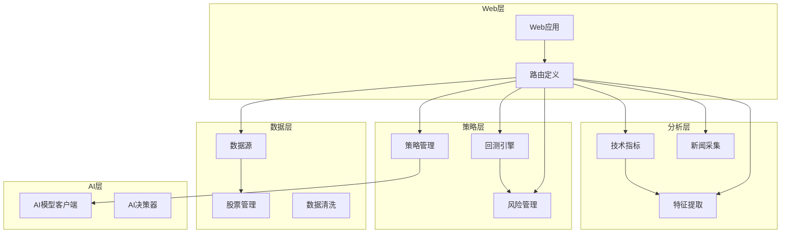
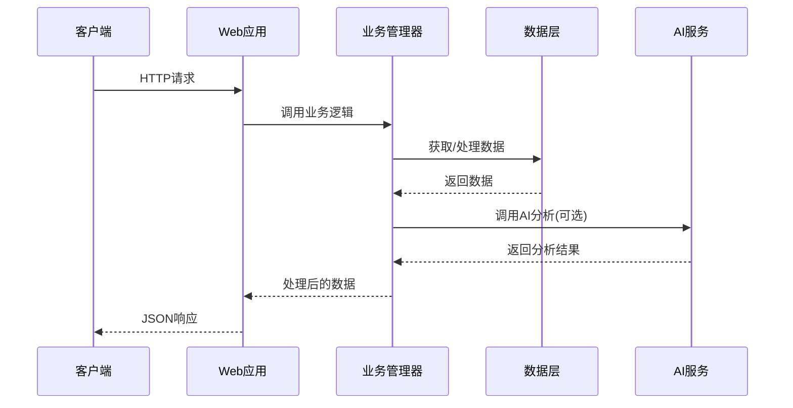
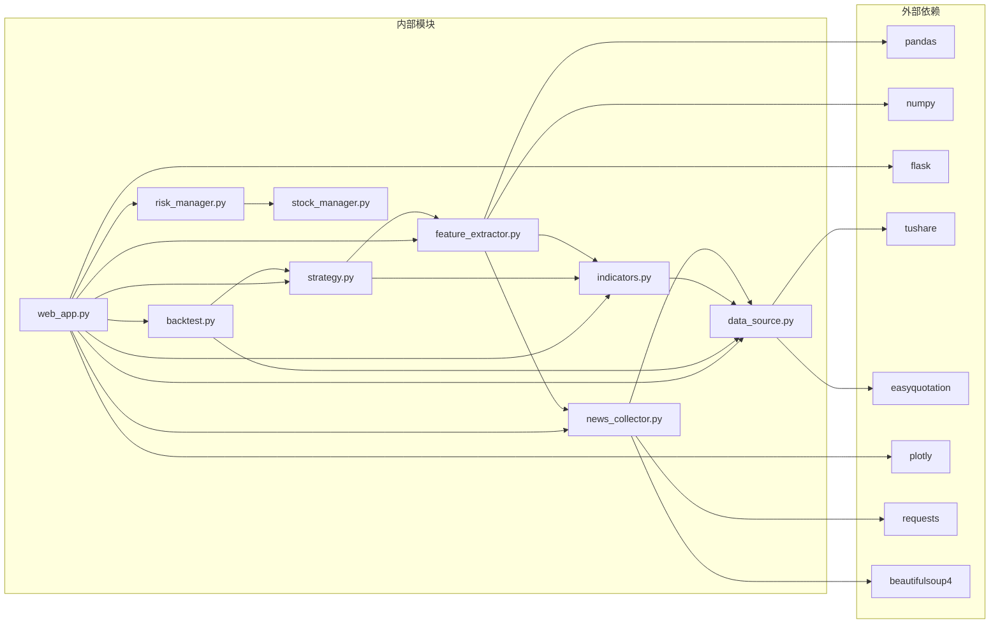

# API参考

<cite>
**本文档引用的文件**
- [web_app.py](file://quant_system/web_app.py)
- [strategy.py](file://quant_system/strategy.py)
- [backtest.py](file://quant_system/backtest.py)
- [risk_manager.py](file://quant_system/risk_manager.py)
- [indicators.py](file://quant_system/indicators.py)
- [data_source.py](file://quant_system/data_source.py)
- [stock_manager.py](file://quant_system/stock_manager.py)
- [feature_extractor.py](file://quant_system/feature_extractor.py)
- [news_collector.py](file://quant_system/news_collector.py)
- [config.yaml](file://config.yaml)
- [stocks.yaml](file://config/stocks.yaml)
- [main.py](file://main.py)
- [requirements.txt](file://requirements.txt)
</cite>

## 目录
1. [简介](#简介)
2. [项目结构](#项目结构)
3. [核心组件](#核心组件)
4. [架构概览](#架构概览)
5. [详细组件分析](#详细组件分析)
6. [依赖关系分析](#依赖关系分析)
7. [性能考虑](#性能考虑)
8. [故障排除指南](#故障排除指南)
9. [结论](#结论)

## 简介

vibequation量化交易系统是一个功能完整的Python量化交易平台，提供了全面的股票数据获取、技术指标计算、策略回测、风险管理和AI决策支持功能。系统采用Flask框架构建RESTful API，支持实时数据获取、历史数据分析、策略执行和回测结果展示。

本API参考文档详细记录了系统提供的所有RESTful API端点，包括：
- 股票数据API：获取股票基本信息、历史数据、技术指标
- 技术指标API：计算和查询各种技术分析指标
- 策略执行API：运行量化策略和AI决策
- 回测结果API：执行策略回测和获取回测报告
- 风险报告API：获取投资组合风险信息
- 新闻情感API：获取股票相关新闻和情感分析

## 项目结构

vibequation量化交易系统采用模块化架构设计，主要包含以下核心模块：



**图表来源**
- [web_app.py:30-466](file://quant_system/web_app.py#L30-L466)
- [data_source.py:300-423](file://quant_system/data_source.py#L300-L423)
- [strategy.py:318-556](file://quant_system/strategy.py#L318-L556)

**章节来源**
- [web_app.py:1-466](file://quant_system/web_app.py#L1-L466)
- [main.py:1-365](file://main.py#L1-L365)

## 核心组件

### Web应用层
Web应用层基于Flask框架构建，提供RESTful API接口和Web页面展示功能。主要负责：
- HTTP请求路由处理
- 数据格式化和响应
- 错误处理和日志记录
- Web页面模板渲染

### 数据管理层
数据管理层负责股票数据的获取、存储和管理：
- 支持Tushare和Easyquotation两个数据源
- 统一历史数据和实时数据接口
- 数据缓存和本地存储
- 股票代码标准化处理

### 分析管理层
分析管理层提供技术分析和特征提取功能：
- 多种技术指标计算（RSI、MACD、布林带等）
- AI驱动的特征分析
- 新闻情感分析
- 指标数据持久化

### 策略管理层
策略管理层实现量化策略的执行和管理：
- 多种预设策略（RSI、MACD、均线等）
- 自然语言策略解析
- 策略回测引擎
- 风险控制管理

**章节来源**
- [web_app.py:27-466](file://quant_system/web_app.py#L27-L466)
- [data_source.py:24-423](file://quant_system/data_source.py#L24-L423)
- [indicators.py:21-500](file://quant_system/indicators.py#L21-L500)

## 架构概览

系统采用分层架构设计，各层职责明确，耦合度低：



**图表来源**
- [web_app.py:43-407](file://quant_system/web_app.py#L43-L407)
- [strategy.py:462-556](file://quant_system/strategy.py#L462-L556)

### API版本管理
系统采用语义化版本控制，当前版本为1.0.0：
- 主版本号：1（重大架构变更）
- 次版本号：0（功能新增）
- 修订号：0（bug修复）

### 认证机制
系统目前采用无认证机制，所有API端点均可直接访问。建议在生产环境中添加：
- API密钥认证
- OAuth2.0授权
- IP白名单限制

**章节来源**
- [quant_system/__init__.py:22-24](file://quant_system/__init__.py#L22-L24)
- [config.yaml:3-8](file://config.yaml#L3-L8)

## 详细组件分析

### 股票数据API

#### 获取股票列表
- **HTTP方法**: GET
- **URL**: `/api/stocks`
- **功能**: 返回系统中配置的所有股票信息
- **响应**: 股票信息数组，包含代码、名称、市场、类型等字段

#### 获取股票历史数据
- **HTTP方法**: GET
- **URL**: `/api/stock/{code}/data`
- **参数**:
  - `start`: 开始日期 (YYYYMMDD)，默认为一年前
  - `end`: 结束日期 (YYYYMMDD)，默认为今天
  - `freq`: 数据频率 (day/week/month)，默认为day
- **响应**: 历史数据数组，包含日期、开盘价、最高价、最低价、收盘价、成交量等

#### 获取股票K线图数据
- **HTTP方法**: GET
- **URL**: `/api/stock/{code}/chart`
- **参数**:
  - `start`: 开始日期，默认为180天前
  - `end`: 结束日期，默认为今天
- **响应**: Plotly图表JSON数据，包含K线图和均线

**章节来源**
- [web_app.py:43-163](file://quant_system/web_app.py#L43-L163)
- [data_source.py:307-395](file://quant_system/data_source.py#L307-L395)

### 技术指标API

#### 获取股票技术指标
- **HTTP方法**: GET
- **URL**: `/api/stock/{code}/indicators`
- **参数**:
  - `freq`: 数据频率，默认为day
- **响应**: 技术指标数据数组，包含RSI、MACD、布林带、KDJ等指标

#### 获取最新信号
- **HTTP方法**: GET
- **URL**: `/api/stock/{code}/signals`
- **参数**:
  - `freq`: 数据频率，默认为day
- **响应**: 综合信号字典，包含RSI状态、MACD趋势、均线排列等

**章节来源**
- [web_app.py:80-105](file://quant_system/web_app.py#L80-L105)
- [indicators.py:330-495](file://quant_system/indicators.py#L330-L495)

### 策略执行API

#### 获取策略列表
- **HTTP方法**: GET
- **URL**: `/api/strategies`
- **响应**: 策略名称数组

#### 获取策略详情
- **HTTP方法**: GET
- **URL**: `/api/strategy/{name}`
- **响应**: 策略详细信息，包含规则、描述等

#### 运行策略
- **HTTP方法**: POST
- **URL**: `/api/strategy/run`
- **请求体**:
  ```json
  {
    "code": "600519",
    "strategy": "rsi"
  }
  ```
- **响应**: 策略决策结果，包含操作建议、仓位比例、置信度等

#### AI决策
- **HTTP方法**: POST
- **URL**: `/api/ai/decision`
- **请求体**:
  ```json
  {
    "code": "600519",
    "strategy_description": "基于技术指标的交易策略"
  }
  ```
- **响应**: AI生成的交易决策

**章节来源**
- [web_app.py:165-407](file://quant_system/web_app.py#L165-L407)
- [strategy.py:318-556](file://quant_system/strategy.py#L318-L556)

### 回测结果API

#### 运行回测
- **HTTP方法**: POST
- **URL**: `/api/backtest/run`
- **请求体**:
  ```json
  {
    "code": "600519",
    "strategy": "rsi",
    "start_date": "20230101",
    "end_date": "20231231",
    "initial_capital": 1000000
  }
  ```
- **响应**: 回测结果，包含收益指标、风险指标、交易统计等

#### 获取回测图表
- **HTTP方法**: POST
- **URL**: `/api/backtest/chart`
- **请求体**: 与回测相同
- **响应**: Plotly图表JSON，显示权益曲线对比

**章节来源**
- [web_app.py:210-312](file://quant_system/web_app.py#L210-L312)
- [backtest.py:66-283](file://quant_system/backtest.py#L66-L283)

### 风险报告API

#### 获取投资组合风险
- **HTTP方法**: GET
- **URL**: `/api/risk/portfolio`
- **响应**: 组合风险指标，包含总资金、可用资金、仓位比例、风险等级等

#### 获取持仓信息
- **HTTP方法**: GET
- **URL**: `/api/risk/positions`
- **响应**: 持仓汇总信息数组

**章节来源**
- [web_app.py:314-336](file://quant_system/web_app.py#L314-L336)
- [risk_manager.py:241-319](file://quant_system/risk_manager.py#L241-L319)

### 新闻情感API

#### 获取股票新闻
- **HTTP方法**: GET
- **URL**: `/api/news/{code}`
- **响应**: 新闻数据数组，包含标题、链接、发布时间等

#### 获取情感分析
- **HTTP方法**: GET
- **URL**: `/api/sentiment/{code}`
- **响应**: 每日情感汇总，包含情感分数、积极概率、新闻数量等

**章节来源**
- [web_app.py:338-366](file://quant_system/web_app.py#L338-L366)
- [news_collector.py:24-465](file://quant_system/news_collector.py#L24-L465)

### 特征分析API

#### 获取特征分析
- **HTTP方法**: GET
- **URL**: `/api/features/{code}`
- **响应**: AI特征分析结果，包含策略类型、置信度、推荐指标等

**章节来源**
- [web_app.py:368-381](file://quant_system/web_app.py#L368-L381)
- [feature_extractor.py:99-321](file://quant_system/feature_extractor.py#L99-L321)

## 依赖关系分析

系统依赖关系清晰，模块间耦合度低：



**图表来源**
- [requirements.txt:1-29](file://requirements.txt#L1-L29)
- [web_app.py:17-26](file://quant_system/web_app.py#L17-L26)

### 关键依赖说明

#### 数据处理依赖
- **pandas**: 数据分析和处理
- **numpy**: 数值计算
- **tushare**: 专业金融数据接口
- **easyquotation**: 实时行情数据

#### Web和可视化依赖
- **flask**: Web框架
- **plotly**: 交互式图表
- **requests**: HTTP请求
- **beautifulsoup4**: HTML解析

**章节来源**
- [requirements.txt:1-29](file://requirements.txt#L1-L29)

## 性能考虑

### 数据缓存策略
系统实现了多层次的数据缓存机制：
- **技术指标缓存**: 计算结果持久化到CSV文件
- **新闻数据缓存**: 本地存储避免重复抓取
- **特征数据缓存**: AI分析结果本地保存

### API性能优化
- **批量数据处理**: 支持多股票同时处理
- **增量更新**: 仅更新新数据避免全量重算
- **内存管理**: 及时释放不再使用的数据

### 并发处理
- **异步任务**: 支持后台数据更新
- **限流控制**: Tushare API调用频率限制
- **错误重试**: 网络异常自动重试机制

## 故障排除指南

### 常见错误及解决方案

#### 数据获取失败
**问题**: Tushare API调用失败
**原因**: Token配置错误或网络问题
**解决**: 检查config.yaml中的tushare_token配置

#### 技术指标计算异常
**问题**: 指标数据为空
**原因**: 历史数据缺失或计算错误
**解决**: 手动触发数据更新或检查数据源连接

#### AI模型调用失败
**问题**: ModelScope API调用失败
**原因**: Token过期或网络问题
**解决**: 更新modelscope_token或使用本地模型

#### Web服务启动失败
**问题**: 端口被占用
**原因**: 8080端口已被其他进程占用
**解决**: 修改config.yaml中的端口号或关闭占用进程

### 调试工具

#### 日志查看
系统提供详细的日志记录：
- **日志级别**: INFO/DEBUG/WARNING/ERROR
- **日志文件**: ./logs/quant_system.log
- **日志轮转**: 支持文件大小限制和备份

#### 命令行工具
系统提供丰富的命令行工具：
- `python main.py update-data`: 更新历史数据
- `python main.py update-indicators`: 更新技术指标
- `python main.py backtest`: 运行策略回测
- `python main.py web`: 启动Web服务

**章节来源**
- [config.yaml:82-88](file://config.yaml#L82-L88)
- [main.py:261-365](file://main.py#L261-L365)

## 结论

vibequation量化交易系统提供了完整的量化交易API解决方案，具有以下特点：

### 优势
- **功能完整**: 覆盖量化交易的全流程需求
- **模块化设计**: 清晰的分层架构便于维护和扩展
- **性能优化**: 多层次缓存和异步处理机制
- **易于使用**: 提供丰富的API和命令行工具

### 改进建议
- **增强安全性**: 添加API认证和访问控制
- **扩展监控**: 增加系统健康检查和性能监控
- **API文档**: 自动生成OpenAPI规范文档
- **测试覆盖**: 增加单元测试和集成测试

### 适用场景
- 个人量化交易研究
- 金融机构风控系统
- 教育培训机构教学
- 量化策略开发平台

系统为量化交易开发者提供了坚实的基础，可以根据具体需求进行定制和扩展。