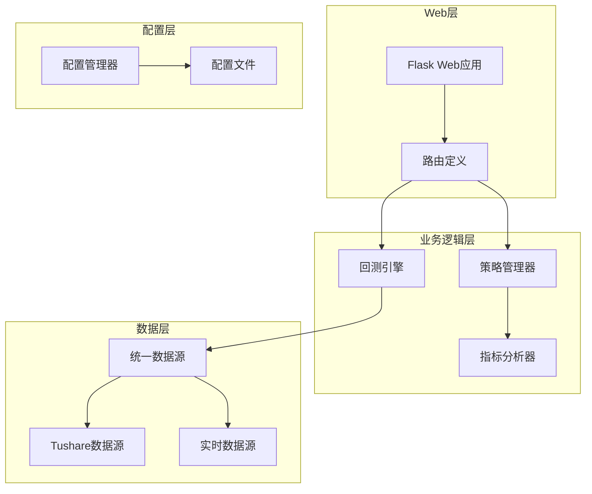
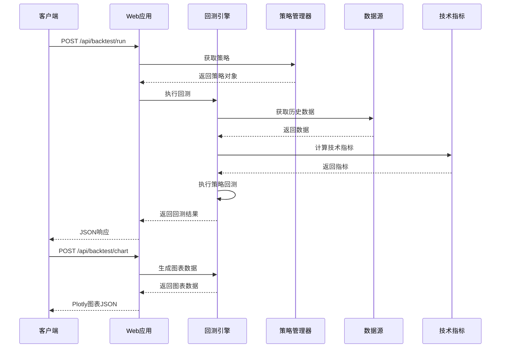
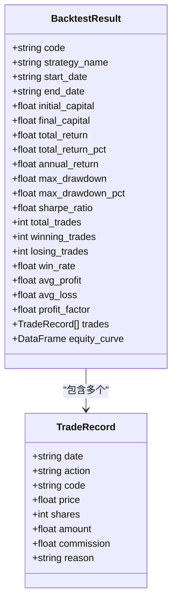
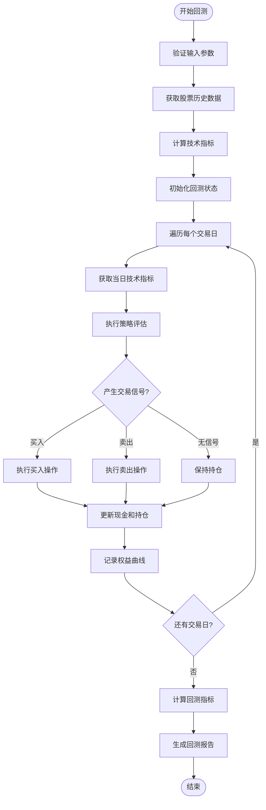
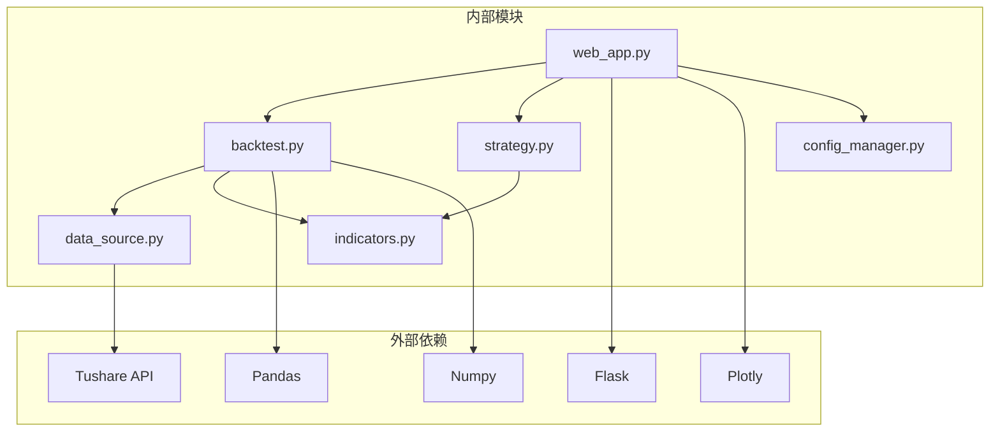

# 回测API

<cite>
**本文档引用的文件**
- [web_app.py](file://quant_system/web_app.py)
- [backtest.py](file://quant_system/backtest.py)
- [strategy.py](file://quant_system/strategy.py)
- [indicators.py](file://quant_system/indicators.py)
- [data_source.py](file://quant_system/data_source.py)
- [config_manager.py](file://quant_system/config_manager.py)
- [config.yaml](file://config.yaml)
- [backtest.html](file://quant_system/templates/backtest.html)
</cite>

## 目录
1. [简介](#简介)
2. [项目结构](#项目结构)
3. [核心组件](#核心组件)
4. [架构概览](#架构概览)
5. [详细组件分析](#详细组件分析)
6. [依赖关系分析](#依赖关系分析)
7. [性能考虑](#性能考虑)
8. [故障排除指南](#故障排除指南)
9. [结论](#结论)

## 简介

vibequation量化交易系统的回测API提供了完整的策略回测功能，支持单股票和多股票回测。该系统基于Flask构建，提供RESTful接口来执行策略回测并生成可视化图表。回测引擎集成了技术指标计算、策略执行、交易模拟和结果分析等功能。

## 项目结构

系统采用模块化设计，主要包含以下核心模块：



**图表来源**
- [web_app.py:33-37](file://quant_system/web_app.py#L33-L37)
- [backtest.py:66-74](file://quant_system/backtest.py#L66-L74)
- [strategy.py:318-324](file://quant_system/strategy.py#L318-L324)

**章节来源**
- [web_app.py:1-800](file://quant_system/web_app.py#L1-L800)
- [backtest.py:1-456](file://quant_system/backtest.py#L1-L456)
- [strategy.py:1-556](file://quant_system/strategy.py#L1-L556)

## 核心组件

### 回测引擎 (BacktestEngine)

回测引擎是系统的核心组件，负责执行完整的回测流程：

- **输入参数**: 股票代码、策略对象、起止日期、初始资金
- **处理流程**: 数据获取 → 指标计算 → 策略执行 → 交易模拟 → 结果分析
- **输出结果**: 完整的回测报告和可视化数据

### 策略管理器 (StrategyManager)

管理多种预定义策略和用户自定义策略：

- **内置策略**: RSI策略、MACD策略、均线策略、综合策略
- **策略规则**: 支持条件表达式、动作类型、仓位比例
- **策略执行**: 实时策略评估和决策生成

### 技术指标系统

提供全面的技术指标计算能力：

- **RSI指标**: 多周期RSI计算和历史百分位分析
- **MACD指标**: 快慢线计算和柱状图分析
- **移动平均线**: 多周期均线计算
- **布林带**: 布林带位置分析
- **KDJ指标**: 随机指标计算

**章节来源**
- [backtest.py:66-374](file://quant_system/backtest.py#L66-L374)
- [strategy.py:318-460](file://quant_system/strategy.py#L318-L460)
- [indicators.py:21-273](file://quant_system/indicators.py#L21-L273)

## 架构概览



**图表来源**
- [web_app.py:214-315](file://quant_system/web_app.py#L214-L315)
- [backtest.py:75-282](file://quant_system/backtest.py#L75-L282)

## 详细组件分析

### 回测API接口定义

#### 运行回测接口 (/api/backtest/run)

**HTTP方法**: POST  
**请求体参数**:

| 参数名 | 类型 | 必填 | 描述 | 默认值 |
|--------|------|------|------|--------|
| code | string | 是 | 股票代码 | - |
| strategy | string | 是 | 策略名称 | - |
| start_date | string | 是 | 开始日期 (YYYYMMDD) | - |
| end_date | string | 是 | 结束日期 (YYYYMMDD) | - |
| initial_capital | number | 否 | 初始资金 | 1000000 |

**响应数据结构**:



**图表来源**
- [backtest.py:39-64](file://quant_system/backtest.py#L39-L64)
- [backtest.py:26-37](file://quant_system/backtest.py#L26-L37)

**响应示例**:
```json
{
    "code": "600519",
    "strategy_name": "RSI策略",
    "start_date": "20230101",
    "end_date": "20231231",
    "initial_capital": 1000000,
    "final_capital": 125000,
    "total_return_pct": 25.00,
    "annual_return": 12.50,
    "max_drawdown_pct": -8.50,
    "sharpe_ratio": 1.25,
    "total_trades": 25,
    "win_rate": 60.00,
    "profit_factor": 1.85,
    "trades": [
        {
            "date": "20230115",
            "action": "buy",
            "shares": 100,
            "price": 120.50,
            "amount": 12050.00,
            "reason": "RSI超卖信号"
        }
    ]
}
```

#### 获取回测图表接口 (/api/backtest/chart)

**HTTP方法**: POST  
**请求体参数**: 与运行回测接口相同

**响应数据结构**:
返回Plotly图表的JSON格式，包含两条曲线：
- 权益曲线 (蓝色实线)
- 基准曲线 (灰色虚线，买入持有策略)

**图表数据格式**:
```json
{
    "data": [
        {
            "x": ["2023-01-01", "2023-01-02", ...],
            "y": [1000000, 101200, ...],
            "name": "权益",
            "type": "scatter",
            "mode": "lines"
        },
        {
            "x": ["2023-01-01", "2023-01-02", ...],
            "y": [1000000, 99800, ...],
            "name": "基准（买入持有）",
            "type": "scatter",
            "mode": "lines",
            "line": {"dash": "dash"}
        }
    ],
    "layout": {
        "title": "600519 回测权益曲线 - RSI策略",
        "yaxis": {"title": "资金"},
        "xaxis": {"title": "日期"},
        "height": 500
    }
}
```

**章节来源**
- [web_app.py:214-266](file://quant_system/web_app.py#L214-L266)
- [web_app.py:268-315](file://quant_system/web_app.py#L268-L315)

### 回测结果指标说明

#### 收益指标

| 指标名称 | 计算公式 | 含义 | 用途 |
|----------|----------|------|------|
| 总收益率 | (最终资金 - 初始资金) / 初始资金 × 100% | 整个回测期间的总收益百分比 | 衡量整体盈利能力 |
| 年化收益率 | ((最终资金/初始资金)^(252/交易日数) - 1) × 100% | 年化收益水平 | 比较不同时间跨度的收益 |
| 夏普比率 | 日收益率均值 / 日收益率标准差 × √252 | 风险调整后的收益 | 衡量收益风险比 |

#### 风险指标

| 指标名称 | 计算方法 | 含义 | 用途 |
|----------|----------|------|------|
| 最大回撤 | max((当日权益 - 当日净值高点) / 当日净值高点) × 100% | 最大资金回撤幅度 | 衡量最大潜在损失 |
| 最大回撤百分比 | 同上 | 以百分比表示的最大回撤 | 比较不同策略的风险水平 |

#### 交易统计指标

| 指标名称 | 计算方法 | 含义 | 用途 |
|----------|----------|------|------|
| 胜率 | 盈利交易次数 / 总交易次数 × 100% | 盈利交易的比例 | 衡量策略的准确性 |
| 盈亏比 | 总盈利 / 总亏损 | 平均盈利与平均亏损的比值 | 衡量策略的效率 |
| 平均盈利 | 盈利交易的平均收益率 | 单次盈利的平均水平 | 评估单次交易质量 |
| 平均亏损 | 亏损交易的平均收益率 | 单次亏损的平均水平 | 评估单次交易风险 |

**章节来源**
- [backtest.py:205-282](file://quant_system/backtest.py#L205-L282)

### 回测执行流程



**图表来源**
- [backtest.py:75-282](file://quant_system/backtest.py#L75-L282)

**章节来源**
- [backtest.py:114-203](file://quant_system/backtest.py#L114-L203)

### 策略执行机制

策略执行采用条件评估机制：

1. **条件解析**: 将自然语言条件转换为可执行的Python表达式
2. **指标评估**: 在安全环境中评估技术指标条件
3. **信号聚合**: 统计买入和卖出信号的数量
4. **决策生成**: 基于信号数量和权重生成最终交易决策

**策略规则格式**:
```python
StrategyRule(
    condition="rsi_6 < 30 and close > ma_20",  # 条件表达式
    action="buy",                           # 操作类型
    position_ratio=0.5,                     # 仓位比例
    reason="RSI超卖且价格在均线上方"       # 规则说明
)
```

**章节来源**
- [strategy.py:150-300](file://quant_system/strategy.py#L150-L300)
- [backtest.py:284-347](file://quant_system/backtest.py#L284-L347)

## 依赖关系分析



**图表来源**
- [web_app.py:12-26](file://quant_system/web_app.py#L12-L26)
- [backtest.py:14-21](file://quant_system/backtest.py#L14-L21)

**章节来源**
- [web_app.py:1-800](file://quant_system/web_app.py#L1-L800)
- [backtest.py:1-456](file://quant_system/backtest.py#L1-L456)

## 性能考虑

### 数据处理优化

1. **缓存机制**: 技术指标和历史数据采用文件缓存，避免重复计算
2. **批量处理**: 支持多股票并行回测，提高处理效率
3. **内存管理**: 使用DataFrame进行向量化计算，减少循环开销

### 策略执行优化

1. **条件评估**: 使用安全的eval环境，避免动态编译开销
2. **指标预计算**: 在回测前统一计算所需技术指标
3. **交易模拟**: 简化的交易执行逻辑，减少不必要的计算

### 配置优化

系统支持通过配置文件调整关键参数：
- **初始资金**: 默认1000000元
- **手续费率**: 默认0.03%
- **滑点**: 默认0.1%

**章节来源**
- [config.yaml:63-68](file://config.yaml#L63-L68)
- [config_manager.py:141-147](file://config_manager.py#L141-L147)

## 故障排除指南

### 常见错误及解决方案

| 错误类型 | 错误码 | 可能原因 | 解决方案 |
|----------|--------|----------|----------|
| 参数缺失 | 400 | 缺少必需参数 | 确保提供code、strategy、start_date、end_date |
| 策略不存在 | 404 | 策略名称错误 | 检查策略列表或创建新策略 |
| 数据获取失败 | 500 | Tushare API访问问题 | 检查网络连接和Token配置 |
| 回测无数据 | 404 | 日期范围内无数据 | 调整日期范围或检查股票代码 |

### 调试建议

1. **检查配置**: 确认config.yaml中的Tushare Token和数据目录配置
2. **验证数据**: 确认股票代码有效且在指定日期范围内有数据
3. **查看日志**: 检查系统日志获取详细错误信息
4. **测试策略**: 先使用内置策略进行测试

**章节来源**
- [web_app.py:225-265](file://quant_system/web_app.py#L225-L265)

## 结论

vibequation量化交易系统的回测API提供了完整的策略回测解决方案，具有以下特点：

1. **功能完整**: 支持多种技术指标、策略类型和回测模式
2. **易于使用**: RESTful接口设计简洁，参数配置直观
3. **结果丰富**: 提供详细的回测指标和可视化图表
4. **扩展性强**: 模块化设计便于功能扩展和定制

该系统适合量化研究人员和交易员进行策略开发、测试和优化，为实盘交易提供可靠的回测支持。