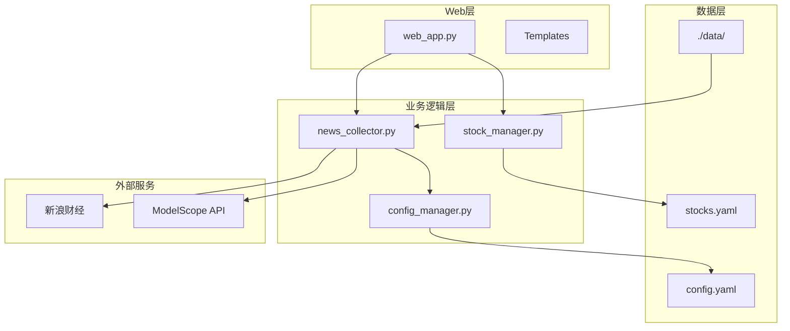
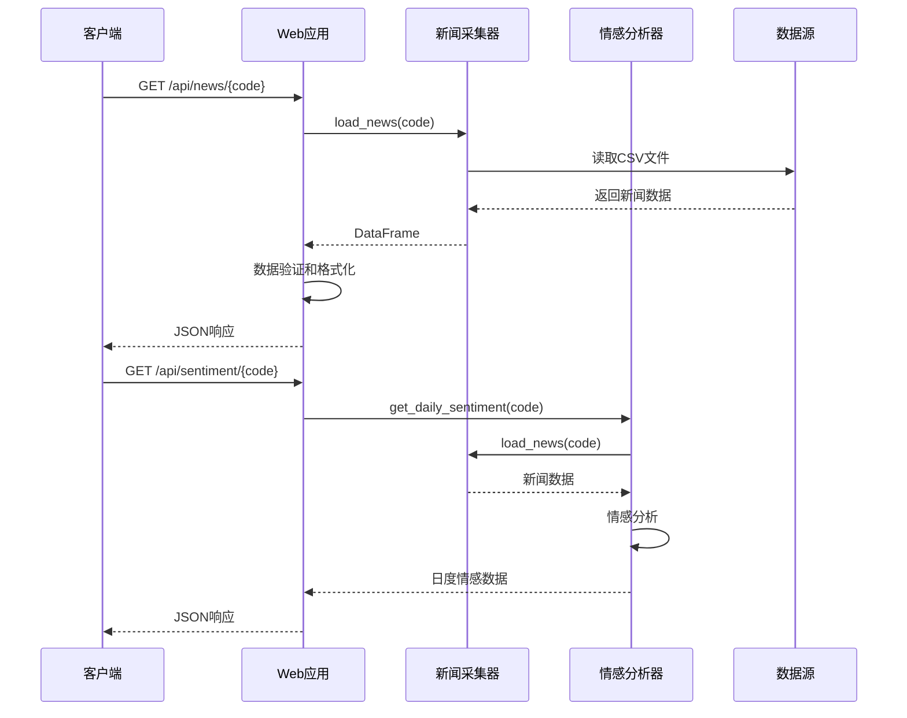
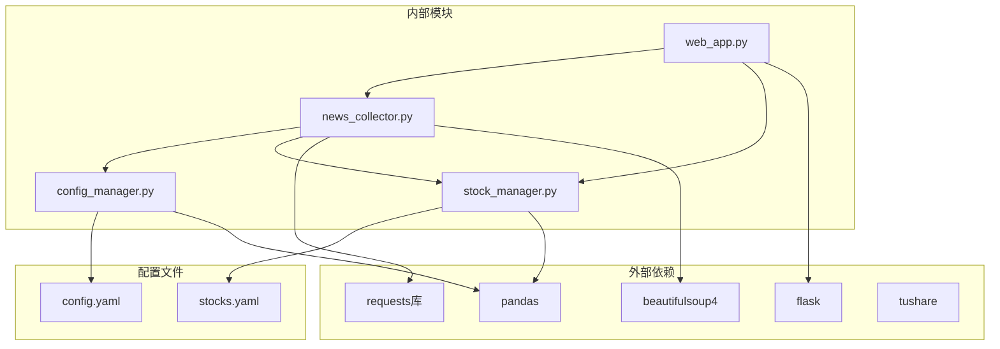

# 新闻情感API

<cite>
**本文档引用的文件**
- [web_app.py](file://quant_system/web_app.py)
- [news_collector.py](file://quant_system/news_collector.py)
- [config_manager.py](file://quant_system/config_manager.py)
- [stock_manager.py](file://quant_system/stock_manager.py)
- [config.yaml](file://config.yaml)
- [stocks.yaml](file://config/stocks.yaml)
- [600519_daily.csv](file://data/history/600519_daily.csv)
</cite>

## 目录
1. [简介](#简介)
2. [项目结构](#项目结构)
3. [核心组件](#核心组件)
4. [架构概览](#架构概览)
5. [详细组件分析](#详细组件分析)
6. [依赖关系分析](#依赖关系分析)
7. [性能考虑](#性能考虑)
8. [故障排除指南](#故障排除指南)
9. [结论](#结论)

## 简介

本文档为vibequation量化交易系统的新闻情感API提供完整的接口文档。该系统集成了新闻采集、情感分析和可视化功能，为量化交易提供重要的市场情绪数据支持。

vibequation系统基于Flask构建Web服务，提供RESTful API接口，支持新闻数据获取和情感分析结果查询。系统采用模块化设计，包含新闻采集器、情感分析器、数据存储和Web接口等核心组件。

## 项目结构

系统采用清晰的模块化架构，主要文件组织如下：



**图表来源**
- [web_app.py:497-525](file://quant_system/web_app.py#L497-L525)
- [news_collector.py:24-465](file://quant_system/news_collector.py#L24-L465)
- [config_manager.py:12-178](file://quant_system/config_manager.py#L12-L178)

**章节来源**
- [web_app.py:1-900](file://quant_system/web_app.py#L1-L900)
- [news_collector.py:1-465](file://quant_system/news_collector.py#L1-L465)
- [config_manager.py:1-178](file://quant_system/config_manager.py#L1-L178)

## 核心组件

### Web应用层

Web应用层基于Flask框架，提供RESTful API接口和Web界面。主要负责：
- 路由定义和请求处理
- 数据验证和错误处理
- 响应格式化和JSON序列化

### 新闻采集与情感分析模块

该模块是系统的核心功能组件，包含三个主要类：

1. **NewsCollector**: 负责从新浪财经采集股票相关新闻
2. **SentimentAnalyzer**: 提供情感分析功能，支持本地规则和ModelScope API两种模式
3. **NewsSentimentPipeline**: 完整的新闻情感分析流水线

### 配置管理系统

提供统一的配置管理功能，支持：
- YAML配置文件读取
- 动态配置项访问
- 数据目录自动创建
- Token管理

**章节来源**
- [web_app.py:497-550](file://quant_system/web_app.py#L497-L550)
- [news_collector.py:24-465](file://quant_system/news_collector.py#L24-L465)
- [config_manager.py:12-178](file://quant_system/config_manager.py#L12-L178)

## 架构概览

系统采用分层架构设计，各层职责明确：



**图表来源**
- [web_app.py:497-550](file://quant_system/web_app.py#L497-L550)
- [news_collector.py:187-400](file://quant_system/news_collector.py#L187-L400)

## 详细组件分析

### 新闻采集器 (NewsCollector)

NewsCollector负责从新浪财经采集股票相关新闻，具有以下特性：

#### 抓取机制
- **数据源**: 新浪财经个股新闻页面
- **时间范围**: 默认追踪最近30天的新闻
- **翻页机制**: 支持最多10页的新闻抓取
- **数据格式**: GB2312编码，BeautifulSoup解析

#### 存储格式
新闻数据以CSV格式存储，包含以下字段：
- `code`: 股票代码
- `name`: 股票名称  
- `date`: 新闻日期
- `title`: 新闻标题
- `url`: 新闻链接
- `fetch_time`: 抓取时间

#### 缓存策略
- **本地缓存**: CSV文件存储
- **去重机制**: 基于日期和标题的重复检测
- **增量更新**: 自动合并新旧数据

**章节来源**
- [news_collector.py:43-155](file://quant_system/news_collector.py#L43-L155)
- [news_collector.py:156-203](file://quant_system/news_collector.py#L156-L203)

### 情感分析器 (SentimentAnalyzer)

SentimentAnalyzer提供双模式情感分析功能：

#### 模型选择
- **ModelScope模式**: 使用云端AI模型进行分析
- **本地规则模式**: 基于关键词匹配的规则引擎

#### 情感评分标准
情感分析输出包含以下指标：
- **sentiment_score**: 情感分数 (-1 到 1)
- **sentiment_label**: 情感标签 (positive/negative/neutral)
- **positive_prob**: 正面概率
- **negative_prob**: 负面概率

#### 关键词体系
- **正面关键词**: 上涨、涨停、利好、增长、盈利等
- **负面关键词**: 下跌、跌停、利空、亏损、下降等
- **阈值设定**: 分数>0.2为正面，分数<-0.2为负面

#### 日度情感趋势
系统提供按日期聚合的情感分析结果：
- **平均情感分数**: 每日新闻情感的平均值
- **新闻数量统计**: 每日新闻条数
- **概率分布**: 正面和负面概率的平均值

**章节来源**
- [news_collector.py:205-400](file://quant_system/news_collector.py#L205-L400)

### Web API接口

系统提供两个核心API接口：

#### 新闻数据接口
```
GET /api/news/{code}
```

**请求参数**:
- `code`: 股票代码 (必需)

**响应数据**:
- 最新的50条新闻记录
- 包含完整字段信息
- NaN值处理为null

**响应示例**:
```json
[
  {
    "code": "600519",
    "name": "贵州茅台",
    "date": "2025-01-01",
    "title": "贵州茅台发布最新财报",
    "url": "https://example.com/news/123",
    "fetch_time": "2025-01-01 10:30:00"
  }
]
```

#### 情感分析接口
```
GET /api/sentiment/{code}
```

**请求参数**:
- `code`: 股票代码 (必需)

**响应数据**:
- 每日情感分析结果
- 包含情感分数、标签和概率
- 新闻数量统计

**响应示例**:
```json
[
  {
    "date": "2025-01-01",
    "sentiment_score": 0.15,
    "sentiment_label": "neutral",
    "positive_prob": 0.55,
    "negative_prob": 0.45,
    "news_count": 12
  }
]
```

**章节来源**
- [web_app.py:497-550](file://quant_system/web_app.py#L497-L550)

## 依赖关系分析

系统各组件之间的依赖关系如下：



**图表来源**
- [web_app.py:12-26](file://quant_system/web_app.py#L12-L26)
- [news_collector.py:15-21](file://quant_system/news_collector.py#L15-L21)
- [config_manager.py:8-10](file://quant_system/config_manager.py#L8-L10)

**章节来源**
- [web_app.py:12-26](file://quant_system/web_app.py#L12-L26)
- [news_collector.py:15-21](file://quant_system/news_collector.py#L15-L21)

## 性能考虑

### 数据采集性能
- **并发控制**: 新闻抓取采用串行方式，避免过度请求
- **缓存机制**: 本地CSV文件缓存减少重复抓取
- **增量更新**: 自动检测和合并新增数据

### API响应优化
- **数据限制**: 新闻接口限制返回50条最新数据
- **内存管理**: 使用流式处理避免大数据量内存溢出
- **错误处理**: 完善的异常捕获和降级机制

### 存储优化
- **文件格式**: CSV格式便于快速读取和写入
- **目录结构**: 按股票代码分类存储，便于管理和检索
- **压缩策略**: 可选的gzip压缩支持

## 故障排除指南

### 常见问题及解决方案

#### 新闻数据为空
**可能原因**:
- 股票代码不存在
- 网络连接失败
- 数据文件损坏

**解决方法**:
1. 验证股票代码格式
2. 检查网络连接状态
3. 重新运行新闻采集流程

#### 情感分析失败
**可能原因**:
- ModelScope API调用失败
- 文本编码问题
- 关键词匹配异常

**解决方法**:
1. 检查ModelScope Token配置
2. 切换到本地规则模式
3. 验证输入文本格式

#### API响应错误
**可能原因**:
- 参数验证失败
- 数据库连接异常
- 权限不足

**解决方法**:
1. 检查请求参数格式
2. 验证用户权限
3. 查看系统日志

**章节来源**
- [news_collector.py:138-145](file://quant_system/news_collector.py#L138-L145)
- [web_app.py:508-510](file://quant_system/web_app.py#L508-L510)

## 结论

vibequation量化交易系统的新闻情感API提供了完整的新闻采集、情感分析和数据展示功能。系统采用模块化设计，具有良好的可扩展性和维护性。

### 主要优势
- **双模式情感分析**: 支持云端AI模型和本地规则引擎
- **高效缓存机制**: 减少重复抓取，提高响应速度
- **灵活的配置管理**: 支持动态配置调整
- **完善的错误处理**: 提供健壮的异常处理机制

### 应用场景
- 量化交易策略的情绪因子计算
- 市场情绪监控和预警
- 投资决策辅助分析
- 风险管理工具集成

该API为量化交易系统提供了重要的市场情绪数据支持，有助于提高交易决策的准确性和时效性。