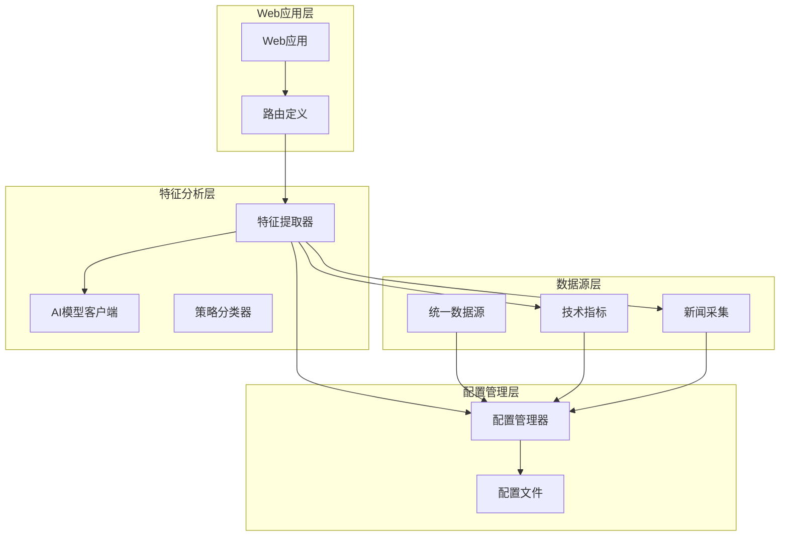
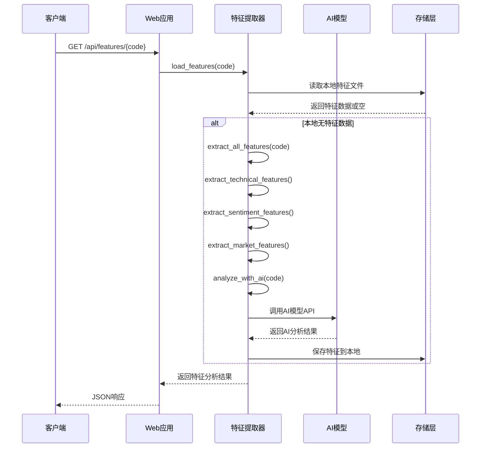
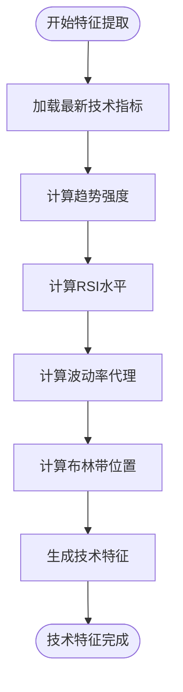
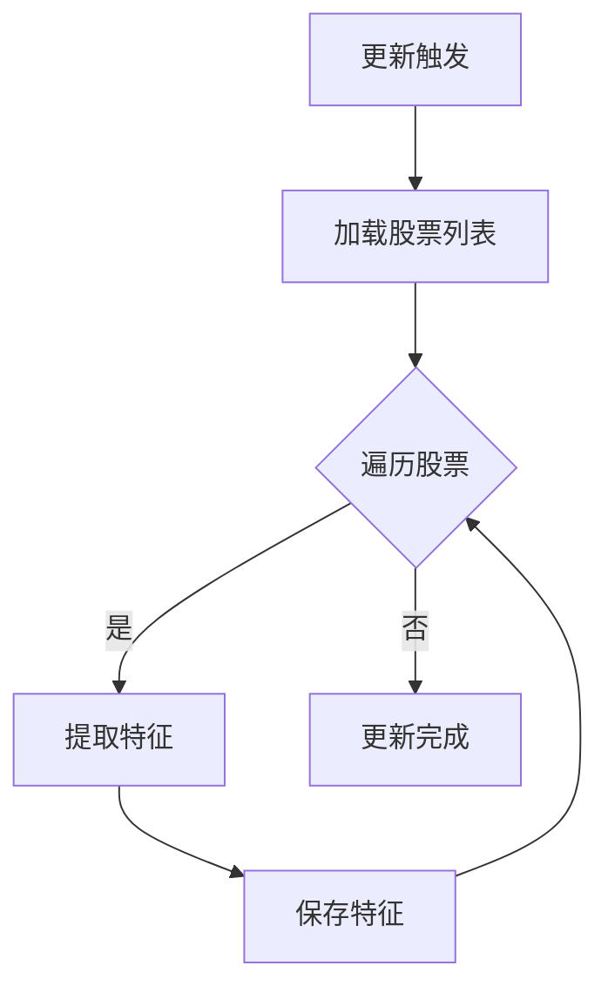
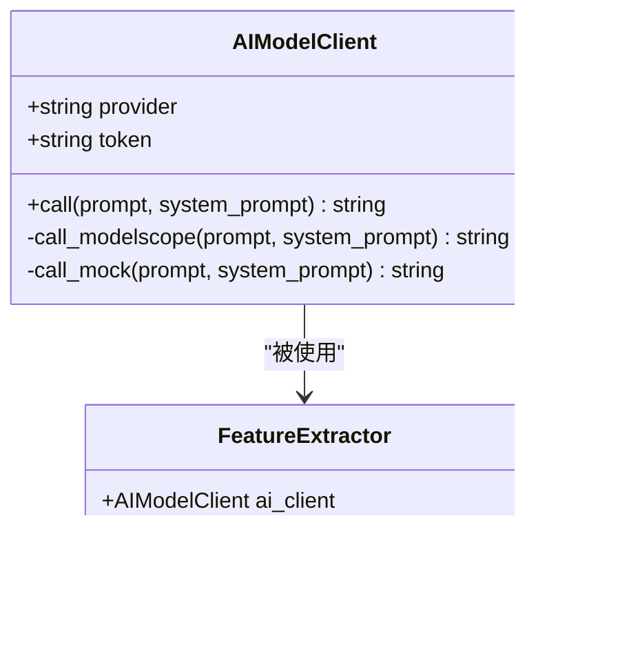
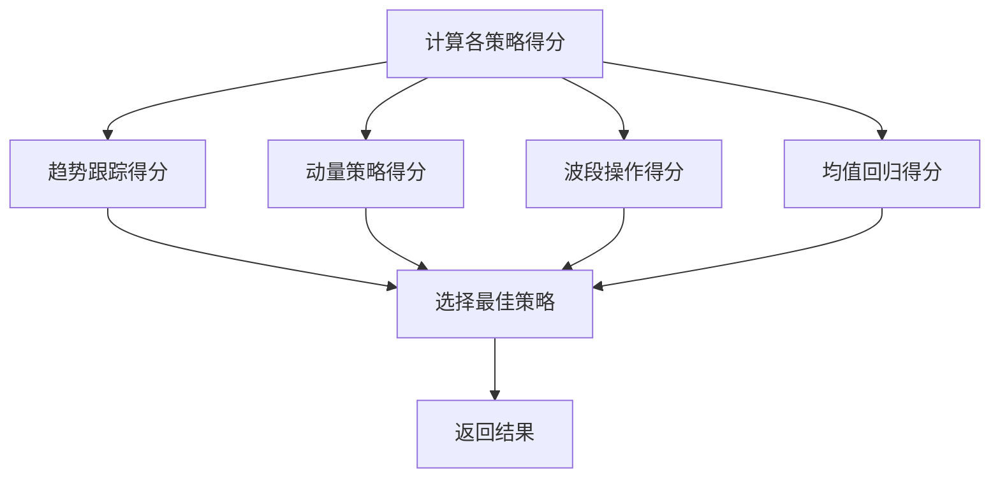
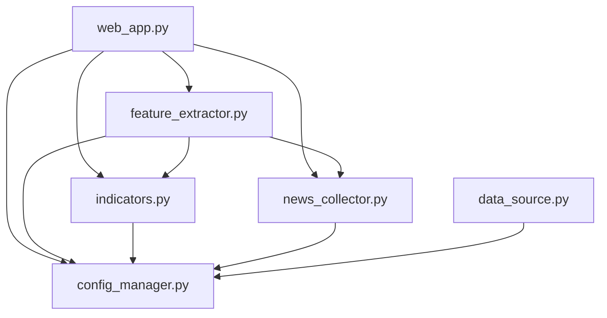

# 特征分析API

<cite>
**本文档引用的文件**
- [web_app.py](file://quant_system/web_app.py)
- [feature_extractor.py](file://quant_system/feature_extractor.py)
- [indicators.py](file://quant_system/indicators.py)
- [news_collector.py](file://quant_system/news_collector.py)
- [config_manager.py](file://quant_system/config_manager.py)
- [config.yaml](file://config.yaml)
- [stocks.yaml](file://config/stocks.yaml)
- [data_source.py](file://quant_system/data_source.py)
- [requirements.txt](file://requirements.txt)
</cite>

## 目录
1. [简介](#简介)
2. [项目结构](#项目结构)
3. [核心组件](#核心组件)
4. [架构概览](#架构概览)
5. [详细组件分析](#详细组件分析)
6. [依赖关系分析](#依赖关系分析)
7. [性能考虑](#性能考虑)
8. [故障排除指南](#故障排除指南)
9. [结论](#结论)

## 简介
本文档详细介绍了vibequation量化交易系统的特征分析API，重点说明了获取特征分析的接口设计、AI特征提取算法原理、数据处理流程以及特征数据的存储格式、更新机制和缓存策略。同时，文档阐述了特征分析对策略决策的支持作用以及AI模型的集成方式，并提供了特征质量评估和特征重要性排序的方法。

## 项目结构
vibequation量化交易系统采用模块化架构，特征分析API位于web应用层，通过统一的数据源和指标计算模块提供完整的特征提取能力。

**图表来源**
- [web_app.py:584-596](file://quant_system/web_app.py#L584-L596)
- [feature_extractor.py:99-405](file://quant_system/feature_extractor.py#L99-L405)
- [config_manager.py:12-178](file://quant_system/config_manager.py#L12-L178)

**章节来源**
- [web_app.py:1-100](file://quant_system/web_app.py#L1-L100)
- [feature_extractor.py:1-50](file://quant_system/feature_extractor.py#L1-L50)
- [config_manager.py:1-50](file://quant_system/config_manager.py#L1-L50)

## 核心组件
特征分析API的核心组件包括特征提取器、AI模型客户端、策略分类器以及相关的数据源模块。

### 特征提取器
特征提取器负责从多个维度提取股票特征，包括技术特征、情感特征和市场特征。

### AI模型客户端
AI模型客户端封装了与外部AI服务的交互，支持ModelScope等多家AI服务提供商。

### 策略分类器
策略分类器基于提取的特征自动识别最适合的交易策略类型。

**章节来源**
- [feature_extractor.py:99-405](file://quant_system/feature_extractor.py#L99-L405)
- [indicators.py:21-500](file://quant_system/indicators.py#L21-L500)
- [news_collector.py:24-465](file://quant_system/news_collector.py#L24-L465)

## 架构概览
特征分析API采用分层架构设计，实现了数据采集、特征提取、AI分析和结果缓存的完整流程。

**图表来源**
- [web_app.py:584-596](file://quant_system/web_app.py#L584-L596)
- [feature_extractor.py:285-320](file://quant_system/feature_extractor.py#L285-L320)

## 详细组件分析

### 特征分析API接口设计

#### 接口定义
- **URL**: `/api/features/{code}`
- **方法**: GET
- **参数**: 
  - `code`: 股票代码（必填）
- **响应**: JSON格式的特征分析结果

#### 数据处理流程
特征分析API遵循"缓存优先，AI补足"的设计原则：

1. **缓存检查**: 首先尝试从本地存储加载特征数据
2. **AI分析**: 如果缓存不存在，则触发完整的特征提取和AI分析流程
3. **结果保存**: 将分析结果保存到本地缓存
4. **响应返回**: 返回完整的特征分析结果给客户端

**章节来源**
- [web_app.py:584-596](file://quant_system/web_app.py#L584-L596)
- [feature_extractor.py:285-320](file://quant_system/feature_extractor.py#L285-L320)

### AI特征提取算法原理

#### 技术特征提取
技术特征基于多种技术指标计算，包括趋势强度、动量指标、波动率等：

**图表来源**
- [feature_extractor.py:115-140](file://quant_system/feature_extractor.py#L115-L140)
- [indicators.py:336-444](file://quant_system/indicators.py#L336-L444)

#### 情感特征提取
情感特征通过新闻采集和情感分析获得，包括平均情感、情感趋势、新闻量等指标。

#### 市场特征提取
市场特征包括贝塔系数、行业排名等宏观市场指标。

**章节来源**
- [feature_extractor.py:115-188](file://quant_system/feature_extractor.py#L115-L188)
- [news_collector.py:205-400](file://quant_system/news_collector.py#L205-L400)

### 特征数据存储格式

#### 本地存储结构
特征数据采用JSON格式存储，文件命名规则为 `{code}_features.json`。

#### 存储内容结构
特征数据包含以下层次结构：
- `code`: 股票代码
- `name`: 股票名称  
- `extract_time`: 提取时间戳
- `technical`: 技术特征字典
- `sentiment`: 情感特征字典
- `market`: 市场特征字典
- `ai_analysis`: AI分析结果

#### 缓存策略
- **文件系统缓存**: 使用本地JSON文件作为持久化缓存
- **内存缓存**: 在进程内存中维护最近访问的特征数据
- **失效机制**: 基于时间戳的缓存失效策略

**章节来源**
- [feature_extractor.py:107-114](file://quant_system/feature_extractor.py#L107-L114)
- [feature_extractor.py:285-299](file://quant_system/feature_extractor.py#L285-L299)

### 更新机制

#### 自动更新流程
系统提供批量特征更新功能，支持全量更新和增量更新：

**图表来源**
- [feature_extractor.py:301-320](file://quant_system/feature_extractor.py#L301-L320)

#### 手动触发更新
用户可以通过API接口手动触发特定股票的特征更新。

**章节来源**
- [feature_extractor.py:301-320](file://quant_system/feature_extractor.py#L301-L320)

### AI模型集成方式

#### 多提供商支持
系统支持多种AI服务提供商，当前主要支持ModelScope：

**图表来源**
- [feature_extractor.py:24-97](file://quant_system/feature_extractor.py#L24-L97)

#### 配置管理
AI模型配置通过配置文件集中管理，包括提供商、模型名称、参数等。

**章节来源**
- [feature_extractor.py:24-97](file://quant_system/feature_extractor.py#L24-L97)
- [config_manager.py:158-165](file://quant_system/config_manager.py#L158-L165)

### 特征质量评估

#### 质量指标
系统提供多种特征质量评估方法：

1. **完整性评估**: 检查特征数据的完整性
2. **一致性评估**: 验证特征数据的一致性
3. **时效性评估**: 评估特征数据的时效性
4. **准确性评估**: 通过历史回测验证特征的有效性

#### 特征重要性排序
系统实现基于统计学的特征重要性评估：

**图表来源**
- [feature_extractor.py:359-399](file://quant_system/feature_extractor.py#L359-L399)

**章节来源**
- [feature_extractor.py:359-399](file://quant_system/feature_extractor.py#L359-L399)

### 对策略决策的支持作用

#### 策略类型识别
特征分析能够自动识别最适合的交易策略类型，包括：
- 趋势跟踪策略
- 价值投资策略  
- 动量策略
- 波段操作策略
- 均值回归策略

#### 决策支持
特征分析为策略决策提供以下支持：
- **策略匹配**: 自动匹配最适合的策略类型
- **置信度评估**: 提供策略选择的置信度
- **风险评估**: 识别潜在的风险因素
- **参数优化**: 为策略参数优化提供依据

**章节来源**
- [feature_extractor.py:323-357](file://quant_system/feature_extractor.py#L323-L357)

## 依赖关系分析

### 外部依赖
系统依赖以下关键外部库：
- **pandas**: 数据处理和分析
- **numpy**: 数值计算
- **tushare**: 金融数据获取
- **easyquotation**: 实时行情数据
- **flask**: Web服务框架
- **requests**: HTTP请求处理
- **beautifulsoup4**: HTML解析

### 内部模块依赖

**图表来源**
- [web_app.py:17-26](file://quant_system/web_app.py#L17-L26)
- [feature_extractor.py:16-20](file://quant_system/feature_extractor.py#L16-L20)

**章节来源**
- [requirements.txt:1-33](file://requirements.txt#L1-L33)
- [web_app.py:17-26](file://quant_system/web_app.py#L17-L26)

## 性能考虑

### 缓存优化
- **本地缓存**: 使用JSON文件存储特征数据，减少重复计算
- **内存缓存**: 在进程内存中缓存最近使用的特征数据
- **并发控制**: 使用适当的锁机制防止并发访问冲突

### 网络优化
- **API限流**: 控制AI模型API的调用频率
- **连接复用**: 复用HTTP连接减少开销
- **错误重试**: 实现智能的错误重试机制

### 数据处理优化
- **批处理**: 支持批量特征提取提高效率
- **增量更新**: 仅更新发生变化的数据
- **压缩存储**: 使用压缩算法减少存储空间

## 故障排除指南

### 常见问题及解决方案

#### AI模型调用失败
- **症状**: API返回AI分析错误
- **原因**: 网络连接问题、Token过期、API限制
- **解决**: 检查网络连接、更新Token、降低调用频率

#### 特征数据缺失
- **症状**: 返回空的特征数据
- **原因**: 数据源不可用、计算错误
- **解决**: 检查数据源状态、重新计算特征

#### 性能问题
- **症状**: API响应缓慢
- **原因**: 缓存未命中、数据量过大
- **解决**: 优化缓存策略、实施分页查询

**章节来源**
- [feature_extractor.py:83-85](file://quant_system/feature_extractor.py#L83-L85)
- [feature_extractor.py:278-283](file://quant_system/feature_extractor.py#L278-L283)

## 结论
vibequation量化交易系统的特征分析API通过模块化设计实现了高效、可靠的特征提取和分析功能。系统采用多层次缓存策略、灵活的AI模型集成和完善的错误处理机制，为量化交易策略的制定提供了强有力的技术支撑。通过持续的性能优化和质量保证，该API能够满足不同规模量化交易系统的需求。