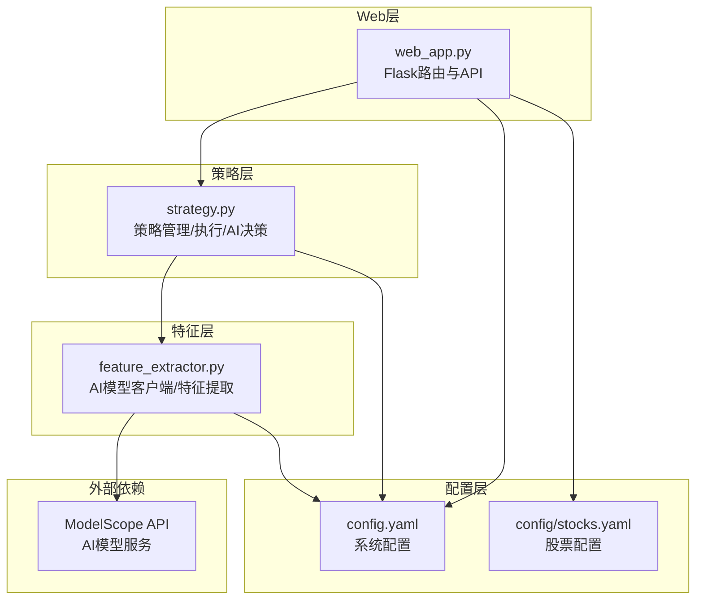
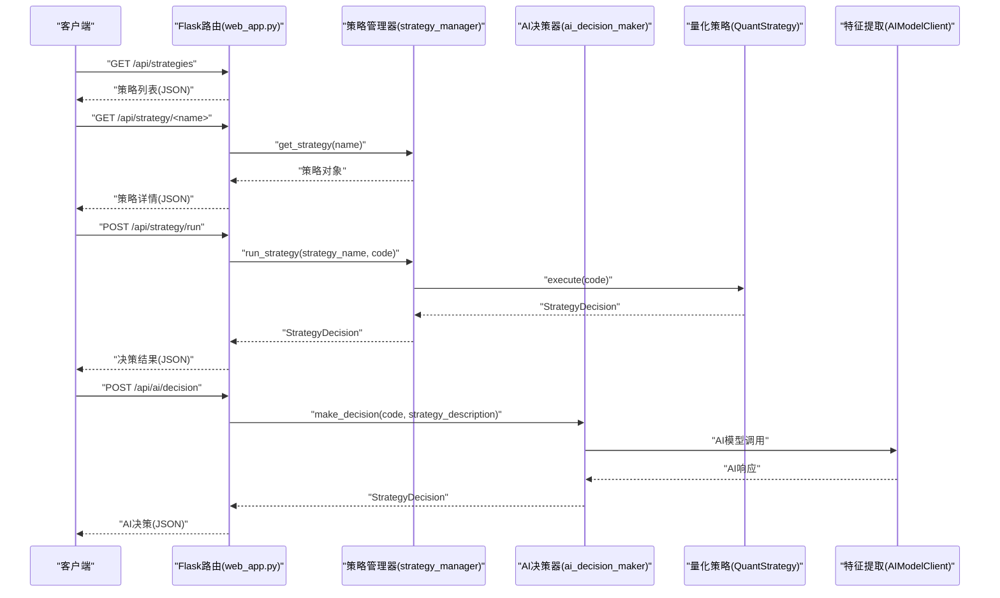
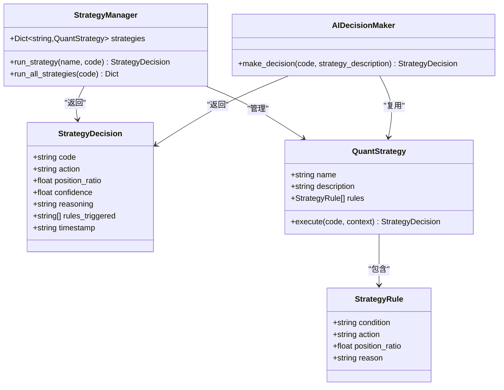
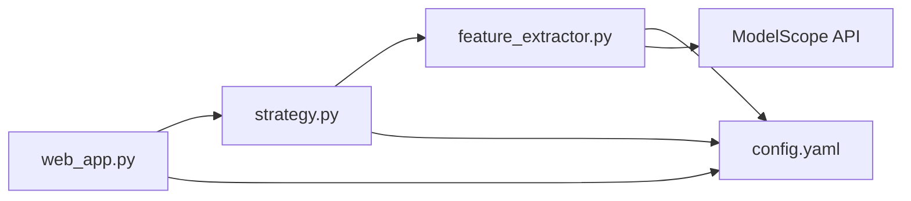

# 策略API

<cite>
**本文引用的文件**
- [main.py](file://main.py)
- [config.yaml](file://config.yaml)
- [quant_system/web_app.py](file://quant_system/web_app.py)
- [quant_system/strategy.py](file://quant_system/strategy.py)
- [quant_system/feature_extractor.py](file://quant_system/feature_extractor.py)
- [config/stocks.yaml](file://config/stocks.yaml)
</cite>

## 目录
1. [简介](#简介)
2. [项目结构](#项目结构)
3. [核心组件](#核心组件)
4. [架构总览](#架构总览)
5. [详细组件分析](#详细组件分析)
6. [依赖分析](#依赖分析)
7. [性能考虑](#性能考虑)
8. [故障排查指南](#故障排查指南)
9. [结论](#结论)
10. [附录](#附录)

## 简介
本文件为 vibequation 量化交易系统的“策略API”接口文档，覆盖以下核心接口：
- 获取策略列表：/api/strategies
- 获取策略详情：/api/strategy/<name>
- 运行策略：/api/strategy/run（POST）
- AI决策：/api/ai/decision（POST）

文档详细说明各接口的请求参数、返回数据结构、决策结果格式，并给出策略名称、股票代码、策略描述等关键参数的说明，同时提供策略运行的完整示例与错误处理机制。

## 项目结构
系统采用分层架构，Web服务通过 Flask 提供REST API，策略层负责策略解析、执行与AI决策，特征提取层提供AI模型调用能力，配置层统一管理系统参数。

**图表来源**
- [quant_system/web_app.py:169-212](file://quant_system/web_app.py#L169-L212)
- [quant_system/strategy.py:318-460](file://quant_system/strategy.py#L318-L460)
- [quant_system/feature_extractor.py:24-97](file://quant_system/feature_extractor.py#L24-L97)
- [config.yaml:1-88](file://config.yaml#L1-L88)
- [config/stocks.yaml:1-71](file://config/stocks.yaml#L1-L71)

**章节来源**
- [quant_system/web_app.py:169-212](file://quant_system/web_app.py#L169-L212)
- [quant_system/strategy.py:318-460](file://quant_system/strategy.py#L318-L460)
- [quant_system/feature_extractor.py:24-97](file://quant_system/feature_extractor.py#L24-L97)
- [config.yaml:1-88](file://config.yaml#L1-L88)
- [config/stocks.yaml:1-71](file://config/stocks.yaml#L1-L71)

## 核心组件
- 策略管理器（StrategyManager）：维护内置策略与用户自定义策略，提供策略查询、执行与批量执行。
- 量化策略（QuantStrategy）：封装策略规则、条件评估、执行逻辑与自然语言互译。
- AI决策器（AIDecisionMaker）：基于技术指标与特征进行AI综合决策。
- AI模型客户端（AIModelClient）：封装调用ModelScope或其他AI服务的逻辑。
- Web API（web_app.py）：提供策略相关REST接口，包括策略列表、详情、运行策略、AI决策等。

**章节来源**
- [quant_system/strategy.py:318-460](file://quant_system/strategy.py#L318-L460)
- [quant_system/strategy.py:462-551](file://quant_system/strategy.py#L462-L551)
- [quant_system/feature_extractor.py:24-97](file://quant_system/feature_extractor.py#L24-L97)
- [quant_system/web_app.py:169-212](file://quant_system/web_app.py#L169-L212)

## 架构总览
策略API的调用链路如下：
- 客户端发起HTTP请求至 /api/strategies、/api/strategy/<name>、/api/strategy/run、/api/ai/decision。
- Flask路由在 web_app.py 中接收请求并调用相应处理函数。
- 处理函数通过 strategy_manager 或 ai_decision_maker 执行策略或AI决策。
- 决策结果以JSON形式返回；若发生异常，返回标准错误响应。

**图表来源**
- [quant_system/web_app.py:169-212](file://quant_system/web_app.py#L169-L212)
- [quant_system/web_app.py:515-540](file://quant_system/web_app.py#L515-L540)
- [quant_system/strategy.py:397-425](file://quant_system/strategy.py#L397-L425)
- [quant_system/strategy.py:468-551](file://quant_system/strategy.py#L468-L551)
- [quant_system/feature_extractor.py:32-97](file://quant_system/feature_extractor.py#L32-L97)

## 详细组件分析

### 接口：获取策略列表
- 路径：/api/strategies
- 方法：GET
- 请求参数：无
- 成功响应：数组，元素为对象，包含字段 name（策略名称）
- 错误响应：无（内部策略管理器返回空列表时也视为成功，返回空数组）

示例响应
- 成功：[{"name":"rsi"},{"name":"macd"},{"name":"ma"},{"name":"combined"}]

**章节来源**
- [quant_system/web_app.py:169-174](file://quant_system/web_app.py#L169-L174)
- [quant_system/strategy.py:405-407](file://quant_system/strategy.py#L405-L407)

### 接口：获取策略详情
- 路径：/api/strategy/<name>
- 方法：GET
- 路径参数：name（策略名称）
- 成功响应：对象，包含字段 name、description、rules（规则数组）
- 错误响应：404，{"error":"Strategy not found"}

示例响应
- 成功：{"name":"RSI策略","description":"基于RSI指标的超买超卖策略","rules":[{"condition":"rsi_6 < 30","action":"buy","position_ratio":0.5,"reason":"RSI超卖，买入信号"},{"condition":"rsi_6 > 70","action":"sell","position_ratio":0.5,"reason":"RSI超买，卖出信号"}]}

**章节来源**
- [quant_system/web_app.py:177-184](file://quant_system/web_app.py#L177-L184)
- [quant_system/strategy.py:301-316](file://quant_system/strategy.py#L301-L316)

### 接口：运行策略
- 路径：/api/strategy/run
- 方法：POST
- 请求体JSON字段：
  - code（字符串，必填）：股票代码
  - strategy（字符串，必填）：策略名称
- 成功响应：对象，包含字段
  - code（字符串）
  - action（字符串，buy/sell/hold）
  - position_ratio（数值，0-1）
  - confidence（数值，0-1）
  - reasoning（字符串，决策理由）
  - timestamp（字符串，ISO时间戳）
- 错误响应：
  - 400，{"error":"Missing code or strategy"}（缺少必要参数）
  - 500，{"error":"..."}（内部异常）

决策结果格式说明
- action：建议动作
- position_ratio：建议仓位比例
- confidence：置信度
- reasoning：触发规则与理由汇总
- timestamp：决策生成时间

**章节来源**
- [quant_system/web_app.py:187-212](file://quant_system/web_app.py#L187-L212)
- [quant_system/strategy.py:409-425](file://quant_system/strategy.py#L409-L425)
- [quant_system/strategy.py:44-54](file://quant_system/strategy.py#L44-L54)

### 接口：AI决策
- 路径：/api/ai/decision
- 方法：POST
- 请求体JSON字段：
  - code（字符串，必填）：股票代码
  - strategy_description（字符串，可选）：策略描述（用于指导AI决策）
- 成功响应：对象，包含字段
  - code、action、position_ratio、confidence、reasoning、timestamp
- 错误响应：
  - 400，{"error":"Missing code"}（缺少股票代码）
  - 500，{"error":"..."}（内部异常）

AI决策流程
- 从 stock_manager、indicator_analyzer、feature_extractor 获取股票、指标与特征数据
- 构造提示词（prompt），包含技术指标、特征分析与可选策略要求
- 调用 AIModelClient.call 获取AI响应
- 解析JSON并封装为 StrategyDecision 返回

**章节来源**
- [quant_system/web_app.py:515-540](file://quant_system/web_app.py#L515-L540)
- [quant_system/strategy.py:468-551](file://quant_system/strategy.py#L468-L551)
- [quant_system/feature_extractor.py:32-97](file://quant_system/feature_extractor.py#L32-L97)

### 关键数据结构与复杂度
- StrategyDecision（策略决策结果）
  - 字段：code、action、position_ratio、confidence、reasoning、rules_triggered、timestamp
  - 复杂度：构造O(1)，序列化O(n)（n为rules_triggered数量）
- StrategyRule（策略规则）
  - 字段：condition、action、position_ratio、reason
  - 复杂度：评估条件O(k)（k为指标数量）
- QuantStrategy.execute
  - 复杂度：遍历规则O(r)（r为规则数量），条件评估O(r·k)
- StrategyManager.run_strategy
  - 复杂度：O(r·k)

**图表来源**
- [quant_system/strategy.py:44-54](file://quant_system/strategy.py#L44-L54)
- [quant_system/strategy.py:35-42](file://quant_system/strategy.py#L35-L42)
- [quant_system/strategy.py:150-184](file://quant_system/strategy.py#L150-L184)
- [quant_system/strategy.py:318-425](file://quant_system/strategy.py#L318-L425)
- [quant_system/strategy.py:462-551](file://quant_system/strategy.py#L462-L551)

## 依赖分析
- web_app.py 依赖 strategy.py 的策略管理器与AI决策器，依赖 feature_extractor.py 的AI模型客户端。
- strategy.py 依赖 indicator_analyzer 获取最新信号，依赖 feature_extractor 提取特征。
- feature_extractor.py 依赖 config.yaml 的AI模型配置与令牌，依赖外部ModelScope API。
- config.yaml 提供AI模型提供商、模型名称、令牌等配置项。

**图表来源**
- [quant_system/web_app.py:169-212](file://quant_system/web_app.py#L169-L212)
- [quant_system/strategy.py:318-460](file://quant_system/strategy.py#L318-L460)
- [quant_system/feature_extractor.py:24-97](file://quant_system/feature_extractor.py#L24-L97)
- [config.yaml:56-62](file://config.yaml#L56-L62)

**章节来源**
- [quant_system/web_app.py:169-212](file://quant_system/web_app.py#L169-L212)
- [quant_system/strategy.py:318-460](file://quant_system/strategy.py#L318-L460)
- [quant_system/feature_extractor.py:24-97](file://quant_system/feature_extractor.py#L24-L97)
- [config.yaml:56-62](file://config.yaml#L56-L62)

## 性能考虑
- 策略执行复杂度与规则数量和指标数量成正比，建议控制单策略规则数量与条件复杂度。
- AI决策涉及网络调用，建议缓存热点股票的特征与指标，减少重复计算。
- Web层异常处理返回标准HTTP状态码，便于前端快速定位问题。

[本节为通用性能建议，不直接分析具体文件]

## 故障排查指南
常见错误与处理
- 缺少参数
  - /api/strategy/run：返回400，{"error":"Missing code or strategy"}
  - /api/ai/decision：返回400，{"error":"Missing code"}
- 策略不存在
  - /api/strategy/<name>：返回404，{"error":"Strategy not found"}
- 内部异常
  - 所有接口在异常时返回500，{"error":"..."}，日志记录详细错误信息
- AI模型调用失败
  - AIModelClient会降级为本地mock响应，保证系统可用性

**章节来源**
- [quant_system/web_app.py:195-196](file://quant_system/web_app.py#L195-L196)
- [quant_system/web_app.py:225-230](file://quant_system/web_app.py#L225-L230)
- [quant_system/web_app.py:210-211](file://quant_system/web_app.py#L210-L211)
- [quant_system/web_app.py:523-524](file://quant_system/web_app.py#L523-L524)
- [quant_system/web_app.py:538-539](file://quant_system/web_app.py#L538-L539)
- [quant_system/feature_extractor.py:83-85](file://quant_system/feature_extractor.py#L83-L85)

## 结论
策略API提供了清晰的REST接口，支持策略查询、执行与AI决策。通过标准化的请求与响应格式，结合完善的错误处理与日志记录，能够稳定支撑量化交易系统的策略开发与部署。建议在生产环境中配合缓存与限流策略，进一步提升性能与可靠性。

[本节为总结性内容，不直接分析具体文件]

## 附录

### 接口一览表
- GET /api/strategies：返回策略名称列表
- GET /api/strategy/<name>：返回策略详情（含规则）
- POST /api/strategy/run：运行指定策略并返回决策
- POST /api/ai/decision：基于技术指标与特征进行AI决策

### 请求与响应示例（路径引用）
- 运行策略请求体参考：[quant_system/web_app.py:191-193](file://quant_system/web_app.py#L191-L193)
- 运行策略成功响应结构参考：[quant_system/web_app.py:200-207](file://quant_system/web_app.py#L200-L207)
- AI决策请求体参考：[quant_system/web_app.py:519-521](file://quant_system/web_app.py#L519-L521)
- AI决策成功响应结构参考：[quant_system/web_app.py:528-535](file://quant_system/web_app.py#L528-L535)

### 配置参考
- AI模型配置（provider、model_name、max_tokens、temperature）：[config.yaml:56-62](file://config.yaml#L56-L62)
- 股票配置（示例）：[config/stocks.yaml:4-30](file://config/stocks.yaml#L4-L30)