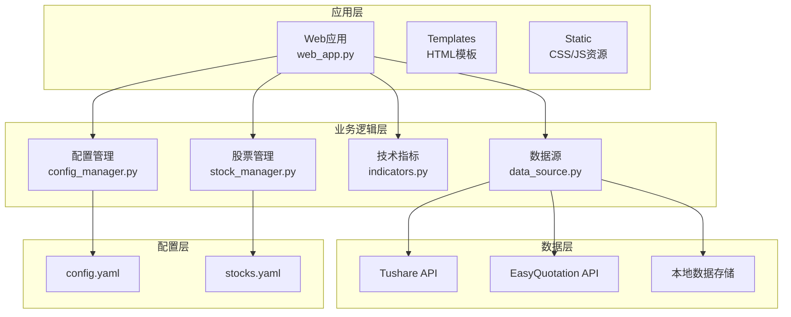
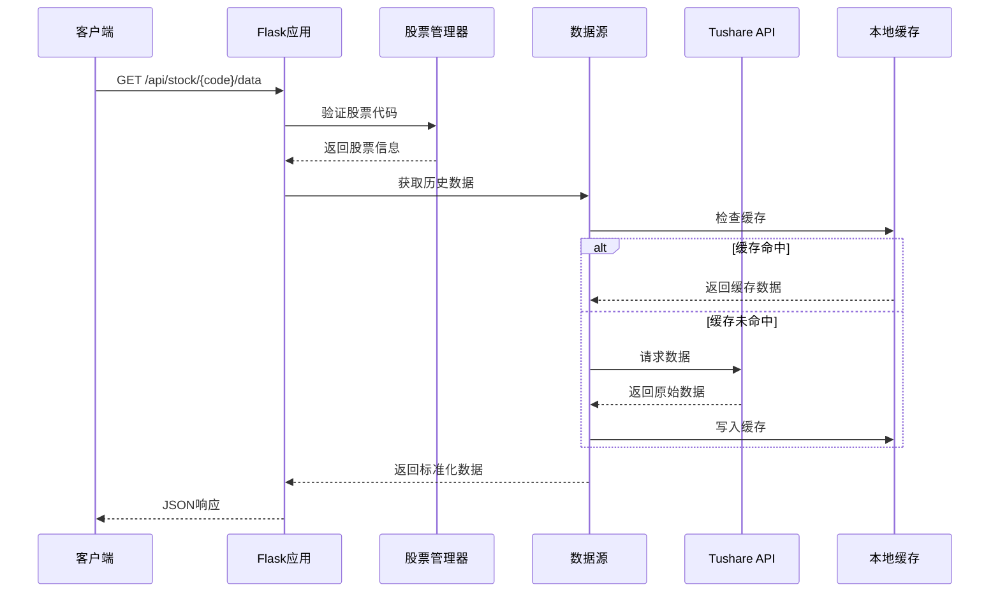
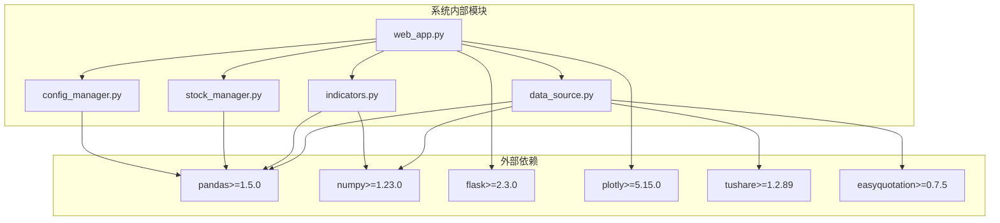

# 股票数据API

<cite>
**本文档引用的文件**
- [web_app.py](file://quant_system/web_app.py)
- [data_source.py](file://quant_system/data_source.py)
- [indicators.py](file://quant_system/indicators.py)
- [stock_manager.py](file://quant_system/stock_manager.py)
- [config.yaml](file://config.yaml)
- [stocks.yaml](file://config/stocks.yaml)
- [config_manager.py](file://quant_system/config_manager.py)
- [api.py](file://easyquotation/api.py)
- [requirements.txt](file://requirements.txt)
</cite>

## 目录
1. [简介](#简介)
2. [项目结构](#项目结构)
3. [核心组件](#核心组件)
4. [架构概览](#架构概览)
5. [详细接口文档](#详细接口文档)
6. [依赖关系分析](#依赖关系分析)
7. [性能考虑](#性能考虑)
8. [故障排除指南](#故障排除指南)
9. [结论](#结论)

## 简介

vibequation量化交易系统是一个基于Python开发的综合性量化交易平台，提供了完整的股票数据获取、技术分析、策略回测和风险管理功能。本文件专注于股票数据API的详细接口文档，涵盖股票列表获取、历史数据查询、技术指标计算和K线图数据生成等核心功能。

该系统采用Flask框架构建RESTful API，支持多种数据源（Tushare、EasyQuotation），提供灵活的技术指标计算和可视化功能。系统设计遵循模块化原则，具有良好的可扩展性和维护性。

## 项目结构



**图表来源**
- [web_app.py:1-873](file://quant_system/web_app.py#L1-L873)
- [data_source.py:1-423](file://quant_system/data_source.py#L1-L423)
- [stock_manager.py:1-278](file://quant_system/stock_manager.py#L1-L278)

**章节来源**
- [web_app.py:1-873](file://quant_system/web_app.py#L1-L873)
- [config.yaml:1-88](file://config.yaml#L1-L88)

## 核心组件

### Web应用层
- **Flask应用**: 提供RESTful API接口，处理HTTP请求和响应
- **路由管理**: 定义各个API端点和对应的处理函数
- **错误处理**: 统一的异常捕获和错误响应机制

### 数据管理层
- **统一数据源**: 整合多个数据源，提供标准化的数据访问接口
- **股票管理**: 维护股票代码、市场信息和格式转换
- **技术指标**: 计算各种技术分析指标，支持缓存和持久化

### 配置管理层
- **集中配置**: 统一管理所有系统配置参数
- **环境适配**: 支持不同环境下的配置切换
- **动态加载**: 运行时配置修改和热更新支持

**章节来源**
- [web_app.py:34-37](file://quant_system/web_app.py#L34-L37)
- [data_source.py:300-423](file://quant_system/data_source.py#L300-L423)
- [config_manager.py:12-178](file://quant_system/config_manager.py#L12-L178)

## 架构概览



**图表来源**
- [web_app.py:61-82](file://quant_system/web_app.py#L61-L82)
- [data_source.py:307-335](file://quant_system/data_source.py#L307-L335)
- [stock_manager.py:111-128](file://quant_system/stock_manager.py#L111-L128)

## 详细接口文档

### 获取股票列表接口

#### 接口定义
- **URL**: `/api/stocks`
- **HTTP方法**: `GET`
- **功能**: 获取系统中配置的所有股票信息

#### 请求参数
- **查询参数**: 无
- **请求体**: 无

#### 响应数据结构
```json
[
  {
    "code": "600519",
    "name": "贵州茅台",
    "market": "sh",
    "type": "stock",
    "full_code": "sh600519"
  },
  {
    "code": "000001",
    "name": "中国平安",
    "market": "sz",
    "type": "stock",
    "full_code": "sz000001"
  }
]
```

#### 响应状态码
- `200`: 成功获取股票列表
- `500`: 系统内部错误

#### 使用示例
```bash
curl http://localhost:8080/api/stocks
```

**章节来源**
- [web_app.py:47-58](file://quant_system/web_app.py#L47-L58)
- [stock_manager.py:95-97](file://quant_system/stock_manager.py#L95-L97)

### 获取股票历史数据接口

#### 接口定义
- **URL**: `/api/stock/<code>/data`
- **HTTP方法**: `GET`
- **功能**: 获取指定股票的历史数据

#### 路径参数
- `code`: 股票代码（必填）

#### 查询参数
- `start`: 开始日期，格式：YYYYMMDD，默认：一年前
- `end`: 结束日期，格式：YYYYMMDD，默认：今天
- `freq`: 数据频率，可选值：day、week、month，默认：day

#### 响应数据结构
```json
[
  {
    "date": "20240101",
    "open": 120.5,
    "high": 125.3,
    "low": 119.8,
    "close": 124.2,
    "volume": 1000000,
    "amount": 124500000
  },
  {
    "date": "20240102",
    "open": 124.2,
    "high": 128.7,
    "low": 123.1,
    "close": 127.5,
    "volume": 850000,
    "amount": 108375000
  }
]
```

#### 响应状态码
- `200`: 成功获取数据
- `400`: 参数错误
- `404`: 无可用数据
- `500`: 系统内部错误

#### 错误处理
- 当股票代码无效时返回400状态码
- 当数据为空时返回404状态码
- 当发生系统异常时返回500状态码

#### 使用示例
```bash
# 获取指定日期范围的日线数据
curl "http://localhost:8080/api/stock/600519/data?start=20240101&end=20241231&freq=day"

# 获取周线数据
curl "http://localhost:8080/api/stock/000001/data?freq=week"
```

**章节来源**
- [web_app.py:61-82](file://quant_system/web_app.py#L61-L82)
- [data_source.py:307-335](file://quant_system/data_source.py#L307-L335)

### 获取股票技术指标接口

#### 接口定义
- **URL**: `/api/stock/<code>/indicators`
- **HTTP方法**: `GET`
- **功能**: 获取指定股票的技术指标数据

#### 路径参数
- `code`: 股票代码（必填）

#### 查询参数
- `freq`: 数据频率，可选值：day、week、month，默认：day

#### 技术指标说明
系统支持以下技术指标：
- **RSI**: 相对强弱指数（支持6、12、24周期）
- **MACD**: 指数平滑异同移动平均线
- **移动平均线**: 支持5、10、20、60、120、250周期
- **布林带**: 20日周期，2倍标准差
- **KDJ**: 随机指标
- **波动率**: 20日滚动波动率
- **成交量指标**: 5日、20日成交量均线和量比

#### 响应数据结构
```json
[
  {
    "date": "20240101",
    "close": 124.2,
    "rsi_6": 65.2,
    "rsi_12": 62.8,
    "rsi_24": 58.3,
    "macd": 1.25,
    "macd_signal": 0.85,
    "macd_histogram": 0.40,
    "ma_5": 122.5,
    "ma_20": 120.8,
    "ma_60": 118.3,
    "boll_upper": 126.8,
    "boll_middle": 122.1,
    "boll_lower": 117.4,
    "kdj_k": 62.3,
    "kdj_d": 58.7,
    "kdj_j": 66.2,
    "volatility_20": 0.023,
    "change_pct": 1.5,
    "volume_ma_5": 950000,
    "volume_ma_20": 980000,
    "volume_ratio": 1.02
  }
]
```

#### 响应状态码
- `200`: 成功获取指标数据
- `404`: 无可用指标数据
- `500`: 系统内部错误

#### 使用示例
```bash
# 获取日线技术指标
curl "http://localhost:8080/api/stock/600519/indicators?freq=day"

# 获取周线技术指标
curl "http://localhost:8080/api/stock/000001/indicators?freq=week"
```

**章节来源**
- [web_app.py:84-108](file://quant_system/web_app.py#L84-L108)
- [indicators.py:188-273](file://quant_system/indicators.py#L188-L273)

### 获取股票K线图数据接口

#### 接口定义
- **URL**: `/api/stock/<code>/chart`
- **HTTP方法**: `GET`
- **功能**: 获取用于绘制K线图的数据和配置

#### 路径参数
- `code`: 股票代码（必填）

#### 查询参数
- `start`: 开始日期，格式：YYYYMMDD，默认：180天前
- `end`: 结束日期，格式：YYYYMMDD，默认：今天

#### 响应数据结构
```json
{
  "data": [
    {
      "x": ["2024-01-01", "2024-01-02"],
      "open": [120.5, 124.2],
      "high": [125.3, 128.7],
      "low": [119.8, 123.1],
      "close": [124.2, 127.5]
    }
  ],
  "layout": {
    "title": "600519 K线图",
    "yaxis": {"title": "价格"},
    "xaxis": {"title": "日期"},
    "height": 600
  }
}
```

#### 图表特性
- **K线图**: 主要显示开盘价、最高价、最低价、收盘价
- **均线**: 显示5日和20日移动平均线
- **标题**: 股票代码和名称
- **坐标轴**: 日期和价格标注

#### 响应状态码
- `200`: 成功生成图表数据
- `404`: 无可用数据
- `500`: 系统内部错误

#### 使用示例
```bash
# 获取K线图数据
curl "http://localhost:8080/api/stock/600519/chart?start=20240101&end=20241231"
```

**章节来源**
- [web_app.py:111-166](file://quant_system/web_app.py#L111-L166)
- [indicators.py:204-273](file://quant_system/indicators.py#L204-L273)

## 依赖关系分析



**图表来源**
- [requirements.txt:1-33](file://requirements.txt#L1-L33)
- [web_app.py:12-26](file://quant_system/web_app.py#L12-L26)

**章节来源**
- [requirements.txt:1-33](file://requirements.txt#L1-L33)
- [web_app.py:12-26](file://quant_system/web_app.py#L12-L26)

## 性能考虑

### 数据缓存策略
- **本地缓存**: 历史数据和技术指标支持本地文件缓存
- **增量更新**: 支持按日期范围增量更新数据
- **缓存失效**: 基于时间戳和数据完整性检查的缓存管理

### API性能优化
- **批量请求**: 支持一次性获取多个时间框架的数据
- **数据压缩**: 响应数据采用JSON格式，体积相对较小
- **连接池**: 数据库连接和网络请求的连接复用

### 并发处理
- **异步处理**: 长耗时操作（如数据下载）采用异步方式
- **限流控制**: Tushare API调用频率限制
- **错误重试**: 网络异常时的自动重试机制

## 故障排除指南

### 常见错误及解决方案

#### 1. Tushare Token配置错误
**症状**: 获取数据时报错，提示Token无效
**解决方案**: 
- 检查config.yaml中的tushare_token配置
- 确认Token具有足够的权限
- 验证网络连接正常

#### 2. 股票代码无效
**症状**: 返回400状态码，错误信息为"未知的股票代码"
**解决方案**:
- 检查股票代码格式是否正确
- 确认股票代码存在于config/stocks.yaml中
- 验证股票代码与市场匹配

#### 3. 数据获取超时
**症状**: API响应时间过长或超时
**解决方案**:
- 检查网络连接状态
- 减少查询的时间范围
- 调整Tushare API的请求频率

#### 4. 技术指标计算失败
**症状**: 返回404状态码，提示无可用指标数据
**解决方案**:
- 确认历史数据已正确下载
- 检查数据完整性
- 重新计算技术指标

### 调试建议

#### 启用调试模式
```bash
# 在config.yaml中设置
web:
  debug: true
```

#### 查看日志文件
- 日志文件位置：./logs/quant_system.log
- 日志级别：INFO（可在config.yaml中调整）

#### API测试工具
推荐使用curl命令进行API测试：
```bash
# 测试股票列表
curl http://localhost:8080/api/stocks

# 测试历史数据
curl "http://localhost:8080/api/stock/600519/data?start=20240101&end=20241231"

# 测试技术指标
curl "http://localhost:8080/api/stock/600519/indicators?freq=day"
```

**章节来源**
- [web_app.py:79-81](file://quant_system/web_app.py#L79-L81)
- [web_app.py:106-108](file://quant_system/web_app.py#L106-L108)
- [web_app.py:164-166](file://quant_system/web_app.py#L164-L166)

## 结论

vibequation量化交易系统的股票数据API提供了完整、灵活且高性能的金融数据服务。系统的主要特点包括：

### 核心优势
- **多数据源支持**: 整合Tushare和EasyQuotation，提供可靠的数据来源
- **标准化接口**: 统一的数据格式和响应结构
- **缓存机制**: 智能缓存策略提升数据访问性能
- **技术指标丰富**: 内置多种常用技术分析指标
- **可视化支持**: 直接输出可用于图表绘制的数据格式

### 应用场景
- **量化研究**: 提供历史数据和技术指标分析
- **策略开发**: 支持策略回测和性能评估
- **实时监控**: 结合实时数据源进行市场监控
- **教学演示**: 完整的API文档和示例代码

### 扩展建议
- **增加数据源**: 支持更多第三方数据提供商
- **性能优化**: 实现更高效的数据索引和查询
- **安全增强**: 添加API访问控制和限流机制
- **文档完善**: 提供更详细的API使用示例和最佳实践

该API设计合理，功能完整，能够满足量化交易系统的核心需求，为金融数据分析和策略开发提供了坚实的基础。