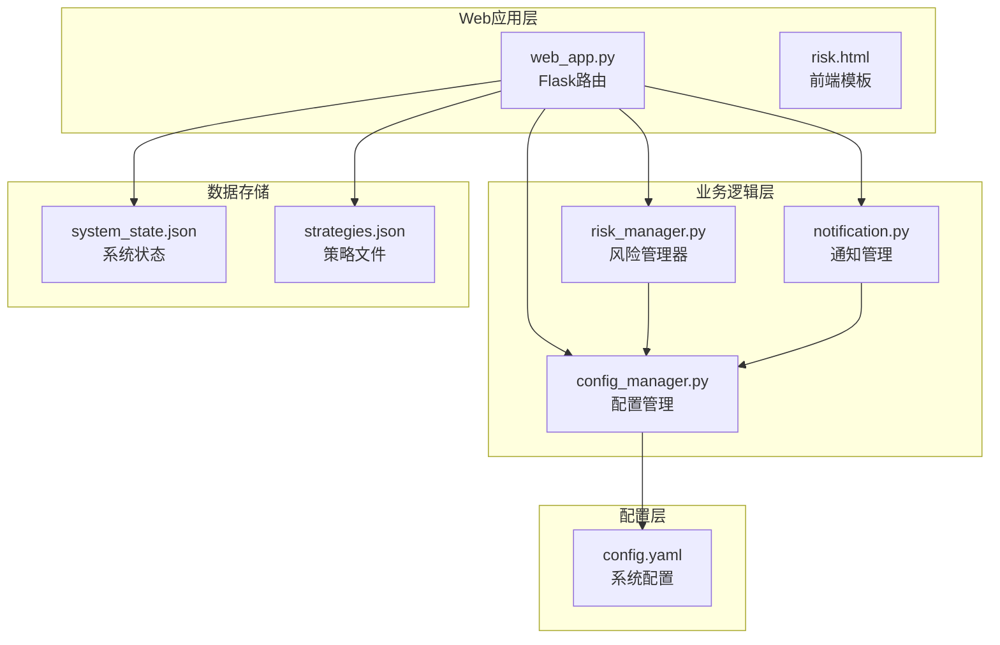
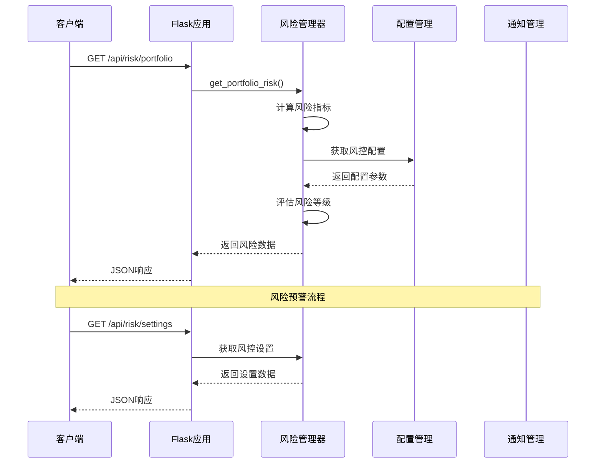
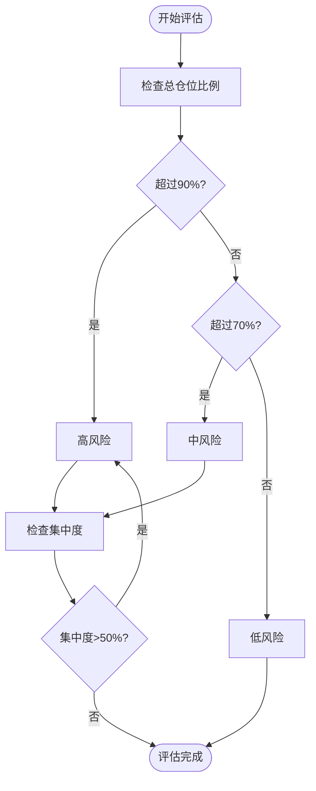
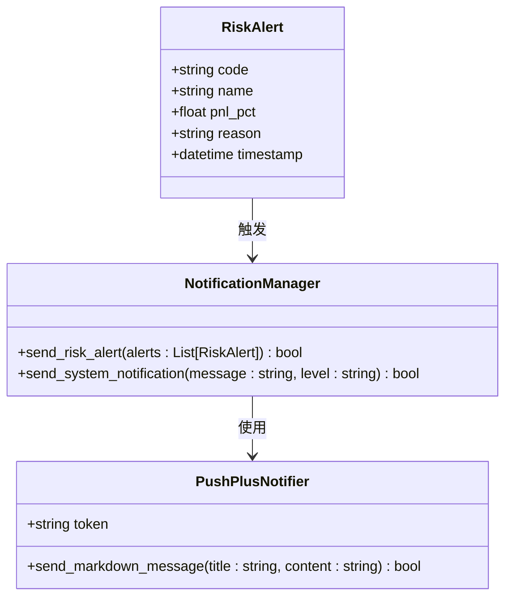
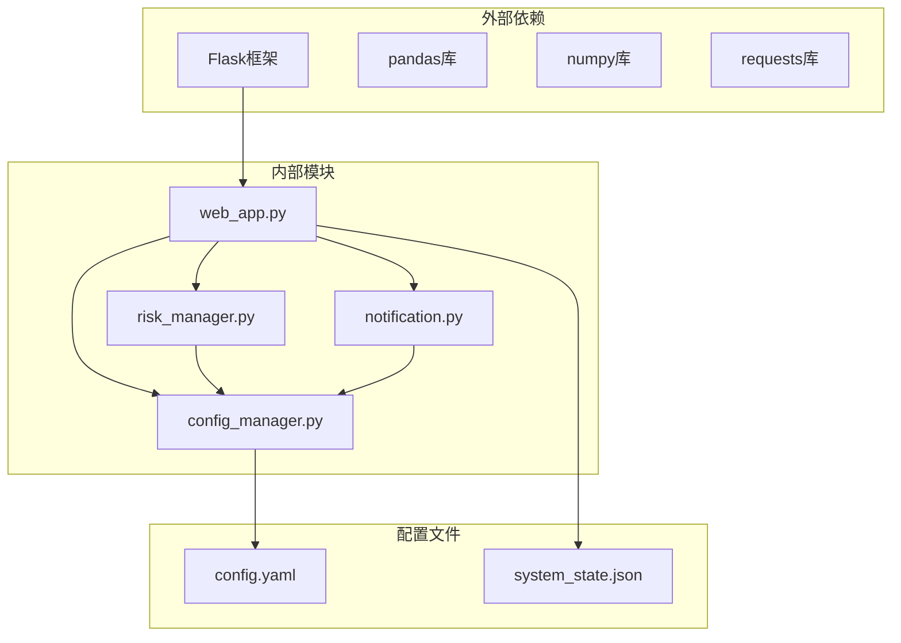

# 风险控制API

<cite>
**本文档引用的文件**
- [risk_manager.py](file://quant_system/risk_manager.py)
- [web_app.py](file://quant_system/web_app.py)
- [config_manager.py](file://quant_system/config_manager.py)
- [config.yaml](file://config.yaml)
- [notification.py](file://quant_system/notification.py)
- [risk.html](file://quant_system/templates/risk.html)
</cite>

## 目录
1. [简介](#简介)
2. [项目结构](#项目结构)
3. [核心组件](#核心组件)
4. [架构概览](#架构概览)
5. [详细组件分析](#详细组件分析)
6. [依赖关系分析](#依赖关系分析)
7. [性能考虑](#性能考虑)
8. [故障排除指南](#故障排除指南)
9. [结论](#结论)

## 简介

vibequation量化交易系统的风险控制API提供了全面的投资组合风险管理和持仓监控功能。该系统实现了基于VaR（风险价值）理论的风险度量、实时止损止盈监控、仓位限制检查以及风险预警机制。

系统的核心功能包括：
- **投资组合风险监控**：实时计算总仓位比例、持仓集中度、浮动盈亏等关键风险指标
- **持仓信息管理**：提供详细的持仓汇总数据，包括个股盈亏、市值分布等
- **风险阈值控制**：支持自定义的最大仓位比例、单股限制、止损止盈比例
- **告警机制**：通过PushPlus平台发送风险预警通知

## 项目结构



**图表来源**
- [web_app.py:34-873](file://quant_system/web_app.py#L34-L873)
- [risk_manager.py:47-404](file://quant_system/risk_manager.py#L47-L404)
- [config_manager.py:12-178](file://quant_system/config_manager.py#L12-L178)

**章节来源**
- [web_app.py:1-873](file://quant_system/web_app.py#L1-L873)
- [risk_manager.py:1-404](file://quant_system/risk_manager.py#L1-L404)
- [config_manager.py:1-178](file://quant_system/config_manager.py#L1-L178)

## 核心组件

### 风险管理器 (RiskManager)

RiskManager是系统的核心组件，负责：
- **仓位管理**：跟踪和管理投资组合中的所有持仓
- **风险检查**：执行止损止盈、仓位限制等风控检查
- **风险评估**：计算各种风险指标并评估整体风险等级
- **状态持久化**：支持系统状态的保存和恢复

### 风控配置 (ConfigManager)

ConfigManager提供统一的配置管理：
- **风控参数**：最大仓位比例、单股限制、止损止盈比例
- **系统参数**：Web服务配置、数据存储路径等
- **动态配置**：支持运行时修改配置并保存到文件

### 通知管理器 (NotificationManager)

NotificationManager实现风险预警通知功能：
- **PushPlus集成**：通过PushPlus平台发送微信消息
- **多级告警**：支持不同级别的风险预警
- **格式化输出**：提供Markdown格式的通知内容

**章节来源**
- [risk_manager.py:47-404](file://quant_system/risk_manager.py#L47-L404)
- [config_manager.py:149-156](file://quant_system/config_manager.py#L149-L156)
- [notification.py:84-301](file://quant_system/notification.py#L84-L301)

## 架构概览



**图表来源**
- [web_app.py:318-327](file://quant_system/web_app.py#L318-L327)
- [risk_manager.py:241-283](file://quant_system/risk_manager.py#L241-L283)
- [config_manager.py:149-156](file://quant_system/config_manager.py#L149-L156)

## 详细组件分析

### 风险控制API接口

#### 投资组合风险接口 (/api/risk/portfolio)

**功能描述**：获取当前投资组合的整体风险状况

**请求方式**：GET

**响应数据结构**：
```json
{
  "total_capital": 1000000.00,
  "available_cash": 80000.00,
  "total_position_value": 20000.00,
  "position_ratio": 0.20,
  "concentration": 0.15,
  "total_unrealized_pnl": 1500.00,
  "positions_count": 5,
  "stop_loss_alerts": [
    {
      "code": "000001",
      "name": "平安银行",
      "pnl_pct": -6.50,
      "reason": "触发止损 (-6.50% <= -5.0%)"
    }
  ],
  "risk_level": "medium"
}
```

**风险指标说明**：
- **总资金**：账户总资产
- **可用资金**：可自由使用的资金
- **持仓市值**：所有持仓的当前市场价值
- **仓位比例**：持仓市值占总资产的比例
- **集中度**：单只股票最大持仓占比
- **浮动盈亏**：所有持仓的未实现盈亏
- **风险等级**：低/中/高风险评估结果

#### 持仓信息接口 (/api/risk/positions)

**功能描述**：获取当前所有持仓的详细信息

**请求方式**：GET

**响应数据结构**：
```json
[
  {
    "code": "000001",
    "name": "平安银行",
    "shares": 100,
    "avg_cost": 15.50,
    "current_price": 14.80,
    "market_value": 1480.00,
    "unrealized_pnl": -70.00,
    "unrealized_pnl_pct": -4.52,
    "position_ratio": 0.015
  }
]
```

**字段说明**：
- **代码/名称**：股票代码和名称
- **持仓数量**：当前持有的股数
- **成本价**：平均持仓成本
- **现价**：当前市场价格
- **市值**：持仓的当前市场价值
- **浮动盈亏**：未实现的盈亏金额
- **浮动盈亏百分比**：未实现的盈亏百分比
- **仓位占比**：该持仓占总资产的比例

**章节来源**
- [web_app.py:318-339](file://quant_system/web_app.py#L318-L339)
- [risk_manager.py:241-318](file://quant_system/risk_manager.py#L241-L318)

### 风控配置管理

#### 风控参数配置

系统支持以下风控参数的配置和动态调整：

| 参数名称 | 默认值 | 描述 | 风险影响 |
|---------|--------|------|----------|
| max_position_ratio | 0.8 | 最大总仓位比例 | 高风险：超过80%可能增加系统性风险 |
| max_single_stock_ratio | 0.3 | 单只股票最大仓位 | 中等风险：超过30%增加个股风险 |
| stop_loss_ratio | 0.05 | 止损比例 | 低风险：5%止损可有效控制损失 |
| take_profit_ratio | 0.1 | 止盈比例 | 低风险：10%止盈可锁定利润 |

#### 风险等级评估



**图表来源**
- [risk_manager.py:285-292](file://quant_system/risk_manager.py#L285-L292)

**章节来源**
- [config.yaml:69-75](file://config.yaml#L69-L75)
- [config_manager.py:149-156](file://quant_system/config_manager.py#L149-L156)
- [risk_manager.py:285-292](file://quant_system/risk_manager.py#L285-L292)

### 告警机制

#### 风险预警触发条件

系统在以下情况下会触发风险预警：

1. **止损触发**：单个持仓浮动盈亏达到预设止损比例
2. **止盈触发**：单个持仓浮动盈亏达到预设止盈比例
3. **风险等级提升**：整体风险等级从低/中变为高风险

#### 通知格式



**图表来源**
- [notification.py:173-191](file://quant_system/notification.py#L173-L191)
- [notification.py:17-82](file://quant_system/notification.py#L17-L82)

**章节来源**
- [notification.py:173-191](file://quant_system/notification.py#L173-L191)
- [risk_manager.py:261-271](file://quant_system/risk_manager.py#L261-L271)

## 依赖关系分析



**图表来源**
- [web_app.py:12-26](file://quant_system/web_app.py#L12-L26)
- [risk_manager.py:14-18](file://quant_system/risk_manager.py#L14-L18)
- [notification.py:6-12](file://quant_system/notification.py#L6-L12)

### 关键依赖关系

1. **Flask路由依赖**：web_app.py中的路由函数依赖于risk_manager.py中的RiskManager类
2. **配置依赖**：RiskManager依赖ConfigManager获取风控参数
3. **通知依赖**：NotificationManager依赖PushPlusNotifier进行消息推送
4. **数据依赖**：RiskManager使用pandas进行数据处理，numpy进行数值计算

**章节来源**
- [web_app.py:23-26](file://quant_system/web_app.py#L23-L26)
- [risk_manager.py:14-18](file://quant_system/risk_manager.py#L14-L18)
- [notification.py:17-12](file://quant_system/notification.py#L17-L12)

## 性能考虑

### 数据处理优化

1. **内存管理**：使用pandas DataFrame高效处理持仓数据
2. **计算优化**：利用numpy向量化操作提高风险指标计算效率
3. **缓存策略**：技术指标计算结果会缓存到文件系统

### API性能特性

- **响应时间**：风险指标计算通常在毫秒级完成
- **并发处理**：Flask默认支持多线程处理请求
- **资源限制**：系统状态文件采用增量更新策略

### 存储优化

- **状态持久化**：系统状态保存到JSON文件，支持快速加载
- **配置管理**：配置文件采用单例模式，避免重复读取

## 故障排除指南

### 常见问题及解决方案

#### API响应错误

**问题**：API返回500错误
**原因**：系统内部异常或配置文件损坏
**解决**：检查日志文件，确认config.yaml配置正确

#### 风控参数无效

**问题**：修改风控参数后不生效
**原因**：配置未正确保存或系统重启
**解决**：确认通过POST /api/risk/settings接口正确更新配置

#### 通知发送失败

**问题**：PushPlus消息发送失败
**原因**：Token配置错误或网络连接问题
**解决**：检查config.yaml中的pushplus_token配置

**章节来源**
- [web_app.py:324-326](file://quant_system/web_app.py#L324-L326)
- [web_app.py:371-372](file://quant_system/web_app.py#L371-L372)
- [notification.py:40-68](file://quant_system/notification.py#L40-L68)

### 系统监控建议

1. **日志监控**：定期检查logs目录下的日志文件
2. **配置验证**：定期验证config.yaml配置文件的有效性
3. **状态检查**：通过GET /api/risk/portfolio接口验证系统正常运行

## 结论

vibequation量化交易系统的风险控制API提供了完整而实用的风险管理解决方案。系统通过以下特点实现了有效的风险控制：

### 核心优势

1. **全面的风险指标**：涵盖VaR理论相关的多个关键指标
2. **实时监控能力**：提供实时的持仓和风险状况监控
3. **灵活的配置管理**：支持运行时调整风控参数
4. **完善的告警机制**：通过PushPlus平台及时发送风险预警
5. **用户友好的界面**：提供直观的风险管理Web界面

### 应用场景

- **实时交易监控**：监控交易过程中的风险变化
- **投资组合管理**：帮助投资者管理投资组合风险
- **风控策略制定**：为制定和调整风控策略提供数据支持
- **合规管理**：满足投资管理的合规要求

### 发展建议

1. **扩展风险指标**：可以考虑添加更多高级风险指标如CVaR
2. **机器学习集成**：利用机器学习算法预测风险趋势
3. **多市场支持**：扩展支持其他金融市场的风险管理
4. **移动端适配**：开发移动应用版本便于随时监控

该API为量化交易系统提供了坚实的风险控制基础，有助于提高投资决策的质量和系统的稳定性。