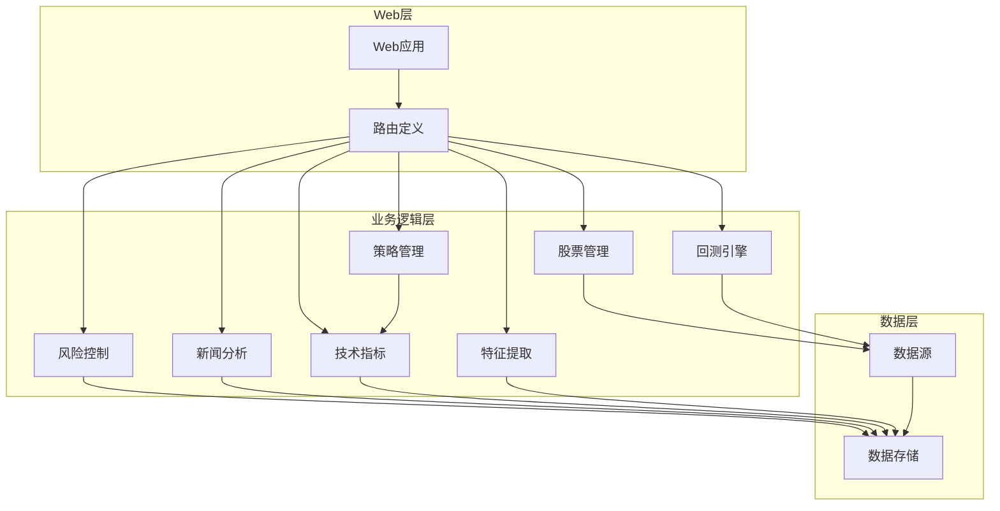
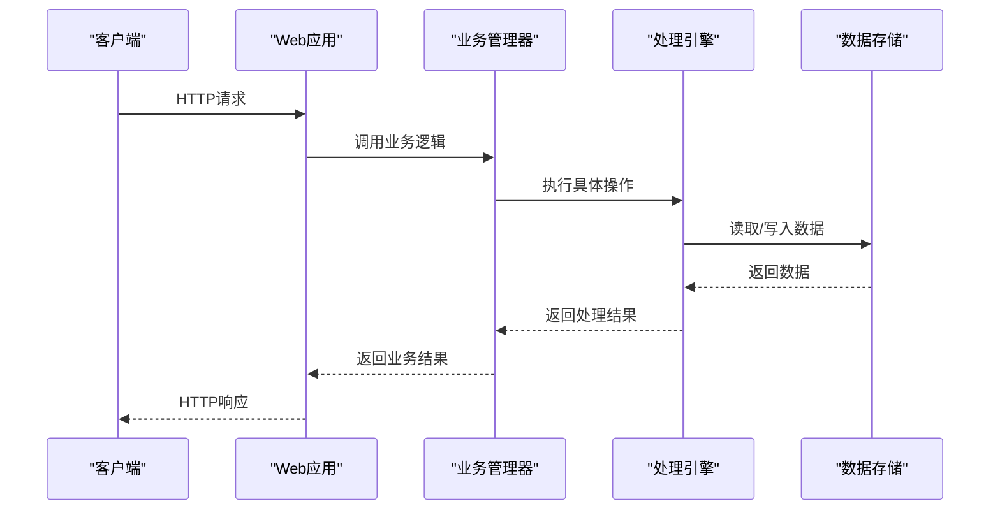
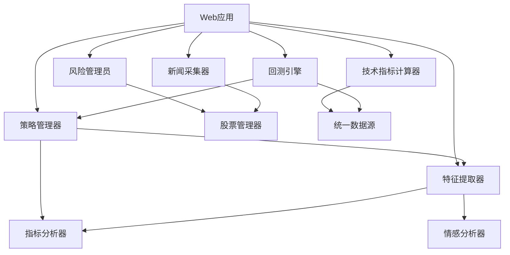

# API接口文档

<cite>
**本文档引用的文件**
- [web_app.py](file://quant_system/web_app.py)
- [strategy.py](file://quant_system/strategy.py)
- [backtest.py](file://quant_system/backtest.py)
- [risk_manager.py](file://quant_system/risk_manager.py)
- [news_collector.py](file://quant_system/news_collector.py)
- [indicators.py](file://quant_system/indicators.py)
- [feature_extractor.py](file://quant_system/feature_extractor.py)
- [config.yaml](file://config.yaml)
- [stocks.yaml](file://config/stocks.yaml)
- [main.py](file://main.py)
- [requirements.txt](file://requirements.txt)
</cite>

## 目录
1. [简介](#简介)
2. [项目结构](#项目结构)
3. [核心组件](#核心组件)
4. [架构概览](#架构概览)
5. [详细组件分析](#详细组件分析)
6. [依赖关系分析](#依赖关系分析)
7. [性能考虑](#性能考虑)
8. [故障排除指南](#故障排除指南)
9. [结论](#结论)
10. [附录](#附录)

## 简介
vibequation量化交易系统是一个基于Python开发的综合性量化交易平台，提供RESTful Web API接口，支持股票数据获取、技术指标计算、策略回测、风险管理和新闻情感分析等功能。系统采用Flask作为Web框架，集成了多种数据源和AI分析能力，为用户提供完整的量化交易解决方案。

## 项目结构
系统采用模块化设计，主要包含以下核心模块：
- Web应用层：提供RESTful API接口和Web界面
- 数据管理层：负责数据采集、存储和管理
- 策略层：实现各种量化交易策略
- 回测引擎：支持历史数据回测和性能分析
- 风控模块：管理仓位、止损止盈和风险控制
- 新闻情感分析：采集新闻并进行情感分析



**图表来源**
- [web_app.py:1-1126](file://quant_system/web_app.py#L1-L1126)
- [strategy.py:1-556](file://quant_system/strategy.py#L1-L556)
- [backtest.py:1-456](file://quant_system/backtest.py#L1-L456)

**章节来源**
- [web_app.py:1-1126](file://quant_system/web_app.py#L1-L1126)
- [main.py:1-365](file://main.py#L1-L365)

## 核心组件
系统的核心组件包括：

### Web应用组件
- Flask应用实例和路由配置
- RESTful API端点定义
- 错误处理和日志记录
- 前端模板渲染

### 数据管理组件
- 股票代码管理
- 历史数据获取和存储
- 实时数据更新
- 数据验证和清洗

### 策略管理组件
- 多种量化策略实现
- 策略规则解析和翻译
- AI辅助决策
- 策略回测执行

### 风控组件
- 仓位管理和风险控制
- 止损止盈机制
- 资金管理和流动性控制
- 风险指标计算

**章节来源**
- [web_app.py:1-1126](file://quant_system/web_app.py#L1-L1126)
- [strategy.py:1-556](file://quant_system/strategy.py#L1-L556)
- [risk_manager.py:1-404](file://quant_system/risk_manager.py#L1-L404)

## 架构概览
系统采用分层架构设计，各层职责明确，耦合度低，便于维护和扩展。



**图表来源**
- [web_app.py:47-824](file://quant_system/web_app.py#L47-L824)
- [strategy.py:318-460](file://quant_system/strategy.py#L318-L460)

## 详细组件分析

### 股票数据API

#### 股票列表获取
- **URL**: `/api/stocks`
- **方法**: GET
- **功能**: 获取所有股票的基本信息
- **响应**: 股票列表数组，包含代码、名称、市场、类型等信息

#### 股票历史数据获取
- **URL**: `/api/stock/<code>/data`
- **方法**: GET
- **参数**:
  - `start`: 开始日期 (YYYYMMDD)，默认为一年前
  - `end`: 结束日期 (YYYYMMDD)，默认为今天
  - `freq`: 数据频率 (day/week/month)，默认为day
- **功能**: 获取指定股票的历史数据
- **响应**: 历史数据数组，包含OHLCV等字段

#### 技术指标获取
- **URL**: `/api/stock/<code>/indicators`
- **方法**: GET
- **参数**:
  - `freq`: 数据频率，默认为day
- **功能**: 获取股票技术指标数据
- **响应**: 包含最新指标值和历史指标数据的对象

#### K线图数据生成
- **URL**: `/api/stock/<code>/chart`
- **方法**: GET
- **参数**:
  - `start`: 开始日期，默认为180天前
  - `end`: 结束日期，默认为今天
- **功能**: 生成股票K线图数据
- **响应**: Plotly图表JSON数据

**章节来源**
- [web_app.py:47-224](file://quant_system/web_app.py#L47-L224)
- [indicators.py:188-328](file://quant_system/indicators.py#L188-L328)

### 策略相关API

#### 策略列表获取
- **URL**: `/api/strategies`
- **方法**: GET
- **功能**: 获取所有可用策略名称
- **响应**: 策略名称数组

#### 策略详情获取
- **URL**: `/api/strategy/<name>`
- **方法**: GET
- **功能**: 获取指定策略的详细信息
- **响应**: 策略配置对象

#### 策略执行
- **URL**: `/api/strategy/run`
- **方法**: POST
- **请求体**:
  ```json
  {
    "code": "股票代码",
    "strategy": "策略名称"
  }
  ```
- **功能**: 执行指定策略并返回决策结果
- **响应**: 包含操作建议、仓位比例、置信度等信息

#### 回测运行
- **URL**: `/api/backtest/run`
- **方法**: POST
- **请求体**:
  ```json
  {
    "code": "股票代码",
    "strategy": "策略名称",
    "start_date": "开始日期",
    "end_date": "结束日期",
    "initial_capital": 1000000
  }
  ```
- **功能**: 对指定策略进行历史回测
- **响应**: 包含回测结果指标的详细报告

#### 回测图表生成
- **URL**: `/api/backtest/chart`
- **方法**: POST
- **请求体**: 与回测运行相同的参数
- **功能**: 生成回测权益曲线图表
- **响应**: Plotly图表JSON数据

**章节来源**
- [web_app.py:227-373](file://quant_system/web_app.py#L227-L373)
- [strategy.py:397-460](file://quant_system/strategy.py#L397-L460)
- [backtest.py:75-282](file://quant_system/backtest.py#L75-L282)

### 风险管理API

#### 组合风险信息
- **URL**: `/api/risk/portfolio`
- **方法**: GET
- **功能**: 获取投资组合整体风险指标
- **响应**: 包含总资产、可用资金、仓位比例等风险指标

#### 持仓信息
- **URL**: `/api/risk/positions`
- **方法**: GET
- **功能**: 获取当前持仓汇总信息
- **响应**: 持仓详情数组

#### 资金信息管理
- **URL**: `/api/risk/capital`
- **方法**: GET/POST
- **功能**: 获取或更新资金信息
- **响应**: 资金状态对象

#### 持仓管理
- **URL**: `/api/risk/position`
- **方法**: POST/DELETE
- **功能**: 添加、更新或删除持仓
- **响应**: 操作结果状态

#### 风控设置管理
- **URL**: `/api/risk/settings`
- **方法**: GET/POST
- **功能**: 获取或更新风控参数
- **响应**: 风控设置对象

**章节来源**
- [web_app.py:376-525](file://quant_system/web_app.py#L376-L525)
- [risk_manager.py:241-349](file://quant_system/risk_manager.py#L241-L349)

### 新闻情感分析API

#### 新闻数据获取
- **URL**: `/api/news/<code>`
- **方法**: GET
- **功能**: 获取指定股票相关新闻
- **响应**: 新闻列表，包含标题、链接、发布时间等

#### 情感分析数据
- **URL**: `/api/sentiment/<code>`
- **方法**: GET
- **功能**: 获取每日情感分析汇总
- **响应**: 按日期分组的情感分析结果

#### 特征分析
- **URL**: `/api/features/<code>`
- **方法**: GET
- **功能**: 获取AI特征分析结果
- **响应**: 包含技术特征、情感特征等分析结果

**章节来源**
- [web_app.py:528-596](file://quant_system/web_app.py#L528-L596)
- [news_collector.py:43-202](file://quant_system/news_collector.py#L43-L202)
- [feature_extractor.py:190-320](file://quant_system/feature_extractor.py#L190-L320)

### AI决策API

#### AI决策生成
- **URL**: `/api/ai/decision`
- **方法**: POST
- **请求体**:
  ```json
  {
    "code": "股票代码",
    "strategy_description": "策略描述"
  }
  ```
- **功能**: 获取AI综合决策建议
- **响应**: 包含操作建议、置信度、风险评估等的决策结果

**章节来源**
- [web_app.py:599-623](file://quant_system/web_app.py#L599-L623)
- [strategy.py:468-550](file://quant_system/strategy.py#L468-L550)

### 策略管理API

#### 创建策略
- **URL**: `/api/strategy/create`
- **方法**: POST
- **请求体**:
  ```json
  {
    "name": "策略名称",
    "description": "策略描述",
    "rules": [
      {
        "condition": "条件表达式",
        "action": "buy/sell/hold",
        "position_ratio": 0.5,
        "reason": "规则说明"
      }
    ]
  }
  ```
- **功能**: 创建新的自定义策略
- **响应**: 创建结果和策略详情

#### 删除策略
- **URL**: `/api/strategy/<name>`
- **方法**: DELETE
- **功能**: 删除指定策略
- **响应**: 删除结果状态

#### 更新策略
- **URL**: `/api/strategy/<name>/update`
- **方法**: POST
- **请求体**: 与创建策略相同
- **功能**: 更新现有策略
- **响应**: 更新结果和策略详情

#### 策略翻译
- **URL**: `/api/strategy/translate`
- **方法**: POST
- **请求体**:
  ```json
  {
    "text": "自然语言描述或规则列表",
    "direction": "to_rules/to_natural"
  }
  ```
- **功能**: 自然语言与量化规则互译
- **响应**: 翻译结果

**章节来源**
- [web_app.py:628-772](file://quant_system/web_app.py#L628-L772)
- [strategy.py:56-148](file://quant_system/strategy.py#L56-L148)

### 数据更新API

#### 一键数据更新
- **URL**: `/api/data/update`
- **方法**: POST
- **请求体**:
  ```json
  {
    "codes": ["股票代码列表"],
    "type": "all/history/news/indicators"
  }
  ```
- **功能**: 批量更新各类数据
- **响应**: 更新任务状态

#### 实时数据更新
- **URL**: `/api/data/realtime`
- **方法**: POST
- **请求体**:
  ```json
  {
    "codes": ["股票代码列表"],
    "interval": 5,
    "duration": 300
  }
  ```
- **功能**: 启动实时数据更新任务
- **响应**: 启动结果

#### 实时更新停止
- **URL**: `/api/data/realtime/stop`
- **方法**: POST
- **功能**: 停止实时数据更新
- **响应**: 停止结果

**章节来源**
- [web_app.py:786-940](file://quant_system/web_app.py#L786-L940)

### 调度器API

#### 调度器状态
- **URL**: `/api/scheduler/status`
- **方法**: GET
- **功能**: 获取调度器运行状态
- **响应**: 调度器状态信息

#### 调度器配置
- **URL**: `/api/scheduler/config`
- **方法**: GET/POST
- **功能**: 获取或更新调度器配置
- **响应**: 配置信息

#### 手动触发调度
- **URL**: `/api/scheduler/run`
- **方法**: POST
- **功能**: 手动触发调度器运行
- **响应**: 执行结果

**章节来源**
- [web_app.py:945-991](file://quant_system/web_app.py#L945-L991)

## 依赖关系分析

系统采用模块化设计，各组件间依赖关系清晰：



**图表来源**
- [web_app.py:17-26](file://quant_system/web_app.py#L17-L26)
- [strategy.py:19-22](file://quant_system/strategy.py#L19-L22)
- [risk_manager.py:17-19](file://quant_system/risk_manager.py#L17-L19)

**章节来源**
- [requirements.txt:1-33](file://requirements.txt#L1-L33)

## 性能考虑
系统在设计时充分考虑了性能优化：

### 缓存策略
- 技术指标数据缓存，避免重复计算
- 股票新闻数据本地存储
- 特征分析结果缓存

### 异步处理
- 数据更新任务异步执行
- 实时数据更新使用线程池
- 大数据量处理分批进行

### 数据优化
- 使用pandas进行高效数据处理
- 数值计算使用numpy优化
- JSON序列化使用专门编码器

## 故障排除指南

### 常见错误及解决方案

#### API调用错误
- **400 Bad Request**: 请求参数不完整或格式错误
- **404 Not Found**: 资源不存在或数据为空
- **500 Internal Server Error**: 服务器内部错误

#### 数据获取问题
- **数据为空**: 检查股票代码是否正确，确认数据源可用性
- **网络超时**: 增加超时时间，检查网络连接
- **解析失败**: 验证数据格式，检查编码设置

#### 性能问题
- **响应缓慢**: 检查数据缓存配置，优化查询条件
- **内存不足**: 实施数据分页，清理临时数据

**章节来源**
- [web_app.py:79-82](file://quant_system/web_app.py#L79-L82)
- [web_app.py:137-140](file://quant_system/web_app.py#L137-L140)

## 结论
vibequation量化交易系统提供了完整的RESTful API接口，涵盖了量化交易的各个方面。系统采用模块化设计，具有良好的扩展性和维护性。通过标准化的API接口，用户可以方便地集成第三方应用，构建自己的量化交易解决方案。

## 附录

### API版本管理
系统采用语义化版本控制，当前版本为1.0.0。版本管理遵循以下原则：
- 主版本号：重大架构变更
- 次版本号：新增功能
- 修订版本号：bug修复和小改进

### 配置文件说明
系统使用YAML格式配置文件，主要配置项包括：
- 数据存储路径配置
- API令牌配置
- 技术指标参数配置
- AI模型配置
- 风控参数配置

### 安装和部署
系统依赖Python 3.8+，主要依赖包包括pandas、numpy、flask、tushare等。部署时需要：
1. 安装Python环境
2. 安装依赖包
3. 配置数据库连接
4. 启动Web服务

**章节来源**
- [config.yaml:1-88](file://config.yaml#L1-L88)
- [requirements.txt:1-33](file://requirements.txt#L1-L33)