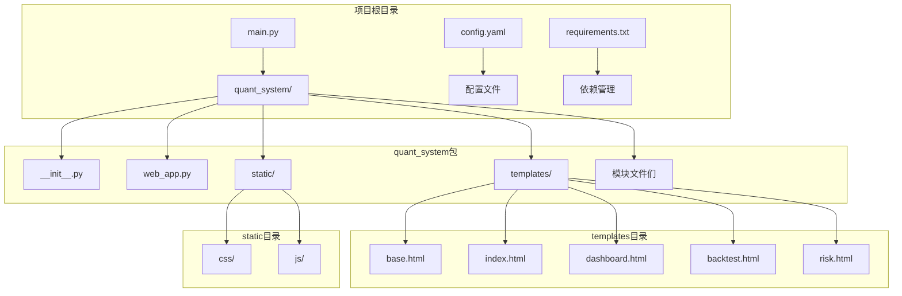
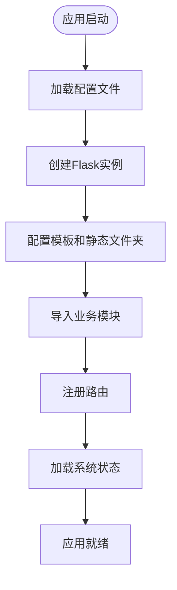
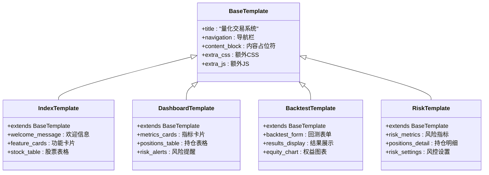
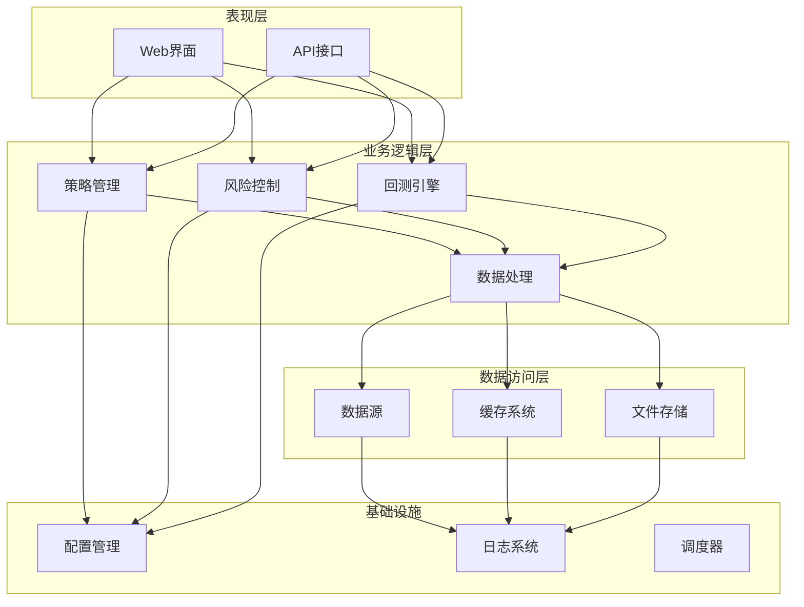
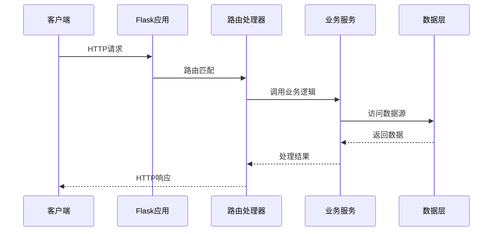
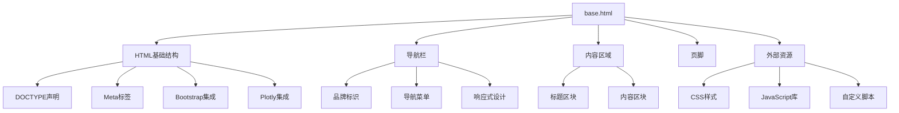
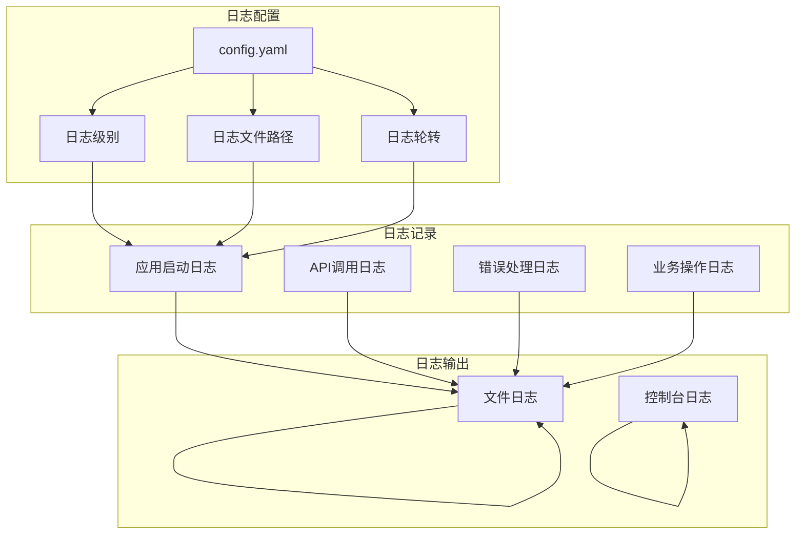
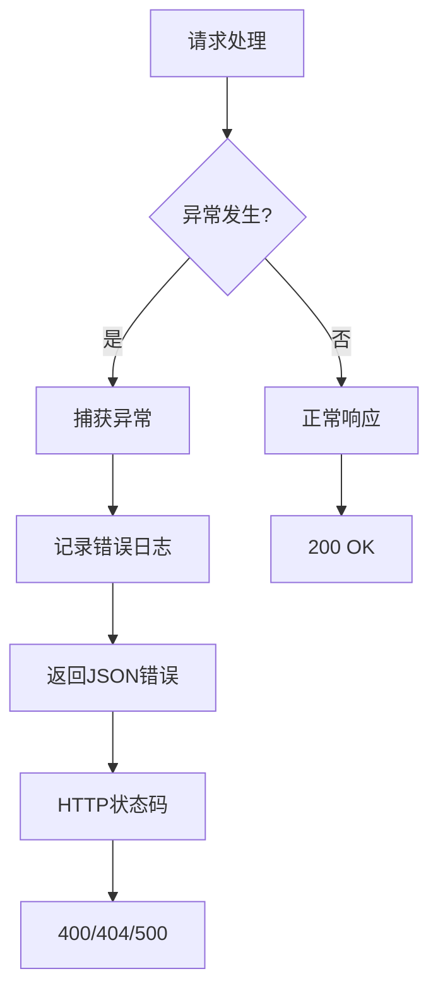
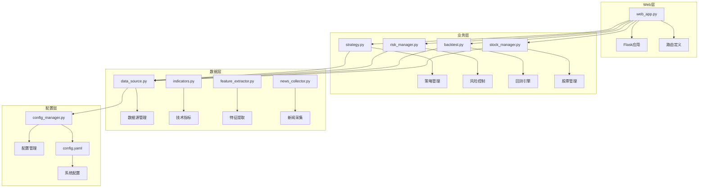
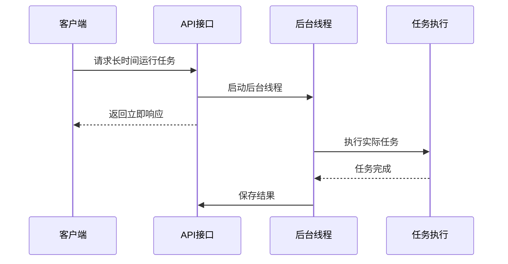

# Web架构设计

<cite>
**本文档引用的文件**
- [web_app.py](file://quant_system/web_app.py)
- [main.py](file://main.py)
- [config.yaml](file://config.yaml)
- [base.html](file://quant_system/templates/base.html)
- [index.html](file://quant_system/templates/index.html)
- [dashboard.html](file://quant_system/templates/dashboard.html)
- [backtest.html](file://quant_system/templates/backtest.html)
- [risk.html](file://quant_system/templates/risk.html)
- [__init__.py](file://quant_system/__init__.py)
</cite>

## 目录
1. [引言](#引言)
2. [项目结构](#项目结构)
3. [核心组件](#核心组件)
4. [架构概览](#架构概览)
5. [详细组件分析](#详细组件分析)
6. [依赖关系分析](#依赖关系分析)
7. [性能考虑](#性能考虑)
8. [故障排除指南](#故障排除指南)
9. [结论](#结论)

## 引言

vibequation量化交易系统是一个基于Flask的Web可视化界面，提供了完整的量化交易数据分析和策略回测功能。该系统采用模块化架构设计，通过清晰的分层结构实现了数据采集、技术分析、策略执行和风险控制的完整闭环。

系统的核心设计理念是"数据驱动的量化交易"，通过Web界面为用户提供直观的数据可视化和交互式分析工具。整个架构围绕Flask应用展开，结合了现代化的前端技术和丰富的金融数据处理能力。

## 项目结构

项目的整体结构遵循Python包的标准组织方式，采用了功能模块化的目录布局：



**图表来源**
- [main.py:1-50](file://main.py#L1-L50)
- [__init__.py:1-24](file://quant_system/__init#.py#L1-L24)

**章节来源**
- [main.py:1-50](file://main.py#L1-L50)
- [__init__.py:1-24](file://quant_system/__init__.py#L1-L24)

## 核心组件

### Flask应用初始化

系统使用Flask框架构建Web服务，应用初始化过程体现了清晰的模块分离原则：



**图表来源**
- [web_app.py:33-36](file://quant_system/web_app.py#L33-L36)
- [web_app.py:846-868](file://quant_system/web_app.py#L846-L868)

应用初始化的关键特性包括：
- **模板配置**：通过`template_folder='templates'`和`static_folder='static'`明确指定模板和静态资源路径
- **模块导入**：按需导入各个业务模块，避免循环依赖
- **状态管理**：启动时自动加载持久化的系统状态

### 模板系统架构

系统采用Jinja2模板引擎，通过模板继承机制实现统一的UI设计：



**图表来源**
- [base.html:1-61](file://quant_system/templates/base.html#L1-L61)
- [index.html:1-92](file://quant_system/templates/index.html#L1-L92)
- [dashboard.html:1-196](file://quant_system/templates/dashboard.html#L1-L196)
- [backtest.html:1-200](file://quant_system/templates/backtest.html#L1-L200)
- [risk.html:1-242](file://quant_system/templates/risk.html#L1-L242)

**章节来源**
- [base.html:1-61](file://quant_system/templates/base.html#L1-L61)
- [index.html:1-92](file://quant_system/templates/index.html#L1-L92)
- [dashboard.html:1-196](file://quant_system/templates/dashboard.html#L1-L196)

## 架构概览

系统采用分层架构设计，各层职责明确，耦合度低：



**图表来源**
- [web_app.py:17-26](file://quant_system/web_app.py#L17-L26)
- [main.py:14-24](file://main.py#L14-L24)

### 路由系统设计

系统采用RESTful API设计模式，路由组织清晰有序：

```mermaid
graph LR
subgraph "页面路由"
A[/] --> A1[首页]
B[/dashboard] --> B1[仪表盘]
C[/backtest] --> C1[回测页面]
D[/risk] --> D1[风控页面]
E[/strategy] --> E1[策略页面]
F[/stock/:code] --> F1[股票详情]
end
subgraph "API路由"
G[/api/stocks] --> G1[获取股票列表]
H[/api/stock/:code/data] --> H1[获取历史数据]
I[/api/stock/:code/indicators] --> I1[获取技术指标]
J[/api/stock/:code/chart] --> J1[获取K线图]
K[/api/strategies] --> K1[获取策略列表]
L[/api/backtest/run] --> L1[运行回测]
M[/api/risk/*] --> M1[风控相关API]
N[/api/news/:code] --> N1[新闻数据]
O[/api/features/:code] --> O1[特征分析]
end
```

**图表来源**
- [web_app.py:41-842](file://quant_system/web_app.py#L41-L842)

**章节来源**
- [web_app.py:41-842](file://quant_system/web_app.py#L41-L842)

## 详细组件分析

### Web应用核心组件

#### 应用初始化流程

应用启动时执行以下关键步骤：

1. **配置加载**：从`config.yaml`加载系统配置
2. **模块导入**：导入所有业务模块（数据源、策略、风险控制等）
3. **状态恢复**：从持久化文件恢复系统状态
4. **路由注册**：注册所有页面和API路由
5. **服务启动**：根据配置启动Web服务器

#### 路由设计模式

系统采用分层路由组织：



**图表来源**
- [web_app.py:47-58](file://quant_system/web_app.py#L47-L58)
- [web_app.py:61-108](file://quant_system/web_app.py#L61-L108)

### 模板继承机制

#### base.html父模板设计

base.html作为所有页面的父模板，提供了统一的HTML结构和样式：



**图表来源**
- [base.html:1-61](file://quant_system/templates/base.html#L1-L61)

#### 子模板继承关系

每个子模板都继承自base.html，并扩展特定的功能区域：

| 模板文件 | 继承关系 | 特殊功能 |
|---------|----------|----------|
| index.html | 继承base.html | 首页欢迎信息、功能介绍、股票列表 |
| dashboard.html | 继承base.html | 仪表盘指标、持仓管理、风险监控 |
| backtest.html | 继承base.html | 回测参数设置、结果展示、图表显示 |
| risk.html | 继承base.html | 风控指标、设置管理、风险提醒 |

**章节来源**
- [base.html:1-61](file://quant_system/templates/base.html#L1-L61)
- [index.html:1-92](file://quant_system/templates/index.html#L1-L92)
- [dashboard.html:1-196](file://quant_system/templates/dashboard.html#L1-L196)

### 中间件和全局配置

#### 日志记录系统

系统实现了多层次的日志记录机制：



**图表来源**
- [main.py:27-42](file://main.py#L27-L42)
- [web_app.py:31](file://quant_system/web_app.py#L31)

#### 错误处理策略

系统采用统一的错误处理机制：



**图表来源**
- [web_app.py:79-81](file://quant_system/web_app.py#L79-L81)
- [web_app.py:106-108](file://quant_system/web_app.py#L106-L108)

**章节来源**
- [main.py:27-42](file://main.py#L27-L42)
- [web_app.py:31](file://quant_system/web_app.py#L31)

## 依赖关系分析

### 模块依赖图

系统模块之间的依赖关系体现了清晰的分层架构：



**图表来源**
- [web_app.py:17-26](file://quant_system/web_app.py#L17-L26)
- [main.py:14-24](file://main.py#L14-L24)

### 关键依赖关系

系统的关键依赖关系包括：

1. **应用依赖**：web_app.py依赖所有业务模块
2. **业务依赖**：各业务模块相互独立，通过统一接口交互
3. **数据依赖**：业务模块依赖数据源和配置管理
4. **配置依赖**：所有模块依赖配置管理系统

**章节来源**
- [web_app.py:17-26](file://quant_system/web_app.py#L17-L26)
- [main.py:14-24](file://main.py#L14-L24)

## 性能考虑

### 缓存策略

系统实现了多层级的缓存机制：

1. **技术指标缓存**：计算后的技术指标保存到文件系统
2. **数据缓存**：历史数据和实时数据进行缓存管理
3. **图表缓存**：生成的图表数据进行临时缓存

### 异步处理

对于耗时操作，系统采用异步处理策略：



**图表来源**
- [web_app.py:726-738](file://quant_system/web_app.py#L726-L738)

### 资源管理

系统在资源管理方面采取了多项优化措施：

1. **静态资源优化**：CSS和JavaScript文件进行压缩和合并
2. **数据库连接池**：复用数据库连接减少开销
3. **内存管理**：及时释放不再使用的数据对象

## 故障排除指南

### 常见问题诊断

#### 启动问题

**问题**：应用无法启动
**可能原因**：
- 配置文件格式错误
- 依赖包缺失
- 端口被占用

**解决方案**：
1. 检查config.yaml语法
2. 运行pip install -r requirements.txt
3. 更改端口号或停止占用进程

#### API调用失败

**问题**：API接口返回错误
**诊断步骤**：
1. 查看日志文件中的错误信息
2. 验证请求参数格式
3. 检查后端服务状态

#### 数据加载问题

**问题**：股票数据无法加载
**排查方法**：
1. 检查网络连接
2. 验证API密钥有效性
3. 确认数据目录权限

**章节来源**
- [main.py:27-42](file://main.py#L27-L42)
- [web_app.py:79-81](file://quant_system/web_app.py#L79-L81)

## 结论

vibequation量化交易系统的Web架构设计体现了现代Web应用的最佳实践。通过Flask框架的强大功能和Jinja2模板引擎的灵活特性，系统实现了功能完整、结构清晰、易于维护的量化交易可视化平台。

系统的主要优势包括：

1. **模块化设计**：清晰的分层架构便于功能扩展和维护
2. **模板继承**：统一的UI设计确保用户体验一致性
3. **RESTful API**：规范的接口设计便于前后端分离
4. **完善的日志系统**：全面的错误追踪和性能监控
5. **配置驱动**：灵活的配置管理适应不同部署环境

该架构为量化交易系统的进一步发展奠定了坚实的基础，支持未来功能的平滑扩展和性能的持续优化。