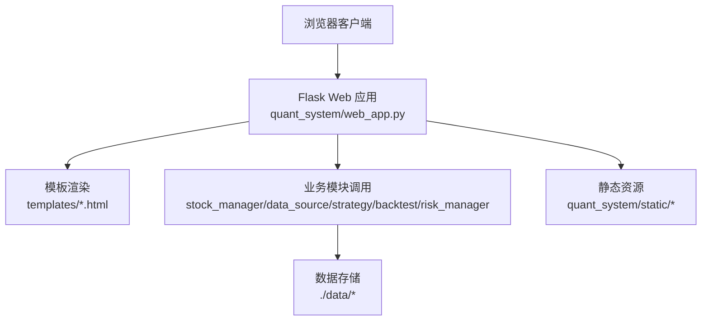
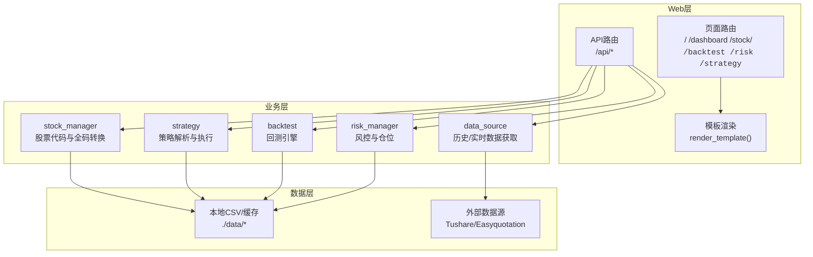
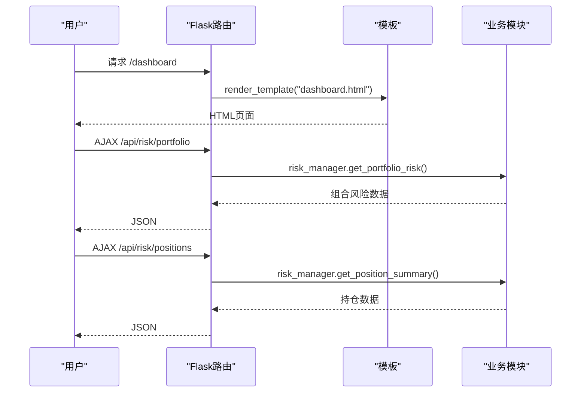
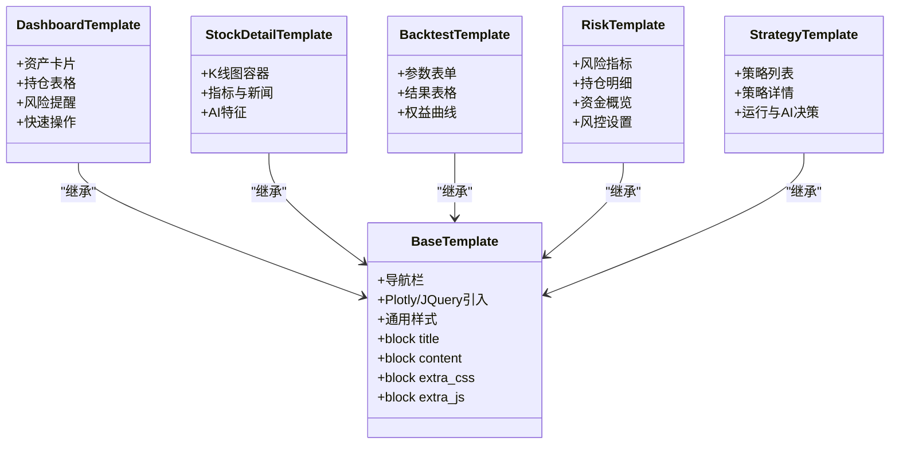
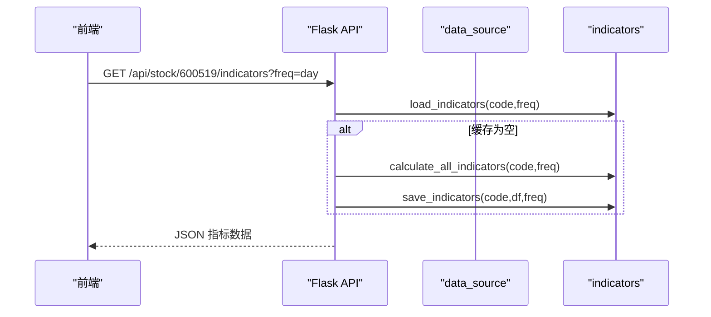
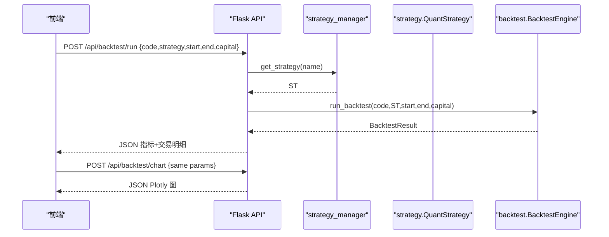
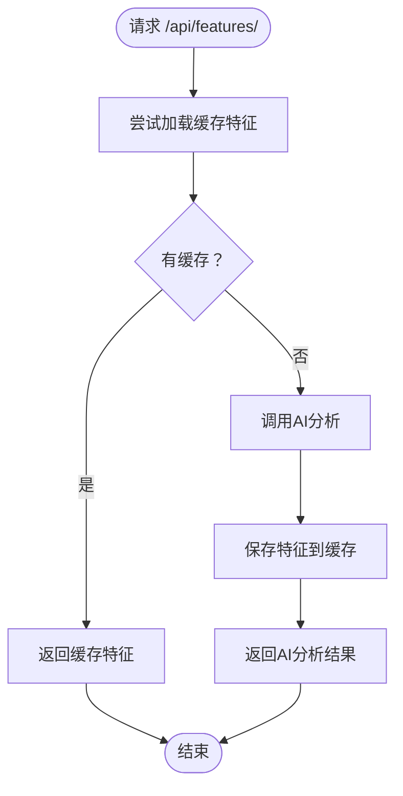
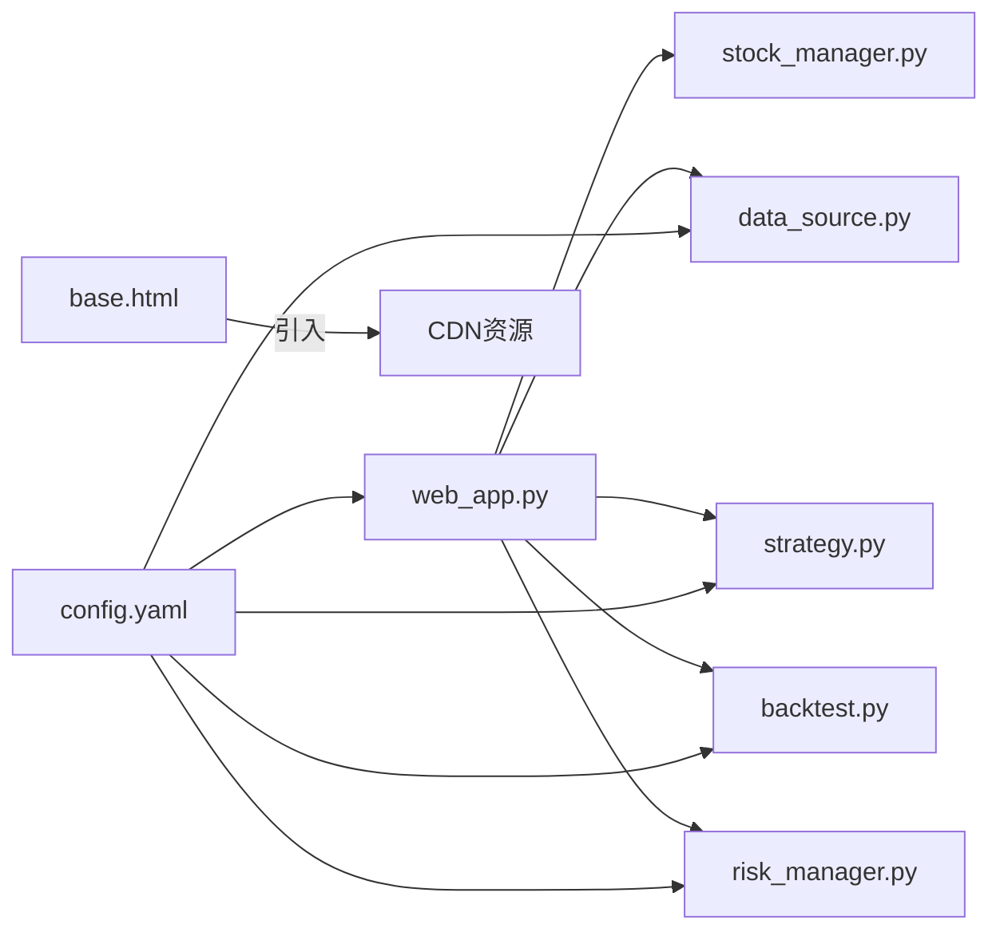

# Web界面

<cite>
**本文引用的文件**
- [quant_system/web_app.py](file://quant_system/web_app.py)
- [quant_system/templates/base.html](file://quant_system/templates/base.html)
- [quant_system/templates/dashboard.html](file://quant_system/templates/dashboard.html)
- [quant_system/templates/stock_detail.html](file://quant_system/templates/stock_detail.html)
- [quant_system/templates/backtest.html](file://quant_system/templates/backtest.html)
- [quant_system/templates/risk.html](file://quant_system/templates/risk.html)
- [quant_system/templates/strategy.html](file://quant_system/templates/strategy.html)
- [quant_system/stock_manager.py](file://quant_system/stock_manager.py)
- [quant_system/data_source.py](file://quant_system/data_source.py)
- [quant_system/strategy.py](file://quant_system/strategy.py)
- [quant_system/backtest.py](file://quant_system/backtest.py)
- [quant_system/risk_manager.py](file://quant_system/risk_manager.py)
- [config.yaml](file://config.yaml)
- [config/stocks.yaml](file://config/stocks.yaml)
- [main.py](file://main.py)
</cite>

## 目录
1. [简介](#简介)
2. [项目结构](#项目结构)
3. [核心组件](#核心组件)
4. [架构总览](#架构总览)
5. [详细组件分析](#详细组件分析)
6. [依赖分析](#依赖分析)
7. [性能考虑](#性能考虑)
8. [故障排查指南](#故障排查指南)
9. [结论](#结论)
10. [附录](#附录)

## 简介
本文件面向vibequation量化交易系统Web界面，系统基于Flask构建，提供仪表盘、股票详情、回测、风控、策略等页面，并配套RESTful API接口。文档覆盖架构设计、路由与模板渲染机制、页面功能布局与交互、数据展示方式、API接口规范、错误处理与前端静态资源管理，帮助开发者与使用者快速理解与使用系统。

## 项目结构
- Web应用入口与路由：quant_system/web_app.py
- 模板系统：quant_system/templates/*.html
- 配置文件：config.yaml、config/stocks.yaml
- 主程序入口：main.py
- 业务模块（被Web层调用）：stock_manager.py、data_source.py、strategy.py、backtest.py、risk_manager.py

**图表来源**
- [quant_system/web_app.py:30-466](file://quant_system/web_app.py#L30-L466)
- [quant_system/templates/base.html:1-61](file://quant_system/templates/base.html#L1-L61)

**章节来源**
- [quant_system/web_app.py:29-466](file://quant_system/web_app.py#L29-L466)
- [quant_system/templates/base.html:1-61](file://quant_system/templates/base.html#L1-L61)
- [config.yaml:1-88](file://config.yaml#L1-L88)
- [config/stocks.yaml:1-71](file://config/stocks.yaml#L1-L71)

## 核心组件
- Flask应用与路由：定义页面路由与API路由，负责模板渲染与JSON响应。
- 模板系统：基于Jinja2，base.html提供通用导航与样式，各页面模板继承扩展。
- 业务模块：股票管理、数据源、策略、回测、风控等模块供API调用。
- 配置系统：全局配置、数据目录、Web服务、风控与回测参数等。

**章节来源**
- [quant_system/web_app.py:35-466](file://quant_system/web_app.py#L35-L466)
- [quant_system/templates/base.html:22-45](file://quant_system/templates/base.html#L22-L45)
- [config.yaml:76-88](file://config.yaml#L76-L88)

## 架构总览
Web层采用MVC思想：控制器（Flask路由）负责接收请求、调用业务模块、渲染模板或返回JSON；视图（Jinja2模板）负责页面布局与交互；模型（业务模块）封装数据与算法逻辑。

**图表来源**
- [quant_system/web_app.py:37-466](file://quant_system/web_app.py#L37-L466)
- [quant_system/stock_manager.py:62-129](file://quant_system/stock_manager.py#L62-L129)
- [quant_system/data_source.py:24-200](file://quant_system/data_source.py#L24-L200)
- [quant_system/strategy.py:56-200](file://quant_system/strategy.py#L56-L200)
- [quant_system/backtest.py:66-200](file://quant_system/backtest.py#L66-L200)
- [quant_system/risk_manager.py:47-200](file://quant_system/risk_manager.py#L47-L200)

## 详细组件分析

### 页面与路由设计
- 首页：/，渲染index.html（空模板，用于后续扩展）
- 仪表盘：/dashboard，渲染dashboard.html，展示资产、持仓、风险提醒与快速操作
- 股票详情：/stock/<code>，渲染stock_detail.html，展示K线图、技术指标、新闻与AI特征
- 回测页面：/backtest，渲染backtest.html，提供参数设置与回测结果展示
- 风控页面：/risk，渲染risk.html，展示组合风险、持仓明细与风控设置
- 策略页面：/strategy，渲染strategy.html，展示策略列表、详情、运行与AI决策

**图表来源**
- [quant_system/web_app.py:412-466](file://quant_system/web_app.py#L412-L466)
- [quant_system/templates/dashboard.html:111-196](file://quant_system/templates/dashboard.html#L111-L196)
- [quant_system/risk_manager.py:47-200](file://quant_system/risk_manager.py#L47-L200)

**章节来源**
- [quant_system/web_app.py:37-466](file://quant_system/web_app.py#L37-L466)
- [quant_system/templates/dashboard.html:1-196](file://quant_system/templates/dashboard.html#L1-L196)
- [quant_system/templates/stock_detail.html:1-193](file://quant_system/templates/stock_detail.html#L1-L193)
- [quant_system/templates/backtest.html:1-200](file://quant_system/templates/backtest.html#L1-L200)
- [quant_system/templates/risk.html:1-242](file://quant_system/templates/risk.html#L1-L242)
- [quant_system/templates/strategy.html:1-274](file://quant_system/templates/strategy.html#L1-L274)

### 模板系统与布局
- base.html提供Bootstrap导航栏、Plotly与jQuery引入、通用CSS样式与块扩展点
- 各页面模板继承base.html，通过block注入内容与额外JS/CSS

**图表来源**
- [quant_system/templates/base.html:1-61](file://quant_system/templates/base.html#L1-L61)
- [quant_system/templates/dashboard.html:1-196](file://quant_system/templates/dashboard.html#L1-L196)
- [quant_system/templates/stock_detail.html:1-193](file://quant_system/templates/stock_detail.html#L1-L193)
- [quant_system/templates/backtest.html:1-200](file://quant_system/templates/backtest.html#L1-L200)
- [quant_system/templates/risk.html:1-242](file://quant_system/templates/risk.html#L1-L242)
- [quant_system/templates/strategy.html:1-274](file://quant_system/templates/strategy.html#L1-L274)

**章节来源**
- [quant_system/templates/base.html:1-61](file://quant_system/templates/base.html#L1-L61)
- [quant_system/templates/dashboard.html:1-196](file://quant_system/templates/dashboard.html#L1-L196)
- [quant_system/templates/stock_detail.html:1-193](file://quant_system/templates/stock_detail.html#L1-L193)
- [quant_system/templates/backtest.html:1-200](file://quant_system/templates/backtest.html#L1-L200)
- [quant_system/templates/risk.html:1-242](file://quant_system/templates/risk.html#L1-L242)
- [quant_system/templates/strategy.html:1-274](file://quant_system/templates/strategy.html#L1-L274)

### API接口设计与数据流

#### 股票与数据API
- GET /api/stocks：返回股票列表（代码、名称、市场、类型、完整代码）
- GET /api/stock/<code>/data：返回历史K线数据（支持日期与频率参数）
- GET /api/stock/<code>/indicators：返回技术指标（优先读缓存，缺失则计算并保存）
- GET /api/stock/<code>/chart：返回Plotly K线图数据（含均线）

**图表来源**
- [quant_system/web_app.py:80-105](file://quant_system/web_app.py#L80-L105)
- [quant_system/web_app.py:107-163](file://quant_system/web_app.py#L107-L163)

**章节来源**
- [quant_system/web_app.py:43-163](file://quant_system/web_app.py#L43-L163)

#### 回测API
- GET /api/strategies：策略列表
- GET /api/strategy/<name>：策略详情
- POST /api/strategy/run：运行策略并返回决策
- POST /api/backtest/run：运行回测并返回指标与交易明细
- POST /api/backtest/chart：返回Plotly权益曲线图

**图表来源**
- [quant_system/web_app.py:165-312](file://quant_system/web_app.py#L165-L312)
- [quant_system/backtest.py:66-200](file://quant_system/backtest.py#L66-L200)

**章节来源**
- [quant_system/web_app.py:165-312](file://quant_system/web_app.py#L165-L312)
- [quant_system/backtest.py:66-200](file://quant_system/backtest.py#L66-L200)

#### 风控与新闻API
- GET /api/risk/portfolio：组合风险指标与告警
- GET /api/risk/positions：持仓汇总
- GET /api/news/<code>：新闻列表（最近50条）
- GET /api/sentiment/<code>：情感分析
- GET /api/features/<code>：AI特征分析（若无则调用AI分析并缓存）
- POST /api/ai/decision：AI综合决策

**图表来源**
- [quant_system/web_app.py:368-381](file://quant_system/web_app.py#L368-L381)

**章节来源**
- [quant_system/web_app.py:314-381](file://quant_system/web_app.py#L314-L381)

### 页面功能与交互设计

#### 仪表盘页面
- 资产卡片：总资产、可用资金、仓位比例、浮动盈亏
- 持仓列表：按列显示代码、名称、持仓、成本价、现价、市值、盈亏
- 风险提醒：根据风控告警列表渲染
- 快速操作：下拉选择股票，跳转至详情或策略页面

**章节来源**
- [quant_system/templates/dashboard.html:12-108](file://quant_system/templates/dashboard.html#L12-L108)
- [quant_system/templates/dashboard.html:111-196](file://quant_system/templates/dashboard.html#L111-L196)

#### 股票详情页面
- K线图：Plotly Candlestick + MA均线
- 技术指标：展示RSI/MACD/KDJ/布林带位置等
- 新闻与情感：展示最近新闻及情感标签
- AI特征：展示AI分析结果与技术特征

**章节来源**
- [quant_system/templates/stock_detail.html:12-94](file://quant_system/templates/stock_detail.html#L12-L94)
- [quant_system/templates/stock_detail.html:97-193](file://quant_system/templates/stock_detail.html#L97-L193)

#### 回测页面
- 参数表单：股票、策略、起止日期、初始资金
- 结果展示：收益、风险、交易统计与明细
- 权益曲线：Plotly对比策略与买入持有

**章节来源**
- [quant_system/templates/backtest.html:12-62](file://quant_system/templates/backtest.html#L12-L62)
- [quant_system/templates/backtest.html:65-200](file://quant_system/templates/backtest.html#L65-L200)

#### 风控页面
- 风控指标：风险等级、总仓位、集中度、告警数量
- 持仓明细：含每只股票的盈亏百分比与占仓比例
- 资金概览：总资产、可用资金、持仓市值、浮动盈亏
- 风控设置：滑块调节最大仓位、单股上限、止损止盈比例（演示保存）

**章节来源**
- [quant_system/templates/risk.html:12-134](file://quant_system/templates/risk.html#L12-L134)
- [quant_system/templates/risk.html:150-242](file://quant_system/templates/risk.html#L150-L242)

#### 策略页面
- 策略列表与详情：展示规则列表与理由
- 运行策略：选择股票与策略，POST至后端返回决策
- AI决策：获取AI综合建议与理由

**章节来源**
- [quant_system/templates/strategy.html:12-89](file://quant_system/templates/strategy.html#L12-L89)
- [quant_system/templates/strategy.html:118-274](file://quant_system/templates/strategy.html#L118-L274)

### 数据展示与图表
- K线图：Plotly Candlestick + MA均线，返回JSON给前端绘制
- 权益曲线：Plotly折线图，对比策略与买入持有
- 交互：前端通过AJAX拉取数据，成功后使用Plotly.newPlot渲染

**章节来源**
- [quant_system/web_app.py:107-163](file://quant_system/web_app.py#L107-L163)
- [quant_system/web_app.py:264-312](file://quant_system/web_app.py#L264-L312)

## 依赖分析
- Web层对业务模块的依赖：通过模块导入与实例调用，形成清晰的分层
- 模板对静态资源的依赖：base.html引入Bootstrap、Plotly、jQuery
- 配置对数据目录与参数的影响：影响数据读写路径与回测/风控默认值

**图表来源**
- [quant_system/web_app.py:17-26](file://quant_system/web_app.py#L17-L26)
- [quant_system/templates/base.html:7-18](file://quant_system/templates/base.html#L7-L18)
- [config.yaml:10-88](file://config.yaml#L10-L88)

**章节来源**
- [quant_system/web_app.py:17-26](file://quant_system/web_app.py#L17-L26)
- [quant_system/templates/base.html:7-18](file://quant_system/templates/base.html#L7-L18)
- [config.yaml:10-88](file://config.yaml#L10-L88)

## 性能考虑
- 数据缓存：技术指标与特征优先读取本地缓存，缺失时再计算并落盘
- 限流与重试：Tushare数据源内置简单速率限制，避免频繁请求
- 前端懒加载：图表与列表通过AJAX按需加载，减少首屏压力
- 响应式布局：Bootstrap提供移动端适配

**章节来源**
- [quant_system/web_app.py:86-96](file://quant_system/web_app.py#L86-L96)
- [quant_system/web_app.py:372-376](file://quant_system/web_app.py#L372-L376)
- [quant_system/data_source.py:56-62](file://quant_system/data_source.py#L56-L62)
- [quant_system/templates/base.html:7-18](file://quant_system/templates/base.html#L7-L18)

## 故障排查指南
- API返回错误：检查后端日志，确认参数完整性与数据可用性
- 图表加载失败：确认Plotly与网络可达，检查后端返回JSON结构
- 股票代码问题：使用stock_manager的标准化方法，确保输入格式正确
- 配置问题：核对config.yaml中的数据目录、Web服务与风控参数

**章节来源**
- [quant_system/web_app.py:75-77](file://quant_system/web_app.py#L75-L77)
- [quant_system/web_app.py:100-104](file://quant_system/web_app.py#L100-L104)
- [quant_system/stock_manager.py:146-164](file://quant_system/stock_manager.py#L146-L164)
- [config.yaml:76-88](file://config.yaml#L76-L88)

## 结论
vibequation Web界面以Flask为核心，结合Jinja2模板与Plotly图表，提供了从实时监控到策略回测、从风控管理到AI辅助决策的完整可视化体验。通过清晰的API设计与模块化业务层，系统具备良好的可扩展性与可维护性。

## 附录

### API接口清单与规范
- 股票与数据
  - GET /api/stocks：返回股票列表
  - GET /api/stock/<code>/data?start&end&freq：历史数据
  - GET /api/stock/<code>/indicators?freq：技术指标
  - GET /api/stock/<code>/chart?start&end：K线图
- 策略与回测
  - GET /api/strategies：策略列表
  - GET /api/strategy/<name>：策略详情
  - POST /api/strategy/run：运行策略
  - POST /api/backtest/run：运行回测
  - POST /api/backtest/chart：权益曲线
- 风控与分析
  - GET /api/risk/portfolio：组合风险
  - GET /api/risk/positions：持仓汇总
  - GET /api/news/<code>：新闻
  - GET /api/sentiment/<code>：情感
  - GET /api/features/<code>：特征
  - POST /api/ai/decision：AI决策

**章节来源**
- [quant_system/web_app.py:43-407](file://quant_system/web_app.py#L43-L407)

### 配置要点
- Web服务：host、port、debug
- 数据目录：历史、实时、新闻、指标、特征、回测
- 技术指标：RSI周期、均线周期、MACD参数
- 回测：初始资金、手续费、滑点
- 风控：总仓位、单股上限、止损止盈

**章节来源**
- [config.yaml:76-88](file://config.yaml#L76-L88)
- [config.yaml:10-75](file://config.yaml#L10-L75)
- [config/stocks.yaml:1-71](file://config/stocks.yaml#L1-L71)