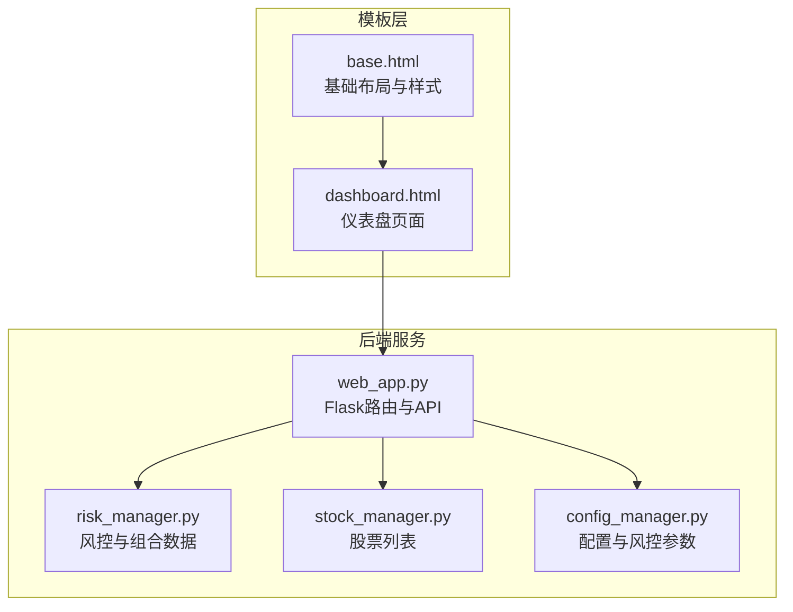
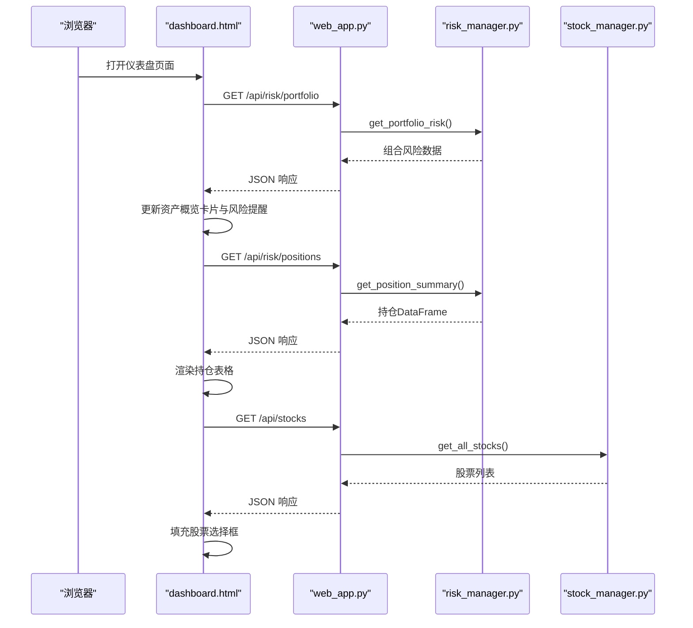
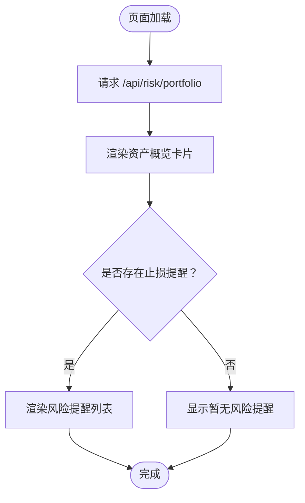
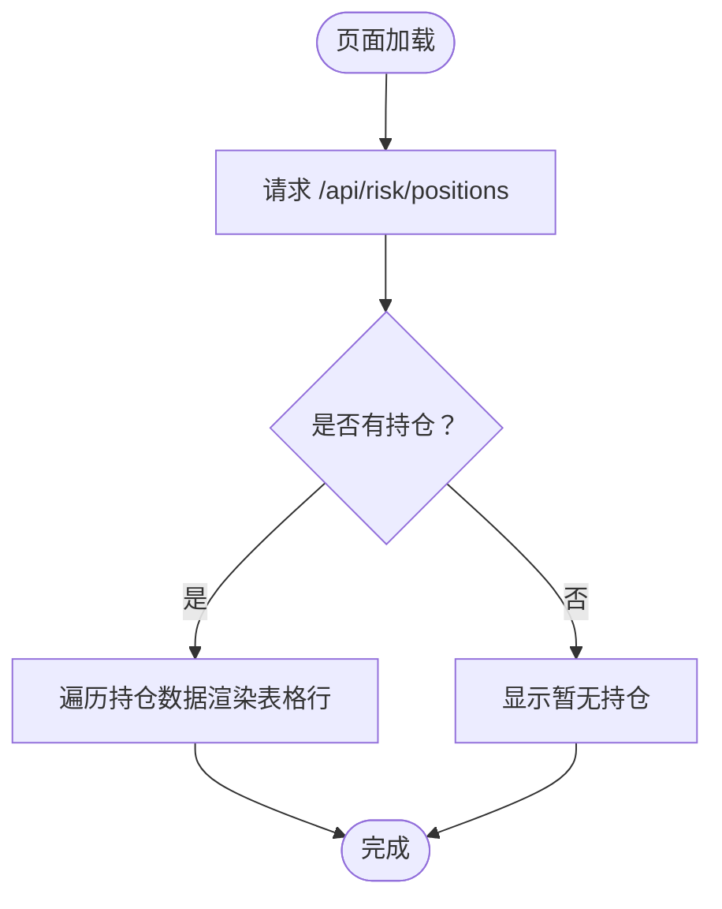
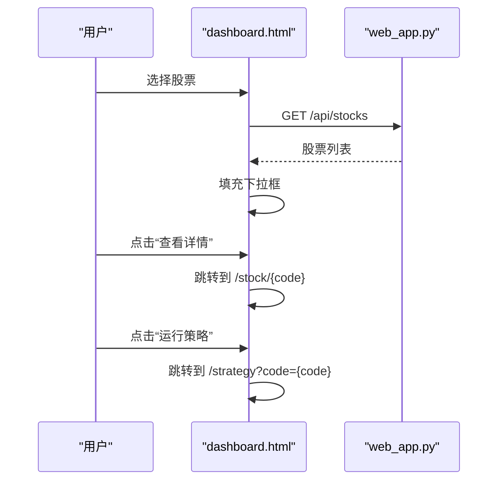
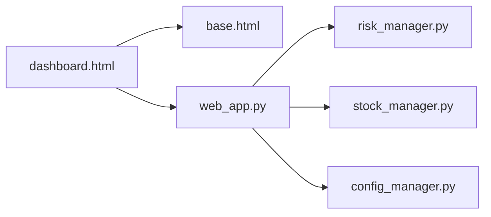

# 仪表盘页面

<cite>
**本文引用的文件**
- [quant_system/templates/dashboard.html](file://quant_system/templates/dashboard.html)
- [quant_system/templates/base.html](file://quant_system/templates/base.html)
- [quant_system/web_app.py](file://quant_system/web_app.py)
- [quant_system/risk_manager.py](file://quant_system/risk_manager.py)
- [quant_system/stock_manager.py](file://quant_system/stock_manager.py)
- [quant_system/config_manager.py](file://quant_system/config_manager.py)
- [quant_system/__init__.py](file://quant_system/__init__.py)
</cite>

## 目录
1. [简介](#简介)
2. [项目结构](#项目结构)
3. [核心组件](#核心组件)
4. [架构总览](#架构总览)
5. [详细组件分析](#详细组件分析)
6. [依赖分析](#依赖分析)
7. [性能考虑](#性能考虑)
8. [故障排查指南](#故障排查指南)
9. [结论](#结论)
10. [附录](#附录)

## 简介
本文件为 vibequation 量化交易系统仪表盘页面的完整用户界面文档。重点围绕 dashboard.html 模板的设计结构与布局安排，解释实时监控区域、市场概览、投资组合状态等关键组件；阐述页面通过 API 接口获取实时数据并动态更新页面内容的展示逻辑；分析页面 JavaScript 交互功能，包括定时刷新机制、图表渲染与用户操作响应；并提供页面布局的响应式设计说明，确保在不同设备上的良好显示效果。

## 项目结构
仪表盘页面位于模板目录中，采用 Flask + Jinja2 渲染，前端依赖 Bootstrap 5 与 jQuery，图表使用 Plotly。页面通过 AJAX 请求后端 API，实现数据的异步加载与更新。

**图表来源**
- [quant_system/templates/base.html:1-61](file://quant_system/templates/base.html#L1-L61)
- [quant_system/templates/dashboard.html:1-196](file://quant_system/templates/dashboard.html#L1-L196)
- [quant_system/web_app.py:1-873](file://quant_system/web_app.py#L1-L873)
- [quant_system/risk_manager.py:1-404](file://quant_system/risk_manager.py#L1-L404)
- [quant_system/stock_manager.py:1-278](file://quant_system/stock_manager.py#L1-L278)
- [quant_system/config_manager.py:1-178](file://quant_system/config_manager.py#L1-L178)

**章节来源**
- [quant_system/templates/base.html:1-61](file://quant_system/templates/base.html#L1-L61)
- [quant_system/templates/dashboard.html:1-196](file://quant_system/templates/dashboard.html#L1-L196)
- [quant_system/web_app.py:1-873](file://quant_system/web_app.py#L1-L873)

## 核心组件
仪表盘页面由以下核心组件构成：
- 资产概览卡片：总资产、可用资金、仓位比例、浮动盈亏
- 持仓列表表格：展示各持仓的代码、名称、数量、成本价、现价、市值、盈亏百分比
- 风险提醒区域：基于风控规则的止损提醒列表
- 快速操作区：股票选择下拉框与“查看详情”“运行策略”按钮

这些组件均通过 jQuery 异步加载数据并动态更新，未内置定时刷新逻辑，需结合外部机制或用户交互触发更新。

**章节来源**
- [quant_system/templates/dashboard.html:12-108](file://quant_system/templates/dashboard.html#L12-L108)

## 架构总览
仪表盘页面与后端 API 的交互流程如下：

**图表来源**
- [quant_system/templates/dashboard.html:111-196](file://quant_system/templates/dashboard.html#L111-L196)
- [quant_system/web_app.py:318-340](file://quant_system/web_app.py#L318-L340)
- [quant_system/risk_manager.py:240-318](file://quant_system/risk_manager.py#L240-L318)
- [quant_system/stock_manager.py:95-129](file://quant_system/stock_manager.py#L95-L129)

## 详细组件分析

### 资产概览卡片区域
- 功能：展示总资产、可用资金、仓位比例、浮动盈亏四个关键指标。
- 数据来源：后端 /api/risk/portfolio 返回的风险组合数据。
- 样式：卡片居中显示数值，浮动盈亏根据正负值动态添加 CSS 类以区分颜色。
- 风险提醒：若存在触发止损的股票，渲染为警告列表；否则提示暂无风险提醒。

**图表来源**
- [quant_system/templates/dashboard.html:111-145](file://quant_system/templates/dashboard.html#L111-L145)
- [quant_system/web_app.py:318-327](file://quant_system/web_app.py#L318-L327)
- [quant_system/risk_manager.py:240-283](file://quant_system/risk_manager.py#L240-L283)

**章节来源**
- [quant_system/templates/dashboard.html:12-45](file://quant_system/templates/dashboard.html#L12-L45)
- [quant_system/web_app.py:318-327](file://quant_system/web_app.py#L318-L327)
- [quant_system/risk_manager.py:240-283](file://quant_system/risk_manager.py#L240-L283)

### 持仓列表表格
- 功能：展示当前持有的各股票的详细信息，包括数量、成本价、现价、市值、浮动盈亏百分比。
- 数据来源：后端 /api/risk/positions 返回的持仓汇总数据。
- 表格行为：若无持仓则显示“暂无持仓”，否则逐行渲染并根据浮动盈亏百分比设置颜色。

**图表来源**
- [quant_system/templates/dashboard.html:147-170](file://quant_system/templates/dashboard.html#L147-L170)
- [quant_system/web_app.py:329-340](file://quant_system/web_app.py#L329-L340)
- [quant_system/risk_manager.py:294-318](file://quant_system/risk_manager.py#L294-L318)

**章节来源**
- [quant_system/templates/dashboard.html:47-85](file://quant_system/templates/dashboard.html#L47-L85)
- [quant_system/web_app.py:329-340](file://quant_system/web_app.py#L329-L340)
- [quant_system/risk_manager.py:294-318](file://quant_system/risk_manager.py#L294-L318)

### 风险提醒区域
- 功能：展示触发止损条件的股票清单及原因。
- 数据来源：/api/risk/portfolio 中的 stop_loss_alerts 字段。
- 展示逻辑：存在提醒时以列表形式呈现，否则显示“暂无风险提醒”。

**章节来源**
- [quant_system/templates/dashboard.html:75-84](file://quant_system/templates/dashboard.html#L75-L84)
- [quant_system/web_app.py:318-327](file://quant_system/web_app.py#L318-L327)
- [quant_system/risk_manager.py:261-272](file://quant_system/risk_manager.py#L261-L272)

### 快速操作区
- 功能：提供股票选择与快捷操作入口。
- 股票选择：通过 /api/stocks 获取股票列表填充下拉框。
- 操作按钮：
  - 查看详情：跳转至对应股票详情页
  - 运行策略：跳转至策略运行页面并携带股票代码

**图表来源**
- [quant_system/templates/dashboard.html:172-196](file://quant_system/templates/dashboard.html#L172-L196)
- [quant_system/web_app.py:47-58](file://quant_system/web_app.py#L47-L58)

**章节来源**
- [quant_system/templates/dashboard.html:87-108](file://quant_system/templates/dashboard.html#L87-L108)
- [quant_system/web_app.py:47-58](file://quant_system/web_app.py#L47-L58)

## 依赖分析
- 模板继承：dashboard.html 继承自 base.html，复用导航栏、Bootstrap 样式与通用脚本。
- 外部依赖：jQuery 用于 DOM 操作与 AJAX 请求；Plotly 用于图表渲染（在其他页面使用）。
- 后端依赖：web_app.py 提供 /api/* 接口；risk_manager.py 提供组合与持仓数据；stock_manager.py 提供股票列表；config_manager.py 提供风控参数配置。

**图表来源**
- [quant_system/templates/dashboard.html:1-10](file://quant_system/templates/dashboard.html#L1-L10)
- [quant_system/templates/base.html:1-20](file://quant_system/templates/base.html#L1-L20)
- [quant_system/web_app.py:1-37](file://quant_system/web_app.py#L1-L37)
- [quant_system/risk_manager.py:1-62](file://quant_system/risk_manager.py#L1-L62)
- [quant_system/stock_manager.py:1-70](file://quant_system/stock_manager.py#L1-L70)
- [quant_system/config_manager.py:1-55](file://quant_system/config_manager.py#L1-L55)

**章节来源**
- [quant_system/templates/base.html:1-61](file://quant_system/templates/base.html#L1-L61)
- [quant_system/web_app.py:1-873](file://quant_system/web_app.py#L1-L873)

## 性能考虑
- 异步加载：页面通过 jQuery 的 $.get 与 $.ajax 异步获取数据，避免阻塞页面渲染。
- 数据量控制：持仓列表与风险提醒仅传输必要字段，减少网络负载。
- 样式与脚本：使用 CDN 引入 jQuery 与 Bootstrap，减少本地资源体积。
- 建议优化：
  - 对频繁访问的接口增加缓存策略（如内存缓存或 Redis）
  - 对大列表进行分页或虚拟滚动（若未来扩展为超大持仓规模）
  - 对错误场景增加重试与降级提示

[本节为通用指导，无需具体文件分析]

## 故障排查指南
- 页面空白或数据未显示
  - 检查 /api/risk/portfolio 与 /api/risk/positions 是否返回有效 JSON
  - 检查浏览器网络面板中的请求状态码与响应体
- 股票选择为空
  - 检查 /api/stocks 是否返回股票列表
  - 确认 stock_manager 配置文件存在且格式正确
- 风控参数异常
  - 检查 config_manager 中的风控配置项是否合理
  - 确认 risk_manager 的资金与持仓状态是否被正确初始化

**章节来源**
- [quant_system/web_app.py:318-340](file://quant_system/web_app.py#L318-L340)
- [quant_system/stock_manager.py:72-98](file://quant_system/stock_manager.py#L72-L98)
- [quant_system/config_manager.py:149-156](file://quant_system/config_manager.py#L149-L156)
- [quant_system/risk_manager.py:50-62](file://quant_system/risk_manager.py#L50-L62)

## 结论
仪表盘页面通过清晰的卡片布局与表格展示，实现了对资产概览、持仓明细与风险提醒的直观呈现。其交互逻辑简洁明确，依赖 jQuery 实现异步数据加载，配合后端 API 提供的风控与股票数据，形成完整的前端展示闭环。建议后续引入定时刷新机制与更丰富的图表组件，进一步提升用户体验与信息密度。

[本节为总结性内容，无需具体文件分析]

## 附录

### 响应式设计说明
- 使用 Bootstrap 5 的网格系统（如 col-md-*）实现桌面与平板的良好适配
- 移动端可通过容器与卡片布局保持内容可读性
- 建议在小屏设备上将表格改为堆叠式或启用横向滚动

**章节来源**
- [quant_system/templates/base.html:5, 7-8:5-8](file://quant_system/templates/base.html#L5-L8)
- [quant_system/templates/dashboard.html:12-108](file://quant_system/templates/dashboard.html#L12-L108)

### 最佳实践建议
- 为关键接口增加错误处理与降级提示
- 对高频数据接口增加缓存与节流策略
- 在生产环境使用 HTTPS 并对敏感配置进行保护
- 对用户输入（如股票选择）进行校验与边界处理

[本节为通用指导，无需具体文件分析]