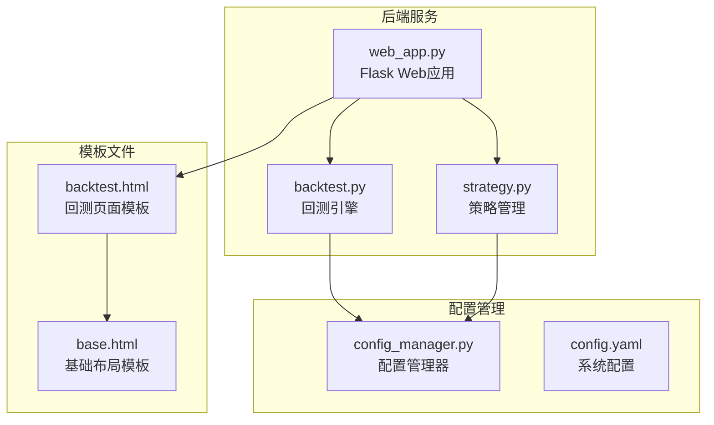
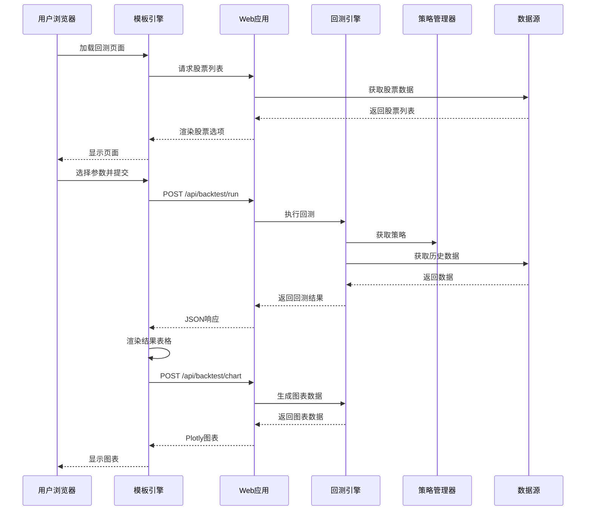
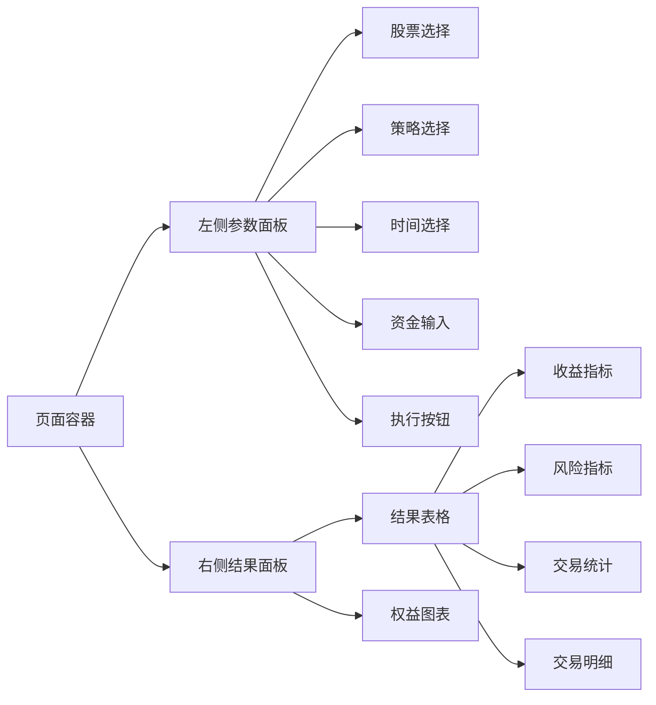
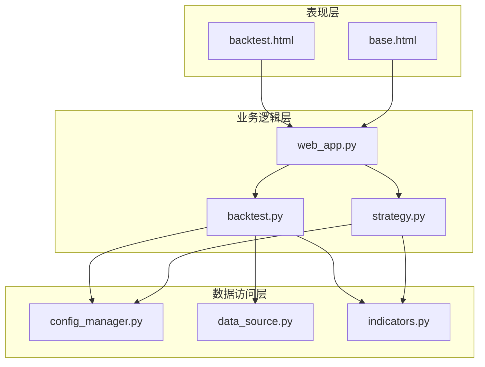

# 回测页面

<cite>
**本文档引用的文件**
- [backtest.html](file://quant_system/templates/backtest.html)
- [base.html](file://quant_system/templates/base.html)
- [web_app.py](file://quant_system/web_app.py)
- [backtest.py](file://quant_system/backtest.py)
- [strategy.py](file://quant_system/strategy.py)
- [config_manager.py](file://quant_system/config_manager.py)
</cite>

## 目录
1. [简介](#简介)
2. [项目结构](#项目结构)
3. [核心组件](#核心组件)
4. [架构概览](#架构概览)
5. [详细组件分析](#详细组件分析)
6. [依赖关系分析](#依赖关系分析)
7. [性能考虑](#性能考虑)
8. [故障排除指南](#故障排除指南)
9. [结论](#结论)

## 简介

回测页面是vibequation量化交易系统的核心功能模块之一，为用户提供了一个完整的策略回测可视化界面。该页面实现了从参数配置到结果展示的一站式回测体验，支持多种技术指标和策略的组合测试，帮助用户验证交易策略的有效性和盈利能力。

## 项目结构

回测页面采用Flask模板引擎构建，主要文件组织如下：



**图表来源**
- [backtest.html:1-200](file://quant_system/templates/backtest.html#L1-L200)
- [base.html:1-61](file://quant_system/templates/base.html#L1-L61)
- [web_app.py:1-873](file://quant_system/web_app.py#L1-L873)

**章节来源**
- [backtest.html:1-200](file://quant_system/templates/backtest.html#L1-L200)
- [base.html:1-61](file://quant_system/templates/base.html#L1-L61)

## 核心组件

回测页面由三个主要组件构成：

### 1. 参数配置面板
- 股票选择下拉框
- 策略选择下拉框  
- 时间范围选择器
- 初始资金输入框
- 回测执行按钮

### 2. 结果展示区域
- 收益指标面板
- 风险指标面板
- 交易统计面板
- 交易明细表格
- 权益曲线图表

### 3. 交互控制逻辑
- 异步数据加载
- 实时进度显示
- 错误处理机制
- 图表动态渲染

**章节来源**
- [backtest.html:12-62](file://quant_system/templates/backtest.html#L12-L62)

## 架构概览

回测页面采用前后端分离的架构设计，通过RESTful API进行数据交互：



**图表来源**
- [web_app.py:214-266](file://quant_system/web_app.py#L214-L266)
- [web_app.py:268-316](file://quant_system/web_app.py#L268-L316)
- [backtest.py:75-282](file://quant_system/backtest.py#L75-L282)

## 详细组件分析

### 页面布局与设计

回测页面采用Bootstrap网格系统构建响应式布局：



**图表来源**
- [backtest.html:6-62](file://quant_system/templates/backtest.html#L6-L62)

### 参数配置组件

#### 股票选择组件
- 支持实时加载可用股票
- 自动过滤股票类型
- 下拉菜单形式展示

#### 策略选择组件  
- 预定义策略自动加载
- 支持用户自定义策略
- 策略描述信息展示

#### 时间范围组件
- 默认设置一年时间跨度
- 日期格式自动转换
- 日期验证机制

#### 资金配置组件
- 初始资金默认值设置
- 数字输入验证
- 资金格式化显示

**章节来源**
- [backtest.html:19-44](file://quant_system/templates/backtest.html#L19-L44)

### 结果展示组件

#### 收益指标面板
展示关键财务指标：
- 初始资金和最终资金对比
- 总收益率百分比
- 年化收益率
- 夏普比率

#### 风险指标面板
展示风险控制指标：
- 最大回撤百分比
- 风险评估参考

#### 交易统计面板
展示交易表现统计：
- 总交易次数
- 胜率百分比
- 盈亏比

#### 交易明细表格
详细记录每笔交易：
- 交易日期
- 买卖操作类型
- 交易数量
- 成交价格
- 交易金额

#### 权益曲线图表
可视化展示投资表现：
- 回测策略权益曲线
- 基准线对比
- 时间序列展示

**章节来源**
- [backtest.html:125-181](file://quant_system/templates/backtest.html#L125-L181)
- [backtest.html:183-197](file://quant_system/templates/backtest.html#L183-L197)

### 交互逻辑组件

#### 异步数据加载
- 股票列表异步加载
- 策略列表异步加载
- 避免页面刷新等待

#### 实时进度显示
- 回测执行状态提示
- 错误信息即时反馈
- 用户体验优化

#### 图表动态渲染
- 权益曲线实时生成
- Plotly图表库集成
- 响应式图表尺寸

**章节来源**
- [backtest.html:67-123](file://quant_system/templates/backtest.html#L67-L123)

### 后端API接口

#### 股票数据接口
```python
@app.route('/api/stocks')
def api_stocks():
    """获取股票列表"""
    # 实现逻辑...
```

#### 回测执行接口
```python
@app.route('/api/backtest/run', methods=['POST'])
def api_run_backtest():
    """运行回测"""
    # 实现逻辑...
```

#### 图表生成接口
```python
@app.route('/api/backtest/chart', methods=['POST'])
def api_backtest_chart():
    """获取回测图表"""
    # 实现逻辑...
```

**章节来源**
- [web_app.py:47-58](file://quant_system/web_app.py#L47-L58)
- [web_app.py:214-266](file://quant_system/web_app.py#L214-L266)
- [web_app.py:268-316](file://quant_system/web_app.py#L268-L316)

## 依赖关系分析

回测页面的依赖关系体现了清晰的分层架构：



**图表来源**
- [web_app.py:17-26](file://quant_system/web_app.py#L17-L26)
- [backtest.py:17-21](file://quant_system/backtest.py#L17-L21)
- [strategy.py:19-22](file://quant_system/strategy.py#L19-L22)

### 关键依赖关系

1. **模板继承关系**：backtest.html继承base.html，共享导航栏和样式
2. **API依赖关系**：前端通过AJAX调用后端API接口
3. **策略依赖关系**：回测引擎依赖策略管理器
4. **数据依赖关系**：回测引擎依赖数据源和指标计算

**章节来源**
- [base.html:22-45](file://quant_system/templates/base.html#L22-L45)
- [web_app.py:17-26](file://quant_system/web_app.py#L17-L26)

## 性能考虑

### 前端性能优化

#### 异步加载策略
- 使用jQuery AJAX异步加载股票和策略列表
- 避免页面初始化时的阻塞等待
- 提升用户体验

#### 图表渲染优化
- Plotly图表按需渲染
- 隐藏图表元素减少DOM操作
- 优化数据传输格式

### 后端性能优化

#### 数据缓存机制
- 技术指标数据缓存
- 避免重复计算
- 提高查询效率

#### 内存管理
- 分批处理历史数据
- 及时释放中间结果
- 控制内存占用

### 网络通信优化

#### 请求合并
- 减少HTTP请求次数
- 批量数据传输
- 降低网络开销

#### 错误重试机制
- 网络异常自动重试
- 超时时间合理设置
- 用户友好的错误提示

## 故障排除指南

### 常见问题及解决方案

#### 股票列表为空
**问题描述**：股票选择下拉框显示为空
**可能原因**：
- 数据源连接失败
- 股票数据未正确加载
- 网络连接异常

**解决步骤**：
1. 检查数据源配置
2. 验证网络连接
3. 查看后端日志
4. 重新加载页面

#### 回测执行失败
**问题描述**：点击"开始回测"按钮无响应或显示错误
**可能原因**：
- 参数验证失败
- 策略不存在
- 历史数据缺失

**解决步骤**：
1. 检查必填参数是否完整
2. 验证策略名称正确性
3. 确认时间范围合理性
4. 查看错误日志详情

#### 图表不显示
**问题描述**：权益曲线图表空白
**可能原因**：
- Plotly库加载失败
- 图表数据格式错误
- 浏览器兼容性问题

**解决步骤**：
1. 检查网络连接
2. 验证Plotly版本
3. 查看浏览器控制台
4. 清除浏览器缓存

### 调试技巧

#### 前端调试
- 使用浏览器开发者工具
- 检查网络请求状态
- 查看JavaScript控制台错误

#### 后端调试
- 查看Flask应用日志
- 检查数据库连接
- 验证API响应格式

**章节来源**
- [backtest.html:117-121](file://quant_system/templates/backtest.html#L117-L121)

## 结论

vibequation量化交易系统的回测页面是一个功能完整、设计合理的可视化界面。它通过清晰的组件划分、优雅的交互设计和可靠的后端支持，为用户提供了专业的策略回测体验。

### 主要优势

1. **用户友好**：直观的界面设计和清晰的功能分区
2. **功能完整**：涵盖参数配置、结果展示、图表分析等全流程
3. **性能优秀**：异步加载和优化的数据处理机制
4. **扩展性强**：模块化设计便于功能扩展和维护

### 改进建议

1. **增加回测历史**：提供回测结果的存储和查看功能
2. **增强图表交互**：添加图表缩放和细节查看功能
3. **优化移动端体验**：提升移动设备上的使用体验
4. **增加导出功能**：支持回测结果的导出和分享

该回测页面为量化交易研究提供了坚实的技术基础，通过持续的优化和完善，将成为一个更加专业和实用的策略开发工具。