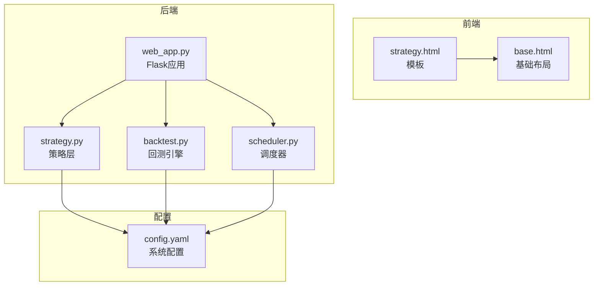
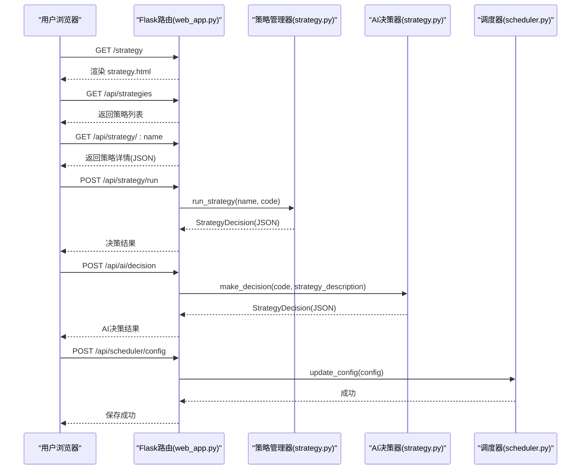
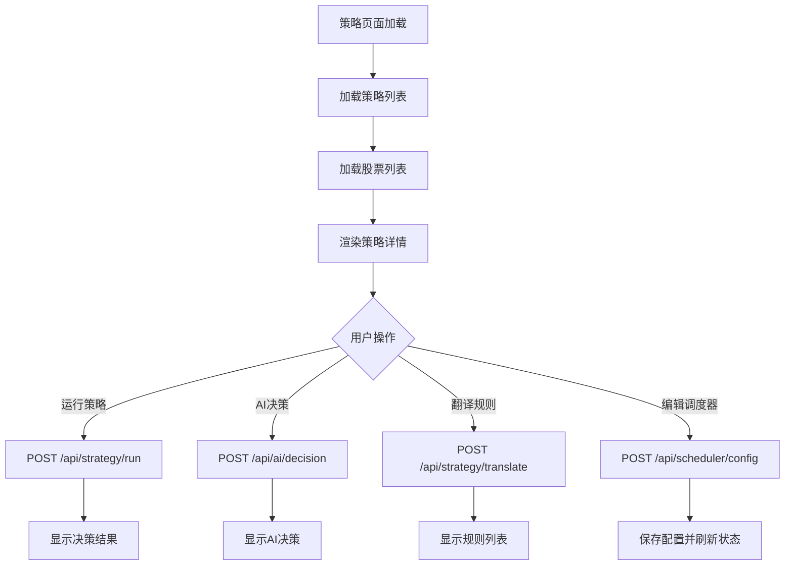
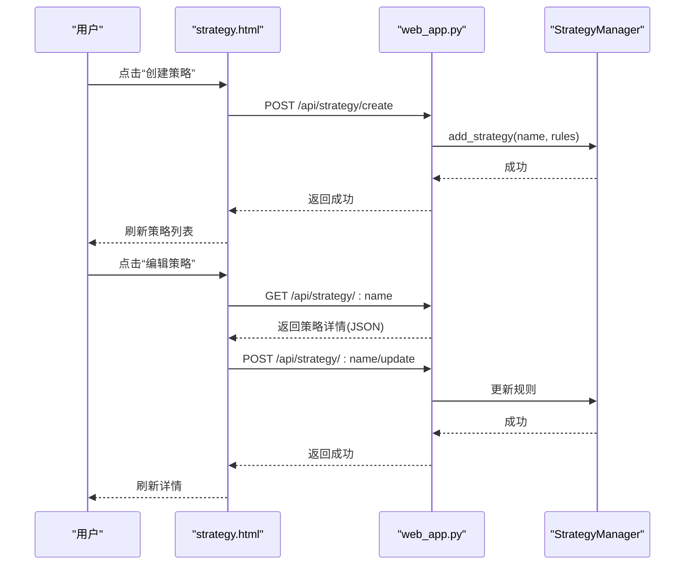
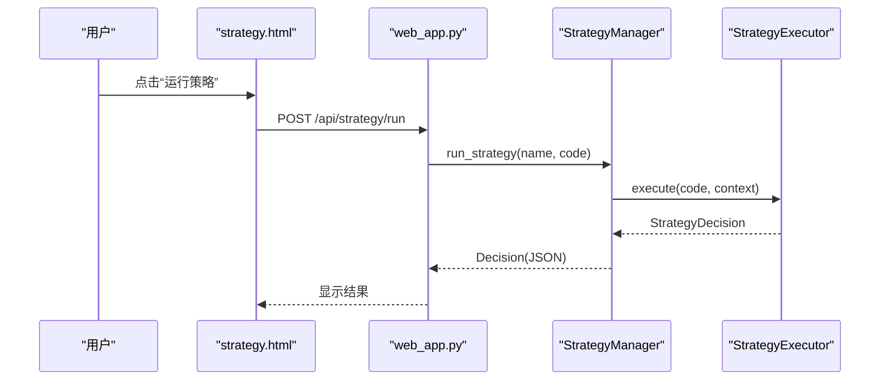
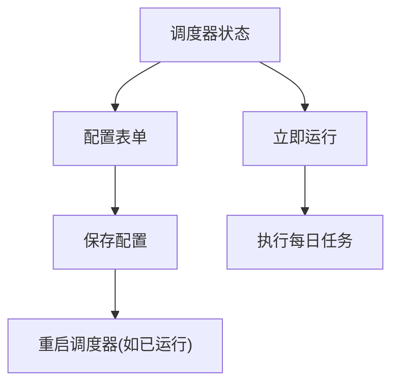
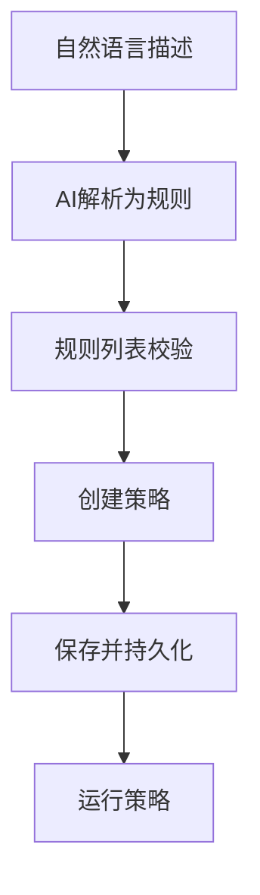
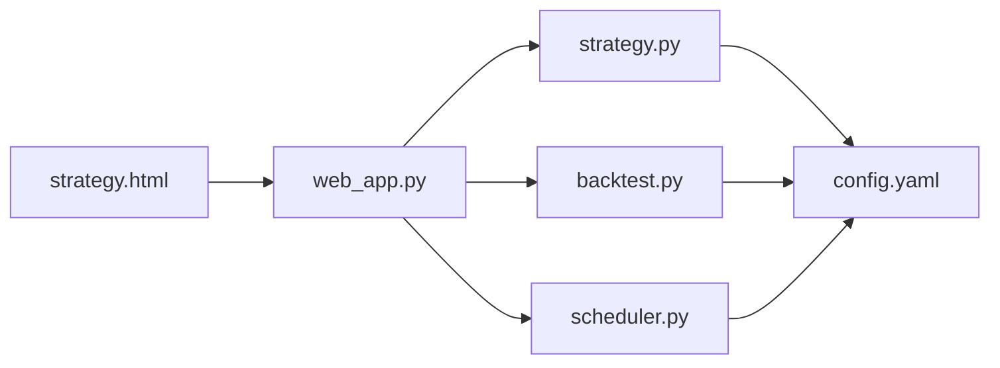

# 策略页面

<cite>
**本文引用的文件**
- [strategy.html](file://quant_system/templates/strategy.html)
- [strategy.py](file://quant_system/strategy.py)
- [web_app.py](file://quant_system/web_app.py)
- [backtest.py](file://quant_system/backtest.py)
- [scheduler.py](file://quant_system/scheduler.py)
- [base.html](file://quant_system/templates/base.html)
- [config.yaml](file://config.yaml)
</cite>

## 目录
1. [简介](#简介)
2. [项目结构](#项目结构)
3. [核心组件](#核心组件)
4. [架构总览](#架构总览)
5. [详细组件分析](#详细组件分析)
6. [依赖关系分析](#依赖关系分析)
7. [性能考量](#性能考量)
8. [故障排查指南](#故障排查指南)
9. [结论](#结论)
10. [附录](#附录)

## 简介
本文件面向vibequation量化交易系统的“策略页面”，系统性梳理strategy.html模板的设计与实现，覆盖策略配置、参数调优、执行监控、AI决策、定时任务调度等关键功能。文档同时解释系统如何支持内置策略与自定义策略，如何进行策略执行与可视化呈现，并提供策略开发与页面使用的实践指南。

## 项目结构
策略页面位于后端Flask模板目录下，前端通过Bootstrap与jQuery构建，后端通过Flask路由提供REST API，策略逻辑由策略层模块实现，调度器负责定时任务。

**图表来源**
- [strategy.html:1-721](file://quant_system/templates/strategy.html#L1-L721)
- [base.html:1-61](file://quant_system/templates/base.html#L1-L61)
- [web_app.py:1-957](file://quant_system/web_app.py#L1-L957)
- [strategy.py:1-556](file://quant_system/strategy.py#L1-L556)
- [backtest.py:1-456](file://quant_system/backtest.py#L1-L456)
- [scheduler.py:1-307](file://quant_system/scheduler.py#L1-L307)
- [config.yaml:1-88](file://config.yaml#L1-L88)

**章节来源**
- [strategy.html:1-104](file://quant_system/templates/strategy.html#L1-L104)
- [base.html:1-61](file://quant_system/templates/base.html#L1-L61)

## 核心组件
- 策略模板与交互：strategy.html提供策略列表、详情、创建/编辑、运行、AI决策、翻译、调度器配置等UI区域与脚本逻辑。
- 策略层：strategy.py定义策略规则、决策、解析器、内置策略集合与AI决策器。
- Web接口：web_app.py提供策略、回测、AI、调度器等API。
- 回测引擎：backtest.py提供历史回测与统计分析。
- 调度器：scheduler.py提供定时任务与配置管理。
- 基础布局：base.html提供导航与通用样式。

**章节来源**
- [strategy.html:12-136](file://quant_system/templates/strategy.html#L12-L136)
- [strategy.py:150-460](file://quant_system/strategy.py#L150-L460)
- [web_app.py:227-772](file://quant_system/web_app.py#L227-L772)
- [backtest.py:66-374](file://quant_system/backtest.py#L66-L374)
- [scheduler.py:34-284](file://quant_system/scheduler.py#L34-L284)

## 架构总览
策略页面的前后端交互与策略执行链路如下：

**图表来源**
- [strategy.html:256-393](file://quant_system/templates/strategy.html#L256-L393)
- [web_app.py:227-624](file://quant_system/web_app.py#L227-L624)
- [strategy.py:318-551](file://quant_system/strategy.py#L318-L551)
- [scheduler.py:245-254](file://quant_system/scheduler.py#L245-L254)

## 详细组件分析

### 页面布局与模块划分
- 策略列表：左侧卡片展示策略名称列表，点击查看详情。
- 策略详情：右侧卡片展示策略描述与规则列表。
- 运行策略：选择策略与股票，点击运行，返回决策结果。
- 策略翻译：输入自然语言描述，转换为量化规则。
- AI决策：选择股票，获取AI综合决策。
- 定时任务调度器：查看状态、编辑配置、立即运行。

**图表来源**
- [strategy.html:256-718](file://quant_system/templates/strategy.html#L256-L718)

**章节来源**
- [strategy.html:12-136](file://quant_system/templates/strategy.html#L12-L136)

### 策略配置与管理
- 创建策略：弹窗输入名称、描述与规则，提交后保存至策略管理器并持久化。
- 编辑策略：加载策略详情，支持增删改规则，保存后更新策略。
- 删除策略：确认后从管理器移除并持久化。

**图表来源**
- [strategy.html:475-648](file://quant_system/templates/strategy.html#L475-L648)
- [web_app.py:628-732](file://quant_system/web_app.py#L628-L732)
- [strategy.py:318-460](file://quant_system/strategy.py#L318-L460)

**章节来源**
- [strategy.html:138-194](file://quant_system/templates/strategy.html#L138-L194)
- [web_app.py:628-732](file://quant_system/web_app.py#L628-L732)
- [strategy.py:318-460](file://quant_system/strategy.py#L318-L460)

### 策略执行与可视化
- 运行策略：选择策略与股票，后端调用策略管理器执行，返回动作、仓位、置信度与理由。
- AI决策：整合技术指标与特征，返回AI综合建议与风险评估。
- 回测：提供回测API与图表接口，支持权益曲线对比。

**图表来源**
- [strategy.html:323-357](file://quant_system/templates/strategy.html#L323-L357)
- [web_app.py:245-269](file://quant_system/web_app.py#L245-L269)
- [strategy.py:229-299](file://quant_system/strategy.py#L229-L299)

**章节来源**
- [strategy.html:47-102](file://quant_system/templates/strategy.html#L47-L102)
- [web_app.py:245-269](file://quant_system/web_app.py#L245-L269)
- [strategy.py:229-299](file://quant_system/strategy.py#L229-L299)

### 定时任务调度器
- 状态查看：显示运行状态、配置摘要。
- 配置编辑：启用开关、定时时间、选中股票、任务项勾选。
- 立即运行：触发一次任务执行。

**图表来源**
- [strategy.html:106-136](file://quant_system/templates/strategy.html#L106-L136)
- [web_app.py:776-800](file://quant_system/web_app.py#L776-L800)
- [scheduler.py:206-281](file://quant_system/scheduler.py#L206-L281)

**章节来源**
- [strategy.html:106-136](file://quant_system/templates/strategy.html#L106-L136)
- [web_app.py:776-800](file://quant_system/web_app.py#L776-L800)
- [scheduler.py:34-284](file://quant_system/scheduler.py#L34-L284)

### 策略开发指南
- 规则结构：条件、动作、仓位比例、理由。
- 内置策略：RSI、MACD、均线、综合策略，可直接运行与参考。
- 自然语言翻译：通过AI将自然语言描述转换为规则，或反向翻译为自然语言。
- 策略验证：在页面中先“翻译规则”预览，再“创建策略”保存。

**图表来源**
- [strategy.html:439-473](file://quant_system/templates/strategy.html#L439-L473)
- [strategy.py:56-148](file://quant_system/strategy.py#L56-L148)

**章节来源**
- [strategy.py:56-148](file://quant_system/strategy.py#L56-L148)
- [strategy.html:138-194](file://quant_system/templates/strategy.html#L138-L194)

### 页面使用示例
- 查看内置策略：在策略列表中选择“RSI策略”、“MACD策略”等，查看规则与描述。
- 创建自定义策略：点击“使用自然语言创建”，输入策略描述，点击“转换为量化规则”，核对后创建。
- 运行策略：选择策略与股票，点击“运行策略”，查看建议动作、仓位与置信度。
- AI决策：选择股票，点击“获取AI决策”，查看AI建议与理由。
- 调度器：编辑配置后保存，可点击“立即运行”测试。

**章节来源**
- [strategy.html:12-136](file://quant_system/templates/strategy.html#L12-L136)
- [web_app.py:227-624](file://quant_system/web_app.py#L227-L624)

## 依赖关系分析
策略页面涉及的模块间依赖如下：

**图表来源**
- [strategy.html:1-721](file://quant_system/templates/strategy.html#L1-L721)
- [web_app.py:1-957](file://quant_system/web_app.py#L1-L957)
- [strategy.py:1-556](file://quant_system/strategy.py#L1-L556)
- [backtest.py:1-456](file://quant_system/backtest.py#L1-L456)
- [scheduler.py:1-307](file://quant_system/scheduler.py#L1-L307)
- [config.yaml:1-88](file://config.yaml#L1-L88)

**章节来源**
- [strategy.html:1-721](file://quant_system/templates/strategy.html#L1-L721)
- [web_app.py:1-957](file://quant_system/web_app.py#L1-L957)

## 性能考量
- 前端渲染：策略列表与详情采用AJAX异步加载，减少页面刷新。
- 策略执行：策略条件评估在后端进行，避免前端复杂计算。
- 回测性能：回测引擎在历史数据上迭代执行，注意大数据量时的内存与IO开销。
- 调度器并发：使用后台调度器，避免阻塞主线程；配置变更会自动重启调度器。

[本节为通用指导，无需特定文件来源]

## 故障排查指南
- 策略运行失败：检查策略是否存在、股票代码是否有效、技术指标是否可用。
- AI决策失败：检查AI模型配置与Token，确认网络连通性。
- 调度器异常：检查配置文件路径与权限，确认交易日判断逻辑。
- 页面加载问题：确认Flask模板路径与静态资源加载正常。

**章节来源**
- [web_app.py:245-269](file://quant_system/web_app.py#L245-L269)
- [strategy.py:462-551](file://quant_system/strategy.py#L462-L551)
- [scheduler.py:44-77](file://quant_system/scheduler.py#L44-L77)

## 结论
策略页面通过清晰的模块划分与完善的API接口，实现了从策略创建、编辑、运行到AI决策与调度器管理的全链路功能。内置策略与自然语言翻译能力降低了策略开发门槛，而回测与可视化图表为策略验证提供了坚实支撑。建议在生产环境中结合风控配置与日志监控，持续优化策略表现。

[本节为总结性内容，无需特定文件来源]

## 附录
- 配置要点：AI模型、回测参数、数据存储路径、Web服务端口等。
- 扩展建议：增加策略版本管理、批量执行、参数扫描与优化、策略对比面板等。

**章节来源**
- [config.yaml:1-88](file://config.yaml#L1-L88)
- [strategy.html:1-721](file://quant_system/templates/strategy.html#L1-L721)