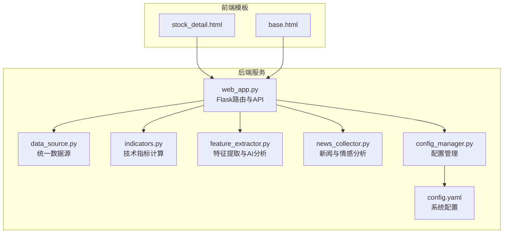
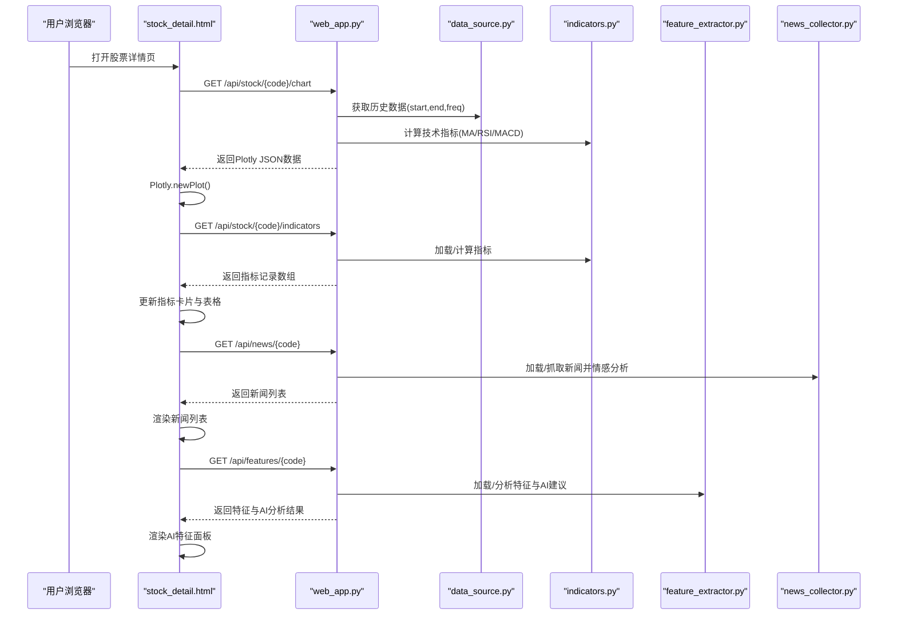
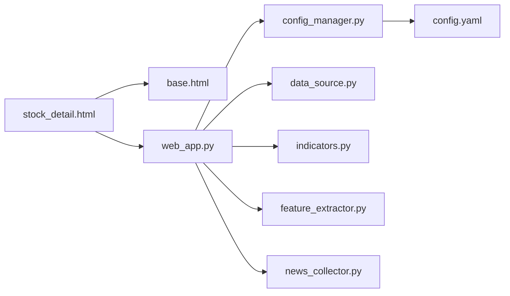

# 股票详情页面

<cite>
**本文档引用的文件**
- [stock_detail.html](file://quant_system/templates/stock_detail.html)
- [base.html](file://quant_system/templates/base.html)
- [web_app.py](file://quant_system/web_app.py)
- [indicators.py](file://quant_system/indicators.py)
- [feature_extractor.py](file://quant_system/feature_extractor.py)
- [news_collector.py](file://quant_system/news_collector.py)
- [data_source.py](file://quant_system/data_source.py)
- [config_manager.py](file://quant_system/config_manager.py)
- [config.yaml](file://config.yaml)
</cite>

## 目录
1. [简介](#简介)
2. [项目结构](#项目结构)
3. [核心组件](#核心组件)
4. [架构总览](#架构总览)
5. [详细组件分析](#详细组件分析)
6. [依赖分析](#依赖分析)
7. [性能考虑](#性能考虑)
8. [故障排除指南](#故障排除指南)
9. [结论](#结论)
10. [附录](#附录)

## 简介
本文件面向vibequation量化交易系统的“股票详情页面”，系统性梳理stock_detail.html模板的功能设计与实现，涵盖：
- 股票基本信息展示（当前价格、RSI、MACD、综合评分）
- 技术分析图表（K线图、均线）
- 历史数据查询接口
- Plotly图表库集成与数据绑定机制
- 页面交互设计（时间范围选择、指标切换、数据导出等）
- 后端API与前端模板的协作流程

## 项目结构
该页面位于模板层，通过Flask路由渲染，并由多个后端模块提供数据支持。整体结构如下：

图表来源
- [stock_detail.html:1-193](file://quant_system/templates/stock_detail.html#L1-L193)
- [base.html:1-61](file://quant_system/templates/base.html#L1-L61)
- [web_app.py:1-873](file://quant_system/web_app.py#L1-L873)
- [data_source.py:1-423](file://quant_system/data_source.py#L1-L423)
- [indicators.py:1-500](file://quant_system/indicators.py#L1-L500)
- [feature_extractor.py:1-405](file://quant_system/feature_extractor.py#L1-L405)
- [news_collector.py:1-465](file://quant_system/news_collector.py#L1-L465)
- [config_manager.py:1-178](file://quant_system/config_manager.py#L1-L178)
- [config.yaml:1-88](file://config.yaml#L1-L88)

章节来源
- [stock_detail.html:1-193](file://quant_system/templates/stock_detail.html#L1-L193)
- [base.html:1-61](file://quant_system/templates/base.html#L1-L61)
- [web_app.py:1-873](file://quant_system/web_app.py#L1-L873)

## 核心组件
- 模板层：stock_detail.html负责UI布局与交互脚本；base.html提供通用头部、导航与样式。
- 后端服务：web_app.py提供REST API，包括K线图数据、技术指标、新闻、AI特征等。
- 数据与算法：data_source.py统一历史/实时数据；indicators.py计算RSI/MACD/均线等；feature_extractor.py结合技术指标与情感分析生成AI建议；news_collector.py抓取新闻并做情感分析。
- 配置管理：config_manager.py读取config.yaml，提供各模块配置参数。

章节来源
- [stock_detail.html:1-193](file://quant_system/templates/stock_detail.html#L1-L193)
- [web_app.py:111-166](file://quant_system/web_app.py#L111-L166)
- [data_source.py:300-335](file://quant_system/data_source.py#L300-L335)
- [indicators.py:188-273](file://quant_system/indicators.py#L188-L273)
- [feature_extractor.py:213-283](file://quant_system/feature_extractor.py#L213-L283)
- [news_collector.py:372-399](file://quant_system/news_collector.py#L372-L399)
- [config_manager.py:1-178](file://quant_system/config_manager.py#L1-L178)
- [config.yaml:1-88](file://config.yaml#L1-L88)

## 架构总览
股票详情页面采用前后端分离的模板渲染模式：
- 前端：stock_detail.html通过jQuery发起AJAX请求，分别拉取K线图、技术指标、新闻、AI特征数据。
- 后端：web_app.py的路由函数根据请求参数（如时间范围、频率）调用数据与算法模块，返回JSON数据给前端。
- 图表：后端使用Plotly生成K线图，前端直接渲染到DOM元素。

图表来源
- [stock_detail.html:97-191](file://quant_system/templates/stock_detail.html#L97-L191)
- [web_app.py:111-166](file://quant_system/web_app.py#L111-L166)
- [data_source.py:307-335](file://quant_system/data_source.py#L307-L335)
- [indicators.py:188-273](file://quant_system/indicators.py#L188-L273)
- [feature_extractor.py:500-500](file://quant_system/feature_extractor.py#L500-L500)
- [news_collector.py:470-483](file://quant_system/news_collector.py#L470-L483)

## 详细组件分析

### 模板结构与布局
- 页面标题：动态显示股票名称与代码。
- 基础信息卡片：展示当前价格、RSI(6)、MACD、综合评分。
- K线图区域：容器id为"kline-chart"，高度500px。
- 技术指标详情：表格展示多周期RSI、MACD、KDJ、布林带位置等。
- 最新新闻：列表展示标题、日期与情感标签。
- AI特征分析：展示AI推荐策略、置信度、风险等级与分析理由，以及技术特征（趋势强度/方向）。

章节来源
- [stock_detail.html:1-95](file://quant_system/templates/stock_detail.html#L1-L95)

### 前端交互与数据绑定
- 初始化：页面加载后，通过jQuery发起四个AJAX请求：
  - K线图：GET /api/stock/{code}/chart
  - 技术指标：GET /api/stock/{code}/indicators
  - 新闻：GET /api/news/{code}
  - AI特征：GET /api/features/{code}
- 数据绑定：
  - K线图：后端返回Plotly JSON，前端直接调用Plotly.newPlot渲染。
  - 指标卡片：将最新记录的close、rsi_6、macd、overall_score写入对应DOM节点。
  - 指标详情表格：遍历最新记录，生成表格HTML并插入到indicators-detail容器。
  - 新闻列表：按日期倒序取最近10条，根据情感标签设置颜色。
  - AI特征面板：条件渲染AI分析结果与技术特征两列。

章节来源
- [stock_detail.html:97-191](file://quant_system/templates/stock_detail.html#L97-L191)

### 后端API与数据流
- K线图API（/api/stock/{code}/chart）
  - 参数：start、end（默认近180天）、freq（默认day）
  - 流程：获取历史数据→计算技术指标→构建Candlestick与均线→返回Plotly JSON
- 技术指标API（/api/stock/{code}/indicators）
  - 参数：freq（day/week/month）
  - 流程：优先加载缓存→若为空则计算→返回指标记录数组
- 新闻API（/api/news/{code}）
  - 流程：加载本地新闻→最多返回50条→返回JSON
- AI特征API（/api/features/{code}）
  - 流程：优先加载缓存→若为空则调用AI分析→保存并返回

章节来源
- [web_app.py:111-166](file://quant_system/web_app.py#L111-L166)
- [web_app.py:84-108](file://quant_system/web_app.py#L84-L108)
- [web_app.py:470-483](file://quant_system/web_app.py#L470-L483)
- [web_app.py:500-512](file://quant_system/web_app.py#L500-L512)

### 技术指标与数据绑定
- 指标计算：indicators.py提供RSI、MACD、均线、布林带、KDJ、波动率等计算方法，并支持多周期与多时间框架。
- 数据绑定：后端将指标列名标准化为指标名称（如rsi_6、macd、ma_5等），前端直接读取最新记录进行展示。
- 缓存策略：技术指标与特征分析均支持本地CSV/JSON缓存，提升重复访问性能。

章节来源
- [indicators.py:188-273](file://quant_system/indicators.py#L188-L273)
- [data_source.py:357-378](file://quant_system/data_source.py#L357-L378)

### Plotly图表集成
- 后端使用Plotly.graph_objects创建Figure，包含Candlestick与均线轨迹，设置标题、坐标轴标签与高度。
- 前端通过PlotlyJSONEncoder将Figure序列化为JSON，再由前端Plotly.newPlot渲染。
- 图表容器：id="kline-chart"，高度500px。

章节来源
- [web_app.py:128-162](file://quant_system/web_app.py#L128-L162)
- [base.html:8-8](file://quant_system/templates/base.html#L8-L8)

### 新闻与情感分析
- 新闻采集：news_collector.py从新浪财经抓取指定日期范围内的新闻，支持增量去重保存。
- 情感分析：支持ModelScope API或本地关键词规则，输出情感分数、标签与概率。
- 日常汇总：按日期聚合情感，便于前端展示趋势与热点。

章节来源
- [news_collector.py:43-154](file://quant_system/news_collector.py#L43-L154)
- [news_collector.py:212-325](file://quant_system/news_collector.py#L212-L325)
- [news_collector.py:372-399](file://quant_system/news_collector.py#L372-L399)

### AI特征与策略建议
- 特征提取：结合技术指标与情感分析，生成趋势强度、方向、RSI水平、布林带位置等特征。
- AI分析：构造提示词，调用ModelScope API或本地模拟，返回策略类型、置信度、风险等级与理由。
- 分类器：StrategyTypeClassifier根据特征打分，给出主策略类型与置信度。

章节来源
- [feature_extractor.py:115-211](file://quant_system/feature_extractor.py#L115-L211)
- [feature_extractor.py:213-283](file://quant_system/feature_extractor.py#L213-L283)
- [feature_extractor.py:323-399](file://quant_system/feature_extractor.py#L323-L399)

### 时间范围与频率控制
- 历史数据：支持start/end/freq参数，默认近一年、日频。
- 技术指标：支持day/week/month三种时间框架，不同周期RSI与均线配置可由配置文件调整。
- 新闻：默认追踪近30天，可配置情感分析模型。

章节来源
- [web_app.py:61-78](file://quant_system/web_app.py#L61-L78)
- [web_app.py:84-108](file://quant_system/web_app.py#L84-L108)
- [config.yaml:25-39](file://config.yaml#L25-L39)
- [config.yaml:41-55](file://config.yaml#L41-L55)

### 数据导出与扩展
- 当前页面未内置导出按钮，但后端API返回的JSON数据可直接复制或二次开发导出功能（如CSV/Excel）。
- 建议在前端增加“导出”按钮，调用相应API并将数据下载为文件。

[本节为概念性说明，无需代码来源]

## 依赖分析
- 模板依赖：stock_detail.html继承base.html，引入Bootstrap与Plotly、jQuery。
- 后端依赖：web_app.py依赖config_manager、stock_manager、data_source、indicators、feature_extractor、news_collector等模块。
- 数据依赖：indicators.py依赖data_source与config_manager；feature_extractor.py依赖indicators与news_collector；news_collector依赖requests与BeautifulSoup。

图表来源
- [stock_detail.html:1-193](file://quant_system/templates/stock_detail.html#L1-L193)
- [base.html:1-61](file://quant_system/templates/base.html#L1-L61)
- [web_app.py:1-873](file://quant_system/web_app.py#L1-L873)
- [config_manager.py:1-178](file://quant_system/config_manager.py#L1-L178)
- [config.yaml:1-88](file://config.yaml#L1-L88)

章节来源
- [web_app.py:1-27](file://quant_system/web_app.py#L1-L27)
- [config_manager.py:1-178](file://quant_system/config_manager.py#L1-L178)

## 性能考虑
- 缓存策略：技术指标与特征分析均落地本地文件，避免重复计算。
- 限速与增量：Tushare数据源实现简单限速与增量更新，减少API压力。
- 前端懒加载：页面一次性请求四项数据，建议在首屏仅加载必要数据，其余异步加载。
- 图表优化：K线图数据量较大时，建议后端分页或降采样，前端按需渲染。

[本节为通用指导，无需代码来源]

## 故障排除指南
- 图表加载失败：检查后端/api/stock/{code}/chart返回的error字段，确认参数与数据可用性。
- 指标数据为空：确认后端/api/stock/{code}/indicators是否成功计算并缓存。
- 新闻为空：检查后端/api/news/{code}是否成功抓取与保存，或网络代理问题。
- AI分析异常：查看后端/api/features/{code}返回的error字段，确认ModelScope Token与网络连通性。
- 配置问题：核对config.yaml中的tokens、data_storage、technical_indicators等配置项。

章节来源
- [stock_detail.html:103-108](file://quant_system/templates/stock_detail.html#L103-L108)
- [stock_detail.html:112-115](file://quant_system/templates/stock_detail.html#L112-L115)
- [stock_detail.html:138-141](file://quant_system/templates/stock_detail.html#L138-L141)
- [stock_detail.html:161-164](file://quant_system/templates/stock_detail.html#L161-L164)
- [web_app.py:111-166](file://quant_system/web_app.py#L111-L166)
- [web_app.py:470-483](file://quant_system/web_app.py#L470-L483)
- [web_app.py:500-512](file://quant_system/web_app.py#L500-L512)

## 结论
stock_detail.html通过清晰的模板结构与后端API协作，实现了股票基本信息、技术分析图表与AI特征的统一展示。其数据绑定机制简洁高效，Plotly图表渲染直观易用。建议后续增强交互体验（时间范围选择、指标切换、数据导出）与性能优化（缓存与分页），以进一步提升用户体验与系统稳定性。

[本节为总结性内容，无需代码来源]

## 附录

### API定义与使用示例
- 获取K线图数据
  - 方法：GET
  - 路径：/api/stock/{code}/chart
  - 查询参数：start、end、freq
  - 返回：Plotly JSON（包含data与layout）
  - 示例：GET /api/stock/600519.chart?start=20240101&end=20240630&freq=day
- 获取技术指标
  - 方法：GET
  - 路径：/api/stock/{code}/indicators
  - 查询参数：freq
  - 返回：指标记录数组（每条记录包含rsi_6、rsi_12、rsi_24、macd、kdj_k、kdj_d、boll_position、overall_score等）
  - 示例：GET /api/stock/600519.indicators?freq=day
- 获取新闻
  - 方法：GET
  - 路径：/api/news/{code}
  - 返回：新闻记录数组（包含title、date、sentiment_label等）
  - 示例：GET /api/news/600519
- 获取AI特征
  - 方法：GET
  - 路径：/api/features/{code}
  - 返回：特征与AI分析结果（ai_analysis与features）
  - 示例：GET /api/features/600519

章节来源
- [web_app.py:111-166](file://quant_system/web_app.py#L111-L166)
- [web_app.py:84-108](file://quant_system/web_app.py#L84-L108)
- [web_app.py:470-483](file://quant_system/web_app.py#L470-L483)
- [web_app.py:500-512](file://quant_system/web_app.py#L500-L512)