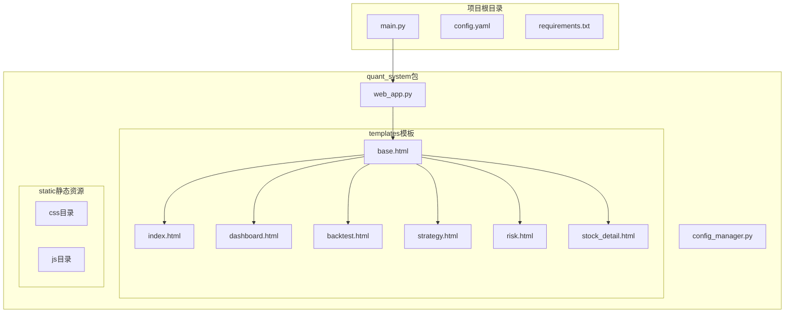
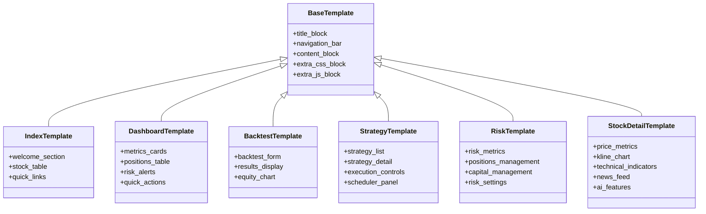
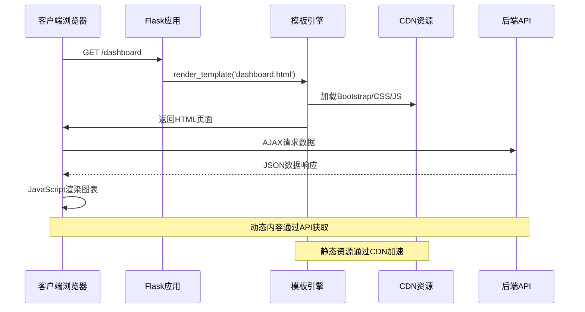
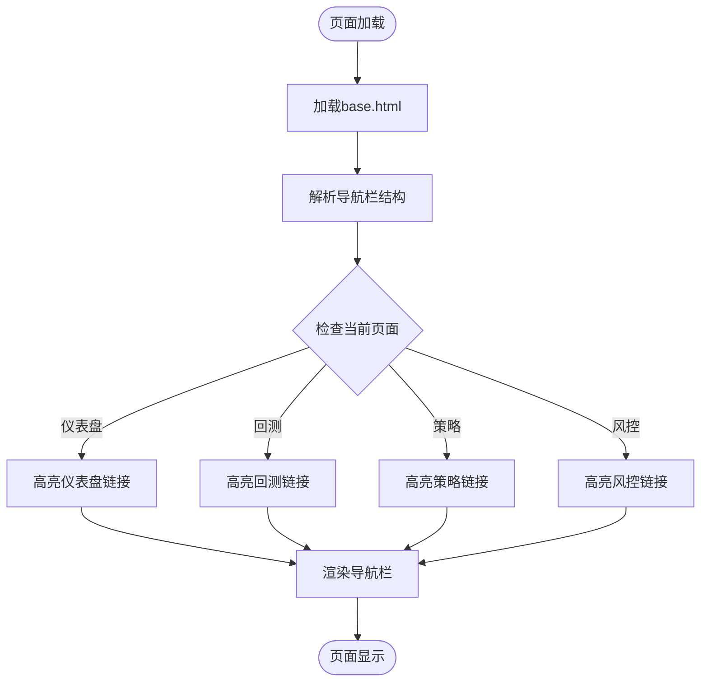
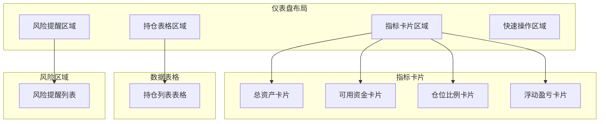
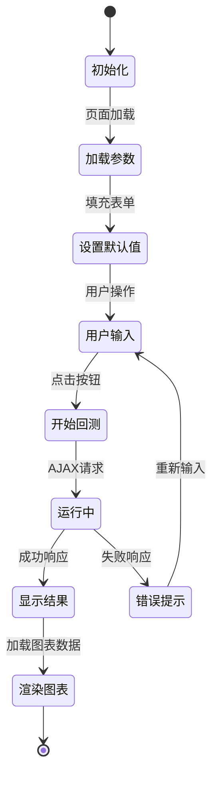
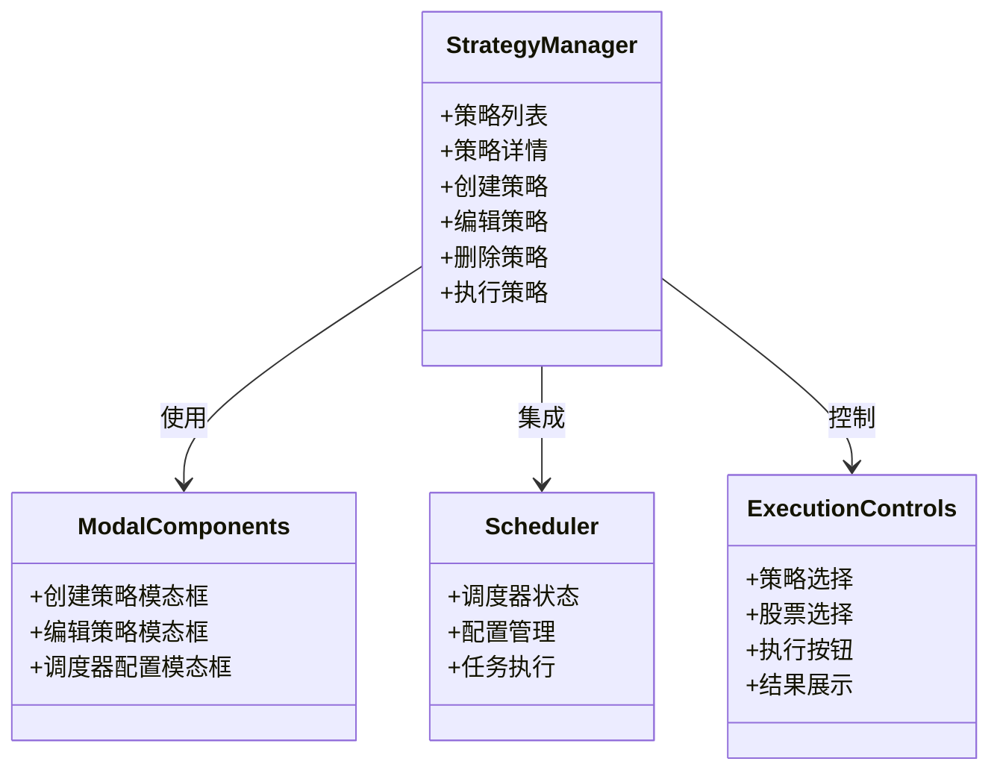
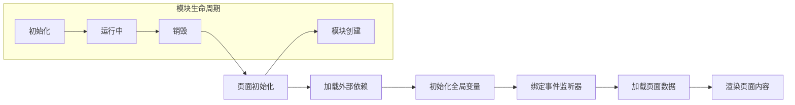
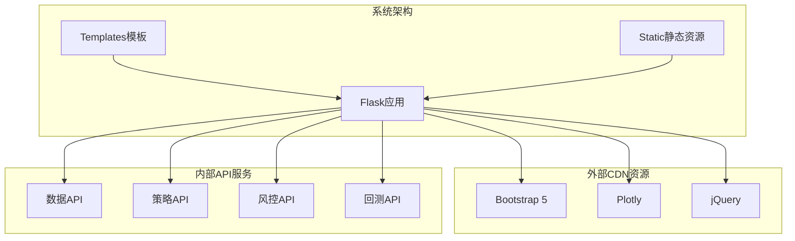
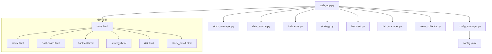

# 静态资源管理

<cite>
**本文档引用的文件**
- [quant_system/web_app.py](file://quant_system/web_app.py)
- [quant_system/templates/base.html](file://quant_system/templates/base.html)
- [quant_system/templates/dashboard.html](file://quant_system/templates/dashboard.html)
- [quant_system/templates/index.html](file://quant_system/templates/index.html)
- [quant_system/templates/backtest.html](file://quant_system/templates/backtest.html)
- [quant_system/templates/strategy.html](file://quant_system/templates/strategy.html)
- [quant_system/templates/risk.html](file://quant_system/templates/risk.html)
- [quant_system/templates/stock_detail.html](file://quant_system/templates/stock_detail.html)
- [quant_system/config_manager.py](file://quant_system/config_manager.py)
- [config.yaml](file://config.yaml)
- [main.py](file://main.py)
</cite>

## 目录
1. [简介](#简介)
2. [项目结构](#项目结构)
3. [核心组件](#核心组件)
4. [架构概览](#架构概览)
5. [详细组件分析](#详细组件分析)
6. [依赖分析](#依赖分析)
7. [性能考虑](#性能考虑)
8. [故障排除指南](#故障排除指南)
9. [结论](#结论)
10. [附录](#附录)

## 简介

vibequation量化交易系统采用Flask作为Web框架，通过模板引擎实现前后端分离的静态资源管理。该系统专注于金融数据可视化和量化交易策略展示，需要高效的静态资源组织和优化策略来确保用户体验。

系统采用Bootstrap 5作为UI框架，结合Plotly进行图表渲染，通过jQuery实现DOM操作和AJAX请求。静态资源管理涵盖了CSS样式、JavaScript脚本、模板文件等多个方面，形成了完整的前端资源体系。

## 项目结构

基于Flask的标准项目结构，静态资源管理主要分布在以下目录：

**图表来源**
- [quant_system/web_app.py:34-36](file://quant_system/web_app.py#L34-L36)
- [quant_system/templates/base.html:1-61](file://quant_system/templates/base.html#L1-L61)

**章节来源**
- [quant_system/web_app.py:34-36](file://quant_system/web_app.py#L34-L36)
- [quant_system/templates/base.html:1-61](file://quant_system/templates/base.html#L1-L61)

## 核心组件

### Flask应用配置

系统通过Flask应用配置实现了静态资源的统一管理：

- **模板目录**: `templates/` - 包含所有HTML模板文件
- **静态目录**: `static/` - 包含CSS和JS文件（虽然当前目录为空）
- **路由映射**: 通过装饰器实现页面路由与模板的绑定

### 模板继承体系

系统采用模板继承模式，通过base.html提供基础结构，各页面模板继承并扩展特定内容：

**图表来源**
- [quant_system/templates/base.html:1-61](file://quant_system/templates/base.html#L1-L61)
- [quant_system/templates/index.html:1-92](file://quant_system/templates/index.html#L1-L92)
- [quant_system/templates/dashboard.html:1-196](file://quant_system/templates/dashboard.html#L1-L196)

### 外部资源依赖

系统通过CDN方式引入外部库，减少本地资源压力：

- **Bootstrap 5**: UI框架和组件样式
- **Plotly**: 专业图表渲染库
- **jQuery**: DOM操作和AJAX请求

**章节来源**
- [quant_system/templates/base.html:7-18](file://quant_system/templates/base.html#L7-L18)
- [quant_system/web_app.py:12-26](file://quant_system/web_app.py#L12-L26)

## 架构概览

系统采用MVC架构模式，静态资源管理贯穿整个前端架构：

**图表来源**
- [quant_system/web_app.py:1066-1094](file://quant_system/web_app.py#L1066-L1094)
- [quant_system/templates/dashboard.html:111-195](file://quant_system/templates/dashboard.html#L111-L195)

系统架构特点：
- **静态资源CDN化**: Bootstrap、Plotly、jQuery通过CDN加载
- **模板继承**: 统一的基础模板和页面特定模板
- **API驱动**: 动态数据通过RESTful API获取
- **模块化设计**: 每个页面独立的JavaScript模块

## 详细组件分析

### 基础模板组件

基础模板提供了统一的页面结构和样式框架：

#### 导航栏组件
导航栏采用响应式设计，支持移动端适配：

**图表来源**
- [quant_system/templates/base.html:22-45](file://quant_system/templates/base.html#L22-L45)

#### 样式系统组件

系统内置了统一的样式规范：

| 样式类别 | 作用域 | 示例类名 |
|---------|--------|----------|
| 品牌样式 | 品牌标识 | `.navbar-brand` |
| 卡片样式 | 内容容器 | `.card` |
| 指标样式 | 数据展示 | `.metric-value`, `.metric-label` |
| 状态样式 | 正负向指示 | `.positive`, `.negative`, `.neutral` |

**章节来源**
- [quant_system/templates/base.html:10-18](file://quant_system/templates/base.html#L10-L18)

### 页面级组件

#### 仪表盘页面组件

仪表盘页面采用卡片布局展示关键指标：

**图表来源**
- [quant_system/templates/dashboard.html:12-85](file://quant_system/templates/dashboard.html#L12-L85)

#### 回测页面组件

回测页面提供策略测试和结果展示功能：

**图表来源**
- [quant_system/templates/backtest.html:95-122](file://quant_system/templates/backtest.html#L95-L122)

**章节来源**
- [quant_system/templates/backtest.html:1-200](file://quant_system/templates/backtest.html#L1-L200)

#### 策略管理页面组件

策略管理页面支持策略的创建、编辑、执行和监控：

**图表来源**
- [quant_system/templates/strategy.html:13-104](file://quant_system/templates/strategy.html#L13-L104)

**章节来源**
- [quant_system/templates/strategy.html:1-721](file://quant_system/templates/strategy.html#L1-L721)

### JavaScript模块化设计

系统采用模块化的JavaScript设计，每个页面都有独立的脚本模块：

#### 通用模块模式

#### 页面特定模块

| 页面 | 主要功能 | 关键模块 |
|------|----------|----------|
| 仪表盘 | 资产和持仓展示 | 风险组合API调用、持仓列表渲染 |
| 回测 | 策略测试和结果展示 | 表单验证、图表渲染、结果展示 |
| 策略 | 策略管理与执行 | 模态框管理、AJAX请求、调度器控制 |
| 风险 | 风控设置和持仓管理 | 表格操作、模态框交互、设置保存 |
| 股票详情 | 个股数据分析 | 图表渲染、实时更新、数据更新流程 |

**章节来源**
- [quant_system/templates/dashboard.html:111-195](file://quant_system/templates/dashboard.html#L111-L195)
- [quant_system/templates/backtest.html:65-199](file://quant_system/templates/backtest.html#L65-L199)
- [quant_system/templates/strategy.html:254-720](file://quant_system/templates/strategy.html#L254-L720)
- [quant_system/templates/risk.html:339-585](file://quant_system/templates/risk.html#L339-L585)
- [quant_system/templates/stock_detail.html:126-337](file://quant_system/templates/stock_detail.html#L126-L337)

## 依赖分析

### 外部依赖关系

系统对外部资源的依赖关系如下：

**图表来源**
- [quant_system/templates/base.html:7-18](file://quant_system/templates/base.html#L7-L18)
- [quant_system/web_app.py:47-526](file://quant_system/web_app.py#L47-L526)

### 内部模块依赖

系统内部模块之间的依赖关系：

**图表来源**
- [quant_system/web_app.py:17-26](file://quant_system/web_app.py#L17-L26)
- [quant_system/config_manager.py:23-26](file://quant_system/config_manager.py#L23-L26)

**章节来源**
- [quant_system/web_app.py:17-26](file://quant_system/web_app.py#L17-L26)
- [quant_system/config_manager.py:23-26](file://quant_system/config_manager.py#L23-L26)

## 性能考虑

### 静态资源优化策略

#### CDN集成优化
- **资源缓存**: CDN提供全球节点缓存，减少延迟
- **并行下载**: 多个CDN资源可并行加载
- **压缩传输**: CDN支持Gzip/Brotli压缩

#### 模板渲染优化
- **模板缓存**: Flask模板引擎自动缓存编译后的模板
- **条件加载**: 仅在需要时加载额外的CSS/JS
- **块扩展**: 使用``实现按需加载

#### 数据加载优化
- **懒加载**: 图表和数据在需要时才加载
- **分页加载**: 大量数据采用分页或虚拟滚动
- **缓存策略**: API响应结果进行客户端缓存

### 性能监控指标

| 指标类型 | 目标值 | 监控方法 |
|----------|--------|----------|
| 首屏加载时间 | <3秒 | Navigation Timing API |
| TTFB (首字节时间) | <200ms | Network面板 |
| 图表渲染时间 | <1秒 | Performance.mark API |
| API响应时间 | <500ms | Network面板 |

## 故障排除指南

### 常见问题诊断

#### 模板加载问题
- **症状**: 页面空白或部分元素缺失
- **原因**: 模板文件路径错误或语法错误
- **解决方案**: 检查模板继承链和文件路径

#### API调用失败
- **症状**: 数据加载失败或图表不显示
- **原因**: CORS配置、网络连接、API端点错误
- **解决方案**: 检查浏览器开发者工具Network标签

#### 样式冲突问题
- **症状**: 页面布局错乱或样式异常
- **原因**: Bootstrap版本冲突或自定义样式覆盖
- **解决方案**: 检查CSS优先级和Bootstrap类名使用

### 调试工具使用

#### 浏览器开发者工具
- **Elements**: 检查DOM结构和CSS样式
- **Network**: 监控资源加载和API调用
- **Console**: 查看JavaScript错误和警告
- **Performance**: 分析页面性能瓶颈

#### Flask调试模式
- **启用方法**: 设置`debug=True`
- **功能特性**: 自动重载、详细错误页面、调试工具
- **使用场景**: 开发环境和问题定位

**章节来源**
- [quant_system/web_app.py:1099-1121](file://quant_system/web_app.py#L1099-L1121)

## 结论

vibequation量化交易系统的静态资源管理采用了现代化的Web开发实践，通过Flask模板引擎和CDN资源集成，实现了高效的内容交付和良好的用户体验。

系统的主要优势包括：
- **模块化设计**: 清晰的模板继承和JavaScript模块化
- **性能优化**: CDN资源利用和懒加载策略
- **可维护性**: 统一的样式规范和组件化架构
- **扩展性**: 灵活的API接口和插件化设计

未来可以进一步优化的方向：
- 实现本地静态资源缓存策略
- 添加资源版本控制机制
- 优化移动端响应式设计
- 增强离线功能支持

## 附录

### 文件组织最佳实践

#### CSS样式文件组织
- **主题样式**: `theme/` - 主题相关的样式定义
- **组件样式**: `components/` - 可复用组件的样式
- **页面样式**: `pages/` - 页面特定的样式
- **工具类**: `utilities/` - 通用的工具类样式

#### JavaScript文件组织
- **核心库**: `lib/` - 第三方库文件
- **业务逻辑**: `modules/` - 业务功能模块
- **页面脚本**: `pages/` - 页面特定的脚本
- **工具函数**: `utils/` - 通用工具函数

#### 配置管理
- **环境配置**: `config/` - 不同环境的配置文件
- **运行时配置**: 通过`config.yaml`动态管理
- **安全配置**: 敏感信息通过环境变量管理

### 版本管理策略

#### 资源版本控制
- **文件名版本**: 使用`filename.v1.2.3.css`格式
- **查询参数版本**: 使用`?v=1.2.3`参数
- **哈希版本**: 生成文件内容哈希作为版本号

#### 更新策略
- **渐进式更新**: 逐步替换旧资源
- **回滚机制**: 支持快速回滚到上一个版本
- **灰度发布**: 分批向用户推送新版本