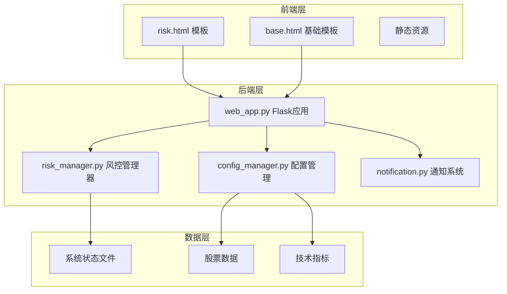
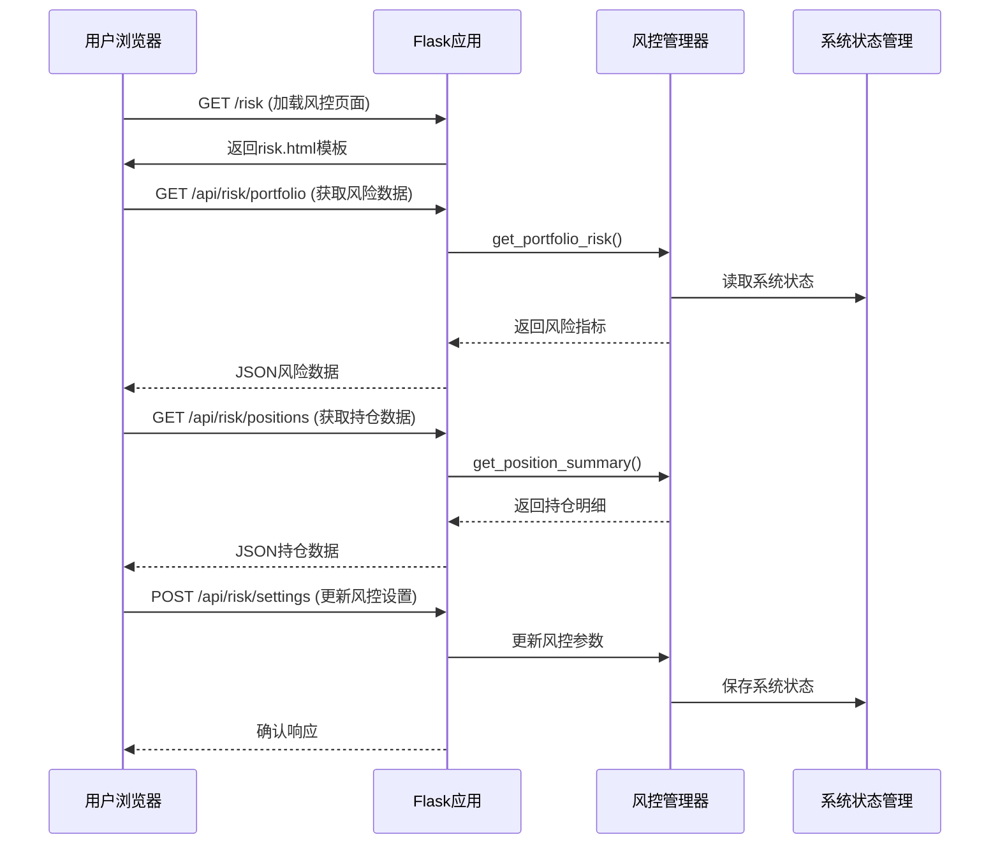
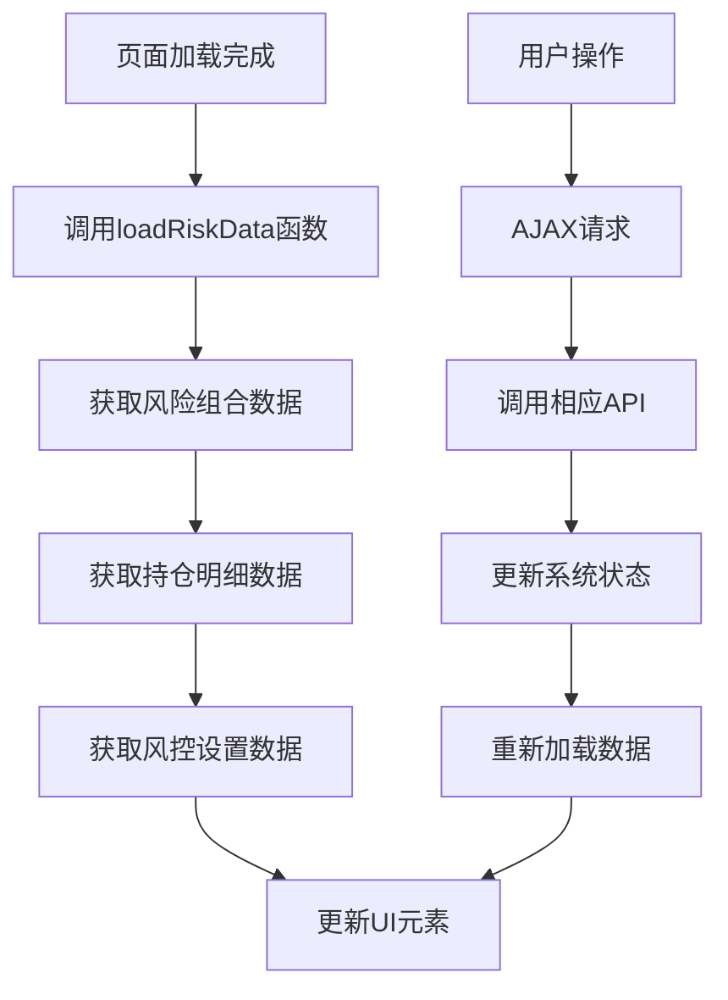
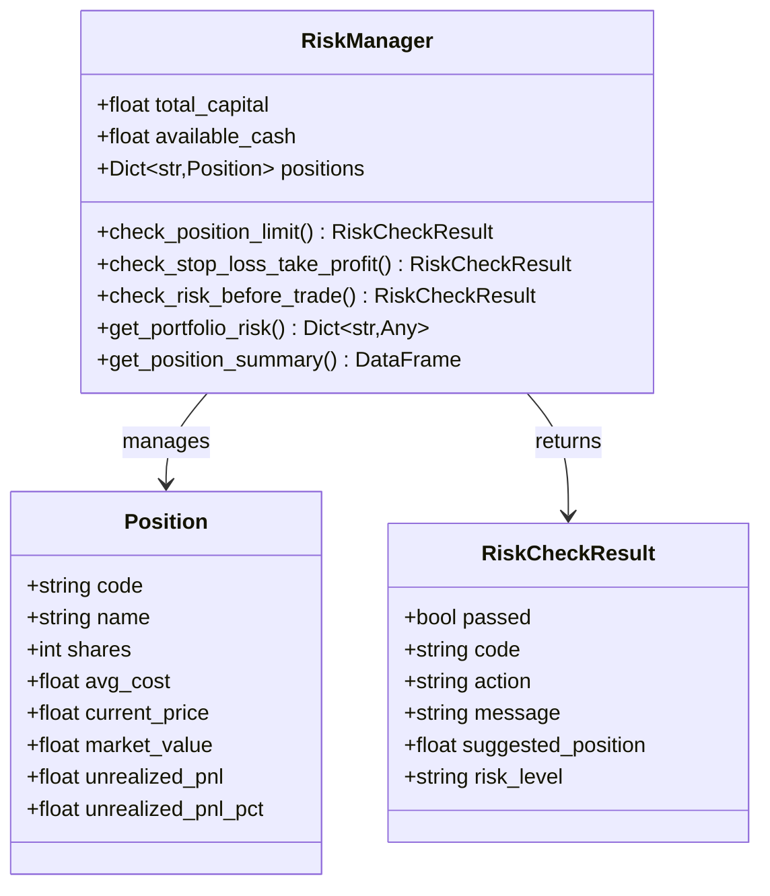
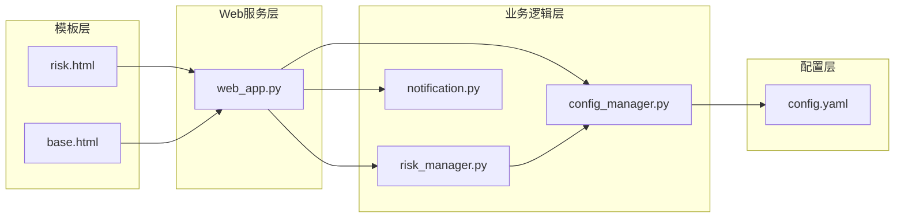

# 风控页面

<cite>
**本文档引用的文件**
- [risk.html](file://quant_system/templates/risk.html)
- [risk_manager.py](file://quant_system/risk_manager.py)
- [web_app.py](file://quant_system/web_app.py)
- [base.html](file://quant_system/templates/base.html)
- [config_manager.py](file://quant_system/config_manager.py)
- [config.yaml](file://config.yaml)
- [notification.py](file://quant_system/notification.py)
</cite>

## 目录
1. [简介](#简介)
2. [项目结构](#项目结构)
3. [核心组件](#核心组件)
4. [架构概览](#架构概览)
5. [详细组件分析](#详细组件分析)
6. [依赖关系分析](#依赖关系分析)
7. [性能考虑](#性能考虑)
8. [故障排除指南](#故障排除指南)
9. [结论](#结论)

## 简介

vibequation量化交易系统的风控页面是整个交易系统的核心控制面板，负责实时监控投资组合的风险状况、管理持仓头寸、设置风控参数以及提供风险预警功能。该页面采用响应式设计，基于Bootstrap框架构建，为用户提供直观的风险管理界面。

风控页面主要功能包括：
- 实时风险指标展示：风险等级、总仓位、持仓集中度、风险提醒数量
- 持仓监控：详细的持仓明细、资金概况、浮动盈亏
- 风控设置：最大仓位比例、单股最大仓位、止损比例、止盈比例
- 预警提醒：自动触发的止损预警、风险提示
- 交互操作：持仓管理、资金编辑、风控参数调整

## 项目结构

风控页面位于量化交易系统的Web应用架构中，采用MVC模式组织代码：

**图表来源**
- [risk.html:1-586](file://quant_system/templates/risk.html#L1-L586)
- [web_app.py:34-873](file://quant_system/web_app.py#L34-L873)

**章节来源**
- [risk.html:1-586](file://quant_system/templates/risk.html#L1-L586)
- [web_app.py:34-873](file://quant_system/web_app.py#L34-L873)

## 核心组件

风控页面由多个核心组件构成，每个组件都有特定的功能职责：

### 风险指标面板
- **风险等级**：实时显示投资组合的整体风险水平（高/中/低）
- **总仓位**：显示当前投资组合占总资产的比例
- **持仓集中度**：反映投资组合的分散程度
- **风险提醒**：统计需要关注的风险事件数量

### 持仓监控区域
- **持仓明细表**：显示每只持仓的详细信息
- **资金概况**：总资产、可用资金、持仓市值、浮动盈亏
- **风险设置**：可配置的风控参数

### 风控配置模块
- **最大仓位比例**：整体投资组合的最大允许仓位
- **单股最大仓位**：单只股票的最大允许仓位
- **止损比例**：触发自动卖出的亏损阈值
- **止盈比例**：触发自动卖出的盈利阈值

**章节来源**
- [risk.html:12-45](file://quant_system/templates/risk.html#L12-L45)
- [risk.html:47-134](file://quant_system/templates/risk.html#L47-L134)

## 架构概览

风控页面采用前后端分离的架构设计，前端负责用户界面展示，后端提供RESTful API接口：

**图表来源**
- [web_app.py:318-467](file://quant_system/web_app.py#L318-L467)
- [risk_manager.py:241-293](file://quant_system/risk_manager.py#L241-L293)

## 详细组件分析

### 风控数据流处理

风控页面的数据流采用异步加载机制，确保用户体验的流畅性：

**图表来源**
- [risk.html:352-426](file://quant_system/templates/risk.html#L352-L426)

### 风控检查机制

风控管理器实现了多层次的风险检查机制：

**图表来源**
- [risk_manager.py:23-45](file://quant_system/risk_manager.py#L23-L45)
- [risk_manager.py:47-240](file://quant_system/risk_manager.py#L47-L240)

### 风控策略实现

风控页面实现了以下风险管理策略：

#### 仓位限制策略
- **总仓位限制**：防止投资组合过度集中
- **单股仓位限制**：避免单一股票风险过大
- **动态调整**：根据可用资金自动计算可购买数量

#### 止损止盈策略
- **止损触发**：当亏损达到预设比例时自动卖出
- **止盈触发**：当盈利达到预设比例时自动卖出
- **风险等级评估**：根据风险指标自动调整风险等级

#### 异常检测机制
- **实时监控**：持续跟踪持仓的盈亏变化
- **阈值比较**：与预设阈值进行实时比较
- **自动告警**：触发异常时立即生成告警

**章节来源**
- [risk_manager.py:89-183](file://quant_system/risk_manager.py#L89-L183)
- [risk_manager.py:285-292](file://quant_system/risk_manager.py#L285-L292)

### 交互设计说明

风控页面提供了丰富的交互功能：

#### 风险调整功能
- **滑块控件**：直观调整风控参数
- **实时预览**：调整参数时实时显示影响
- **范围限制**：确保参数在合理范围内

#### 参数配置界面
- **表单验证**：确保输入数据的有效性
- **确认对话框**：重要操作前的安全确认
- **错误处理**：友好的错误提示和恢复机制

#### 历史记录查看
- **数据表格**：清晰展示历史持仓记录
- **排序功能**：支持按不同字段排序
- **筛选功能**：快速定位特定持仓

**章节来源**
- [risk.html:108-131](file://quant_system/templates/risk.html#L108-L131)
- [risk.html:442-508](file://quant_system/templates/risk.html#L442-L508)

## 依赖关系分析

风控页面的依赖关系体现了模块化的设计理念：

**图表来源**
- [web_app.py:23-26](file://quant_system/web_app.py#L23-L26)
- [config_manager.py:149-156](file://quant_system/config_manager.py#L149-L156)

### 关键依赖关系

1. **模板继承**：risk.html继承自base.html，复用导航栏和基础样式
2. **API依赖**：前端JavaScript直接调用后端提供的RESTful API
3. **配置依赖**：风控参数来源于全局配置管理器
4. **状态管理**：系统状态通过JSON文件进行持久化存储

**章节来源**
- [base.html:22-45](file://quant_system/templates/base.html#L22-L45)
- [web_app.py:318-467](file://quant_system/web_app.py#L318-L467)

## 性能考虑

风控页面在设计时充分考虑了性能优化：

### 前端性能优化
- **异步加载**：使用AJAX异步获取数据，避免页面阻塞
- **缓存策略**：合理利用浏览器缓存减少重复请求
- **DOM操作优化**：批量更新DOM元素，减少重排重绘

### 后端性能优化
- **数据缓存**：热点数据缓存到内存中
- **数据库查询优化**：使用索引和适当的查询条件
- **并发处理**：支持多用户同时访问

### 网络性能优化
- **CDN资源**：使用CDN加速静态资源加载
- **压缩传输**：启用Gzip压缩减少传输数据量
- **连接复用**：HTTP/1.1 keep-alive连接复用

## 故障排除指南

### 常见问题及解决方案

#### 页面加载失败
**症状**：风控页面无法正常显示
**可能原因**：
- Flask应用未正确启动
- 模板文件路径错误
- 静态资源加载失败

**解决方法**：
1. 检查Flask应用日志
2. 验证模板文件路径
3. 确认静态资源服务器运行状态

#### API请求失败
**症状**：风险数据无法更新
**可能原因**：
- 后端API服务异常
- 网络连接问题
- 权限认证失败

**解决方法**：
1. 检查后端服务状态
2. 验证网络连接
3. 确认API权限配置

#### 风控设置不生效
**症状**：修改的风控参数未被应用
**可能原因**：
- 配置文件写入失败
- 系统状态未正确保存
- 参数范围超出限制

**解决方法**：
1. 检查配置文件写入权限
2. 验证系统状态保存机制
3. 确认参数范围设置

**章节来源**
- [web_app.py:342-467](file://quant_system/web_app.py#L342-L467)
- [risk_manager.py:320-348](file://quant_system/risk_manager.py#L320-L348)

## 结论

vibequation量化交易系统的风控页面是一个功能完整、设计合理的风险管理界面。通过采用现代化的Web技术栈和严谨的架构设计，该页面能够有效帮助用户监控和管理投资组合风险。

### 主要优势

1. **实时性**：通过异步数据加载实现实时风险监控
2. **可视化**：直观的图表和指标展示提升用户体验
3. **可配置性**：灵活的风控参数设置满足不同风险偏好
4. **可靠性**：完善的错误处理和异常恢复机制

### 技术特色

1. **模块化设计**：清晰的组件分离便于维护和扩展
2. **响应式布局**：适配多种设备和屏幕尺寸
3. **安全机制**：完整的权限控制和数据验证
4. **性能优化**：多层面的性能优化确保流畅体验

风控页面不仅提供了强大的风险管理功能，还展现了现代Web应用的最佳实践，为量化交易系统的稳定运行提供了坚实的技术支撑。