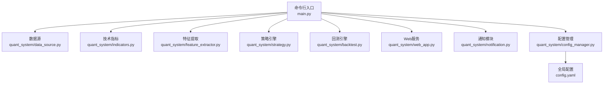
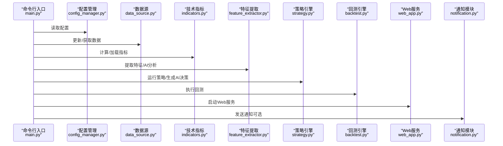
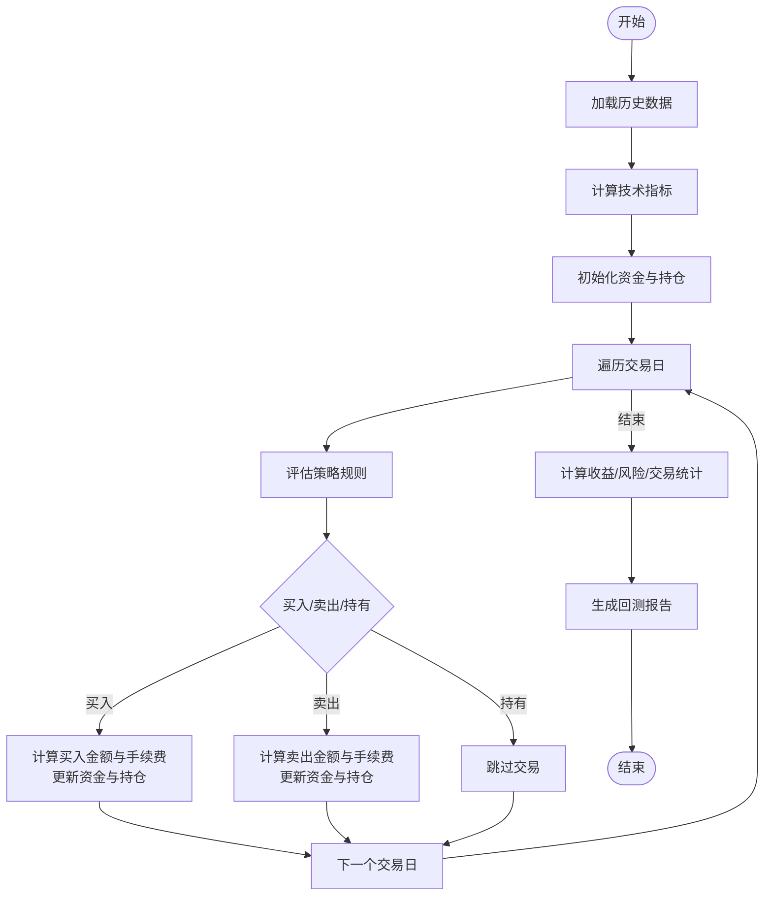
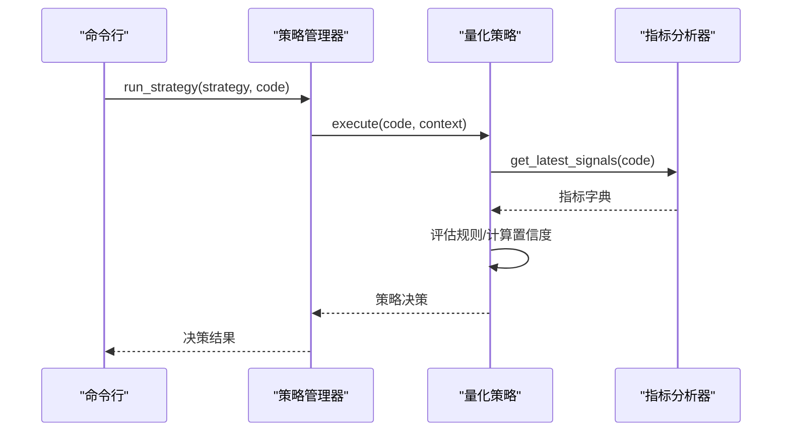
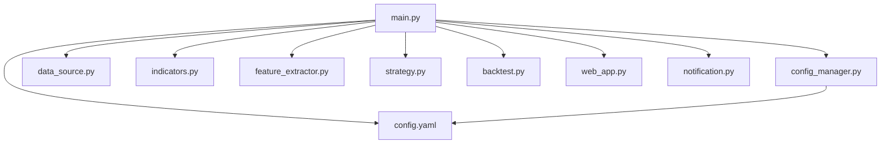

# 命令行工具

<cite>
**本文引用的文件**
- [main.py](file://main.py)
- [config.yaml](file://config.yaml)
- [quant_system/config_manager.py](file://quant_system/config_manager.py)
- [quant_system/data_source.py](file://quant_system/data_source.py)
- [quant_system/indicators.py](file://quant_system/indicators.py)
- [quant_system/feature_extractor.py](file://quant_system/feature_extractor.py)
- [quant_system/strategy.py](file://quant_system/strategy.py)
- [quant_system/backtest.py](file://quant_system/backtest.py)
- [quant_system/web_app.py](file://quant_system/web_app.py)
- [quant_system/notification.py](file://quant_system/notification.py)
- [requirements.txt](file://requirements.txt)
</cite>

## 目录
1. [简介](#简介)
2. [项目结构](#项目结构)
3. [核心组件](#核心组件)
4. [架构总览](#架构总览)
5. [详细组件分析](#详细组件分析)
6. [依赖关系分析](#依赖关系分析)
7. [性能考虑](#性能考虑)
8. [故障排查指南](#故障排查指南)
9. [结论](#结论)
10. [附录](#附录)

## 简介
本文件为 vibequation 量化交易系统命令行工具的完整使用文档。系统通过命令行提供数据管理、技术指标更新、新闻采集、特征提取、策略执行、AI决策、回测、Web服务、风险报告、数据验证、列出策略与股票等能力。本文将逐项说明各 CLI 子命令的功能、参数、默认值、组合使用方式，并提供批处理脚本编写、自动化任务调度与定时执行方案，以及故障排查与性能优化建议。

## 项目结构
系统采用模块化设计，命令行入口位于主程序，核心功能分布在数据源、指标、特征、策略、回测、Web、通知等子模块中；配置集中于 YAML 文件并通过配置管理器统一读取。

**图表来源**
- [main.py:261-365](file://main.py#L261-L365)
- [quant_system/data_source.py:300-423](file://quant_system/data_source.py#L300-L423)
- [quant_system/indicators.py:21-500](file://quant_system/indicators.py#L21-L500)
- [quant_system/feature_extractor.py:99-405](file://quant_system/feature_extractor.py#L99-L405)
- [quant_system/strategy.py:318-556](file://quant_system/strategy.py#L318-L556)
- [quant_system/backtest.py:66-456](file://quant_system/backtest.py#L66-L456)
- [quant_system/web_app.py:445-466](file://quant_system/web_app.py#L445-L466)
- [quant_system/notification.py:84-301](file://quant_system/notification.py#L84-L301)
- [quant_system/config_manager.py:12-178](file://quant_system/config_manager.py#L12-L178)
- [config.yaml:1-88](file://config.yaml#L1-L88)

**章节来源**
- [main.py:261-365](file://main.py#L261-L365)
- [config.yaml:1-88](file://config.yaml#L1-L88)
- [quant_system/config_manager.py:12-178](file://quant_system/config_manager.py#L12-L178)

## 核心组件
- 命令行入口与子命令注册：在主程序中使用 argparse 注册所有子命令及其参数，并将参数传递给对应处理函数。
- 配置管理：集中读取 YAML 配置，提供统一访问接口，涵盖数据目录、技术指标、AI模型、回测、风控、Web、日志等。
- 数据源：统一历史与实时数据接口，封装 Tushare 与 Easyquotation，负责数据获取、缓存与标准化。
- 技术指标：计算 RSI、MACD、均线、布林带、KDJ、波动率等指标，并支持按日/周/月频率更新与持久化。
- 特征提取：结合技术指标与情感分析，使用 AI 模型输出策略类型、置信度、推荐指标等。
- 策略引擎：内置多策略（RSI、MACD、均线、综合），支持自然语言描述到量化规则的解析与执行。
- 回测引擎：基于历史数据与策略规则进行回测，输出收益、风险、交易统计等指标。
- Web 服务：基于 Flask 提供可视化界面与 API，支持图表、回测结果、风险信息等。
- 通知模块：通过 PushPlus 推送策略信号、回测报告、风险预警等消息。

**章节来源**
- [main.py:48-365](file://main.py#L48-L365)
- [quant_system/config_manager.py:12-178](file://quant_system/config_manager.py#L12-L178)
- [quant_system/data_source.py:24-423](file://quant_system/data_source.py#L24-L423)
- [quant_system/indicators.py:21-500](file://quant_system/indicators.py#L21-L500)
- [quant_system/feature_extractor.py:99-405](file://quant_system/feature_extractor.py#L99-L405)
- [quant_system/strategy.py:318-556](file://quant_system/strategy.py#L318-L556)
- [quant_system/backtest.py:66-456](file://quant_system/backtest.py#L66-L456)
- [quant_system/web_app.py:445-466](file://quant_system/web_app.py#L445-L466)
- [quant_system/notification.py:84-301](file://quant_system/notification.py#L84-L301)

## 架构总览
下图展示了命令行工具与各子模块的交互关系，以及数据流与控制流的关键节点。

**图表来源**
- [main.py:48-365](file://main.py#L48-L365)
- [quant_system/config_manager.py:12-178](file://quant_system/config_manager.py#L12-L178)
- [quant_system/data_source.py:300-423](file://quant_system/data_source.py#L300-L423)
- [quant_system/indicators.py:188-328](file://quant_system/indicators.py#L188-L328)
- [quant_system/feature_extractor.py:213-284](file://quant_system/feature_extractor.py#L213-L284)
- [quant_system/strategy.py:409-425](file://quant_system/strategy.py#L409-L425)
- [quant_system/backtest.py:75-282](file://quant_system/backtest.py#L75-L282)
- [quant_system/web_app.py:445-466](file://quant_system/web_app.py#L445-L466)
- [quant_system/notification.py:131-171](file://quant_system/notification.py#L131-L171)

## 详细组件分析

### 命令行子命令总览
- update-data：更新历史数据（可指定股票或全量更新，支持强制刷新）
- update-indicators：更新技术指标（可指定股票或全量更新）
- collect-news：采集新闻（可指定股票或全量）
- extract-features：提取特征（可指定股票或全量）
- run-strategy：运行策略（需指定策略名称与股票代码，可选发送通知）
- ai-decision：AI决策（可选策略描述，输出建议与理由）
- backtest：策略回测（需指定策略名称与股票代码，支持日期范围与初始资金，可选发送通知）
- risk-report：生成风险报告
- validate-data：验证数据完整性
- web：启动Web服务（可配置主机、端口、调试模式）
- list-stocks：列出股票清单
- list-strategies：列出策略清单
- indicator-report：生成技术指标报告

**章节来源**
- [main.py:278-348](file://main.py#L278-L348)

### 命令详解与参数说明

#### update-data
- 功能：更新历史数据
- 参数：
  - --code：股票代码（可选，不指定则全量更新）
  - --refresh：强制刷新（布尔）
- 默认值：无
- 示例：
  - 更新全部：python main.py update-data
  - 更新指定股票：python main.py update-data --code 600519
  - 强制刷新：python main.py update-data --code 600519 --refresh
- 组合使用：与 update-indicators 配合，先更新数据再计算指标
- 注意事项：首次运行会自动创建数据目录

**章节来源**
- [main.py:48-58](file://main.py#L48-L58)
- [quant_system/data_source.py:396-419](file://quant_system/data_source.py#L396-L419)

#### update-indicators
- 功能：更新技术指标
- 参数：
  - --code：股票代码（可选，不指定则全量更新）
- 默认值：无
- 示例：
  - 更新全部：python main.py update-indicators
  - 更新指定股票：python main.py update-indicators --code 600519
- 组合使用：与 update-data 配合，先更新数据再计算指标
- 注意事项：指标按日/周/月三种时间框架批量更新

**章节来源**
- [main.py:61-71](file://main.py#L61-L71)
- [quant_system/indicators.py:306-328](file://quant_system/indicators.py#L306-L328)

#### collect-news
- 功能：采集新闻
- 参数：
  - --code：股票代码（可选，不指定则全量采集）
- 默认值：无
- 示例：
  - 采集全部：python main.py collect-news
  - 指定股票：python main.py collect-news --code 600519
- 组合使用：与 extract-features 配合，先采集新闻再做情感分析

**章节来源**
- [main.py:74-84](file://main.py#L74-L84)

#### extract-features
- 功能：提取特征（技术特征+情感特征+市场特征），并使用AI分析策略类型
- 参数：
  - --code：股票代码（可选，不指定则全量提取）
- 默认值：无
- 示例：
  - 提取单只：python main.py extract-features --code 600519
  - 全量提取：python main.py extract-features
- 组合使用：与 indicator-report 配合，先计算指标再提取特征
- 注意事项：AI分析依赖配置中的模型提供商与Token

**章节来源**
- [main.py:87-97](file://main.py#L87-L97)
- [quant_system/feature_extractor.py:213-284](file://quant_system/feature_extractor.py#L213-L284)

#### run-strategy
- 功能：运行策略并打印决策结果
- 参数：
  - -c/--code：股票代码（必填）
  - -s/--strategy：策略名称（必填）
  - -n/--notify：发送通知（布尔）
- 默认值：无
- 示例：
  - 运行RSI策略：python main.py run-strategy -c 600519 -s rsi
  - 发送通知：python main.py run-strategy -c 600519 -s rsi -n
- 组合使用：与 list-strategies 配合查看可用策略名称
- 输出：建议操作、建议仓位、置信度、决策理由

**章节来源**
- [main.py:100-121](file://main.py#L100-L121)
- [quant_system/strategy.py:409-425](file://quant_system/strategy.py#L409-L425)

#### ai-decision
- 功能：AI综合决策（可选提供策略描述）
- 参数：
  - -c/--code：股票代码（必填）
  - -d/--description：策略描述（可选）
- 默认值：无
- 示例：
  - 基础AI决策：python main.py ai-decision -c 600519
  - 带描述：python main.py ai-decision -c 600519 -d "趋势跟踪策略"
- 组合使用：与 indicator-report 配合，先查看指标再做AI决策

**章节来源**
- [main.py:123-137](file://main.py#L123-L137)
- [quant_system/strategy.py:468-550](file://quant_system/strategy.py#L468-L550)

#### backtest
- 功能：策略回测
- 参数：
  - -c/--code：股票代码（必填）
  - -s/--strategy：策略名称（必填）
  - --start-date：开始日期（默认：20230101）
  - --end-date：结束日期（默认：当前日期）
  - --capital：初始资金（默认：1000000）
  - -n/--notify：发送通知（布尔）
- 默认值：见上
- 示例：
  - 基础回测：python main.py backtest -c 600519 -s rsi
  - 指定日期与资金：python main.py backtest -c 600519 -s rsi --start-date 20230101 --end-date 20231231 --capital 200000
- 组合使用：与 list-strategies 配合选择策略，与 risk-report 配合评估风险
- 输出：总收益、年化收益、最大回撤、夏普比率、胜率、盈亏比等

**章节来源**
- [main.py:139-174](file://main.py#L139-L174)
- [quant_system/backtest.py:75-282](file://quant_system/backtest.py#L75-L282)

#### risk-report
- 功能：生成风险报告
- 参数：无
- 默认值：无
- 示例：python main.py risk-report
- 组合使用：与 backtest 配合，先回测再生成风险报告

**章节来源**
- [main.py:176-182](file://main.py#L176-L182)

#### validate-data
- 功能：验证数据完整性
- 参数：无
- 默认值：无
- 示例：python main.py validate-data
- 输出：每只股票的数据状态（正常/异常/缺失）

**章节来源**
- [main.py:184-215](file://main.py#L184-L215)

#### web
- 功能：启动Web服务
- 参数：
  - --host：主机地址（默认：127.0.0.1）
  - --port：端口（默认：8080）
  - --debug：调试模式（布尔）
- 默认值：见上
- 示例：python main.py web
  - 指定主机与端口：python main.py web --host 0.0.0.0 --port 8080
- 组合使用：与 backtest、indicator-report 等配合，通过Web查看结果

**章节来源**
- [main.py:217-223](file://main.py#L217-L223)
- [quant_system/web_app.py:445-466](file://quant_system/web_app.py#L445-L466)

#### list-stocks
- 功能：列出股票清单
- 参数：无
- 默认值：无
- 示例：python main.py list-stocks

**章节来源**
- [main.py:225-238](file://main.py#L225-L238)

#### list-strategies
- 功能：列出策略清单
- 参数：无
- 默认值：无
- 示例：python main.py list-strategies

**章节来源**
- [main.py:240-253](file://main.py#L240-L253)

#### indicator-report
- 功能：生成技术指标报告
- 参数：
  - -c/--code：股票代码（必填）
- 默认值：无
- 示例：python main.py indicator-report -c 600519

**章节来源**
- [main.py:255-259](file://main.py#L255-L259)
- [quant_system/indicators.py:445-494](file://quant_system/indicators.py#L445-L494)

### 关键流程图

#### 回测流程

**图表来源**
- [quant_system/backtest.py:75-282](file://quant_system/backtest.py#L75-L282)

#### 策略执行流程

**图表来源**
- [quant_system/strategy.py:409-425](file://quant_system/strategy.py#L409-L425)
- [quant_system/strategy.py:229-299](file://quant_system/strategy.py#L229-L299)
- [quant_system/indicators.py:336-388](file://quant_system/indicators.py#L336-L388)

## 依赖关系分析
- Python 依赖：pandas、numpy、tushare、easyquotation、flask、plotly、requests、beautifulsoup4、lxml、pyyaml、python-dateutil 等。
- 配置依赖：config.yaml 中的 tokens、data_storage、data_collection、technical_indicators、ai_models、backtest、risk_management、web、logging 等键。
- 模块耦合：命令行入口仅负责参数解析与转发，核心逻辑分布在各子模块；配置管理器提供统一配置访问，降低耦合。

**图表来源**
- [main.py:14-24](file://main.py#L14-L24)
- [quant_system/config_manager.py:23-26](file://quant_system/config_manager.py#L23-L26)
- [config.yaml:1-88](file://config.yaml#L1-L88)

**章节来源**
- [requirements.txt:1-29](file://requirements.txt#L1-L29)
- [config.yaml:1-88](file://config.yaml#L1-L88)

## 性能考虑
- 数据获取限速：Tushare 数据源实现简单速率限制，避免频繁请求导致限流。
- 指标计算：按日/周/月三种时间框架批量更新，减少重复计算。
- 回测性能：回测引擎在策略评估阶段使用安全的表达式求值，避免复杂规则导致的性能问题；可适当减少规则数量或使用更少的交易日。
- Web服务：Flask 默认开发模式，生产部署建议使用 WSGI 服务器与反向代理。
- 日志：日志文件按配置写入，建议定期轮转与清理。

[本节为通用建议，无需特定文件引用]

## 故障排查指南
- 配置问题
  - 缺失 Token：若 Tushare 或 PushPlus Token 未配置，相关功能可能无法使用。检查 config.yaml 中 tokens 字段。
  - 目录权限：确保 data_storage 下各目录可写，系统会在启动时自动创建。
- 数据问题
  - 数据为空：确认 update-data 已成功执行，或检查网络与 Tushare API 状态。
  - 指标缺失：确认 update-indicators 已执行，或检查指标计算逻辑。
- 回测问题
  - 策略不存在：确认策略名称与 list-strategies 输出一致。
  - 日期范围错误：确保 start-date 早于 end-date。
- Web 服务问题
  - 端口占用：修改 --port 或停止占用进程。
  - 模板渲染：确认 templates 目录存在且可读。
- 通知问题
  - PushPlus Token 未配置：将不会发送通知。可在 config.yaml 中配置后重试。

**章节来源**
- [quant_system/config_manager.py:23-38](file://quant_system/config_manager.py#L23-L38)
- [quant_system/data_source.py:46-55](file://quant_system/data_source.py#L46-L55)
- [quant_system/web_app.py:445-466](file://quant_system/web_app.py#L445-L466)
- [quant_system/notification.py:22-26](file://quant_system/notification.py#L22-L26)

## 结论
vibequation 量化交易系统命令行工具提供了从数据采集、指标计算、特征提取、策略执行、回测到 Web 可视化的完整链路。通过合理的参数配置与组合使用，用户可以高效地开展量化研究与交易实践。建议在生产环境中结合定时任务与通知机制，实现自动化与监控。

[本节为总结，无需特定文件引用]

## 附录

### 批处理脚本与自动化任务
- Linux/macOS Shell 示例（按日执行）
  - 更新数据与指标：bash -c 'python main.py update-data && python main.py update-indicators'
  - 回测与通知：bash -c 'python main.py backtest -c 600519 -s rsi -n'
  - Web 服务：bash -c 'python main.py web --host 0.0.0.0 --port 8080'
- Windows 批处理示例
  - 更新与回测：cmd /c "python main.py update-data --refresh && python main.py update-indicators && python main.py backtest -c 600519 -s rsi --capital 150000"
- 定时执行方案
  - Linux/macOS：使用 cron，例如每天上午 9:00 执行数据更新，下午 17:00 执行回测。
  - Windows：使用任务计划程序，设置“每天”、“启用”等属性，选择“以最高权限运行”。

[本节为通用指导，无需特定文件引用]

### 常用命令组合示例
- 数据准备：update-data → update-indicators → collect-news → extract-features
- 策略验证：list-strategies → run-strategy → indicator-report
- 回测评估：backtest → risk-report
- 可视化：web → 在浏览器打开 http://localhost:8080

[本节为通用指导，无需特定文件引用]