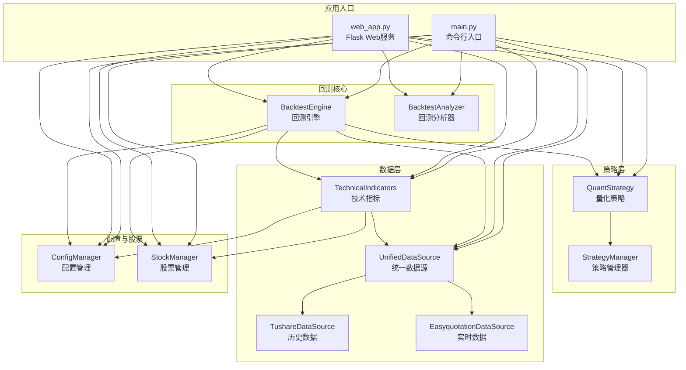
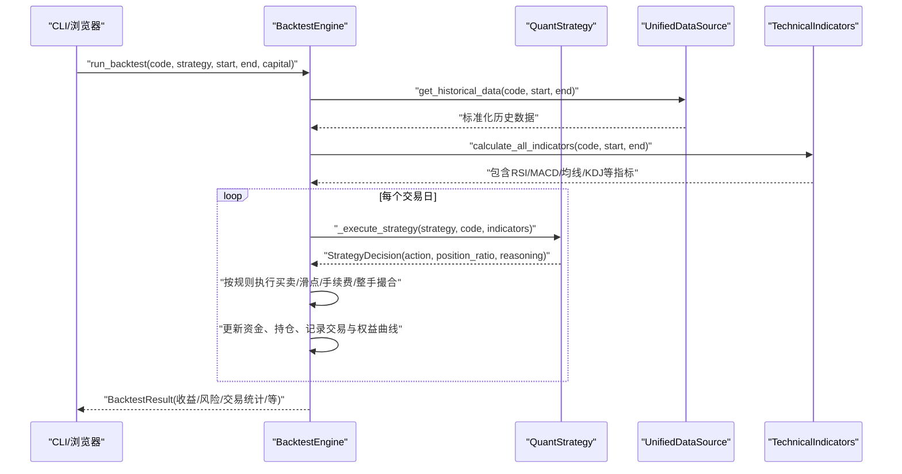
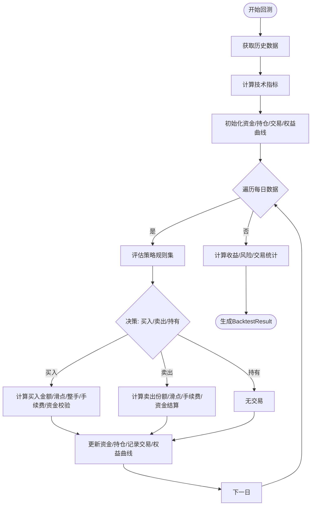
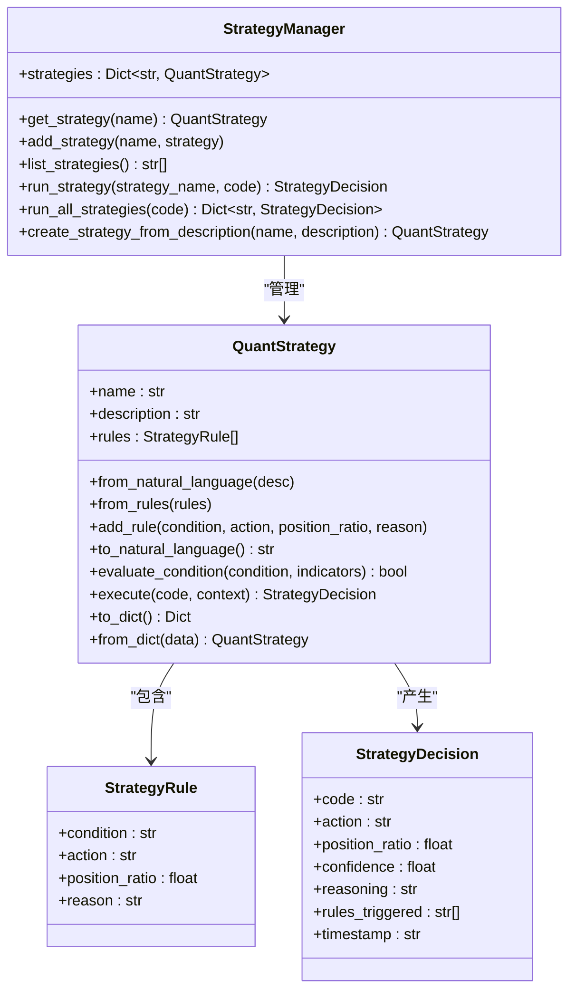
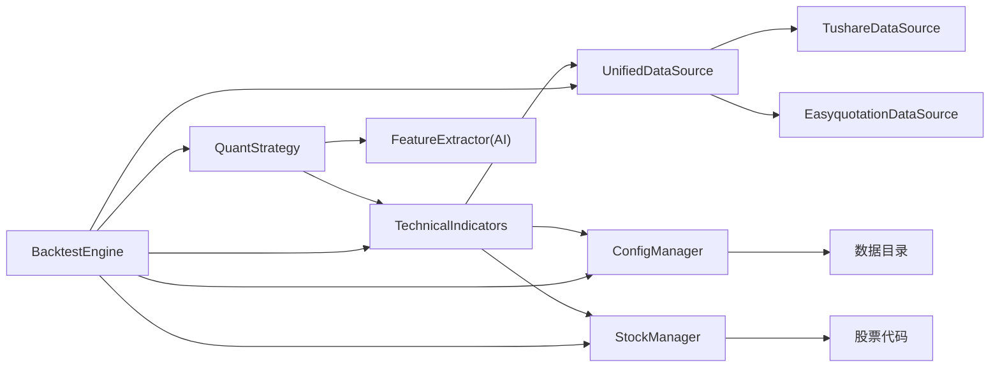

# 回测引擎

<cite>
**本文引用的文件**
- [main.py](file://main.py)
- [config.yaml](file://config.yaml)
- [quant_system/backtest.py](file://quant_system/backtest.py)
- [quant_system/strategy.py](file://quant_system/strategy.py)
- [quant_system/data_source.py](file://quant_system/data_source.py)
- [quant_system/indicators.py](file://quant_system/indicators.py)
- [quant_system/config_manager.py](file://quant_system/config_manager.py)
- [quant_system/stock_manager.py](file://quant_system/stock_manager.py)
- [quant_system/web_app.py](file://quant_system/web_app.py)
- [quant_system/templates/backtest.html](file://quant_system/templates/backtest.html)
- [quant_system/templates/dashboard.html](file://quant_system/templates/dashboard.html)
</cite>

## 目录
1. [简介](#简介)
2. [项目结构](#项目结构)
3. [核心组件](#核心组件)
4. [架构总览](#架构总览)
5. [详细组件分析](#详细组件分析)
6. [依赖关系分析](#依赖关系分析)
7. [性能与优化](#性能与优化)
8. [故障排查指南](#故障排查指南)
9. [结论](#结论)
10. [附录](#附录)

## 简介
本文件面向vibequation量化交易系统的回测引擎，系统性阐述其设计理念、实现架构与性能优化策略，并覆盖回测数据准备、交易成本模拟、滑点处理与填充逻辑、回测结果分析工具、参数配置与时间范围设置、资金管理策略、多策略对比分析、参数敏感性测试与优化算法应用，以及回测报告生成与可视化展示能力。目标是帮助用户全面评估策略表现并进行稳健的策略迭代。

## 项目结构
回测引擎位于quant_system子包内，围绕BacktestEngine、BacktestAnalyzer、QuantStrategy、UnifiedDataSource、TechnicalIndicators等模块协同工作，通过命令行入口main.py与Web界面web_app.py对外提供CLI与可视化能力。

图表来源
- [main.py:1-365](file://main.py#L1-L365)
- [quant_system/backtest.py:66-374](file://quant_system/backtest.py#L66-L374)
- [quant_system/strategy.py:150-316](file://quant_system/strategy.py#L150-L316)
- [quant_system/data_source.py:300-423](file://quant_system/data_source.py#L300-L423)
- [quant_system/indicators.py:21-274](file://quant_system/indicators.py#L21-L274)
- [quant_system/config_manager.py:12-178](file://quant_system/config_manager.py#L12-L178)
- [quant_system/stock_manager.py:62-278](file://quant_system/stock_manager.py#L62-L278)
- [quant_system/web_app.py:29-466](file://quant_system/web_app.py#L29-L466)

章节来源
- [main.py:261-365](file://main.py#L261-L365)
- [quant_system/backtest.py:66-374](file://quant_system/backtest.py#L66-L374)
- [quant_system/strategy.py:150-316](file://quant_system/strategy.py#L150-L316)
- [quant_system/data_source.py:300-423](file://quant_system/data_source.py#L300-L423)
- [quant_system/indicators.py:21-274](file://quant_system/indicators.py#L21-L274)
- [quant_system/config_manager.py:12-178](file://quant_system/config_manager.py#L12-L178)
- [quant_system/stock_manager.py:62-278](file://quant_system/stock_manager.py#L62-L278)
- [quant_system/web_app.py:29-466](file://quant_system/web_app.py#L29-L466)

## 核心组件
- 回测引擎BacktestEngine：负责回测主流程，包括数据拉取、指标计算、策略执行、交易执行、资金与持仓管理、回测结果统计与等。
- 回测分析器BacktestAnalyzer：负责生成回测报告、多策略比较表格。
- 量化策略QuantStrategy：封装策略规则、条件评估、策略决策生成。
- 统一数据源UnifiedDataSource：抽象历史与实时数据接口，屏蔽Tushare/Easyquotation差异。
- 技术指标TechnicalIndicators：集中计算RSI、MACD、均线、布林带、KDJ、波动率等指标。
- 配置管理ConfigManager：集中管理回测、风控、AI、Web等配置。
- 股票管理StockManager：统一管理股票、板块、指数的代码与格式转换。
- Web服务web_app.py：提供回测可视化、图表渲染与API接口。

章节来源
- [quant_system/backtest.py:66-374](file://quant_system/backtest.py#L66-L374)
- [quant_system/backtest.py:376-451](file://quant_system/backtest.py#L376-L451)
- [quant_system/strategy.py:150-316](file://quant_system/strategy.py#L150-L316)
- [quant_system/data_source.py:300-423](file://quant_system/data_source.py#L300-L423)
- [quant_system/indicators.py:21-274](file://quant_system/indicators.py#L21-L274)
- [quant_system/config_manager.py:12-178](file://quant_system/config_manager.py#L12-L178)
- [quant_system/stock_manager.py:62-278](file://quant_system/stock_manager.py#L62-L278)
- [quant_system/web_app.py:29-466](file://quant_system/web_app.py#L29-L466)

## 架构总览
回测流程自上而下分为三层：
- 应用层：CLI命令与Web界面，负责参数输入、结果展示与交互。
- 引擎层：BacktestEngine协调策略、数据与指标，驱动逐日回测。
- 数据与策略层：UnifiedDataSource与TechnicalIndicators提供标准化数据与指标；QuantStrategy提供规则与决策。

图表来源
- [quant_system/backtest.py:75-282](file://quant_system/backtest.py#L75-L282)
- [quant_system/strategy.py:229-299](file://quant_system/strategy.py#L229-L299)
- [quant_system/data_source.py:307-336](file://quant_system/data_source.py#L307-L336)
- [quant_system/indicators.py:188-273](file://quant_system/indicators.py#L188-L273)

## 详细组件分析

### 回测引擎BacktestEngine
- 数据准备：通过UnifiedDataSource获取标准化历史数据，再调用TechnicalIndicators批量计算RSI、MACD、均线、布林带、KDJ、波动率等指标。
- 策略执行：_execute_strategy遍历策略规则，构建安全的评估环境，将规则条件字符串中的指标名替换为安全字典，使用eval执行，统计触发信号与建议仓位。
- 交易执行与成本模拟：
  - 买入：按position_ratio计算目标金额，考虑slippage放大买入价，按100股整手向下取整，计算手续费（commission_rate），检查资金充足后扣款并加仓。
  - 卖出：按position_ratio计算卖出份额（100股整手），考虑slippage缩小卖出价，计算手续费，资金增加并减仓。
  - 记录交易明细与每日权益曲线（equity = cash + position_value）。
- 结果统计：计算总收益、年化收益、最大回撤（百分比与绝对值）、夏普比率、交易次数、胜率、平均盈亏、盈亏比等，并生成BacktestResult与equity_curve。

图表来源
- [quant_system/backtest.py:75-282](file://quant_system/backtest.py#L75-L282)

章节来源
- [quant_system/backtest.py:66-374](file://quant_system/backtest.py#L66-L374)

### 回测分析器BacktestAnalyzer
- 报告生成：将BacktestResult格式化为人类可读的报告文本，包含收益、风险、交易统计与前若干笔交易明细。
- 多策略比较：将多个策略的回测结果汇总为DataFrame，便于横向对比。

章节来源
- [quant_system/backtest.py:376-451](file://quant_system/backtest.py#L376-L451)

### 量化策略QuantStrategy
- 规则与条件：StrategyRule包含condition、action、position_ratio、reason；QuantStrategy维护规则列表，支持从自然语言解析为规则，或从规则列表构造。
- 条件评估：evaluate_condition将指标字典注入安全环境，替换条件中的指标名，使用eval执行，返回布尔结果。
- 策略执行：execute遍历规则，统计触发信号与建议仓位，生成StrategyDecision，包含action、position_ratio、confidence、reasoning与触发规则列表。

图表来源
- [quant_system/strategy.py:35-54](file://quant_system/strategy.py#L35-L54)
- [quant_system/strategy.py:44-54](file://quant_system/strategy.py#L44-L54)
- [quant_system/strategy.py:45-54](file://quant_system/strategy.py#L45-L54)
- [quant_system/strategy.py:150-316](file://quant_system/strategy.py#L150-L316)
- [quant_system/strategy.py:318-444](file://quant_system/strategy.py#L318-L444)

章节来源
- [quant_system/strategy.py:150-316](file://quant_system/strategy.py#L150-L316)
- [quant_system/strategy.py:318-444](file://quant_system/strategy.py#L318-L444)

### 统一数据源UnifiedDataSource与技术指标TechnicalIndicators
- UnifiedDataSource：抽象历史与实时数据接口，标准化列名，支持日线/周线/月线，封装Tushare与Easyquotation数据源。
- TechnicalIndicators：集中计算RSI、MACD、均线、布林带、KDJ、波动率等指标，并提供保存/加载能力，支持多时间框架。

章节来源
- [quant_system/data_source.py:300-423](file://quant_system/data_source.py#L300-L423)
- [quant_system/indicators.py:21-274](file://quant_system/indicators.py#L21-L274)

### 配置管理ConfigManager与股票管理StockManager
- ConfigManager：集中读取config.yaml，提供回测、风控、AI、Web等配置访问，确保数据目录存在。
- StockManager：统一管理股票、板块、指数代码，提供格式转换（Tushare/Easyquotation），支持查询与持久化。

章节来源
- [quant_system/config_manager.py:12-178](file://quant_system/config_manager.py#L12-L178)
- [quant_system/stock_manager.py:62-278](file://quant_system/stock_manager.py#L62-L278)

### Web服务与可视化
- web_app.py：提供REST API与HTML页面，包括股票数据、指标、K线图、策略运行、回测运行与图表、风险组合与持仓等。
- 模板backtest.html与dashboard.html：前端页面通过AJAX调用API，展示回测结果与可视化图表。

章节来源
- [quant_system/web_app.py:29-466](file://quant_system/web_app.py#L29-L466)
- [quant_system/templates/backtest.html:1-200](file://quant_system/templates/backtest.html#L1-L200)
- [quant_system/templates/dashboard.html:1-196](file://quant_system/templates/dashboard.html#L1-L196)

## 依赖关系分析
- 回测引擎依赖策略、数据与指标模块，形成“策略-数据-指标”的闭环。
- 策略模块依赖指标分析器与特征提取器（在策略模块中可见），用于生成决策。
- 数据模块依赖配置与股票管理，确保数据目录与代码格式正确。
- Web服务依赖回测引擎与分析器，提供可视化与交互。

图表来源
- [quant_system/backtest.py:66-374](file://quant_system/backtest.py#L66-L374)
- [quant_system/strategy.py:150-316](file://quant_system/strategy.py#L150-L316)
- [quant_system/data_source.py:300-423](file://quant_system/data_source.py#L300-L423)
- [quant_system/indicators.py:21-274](file://quant_system/indicators.py#L21-L274)
- [quant_system/config_manager.py:12-178](file://quant_system/config_manager.py#L12-L178)
- [quant_system/stock_manager.py:62-278](file://quant_system/stock_manager.py#L62-L278)

章节来源
- [quant_system/backtest.py:66-374](file://quant_system/backtest.py#L66-L374)
- [quant_system/strategy.py:150-316](file://quant_system/strategy.py#L150-L316)
- [quant_system/data_source.py:300-423](file://quant_system/data_source.py#L300-L423)
- [quant_system/indicators.py:21-274](file://quant_system/indicators.py#L21-L274)
- [quant_system/config_manager.py:12-178](file://quant_system/config_manager.py#L12-L178)
- [quant_system/stock_manager.py:62-278](file://quant_system/stock_manager.py#L62-L278)

## 性能与优化
- 数据访问优化
  - UnifiedDataSource对历史数据进行本地缓存与增量合并，减少重复请求与网络开销。
  - TushareDataSource内置速率限制，避免API限流。
- 指标计算优化
  - 使用向量化计算（pandas/numpy），集中批量计算多周期RSI、MACD、均线等，避免循环逐项计算。
  - 指标结果持久化，支持跨模块复用。
- 回测执行优化
  - 在回测引擎内部直接评估策略规则，避免额外的策略模块调用开销。
  - 交易撮合采用整手（100股）规则，减少碎片化交易带来的计算复杂度。
- 可视化与交互
  - Web端使用Plotly渲染图表，前端通过AJAX异步加载数据，提升用户体验。
- 建议的进一步优化
  - 对规则评估使用更安全的AST解析替代eval，降低安全风险与潜在的性能抖动。
  - 对长回测周期引入并行化（多进程/多线程）或分批回测，结合进度与断点续跑。
  - 对指标计算引入缓存命中率监控与过期策略，避免重复计算。

[本节为通用性能讨论，无需特定文件来源]

## 故障排查指南
- 数据获取失败
  - 检查Tushare Token配置与网络连通性；确认股票代码格式与市场标识正确。
  - 查看日志中关于数据更新与指标计算的错误信息。
- 回测结果异常
  - 确认回测时间范围与数据完整性；检查指标是否成功计算。
  - 核对交易成本与滑点配置是否合理。
- Web界面问题
  - 确认Flask服务端口与主机配置；检查静态资源与模板路径。
  - 通过浏览器开发者工具查看AJAX请求与响应，定位API错误。

章节来源
- [quant_system/data_source.py:43-196](file://quant_system/data_source.py#L43-L196)
- [quant_system/indicators.py:188-273](file://quant_system/indicators.py#L188-L273)
- [quant_system/web_app.py:29-466](file://quant_system/web_app.py#L29-L466)

## 结论
vibequation回测引擎以模块化设计为核心，将策略、数据与指标解耦，通过BacktestEngine串联各模块，形成稳定高效的回测流水线。引擎实现了滑点与交易成本的现实模拟、整手撮合与资金管理，并提供丰富的统计指标与可视化展示。配合CLI与Web界面，用户可以便捷地进行策略开发、参数调优与结果评估。

[本节为总结性内容，无需特定文件来源]

## 附录

### 回测参数配置与时间范围设置
- 回测配置（config.yaml）
  - 初始资金、手续费率、滑点等参数集中于backtest节点。
- 时间范围
  - CLI命令支持start-date与end-date参数，默认使用当前日期作为结束日期。
- 资金管理策略
  - 回测引擎内部未实现动态止盈止损，但可通过策略规则控制仓位与信号；风控配置在risk_management节点，供风控模块使用。

章节来源
- [config.yaml:63-68](file://config.yaml#L63-L68)
- [main.py:313-320](file://main.py#L313-L320)
- [quant_system/config_manager.py:141-147](file://quant_system/config_manager.py#L141-L147)

### 交易成本模拟与滑点处理
- 成本模拟
  - 买入：按买入价×(1+slippage)，计算可购入整手份额，手续费=成交额×commission_rate，资金不足则跳过。
  - 卖出：按卖出价×(1-slippage)，按整手份额卖出，手续费=成交额×commission_rate，资金增加。
- 滑点与整手
  - 滑点以固定比例加入买入成本，减少卖出收益，体现流动性与冲击成本。
  - 100股整手撮合，减少碎片化交易与频繁交易成本。

章节来源
- [quant_system/backtest.py:139-193](file://quant_system/backtest.py#L139-L193)
- [config.yaml:65-67](file://config.yaml#L65-L67)

### 回测结果分析工具
- 收益与风险指标
  - 总收益、总收益百分比、年化收益、最大回撤（绝对与百分比）、夏普比率。
- 交易统计
  - 总交易次数、胜率、平均盈利、平均亏损、盈亏比。
- 报告与可视化
  - BacktestAnalyzer生成报告文本；Web端回测页展示收益曲线与交易明细。

章节来源
- [quant_system/backtest.py:205-282](file://quant_system/backtest.py#L205-L282)
- [quant_system/backtest.py:376-451](file://quant_system/backtest.py#L376-L451)
- [quant_system/web_app.py:264-312](file://quant_system/web_app.py#L264-L312)

### 多策略对比分析与参数敏感性测试
- 多策略对比
  - BacktestAnalyzer.compare_strategies可将多个策略结果汇总为DataFrame，便于横向比较。
- 参数敏感性测试
  - 可通过修改回测配置（初始资金、手续费率、滑点）进行多组回测，观察收益与风险指标变化。
- 优化算法应用
  - 建议结合网格搜索/贝叶斯优化等方法，在Web端或CLI中扩展批量回测与结果汇总脚本，自动筛选最优参数组合。

章节来源
- [quant_system/backtest.py:427-450](file://quant_system/backtest.py#L427-L450)
- [quant_system/config_manager.py:141-147](file://quant_system/config_manager.py#L141-L147)

### 回测报告生成与可视化展示
- 文本报告
  - BacktestAnalyzer.generate_report输出包含收益、风险、交易统计与交易明细的报告文本。
- Web可视化
  - 回测页面通过AJAX调用/api/backtest/run与/api/backtest/chart，展示回测结果与权益曲线。

章节来源
- [quant_system/backtest.py:379-425](file://quant_system/backtest.py#L379-L425)
- [quant_system/web_app.py:210-312](file://quant_system/web_app.py#L210-L312)
- [quant_system/templates/backtest.html:125-198](file://quant_system/templates/backtest.html#L125-L198)