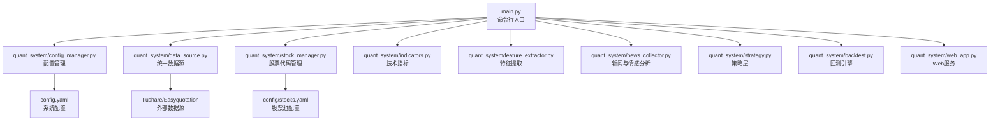
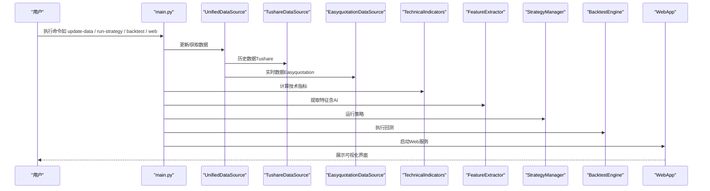
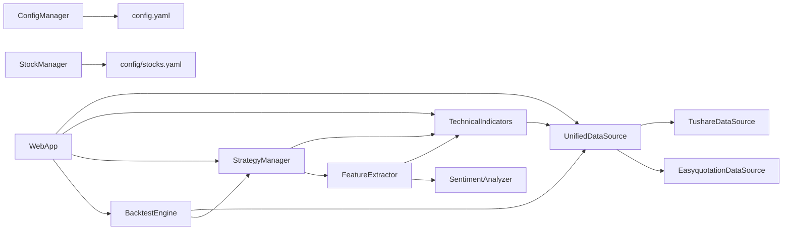

# 快速开始

<cite>
**本文引用的文件**
- [requirements.txt](file://requirements.txt)
- [config.yaml](file://config.yaml)
- [config/stocks.yaml](file://config/stocks.yaml)
- [main.py](file://main.py)
- [quant_system/config_manager.py](file://quant_system/config_manager.py)
- [quant_system/data_source.py](file://quant_system/data_source.py)
- [quant_system/stock_manager.py](file://quant_system/stock_manager.py)
- [quant_system/indicators.py](file://quant_system/indicators.py)
- [quant_system/feature_extractor.py](file://quant_system/feature_extractor.py)
- [quant_system/news_collector.py](file://quant_system/news_collector.py)
- [quant_system/strategy.py](file://quant_system/strategy.py)
- [quant_system/backtest.py](file://quant_system/backtest.py)
- [quant_system/web_app.py](file://quant_system/web_app.py)
- [Prompt.txt](file://Prompt.txt)
</cite>

## 目录
1. [简介](#简介)
2. [项目结构](#项目结构)
3. [核心组件](#核心组件)
4. [架构总览](#架构总览)
5. [详细组件分析](#详细组件分析)
6. [依赖关系分析](#依赖关系分析)
7. [性能与最佳实践](#性能与最佳实践)
8. [故障排查](#故障排查)
9. [结论](#结论)
10. [附录：完整使用示例](#附录完整使用示例)

## 简介
本指南面向首次接触 vibequation 量化交易系统的用户，目标是在约 30 分钟内完成环境搭建、数据准备、策略运行与回测，并通过 Web 界面查看结果。文档覆盖：
- Python 环境与依赖安装
- 配置文件设置（Tushare API、股票池、数据目录）
- 第一个完整使用示例（数据更新 → 技术指标 → 策略运行 → 回测）
- 常见问题与最佳实践

## 项目结构
项目采用模块化分层设计，主要目录与职责如下：
- config：系统配置与股票池配置
- data：数据存储（历史、实时、指标、特征、回测结果、新闻等）
- quant_system：核心业务模块（数据源、指标、特征、策略、回测、Web 界面等）
- logs：日志输出
- main.py：命令行入口，提供数据更新、策略运行、回测、Web 启动等命令
- requirements.txt：依赖清单

图表来源
- [main.py:1-365](file://main.py#L1-L365)
- [quant_system/config_manager.py:1-178](file://quant_system/config_manager.py#L1-L178)
- [quant_system/data_source.py:1-423](file://quant_system/data_source.py#L1-L423)
- [quant_system/stock_manager.py:1-278](file://quant_system/stock_manager.py#L1-L278)
- [quant_system/indicators.py:1-500](file://quant_system/indicators.py#L1-L500)
- [quant_system/feature_extractor.py:1-405](file://quant_system/feature_extractor.py#L1-L405)
- [quant_system/news_collector.py:1-465](file://quant_system/news_collector.py#L1-L465)
- [quant_system/strategy.py:1-553](file://quant_system/strategy.py#L1-L553)
- [quant_system/backtest.py:1-456](file://quant_system/backtest.py#L1-L456)
- [quant_system/web_app.py:1-466](file://quant_system/web_app.py#L1-L466)
- [config.yaml:1-88](file://config.yaml#L1-L88)
- [config/stocks.yaml:1-71](file://config/stocks.yaml#L1-L71)

章节来源
- [main.py:1-365](file://main.py#L1-L365)
- [config.yaml:1-88](file://config.yaml#L1-L88)
- [config/stocks.yaml:1-71](file://config/stocks.yaml#L1-L71)

## 核心组件
- 配置管理：集中读取 config.yaml 与 stocks.yaml，提供统一访问与目录创建
- 数据源：统一 Tushare（历史）与 Easyquotation（实时）数据，标准化输出
- 技术指标：RSI、MACD、均线、布林带、KDJ、波动率等
- 特征提取：结合技术指标与新闻情感，AI辅助策略类型判断
- 策略层：内置 RSI/MACD/均线/综合策略，支持自然语言与量化规则互译
- 回测引擎：按策略与历史数据执行回测，输出收益、风险、交易明细
- Web 服务：提供可视化界面，展示数据、指标、回测结果与风险

章节来源
- [quant_system/config_manager.py:1-178](file://quant_system/config_manager.py#L1-L178)
- [quant_system/data_source.py:1-423](file://quant_system/data_source.py#L1-L423)
- [quant_system/indicators.py:1-500](file://quant_system/indicators.py#L1-L500)
- [quant_system/feature_extractor.py:1-405](file://quant_system/feature_extractor.py#L1-L405)
- [quant_system/strategy.py:1-553](file://quant_system/strategy.py#L1-L553)
- [quant_system/backtest.py:1-456](file://quant_system/backtest.py#L1-L456)
- [quant_system/web_app.py:1-466](file://quant_system/web_app.py#L1-L466)

## 架构总览
下图展示了从命令行到各模块的调用链路与数据流。

图表来源
- [main.py:261-365](file://main.py#L261-L365)
- [quant_system/data_source.py:300-423](file://quant_system/data_source.py#L300-L423)
- [quant_system/indicators.py:188-328](file://quant_system/indicators.py#L188-L328)
- [quant_system/feature_extractor.py:213-321](file://quant_system/feature_extractor.py#L213-L321)
- [quant_system/strategy.py:409-444](file://quant_system/strategy.py#L409-L444)
- [quant_system/backtest.py:75-282](file://quant_system/backtest.py#L75-L282)
- [quant_system/web_app.py:445-466](file://quant_system/web_app.py#L445-L466)

## 详细组件分析

### 配置与环境准备
- Python 环境：建议使用 Python 3.8+，推荐使用虚拟环境隔离依赖
- 依赖安装：使用 requirements.txt 安装所需包
- 配置文件：
  - config.yaml：系统配置（API Token、数据目录、指标参数、回测参数、Web 服务、日志等）
  - config/stocks.yaml：股票池配置（个股、板块、指数）

章节来源
- [requirements.txt:1-29](file://requirements.txt#L1-L29)
- [config.yaml:1-88](file://config.yaml#L1-L88)
- [config/stocks.yaml:1-71](file://config/stocks.yaml#L1-L71)

### 获取与配置 Tushare API 令牌
- 在 Tushare 注册账号并获取 pro 版 API Token
- 在 config.yaml 中设置 tokens.tushare_token
- 注意：系统会在 Tushare 数据源初始化时校验 Token，若未配置会报错

章节来源
- [config.yaml:3-8](file://config.yaml#L3-L8)
- [quant_system/data_source.py:43-55](file://quant_system/data_source.py#L43-L55)

### 设置股票代码配置
- 在 config/stocks.yaml 中维护股票池（个股、板块、指数）
- 支持名称、代码、市场（sh/sz）、类型（stock/sector/index）
- 系统会自动解析不同数据源所需的代码格式（Tushare/易对接）

章节来源
- [config/stocks.yaml:1-71](file://config/stocks.yaml#L1-L71)
- [quant_system/stock_manager.py:20-60](file://quant_system/stock_manager.py#L20-L60)

### 数据更新与技术指标计算
- 历史数据：通过 Tushare 获取日线/周线/月线，自动去重与增量更新
- 实时数据：通过 Easyquotation 获取，支持批量与单只股票
- 技术指标：统一计算 RSI、MACD、均线、布林带、KDJ、波动率等，并持久化

章节来源
- [quant_system/data_source.py:64-186](file://quant_system/data_source.py#L64-L186)
- [quant_system/data_source.py:223-298](file://quant_system/data_source.py#L223-L298)
- [quant_system/indicators.py:188-328](file://quant_system/indicators.py#L188-L328)

### 策略运行与回测
- 内置策略：RSI、MACD、均线、综合策略
- 自然语言策略：可将自然语言描述转换为量化规则，再执行
- 回测：按策略与历史数据执行，输出收益、风险、交易明细与权益曲线

章节来源
- [quant_system/strategy.py:318-460](file://quant_system/strategy.py#L318-L460)
- [quant_system/backtest.py:75-282](file://quant_system/backtest.py#L75-L282)

### Web 可视化
- 提供股票数据、指标、回测结果、风险信息的可视化界面
- 支持图表生成、策略执行、回测运行等交互

章节来源
- [quant_system/web_app.py:37-466](file://quant_system/web_app.py#L37-L466)

## 依赖关系分析

图表来源
- [quant_system/config_manager.py:12-178](file://quant_system/config_manager.py#L12-L178)
- [quant_system/stock_manager.py:62-278](file://quant_system/stock_manager.py#L62-L278)
- [quant_system/data_source.py:300-423](file://quant_system/data_source.py#L300-L423)
- [quant_system/indicators.py:21-500](file://quant_system/indicators.py#L21-L500)
- [quant_system/feature_extractor.py:99-405](file://quant_system/feature_extractor.py#L99-L405)
- [quant_system/news_collector.py:24-465](file://quant_system/news_collector.py#L24-L465)
- [quant_system/strategy.py:318-553](file://quant_system/strategy.py#L318-L553)
- [quant_system/backtest.py:66-456](file://quant_system/backtest.py#L66-L456)
- [quant_system/web_app.py:29-466](file://quant_system/web_app.py#L29-L466)

## 性能与最佳实践
- 数据更新
  - 历史数据采用增量更新与去重，避免重复下载
  - Tushare 请求加速率限制，避免触发限流
- 指标计算
  - 指标计算完成后持久化，后续直接加载，减少重复计算
- 回测
  - 使用滑点与手续费参数，贴近真实交易成本
  - 支持多策略对比与多股票回测
- Web
  - 图表使用 Plotly，支持交互式展示
  - API 返回 JSON，便于前端渲染

章节来源
- [quant_system/data_source.py:56-62](file://quant_system/data_source.py#L56-L62)
- [quant_system/indicators.py:275-305](file://quant_system/indicators.py#L275-L305)
- [quant_system/backtest.py:75-93](file://quant_system/backtest.py#L75-L93)
- [quant_system/web_app.py:124-158](file://quant_system/web_app.py#L124-L158)

## 故障排查
- Tushare Token 未配置或无效
  - 现象：初始化 Tushare 数据源时报错
  - 处理：在 config.yaml 中设置有效的 tushare_token
- 股票代码不匹配
  - 现象：获取数据时报“未知的股票代码”
  - 处理：确认股票池配置与数据源代码格式一致（Tushare/易对接）
- 网络请求失败
  - 现象：新闻采集或 API 调用失败
  - 处理：检查网络与代理；必要时降低并发或增加延时
- 指标为空
  - 现象：技术指标计算返回空
  - 处理：确认历史数据已成功下载并标准化
- Web 启动端口占用
  - 现象：启动失败提示端口已被占用
  - 处理：修改 config.yaml 中 web.port 或关闭占用进程

章节来源
- [quant_system/data_source.py:49-50](file://quant_system/data_source.py#L49-L50)
- [quant_system/stock_manager.py:111-128](file://quant_system/stock_manager.py#L111-L128)
- [quant_system/news_collector.py:138-143](file://quant_system/news_collector.py#L138-L143)
- [quant_system/indicators.py:207-209](file://quant_system/indicators.py#L207-L209)
- [quant_system/web_app.py:454-461](file://quant_system/web_app.py#L454-L461)

## 结论
通过本指南，您可以在 30 分钟内完成环境搭建、数据准备与策略回测，并通过 Web 界面直观查看结果。建议在正式实盘前，先在回测模块中充分验证策略稳健性，并结合风控参数进行优化。

## 附录：完整使用示例

### 步骤一：安装与环境准备
- 准备 Python 环境（3.8+），创建虚拟环境
- 安装依赖：pip install -r requirements.txt
- 准备配置文件：
  - config.yaml：设置 tokens、数据目录、指标参数、回测参数、Web 服务、日志
  - config/stocks.yaml：维护股票池（个股/板块/指数）

章节来源
- [requirements.txt:1-29](file://requirements.txt#L1-L29)
- [config.yaml:1-88](file://config.yaml#L1-L88)
- [config/stocks.yaml:1-71](file://config/stocks.yaml#L1-L71)

### 步骤二：获取并更新数据
- 更新历史数据：python main.py update-data
- 更新指定股票：python main.py update-data --code 600519
- 更新技术指标：python main.py update-indicators [--code 600519]

章节来源
- [main.py:48-72](file://main.py#L48-L72)
- [main.py:61-72](file://main.py#L61-L72)
- [quant_system/data_source.py:396-420](file://quant_system/data_source.py#L396-L420)
- [quant_system/indicators.py:306-328](file://quant_system/indicators.py#L306-L328)

### 步骤三：技术指标与特征分析
- 生成技术指标报告：python main.py indicator-report -c 600519
- 提取特征（AI）：python main.py extract-features [--code 600519]

章节来源
- [main.py:255-259](file://main.py#L255-L259)
- [quant_system/indicators.py:445-494](file://quant_system/indicators.py#L445-L494)
- [quant_system/feature_extractor.py:213-284](file://quant_system/feature_extractor.py#L213-L284)

### 步骤四：策略运行
- 运行内置策略：python main.py run-strategy -c 600519 -s rsi [-n]
- 自然语言策略：python main.py ai-decision -c 600519 -d "当RSI小于30且MACD柱状图大于0时买入"

章节来源
- [main.py:100-137](file://main.py#L100-L137)
- [quant_system/strategy.py:409-444](file://quant_system/strategy.py#L409-L444)
- [quant_system/strategy.py:468-547](file://quant_system/strategy.py#L468-L547)

### 步骤五：回测执行
- 单策略回测：python main.py backtest -c 600519 -s rsi --start-date 20230101 --end-date 20241231 -n
- 多策略对比：在 Web 界面中选择策略并执行

章节来源
- [main.py:139-174](file://main.py#L139-L174)
- [quant_system/backtest.py:75-282](file://quant_system/backtest.py#L75-L282)

### 步骤六：启动 Web 服务
- 启动服务：python main.py web
- 浏览器访问：http://127.0.0.1:8080

章节来源
- [main.py:217-223](file://main.py#L217-L223)
- [quant_system/web_app.py:445-466](file://quant_system/web_app.py#L445-L466)