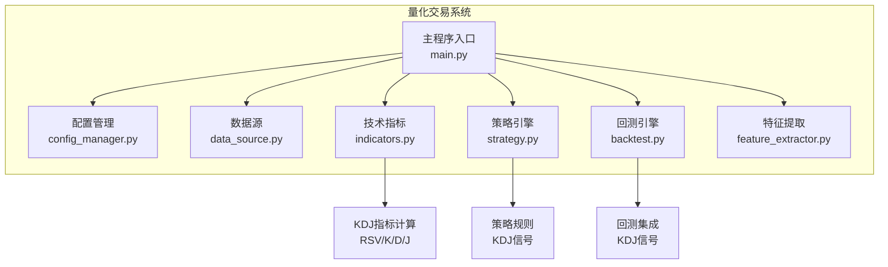
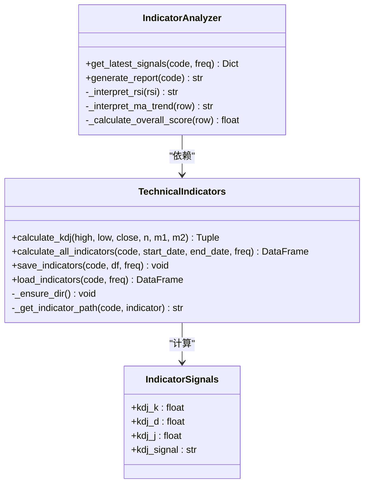
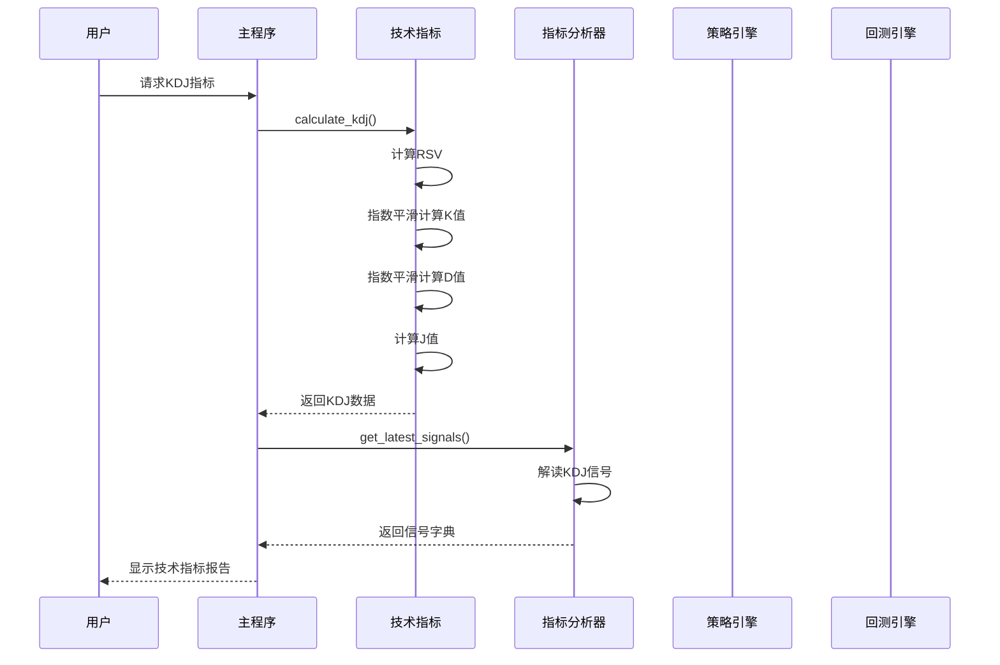
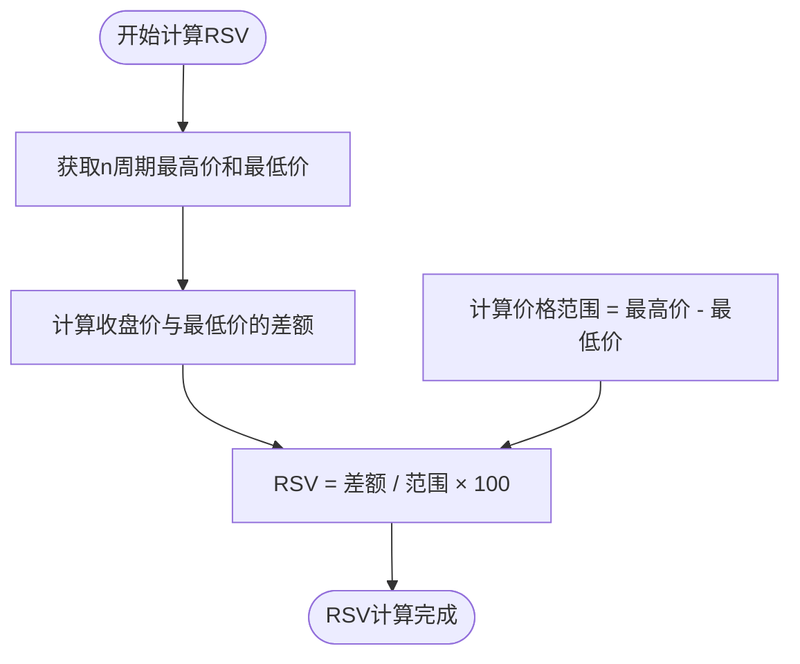
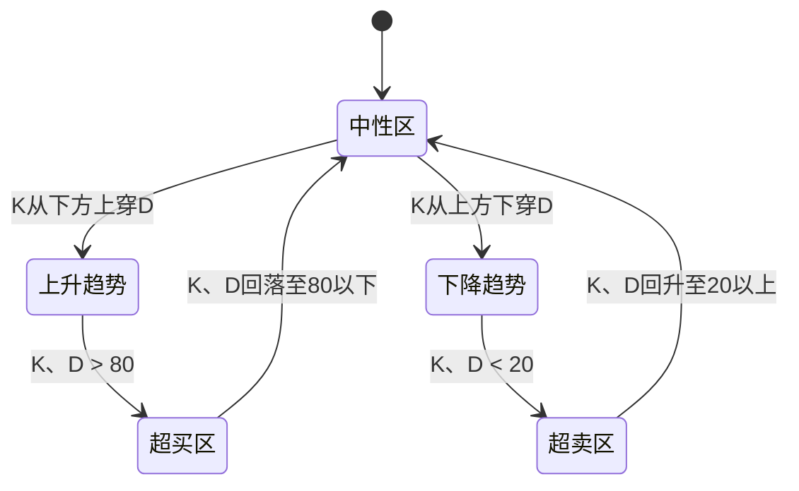
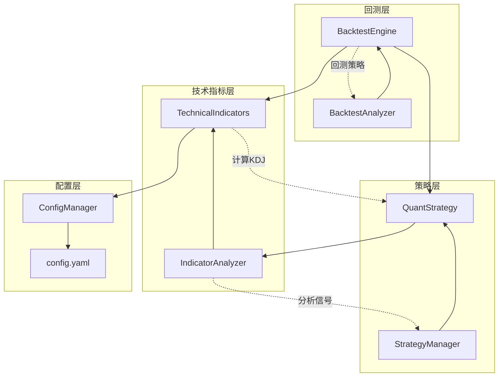

# KDJ随机指标

<cite>
**本文档引用的文件**
- [indicators.py](file://quant_system/indicators.py)
- [strategy.py](file://quant_system/strategy.py)
- [backtest.py](file://quant_system/backtest.py)
- [config.yaml](file://config.yaml)
- [config_manager.py](file://quant_system/config_manager.py)
- [main.py](file://main.py)
</cite>

## 目录
1. [简介](#简介)
2. [项目结构](#项目结构)
3. [核心组件](#核心组件)
4. [架构概览](#架构概览)
5. [详细组件分析](#详细组件分析)
6. [依赖关系分析](#依赖关系分析)
7. [性能考虑](#性能考虑)
8. [故障排除指南](#故障排除指南)
9. [结论](#结论)

## 简介

KDJ随机指标是技术分析中最常用的超买超卖指标之一，由韩国技术分析师林和美在1980年代开发。该指标通过比较收盘价与一定周期内的价格范围来衡量市场的相对强弱状态，为投资者提供买卖时机的参考信号。

本项目中的KDJ实现采用了标准的计算方法，包括RSV（未成熟随机指数）的计算、K值和D值的指数平滑处理，以及J值的计算。系统提供了完整的KDJ指标计算、信号分析和策略集成功能。

## 项目结构

量化交易系统采用模块化设计，KDJ指标作为技术指标模块的一部分，与其他技术分析工具协同工作：



**图表来源**
- [main.py:1-365](file://main.py#L1-L365)
- [indicators.py:145-170](file://quant_system/indicators.py#L145-L170)
- [strategy.py:375-395](file://quant_system/strategy.py#L375-L395)

**章节来源**
- [main.py:1-365](file://main.py#L1-L365)
- [config.yaml:1-88](file://config.yaml#L1-L88)

## 核心组件

### KDJ指标计算类

系统的核心KDJ计算功能位于`TechnicalIndicators`类中，提供了完整的指标计算和分析功能：



**图表来源**
- [indicators.py:21-329](file://quant_system/indicators.py#L21-L329)
- [indicators.py:330-499](file://quant_system/indicators.py#L330-L499)

### 参数配置系统

KDJ指标的参数配置通过统一的配置管理系统进行管理：

| 参数 | 默认值 | 描述 |
|------|--------|------|
| N周期 | 9 | RSV计算的最低价和最高价窗口大小 |
| M1平滑 | 3 | K值的指数平滑系数 |
| M2平滑 | 3 | D值的指数平滑系数 |

**章节来源**
- [indicators.py:145-170](file://quant_system/indicators.py#L145-L170)
- [config.yaml:40-55](file://config.yaml#L40-L55)

## 架构概览

系统采用分层架构设计，KDJ指标在技术指标层进行计算，在策略层进行信号分析，在回测层进行策略验证：



**图表来源**
- [indicators.py:145-170](file://quant_system/indicators.py#L145-L170)
- [indicators.py:336-388](file://quant_system/indicators.py#L336-L388)
- [strategy.py:229-299](file://quant_system/strategy.py#L229-L299)

## 详细组件分析

### KDJ计算原理

#### RSV（未成熟随机指数）计算

RSV是KDJ指标的核心基础，计算公式为：

```
RSV = (收盘价 - 最低价n周期内最低值) / (最高价n周期内最高值 - 最低价n周期内最低值) × 100
```

在系统实现中，RSV的计算过程如下：



**图表来源**
- [indicators.py:161-164](file://quant_system/indicators.py#L161-L164)

#### K值和D值的指数平滑处理

KDJ指标采用指数移动平均（EMA）进行平滑处理，避免价格波动造成的虚假信号：

**K值计算**：
```
K = α × RSV + (1-α) × K(t-1)
```

其中 α = 1/M1，M1为K值平滑周期。

**D值计算**：
```
D = β × K + (1-β) × D(t-1)
```

其中 β = 1/M2，M2为D值平滑周期。

#### J值计算

J值是KDJ指标的最终信号值，计算公式为：
```
J = 3K - 2D
```

J值提供了更敏感的信号指示，通常用于确认K、D值的交叉信号。

### 信号识别机制

系统实现了多种KDJ信号的自动识别：

#### 超买超卖判断

基于传统的80/20阈值标准：

- **超买区域**：K、D > 80
- **超卖区域**：K、D < 20
- **中性区域**：20 ≤ K、D ≤ 80

#### 金叉死叉信号



**图表来源**
- [indicators.py:390-401](file://quant_system/indicators.py#L390-L401)

#### 背离信号识别

系统通过分析KDJ值与价格走势的关系来识别背离信号：

**顶部背离**：
- 价格创新高，但KDJ值未能创新高
- 通常预示趋势可能反转

**底部背离**：
- 价格创新低，但KDJ值未能创新低
- 通常预示底部可能形成

### 应用策略

#### 顶部背离卖出策略

当出现以下条件时，系统建议卖出：

1. 价格处于上升趋势
2. 出现顶部背离信号
3. KDJ值进入超买区域
4. K线从上方下穿D线

#### 底部背离买入策略

当出现以下条件时，系统建议买入：

1. 价格处于下降趋势
2. 出现底部背离信号
3. KDJ值进入超卖区域
4. K线从下方上穿D线

#### 金叉死叉交易策略

基于K、D线交叉的交易信号：

**买入信号**：
- K线从下方上穿D线
- K、D值均在20以下（超卖区域）
- J值为正数

**卖出信号**：
- K线从上方下穿D线
- K、D值均在80以上（超买区域）
- J值为负数

**章节来源**
- [strategy.py:375-395](file://quant_system/strategy.py#L375-L395)
- [backtest.py:115-204](file://quant_system/backtest.py#L115-L204)

## 依赖关系分析

系统中KDJ指标与其他组件的依赖关系：



**图表来源**
- [indicators.py:1-500](file://quant_system/indicators.py#L1-L500)
- [strategy.py:1-556](file://quant_system/strategy.py#L1-L556)
- [backtest.py:1-456](file://quant_system/backtest.py#L1-L456)

**章节来源**
- [config_manager.py:1-178](file://quant_system/config_manager.py#L1-L178)
- [config.yaml:1-88](file://config.yaml#L1-L88)

## 性能考虑

### 计算效率优化

系统在KDJ计算中采用了多种性能优化技术：

1. **向量化计算**：使用pandas的rolling函数进行批量计算
2. **指数平滑优化**：使用ewm函数进行高效的指数移动平均计算
3. **内存管理**：合理控制数据帧的大小和生命周期

### 内存使用分析

- **单次计算内存**：约 O(n) 空间复杂度，其中n为数据点数量
- **批处理优化**：支持批量股票的指标计算
- **缓存机制**：指标结果会持久化存储，避免重复计算

### 并行处理能力

系统支持多股票并行处理，提高大规模数据处理的效率。

## 故障排除指南

### 常见问题及解决方案

#### 数据缺失问题

**症状**：KDJ指标计算返回空值或NaN

**原因**：
- 历史数据不完整
- 价格数据异常
- 计算周期过长导致早期数据不足

**解决方案**：
1. 检查数据源连接状态
2. 验证数据完整性
3. 调整计算周期参数

#### 计算错误

**症状**：指标计算过程中出现除零错误

**原因**：
- 价格范围为零（极端情况下）
- 数据异常值影响计算

**解决方案**：
1. 实施数据清洗和验证
2. 添加异常值检测机制
3. 使用robust计算方法

#### 性能问题

**症状**：大量股票指标计算耗时过长

**解决方案**：
1. 实施分批处理策略
2. 优化数据存储格式
3. 启用并行计算

**章节来源**
- [indicators.py:204-210](file://quant_system/indicators.py#L204-L210)
- [main.py:184-215](file://main.py#L184-L215)

## 结论

本项目提供了完整的KDJ随机指标实现，具有以下特点：

1. **准确性**：严格按照标准公式实现，确保计算结果的可靠性
2. **完整性**：提供RSV、K、D、J四个指标的完整计算
3. **实用性**：集成了信号识别、策略应用和回测验证功能
4. **可扩展性**：模块化设计便于功能扩展和定制

KDJ指标作为经典的技术分析工具，在本系统中得到了充分的应用和验证。通过与其他技术指标的结合使用，可以提高交易决策的准确性和可靠性。系统提供的策略规则和回测功能为用户提供了完整的量化交易解决方案。

建议用户根据具体的市场环境和投资目标，适当调整KDJ参数和策略规则，以获得最佳的投资效果。