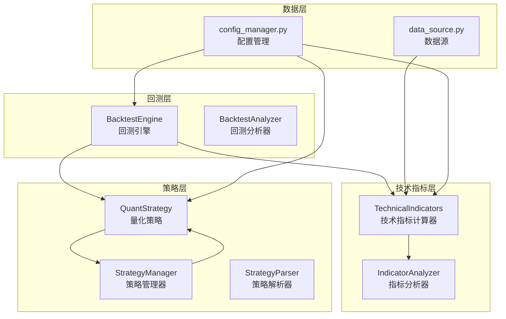
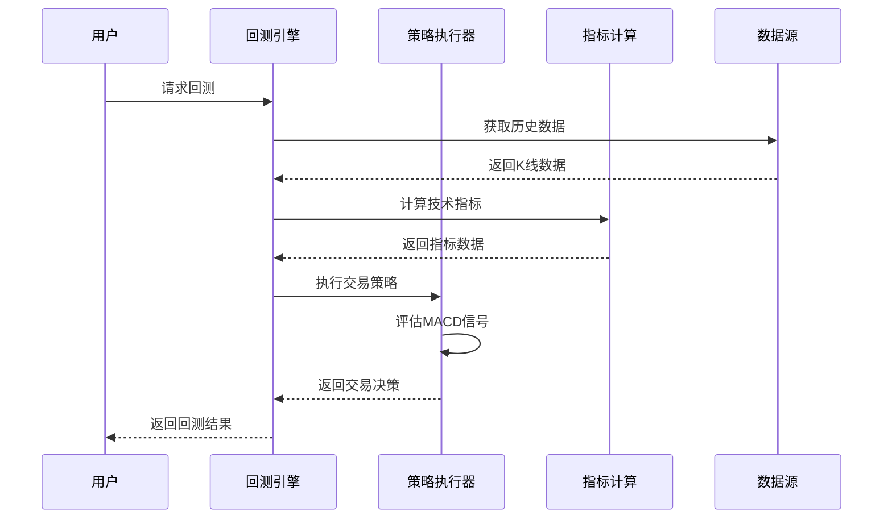
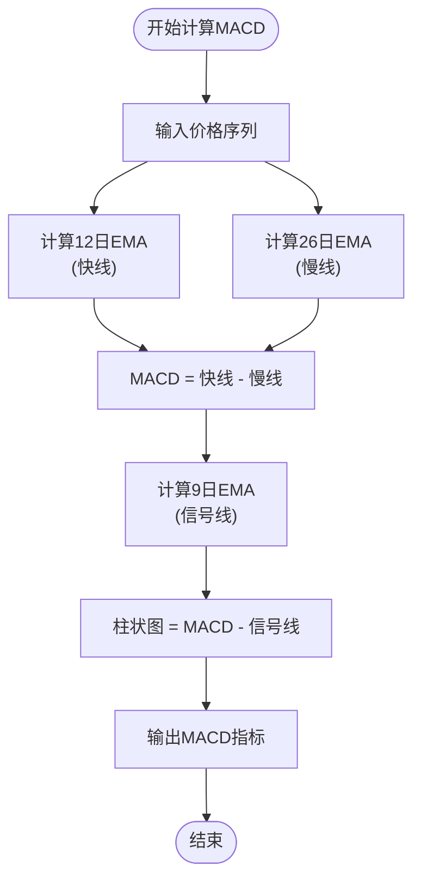
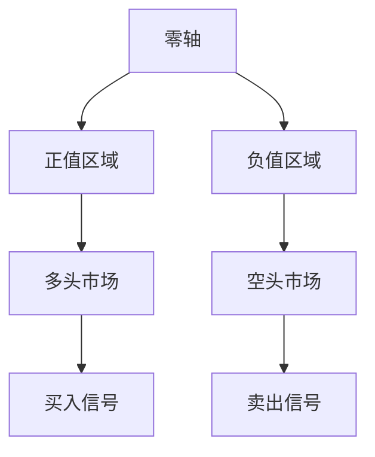
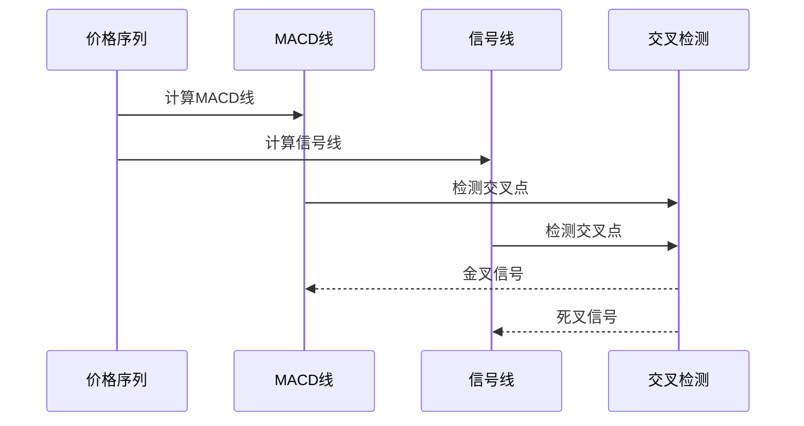
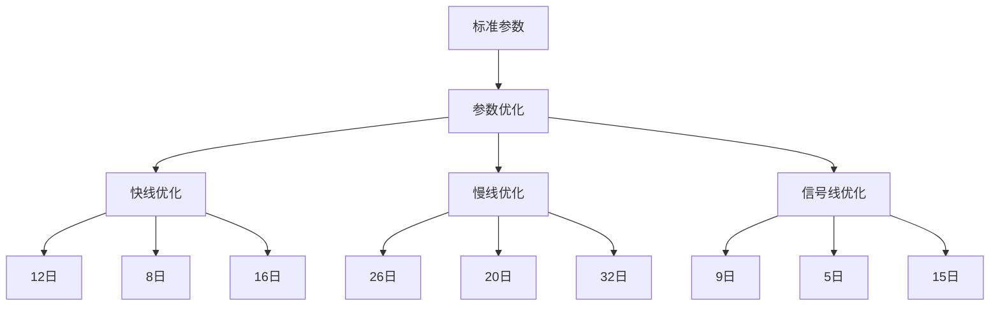
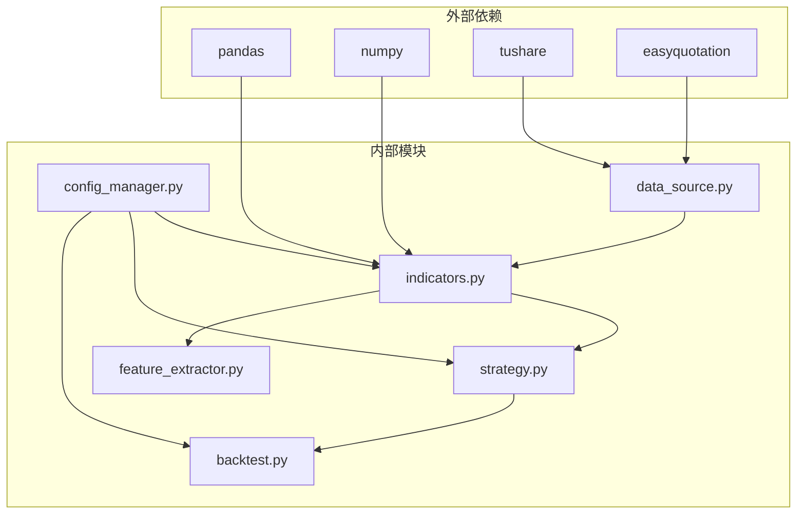

# MACD指数平滑异同移动平均线

<cite>
**本文档引用的文件**
- [quant_system/indicators.py](file://quant_system/indicators.py)
- [quant_system/backtest.py](file://quant_system/backtest.py)
- [quant_system/strategy.py](file://quant_system/strategy.py)
- [config.yaml](file://config.yaml)
- [quant_system/config_manager.py](file://quant_system/config_manager.py)
- [quant_system/data_source.py](file://quant_system/data_source.py)
- [quant_system/feature_extractor.py](file://quant_system/feature_extractor.py)
</cite>

## 目录
1. [引言](#引言)
2. [项目结构](#项目结构)
3. [核心组件](#核心组件)
4. [架构概览](#架构概览)
5. [详细组件分析](#详细组件分析)
6. [依赖关系分析](#依赖关系分析)
7. [性能考虑](#性能考虑)
8. [故障排除指南](#故障排除指南)
9. [结论](#结论)
10. [附录](#附录)

## 引言

MACD（Moving Average Convergence Divergence，指数平滑异同移动平均线）是技术分析中最广泛使用的指标之一。它通过计算两条不同周期的指数移动平均线之间的差异，来识别价格趋势的变化和动量强度。本项目实现了完整的MACD技术指标计算系统，包括三重指数平滑计算、信号生成、回测集成和策略应用。

MACD的核心优势在于其能够同时反映趋势方向和动量强度，通过快线、慢线和信号线的相互作用，为交易者提供清晰的买卖信号。在本系统中，MACD的计算采用标准的三重指数平滑算法，确保了与传统技术分析软件的一致性和可靠性。

## 项目结构

该项目采用模块化架构设计，将技术指标计算、策略执行、回测分析等功能分离到不同的模块中，形成了完整的量化交易系统。



**图表来源**
- [quant_system/indicators.py:21-500](file://quant_system/indicators.py#L21-L500)
- [quant_system/strategy.py:150-556](file://quant_system/strategy.py#L150-L556)
- [quant_system/backtest.py:66-456](file://quant_system/backtest.py#L66-L456)
- [quant_system/data_source.py:300-423](file://quant_system/data_source.py#L300-L423)
- [quant_system/config_manager.py:12-178](file://quant_system/config_manager.py#L12-L178)

**章节来源**
- [quant_system/indicators.py:1-500](file://quant_system/indicators.py#L1-L500)
- [quant_system/strategy.py:1-556](file://quant_system/strategy.py#L1-L556)
- [quant_system/backtest.py:1-456](file://quant_system/backtest.py#L1-L456)
- [quant_system/data_source.py:1-423](file://quant_system/data_source.py#L1-L423)
- [quant_system/config_manager.py:1-178](file://quant_system/config_manager.py#L1-L178)

## 核心组件

### 技术指标计算器（TechnicalIndicators）

技术指标计算器是整个系统的核心组件，负责计算各种技术指标，包括MACD、RSI、移动平均线等。该组件实现了完整的三重指数平滑计算算法，确保了MACD指标的准确性和一致性。

主要功能包括：
- **MACD计算**：实现标准的三重指数平滑算法
- **RSI计算**：计算相对强弱指数
- **移动平均线**：计算多种周期的移动平均线
- **布林带**：计算价格通道边界
- **KDJ计算**：计算随机指标

**章节来源**
- [quant_system/indicators.py:21-500](file://quant_system/indicators.py#L21-L500)

### 指标分析器（IndicatorAnalyzer）

指标分析器负责从技术指标计算结果中提取有用的交易信号，并生成综合评分。该组件将MACD指标与其他技术指标结合，提供更全面的市场分析。

关键特性：
- **MACD趋势识别**：基于柱状图正负性判断趋势方向
- **综合评分系统**：整合多个指标的信号
- **实时信号生成**：为策略执行提供及时的交易信号

**章节来源**
- [quant_system/indicators.py:330-500](file://quant_system/indicators.py#L330-L500)

### 量化策略（QuantStrategy）

量化策略组件实现了基于MACD的交易策略，包括金叉死叉识别、背离检测等功能。该组件支持从自然语言描述自动转换为量化规则，提高了策略开发的效率。

**章节来源**
- [quant_system/strategy.py:150-556](file://quant_system/strategy.py#L150-L556)

## 架构概览

系统采用分层架构设计，各层职责明确，便于维护和扩展。



**图表来源**
- [quant_system/backtest.py:75-282](file://quant_system/backtest.py#L75-L282)
- [quant_system/strategy.py:229-299](file://quant_system/strategy.py#L229-L299)
- [quant_system/indicators.py:188-273](file://quant_system/indicators.py#L188-L273)

## 详细组件分析

### MACD三重指数平滑计算原理

MACD的计算基于三重指数平滑算法，这是其核心数学原理。

#### 数学推导过程

MACD的计算包含三个步骤：

1. **快线计算（12日EMA）**：
   ```
   EMA_fast = α × P_t + (1-α) × EMA_{fast,t-1}
   ```
   其中 α = 2/(12+1) = 0.1538

2. **慢线计算（26日EMA）**：
   ```
   EMA_slow = β × P_t + (1-β) × EMA_{slow,t-1}
   ```
   其中 β = 2/(26+1) = 0.0714

3. **MACD线计算**：
   ```
   MACD = EMA_fast - EMA_slow
   ```

4. **信号线计算（9日EMA）**：
   ```
   Signal = γ × MACD_t + (1-γ) × Signal_{t-1}
   ```
   其中 γ = 2/(9+1) = 0.1818

5. **柱状图计算**：
   ```
   Histogram = MACD - Signal
   ```

#### 算法流程图



**图表来源**
- [quant_system/indicators.py:82-102](file://quant_system/indicators.py#L82-L102)

**章节来源**
- [quant_system/indicators.py:82-102](file://quant_system/indicators.py#L82-L102)

### MACD柱状图计算方法

MACD柱状图是MACD指标的核心组成部分，提供了直观的价格动量可视化。

#### 计算公式

```
MACD柱状图 = MACD线 - 信号线
```

#### 柱状图意义

- **正值区域**：表示多头市场，MACD线位于信号线上方
- **负值区域**：表示空头市场，MACD线位于信号线下方
- **柱状图高度**：反映动量强度，越高表示动量越强
- **零轴穿越**：重要的买卖信号转折点

**章节来源**
- [quant_system/indicators.py:96-102](file://quant_system/indicators.py#L96-L102)

### 零轴交叉信号含义

零轴交叉是MACD最重要的信号之一，具有明确的市场含义。

#### 金叉（上穿零轴）
- **定义**：MACD线从下向上穿过零轴
- **市场含义**：短期动量转强，市场从空头转向多头
- **交易信号**：买入信号，适合建立多头头寸

#### 死叉（下穿零轴）
- **定义**：MACD线从上向下穿过零轴
- **市场含义**：短期动量转弱，市场从多头转向空头
- **交易信号**：卖出信号，适合减仓或建立空头头寸

#### 信号解读



**图表来源**
- [quant_system/indicators.py:371-371](file://quant_system/indicators.py#L371-L371)

**章节来源**
- [quant_system/indicators.py:371-371](file://quant_system/indicators.py#L371-L371)

### 经典交易信号识别

系统实现了多种基于MACD的经典交易信号识别方法。

#### 金叉死叉信号



**图表来源**
- [quant_system/strategy.py:344-356](file://quant_system/strategy.py#L344-L356)

#### 背离信号检测

系统支持MACD背离检测，包括：

- **顶背离**：价格创新高但MACD不创新高
- **底背离**：价格创新低但MACD不创新低
- **背离强度**：通过幅度差异量化背离程度

**章节来源**
- [quant_system/strategy.py:344-356](file://quant_system/strategy.py#L344-L356)

### 不同时间框架下的应用策略

MACD在不同时间框架下具有不同的应用效果和策略重点。

#### 日线级别（趋势跟踪）
- **参数设置**：12, 26, 9
- **应用重点**：趋势确认和趋势延续判断
- **信号特点**：信号相对稳定，适合长线投资

#### 周线级别（中期趋势）
- **参数设置**：12, 26, 9
- **应用重点**：中期趋势方向判断
- **信号特点**：信号更加可靠，波动较小

#### 月线级别（长期趋势）
- **参数设置**：12, 26, 9
- **应用重点**：长期趋势方向判断
- **信号特点**：信号最为稳定，适合长期投资

**章节来源**
- [config.yaml:41-55](file://config.yaml#L41-L55)

### 参数优化建议

MACD参数的选择直接影响指标的有效性，以下是优化建议：

#### 标准参数配置
- **快线周期**：12日（短期动量）
- **慢线周期**：26日（长期趋势）
- **信号线周期**：9日（平滑过滤）

#### 优化策略



**图表来源**
- [config.yaml:51-55](file://config.yaml#L51-L55)

**章节来源**
- [config.yaml:51-55](file://config.yaml#L51-L55)

### 与其他指标的组合使用

MACD与其它技术指标结合使用可以提高信号的准确性。

#### RSI组合策略
- **超买超卖确认**：MACD金叉配合RSI超卖
- **趋势确认**：MACD与RSI方向一致时信号更强
- **背离验证**：双重背离确认趋势反转

#### 布林带组合
- **通道突破**：MACD信号与布林带突破结合
- **动量验证**：布林带位置验证MACD信号有效性
- **止损设置**：布林带作为动态止损参考

**章节来源**
- [quant_system/strategy.py:376-395](file://quant_system/strategy.py#L376-L395)

## 依赖关系分析

系统各组件之间的依赖关系清晰，形成了完整的数据流。



**图表来源**
- [quant_system/indicators.py:11-16](file://quant_system/indicators.py#L11-L16)
- [quant_system/data_source.py:13-18](file://quant_system/data_source.py#L13-L18)
- [quant_system/config_manager.py:12-26](file://quant_system/config_manager.py#L12-L26)

**章节来源**
- [quant_system/indicators.py:1-500](file://quant_system/indicators.py#L1-L500)
- [quant_system/data_source.py:1-423](file://quant_system/data_source.py#L1-L423)
- [quant_system/config_manager.py:1-178](file://quant_system/config_manager.py#L1-L178)

## 性能考虑

系统在性能方面进行了多项优化，确保大规模数据处理的效率。

### 计算效率优化

1. **向量化计算**：使用pandas和numpy的向量化操作
2. **内存管理**：合理控制数据帧大小，避免内存溢出
3. **缓存机制**：技术指标结果缓存，避免重复计算
4. **批处理**：支持批量股票指标计算

### 存储优化

- **CSV格式存储**：轻量级存储格式，读写速度快
- **目录结构**：按功能分类的目录组织
- **文件命名规范**：清晰的文件命名约定

## 故障排除指南

### 常见问题及解决方案

#### 数据获取失败
- **症状**：无法获取历史数据
- **原因**：网络连接或API令牌问题
- **解决**：检查网络连接和配置文件中的API令牌

#### 指标计算异常
- **症状**：MACD指标值异常或NaN
- **原因**：数据质量或计算参数错误
- **解决**：检查输入数据质量和参数配置

#### 回测结果异常
- **症状**：回测结果显示异常交易信号
- **原因**：策略规则或数据质量问题
- **解决**：验证策略规则和数据完整性

**章节来源**
- [quant_system/data_source.py:133-135](file://quant_system/data_source.py#L133-L135)
- [quant_system/indicators.py:207-209](file://quant_system/indicators.py#L207-L209)

## 结论

本项目成功实现了完整的MACD技术指标计算系统，具备以下特点：

1. **算法准确性**：严格按照三重指数平滑算法实现，确保计算精度
2. **功能完整性**：涵盖MACD计算、信号识别、策略应用等完整功能链
3. **扩展性强**：模块化设计便于功能扩展和定制
4. **性能优化**：向量化计算和缓存机制确保高效运行
5. **实用性强**：提供完整的回测和策略执行功能

MACD作为技术分析的重要工具，在本系统中得到了充分的实现和应用。通过合理的参数配置和策略组合，可以有效辅助投资决策，提高交易成功率。

## 附录

### 配置参数说明

系统支持通过配置文件进行参数调整：

- **技术指标配置**：包含MACD、RSI、移动平均线等参数
- **回测配置**：初始资金、手续费率、滑点等参数
- **AI模型配置**：模型提供商、温度系数等参数

### API使用示例

系统提供了完整的API接口，支持程序化调用：

- **指标计算**：`TechnicalIndicators.calculate_all_indicators()`
- **策略执行**：`StrategyManager.run_strategy()`
- **回测运行**：`BacktestEngine.run_backtest()`

**章节来源**
- [config.yaml:41-88](file://config.yaml#L41-L88)
- [quant_system/config_manager.py:133-178](file://quant_system/config_manager.py#L133-L178)