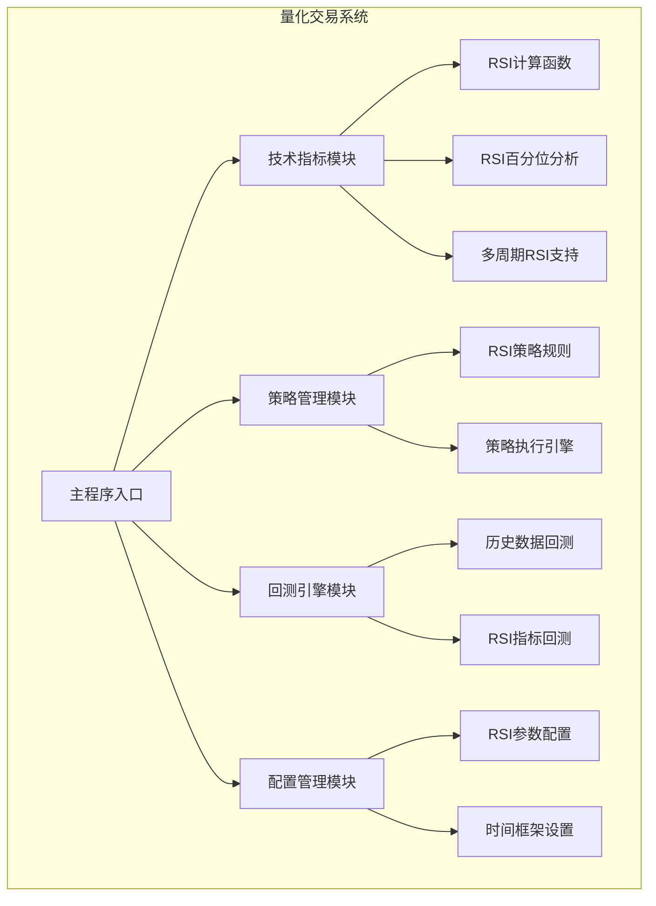
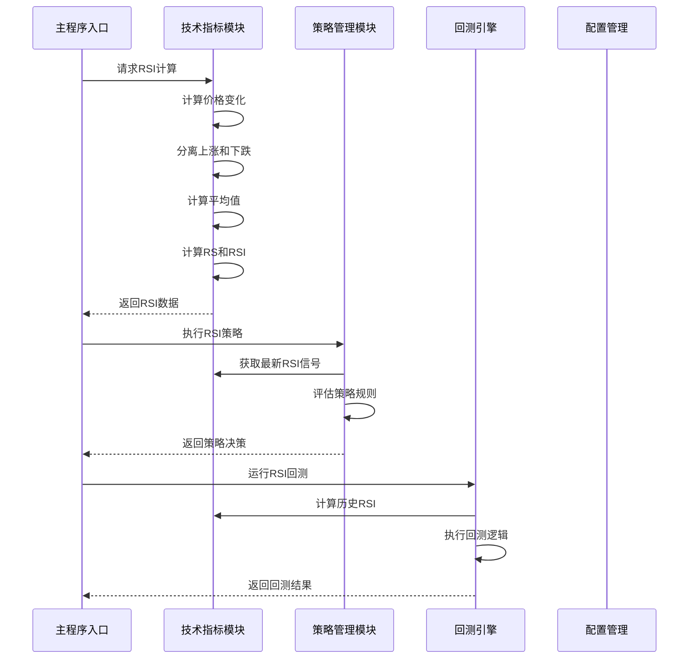
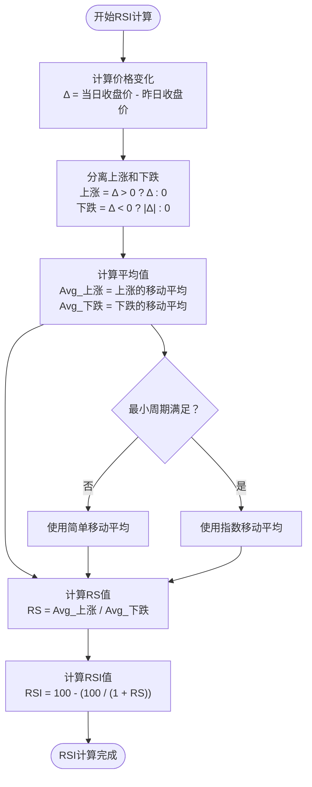
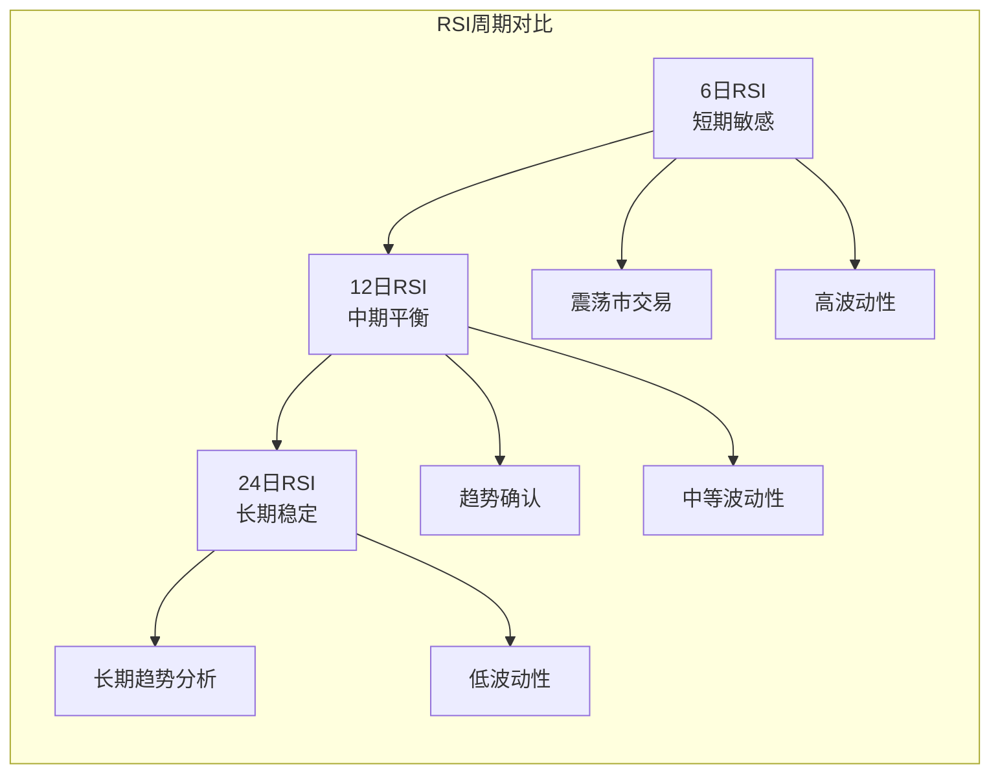
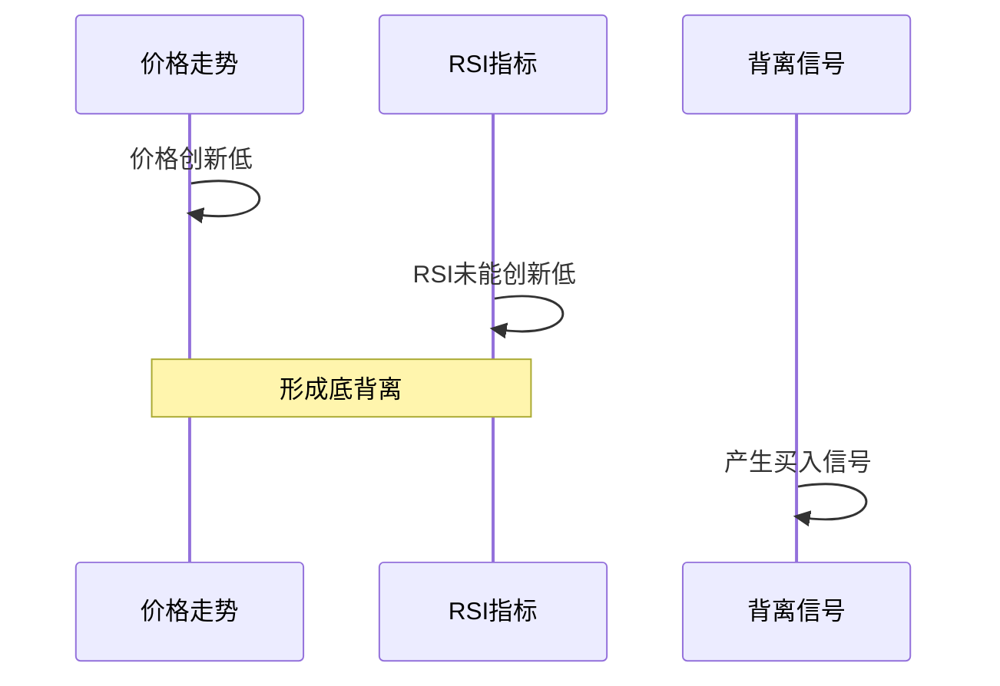
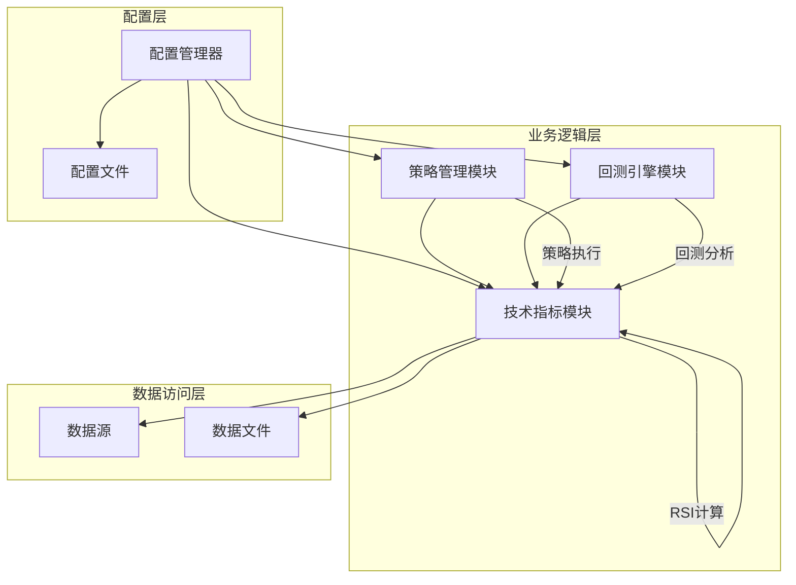

# RSI相对强弱指数

<cite>
**本文档引用的文件**
- [quant_system/indicators.py](file://quant_system/indicators.py)
- [quant_system/strategy.py](file://quant_system/strategy.py)
- [quant_system/backtest.py](file://quant_system/backtest.py)
- [config.yaml](file://config.yaml)
- [quant_system/config_manager.py](file://quant_system/config_manager.py)
- [main.py](file://main.py)
</cite>

## 目录
1. [简介](#简介)
2. [项目结构](#项目结构)
3. [核心组件](#核心组件)
4. [架构概览](#架构概览)
5. [详细组件分析](#详细组件分析)
6. [依赖关系分析](#依赖关系分析)
7. [性能考虑](#性能考虑)
8. [故障排除指南](#故障排除指南)
9. [结论](#结论)
10. [附录](#附录)

## 简介
本文件为RSI相对强弱指数指标创建详细的技术文档。RSI是衡量资产价格变动速度和变化幅度的技术分析工具，广泛应用于识别超买超卖条件、趋势强度和潜在反转信号。本文档将深入解释RSI的数学计算原理，包括价格变化计算、平均上涨和下跌的EMA平滑处理、RS和RSI公式的推导过程。详细说明不同周期参数（如6日、12日、24日）的适用场景和市场含义。解释RSI的超买超卖判断标准（80/20阈值）、背离信号识别和分位数分析方法。提供RSI在不同市场环境下的使用策略，包括趋势确认、反转信号和震荡市操作技巧。包含实际代码示例展示RSI的计算过程和参数调优方法。

## 项目结构
该量化交易系统采用模块化架构设计，RSI指标作为技术分析的核心组件集成在独立的指标计算模块中。系统主要包含以下关键模块：
- 技术指标计算模块：负责RSI、MACD、移动平均线等技术指标的计算
- 策略管理层：提供基于RSI的量化策略执行和管理
- 回测引擎：支持基于RSI指标的历史数据回测
- 配置管理：集中管理RSI参数配置和系统设置



**图表来源**
- [main.py:261-365](file://main.py#L261-L365)
- [quant_system/indicators.py:21-500](file://quant_system/indicators.py#L21-L500)
- [quant_system/strategy.py:150-556](file://quant_system/strategy.py#L150-L556)
- [quant_system/backtest.py:66-456](file://quant_system/backtest.py#L66-L456)

**章节来源**
- [main.py:261-365](file://main.py#L261-L365)
- [config.yaml:40-55](file://config.yaml#L40-L55)

## 核心组件
系统中的RSI相关核心组件包括：

### 技术指标计算器
- **TechnicalIndicators类**：提供完整的RSI计算功能，支持多周期RSI计算和百分位分析
- **RSI计算函数**：实现标准RSI公式，包含价格变化分离和平均值计算
- **RSI百分位分析**：提供历史百分位计算功能，帮助识别极端超买超卖情况

### 策略管理器
- **QuantStrategy类**：支持基于RSI的量化策略执行，包含内置的RSI策略规则
- **策略规则系统**：允许用户自定义基于RSI的交易规则和条件判断

### 回测引擎
- **BacktestEngine类**：提供基于RSI指标的历史回测功能
- **多周期RSI回测**：支持不同周期RSI的独立回测和比较分析

**章节来源**
- [quant_system/indicators.py:21-500](file://quant_system/indicators.py#L21-L500)
- [quant_system/strategy.py:150-556](file://quant_system/strategy.py#L150-L556)
- [quant_system/backtest.py:66-456](file://quant_system/backtest.py#L66-L456)

## 架构概览
RSI指标在整个系统中的架构设计体现了清晰的职责分离和模块化原则：



**图表来源**
- [quant_system/indicators.py:37-63](file://quant_system/indicators.py#L37-L63)
- [quant_system/strategy.py:229-299](file://quant_system/strategy.py#L229-L299)
- [quant_system/backtest.py:75-282](file://quant_system/backtest.py#L75-L282)

## 详细组件分析

### RSI数学计算原理
RSI的计算基于威尔斯·威廉姆斯(Wells Williams)开发的相对强弱指数理论，通过比较一定时期内价格上涨和下跌的平均幅度来衡量市场超买超卖状态。

#### 标准RSI计算流程
RSI计算包含以下关键步骤：

1. **价格变化计算**：计算相邻交易日收盘价的差值
2. **上涨和下跌分离**：将价格变化分离为上涨幅度和下跌幅度
3. **平均值计算**：计算上涨和下跌的移动平均值
4. **RS和RSI公式**：应用RSI标准公式得出最终指标值



**图表来源**
- [quant_system/indicators.py:48-61](file://quant_system/indicators.py#L48-L61)

#### RSI公式推导过程
RSI的标准公式来源于对价格变化幅度的标准化处理：

**RS计算**：
```
RS = Average Gain / Average Loss
```

**RSI计算**：
```
RSI = 100 - (100 / (1 + RS))
```

这种公式设计确保了RSI值域始终在0-100之间，便于直观判断市场状态。

**章节来源**
- [quant_system/indicators.py:37-63](file://quant_system/indicators.py#L37-L63)

### 不同周期参数的适用场景

#### 6日RSI（短期超买超卖）
- **适用场景**：高波动性市场、日内交易、快速反转识别
- **市场含义**：对短期价格变化极其敏感，适合捕捉短期超买超卖机会
- **典型应用**：震荡市中的短线交易、突破确认

#### 12日RSI（中期趋势确认）
- **适用场景**：中等波动性市场、趋势跟踪、中期反转识别
- **市场含义**：平衡短期敏感性和长期稳定性，适合大多数常规交易
- **典型应用**：趋势确认、支撑阻力判断

#### 24日RSI（长期趋势分析）
- **适用场景**：低波动性市场、长期投资、趋势强度评估
- **市场含义**：反映长期价格趋势，适合趋势投资者
- **典型应用**：趋势强度判断、长期投资时机选择



**图表来源**
- [config.yaml:42-45](file://config.yaml#L42-L45)
- [quant_system/indicators.py:218-228](file://quant_system/indicators.py#L218-L228)

**章节来源**
- [config.yaml:42-45](file://config.yaml#L42-L45)
- [quant_system/indicators.py:218-228](file://quant_system/indicators.py#L218-L228)

### RSI超买超卖判断标准

#### 传统阈值标准
系统采用经典的RSI超买超卖判断标准：

**超买区域**：RSI > 80
- 市场可能过度买入，存在回调压力
- 适合做空或减仓时机

**超卖区域**：RSI < 20  
- 市场可能过度卖出，存在反弹机会
- 适合做多或加仓时机

**市场解读函数**：
```python
def interpret_rsi(rsi):
    if rsi > 80:
        return "超买"
    elif rsi > 60:
        return "强势"
    elif rsi > 40:
        return "中性"
    elif rsi > 20:
        return "弱势"
    else:
        return "超卖"
```

#### 动态阈值调整
系统还提供了RSI百分位分析功能，通过历史数据计算RSI在特定时间段内的百分位排名，提供更动态的超买超卖判断：

**百分位计算**：
- 基于历史回看周期（默认252个交易日）
- 计算当前RSI值在历史分布中的位置
- 识别极端超买超卖情况

**章节来源**
- [quant_system/indicators.py:390-401](file://quant_system/indicators.py#L390-L401)
- [quant_system/indicators.py:65-80](file://quant_system/indicators.py#L65-L80)

### 背离信号识别

#### 顶背离识别
当价格创新高而RSI未能创新高时，形成顶背离信号：


**图表来源**
- [quant_system/strategy.py:377-394](file://quant_system/strategy.py#L377-L394)

#### 底背离识别
当价格创新低而RSI未能创新低时，形成底背离信号：



**图表来源**
- [quant_system/strategy.py:377-394](file://quant_system/strategy.py#L377-L394)

**章节来源**
- [quant_system/strategy.py:377-394](file://quant_system/strategy.py#L377-L394)

### 分位数分析方法

#### RSI百分位计算
系统提供RSI历史百分位分析功能，通过以下步骤实现：

1. **历史数据收集**：收集指定回看周期的历史RSI数据
2. **排序分析**：对历史RSI值进行排序和排名
3. **百分位计算**：计算当前RSI值在历史分布中的百分位位置
4. **信号生成**：基于百分位位置生成交易信号

**百分位计算公式**：
```
百分位 = (当前RSI值在历史中的排名 / 历史数据总数) × 100
```

#### 百分位阈值设定
- **极度超买**：百分位 > 90
- **超买**：百分位 > 80
- **超卖**：百分位 < 20  
- **极度超卖**：百分位 < 10

**章节来源**
- [quant_system/indicators.py:65-80](file://quant_system/indicators.py#L65-L80)

### RSI使用策略

#### 趋势确认策略
基于RSI的多周期组合策略：

**短期确认**：6日RSI确认短期趋势强度
**中期确认**：12日RSI确认中期趋势方向  
**长期确认**：24日RSI确认长期趋势趋势

#### 反转信号策略
利用RSI超买超卖和背离信号识别反转时机：

**超买反转**：RSI > 80且出现顶背离
**超卖反转**：RSI < 20且出现底背离

#### 震荡市操作技巧
在震荡市场中使用RSI的交易技巧：

**区间交易**：在20-80区间内进行高抛低吸
**突破交易**：RSI突破关键支撑阻力位时入场
**均值回归**：RSI偏离均值过多时进行反向操作

**章节来源**
- [quant_system/strategy.py:327-395](file://quant_system/strategy.py#L327-L395)

### 参数调优方法

#### 周期参数优化
系统支持灵活的RSI周期配置，可通过配置文件进行参数调优：

**配置选项**：
- `rsi.periods`: RSI计算周期列表（默认[6, 12, 24]）
- `rsi.timeframes`: 时间框架设置（day/week/month）
- `rsi.history_lookback`: 历史回看天数（默认252）

#### 回测参数调优
通过回测引擎进行参数优化：

**回测流程**：
1. 设定参数范围
2. 运行历史回测
3. 评估回测指标
4. 选择最优参数组合

**章节来源**
- [config.yaml:42-45](file://config.yaml#L42-L45)
- [quant_system/backtest.py:75-282](file://quant_system/backtest.py#L75-L282)

## 依赖关系分析

### 模块间依赖关系
RSI相关功能的模块依赖关系体现了清晰的层次结构：



**图表来源**
- [quant_system/config_manager.py:133-147](file://quant_system/config_manager.py#L133-L147)
- [quant_system/indicators.py:21-500](file://quant_system/indicators.py#L21-L500)
- [quant_system/strategy.py:150-556](file://quant_system/strategy.py#L150-L556)
- [quant_system/backtest.py:66-456](file://quant_system/backtest.py#L66-L456)

### 外部依赖分析
系统对外部依赖主要包括：

**核心依赖库**：
- pandas/numpy：数据处理和数值计算
- yaml：配置文件解析
- logging：日志记录

**外部数据源**：
- Tushare API：股票历史数据获取
- 实时行情接口：实时数据更新

**章节来源**
- [quant_system/config_manager.py:101-119](file://quant_system/config_manager.py#L101-L119)

## 性能考虑

### 计算效率优化
RSI计算涉及大量时间序列操作，系统采用了多项性能优化措施：

**向量化计算**：使用pandas的向量化操作替代循环，提高计算效率
**内存管理**：合理控制数据缓存大小，避免内存溢出
**批处理优化**：支持批量股票RSI计算，减少重复计算

### 存储优化
- 指标数据按股票代码和时间框架分类存储
- 支持增量更新，避免全量重新计算
- 数据压缩存储，减少磁盘占用

### 并行处理
系统支持多股票并行处理，通过配置不同的时间框架（日线、周线、月线）来分散计算负载。

## 故障排除指南

### 常见问题及解决方案

#### RSI计算异常
**问题**：RSI值异常或NaN
**原因**：数据质量问题或计算参数错误
**解决**：检查输入数据质量，验证计算参数设置

#### 性能问题
**问题**：RSI计算速度慢
**原因**：数据量过大或算法效率低
**解决**：优化数据预处理，使用更高效的计算方法

#### 配置错误
**问题**：RSI参数不生效
**原因**：配置文件格式错误或参数冲突
**解决**：检查配置文件语法，验证参数范围

**章节来源**
- [quant_system/indicators.py:204-210](file://quant_system/indicators.py#L204-L210)
- [quant_system/backtest.py:96-107](file://quant_system/backtest.py#L96-L107)

## 结论
本RSI相对强弱指数技术文档全面阐述了RSI指标的数学原理、计算方法和实际应用。通过系统化的架构设计和模块化实现，量化交易系统为RSI指标提供了完整的技术支持，包括精确的计算实现、灵活的参数配置、完善的策略执行和全面的回测分析。

系统的主要优势包括：
- **准确性**：严格按照RSI标准公式实现，确保计算精度
- **灵活性**：支持多周期RSI计算和参数自定义
- **完整性**：提供从数据获取到策略执行的全流程支持
- **可扩展性**：模块化设计便于功能扩展和维护

通过合理运用RSI指标，投资者可以更好地识别市场时机，制定有效的交易策略，在不同市场环境下获得稳定的收益。

## 附录

### RSI计算代码示例路径
- [RSI计算函数实现:37-63](file://quant_system/indicators.py#L37-L63)
- [RSI百分位分析:65-80](file://quant_system/indicators.py#L65-L80)
- [多周期RSI计算:218-228](file://quant_system/indicators.py#L218-L228)
- [RSI策略规则:327-341](file://quant_system/strategy.py#L327-L341)

### 配置参数参考
- [RSI配置参数:42-45](file://config.yaml#L42-L45)
- [回测配置参数:64-67](file://config.yaml#L64-L67)
- [技术指标配置:41-55](file://config.yaml#L41-L55)

### 关键算法实现
- [RSI数学公式推导:48-61](file://quant_system/indicators.py#L48-L61)
- [超买超卖判断逻辑:390-401](file://quant_system/indicators.py#L390-L401)
- [背离信号识别:377-394](file://quant_system/strategy.py#L377-L394)