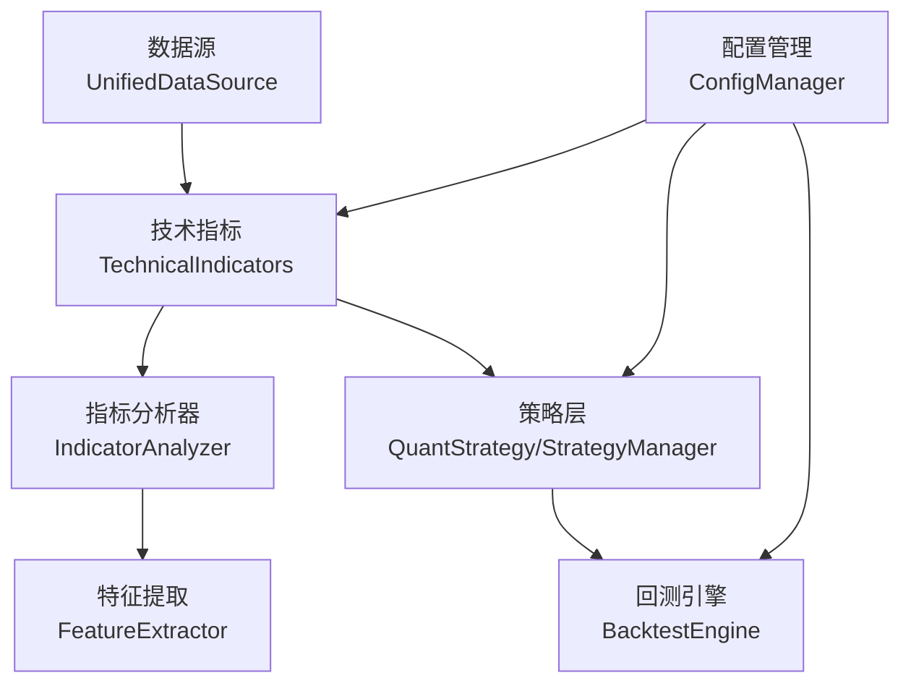
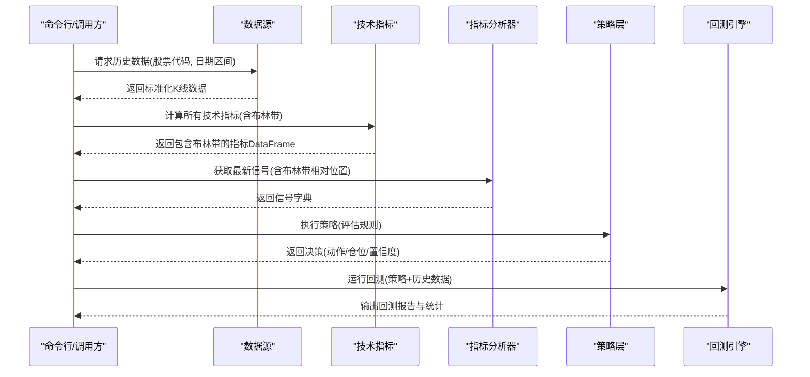
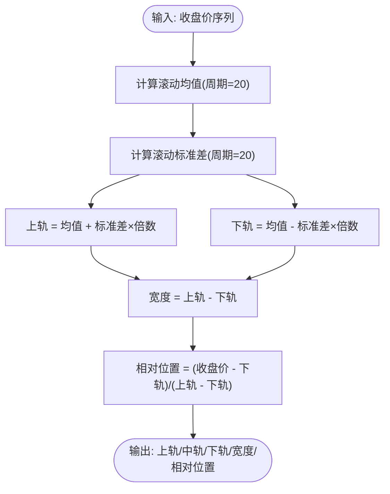
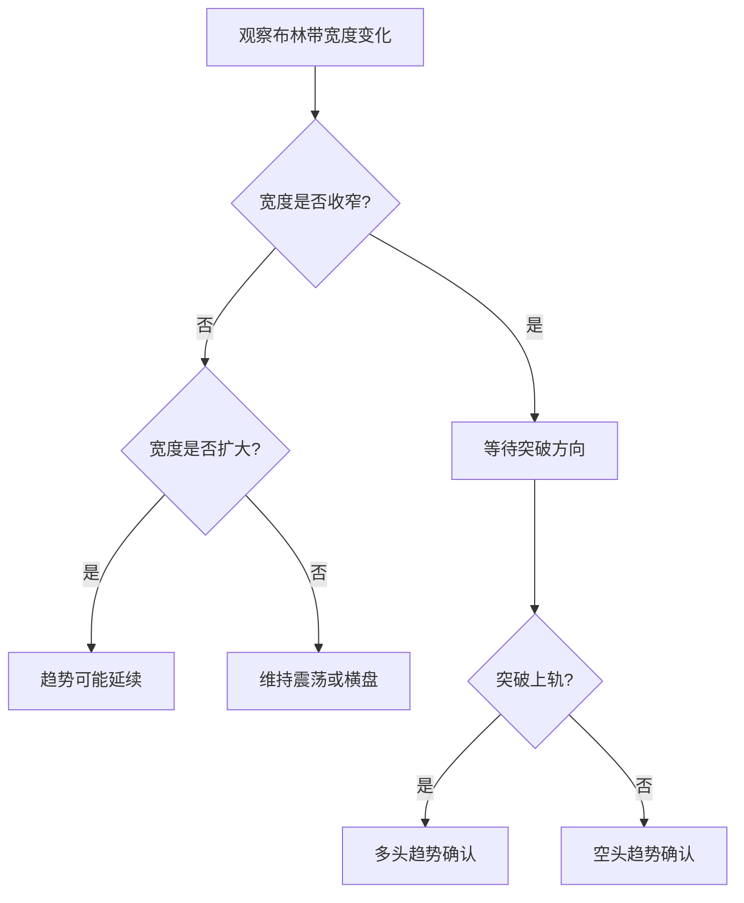
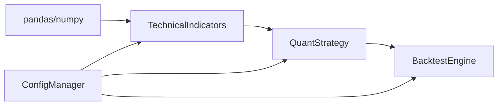

# 布林带

<cite>
**本文引用的文件**
- [indicators.py](file://quant_system/indicators.py)
- [strategy.py](file://quant_system/strategy.py)
- [backtest.py](file://quant_system/backtest.py)
- [config.yaml](file://config.yaml)
- [config_manager.py](file://quant_system/config_manager.py)
- [data_source.py](file://quant_system/data_source.py)
- [feature_extractor.py](file://quant_system/feature_extractor.py)
- [main.py](file://main.py)
- [config\stocks.yaml](file://config/stocks.yaml)
</cite>

## 目录
1. [引言](#引言)
2. [项目结构](#项目结构)
3. [核心组件](#核心组件)
4. [架构总览](#架构总览)
5. [详细组件分析](#详细组件分析)
6. [依赖分析](#依赖分析)
7. [性能考虑](#性能考虑)
8. [故障排查指南](#故障排查指南)
9. [结论](#结论)
10. [附录](#附录)

## 引言
本文件围绕布林带技术指标在量化系统中的实现与应用展开，重点覆盖：
- 布林带三轨的数学定义与参数影响
- 布林带宽度与标准差倍数的作用机制
- 布林带典型形态（收口、扩张、突破）的市场含义与交易机会
- 基于布林带的交易策略（通道突破、轨道支撑阻力、价格位置分析）
- 布林带与RSI、MACD、KDJ等指标的协同使用
- 参数优化建议与回测实践
- 完整的代码实现路径与使用示例

## 项目结构
该量化系统采用模块化设计，技术指标计算集中在指标模块，策略层负责规则解析与执行，回测引擎提供历史数据驱动的策略评估能力。布林带作为核心指标之一，在指标计算、策略信号、特征提取与回测中均有体现。

图表来源
- [data_source.py:300-336](file://quant_system/data_source.py#L300-L336)
- [indicators.py:21-328](file://quant_system/indicators.py#L21-L328)
- [strategy.py:150-316](file://quant_system/strategy.py#L150-L316)
- [backtest.py:66-282](file://quant_system/backtest.py#L66-L282)
- [config_manager.py:121-147](file://quant_system/config_manager.py#L121-L147)

章节来源
- [main.py:14-25](file://main.py#L14-L25)
- [config.yaml:40-55](file://config.yaml#L40-L55)

## 核心组件
- 技术指标计算器：提供布林带计算、移动平均、MACD、RSI、KDJ等指标，并将结果写入DataFrame供策略与回测使用。
- 指标分析器：读取或计算最新指标，生成信号字典，包含布林带相对位置等。
- 策略层：支持自然语言到量化规则的转换，执行策略并给出买卖建议与置信度。
- 回测引擎：基于历史数据驱动策略执行，计算收益、风险与交易统计指标。
- 配置管理：集中管理技术指标周期、回测参数等配置。

章节来源
- [indicators.py:21-328](file://quant_system/indicators.py#L21-L328)
- [strategy.py:150-316](file://quant_system/strategy.py#L150-L316)
- [backtest.py:66-282](file://quant_system/backtest.py#L66-L282)
- [config_manager.py:121-147](file://quant_system/config_manager.py#L121-L147)

## 架构总览
布林带在系统中的工作流如下：数据源获取历史K线 → 技术指标模块计算布林带与其它指标 → 指标分析器生成信号 → 策略层根据规则评估并决策 → 回测引擎执行策略并输出报告。

图表来源
- [data_source.py:307-335](file://quant_system/data_source.py#L307-L335)
- [indicators.py:188-273](file://quant_system/indicators.py#L188-L273)
- [strategy.py:229-299](file://quant_system/strategy.py#L229-L299)
- [backtest.py:75-136](file://quant_system/backtest.py#L75-L136)

## 详细组件分析

### 布林带三轨与宽度计算
- 中轨（20日均线）：对收盘价进行滚动均值计算。
- 上轨（中轨 + 2倍标准差）：中轨加上标准差乘以标准差倍数。
- 下轨（中轨 - 2倍标准差）：中轨减去标准差乘以标准差倍数。
- 布林带宽度：上轨与下轨之差；标准差倍数越大，通道越宽，反之越窄。

图表来源
- [indicators.py:124-143](file://quant_system/indicators.py#L124-L143)
- [indicators.py:249-254](file://quant_system/indicators.py#L249-L254)

章节来源
- [indicators.py:124-143](file://quant_system/indicators.py#L124-L143)
- [indicators.py:249-254](file://quant_system/indicators.py#L249-L254)

### 布林带形态与交易含义
- 收口：标准差缩小，通道变窄，通常预示波动降低，可能孕育突破。
- 扩张：标准差扩大，通道变宽，通常伴随高波动，趋势延续概率较高。
- 突破：价格突破上轨或下轨，结合成交量与趋势确认有效性。

[此图为概念流程，无需图表来源]

### 布林带交易策略
- 通道突破策略：价格突破上轨做多，跌破下轨做空；止损可设在另一轨附近。
- 轨道支撑阻力：价格回踩上轨遇阻做空，反弹至下轨遇阻做空。
- 价格位置分析：相对位置接近极端值（>0.8或<0.2）时，倾向反向修正。

章节来源
- [strategy.py:185-228](file://quant_system/strategy.py#L185-L228)
- [backtest.py:139-193](file://quant_system/backtest.py#L139-L193)

### 布林带与其它指标的结合
- 布林带 + RSI：超买超卖配合通道位置，提高买卖信号质量。
- 布林带 + MACD：趋势方向与通道突破共同确认。
- 布林带 + KDJ：震荡与通道位置结合，识别背离与反转。

章节来源
- [indicators.py:218-273](file://quant_system/indicators.py#L218-L273)
- [feature_extractor.py:343-384](file://quant_system/feature_extractor.py#L343-L384)

### 参数优化建议
- 周期：20日均线与20日标准差较为常见；可根据品种波动性调整至14/25。
- 标准差倍数：2.0为经典值；震荡市可适当增大（如2.2），趋势明显时可减小（如1.8）。
- 结合成交量与趋势过滤，避免假突破。

章节来源
- [config.yaml:40-55](file://config.yaml#L40-L55)
- [config_manager.py:133-147](file://quant_system/config_manager.py#L133-L147)

### 实际应用与回测
- 使用命令行更新指标与运行回测，查看布林带相关指标与交易统计。
- 回测引擎会根据策略规则与布林带相对位置等信号执行交易并计算收益与风险指标。

章节来源
- [main.py:61-72](file://main.py#L61-L72)
- [main.py:139-174](file://main.py#L139-L174)
- [backtest.py:75-136](file://quant_system/backtest.py#L75-L136)

## 依赖分析
- 指标计算依赖Pandas/Numpy进行滚动均值与标准差运算。
- 策略层通过安全求值环境评估规则字符串，依赖指标字典。
- 回测引擎依赖历史数据与指标DataFrame，按日推进模拟交易。

图表来源
- [requirements.txt:4-5](file://requirements.txt#L4-L5)
- [indicators.py:11-12](file://quant_system/indicators.py#L11-L12)
- [strategy.py:16-17](file://quant_system/strategy.py#L16-L17)
- [backtest.py:14-15](file://quant_system/backtest.py#L14-L15)

## 性能考虑
- 滚动窗口计算的时间复杂度为O(n·window)，建议在大批量回测时控制窗口大小与数据长度。
- 使用整手交易与滑点、手续费等成本因子，提升回测真实度。
- 对于高频数据，可考虑降采样或缓存中间结果以减少重复计算。

[本节为通用建议，无需章节来源]

## 故障排查指南
- 指标为空：检查历史数据是否成功获取与清洗，确认列名标准化。
- 计算异常：核对周期与最小观测期设置，确保滚动窗口参数合理。
- 策略未触发：检查规则字符串中的指标名称与求值环境，确认safe_dict映射完整。
- 回测无交易：检查滑点与手续费是否导致资金不足，或仓位比例是否被截断为0。

章节来源
- [data_source.py:357-378](file://quant_system/data_source.py#L357-L378)
- [indicators.py:204-217](file://quant_system/indicators.py#L204-L217)
- [strategy.py:196-227](file://quant_system/strategy.py#L196-L227)
- [backtest.py:140-153](file://quant_system/backtest.py#L140-L153)

## 结论
布林带是衡量价格波动与趋势延续性的有效工具。在本系统中，其计算、信号生成、策略评估与回测均得到一体化支持。通过合理设置周期与标准差倍数，并结合RSI、MACD、KDJ等指标，可显著提升交易信号的质量与稳定性。建议在实盘前充分进行参数优化与回测验证。

[本节为总结，无需章节来源]

## 附录

### 布林带计算与使用路径
- 计算布林带与相对位置：[indicators.py:124-143](file://quant_system/indicators.py#L124-L143), [indicators.py:249-254](file://quant_system/indicators.py#L249-L254)
- 在指标DataFrame中集成布林带：[indicators.py:249-254](file://quant_system/indicators.py#L249-L254)
- 获取最新信号（含布林带相对位置）：[indicators.py:376-378](file://quant_system/indicators.py#L376-L378)
- 策略评估中使用布林带相对位置：[strategy.py:185-228](file://quant_system/strategy.py#L185-L228)
- 回测中使用布林带信号：[backtest.py:130-133](file://quant_system/backtest.py#L130-L133), [backtest.py:139-193](file://quant_system/backtest.py#L139-L193)

### 配置参考
- 技术指标周期与参数：[config.yaml:40-55](file://config.yaml#L40-L55)
- 回测参数（初始资金、手续费、滑点）：[config.yaml:63-67](file://config.yaml#L63-L67)
- 配置读取封装：[config_manager.py:133-147](file://quant_system/config_manager.py#L133-L147)

### 示例命令
- 更新指标：[main.py:61-72](file://main.py#L61-L72)
- 运行策略：[main.py:100-121](file://main.py#L100-L121)
- 回测策略：[main.py:139-174](file://main.py#L139-L174)
- 技术指标报告：[main.py:255-258](file://main.py#L255-L258)