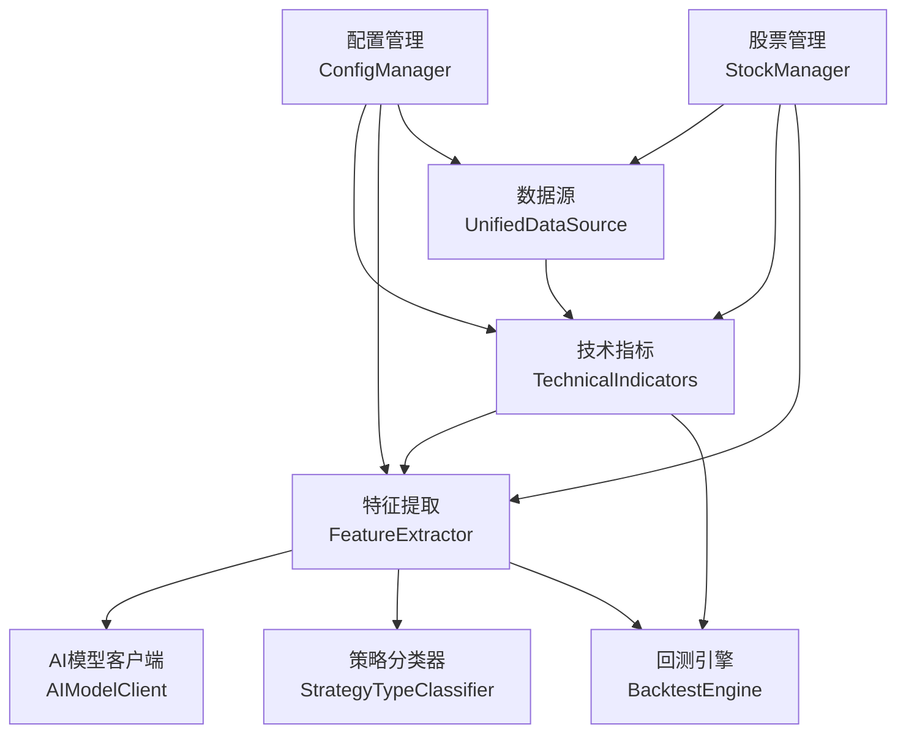
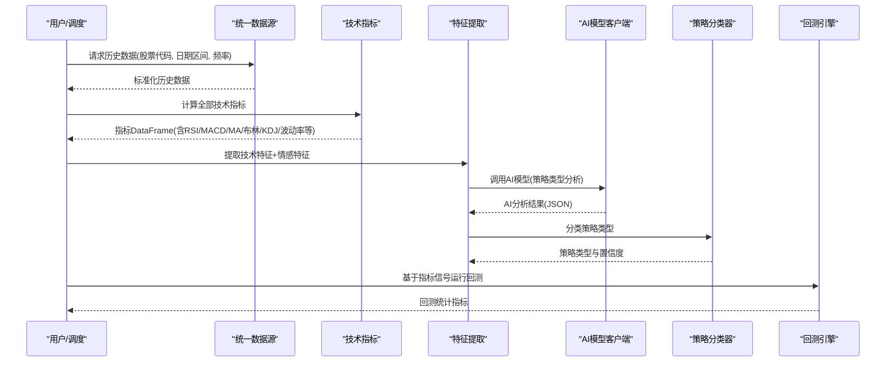
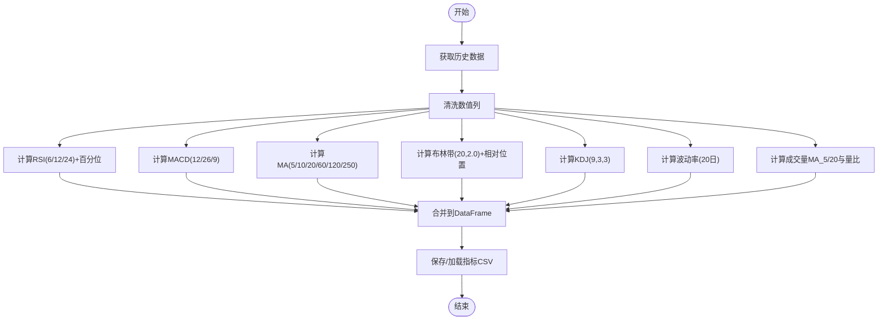
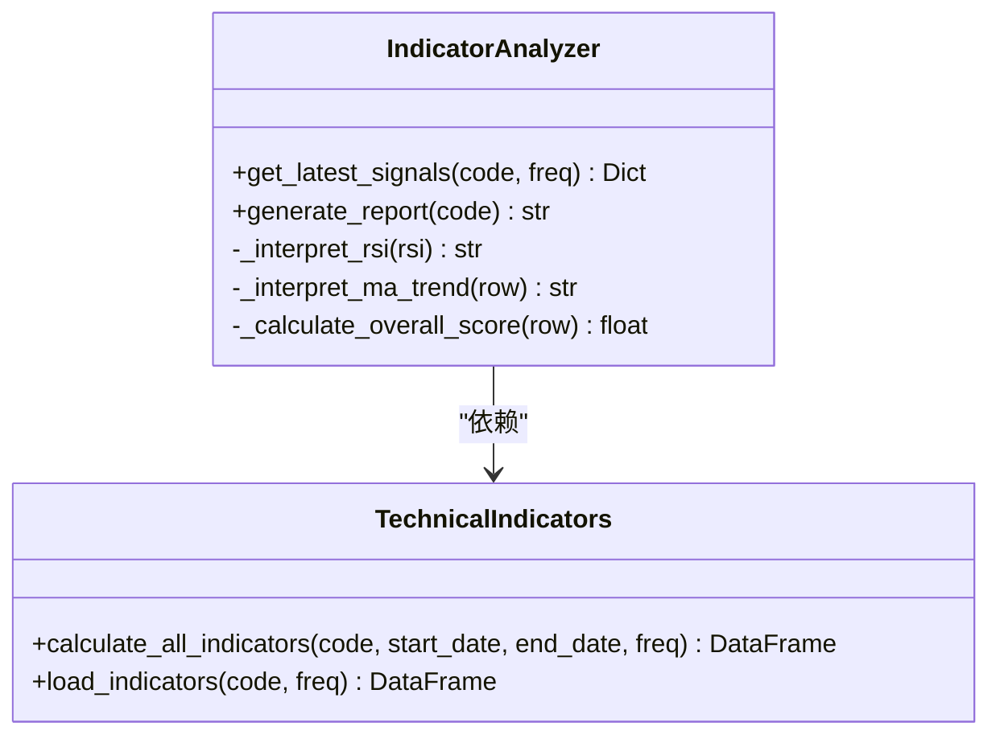
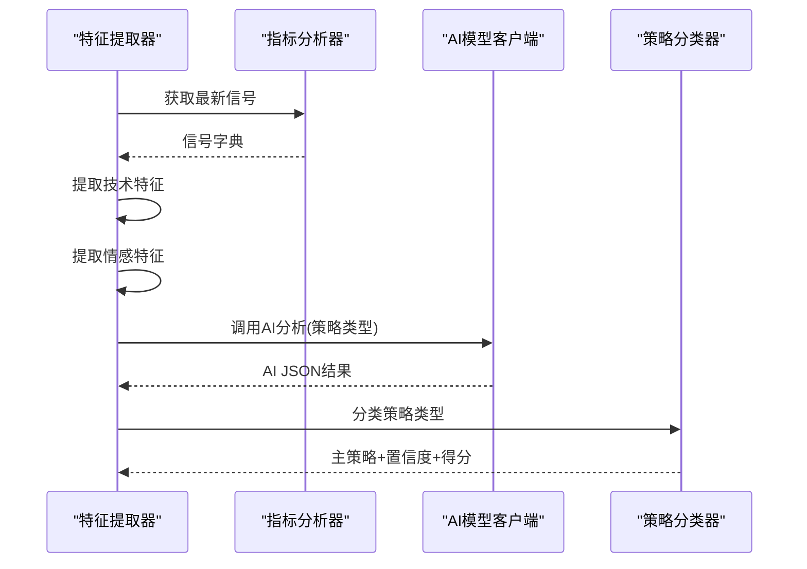
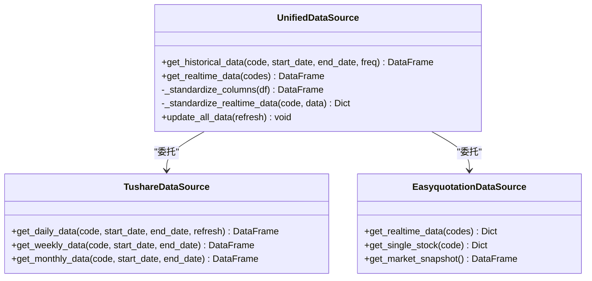
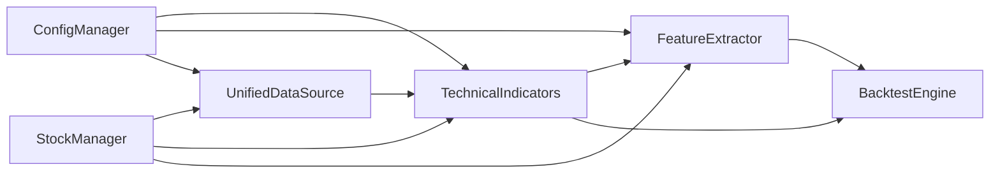

# 技术分析

<cite>
**本文引用的文件**
- [indicators.py](file://quant_system/indicators.py)
- [feature_extractor.py](file://quant_system/feature_extractor.py)
- [data_source.py](file://quant_system/data_source.py)
- [config_manager.py](file://quant_system/config_manager.py)
- [config.yaml](file://config.yaml)
- [config/stocks.yaml](file://config/stocks.yaml)
- [stock_manager.py](file://quant_system/stock_manager.py)
- [news_collector.py](file://quant_system/news_collector.py)
- [backtest.py](file://quant_system/backtest.py)
</cite>

## 目录
1. [简介](#简介)
2. [项目结构](#项目结构)
3. [核心组件](#核心组件)
4. [架构总览](#架构总览)
5. [详细组件分析](#详细组件分析)
6. [依赖关系分析](#依赖关系分析)
7. [性能考量](#性能考量)
8. [故障排查指南](#故障排查指南)
9. [结论](#结论)
10. [附录](#附录)

## 简介
本文件面向vibequation量化交易系统的技术分析模块，系统性阐述各类技术指标的计算原理、参数设置与使用场景，并结合特征提取与AI辅助分析，给出信号过滤、参数调优与多指标组合策略建议。内容覆盖RSI、MACD、移动平均线、布林带、KDJ等核心指标，以及从指标中挖掘有效投资信号的方法论与实战应用。

## 项目结构
技术分析模块位于quant_system子包内，围绕“数据源—指标计算—特征提取—策略分类—回测验证”的链路组织：
- 数据源层：统一历史与实时数据接口，支持Tushare与Easyquotation
- 指标层：集中计算RSI、MACD、MA、布林带、KDJ、波动率等
- 特征层：提取技术特征，融合新闻情感特征，借助AI进行策略类型分类
- 回测层：基于指标信号执行回测，评估策略有效性

图表来源
- [data_source.py:300-423](file://quant_system/data_source.py#L300-L423)
- [indicators.py:21-328](file://quant_system/indicators.py#L21-L328)
- [feature_extractor.py:99-405](file://quant_system/feature_extractor.py#L99-L405)
- [config_manager.py:12-178](file://quant_system/config_manager.py#L12-L178)
- [stock_manager.py:62-278](file://quant_system/stock_manager.py#L62-L278)

章节来源
- [data_source.py:300-423](file://quant_system/data_source.py#L300-L423)
- [indicators.py:21-328](file://quant_system/indicators.py#L21-L328)
- [feature_extractor.py:99-405](file://quant_system/feature_extractor.py#L99-L405)
- [config_manager.py:12-178](file://quant_system/config_manager.py#L12-L178)
- [stock_manager.py:62-278](file://quant_system/stock_manager.py#L62-L278)

## 核心组件
- 技术指标计算器：集中实现RSI、MACD、移动平均线、布林带、KDJ、波动率等指标的计算与批量更新
- 指标分析器：从已计算的指标中提取最新信号，生成综合评分与趋势解读
- 特征提取器：将技术信号映射为特征向量，融合新闻情感特征，调用AI进行策略类型分析
- 统一数据源：封装Tushare与Easyquotation，提供历史与实时数据的标准化接口
- 配置管理：集中读取与派发技术指标、AI、回测、风控等配置
- 股票管理：维护股票/板块/指数清单及其多格式代码映射

章节来源
- [indicators.py:21-328](file://quant_system/indicators.py#L21-L328)
- [feature_extractor.py:99-405](file://quant_system/feature_extractor.py#L99-L405)
- [data_source.py:300-423](file://quant_system/data_source.py#L300-L423)
- [config_manager.py:12-178](file://quant_system/config_manager.py#L12-L178)
- [stock_manager.py:62-278](file://quant_system/stock_manager.py#L62-L278)

## 架构总览
技术分析模块采用“指标计算—特征提取—策略分类—回测验证”的闭环设计。数据自统一数据源进入，经指标计算得到多周期、多时间框架的指标矩阵；特征提取器将指标转化为可解释的特征向量，并结合新闻情感特征；AI模型对特征进行策略类型分类；最终由回测引擎验证策略在历史数据上的表现。

图表来源
- [data_source.py:307-336](file://quant_system/data_source.py#L307-L336)
- [indicators.py:188-273](file://quant_system/indicators.py#L188-L273)
- [feature_extractor.py:213-284](file://quant_system/feature_extractor.py#L213-L284)
- [backtest.py:75-200](file://quant_system/backtest.py#L75-L200)

## 详细组件分析

### 技术指标计算器（TechnicalIndicators）
- RSI（相对强弱指数）
  - 计算步骤：价格变化→分离上涨/下跌→滚动均值→RS与RSI计算
  - 参数：周期（默认6/12/24）、历史回看（用于百分位）
  - 输出：rsi_6、rsi_12、rsi_24及各自百分位
- MACD（指数平滑异同移动平均线）
  - 计算步骤：快线EMA、慢线EMA、MACD=快-慢、信号线EMA、柱状=MACD-信号线
  - 参数：快线、慢线、信号线（默认12/26/9）
  - 输出：macd、macd_signal、macd_histogram
- 移动平均线（MA）
  - 计算步骤：不同周期滚动均值
  - 参数：周期列表（默认5/10/20/60/120/250）
  - 输出：ma_5、ma_10、…、ma_250
- 布林带（Bollinger Bands）
  - 计算步骤：中轨=MA，上下轨=中轨±标准差×倍数
  - 参数：周期（默认20）、标准差倍数（默认2.0）
  - 输出：boll_upper、boll_middle、boll_lower、boll_position（相对位置）
- KDJ（随机指标）
  - 计算步骤：最低/最高滚动→RSV→K平滑→D平滑→J=3K-2D
  - 参数：n（RSV周期，默认9）、m1（K平滑，默认3）、m2（D平滑，默认3）
  - 输出：kdj_k、kdj_d、kdj_j
- 波动率与成交量指标
  - 波动率：日收益率的标准差×√252
  - 成交量：成交量MA_5、MA_20、量比=成交量/MA_20
- 综合流程
  - 从统一数据源获取历史数据→清洗数值列→批量计算各指标→保存/加载CSV

图表来源
- [indicators.py:188-273](file://quant_system/indicators.py#L188-L273)
- [indicators.py:37-171](file://quant_system/indicators.py#L37-L171)

章节来源
- [indicators.py:21-328](file://quant_system/indicators.py#L21-L328)
- [config.yaml:40-55](file://config.yaml#L40-L55)

### 指标分析器（IndicatorAnalyzer）
- 最新信号提取：从已保存或重新计算的指标中取最新行
- RSI解读：按阈值划分“超买/强势/中性/弱势/超卖”
- 均线趋势解读：多头/空头排列、上升/下降趋势
- 综合评分：加权融合RSI、MACD柱状、MA相对关系、KDJ-J，范围归一至[-100,100]
- 报告生成：汇总RSI/MACD/均线/KDJ/布林带/综合评分与建议

图表来源
- [indicators.py:330-495](file://quant_system/indicators.py#L330-L495)

章节来源
- [indicators.py:330-495](file://quant_system/indicators.py#L330-L495)

### 特征提取与策略分类
- 技术特征：趋势强度、趋势方向、RSI水平、MACD动量、均线排列、波动代理、布林带位置
- 情感特征：平均情感、情感波动、情感趋势、新闻数量、正面比例
- 市场特征：示例中包含市场贝塔与行业排名（可扩展）
- AI分析：构建提示词，调用ModelScope或Mock，输出策略类型、置信度、推荐指标、风险等级等
- 策略分类器：基于特征打分，选择最佳策略类型（趋势跟踪/动量/波段/均值回归）

图表来源
- [feature_extractor.py:115-212](file://quant_system/feature_extractor.py#L115-L212)
- [feature_extractor.py:213-284](file://quant_system/feature_extractor.py#L213-L284)
- [feature_extractor.py:323-405](file://quant_system/feature_extractor.py#L323-L405)

章节来源
- [feature_extractor.py:99-405](file://quant_system/feature_extractor.py#L99-L405)

### 统一数据源（UnifiedDataSource）
- 历史数据：封装Tushare日线/周线/月线，标准化列名与缺失列填充
- 实时数据：封装Easyquotation，标准化实时行情
- 更新策略：按股票类型分别拉取，加入速率限制与增量更新

图表来源
- [data_source.py:300-423](file://quant_system/data_source.py#L300-L423)

章节来源
- [data_source.py:300-423](file://quant_system/data_source.py#L300-L423)

### 配置与股票管理
- 配置管理：集中读取技术指标、AI、回测、风控等配置，提供默认值与派发
- 股票管理：维护股票/板块/指数清单，提供多格式代码映射（Tushare/Easyquotation）

章节来源
- [config_manager.py:12-178](file://quant_system/config_manager.py#L12-L178)
- [config.yaml:1-88](file://config.yaml#L1-L88)
- [config/stocks.yaml:1-71](file://config/stocks.yaml#L1-L71)
- [stock_manager.py:62-278](file://quant_system/stock_manager.py#L62-L278)

## 依赖关系分析
- 指标计算依赖统一数据源与配置管理
- 特征提取依赖指标分析器、新闻情感分析与配置管理
- 回测引擎依赖统一数据源、指标计算与策略管理
- 股票管理贯穿数据采集与指标计算，提供代码映射

图表来源
- [config_manager.py:12-178](file://quant_system/config_manager.py#L12-L178)
- [data_source.py:300-423](file://quant_system/data_source.py#L300-L423)
- [indicators.py:21-328](file://quant_system/indicators.py#L21-L328)
- [feature_extractor.py:99-405](file://quant_system/feature_extractor.py#L99-L405)
- [backtest.py:66-200](file://quant_system/backtest.py#L66-L200)
- [stock_manager.py:62-278](file://quant_system/stock_manager.py#L62-L278)

章节来源
- [config_manager.py:12-178](file://quant_system/config_manager.py#L12-L178)
- [data_source.py:300-423](file://quant_system/data_source.py#L300-L423)
- [indicators.py:21-328](file://quant_system/indicators.py#L21-L328)
- [feature_extractor.py:99-405](file://quant_system/feature_extractor.py#L99-L405)
- [backtest.py:66-200](file://quant_system/backtest.py#L66-L200)
- [stock_manager.py:62-278](file://quant_system/stock_manager.py#L62-L278)

## 性能考量
- 指标计算
  - 使用滚动窗口与指数加权（EMA）时，注意min_periods与NaN处理
  - 对长序列计算可考虑分块或缓存中间结果
- 数据访问
  - Tushare速率限制：内置最小请求间隔，避免频繁请求
  - 增量更新：本地缓存+去重合并，减少重复下载
- 特征提取与AI
  - AI调用失败时提供Mock回退，保证系统可用性
  - JSON解析失败时保留原始响应，便于调试
- 存储
  - 指标与特征按股票+频率/时间粒度命名，便于增量更新与检索

[本节为通用指导，无需特定文件来源]

## 故障排查指南
- 数据获取失败
  - 检查Tushare Token配置与网络连通性
  - 查看统一数据源的日志与异常堆栈
- 指标为空
  - 确认历史数据是否成功下载与标准化
  - 检查数值列转换与缺失值处理
- AI分析异常
  - 检查ModelScope Token与网络
  - 观察Mock回退是否生效
- 回测报错
  - 确认指标计算完成且保存
  - 检查策略决策与资金/手续费/滑点参数

章节来源
- [data_source.py:56-62](file://quant_system/data_source.py#L56-L62)
- [feature_extractor.py:83-96](file://quant_system/feature_extractor.py#L83-L96)
- [backtest.py:99-107](file://quant_system/backtest.py#L99-L107)

## 结论
vibequation的技术分析模块通过统一数据源、标准化指标计算与特征提取，结合AI策略分类与回测验证，形成一套可扩展、可配置、可落地的量化分析流水线。建议在实际应用中：
- 根据市场风格与周期特性调整RSI/MACD/MA等参数
- 引入多指标组合与信号过滤（如布林带位置、成交量确认）
- 结合新闻情感与宏观事件进行动态权重调整
- 在回测中引入风控约束与交易成本，提升策略稳健性

[本节为总结性内容，无需特定文件来源]

## 附录

### 技术指标参数与使用建议
- RSI
  - 周期：短期（6）用于捕捉超买/超卖，中长期（12/24）用于趋势确认
  - 百分位：衡量极端位置，辅助择时
- MACD
  - 快慢线：12/26常用于日频；9为信号线
  - 柱状图：动量变化，零轴穿越与背离信号
- 移动平均线
  - 多周期组合：5/20/60/250构成短期/中期/长期趋势
  - 多头/空头排列：明确趋势方向
- 布林带
  - 相对位置：接近边界时考虑反转
  - 标准差倍数：2.0为常用，可根据波动率调整
- KDJ
  - 参数：9/3/3为经典组合；可随周期调整
  - J值：与K/D交叉配合，关注背离

章节来源
- [config.yaml:40-55](file://config.yaml#L40-L55)
- [indicators.py:37-171](file://quant_system/indicators.py#L37-L171)

### 多指标组合与信号过滤
- 组合思路
  - RSI+MACD：RSI识别超买/超卖，MACD确认动量
  - MA+布林带：均线确认趋势，布林带提供突破信号
  - KDJ+成交量：KDJ背离+放量确认
- 过滤方法
  - 布林带位置过滤：仅在中轨附近开仓
  - 成交量过滤：量比>1或成交量放大
  - 时间窗口过滤：仅在周线/月线趋势一致时入场

章节来源
- [indicators.py:243-273](file://quant_system/indicators.py#L243-L273)
- [feature_extractor.py:115-141](file://quant_system/feature_extractor.py#L115-L141)

### 实战应用案例（方法论）
- 案例1：趋势跟踪
  - 适用：上升趋势中买入，下降趋势中卖出
  - 指标：MA、MACD、ADX（可扩展）
  - 信号：均线多头排列+MACD柱状>0
- 案例2：动量策略
  - 适用：强势股持续上涨
  - 指标：RSI、ROC、MOM
  - 信号：RSI在中性偏强区域+MACD金叉
- 案例3：波段操作
  - 适用：震荡区间高抛低吸
  - 指标：KDJ、布林带、RSI
  - 信号：KDJ死叉/金叉+布林带边界+RSI背离
- 案例4：均值回归
  - 适用：价格偏离均值后的反向
  - 指标：布林带、RSI、Z-Score
  - 信号：价格触及边界+RSI超买/超卖

章节来源
- [feature_extractor.py:323-405](file://quant_system/feature_extractor.py#L323-L405)