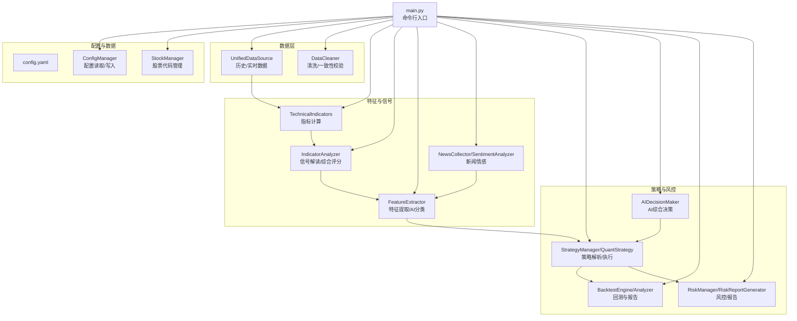
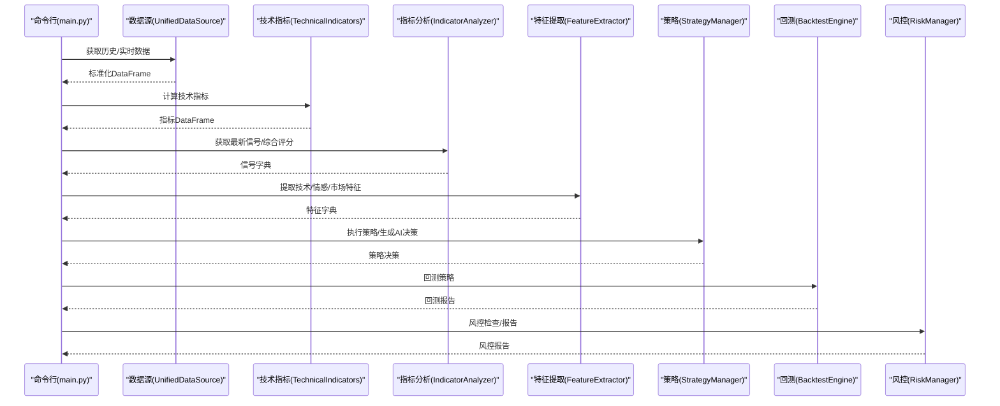
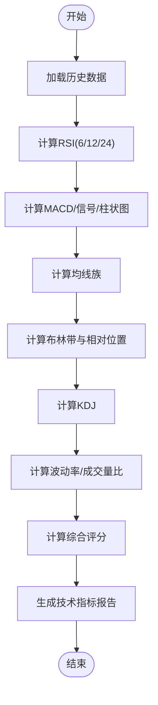
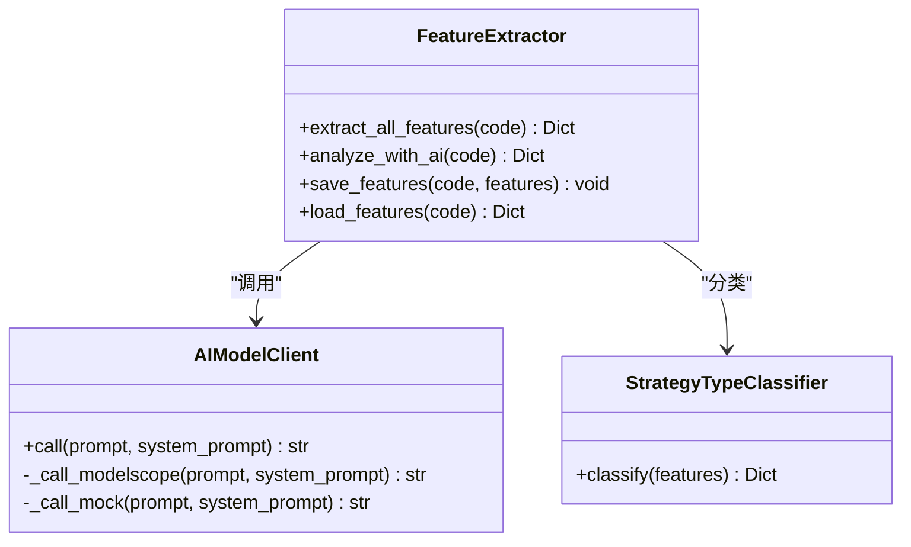
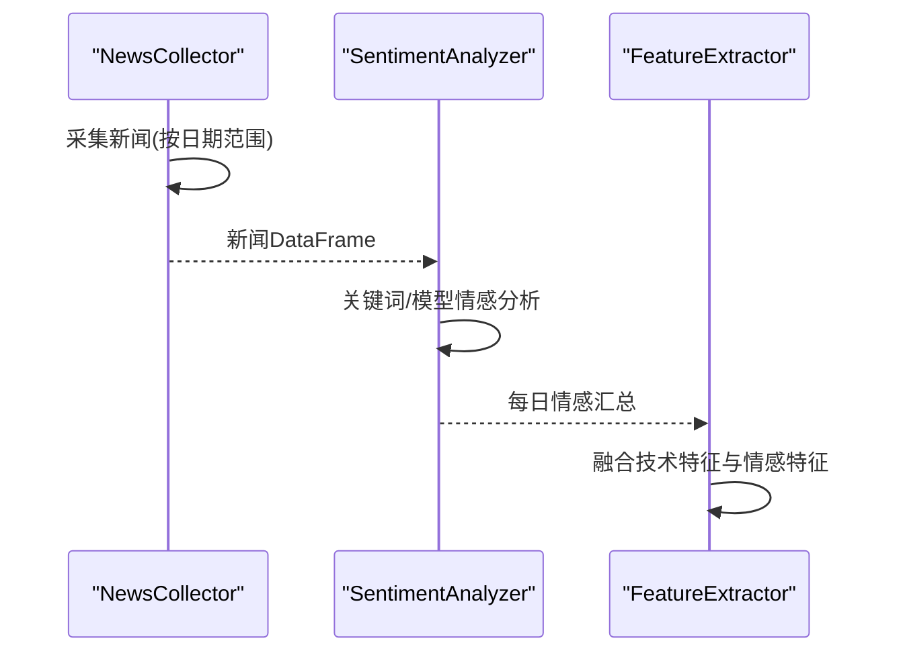
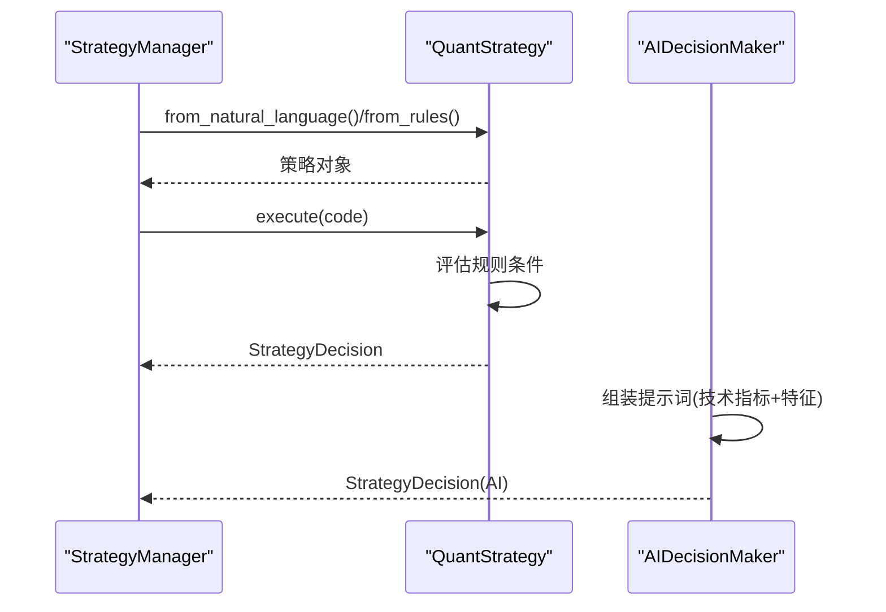
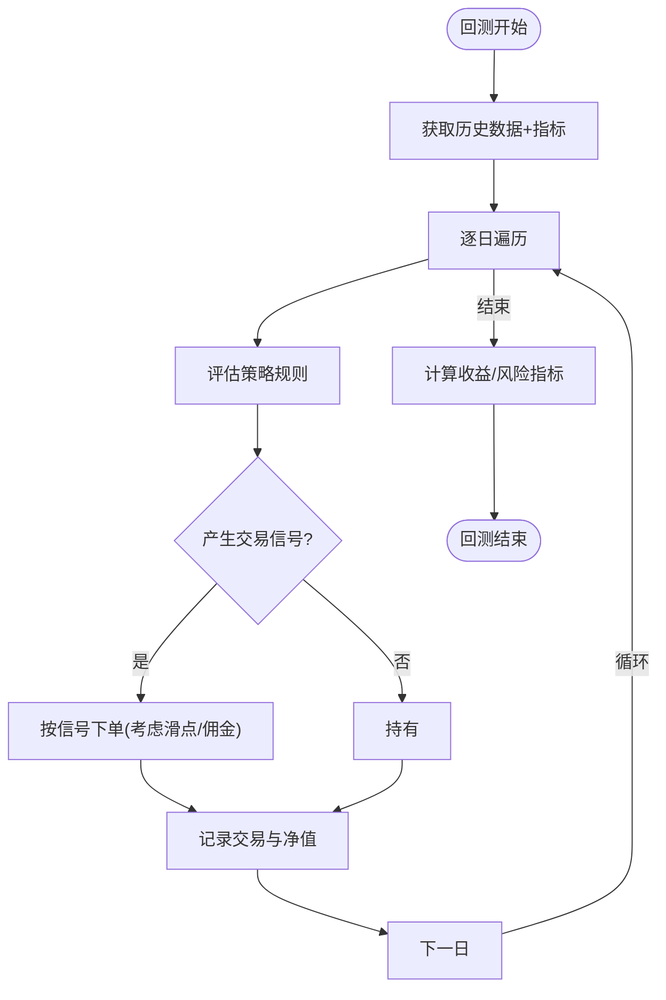
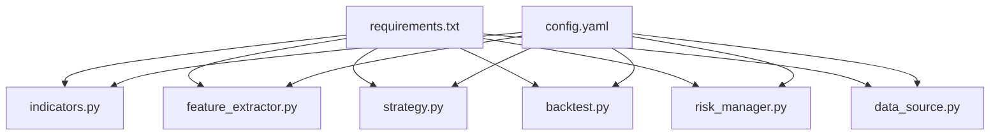

# 特征提取与信号分析

<cite>
**本文引用的文件**
- [main.py](file://main.py)
- [config.yaml](file://config.yaml)
- [quant_system/config_manager.py](file://quant_system/config_manager.py)
- [quant_system/stock_manager.py](file://quant_system/stock_manager.py)
- [quant_system/data_source.py](file://quant_system/data_source.py)
- [quant_system/data_cleaner.py](file://quant_system/data_cleaner.py)
- [quant_system/indicators.py](file://quant_system/indicators.py)
- [quant_system/feature_extractor.py](file://quant_system/feature_extractor.py)
- [quant_system/news_collector.py](file://quant_system/news_collector.py)
- [quant_system/strategy.py](file://quant_system/strategy.py)
- [quant_system/backtest.py](file://quant_system/backtest.py)
- [quant_system/risk_manager.py](file://quant_system/risk_manager.py)
- [requirements.txt](file://requirements.txt)
</cite>

## 目录
1. [简介](#简介)
2. [项目结构](#项目结构)
3. [核心组件](#核心组件)
4. [架构总览](#架构总览)
5. [详细组件分析](#详细组件分析)
6. [依赖分析](#依赖分析)
7. [性能考量](#性能考量)
8. [故障排查指南](#故障排查指南)
9. [结论](#结论)
10. [附录](#附录)

## 简介
本系统围绕“技术指标特征提取与信号分析”构建，目标是从多维度技术指标中提取有效投资信号，实现：
- 指标间相互关系分析与信号融合
- 信号过滤与质量提升
- 综合评分体系与权重分配
- 多指标组合策略设计与一致性检验
- 风险控制与回测验证
- 特征工程最佳实践与信号验证方法

系统提供命令行入口与Web界面，支持从数据采集、清洗、指标计算、特征提取、策略执行、回测分析到风控报告的全链路能力。

## 项目结构
系统采用模块化分层设计，主要目录与职责如下：
- config：全局配置文件与股票代码配置
- data：历史/实时/指标/特征/新闻/回测等数据存储
- quant_system：核心业务模块
  - config_manager：统一配置管理
  - stock_manager：股票/板块/指数代码管理
  - data_source：统一数据源（Tushare历史、Easyquotation实时）
  - data_cleaner：数据清洗与一致性校验
  - indicators：技术指标计算与分析
  - feature_extractor：特征提取与AI辅助策略分类
  - news_collector：新闻采集与情感分析
  - strategy：策略解析、执行与AI决策
  - backtest：回测引擎与分析器
  - risk_manager：风控与组合风险评估
  - web_app：Web服务（模板与路由）
- logs：日志输出
- main.py：命令行入口与子命令调度

图表来源
- [main.py:261-365](file://main.py#L261-L365)
- [quant_system/config_manager.py:12-178](file://quant_system/config_manager.py#L12-L178)
- [quant_system/stock_manager.py:62-278](file://quant_system/stock_manager.py#L62-L278)
- [quant_system/data_source.py:300-423](file://quant_system/data_source.py#L300-L423)
- [quant_system/data_cleaner.py:21-444](file://quant_system/data_cleaner.py#L21-L444)
- [quant_system/indicators.py:21-500](file://quant_system/indicators.py#L21-L500)
- [quant_system/feature_extractor.py:99-405](file://quant_system/feature_extractor.py#L99-L405)
- [quant_system/news_collector.py:24-465](file://quant_system/news_collector.py#L24-L465)
- [quant_system/strategy.py:150-556](file://quant_system/strategy.py#L150-L556)
- [quant_system/backtest.py:66-456](file://quant_system/backtest.py#L66-L456)
- [quant_system/risk_manager.py:47-404](file://quant_system/risk_manager.py#L47-L404)

章节来源
- [main.py:261-365](file://main.py#L261-L365)
- [config.yaml:1-88](file://config.yaml#L1-L88)

## 核心组件
- 配置管理：集中读取与派生各类配置（技术指标、回测、风控、AI模型等），并确保数据目录存在。
- 股票管理：统一管理股票、板块、指数的代码与格式转换。
- 数据源：统一历史（Tushare）与实时（Easyquotation）数据接口，提供标准化输出。
- 数据清洗：完整性检查、去重、缺失值填充、异常值检测、OHLC一致性校验与对齐。
- 技术指标：RSI/MACD/均线/布林带/KDJ/波动率等多指标计算与保存。
- 指标分析：最新信号解读、综合评分与报告生成。
- 特征提取：技术特征、情感特征、市场特征提取；AI辅助策略类型分类。
- 新闻情感：采集新浪新闻并进行情感分析，按日聚合。
- 策略层：自然语言到量化规则的解析与翻译；策略执行与AI综合决策。
- 回测：按策略遍历历史数据生成交易信号，计算收益、风险与绩效指标。
- 风控：仓位限制、止损止盈、资金与持仓检查、组合风险评估与报告。

章节来源
- [quant_system/config_manager.py:12-178](file://quant_system/config_manager.py#L12-L178)
- [quant_system/stock_manager.py:62-278](file://quant_system/stock_manager.py#L62-L278)
- [quant_system/data_source.py:300-423](file://quant_system/data_source.py#L300-L423)
- [quant_system/data_cleaner.py:21-444](file://quant_system/data_cleaner.py#L21-L444)
- [quant_system/indicators.py:21-500](file://quant_system/indicators.py#L21-L500)
- [quant_system/feature_extractor.py:99-405](file://quant_system/feature_extractor.py#L99-L405)
- [quant_system/news_collector.py:24-465](file://quant_system/news_collector.py#L24-L465)
- [quant_system/strategy.py:150-556](file://quant_system/strategy.py#L150-L556)
- [quant_system/backtest.py:66-456](file://quant_system/backtest.py#L66-L456)
- [quant_system/risk_manager.py:47-404](file://quant_system/risk_manager.py#L47-L404)

## 架构总览
系统采用“命令行入口 + 模块化组件”的分层架构，命令行负责参数解析与流程编排，各模块通过统一配置与数据接口协作。

图表来源
- [main.py:48-174](file://main.py#L48-L174)
- [quant_system/data_source.py:300-423](file://quant_system/data_source.py#L300-L423)
- [quant_system/indicators.py:188-328](file://quant_system/indicators.py#L188-L328)
- [quant_system/feature_extractor.py:190-321](file://quant_system/feature_extractor.py#L190-L321)
- [quant_system/strategy.py:397-460](file://quant_system/strategy.py#L397-L460)
- [quant_system/backtest.py:75-282](file://quant_system/backtest.py#L75-L282)
- [quant_system/risk_manager.py:185-240](file://quant_system/risk_manager.py#L185-L240)

## 详细组件分析

### 技术指标与信号分析
- 指标计算：RSI（多周期）、MACD（快慢线与柱状图）、均线族、布林带、KDJ、波动率、成交量比等。
- 信号解读：RSI超买/超卖、MACD柱状图方向、均线排列趋势、布林带相对位置、综合评分（-100~100）。
- 报告生成：输出最新指标状态与综合建议。

图表来源
- [quant_system/indicators.py:188-273](file://quant_system/indicators.py#L188-L273)
- [quant_system/indicators.py:445-494](file://quant_system/indicators.py#L445-L494)

章节来源
- [quant_system/indicators.py:21-500](file://quant_system/indicators.py#L21-L500)

### 特征提取与AI策略分类
- 技术特征：趋势强度、趋势方向、RSI水平、MACD动量、均线排列、波动代理、布林带位置。
- 情感特征：平均情感、情感趋势、新闻数量、多头/空头比例。
- 市场特征：市场贝塔、行业排名（预留）。
- AI辅助：调用ModelScope或本地规则，输出策略类型、置信度、推荐指标、风险等级与适合的投资者类型。
- 策略分类：基于技术特征打分，匹配趋势跟踪/动量/波段/均值回归等策略类型。

图表来源
- [quant_system/feature_extractor.py:99-405](file://quant_system/feature_extractor.py#L99-L405)

章节来源
- [quant_system/feature_extractor.py:99-405](file://quant_system/feature_extractor.py#L99-L405)

### 新闻情感与信号融合
- 新闻采集：按日期范围抓取新浪财经个股新闻，去重合并。
- 情感分析：优先使用ModelScope API，失败时回退本地关键词规则；按日聚合情感分数与标签。
- 信号融合：将情感特征与技术特征结合，参与AI策略分类与综合评分。

图表来源
- [quant_system/news_collector.py:43-203](file://quant_system/news_collector.py#L43-L203)
- [quant_system/news_collector.py:327-400](file://quant_system/news_collector.py#L327-L400)
- [quant_system/feature_extractor.py:142-171](file://quant_system/feature_extractor.py#L142-L171)

章节来源
- [quant_system/news_collector.py:24-465](file://quant_system/news_collector.py#L24-L465)
- [quant_system/feature_extractor.py:142-171](file://quant_system/feature_extractor.py#L142-L171)

### 策略解析、执行与AI决策
- 自然语言到规则：将自然语言策略描述解析为量化规则（条件、动作、仓位、理由）。
- 规则执行：评估条件表达式，统计买入/卖出信号数量与平均仓位，输出动作与置信度。
- AI综合决策：结合技术指标与特征，输出动作、仓位、置信度与风险评估。

图表来源
- [quant_system/strategy.py:150-316](file://quant_system/strategy.py#L150-L316)
- [quant_system/strategy.py:462-556](file://quant_system/strategy.py#L462-L556)

章节来源
- [quant_system/strategy.py:150-556](file://quant_system/strategy.py#L150-L556)

### 回测与风险控制
- 回测引擎：遍历历史数据，按策略产生买卖信号，考虑滑点与佣金，记录交易与净值曲线，计算收益、最大回撤、夏普比率、胜率、盈亏比等。
- 风控：检查单只/总仓位上限、资金可用性、止损止盈触发，评估组合集中度与风险等级。

图表来源
- [quant_system/backtest.py:75-282](file://quant_system/backtest.py#L75-L282)

章节来源
- [quant_system/backtest.py:66-456](file://quant_system/backtest.py#L66-L456)
- [quant_system/risk_manager.py:47-404](file://quant_system/risk_manager.py#L47-L404)

## 依赖分析
- Python依赖：pandas、numpy、tushare、easyquotation、flask、plotly、requests、beautifulsoup4、pyyaml、apscheduler等。
- 配置驱动：config.yaml集中定义数据目录、技术指标周期、回测参数、风控阈值、AI模型参数等。
- 组件耦合：策略层依赖指标与特征；回测依赖策略与数据源；风控贯穿交易执行阶段。

图表来源
- [requirements.txt:1-33](file://requirements.txt#L1-L33)
- [config.yaml:1-88](file://config.yaml#L1-L88)

章节来源
- [requirements.txt:1-33](file://requirements.txt#L1-L33)
- [config.yaml:1-88](file://config.yaml#L1-L88)

## 性能考量
- 指标计算：滚动窗口与指数加权平均的复杂度较高，建议合理设置周期与缓存结果。
- 数据对齐：多股票对齐与缺失值填充可能带来内存压力，建议分批处理与增量更新。
- 回测效率：规则评估使用字符串替换与eval，注意安全与性能，必要时可预编译条件表达式。
- API限流：Tushare与网络请求需遵守速率限制，避免频繁请求导致失败。
- 情感分析：批量处理新闻时建议分批调用模型，避免超时与失败。

[本节为通用指导，无需特定文件引用]

## 故障排查指南
- 数据缺失/异常：使用数据清洗模块的完整性检查与一致性校验，查看清洗报告定位问题。
- 指标为空：确认历史数据是否成功下载与标准化，检查指标计算前置条件（数值列类型）。
- 回测报错：检查策略规则是否可评估、日期范围是否有效、滑点与手续费参数是否合理。
- 风控拒绝：关注单只/总仓位比例、资金可用性与止损止盈触发，调整策略或参数。
- AI调用失败：检查ModelScope Token与网络连通性，系统会自动回退至本地规则。

章节来源
- [quant_system/data_cleaner.py:287-388](file://quant_system/data_cleaner.py#L287-L388)
- [quant_system/backtest.py:96-107](file://quant_system/backtest.py#L96-L107)
- [quant_system/risk_manager.py:185-240](file://quant_system/risk_manager.py#L185-L240)
- [quant_system/feature_extractor.py:48-97](file://quant_system/feature_extractor.py#L48-L97)

## 结论
本系统提供了从数据采集到信号分析、策略执行与风控回测的完整闭环。通过多指标融合与AI辅助分类，能够有效识别趋势、动量与反转信号，并以回测与风控保障策略稳健性。建议在实际应用中持续优化特征权重、规则一致性与风险阈值，结合新闻情感与市场环境动态调整策略。

[本节为总结性内容，无需特定文件引用]

## 附录

### 命令行使用示例
- 更新数据：python main.py update-data [--code 600519] [--refresh]
- 更新指标：python main.py update-indicators [--code 600519]
- 采集新闻：python main.py collect-news [--code 600519]
- 提取特征：python main.py extract-features [--code 600519]
- 运行策略：python main.py run-strategy -c 600519 -s rsi [-n]
- AI决策：python main.py ai-decision -c 600519 [-d "策略描述"]
- 回测：python main.py backtest -c 600519 -s macd --start-date 20230101 --end-date 20241231 --capital 1000000 [-n]
- 风险报告：python main.py risk-report
- 数据验证：python main.py validate-data
- Web服务：python main.py web [--host 127.0.0.1] [--port 8080] [--debug]

章节来源
- [main.py:261-365](file://main.py#L261-L365)

### 配置要点
- 技术指标：RSI周期、时间框架、历史回看天数；均线周期；MACD参数。
- 回测：初始资金、手续费率、滑点。
- 风控：最大总仓位、单只上限、止损/止盈比例。
- AI模型：Provider、模型名、最大token、温度。

章节来源
- [config.yaml:41-88](file://config.yaml#L41-L88)
- [quant_system/config_manager.py:133-174](file://quant_system/config_manager.py#L133-L174)

### 特征工程最佳实践
- 指标标准化：将不同尺度的指标归一化或标准化，便于融合。
- 信号一致性：多指标交叉验证（如RSI与MACD同向、布林带与波动率配合）。
- 情感权重：根据新闻数量与情感趋势动态调整权重，避免噪声干扰。
- 窗口选择：不同周期的RSI与KDJ组合，观察短期与中长期共振。
- 过拟合防护：使用滚动窗口与样本外验证，避免过度拟合。

[本节为通用指导，无需特定文件引用]

### 信号验证方法
- 多时间框架验证：同时检查日线、周线、月线信号一致性。
- 回测对比：分别测试单一指标与组合策略的收益与风险指标差异。
- 空仓期与震荡期：在无趋势或震荡市场中降低信号权重或暂停交易。
- 事件驱动：结合财报、公告等事件对信号进行修正。

[本节为通用指导，无需特定文件引用]

### 实际应用案例
- 趋势跟踪策略：在综合评分偏正且MACD柱状图向上时买入，布林带位置处于中轨附近时加仓。
- 动量策略：RSI在超卖区上穿中轨且MACD金叉时做多，目标止盈设为布林带上轨。
- 均值回归：价格偏离布林带下轨且RSI进入超卖区域时做多，目标止盈设为中轨。
- 波段操作：KDJ与RSI双超卖且MACD柱状图转正时轻仓介入，等待进一步确认。

[本节为通用指导，无需特定文件引用]