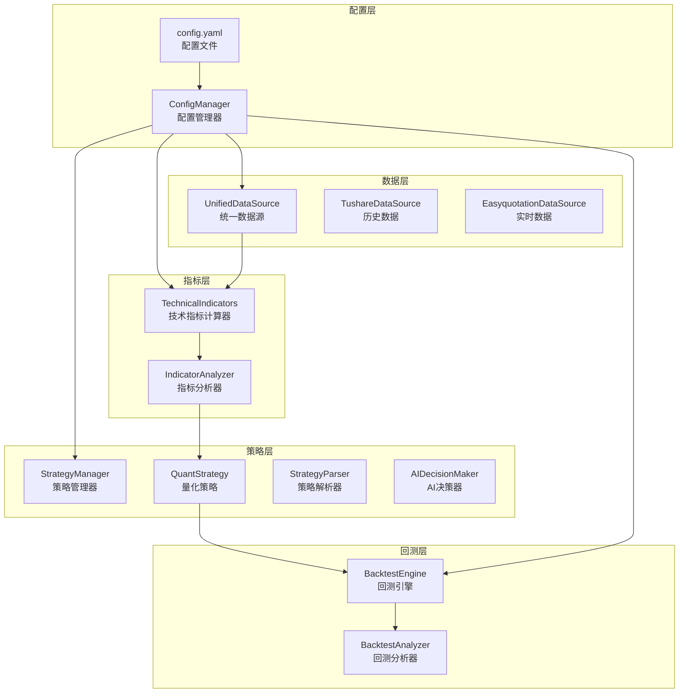
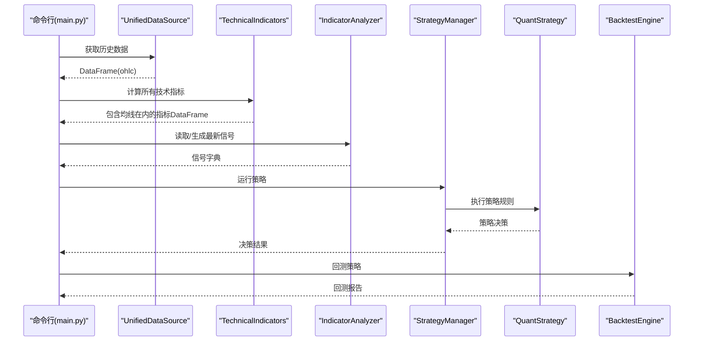
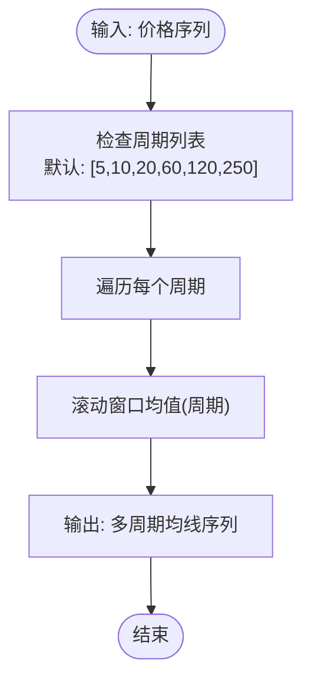
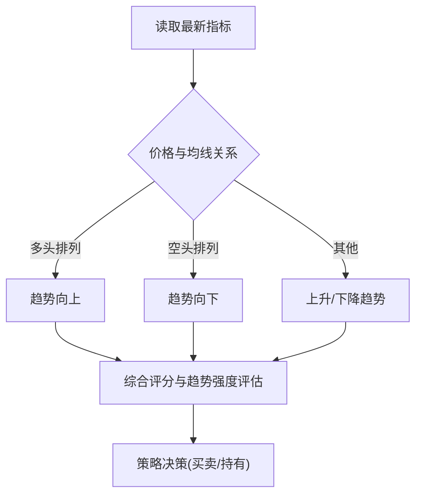
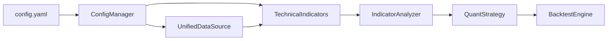

# 移动平均线

<cite>
**本文引用的文件**
- [indicators.py](file://quant_system/indicators.py)
- [strategy.py](file://quant_system/strategy.py)
- [backtest.py](file://quant_system/backtest.py)
- [config.yaml](file://config.yaml)
- [config/stocks.yaml](file://config/stocks.yaml)
- [config_manager.py](file://quant_system/config_manager.py)
- [data_source.py](file://quant_system/data_source.py)
- [stock_manager.py](file://quant_system/stock_manager.py)
- [main.py](file://main.py)
</cite>

## 目录
1. [简介](#简介)
2. [项目结构](#项目结构)
3. [核心组件](#核心组件)
4. [架构总览](#架构总览)
5. [详细组件分析](#详细组件分析)
6. [依赖关系分析](#依赖关系分析)
7. [性能考量](#性能考量)
8. [故障排查指南](#故障排查指南)
9. [结论](#结论)
10. [附录](#附录)

## 简介
本文件围绕量化交易系统中的移动平均线技术指标展开，系统性阐述简单移动平均线（SMA）与指数移动平均线（EMA）的计算原理、在趋势分析中的应用、均线系统的排列形态与交叉信号识别，并结合系统内现有指标（如布林带、RSI、MACD）给出实战技巧与参数选择建议。同时，提供基于系统策略与回测引擎的均线参数优化思路与使用示例路径，帮助读者快速落地到实际交易场景。

## 项目结构
该量化系统采用模块化设计，技术指标计算集中在指标模块，策略与回测分别由策略模块与回测模块负责，数据来源通过统一数据源接口抽象，配置集中于配置文件与配置管理器。移动平均线作为技术指标的一部分，被统一纳入指标计算流程，并参与策略决策与回测评估。

图表来源
- [config.yaml:1-88](file://config.yaml#L1-L88)
- [config_manager.py:1-178](file://quant_system/config_manager.py#L1-L178)
- [data_source.py:300-423](file://quant_system/data_source.py#L300-L423)
- [indicators.py:21-329](file://quant_system/indicators.py#L21-L329)
- [strategy.py:150-556](file://quant_system/strategy.py#L150-L556)
- [backtest.py:66-456](file://quant_system/backtest.py#L66-L456)

章节来源
- [config.yaml:1-88](file://config.yaml#L1-L88)
- [config_manager.py:1-178](file://quant_system/config_manager.py#L1-L178)
- [data_source.py:300-423](file://quant_system/data_source.py#L300-L423)
- [indicators.py:21-329](file://quant_system/indicators.py#L21-L329)
- [strategy.py:150-556](file://quant_system/strategy.py#L150-L556)
- [backtest.py:66-456](file://quant_system/backtest.py#L66-L456)

## 核心组件
- 技术指标计算器：提供RSI、MACD、移动平均线、布林带、KDJ、波动率等指标的计算与批量更新能力；其中移动平均线通过滚动窗口均值实现，周期配置来自配置文件。
- 指标分析器：读取或计算最新指标，生成信号与综合评分，支持均线趋势解读（多头/空头排列）。
- 策略管理器与量化策略：内置基于RSI、MACD与均线综合评分的策略，支持自然语言到量化规则的解析与执行。
- 回测引擎：基于历史数据与策略规则进行回测，评估收益、风险与交易统计指标。

章节来源
- [indicators.py:21-329](file://quant_system/indicators.py#L21-L329)
- [strategy.py:150-556](file://quant_system/strategy.py#L150-L556)
- [backtest.py:66-456](file://quant_system/backtest.py#L66-L456)

## 架构总览
移动平均线在系统中的工作流如下：
- 配置层提供均线周期参数（默认包含5、10、20、60、120、250日）。
- 数据层统一获取历史K线数据。
- 指标层计算移动平均线并写入DataFrame，供策略与回测使用。
- 策略层基于均线与其它指标生成交易信号。
- 回测层执行策略并输出绩效报告。

图表来源
- [main.py:139-174](file://main.py#L139-L174)
- [data_source.py:307-336](file://quant_system/data_source.py#L307-L336)
- [indicators.py:188-273](file://quant_system/indicators.py#L188-L273)
- [strategy.py:229-299](file://quant_system/strategy.py#L229-L299)
- [backtest.py:75-282](file://quant_system/backtest.py#L75-L282)

## 详细组件分析

### 移动平均线计算与配置
- 计算方式：系统通过滚动窗口均值实现简单移动平均线（SMA），即对N日价格序列求算术平均。该实现简洁直观，适合趋势跟踪与支撑阻力识别。
- 周期配置：默认周期集合为5、10、20、60、120、250日，分别对应短期、中期、长期趋势线，便于多周期联动分析。
- 存储与复用：计算结果以“ma_周期”命名列写入DataFrame，供后续指标与策略使用。

图表来源
- [indicators.py:104-122](file://quant_system/indicators.py#L104-L122)
- [config.yaml:48-55](file://config.yaml#L48-L55)

章节来源
- [indicators.py:104-122](file://quant_system/indicators.py#L104-L122)
- [config.yaml:48-55](file://config.yaml#L48-L55)

### 布林带与均线的关系
- 布林带由中轨（均线）与上下轨（中轨±标准差）构成，系统默认使用20日均线与2倍标准差。
- 布林带相对位置（价格相对上下轨的位置）可用于衡量超买超卖与突破强度，与均线趋势共同辅助判断。

章节来源
- [indicators.py:124-143](file://quant_system/indicators.py#L124-L143)

### 均线系统排列形态与交叉信号
- 排列形态：系统通过最近价格与多条均线的相对位置判断趋势排列，例如“多头排列”（价格高于多条均线且按时间顺序递减）与“空头排列”（价格低于多条均线且按时间顺序递增）。该逻辑有助于识别趋势强弱与持续性。
- 交叉信号：系统在策略层使用综合评分与均线趋势进行决策，而非单一均线金叉/死叉。若需引入金叉/死叉信号，可在策略规则中显式加入均线交叉条件。

图表来源
- [indicators.py:403-418](file://quant_system/indicators.py#L403-L418)
- [strategy.py:359-373](file://quant_system/strategy.py#L359-L373)

章节来源
- [indicators.py:403-418](file://quant_system/indicators.py#L403-L418)
- [strategy.py:359-373](file://quant_system/strategy.py#L359-L373)

### 不同周期均线在趋势分析中的作用
- 5日/10日：短期趋势与交易信号的敏感度较高，适合捕捉短期波动与突破。
- 20日：中期趋势的代表性周期，常用于判断中期方向与支撑阻力。
- 60日/120日/250日：长期趋势的稳定性更强，适合识别大级别趋势与反转信号。

章节来源
- [config.yaml:48-55](file://config.yaml#L48-L55)

### 均线支撑阻力位判断与突破确认
- 支撑阻力：价格靠近均线时可能形成支撑或阻力，结合成交量与布林带相对位置可增强确认。
- 突破确认：价格突破均线并伴随成交量放大与布林带位置变化，可视为突破信号；系统通过布林带相对位置与综合评分辅助判断突破强度。

章节来源
- [indicators.py:249-254](file://quant_system/indicators.py#L249-L254)
- [strategy.py:419-443](file://quant_system/strategy.py#L419-L443)

### 均线参数选择指南与多均线组合策略
- 参数选择：短期（5/10）、中期（20）、长期（60/120/250）组合可覆盖不同时间尺度的趋势；可根据品种波动性调整周期长度。
- 组合策略：系统内置“均线策略”，基于综合评分与均线趋势进行决策；也可扩展策略规则，加入均线排列与交叉条件，实现更精细的多均线组合。

章节来源
- [config.yaml:48-55](file://config.yaml#L48-L55)
- [strategy.py:359-373](file://quant_system/strategy.py#L359-L373)

### 均线系统的优化方法
- 参数优化：通过回测引擎对不同周期组合进行回测，比较收益、最大回撤、胜率与夏普比率，选择最优参数组合。
- 规则优化：结合RSI、MACD与布林带等指标，构建复合信号规则，提升信号质量与稳定性。

章节来源
- [backtest.py:66-456](file://quant_system/backtest.py#L66-L456)
- [strategy.py:150-556](file://quant_system/strategy.py#L150-L556)

### 使用示例与代码实现路径
- 更新历史数据与指标：命令行入口提供“更新数据”和“更新指标”命令，自动拉取历史数据并计算技术指标（包含均线）。
- 生成技术指标报告：命令行提供“技术指标报告”命令，输出包含均线趋势与综合评分的报告。
- 运行策略与回测：命令行提供“运行策略”和“回测”命令，策略与回测均基于系统计算的指标进行。

章节来源
- [main.py:48-72](file://main.py#L48-L72)
- [main.py:255-259](file://main.py#L255-L259)
- [main.py:100-121](file://main.py#L100-L121)
- [main.py:139-174](file://main.py#L139-L174)

## 依赖关系分析
- 配置依赖：技术指标周期与回测参数来源于配置文件，配置管理器统一读取与校验。
- 数据依赖：统一数据源接口负责历史与实时数据的获取与标准化。
- 指标依赖：技术指标计算器依赖数据源提供的OHLC数据，计算完成后供策略与回测使用。
- 策略依赖：策略管理器与量化策略依赖指标分析器提供的最新信号字典。

图表来源
- [config.yaml:1-88](file://config.yaml#L1-L88)
- [config_manager.py:1-178](file://quant_system/config_manager.py#L1-L178)
- [data_source.py:300-423](file://quant_system/data_source.py#L300-L423)
- [indicators.py:21-329](file://quant_system/indicators.py#L21-L329)
- [strategy.py:150-556](file://quant_system/strategy.py#L150-L556)
- [backtest.py:66-456](file://quant_system/backtest.py#L66-L456)

章节来源
- [config.yaml:1-88](file://config.yaml#L1-L88)
- [config_manager.py:1-178](file://quant_system/config_manager.py#L1-L178)
- [data_source.py:300-423](file://quant_system/data_source.py#L300-L423)
- [indicators.py:21-329](file://quant_system/indicators.py#L21-L329)
- [strategy.py:150-556](file://quant_system/strategy.py#L150-L556)
- [backtest.py:66-456](file://quant_system/backtest.py#L66-L456)

## 性能考量
- 计算复杂度：滚动窗口均值的时间复杂度为O(N)，对长序列影响较小；多周期并行计算时注意内存占用与I/O。
- 数据规模：历史数据量较大时，建议分批处理与缓存中间结果，减少重复计算。
- 回测效率：回测引擎在策略执行阶段采用简化条件评估，避免重复计算指标，提高回测速度。

## 故障排查指南
- 数据缺失：检查数据源配置与网络连接，确认Tushare Token有效；必要时使用“验证数据”命令检查数据完整性。
- 指标为空：确认历史数据成功下载并标准化，检查指标计算流程是否报错。
- 策略无信号：检查策略规则是否匹配当前指标值，适当调整阈值或增加复合条件。
- 回测异常：核对回测参数（初始资金、手续费、滑点）与策略规则，确保数据范围覆盖策略执行期。

章节来源
- [main.py:184-215](file://main.py#L184-L215)
- [backtest.py:66-456](file://quant_system/backtest.py#L66-L456)

## 结论
本系统以滚动窗口均值为核心实现了简单移动平均线，并将其与RSI、MACD、布林带等指标协同，形成多维度的技术分析体系。通过策略管理器与回测引擎，用户可以基于均线系统构建并验证交易策略，结合参数优化与规则扩展，逐步提升策略稳定性与收益表现。

## 附录
- 股票配置：系统内置股票、板块与指数的代码配置，便于批量数据与策略运行。
- 命令行工具：提供数据更新、指标计算、策略运行、回测、Web服务等命令，便于自动化与集成。

章节来源
- [config/stocks.yaml:1-71](file://config/stocks.yaml#L1-L71)
- [main.py:261-365](file://main.py#L261-L365)