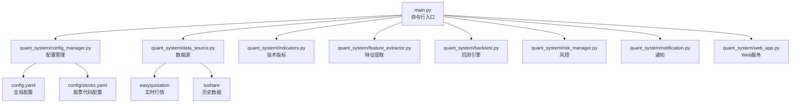
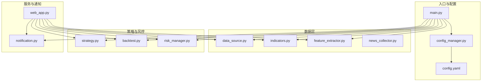
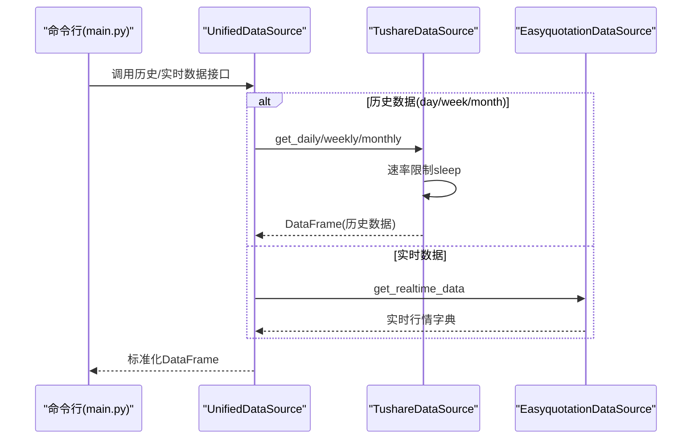
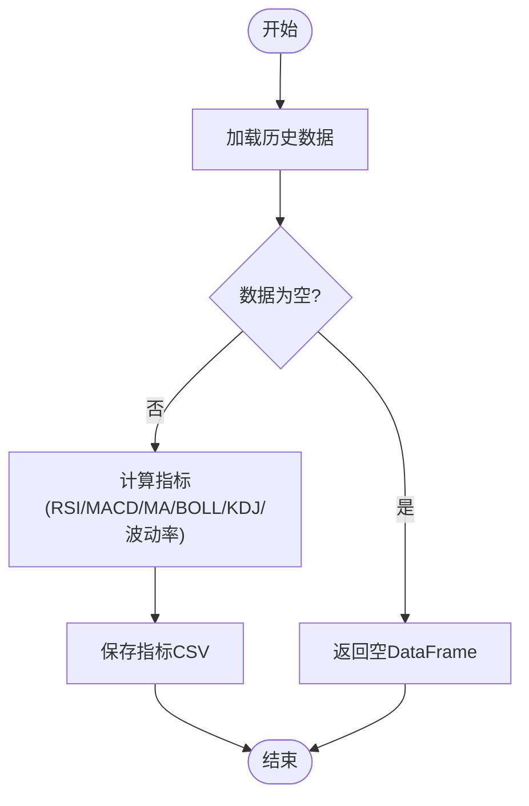
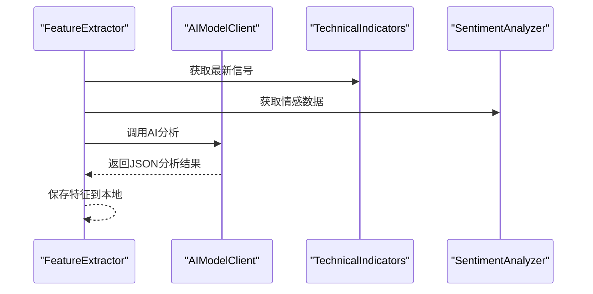
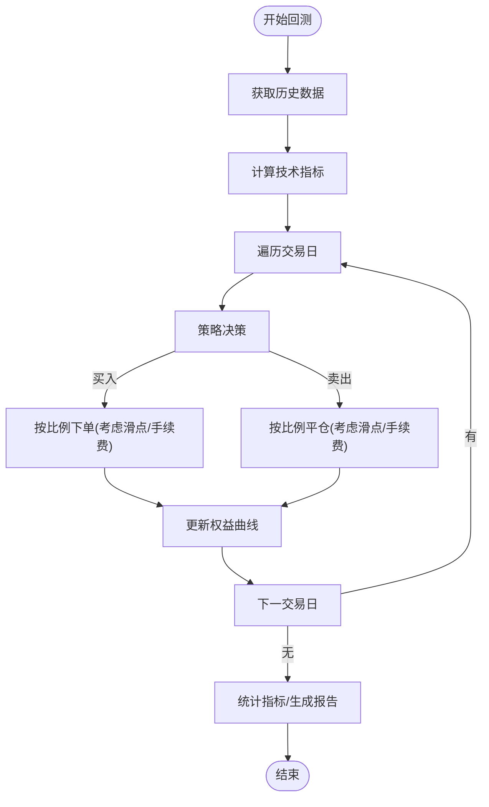
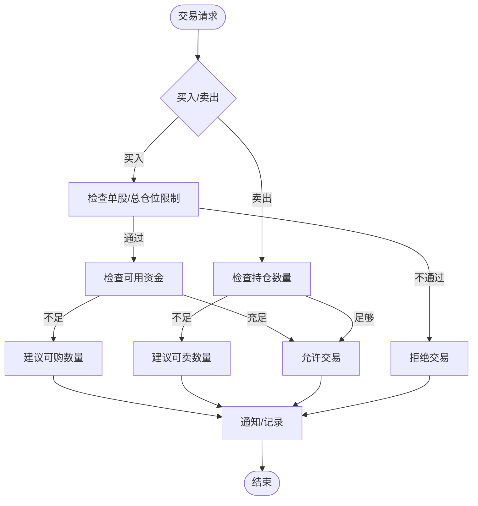
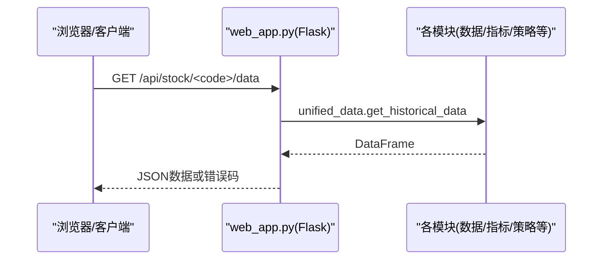
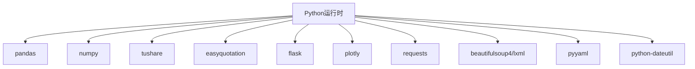

# 故障排除

<cite>
**本文引用的文件**
- [main.py](file://main.py)
- [config.yaml](file://config.yaml)
- [quant_system/web_app.py](file://quant_system/web_app.py)
- [quant_system/data_source.py](file://quant_system/data_source.py)
- [quant_system/config_manager.py](file://quant_system/config_manager.py)
- [quant_system/stock_manager.py](file://quant_system/stock_manager.py)
- [quant_system/indicators.py](file://quant_system/indicators.py)
- [quant_system/feature_extractor.py](file://quant_system/feature_extractor.py)
- [quant_system/backtest.py](file://quant_system/backtest.py)
- [quant_system/risk_manager.py](file://quant_system/risk_manager.py)
- [quant_system/notification.py](file://quant_system/notification.py)
- [requirements.txt](file://requirements.txt)
</cite>

## 目录
1. [简介](#简介)
2. [项目结构](#项目结构)
3. [核心组件](#核心组件)
4. [架构总览](#架构总览)
5. [详细组件分析](#详细组件分析)
6. [依赖分析](#依赖分析)
7. [性能考虑](#性能考虑)
8. [故障排除指南](#故障排除指南)
9. [结论](#结论)
10. [附录](#附录)

## 简介
本指南面向vibequation量化交易系统使用者与维护者，聚焦于常见故障的诊断、定位与修复流程，覆盖数据采集失败、API连接超时、内存不足、性能瓶颈、网络与权限问题、依赖冲突、日志分析与错误解读、系统监控与容量规划、用户反馈与问题报告标准流程等主题。文档以代码级分析为基础，结合系统架构图与流程图，帮助快速定位问题并给出可操作的解决方案。

## 项目结构
系统采用模块化分层设计，主要目录与职责如下：
- config：系统配置文件（全局配置与股票代码配置）
- data：数据存储目录（历史/实时/指标/特征/回测/新闻等）
- easyquotation：第三方行情数据采集库封装
- quant_system：核心业务模块（数据源、指标、特征、策略、回测、风控、通知、Web等）
- logs：日志输出目录
- main.py：命令行入口与子命令调度
- requirements.txt：依赖清单

**图表来源**
- [main.py:261-365](file://main.py#L261-L365)
- [quant_system/web_app.py:445-466](file://quant_system/web_app.py#L445-L466)
- [quant_system/data_source.py:300-423](file://quant_system/data_source.py#L300-L423)
- [quant_system/config_manager.py:12-178](file://quant_system/config_manager.py#L12-L178)

**章节来源**
- [main.py:261-365](file://main.py#L261-L365)
- [config.yaml:1-88](file://config.yaml#L1-L88)

## 核心组件
- 配置管理：集中读取与校验配置，确保数据目录存在，提供各模块配置访问接口
- 数据源：统一历史与实时数据采集，封装Tushare与Easyquotation，实现缓存与速率控制
- 技术指标：RSI/MACD/均线/布林带/KDJ/波动率等指标计算与持久化
- 特征提取：结合技术指标与情感分析，输出策略类型与风险等级
- 策略与回测：内置策略与自然语言策略解析，回测引擎与报告生成
- 风控：仓位限制、止损止盈、资金与持仓检查
- 通知：PushPlus微信推送
- Web：Flask服务，提供前端页面与API接口

**章节来源**
- [quant_system/config_manager.py:12-178](file://quant_system/config_manager.py#L12-L178)
- [quant_system/data_source.py:24-423](file://quant_system/data_source.py#L24-L423)
- [quant_system/indicators.py:21-500](file://quant_system/indicators.py#L21-L500)
- [quant_system/feature_extractor.py:99-405](file://quant_system/feature_extractor.py#L99-L405)
- [quant_system/backtest.py:66-456](file://quant_system/backtest.py#L66-L456)
- [quant_system/risk_manager.py:47-404](file://quant_system/risk_manager.py#L47-L404)
- [quant_system/notification.py:84-301](file://quant_system/notification.py#L84-L301)
- [quant_system/web_app.py:29-466](file://quant_system/web_app.py#L29-L466)

## 架构总览
系统通过命令行入口调度各模块；Web服务提供可视化与API；数据流自上而下贯穿数据采集、指标计算、特征提取、策略执行、回测与风控，最终通过通知模块对外输出。

**图表来源**
- [main.py:14-25](file://main.py#L14-L25)
- [quant_system/web_app.py:17-26](file://quant_system/web_app.py#L17-L26)
- [quant_system/data_source.py:300-423](file://quant_system/data_source.py#L300-L423)
- [quant_system/indicators.py:330-500](file://quant_system/indicators.py#L330-L500)
- [quant_system/feature_extractor.py:99-405](file://quant_system/feature_extractor.py#L99-L405)
- [quant_system/backtest.py:66-456](file://quant_system/backtest.py#L66-L456)
- [quant_system/risk_manager.py:47-404](file://quant_system/risk_manager.py#L47-L404)
- [quant_system/notification.py:84-301](file://quant_system/notification.py#L84-L301)

## 详细组件分析

### 数据采集与API连接（Tushare/Easyquotation）
- Tushare数据源：初始化时读取Token并建立API连接；实现每分钟约500次的速率限制；支持日线/周线/月线与指数数据获取；本地CSV缓存与增量合并
- Easyquotation数据源：按配置的源（默认新浪）批量获取实时行情；可扩展为其他源
- 统一数据源：对外提供历史/实时数据的标准化接口，并做列名与格式标准化

**图表来源**
- [quant_system/data_source.py:300-423](file://quant_system/data_source.py#L300-L423)
- [quant_system/data_source.py:43-221](file://quant_system/data_source.py#L43-L221)
- [quant_system/data_source.py:223-298](file://quant_system/data_source.py#L223-L298)

**章节来源**
- [quant_system/data_source.py:43-221](file://quant_system/data_source.py#L43-L221)
- [quant_system/data_source.py:223-298](file://quant_system/data_source.py#L223-L298)
- [quant_system/data_source.py:300-423](file://quant_system/data_source.py#L300-L423)

### 技术指标计算与缓存
- 指标计算：RSI、MACD、均线、布林带、KDJ、波动率、成交量比率等
- 缓存策略：按股票+频率命名文件，先加载再计算，避免重复计算
- 配置驱动：周期、时间框架、历史回看窗口等参数来自配置

**图表来源**
- [quant_system/indicators.py:188-328](file://quant_system/indicators.py#L188-L328)
- [quant_system/indicators.py:275-305](file://quant_system/indicators.py#L275-L305)

**章节来源**
- [quant_system/indicators.py:21-500](file://quant_system/indicators.py#L21-L500)

### 特征提取与AI分析
- 特征来源：技术指标信号、情感分析、市场相关性
- AI分析：调用ModelScope API进行策略类型与风险等级判断；若API失败则降级为模拟响应
- 存储：特征JSON本地缓存，便于后续复用

**图表来源**
- [quant_system/feature_extractor.py:99-405](file://quant_system/feature_extractor.py#L99-L405)
- [quant_system/indicators.py:330-500](file://quant_system/indicators.py#L330-L500)

**章节来源**
- [quant_system/feature_extractor.py:99-405](file://quant_system/feature_extractor.py#L99-L405)

### 回测引擎与报告
- 回测流程：获取历史数据与指标，逐日执行策略，处理买卖信号，记录交易与权益曲线
- 风险参数：手续费、滑点、初始资金等来自配置
- 报告生成：总收益、年化收益、最大回撤、夏普比率、胜率、盈亏比等

**图表来源**
- [quant_system/backtest.py:75-282](file://quant_system/backtest.py#L75-L282)
- [quant_system/backtest.py:379-426](file://quant_system/backtest.py#L379-L426)

**章节来源**
- [quant_system/backtest.py:66-456](file://quant_system/backtest.py#L66-L456)

### 风控与仓位管理
- 限制维度：单股仓位上限、总仓位上限、止损/止盈阈值
- 交易前置检查：买入资金充足性、卖出持仓充足性，必要时建议调整数量
- 组合风险评估：集中度、浮动盈亏、风险等级

**图表来源**
- [quant_system/risk_manager.py:185-240](file://quant_system/risk_manager.py#L185-L240)
- [quant_system/risk_manager.py:241-293](file://quant_system/risk_manager.py#L241-L293)

**章节来源**
- [quant_system/risk_manager.py:47-404](file://quant_system/risk_manager.py#L47-L404)

### Web服务与API
- 路由覆盖：股票列表、历史数据、指标、图表、策略运行、回测、风险、新闻、特征、AI决策等
- 错误处理：捕获异常并返回500与错误信息，同时记录日志
- 启动参数：主机、端口、调试模式来自配置

**图表来源**
- [quant_system/web_app.py:43-105](file://quant_system/web_app.py#L43-L105)
- [quant_system/web_app.py:445-466](file://quant_system/web_app.py#L445-L466)

**章节来源**
- [quant_system/web_app.py:29-466](file://quant_system/web_app.py#L29-L466)

## 依赖分析
- Python版本与第三方库：pandas、numpy、tushare、easyquotation、flask、plotly、requests、beautifulsoup4、lxml、pyyaml、python-dateutil
- 关键依赖：tushare/easyquotation用于数据源；flask/plotly用于Web与可视化；requests用于通知推送；yaml用于配置解析

**图表来源**
- [requirements.txt:1-29](file://requirements.txt#L1-L29)

**章节来源**
- [requirements.txt:1-29](file://requirements.txt#L1-L29)

## 性能考虑
- 数据缓存与增量更新：历史数据与指标按文件缓存，避免重复拉取与计算
- 速率限制：Tushare接口实现最小请求间隔，防止触发限流
- 批量处理：统一数据源按股票列表循环更新，中间加入延迟
- 回测优化：使用向量化计算与DataFrame操作，减少Python循环开销
- 可视化：Plotly图表按需生成，避免不必要的渲染

[本节为通用性能建议，无需特定文件引用]

## 故障排除指南

### 一、数据采集失败
- 症状
  - 历史数据为空或部分缺失
  - 实时数据获取异常
  - 指标计算返回空
- 诊断步骤
  1) 检查Tushare Token是否配置正确
     - 参考：[config.yaml:4-7](file://config.yaml#L4-L7)
  2) 查看日志中“获取日线/周线/月线失败”或“获取实时数据失败”的错误
     - 参考：[quant_system/data_source.py:111-136](file://quant_system/data_source.py#L111-L136)，[quant_system/data_source.py:255-258](file://quant_system/data_source.py#L255-L258)
  3) 确认目标股票代码是否存在
     - 参考：[quant_system/stock_manager.py:111-129](file://quant_system/stock_manager.py#L111-L129)
  4) 检查数据目录是否存在且可写
     - 参考：[quant_system/config_manager.py:39-54](file://quant_system/config_manager.py#L39-L54)，[quant_system/data_source.py:30-41](file://quant_system/data_source.py#L30-L41)
  5) 指标计算失败：确认历史数据非空且数值列可转换
     - 参考：[quant_system/indicators.py:204-217](file://quant_system/indicators.py#L204-L217)
- 处理建议
  - 重新设置Token并重启
  - 手动删除对应缓存文件后重试
  - 调整日期范围或频率参数
  - 检查网络与代理设置

**章节来源**
- [config.yaml:4-7](file://config.yaml#L4-L7)
- [quant_system/data_source.py:43-221](file://quant_system/data_source.py#L43-L221)
- [quant_system/stock_manager.py:111-129](file://quant_system/stock_manager.py#L111-L129)
- [quant_system/config_manager.py:39-54](file://quant_system/config_manager.py#L39-L54)
- [quant_system/indicators.py:204-217](file://quant_system/indicators.py#L204-L217)

### 二、API连接超时/限流
- 症状
  - 请求超时、返回空数据、抛出异常
- 诊断步骤
  1) 查看Tushare速率限制逻辑与sleep
     - 参考：[quant_system/data_source.py:56-62](file://quant_system/data_source.py#L56-L62)
  2) 检查网络连通性与代理
  3) 在Web服务中查看500错误与异常栈
     - 参考：[quant_system/web_app.py:75-78](file://quant_system/web_app.py#L75-L78)
- 处理建议
  - 降低并发与频率，增加延时
  - 使用稳定网络或直连
  - 适当提高请求超时时间（谨慎）

**章节来源**
- [quant_system/data_source.py:56-62](file://quant_system/data_source.py#L56-L62)
- [quant_system/web_app.py:75-78](file://quant_system/web_app.py#L75-L78)

### 三、内存不足/性能瓶颈
- 症状
  - 回测过程内存占用高、运行缓慢、OOM
- 诊断步骤
  1) 检查回测参数：初始资金、滑点、手续费、回看周期
     - 参考：[config.yaml:64-68](file://config.yaml#L64-L68)，[quant_system/backtest.py:69-74](file://quant_system/backtest.py#L69-L74)
  2) 指标计算周期是否过大
     - 参考：[quant_system/indicators.py:219-228](file://quant_system/indicators.py#L219-L228)
  3) Web服务是否开启调试模式导致额外开销
     - 参考：[config.yaml:80](file://config.yaml#L80)
- 处理建议
  - 减小回测时间跨度与指标周期
  - 优化DataFrame操作，避免重复复制
  - 生产环境关闭调试模式

**章节来源**
- [config.yaml:64-68](file://config.yaml#L64-L68)
- [quant_system/backtest.py:69-74](file://quant_system/backtest.py#L69-L74)
- [quant_system/indicators.py:219-228](file://quant_system/indicators.py#L219-L228)
- [config.yaml:80](file://config.yaml#L80)

### 四、网络连接问题
- 症状
  - PushPlus推送失败、AI模型调用失败
- 诊断步骤
  1) PushPlus Token是否配置
     - 参考：[config.yaml:6](file://config.yaml#L6)，[quant_system/notification.py:22-26](file://quant_system/notification.py#L22-L26)
  2) AI模型Token与Provider配置
     - 参考：[config.yaml:57-62](file://config.yaml#L57-L62)，[quant_system/feature_extractor.py:27-31](file://quant_system/feature_extractor.py#L27-L31)
  3) Web服务中异常日志
     - 参考：[quant_system/web_app.py:50-68](file://quant_system/web_app.py#L50-L68)
- 处理建议
  - 补充有效Token
  - 更换AI Provider或降级为本地模拟
  - 检查防火墙与DNS

**章节来源**
- [config.yaml:6](file://config.yaml#L6)
- [config.yaml:57-62](file://config.yaml#L57-L62)
- [quant_system/notification.py:22-26](file://quant_system/notification.py#L22-L26)
- [quant_system/web_app.py:50-68](file://quant_system/web_app.py#L50-L68)

### 五、权限配置错误
- 症状
  - 无法创建/写入数据目录
  - Web服务启动失败
- 诊断步骤
  1) 确认数据目录存在且具备写权限
     - 参考：[quant_system/config_manager.py:39-54](file://quant_system/config_manager.py#L39-L54)
  2) Web服务端口占用或权限不足
     - 参考：[quant_system/web_app.py:454-461](file://quant_system/web_app.py#L454-L461)
- 处理建议
  - 以管理员权限运行或修改目录权限
  - 更换端口或释放占用端口

**章节来源**
- [quant_system/config_manager.py:39-54](file://quant_system/config_manager.py#L39-L54)
- [quant_system/web_app.py:454-461](file://quant_system/web_app.py#L454-L461)

### 六、依赖包冲突/缺失
- 症状
  - 导入失败、版本不兼容、功能异常
- 诊断步骤
  1) 对照依赖清单核对安装版本
     - 参考：[requirements.txt:1-29](file://requirements.txt#L1-L29)
  2) 检查虚拟环境隔离与包版本
- 处理建议
  - 清理并重新安装依赖
  - 使用独立虚拟环境

**章节来源**
- [requirements.txt:1-29](file://requirements.txt#L1-L29)

### 七、日志分析与错误解读
- 日志位置与级别
  - 参考：[config.yaml:83-88](file://config.yaml#L83-L88)，[main.py:27-42](file://main.py#L27-L42)
- 常见错误模式
  - “获取数据失败/异常”：通常指向API或网络问题
  - “策略不存在/未知股票代码”：指向配置或输入参数
  - “消息发送异常/失败”：指向Token或网络
- 调试技巧
  - 提升日志级别至DEBUG
  - 分模块打印关键变量（如DataFrame形状、列名）
  - 使用Web接口的错误响应定位后端异常

**章节来源**
- [config.yaml:83-88](file://config.yaml#L83-L88)
- [main.py:27-42](file://main.py#L27-L42)
- [quant_system/web_app.py:75-78](file://quant_system/web_app.py#L75-L78)

### 八、系统监控与容量规划
- 监控指标建议
  - 数据采集成功率、延迟、失败重试次数
  - 指标计算耗时、缓存命中率
  - 回测执行时间、内存峰值
  - Web请求QPS、错误率、响应时间
- 异常判断
  - 成功率持续低于阈值触发告警
  - 回测时间显著增长可能源于数据量或算法复杂度
- 容量规划
  - 预估数据目录磁盘空间（历史/指标/特征/回测）
  - 估算并发与CPU/内存资源，合理设置Web进程数

[本节为通用监控建议，无需特定文件引用]

### 九、用户反馈与问题报告标准流程
- 收集信息
  - 系统版本、Python版本、依赖版本
  - 复现步骤、期望结果、实际结果
  - 日志片段（脱敏敏感信息）
  - 配置文件关键段落
- 提交渠道
  - 通过仓库Issue模板提交
- 处理时效
  - 一般问题：1-3工作日
  - 紧急问题：优先处理

[本节为流程规范，无需特定文件引用]

## 结论
本指南基于vibequation系统的核心模块与配置，提供了从数据采集、指标计算、特征提取、策略执行、回测与风控到Web服务与通知的全链路故障排除方法。建议在生产环境中启用合理的日志级别、监控关键指标，并遵循容量规划与依赖管理最佳实践，以保障系统稳定性与可维护性。

## 附录
- 常用命令参考
  - 更新数据：python main.py update-data [--code CODE] [--refresh]
  - 更新指标：python main.py update-indicators [--code CODE]
  - 采集新闻：python main.py collect-news [--code CODE]
  - 提取特征：python main.py extract-features [--code CODE]
  - 运行策略：python main.py run-strategy -c CODE -s STRATEGY [-n]
  - 回测：python main.py backtest -c CODE -s STRATEGY --start-date --end-date --capital [-n]
  - Web服务：python main.py web [--host --port --debug]
  - 列表：python main.py list-stocks / list-strategies
  - 报告：python main.py risk-report / indicator-report -c CODE

**章节来源**
- [main.py:261-365](file://main.py#L261-L365)