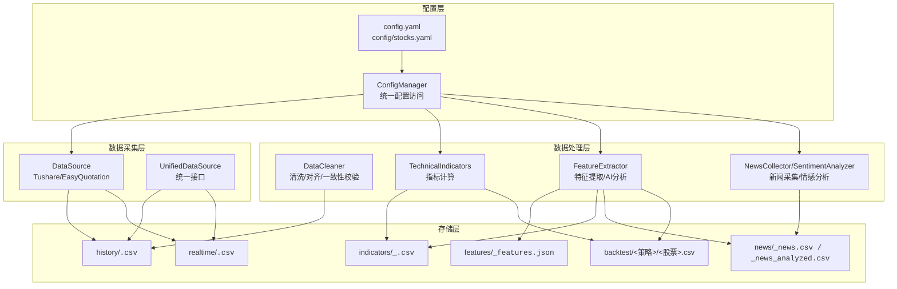
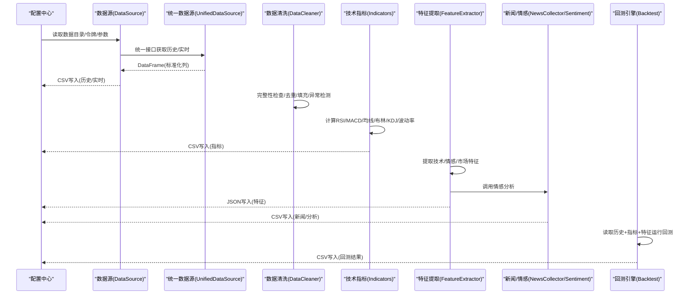
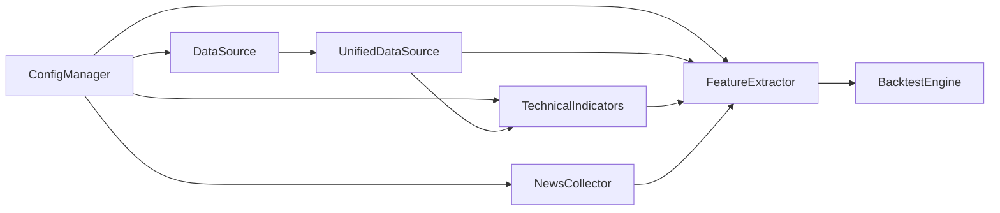

# 数据存储

<cite>
**本文引用的文件**
- [config.yaml](file://config.yaml)
- [config/stocks.yaml](file://config/stocks.yaml)
- [quant_system/config_manager.py](file://quant_system/config_manager.py)
- [quant_system/data_source.py](file://quant_system/data_source.py)
- [quant_system/data_cleaner.py](file://quant_system/data_cleaner.py)
- [quant_system/indicators.py](file://quant_system/indicators.py)
- [quant_system/feature_extractor.py](file://quant_system/feature_extractor.py)
- [quant_system/news_collector.py](file://quant_system/news_collector.py)
- [quant_system/backtest.py](file://quant_system/backtest.py)
- [quant_system/stock_manager.py](file://quant_system/stock_manager.py)
</cite>

## 目录
1. [简介](#简介)
2. [项目结构](#项目结构)
3. [核心组件](#核心组件)
4. [架构总览](#架构总览)
5. [详细组件分析](#详细组件分析)
6. [依赖分析](#依赖分析)
7. [性能考量](#性能考量)
8. [故障排查指南](#故障排查指南)
9. [结论](#结论)
10. [附录](#附录)

## 简介
本文件聚焦于vibequation量化交易系统“数据存储模块”的设计与实现，涵盖数据目录结构、文件命名规范、存储格式、路径管理、缓存与本地存储策略、数据完整性检查、备份与恢复机制、迁移与版本管理最佳实践，以及具体文件操作示例与错误处理机制。目标是帮助开发者与使用者快速理解并高效维护数据层。

## 项目结构
数据存储模块围绕统一的配置中心与各功能模块协作，形成清晰的分层：
- 配置层：集中管理数据目录、API令牌、采集参数等
- 数据采集层：历史数据(Tushare)与实时数据(EasyQuotation)采集
- 数据处理层：清洗、对齐、指标计算、特征提取、情感分析
- 存储层：CSV/JSON文件按功能域落盘，支持增量更新与去重

图表来源
- [config.yaml:10-18](file://config.yaml#L10-L18)
- [quant_system/config_manager.py:39-54](file://quant_system/config_manager.py#L39-L54)
- [quant_system/data_source.py:24-41](file://quant_system/data_source.py#L24-L41)
- [quant_system/indicators.py:21-35](file://quant_system/indicators.py#L21-L35)
- [quant_system/feature_extractor.py:99-113](file://quant_system/feature_extractor.py#L99-L113)
- [quant_system/news_collector.py:24-41](file://quant_system/news_collector.py#L24-L41)
- [quant_system/backtest.py:66-74](file://quant_system/backtest.py#L66-L74)

章节来源
- [config.yaml:10-18](file://config.yaml#L10-L18)
- [quant_system/config_manager.py:39-54](file://quant_system/config_manager.py#L39-L54)

## 核心组件
- 配置管理器：集中读取与确保数据目录存在，提供统一的配置访问接口
- 数据源：封装Tushare历史数据与EasyQuotation实时数据的采集、缓存与落盘
- 数据清洗：完整性检查、去重、缺失值填充、异常值检测、一致性校验
- 技术指标：RSI、MACD、均线、布林带、KDJ、波动率等指标计算与持久化
- 特征提取：技术特征、情感特征、市场特征提取，结合AI分析生成策略类型
- 新闻采集与情感分析：新浪新闻采集、情感打分、按日聚合
- 回测引擎：基于历史数据与指标运行回测，生成回测结果文件

章节来源
- [quant_system/config_manager.py:12-177](file://quant_system/config_manager.py#L12-L177)
- [quant_system/data_source.py:24-423](file://quant_system/data_source.py#L24-L423)
- [quant_system/data_cleaner.py:21-444](file://quant_system/data_cleaner.py#L21-L444)
- [quant_system/indicators.py:21-500](file://quant_system/indicators.py#L21-L500)
- [quant_system/feature_extractor.py:99-405](file://quant_system/feature_extractor.py#L99-L405)
- [quant_system/news_collector.py:24-465](file://quant_system/news_collector.py#L24-L465)
- [quant_system/backtest.py:66-456](file://quant_system/backtest.py#L66-L456)

## 架构总览
数据流自上而下：配置驱动采集，采集落地CSV；处理阶段进行清洗与指标计算；特征与情感分析进一步丰富数据；最终回测引擎消费这些数据并产出回测报告与结果文件。

图表来源
- [quant_system/data_source.py:300-423](file://quant_system/data_source.py#L300-L423)
- [quant_system/data_cleaner.py:21-286](file://quant_system/data_cleaner.py#L21-L286)
- [quant_system/indicators.py:188-328](file://quant_system/indicators.py#L188-L328)
- [quant_system/feature_extractor.py:190-321](file://quant_system/feature_extractor.py#L190-L321)
- [quant_system/news_collector.py:402-458](file://quant_system/news_collector.py#L402-L458)
- [quant_system/backtest.py:75-282](file://quant_system/backtest.py#L75-L282)

## 详细组件分析

### 数据目录结构与命名规范
- 历史数据 history
  - 文件名：<code>_daily.csv>，CSV格式，列标准化为code、date、open、high、low、close、volume、amount
  - 用途：日线/周线/月线历史数据，支持增量更新与去重
- 实时数据 realtime
  - 文件名：<code>.csv> 或带时间戳的<code>_<timestamp>.csv>，CSV格式
  - 用途：实时行情快照，便于离线分析与对比
- 技术指标 indicators
  - 文件名：<code>_<freq>.csv>，CSV格式，包含RSI、MACD、均线、布林带、KDJ、波动率等
  - 用途：策略决策与可视化
- 特征 features
  - 文件名：<code>_features.json>，JSON格式，包含技术特征、情感特征、市场特征及AI分析结果
  - 用途：策略类型分类与推荐
- 新闻 news
  - 文件名：<code>_news.csv>（原始）、<code>_news_analyzed.csv>（含情感分析）
  - 用途：情感分析与事件驱动策略
- 回测 backtest
  - 文件名：<策略>/<股票>.csv，CSV格式，包含交易明细、净值曲线、统计指标
  - 用途：回测结果归档与复盘

章节来源
- [config.yaml:10-18](file://config.yaml#L10-L18)
- [quant_system/data_source.py:34-40](file://quant_system/data_source.py#L34-L40)
- [quant_system/indicators.py:33-35](file://quant_system/indicators.py#L33-L35)
- [quant_system/feature_extractor.py:111-113](file://quant_system/feature_extractor.py#L111-L113)
- [quant_system/news_collector.py:39-41](file://quant_system/news_collector.py#L39-L41)
- [quant_system/backtest.py:69-74](file://quant_system/backtest.py#L69-L74)

### 数据路径管理机制
- 统一入口
  - 配置中心提供 data_dirs 字典，包含 data、history、realtime、news、indicators、features、backtest 等目录
  - DataSource基类提供 _ensure_dir、_get_history_path、_get_realtime_path 等辅助方法
- 历史数据路径
  - 规范：<code>_daily.csv>，便于按股票维度检索与批量处理
- 实时数据路径
  - 规范：<code>.csv> 或带时间戳的<code>_<timestamp>.csv>，便于区分不同采集时刻
- 指标/特征/新闻/回测路径
  - 指标：<code>_<freq>.csv>，freq支持day/week/month
  - 特征：<code>_features.json>
  - 新闻：<code>_news.csv> 与 <code>_news_analyzed.csv>
  - 回测：<策略>/<股票>.csv>

章节来源
- [quant_system/config_manager.py:121-131](file://quant_system/config_manager.py#L121-L131)
- [quant_system/data_source.py:30-41](file://quant_system/data_source.py#L30-L41)
- [quant_system/indicators.py:33-35](file://quant_system/indicators.py#L33-L35)
- [quant_system/feature_extractor.py:111-113](file://quant_system/feature_extractor.py#L111-L113)
- [quant_system/news_collector.py:39-41](file://quant_system/news_collector.py#L39-L41)
- [quant_system/backtest.py:69-74](file://quant_system/backtest.py#L69-L74)

### 数据缓存策略与本地存储
- 历史数据缓存
  - 本地优先：若存在本地文件且最新日期满足需求，则直接读取
  - 增量更新：若本地存在旧数据且需要更新，先读取旧数据，再合并新数据并去重
  - 保存策略：每次成功获取后写入CSV，列标准化，便于后续处理
- 实时数据缓存
  - 采集时生成带时间戳的文件名，便于保留多时刻快照
- 指标/特征/新闻
  - 指标：按日/周/月频率分别保存，便于跨时间框架比较
  - 特征：JSON格式，便于与AI分析结果结合
  - 新闻：原始与分析两套文件，便于审计与复核

章节来源
- [quant_system/data_source.py:90-131](file://quant_system/data_source.py#L90-L131)
- [quant_system/data_source.py:244-253](file://quant_system/data_source.py#L244-L253)
- [quant_system/indicators.py:275-304](file://quant_system/indicators.py#L275-L304)
- [quant_system/feature_extractor.py:285-299](file://quant_system/feature_extractor.py#L285-L299)
- [quant_system/news_collector.py:156-166](file://quant_system/news_collector.py#L156-L166)

### 数据完整性检查与质量保障
- 完整性检查
  - 必需列检查、缺失值统计、重复日期检测、日期断层识别
- 一致性校验
  - OHLC价格一致性、异常跳涨跌幅、零成交量天数
- 清洗流程
  - 去重 → 排序 → 缺失值填充（价格前向/后向/插值，成交量/金额0填充）→ 可选异常值替换
- 报告生成
  - 输出清洗前后对比与一致性检查摘要

章节来源
- [quant_system/data_cleaner.py:27-80](file://quant_system/data_cleaner.py#L27-L80)
- [quant_system/data_cleaner.py:287-338](file://quant_system/data_cleaner.py#L287-L338)
- [quant_system/data_cleaner.py:244-286](file://quant_system/data_cleaner.py#L244-L286)

### 备份与恢复机制
- 建议策略
  - 历史数据与指标：按季度/年度打包压缩，保留最近N个版本
  - 特征与新闻：定期导出为备份集，配合版本控制
  - 回测结果：保留关键策略与股票组合的回测报告
- 恢复流程
  - 从备份集解压至对应目录
  - 校验文件完整性（列名、日期范围、重复）
  - 重新计算缺失的中间产物（如指标、特征）

[本节为通用建议，不直接分析特定文件，故无章节来源]

### 数据迁移与版本管理最佳实践
- 迁移步骤
  - 备份现有数据目录
  - 更新配置文件中的目录路径
  - 执行迁移脚本：重命名文件、调整列名、修正时间格式
  - 重新计算指标与特征
  - 校验迁移结果
- 版本管理
  - 使用Git或SVN管理配置文件与脚本
  - 数据文件不纳入版本控制，仅保留配置与元数据
  - 通过批处理脚本自动化迁移与校验

[本节为通用建议，不直接分析特定文件，故无章节来源]

### 文件操作示例与错误处理
- 读取历史数据
  - 通过统一接口获取并标准化列名，再按日期范围过滤
- 保存指标
  - 计算完成后写入CSV，注意编码与日期解析
- 保存特征
  - JSON写入，包含提取时间与AI分析结果
- 保存新闻
  - 合并旧数据并去重，再写入CSV
- 错误处理
  - 网络请求异常、解析异常、文件IO异常均记录日志并抛出
  - 对于可恢复场景（如网络超时），重试与退避策略

章节来源
- [quant_system/data_source.py:322-335](file://quant_system/data_source.py#L322-L335)
- [quant_system/indicators.py:275-304](file://quant_system/indicators.py#L275-L304)
- [quant_system/feature_extractor.py:285-299](file://quant_system/feature_extractor.py#L285-L299)
- [quant_system/news_collector.py:156-166](file://quant_system/news_collector.py#L156-L166)

## 依赖分析
- 配置依赖
  - 所有模块通过配置中心获取数据目录与参数，避免硬编码
- 模块耦合
  - 数据源与统一接口解耦，便于扩展新数据源
  - 指标与特征模块依赖数据源与股票管理器
  - 回测引擎依赖指标与策略模块
- 外部依赖
  - pandas/numpy用于数据处理
  - tushare/easyquotation用于数据采集
  - requests/BeautifulSoup用于新闻采集

图表来源
- [quant_system/config_manager.py:121-131](file://quant_system/config_manager.py#L121-L131)
- [quant_system/data_source.py:300-306](file://quant_system/data_source.py#L300-L306)
- [quant_system/indicators.py:188-205](file://quant_system/indicators.py#L188-L205)
- [quant_system/feature_extractor.py:190-211](file://quant_system/feature_extractor.py#L190-L211)
- [quant_system/backtest.py:75-103](file://quant_system/backtest.py#L75-L103)

章节来源
- [quant_system/config_manager.py:12-177](file://quant_system/config_manager.py#L12-L177)
- [quant_system/data_source.py:24-423](file://quant_system/data_source.py#L24-L423)
- [quant_system/indicators.py:21-500](file://quant_system/indicators.py#L21-L500)
- [quant_system/feature_extractor.py:99-405](file://quant_system/feature_extractor.py#L99-L405)
- [quant_system/backtest.py:66-456](file://quant_system/backtest.py#L66-L456)

## 性能考量
- 采集限速
  - Tushare数据源内置速率限制，避免触发平台限流
- 批量处理
  - 统一接口支持批量更新历史与指标，减少重复IO
- 数据对齐
  - 多股票数据对齐时采用滚动窗口与前向填充，兼顾性能与准确性
- 存储优化
  - CSV列标准化与数值类型转换，降低内存占用
  - 指标按频率分文件存储，便于按需加载

[本节为通用指导，不直接分析特定文件，故无章节来源]

## 故障排查指南
- 常见问题
  - Tushare Token未配置或失效：检查配置文件与网络连通性
  - 文件读取失败：确认路径存在、权限足够、编码正确
  - 数据为空：检查采集是否成功、日期范围是否合理
- 排查步骤
  - 查看日志文件定位异常点
  - 使用数据完整性检查工具验证CSV结构
  - 重新执行增量更新或全量刷新
- 建议
  - 定期巡检数据目录与文件数量
  - 对关键文件建立校验和或版本号

章节来源
- [quant_system/data_source.py:46-50](file://quant_system/data_source.py#L46-L50)
- [quant_system/data_cleaner.py:27-80](file://quant_system/data_cleaner.py#L27-L80)

## 结论
数据存储模块通过统一配置、清晰的目录结构、严格的命名规范与完善的缓存/清洗/校验机制，构建了稳定可靠的数据基础设施。结合回测引擎与特征提取，实现了从数据采集到策略验证的闭环。建议持续完善备份与迁移流程，确保数据资产的长期可用性与可追溯性。

## 附录
- 关键路径与文件
  - 历史数据：data/history/<code>_daily.csv
  - 实时数据：data/realtime/<code>.csv 或 <code>_<timestamp>.csv
  - 指标：data/indicators/<code>_<freq>.csv
  - 特征：data/features/<code>_features.json
  - 新闻：data/news/<code>_news.csv 与 <code>_news_analyzed.csv
  - 回测：data/backtest/<策略>/<股票>.csv

[本节为概览总结，不直接分析特定文件，故无章节来源]