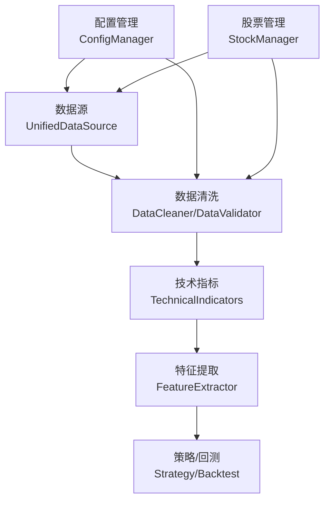
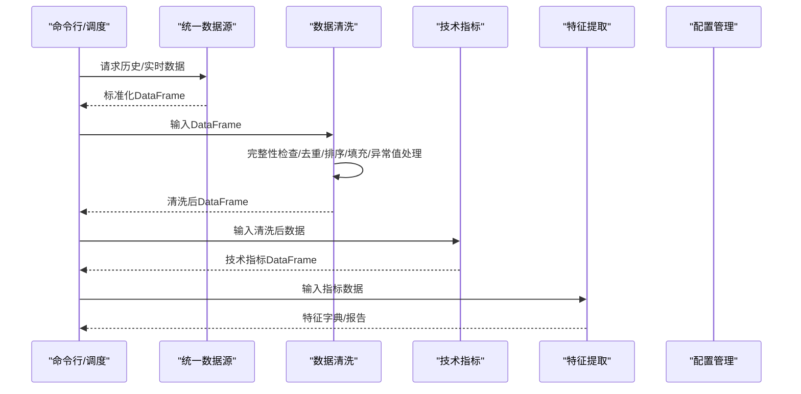
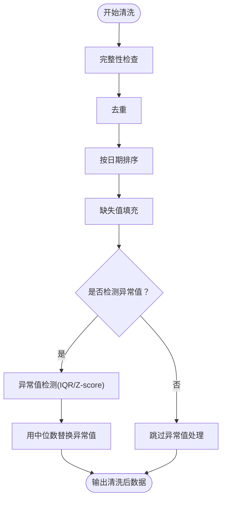
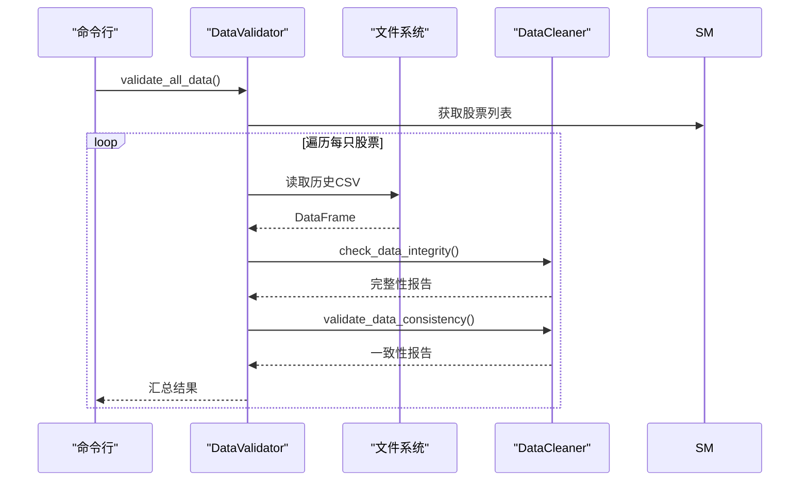
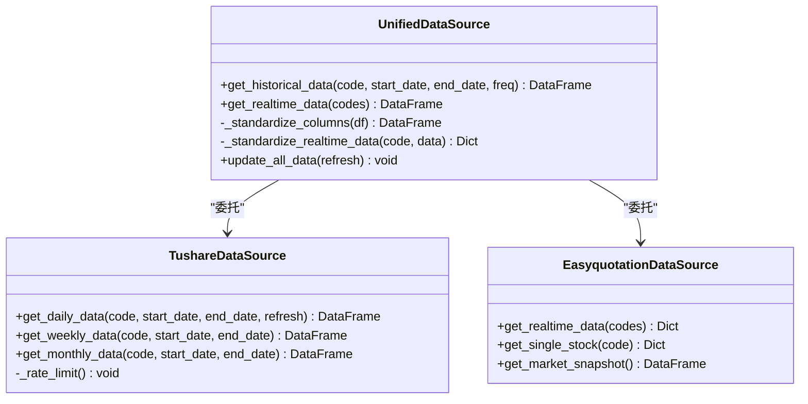
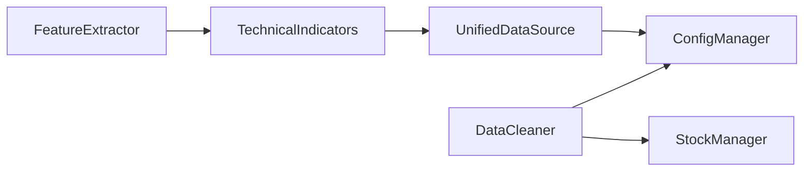

# 数据清洗

<cite>
**本文引用的文件**
- [quant_system/data_cleaner.py](file://quant_system/data_cleaner.py)
- [quant_system/data_source.py](file://quant_system/data_source.py)
- [quant_system/config_manager.py](file://quant_system/config_manager.py)
- [quant_system/stock_manager.py](file://quant_system/stock_manager.py)
- [quant_system/indicators.py](file://quant_system/indicators.py)
- [quant_system/feature_extractor.py](file://quant_system/feature_extractor.py)
- [config.yaml](file://config.yaml)
- [config/stocks.yaml](file://config/stocks.yaml)
- [main.py](file://main.py)
</cite>

## 目录
1. [简介](#简介)
2. [项目结构](#项目结构)
3. [核心组件](#核心组件)
4. [架构总览](#架构总览)
5. [详细组件分析](#详细组件分析)
6. [依赖分析](#依赖分析)
7. [性能考量](#性能考量)
8. [故障排查指南](#故障排查指南)
9. [结论](#结论)
10. [附录](#附录)

## 简介
本文件面向vibequation量化交易系统中的“数据清洗”模块，系统性阐述数据质量保证机制与流程，覆盖缺失值处理、异常值检测、数据格式标准化、重复数据去重、数据类型转换、时间序列对齐、数据验证规则与质量检查、数据标准化处理、配置选项与自定义规则、常见问题识别与处理方案，以及清洗效果评估方法。目标是帮助开发者与使用者在不深入源码的前提下，理解并高效运用数据清洗能力，确保后续特征工程、技术指标计算与策略回测的输入数据具备高质量与一致性。

## 项目结构
数据清洗模块位于quant_system子系统内，与数据源、配置管理、股票管理、技术指标与特征提取等模块协同工作。整体数据流从统一数据源采集，经标准化与清洗，再进入指标计算与特征提取，最终支撑策略运行与回测。

图表来源
- [quant_system/data_source.py:300-423](file://quant_system/data_source.py#L300-L423)
- [quant_system/data_cleaner.py:21-444](file://quant_system/data_cleaner.py#L21-L444)
- [quant_system/indicators.py:21-500](file://quant_system/indicators.py#L21-L500)
- [quant_system/feature_extractor.py:99-405](file://quant_system/feature_extractor.py#L99-L405)
- [quant_system/config_manager.py:121-178](file://quant_system/config_manager.py#L121-L178)
- [quant_system/stock_manager.py:62-278](file://quant_system/stock_manager.py#L62-L278)

章节来源
- [quant_system/data_cleaner.py:21-444](file://quant_system/data_cleaner.py#L21-L444)
- [quant_system/data_source.py:300-423](file://quant_system/data_source.py#L300-L423)
- [quant_system/config_manager.py:121-178](file://quant_system/config_manager.py#L121-L178)
- [quant_system/stock_manager.py:62-278](file://quant_system/stock_manager.py#L62-L278)

## 核心组件
- DataCleaner：提供数据完整性检查、缺失值填充、重复数据去重、异常值检测、OHLC一致性校验、清洗前后对比报告生成等能力。
- DataValidator：批量验证所有股票数据的质量状态，汇总完整性与一致性检查结果。
- UnifiedDataSource：统一历史与实时数据源，负责数据标准化（列名映射、必要列补齐），为清洗提供标准化输入。
- ConfigManager：集中管理配置项，包括数据目录、技术指标参数、回测与风控配置等，为清洗与后续模块提供参数依据。
- StockManager：维护股票/板块/指数清单及其代码格式，为数据源与清洗提供上下文信息。

章节来源
- [quant_system/data_cleaner.py:21-444](file://quant_system/data_cleaner.py#L21-L444)
- [quant_system/data_source.py:300-423](file://quant_system/data_source.py#L300-L423)
- [quant_system/config_manager.py:121-178](file://quant_system/config_manager.py#L121-L178)
- [quant_system/stock_manager.py:62-278](file://quant_system/stock_manager.py#L62-L278)

## 架构总览
数据从统一数据源采集并标准化后，进入数据清洗模块；清洗完成后，进入技术指标计算与特征提取，最终服务于策略与回测。配置管理贯穿始终，提供参数与目录路径。

图表来源
- [quant_system/data_source.py:300-423](file://quant_system/data_source.py#L300-L423)
- [quant_system/data_cleaner.py:244-285](file://quant_system/data_cleaner.py#L244-L285)
- [quant_system/indicators.py:188-273](file://quant_system/indicators.py#L188-L273)
- [quant_system/feature_extractor.py:190-211](file://quant_system/feature_extractor.py#L190-L211)

## 详细组件分析

### 数据清洗器 DataCleaner
- 数据完整性检查
  - 必需列校验（默认包含日期与OHLCV）
  - 缺失值统计
  - 重复日期计数
  - 日期断层检测（基于相邻交易日间隔阈值）
- 缺失值处理
  - 价格列（开盘/最高/最低/收盘）：支持前向填充、后向填充、插值
  - 成交量/成交额：0填充
- 重复数据去重
  - 默认按日期去重，保留最后一条
- 异常值检测
  - IQR法与Z-score法两种可选
  - 可配置检测列与阈值
- 数据一致性验证
  - OHLC内在关系校验（high≥low；high≥open/close；low≤open/close）
  - 价格跳空检测（基于收盘价涨跌幅阈值）
  - 零成交量天数统计
- 时间序列对齐
  - 多股票数据对齐至统一日期网格，缺失值按策略填充
- 清洗流程
  - 完整性检查→去重→排序→缺失值填充→异常值处理（可选）
- 报告生成
  - 输出清洗前后对比与一致性检查摘要

图表来源
- [quant_system/data_cleaner.py:244-285](file://quant_system/data_cleaner.py#L244-L285)
- [quant_system/data_cleaner.py:205-242](file://quant_system/data_cleaner.py#L205-L242)

章节来源
- [quant_system/data_cleaner.py:27-80](file://quant_system/data_cleaner.py#L27-L80)
- [quant_system/data_cleaner.py:82-114](file://quant_system/data_cleaner.py#L82-L114)
- [quant_system/data_cleaner.py:116-138](file://quant_system/data_cleaner.py#L116-L138)
- [quant_system/data_cleaner.py:140-161](file://quant_system/data_cleaner.py#L140-L161)
- [quant_system/data_cleaner.py:163-203](file://quant_system/data_cleaner.py#L163-L203)
- [quant_system/data_cleaner.py:205-242](file://quant_system/data_cleaner.py#L205-L242)
- [quant_system/data_cleaner.py:244-285](file://quant_system/data_cleaner.py#L244-L285)
- [quant_system/data_cleaner.py:287-338](file://quant_system/data_cleaner.py#L287-L338)
- [quant_system/data_cleaner.py:340-387](file://quant_system/data_cleaner.py#L340-L387)

### 数据验证器 DataValidator
- 批量验证所有股票历史数据
- 读取本地CSV，执行完整性与一致性检查
- 汇总状态（有效/无效/缺失/错误）

图表来源
- [quant_system/data_cleaner.py:396-438](file://quant_system/data_cleaner.py#L396-L438)
- [quant_system/stock_manager.py:95-128](file://quant_system/stock_manager.py#L95-L128)

章节来源
- [quant_system/data_cleaner.py:390-438](file://quant_system/data_cleaner.py#L390-L438)

### 统一数据源 UnifiedDataSource
- 历史数据标准化
  - 列名映射：ts_code→code、trade_date→date、vol→volume等
  - 必需列补齐（若缺失则填充None）
  - 返回标准OHLCV结构
- 实时数据标准化
  - 统一字段：code/name/price/open/high/low/close/volume/bid1/ask1/time
- 历史数据更新与缓存合并
  - 增量更新：合并旧数据与新拉取数据，去重
  - 速率限制：Tushare接口请求节流

图表来源
- [quant_system/data_source.py:300-423](file://quant_system/data_source.py#L300-L423)
- [quant_system/data_source.py:43-186](file://quant_system/data_source.py#L43-L186)
- [quant_system/data_source.py:223-298](file://quant_system/data_source.py#L223-L298)

章节来源
- [quant_system/data_source.py:357-378](file://quant_system/data_source.py#L357-L378)
- [quant_system/data_source.py:380-394](file://quant_system/data_source.py#L380-L394)
- [quant_system/data_source.py:43-186](file://quant_system/data_source.py#L43-L186)
- [quant_system/data_source.py:223-298](file://quant_system/data_source.py#L223-L298)

### 技术指标与特征提取对清洗的依赖
- 技术指标计算前会确保数值列类型正确（数值化），清洗阶段也提供类型转换与缺失值填充，二者互补
- 特征提取依赖指标结果，清洗保证了输入数据的稳定性与一致性

章节来源
- [quant_system/indicators.py:211-216](file://quant_system/indicators.py#L211-L216)
- [quant_system/feature_extractor.py:115-140](file://quant_system/feature_extractor.py#L115-L140)

## 依赖分析
- 内部耦合
  - DataCleaner依赖ConfigManager提供的数据目录与全局配置
  - DataCleaner依赖StockManager获取股票名称用于报告生成
  - UnifiedDataSource在标准化阶段为DataCleaner提供一致的输入
- 外部依赖
  - pandas/numpy用于数据结构与数值计算
  - tushare/easyquotation用于数据采集
- 潜在循环依赖
  - 当前模块间为单向依赖，未发现循环导入

图表来源
- [quant_system/data_cleaner.py:15-16](file://quant_system/data_cleaner.py#L15-L16)
- [quant_system/data_source.py:17-18](file://quant_system/data_source.py#L17-L18)
- [quant_system/indicators.py:14-16](file://quant_system/indicators.py#L14-L16)
- [quant_system/feature_extractor.py:16-18](file://quant_system/feature_extractor.py#L16-L18)

章节来源
- [quant_system/data_cleaner.py:15-16](file://quant_system/data_cleaner.py#L15-L16)
- [quant_system/data_source.py:17-18](file://quant_system/data_source.py#L17-L18)
- [quant_system/indicators.py:14-16](file://quant_system/indicators.py#L14-L16)
- [quant_system/feature_extractor.py:16-18](file://quant_system/feature_extractor.py#L16-L18)

## 性能考量
- 缺失值填充
  - 前向/后向填充与插值的时间复杂度与数据长度线性相关；对长序列建议优先使用前向填充以降低计算开销
- 异常值检测
  - IQR法与Z-score法均为O(n)，但IQR法对极端值更稳健；Z-score法受均值/方差影响较大
- 对齐与合并
  - 多股票对齐涉及集合运算与多次merge，建议控制同时对齐的股票数量或分批处理
- IO与缓存
  - 增量更新与本地缓存可显著减少重复下载；注意磁盘IO与文件锁

## 故障排查指南
- 数据完整性检查失败
  - 缺失列：确认数据源标准化是否成功（列名映射与必需列补齐）
  - 重复日期：检查去重策略与时间戳格式
  - 日期断层：确认是否为节假日导致的自然断层，或数据源缺失
- 缺失值填充异常
  - 价格列插值可能产生NaN，建议结合前向/后向填充策略
  - 成交量/成交额0填充合理，但需关注极端情况下的业务含义
- 异常值处理
  - IQR/Z-score阈值可根据市场波动性调整；对高波动股票可提高阈值
  - 异常值替换为中位数可降低对统计指标的影响
- OHLC一致性错误
  - 检查原始数据是否包含非法OHLC组合；必要时人工核查或回退到原始数据源
- 报告生成
  - 若股票名称为空，使用代码替代；确保StockManager配置正确

章节来源
- [quant_system/data_cleaner.py:27-80](file://quant_system/data_cleaner.py#L27-L80)
- [quant_system/data_cleaner.py:287-338](file://quant_system/data_cleaner.py#L287-L338)
- [quant_system/data_cleaner.py:340-387](file://quant_system/data_cleaner.py#L340-L387)
- [quant_system/data_source.py:357-378](file://quant_system/data_source.py#L357-L378)

## 结论
数据清洗模块通过系统化的完整性检查、缺失值处理、重复数据去重、异常值检测与OHLC一致性校验，确保了后续技术指标与特征提取的输入质量。配合统一数据源的标准化与增量更新机制，形成了从采集到清洗再到分析的闭环。建议在实际部署中：
- 明确缺失值与异常值策略，并结合业务场景调整阈值
- 在大规模多股票对齐时采用分批策略
- 定期运行DataValidator进行批量质量监控
- 将清洗报告纳入CI/CD质量门禁，保障数据质量

## 附录

### 数据清洗流程配置与自定义规则
- 配置项来源
  - 数据目录：由ConfigManager集中管理，确保历史/实时/指标/特征/回测等目录存在
  - 技术指标参数：RSI/MACD/MA等周期与时间框架
  - 回测/风控参数：初始资金、手续费、滑点、风控阈值等
- 自定义规则建议
  - 缺失值策略：针对不同列设定不同的填充方法（如成交量用0，价格用ffill）
  - 异常值阈值：根据市场波动性动态调整（IQR倍数或Z-score阈值）
  - 一致性检查：可扩展更多业务规则（如涨跌停限制、换手率异常等）
  - 报告维度：增加更多统计指标（偏度、峰度、分位数等）

章节来源
- [quant_system/config_manager.py:121-178](file://quant_system/config_manager.py#L121-L178)
- [config.yaml:11-88](file://config.yaml#L11-L88)
- [config/stocks.yaml:1-71](file://config/stocks.yaml#L1-L71)

### 常见数据质量问题与处理方案
- 缺失列
  - 处理：在数据源标准化阶段补齐；清洗阶段记录缺失列并报警
- 缺失值
  - 处理：价格列前向/后向填充或插值；成交量/成交额0填充
- 重复日期
  - 处理：按日期去重，保留最后一条
- 日期断层
  - 处理：识别断层区间，结合业务需求决定是否填补或忽略
- OHLC不一致
  - 处理：检查并修正非法组合，必要时回溯原始数据
- 价格跳空
  - 处理：标记跳空位置，结合异常值策略处理
- 零成交量
  - 处理：统计零成交量天数，评估对策略的影响

章节来源
- [quant_system/data_cleaner.py:27-80](file://quant_system/data_cleaner.py#L27-L80)
- [quant_system/data_cleaner.py:287-338](file://quant_system/data_cleaner.py#L287-L338)

### 数据清洗效果评估方法
- 清洗前后对比报告
  - 总记录数、缺失列、缺失值、重复日期的变化
- 一致性检查
  - OHLC一致性、价格跳空数量、零成交量天数
- 批量验证
  - DataValidator对所有股票数据进行批量质量评估，输出状态与错误明细

章节来源
- [quant_system/data_cleaner.py:340-387](file://quant_system/data_cleaner.py#L340-L387)
- [quant_system/data_cleaner.py:396-438](file://quant_system/data_cleaner.py#L396-L438)
- [main.py:184-215](file://main.py#L184-L215)