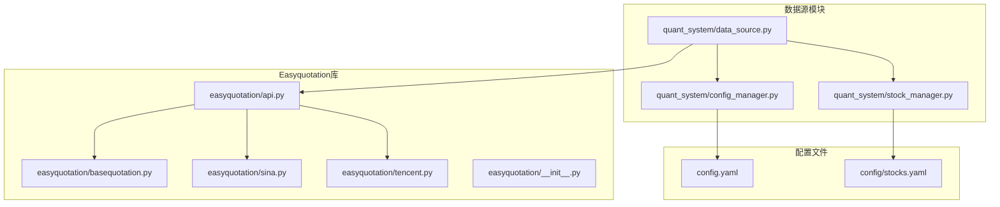
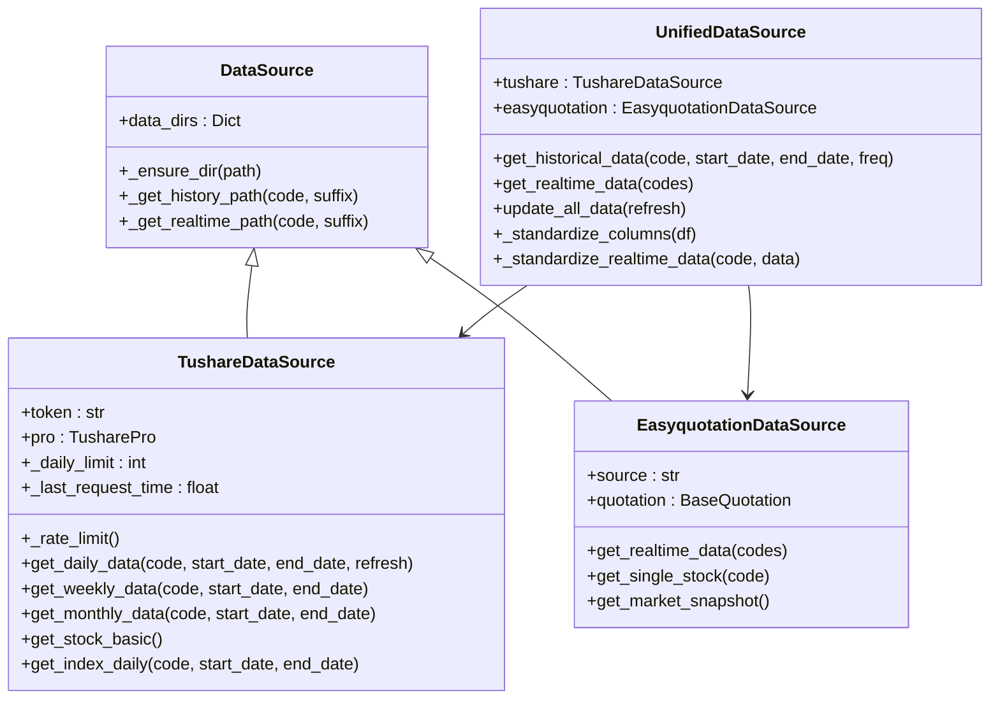
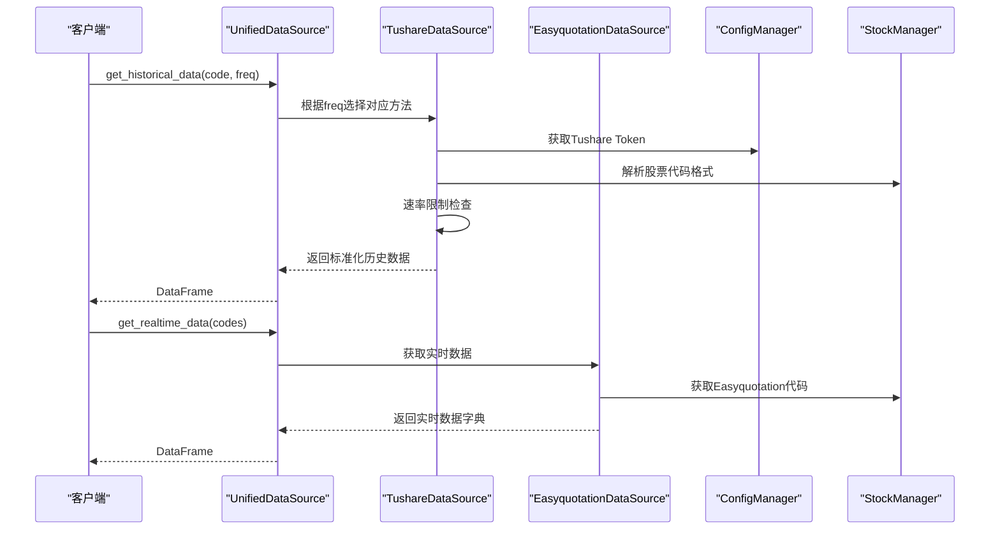
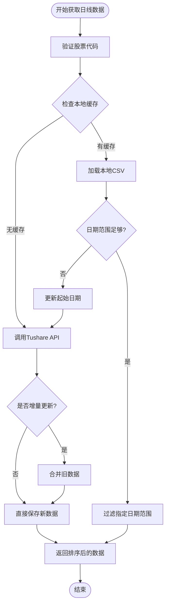
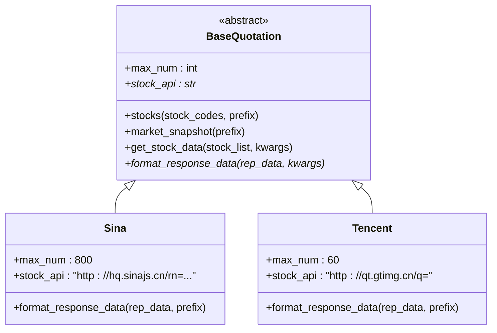
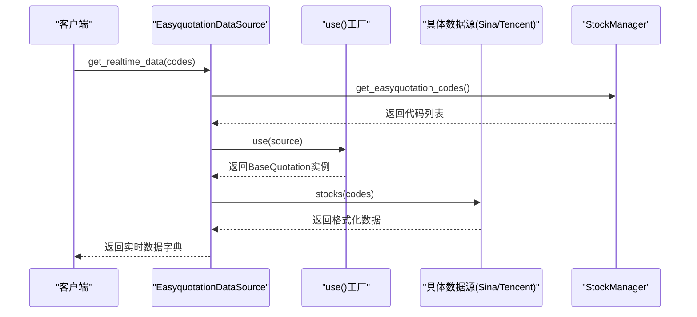
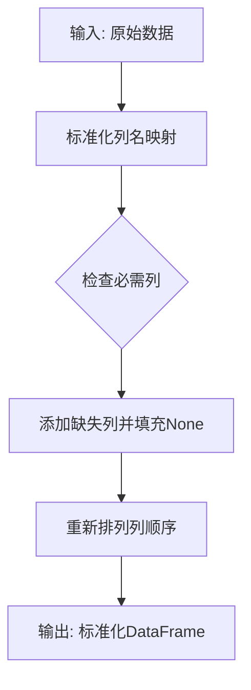
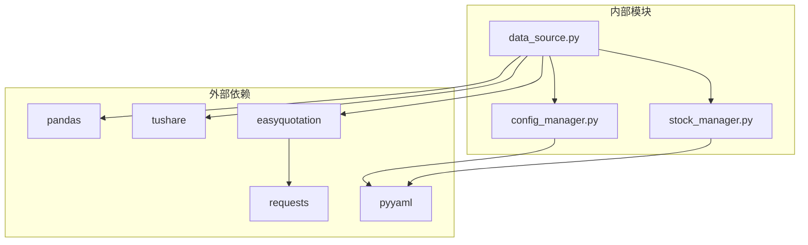

# 数据源管理

<cite>
**本文引用的文件**
- [quant_system/data_source.py](file://quant_system/data_source.py)
- [quant_system/config_manager.py](file://quant_system/config_manager.py)
- [quant_system/stock_manager.py](file://quant_system/stock_manager.py)
- [config.yaml](file://config.yaml)
- [config/stocks.yaml](file://config/stocks.yaml)
- [easyquotation/__init__.py](file://easyquotation/__init__.py)
- [easyquotation/api.py](file://easyquotation/api.py)
- [easyquotation/basequotation.py](file://easyquotation/basequotation.py)
- [easyquotation/sina.py](file://easyquotation/sina.py)
- [easyquotation/tencent.py](file://easyquotation/tencent.py)
- [requirements.txt](file://requirements.txt)
- [main.py](file://main.py)
</cite>

## 目录
1. [简介](#简介)
2. [项目结构](#项目结构)
3. [核心组件](#核心组件)
4. [架构概览](#架构概览)
5. [详细组件分析](#详细组件分析)
6. [依赖分析](#依赖分析)
7. [性能考虑](#性能考虑)
8. [故障排除指南](#故障排除指南)
9. [结论](#结论)
10. [附录](#附录)

## 简介
本文件详细介绍vibequation量化交易系统中的数据源管理模块，涵盖Tushare和Easyquotation两个数据源的集成实现。文档重点说明：
- 数据源基类设计与继承关系
- 统一接口设计理念与使用方法
- TushareDataSource的历史数据获取功能（日线、周线、月线）
- EasyquotationDataSource的实时数据获取机制（多数据源支持）
- 数据源配置、API令牌设置、速率限制机制和错误处理策略
- 具体的使用场景和代码示例路径

## 项目结构
数据源管理模块位于quant_system目录下，主要文件包括数据源实现、配置管理、股票代码管理以及Easyquotation库的适配层。

**图表来源**
- [quant_system/data_source.py:1-423](file://quant_system/data_source.py#L1-L423)
- [quant_system/config_manager.py:1-178](file://quant_system/config_manager.py#L1-L178)
- [quant_system/stock_manager.py:1-278](file://quant_system/stock_manager.py#L1-L278)
- [easyquotation/api.py:1-23](file://easyquotation/api.py#L1-L23)

**章节来源**
- [quant_system/data_source.py:1-423](file://quant_system/data_source.py#L1-L423)
- [quant_system/config_manager.py:1-178](file://quant_system/config_manager.py#L1-L178)
- [quant_system/stock_manager.py:1-278](file://quant_system/stock_manager.py#L1-L278)
- [config.yaml:1-88](file://config.yaml#L1-L88)
- [config/stocks.yaml:1-71](file://config/stocks.yaml#L1-L71)

## 核心组件
数据源管理模块由三个核心类组成：DataSource（基类）、TushareDataSource（历史数据）、EasyquotationDataSource（实时数据），以及统一接口UnifiedDataSource。

**图表来源**
- [quant_system/data_source.py:24-423](file://quant_system/data_source.py#L24-L423)

**章节来源**
- [quant_system/data_source.py:24-423](file://quant_system/data_source.py#L24-L423)

## 架构概览
数据源管理采用分层架构设计，通过统一接口UnifiedDataSource对外提供一致的数据访问能力。

**图表来源**
- [quant_system/data_source.py:300-423](file://quant_system/data_source.py#L300-L423)

## 详细组件分析

### TushareDataSource历史数据获取
TushareDataSource负责从Tushare Pro API获取历史数据，支持日线、周线、月线等多种时间频率。

#### 核心功能特性
- **速率限制机制**：每分钟最多500次请求，约每0.12秒1次
- **智能缓存策略**：支持本地缓存和增量更新
- **多格式代码支持**：自动识别和转换股票代码格式
- **异常处理**：完善的错误捕获和日志记录

#### 方法详解

##### 日线数据获取

**图表来源**
- [quant_system/data_source.py:64-136](file://quant_system/data_source.py#L64-L136)

##### 周线和月线数据获取
周线和月线数据获取流程与日线类似，但使用不同的API端点：
- 周线：调用`pro.weekly()`方法
- 月线：调用`pro.monthly()`方法
- 指数日线：调用`pro.index_daily()`方法

**章节来源**
- [quant_system/data_source.py:64-221](file://quant_system/data_source.py#L64-L221)

### EasyquotationDataSource实时数据获取
EasyquotationDataSource基于Easyquotation库，支持多个实时数据源，包括新浪、腾讯等。

#### 多数据源支持

**图表来源**
- [easyquotation/basequotation.py:12-122](file://easyquotation/basequotation.py#L12-L122)
- [easyquotation/sina.py:8-79](file://easyquotation/sina.py#L8-L79)
- [easyquotation/tencent.py:9-109](file://easyquotation/tencent.py#L9-L109)

#### 实时数据获取流程

**图表来源**
- [quant_system/data_source.py:223-298](file://quant_system/data_source.py#L223-L298)
- [easyquotation/api.py:7-22](file://easyquotation/api.py#L7-L22)

**章节来源**
- [quant_system/data_source.py:223-298](file://quant_system/data_source.py#L223-L298)
- [easyquotation/api.py:1-23](file://easyquotation/api.py#L1-L23)
- [easyquotation/basequotation.py:1-122](file://easyquotation/basequotation.py#L1-L122)

### UnifiedDataSource统一接口
UnifiedDataSource作为统一数据源接口，提供一致的API给上层应用使用。

#### 设计理念
- **抽象统一**：隐藏底层数据源差异，提供统一的接口
- **标准化输出**：将不同数据源的数据格式标准化为统一的DataFrame
- **扩展性**：易于添加新的数据源实现

#### 标准化流程

**图表来源**
- [quant_system/data_source.py:357-394](file://quant_system/data_source.py#L357-L394)

**章节来源**
- [quant_system/data_source.py:300-423](file://quant_system/data_source.py#L300-L423)

## 依赖分析
数据源管理模块的依赖关系清晰，遵循单一职责原则和依赖倒置原则。

**图表来源**
- [requirements.txt:1-33](file://requirements.txt#L1-L33)
- [quant_system/data_source.py:13-18](file://quant_system/data_source.py#L13-L18)

**章节来源**
- [requirements.txt:1-33](file://requirements.txt#L1-L33)
- [quant_system/data_source.py:13-18](file://quant_system/data_source.py#L13-L18)

## 性能考虑
数据源管理模块在性能方面采用了多项优化措施：

### 速率限制与并发控制
- **Tushare速率限制**：每分钟500次请求，约每0.12秒1次
- **Easyquotation并发**：BaseQuotation使用线程池进行并发请求
- **批量请求优化**：Sina支持最多800只股票/批，Tencent支持最多60只股票/批

### 缓存策略
- **本地缓存**：历史数据自动缓存到CSV文件
- **增量更新**：仅获取缺失日期的数据
- **智能合并**：避免重复数据

### 内存优化
- **流式处理**：大数据集按需读取
- **列裁剪**：仅保留必要列
- **类型优化**：合理的数据类型选择

## 故障排除指南

### 常见问题与解决方案

#### Tushare Token配置错误
**问题症状**：初始化TushareDataSource时报错，提示Token未配置
**解决方法**：检查config.yaml中的tokens.tushare_token配置项

#### 股票代码格式不匹配
**问题症状**：get_daily_data抛出"未知的股票代码"错误
**解决方法**：确认股票代码格式正确，支持多种格式（600519, sh600519, 600519.SH）

#### API请求超时
**问题症状**：get_realtime_data或get_daily_data出现网络超时
**解决方法**：检查网络连接，适当增加请求间隔

#### 数据为空
**问题症状**：获取的数据DataFrame为空
**解决方法**：检查日期范围设置，确认目标股票在Tushare数据库中存在

**章节来源**
- [quant_system/data_source.py:46-52](file://quant_system/data_source.py#L46-L52)
- [quant_system/data_source.py:81-82](file://quant_system/data_source.py#L81-L82)

## 结论
vibequation量化交易系统的数据源管理模块实现了以下关键特性：
- **统一抽象**：通过基类设计和统一接口，屏蔽底层差异
- **多源支持**：同时支持Tushare Pro和Easyquotation等多个数据源
- **智能缓存**：完善的本地缓存和增量更新机制
- **性能优化**：合理的速率限制和并发控制
- **错误处理**：健壮的异常处理和日志记录

该模块为整个量化交易系统提供了稳定可靠的数据基础设施，支持历史数据回测和实时数据监控两大核心场景。

## 附录

### 配置文件示例
完整的配置文件结构包括API令牌、数据存储路径、股票代码配置等。

**章节来源**
- [config.yaml:1-88](file://config.yaml#L1-L88)
- [config/stocks.yaml:1-71](file://config/stocks.yaml#L1-L71)

### 使用示例路径
以下为常用功能的使用示例路径：
- 获取历史日线数据：[quant_system/data_source.py:64-136](file://quant_system/data_source.py#L64-L136)
- 获取实时数据：[quant_system/data_source.py:231-257](file://quant_system/data_source.py#L231-L257)
- 统一数据接口：[quant_system/data_source.py:307-355](file://quant_system/data_source.py#L307-L355)
- 股票代码管理：[quant_system/stock_manager.py:111-128](file://quant_system/stock_manager.py#L111-L128)

### 数据源对比表

| 特性 | TushareDataSource | EasyquotationDataSource |
|------|-------------------|------------------------|
| 数据类型 | 历史数据 | 实时数据 |
| 请求频率 | 限制500次/分钟 | 无硬性限制 |
| 缓存策略 | 本地CSV缓存 | 在线实时获取 |
| 代码格式 | Tushare格式 | Easyquotation格式 |
| 错误处理 | 异常捕获和日志 | 异常捕获和日志 |
| 扩展性 | 通过继承扩展 | 通过新增数据源类 |