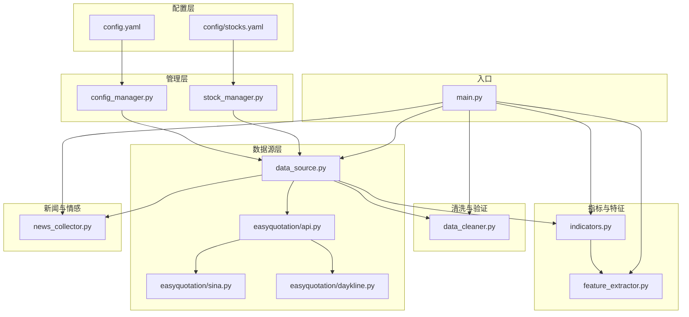
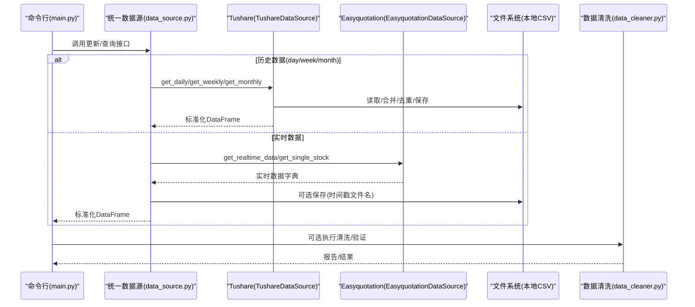
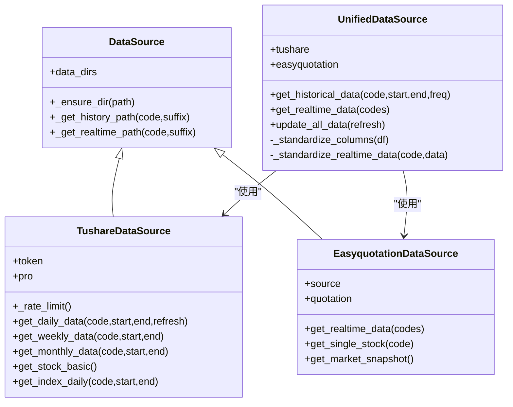
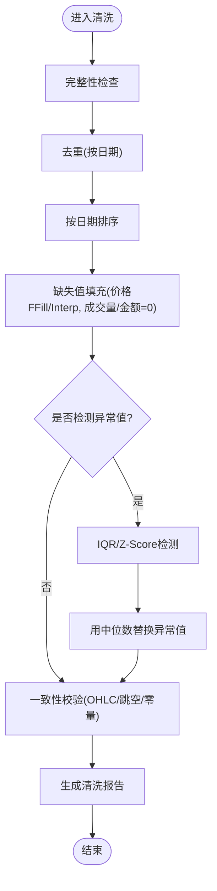
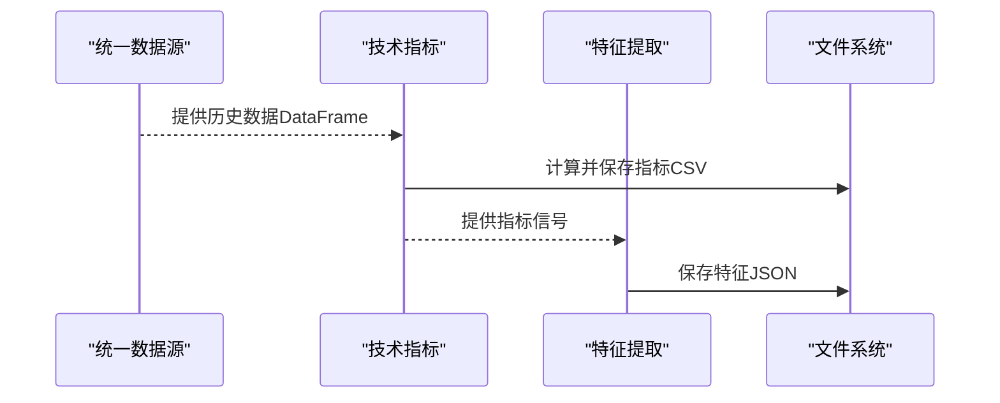
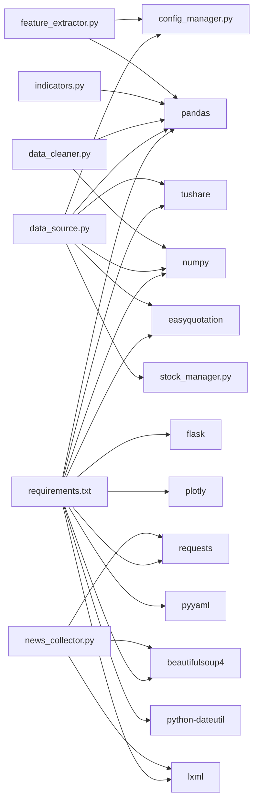

# 数据管理

<cite>
**本文引用的文件**   
- [config.yaml](file://config.yaml)
- [config/stocks.yaml](file://config/stocks.yaml)
- [quant_system/config_manager.py](file://quant_system/config_manager.py)
- [quant_system/stock_manager.py](file://quant_system/stock_manager.py)
- [quant_system/data_source.py](file://quant_system/data_source.py)
- [quant_system/data_cleaner.py](file://quant_system/data_cleaner.py)
- [quant_system/indicators.py](file://quant_system/indicators.py)
- [quant_system/feature_extractor.py](file://quant_system/feature_extractor.py)
- [quant_system/news_collector.py](file://quant_system/news_collector.py)
- [easyquotation/__init__.py](file://easyquotation/__init__.py)
- [easyquotation/api.py](file://easyquotation/api.py)
- [easyquotation/sina.py](file://easyquotation/sina.py)
- [easyquotation/daykline.py](file://easyquotation/daykline.py)
- [main.py](file://main.py)
- [requirements.txt](file://requirements.txt)
</cite>

## 目录
1. [简介](#简介)
2. [项目结构](#项目结构)
3. [核心组件](#核心组件)
4. [架构总览](#架构总览)
5. [详细组件分析](#详细组件分析)
6. [依赖分析](#依赖分析)
7. [性能考量](#性能考量)
8. [故障排查指南](#故障排查指南)
9. [结论](#结论)
10. [附录](#附录)

## 简介
本文件面向vibequation量化交易系统“数据管理模块”，系统性阐述数据采集、存储、清洗与管理的完整流程。重点覆盖两大数据源（Tushare与Easyquotation）的集成方式、数据格式转换、存储结构设计；解释数据验证机制、异常处理策略与数据质量保障措施；给出数据目录结构、文件命名规范、备份与恢复策略；提供数据导入导出的API接口文档与第三方数据源扩展集成建议；并涵盖数据安全与隐私保护相关措施。

## 项目结构
数据管理相关的核心目录与文件如下：
- 配置层：全局配置与股票代码配置
  - config.yaml：系统级配置（数据存储、采集、指标、回测、风控、Web、日志等）
  - config/stocks.yaml：股票/板块/指数代码清单
- 管理层：配置与股票管理
  - quant_system/config_manager.py：集中式配置读取、目录创建、参数获取
  - quant_system/stock_manager.py：股票信息标准化、代码映射、类型管理
- 数据源层：统一数据采集与标准化
  - quant_system/data_source.py：Tushare与Easyquotation封装、速率限制、本地缓存与增量更新、统一标准化输出
- 数据清洗与验证层
  - quant_system/data_cleaner.py：完整性检查、去重、缺失值填充、异常值检测、一致性校验、清洗报告
- 指标与特征层
  - quant_system/indicators.py：技术指标计算与持久化
  - quant_system/feature_extractor.py：特征提取与AI分析
- 新闻与情感层
  - quant_system/news_collector.py：新闻采集与情感分析
- 第三方库适配
  - easyquotation/*：新浪、腾讯、日K线等数据源适配
- 入口与命令行
  - main.py：命令行入口，提供数据更新、指标更新、回测、Web服务等子命令

**图表来源**
- [config.yaml:1-88](file://config.yaml#L1-L88)
- [config/stocks.yaml:1-71](file://config/stocks.yaml#L1-L71)
- [quant_system/config_manager.py:1-178](file://quant_system/config_manager.py#L1-L178)
- [quant_system/stock_manager.py:1-278](file://quant_system/stock_manager.py#L1-L278)
- [quant_system/data_source.py:1-423](file://quant_system/data_source.py#L1-L423)
- [quant_system/data_cleaner.py:1-444](file://quant_system/data_cleaner.py#L1-L444)
- [quant_system/indicators.py:1-200](file://quant_system/indicators.py#L1-L200)
- [quant_system/feature_extractor.py:1-200](file://quant_system/feature_extractor.py#L1-L200)
- [quant_system/news_collector.py:165-213](file://quant_system/news_collector.py#L165-L213)
- [easyquotation/api.py:1-23](file://easyquotation/api.py#L1-L23)
- [easyquotation/sina.py:35-66](file://easyquotation/sina.py#L35-L66)
- [easyquotation/daykline.py:32-56](file://easyquotation/daykline.py#L32-L56)
- [main.py:1-365](file://main.py#L1-L365)

**章节来源**
- [config.yaml:1-88](file://config.yaml#L1-L88)
- [config/stocks.yaml:1-71](file://config/stocks.yaml#L1-L71)
- [quant_system/config_manager.py:1-178](file://quant_system/config_manager.py#L1-L178)
- [quant_system/stock_manager.py:1-278](file://quant_system/stock_manager.py#L1-L278)
- [quant_system/data_source.py:1-423](file://quant_system/data_source.py#L1-L423)
- [quant_system/data_cleaner.py:1-444](file://quant_system/data_cleaner.py#L1-L444)
- [quant_system/indicators.py:1-200](file://quant_system/indicators.py#L1-L200)
- [quant_system/feature_extractor.py:1-200](file://quant_system/feature_extractor.py#L1-L200)
- [quant_system/news_collector.py:165-213](file://quant_system/news_collector.py#L165-L213)
- [easyquotation/api.py:1-23](file://easyquotation/api.py#L1-L23)
- [easyquotation/sina.py:35-66](file://easyquotation/sina.py#L35-L66)
- [easyquotation/daykline.py:32-56](file://easyquotation/daykline.py#L32-L56)
- [main.py:1-365](file://main.py#L1-L365)

## 核心组件
- 配置管理器：集中读取与写入配置，确保数据目录存在，提供各模块所需参数（令牌、目录、参数模板）
- 股票管理器：统一管理股票/板块/指数的代码与类型，提供Tushare/Easyquotation格式转换
- 统一数据源：封装Tushare与Easyquotation，实现历史与实时数据的统一接口、标准化输出、本地缓存与增量更新
- 数据清洗器：完整性检查、去重、缺失值填充、异常值检测、一致性校验、清洗报告
- 技术指标：RSI、MACD、移动平均线、布林带、KDJ、波动率等指标计算与持久化
- 特征提取：结合技术指标与新闻情感，提取可解释特征并进行策略类型分类
- 新闻采集：按股票批量抓取新闻并持久化，支持情感分析

**章节来源**
- [quant_system/config_manager.py:121-174](file://quant_system/config_manager.py#L121-L174)
- [quant_system/stock_manager.py:20-60](file://quant_system/stock_manager.py#L20-L60)
- [quant_system/data_source.py:24-423](file://quant_system/data_source.py#L24-L423)
- [quant_system/data_cleaner.py:21-286](file://quant_system/data_cleaner.py#L21-L286)
- [quant_system/indicators.py:21-200](file://quant_system/indicators.py#L21-L200)
- [quant_system/feature_extractor.py:99-200](file://quant_system/feature_extractor.py#L99-L200)
- [quant_system/news_collector.py:165-213](file://quant_system/news_collector.py#L165-L213)

## 架构总览
数据流从配置与股票管理出发，统一数据源负责采集与标准化，清洗与验证保障质量，指标与特征模块进行加工，最终落盘到各数据目录。命令行入口提供批量更新与验证能力。

**图表来源**
- [main.py:48-121](file://main.py#L48-L121)
- [quant_system/data_source.py:300-423](file://quant_system/data_source.py#L300-L423)
- [quant_system/data_cleaner.py:244-286](file://quant_system/data_cleaner.py#L244-L286)

## 详细组件分析

### 统一数据源（Tushare/Easyquotation）
- 设计要点
  - DataSource基类：统一目录管理、历史/实时路径生成
  - TushareDataSource：历史日线/周线/月线、指数日线、股票基础信息；内置速率限制；本地缓存+增量更新；统一列名标准化
  - EasyquotationDataSource：实时行情、单只股票、市场快照；可选保存为带时间戳的文件
  - UnifiedDataSource：统一接口，标准化输出，批量更新所有股票历史数据
- 关键流程
  - 历史数据：优先读取本地CSV，若最新日期不足则增量拉取并去重合并，最后保存
  - 实时数据：按配置股票集合调用对应源，返回标准化DataFrame
  - 标准化：历史列名映射（ts_code→code、trade_date→date等），实时字段映射与时间戳注入
- 速率控制：Tushare每分钟约500次，内部sleep节流

**图表来源**
- [quant_system/data_source.py:24-423](file://quant_system/data_source.py#L24-L423)

**章节来源**
- [quant_system/data_source.py:43-221](file://quant_system/data_source.py#L43-L221)
- [quant_system/data_source.py:223-298](file://quant_system/data_source.py#L223-L298)
- [quant_system/data_source.py:300-423](file://quant_system/data_source.py#L300-L423)

### 数据清洗与验证
- 数据完整性：检查必需列、缺失值、重复日期、日期断层
- 去重与排序：按日期去重，保持最新记录
- 缺失值填充：价格前向/后向填充，成交量/金额0填充
- 异常值检测：IQR/Z-Score两种方法，可选用中位数替换
- 一致性校验：OHLC数值关系、价格跳空阈值、零成交量统计
- 报告生成：清洗前后对比，输出可读报告

**图表来源**
- [quant_system/data_cleaner.py:27-286](file://quant_system/data_cleaner.py#L27-L286)

**章节来源**
- [quant_system/data_cleaner.py:21-444](file://quant_system/data_cleaner.py#L21-L444)

### 技术指标与特征提取
- 技术指标：RSI、RSI百分位、MACD、MA、布林带、KDJ、波动率等，按配置周期计算并持久化
- 特征提取：基于最新信号构造趋势强度、RSI水平、MACD动量、MA排列、波动位置等特征；结合新闻情感特征；策略类型分类（趋势跟踪/价值/动量/波段）

**图表来源**
- [quant_system/indicators.py:188-200](file://quant_system/indicators.py#L188-L200)
- [quant_system/feature_extractor.py:115-200](file://quant_system/feature_extractor.py#L115-L200)

**章节来源**
- [quant_system/indicators.py:21-200](file://quant_system/indicators.py#L21-L200)
- [quant_system/feature_extractor.py:99-200](file://quant_system/feature_extractor.py#L99-L200)

### 新闻采集与情感分析
- 批量采集：遍历配置股票，抓取新闻并持久化
- 加载与分析：支持加载本地新闻，进行情感分析与趋势统计

**章节来源**
- [quant_system/news_collector.py:165-213](file://quant_system/news_collector.py#L165-L213)

### 第三方数据源集成（Easyquotation）
- 适配器模式：api.use根据源选择具体实现（新浪、腾讯、日K线等）
- 实时数据格式：不同源返回字段略有差异，统一在统一数据源中标准化

**章节来源**
- [easyquotation/api.py:7-22](file://easyquotation/api.py#L7-L22)
- [easyquotation/sina.py:35-66](file://easyquotation/sina.py#L35-L66)
- [easyquotation/daykline.py:32-56](file://easyquotation/daykline.py#L32-L56)

## 依赖分析
- Python依赖：pandas、numpy、tushare、easyquotation、flask、plotly、requests、beautifulsoup4、lxml、pyyaml、python-dateutil
- 模块耦合：统一数据源依赖配置与股票管理；清洗与验证独立于数据源；指标与特征依赖数据源输出；新闻模块独立但可与特征融合

**图表来源**
- [requirements.txt:1-29](file://requirements.txt#L1-L29)
- [quant_system/data_source.py:13-18](file://quant_system/data_source.py#L13-L18)
- [quant_system/data_cleaner.py:12-16](file://quant_system/data_cleaner.py#L12-L16)
- [quant_system/indicators.py:11-16](file://quant_system/indicators.py#L11-L16)
- [quant_system/feature_extractor.py:13-19](file://quant_system/feature_extractor.py#L13-L19)
- [quant_system/news_collector.py:165-213](file://quant_system/news_collector.py#L165-L213)

**章节来源**
- [requirements.txt:1-29](file://requirements.txt#L1-L29)
- [quant_system/data_source.py:1-20](file://quant_system/data_source.py#L1-L20)
- [quant_system/data_cleaner.py:1-18](file://quant_system/data_cleaner.py#L1-L18)
- [quant_system/indicators.py:1-18](file://quant_system/indicators.py#L1-L18)
- [quant_system/feature_extractor.py:1-21](file://quant_system/feature_extractor.py#L1-L21)
- [quant_system/news_collector.py:165-213](file://quant_system/news_collector.py#L165-L213)

## 性能考量
- 速率限制：Tushare每分钟约500次，内部sleep节流避免触发限流
- 增量更新：历史数据优先读取本地CSV，仅拉取缺失日期区间，减少网络与IO开销
- 批量处理：统一数据源批量更新所有股票，中间加入延迟降低API压力
- 内存与IO：指标与特征按股票分别持久化，避免单文件过大；清洗阶段采用复制与就地修改结合

**章节来源**
- [quant_system/data_source.py:56-62](file://quant_system/data_source.py#L56-L62)
- [quant_system/data_source.py:90-131](file://quant_system/data_source.py#L90-L131)
- [quant_system/data_source.py:405-418](file://quant_system/data_source.py#L405-L418)

## 故障排查指南
- 配置问题
  - 缺少Tushare Token：初始化TushareDataSource会抛出异常，需在配置中设置
  - 数据目录不存在：ConfigManager自动创建，确认路径权限
- 数据采集问题
  - Tushare接口异常：查看日志，确认网络与Token；必要时降低并发或增加延迟
  - Easyquotation源不可用：切换其他源或降级为mock返回
- 数据质量
  - 缺失列/重复日期/日期断层：使用数据清洗器生成报告定位问题
  - OHLC不一致/价格跳空/零成交量：一致性校验会记录错误明细
- 命令行验证
  - 使用validate-data命令快速扫描所有股票数据状态

**章节来源**
- [quant_system/data_source.py:46-52](file://quant_system/data_source.py#L46-L52)
- [quant_system/config_manager.py:39-54](file://quant_system/config_manager.py#L39-L54)
- [quant_system/data_cleaner.py:27-80](file://quant_system/data_cleaner.py#L27-L80)
- [quant_system/data_cleaner.py:287-338](file://quant_system/data_cleaner.py#L287-L338)
- [main.py:184-215](file://main.py#L184-L215)

## 结论
本模块通过统一数据源抽象、严格的本地缓存与增量更新、完善的清洗与验证体系，实现了高可靠、可扩展的数据管理能力。配合指标与特征工程，为后续策略开发与回测提供了高质量的基础数据支撑。建议在生产环境中进一步完善备份与监控告警，持续优化第三方数据源的容错与降级策略。

## 附录

### 数据目录结构与文件命名规范
- 根目录：由配置项定义，默认为./data
- 子目录：
  - history：历史日线/周线/月线CSV，命名规则为{code}_daily.csv（示例见验证器）
  - realtime：实时数据CSV，命名规则为{code}_YYYYMMDD_HHMMSS.csv（统一数据源中预留保存逻辑）
  - indicators：技术指标CSV，命名规则为{code}_{indicator}.csv
  - features：特征JSON，命名规则为{code}_features.json
  - news：新闻CSV，命名规则为{code}_news.csv
  - backtest：回测结果目录（由配置项定义）
- 命名规范
  - 历史数据：{股票代码}_daily.csv
  - 实时数据：{股票代码}_YYYYMMDD_HHMMSS.csv
  - 指标数据：{股票代码}_{指标名}.csv
  - 特征数据：{股票代码}_features.json
  - 新闻数据：{股票代码}_news.csv

**章节来源**
- [config.yaml:10-18](file://config.yaml#L10-L18)
- [quant_system/data_source.py:34-40](file://quant_system/data_source.py#L34-L40)
- [quant_system/indicators.py:33-35](file://quant_system/indicators.py#L33-L35)
- [quant_system/feature_extractor.py:111-113](file://quant_system/feature_extractor.py#L111-L113)
- [quant_system/news_collector.py:165-166](file://quant_system/news_collector.py#L165-L166)
- [quant_system/data_cleaner.py:411-413](file://quant_system/data_cleaner.py#L411-L413)

### 数据验证机制与质量保障
- 完整性检查：列缺失、缺失值、重复日期、日期断层
- 一致性检查：OHLC数值关系、价格跳空、零成交量
- 异常值检测：IQR与Z-Score两种方法
- 清洗报告：清洗前后对比，便于审计与追踪

**章节来源**
- [quant_system/data_cleaner.py:27-80](file://quant_system/data_cleaner.py#L27-L80)
- [quant_system/data_cleaner.py:287-338](file://quant_system/data_cleaner.py#L287-L338)
- [quant_system/data_cleaner.py:340-387](file://quant_system/data_cleaner.py#L340-L387)

### 异常处理策略
- 初始化阶段：Token缺失直接抛出异常，阻止系统继续运行
- 采集阶段：捕获外部API异常并记录日志，避免中断整体流程
- 清洗阶段：对空DataFrame直接返回，避免无效处理；异常值替换采用稳健统计量
- 命令行：提供validate-data命令，集中展示各股票数据状态

**章节来源**
- [quant_system/data_source.py:46-52](file://quant_system/data_source.py#L46-L52)
- [quant_system/data_source.py:133-135](file://quant_system/data_source.py#L133-L135)
- [quant_system/data_cleaner.py:258-286](file://quant_system/data_cleaner.py#L258-L286)
- [main.py:184-215](file://main.py#L184-L215)

### 数据导入导出API接口文档
- 历史数据获取（统一接口）
  - 方法：UnifiedDataSource.get_historical_data
  - 参数：code（股票代码）、start_date（YYYYMMDD）、end_date（YYYYMMDD）、freq（day/week/month）
  - 返回：标准化DataFrame（包含code、date、open、high、low、close、volume、amount）
- 实时数据获取（统一接口）
  - 方法：UnifiedDataSource.get_realtime_data
  - 参数：codes（可选，股票代码列表）
  - 返回：标准化DataFrame（包含code、name、price、open、high、low、close、volume、bid1、ask1、time）
- 批量更新
  - 方法：UnifiedDataSource.update_all_data
  - 参数：refresh（是否强制刷新）
  - 行为：遍历所有股票，分别调用Tushare历史数据接口，按类型区分个股与指数
- 数据验证
  - 方法：DataValidator.validate_all_data
  - 返回：各股票数据状态（valid/invalid/missing/error）及详细报告

**章节来源**
- [quant_system/data_source.py:307-356](file://quant_system/data_source.py#L307-L356)
- [quant_system/data_source.py:396-419](file://quant_system/data_source.py#L396-L419)
- [quant_system/data_cleaner.py:396-438](file://quant_system/data_cleaner.py#L396-L438)

### 第三方数据源扩展集成
- 扩展步骤
  - 在easyquotation中新增数据源适配器（参考sina、daykline等）
  - 在easyquotation/api.py中注册新源
  - 在统一数据源中新增对应DataSource子类，实现get_realtime_data等方法
  - 在stock_manager中补充代码格式映射（如需要）
  - 在配置中调整实时数据采集策略（如源切换）
- 注意事项
  - 统一返回字段与标准化流程
  - 速率限制与错误处理
  - 文件命名与持久化策略

**章节来源**
- [easyquotation/api.py:7-22](file://easyquotation/api.py#L7-L22)
- [easyquotation/sina.py:35-66](file://easyquotation/sina.py#L35-L66)
- [easyquotation/daykline.py:32-56](file://easyquotation/daykline.py#L32-L56)
- [quant_system/data_source.py:223-298](file://quant_system/data_source.py#L223-L298)
- [quant_system/stock_manager.py:20-60](file://quant_system/stock_manager.py#L20-L60)

### 数据安全与隐私保护
- Token管理
  - Tushare、PushPlus、ModelScope等Token集中存储于配置文件，避免硬编码
  - 建议在部署环境使用环境变量或密钥管理服务
- 日志与敏感信息
  - 日志文件路径与大小轮转配置，避免泄露敏感数据
  - 建议对日志中的敏感字段进行脱敏处理
- 数据访问控制
  - 本地CSV文件权限控制，避免未授权访问
  - Web服务端口与访问白名单策略（如适用）

**章节来源**
- [config.yaml:4-7](file://config.yaml#L4-L7)
- [quant_system/config_manager.py:101-119](file://quant_system/config_manager.py#L101-L119)
- [config.yaml:82-87](file://config.yaml#L82-L87)