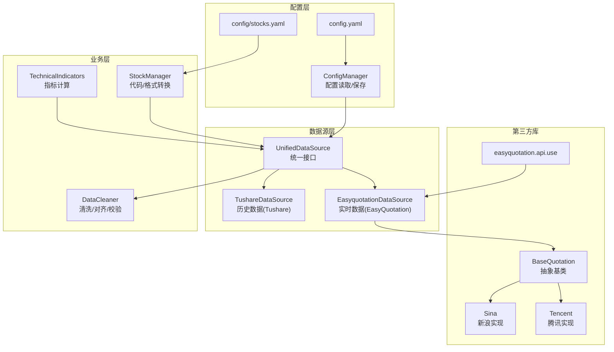
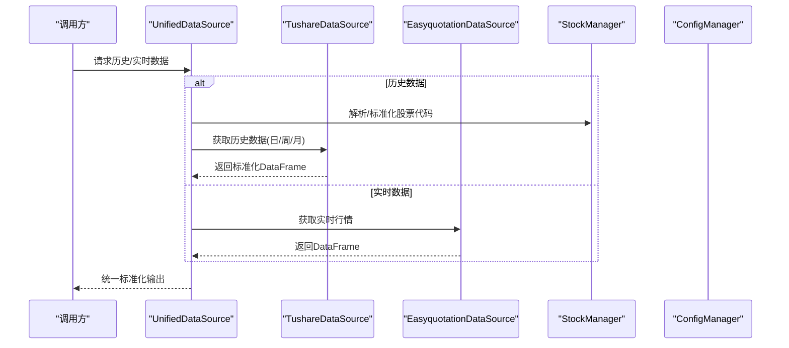
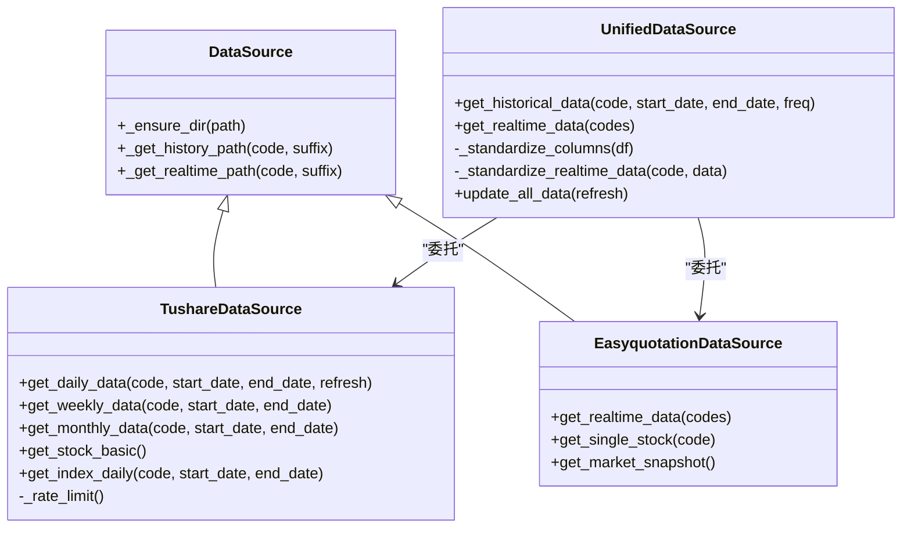
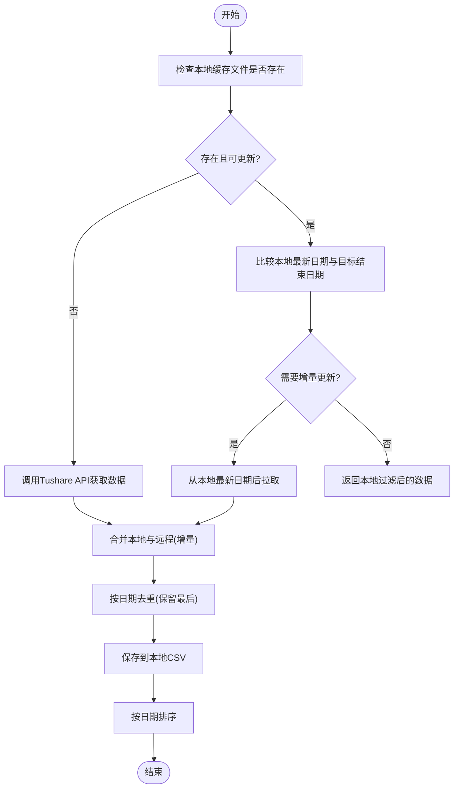
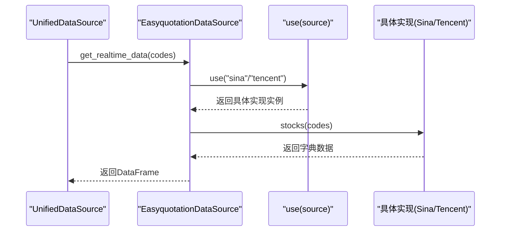
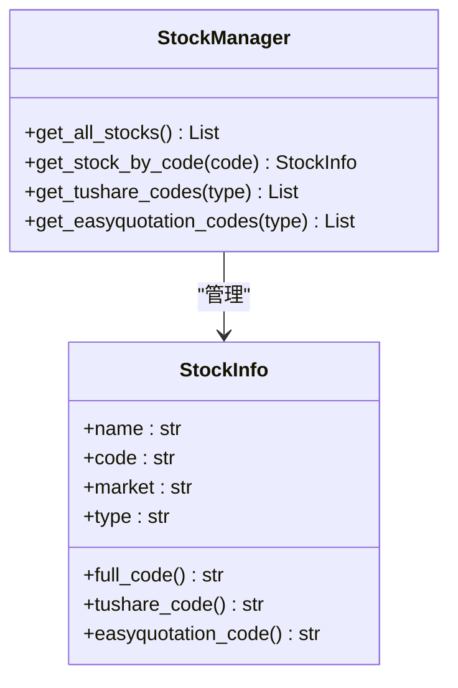
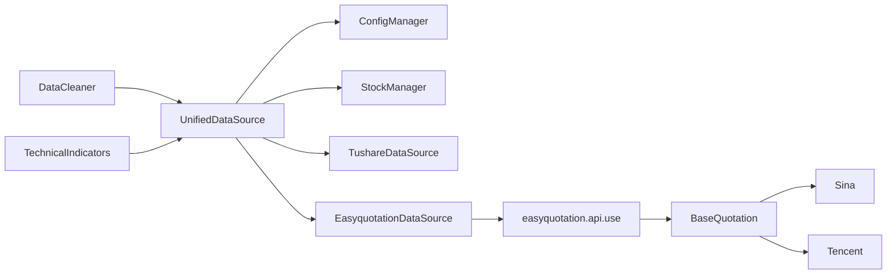

# 数据集成

<cite>
**本文引用的文件**
- [quant_system/data_source.py](file://quant_system/data_source.py)
- [quant_system/config_manager.py](file://quant_system/config_manager.py)
- [quant_system/stock_manager.py](file://quant_system/stock_manager.py)
- [quant_system/data_cleaner.py](file://quant_system/data_cleaner.py)
- [quant_system/indicators.py](file://quant_system/indicators.py)
- [easyquotation/__init__.py](file://easyquotation/__init__.py)
- [easyquotation/api.py](file://easyquotation/api.py)
- [easyquotation/basequotation.py](file://easyquotation/basequotation.py)
- [easyquotation/sina.py](file://easyquotation/sina.py)
- [easyquotation/tencent.py](file://easyquotation/tencent.py)
- [config.yaml](file://config.yaml)
- [config/stocks.yaml](file://config/stocks.yaml)
</cite>

## 目录
1. [简介](#简介)
2. [项目结构](#项目结构)
3. [核心组件](#核心组件)
4. [架构总览](#架构总览)
5. [详细组件分析](#详细组件分析)
6. [依赖关系分析](#依赖关系分析)
7. [性能与并发](#性能与并发)
8. [故障转移与稳定性](#故障转移与稳定性)
9. [数据标准化与合并策略](#数据标准化与合并策略)
10. [第三方数据源扩展指南](#第三方数据源扩展指南)
11. [同步策略与并发访问控制](#同步策略与并发访问控制)
12. [故障排查](#故障排查)
13. [结论](#结论)

## 简介
本文件面向vibequation量化交易系统“数据集成”模块，系统性阐述多数据源统一接口的设计与实现，重点覆盖：
- Tushare与Easyquotation两大数据源的整合策略
- 数据标准化机制（列名映射、数据格式转换、字段统一）
- 数据合并与去重策略（增量更新与全量更新）
- 数据源切换与故障转移机制
- 数据同步策略与并发访问控制
- 第三方数据源扩展的接口规范与集成指南
- 性能优化技巧与最佳实践

## 项目结构
数据集成相关的核心文件分布如下：
- 数据源与统一接口：quant_system/data_source.py
- 配置管理：quant_system/config_manager.py、config.yaml
- 股票代码与格式转换：quant_system/stock_manager.py、config/stocks.yaml
- 数据清洗与一致性校验：quant_system/data_cleaner.py
- 技术指标与数据使用：quant_system/indicators.py
- 第三方EasyQuotation库：easyquotation/*（基类、适配器、具体实现）

图表来源
- [quant_system/data_source.py:300-423](file://quant_system/data_source.py#L300-L423)
- [quant_system/config_manager.py:121-131](file://quant_system/config_manager.py#L121-L131)
- [quant_system/stock_manager.py:20-60](file://quant_system/stock_manager.py#L20-L60)
- [easyquotation/api.py:7-22](file://easyquotation/api.py#L7-L22)
- [easyquotation/basequotation.py:12-122](file://easyquotation/basequotation.py#L12-L122)

章节来源
- [quant_system/data_source.py:1-423](file://quant_system/data_source.py#L1-L423)
- [quant_system/config_manager.py:1-178](file://quant_system/config_manager.py#L1-L178)
- [quant_system/stock_manager.py:1-278](file://quant_system/stock_manager.py#L1-L278)
- [easyquotation/__init__.py:1-7](file://easyquotation/__init__.py#L1-L7)
- [easyquotation/api.py:1-23](file://easyquotation/api.py#L1-L23)
- [easyquotation/basequotation.py:1-122](file://easyquotation/basequotation.py#L1-L122)
- [config.yaml:1-88](file://config.yaml#L1-L88)
- [config/stocks.yaml:1-71](file://config/stocks.yaml#L1-L71)

## 核心组件
- 统一数据源接口：提供历史与实时数据的统一入口，负责调用不同数据源并进行标准化输出。
- Tushare数据源：封装Tushare Pro API，负责历史日线/周线/月线与指数数据的获取、缓存与合并。
- EasyQuotation数据源：封装第三方EasyQuotation库，负责实时行情的批量获取与DataFrame转换。
- 配置管理：集中管理数据目录、Token、采集参数等配置项。
- 股票管理：提供股票/板块/指数的代码标准化与格式转换，支撑不同数据源的代码要求。
- 数据清洗：提供完整性检查、去重、缺失值填充、对齐与一致性校验。
- 技术指标：基于统一数据源获取标准化数据，计算RSI、MACD、均线、布林带等指标。

章节来源
- [quant_system/data_source.py:300-423](file://quant_system/data_source.py#L300-L423)
- [quant_system/config_manager.py:101-131](file://quant_system/config_manager.py#L101-L131)
- [quant_system/stock_manager.py:20-60](file://quant_system/stock_manager.py#L20-L60)
- [quant_system/data_cleaner.py:21-286](file://quant_system/data_cleaner.py#L21-L286)
- [quant_system/indicators.py:21-274](file://quant_system/indicators.py#L21-L274)

## 架构总览
统一数据源作为门面，屏蔽底层数据源差异；股票管理负责跨数据源的代码格式转换；配置管理提供全局配置；第三方EasyQuotation通过工厂函数选择具体实现；数据清洗与指标计算在统一数据源之上进行。

图表来源
- [quant_system/data_source.py:300-356](file://quant_system/data_source.py#L300-L356)
- [quant_system/stock_manager.py:111-128](file://quant_system/stock_manager.py#L111-L128)
- [quant_system/config_manager.py:101-131](file://quant_system/config_manager.py#L101-L131)

## 详细组件分析

### 统一数据源接口（UnifiedDataSource）
- 职责：对外暴露统一的历史与实时数据接口，内部路由至Tushare或EasyQuotation，并进行标准化。
- 历史数据：按日/周/月频率调用Tushare对应接口，返回标准化列名。
- 实时数据：调用EasyQuotation，将字典结构转换为DataFrame并标准化列名。
- 标准化策略：历史列名映射、必要字段补齐、顺序统一；实时列名映射与时间戳注入。

图表来源
- [quant_system/data_source.py:24-423](file://quant_system/data_source.py#L24-L423)

章节来源
- [quant_system/data_source.py:300-423](file://quant_system/data_source.py#L300-L423)

### Tushare数据源（TushareDataSource）
- 速率限制：内置简单限流，避免频繁请求触发API限制。
- 历史数据缓存：按股票代码与频率命名本地CSV文件，支持增量更新与全量更新。
- 增量更新：若本地存在且最新日期小于等于请求结束日期，则从本地最新日期之后拉取；合并后去重。
- 全量更新：强制刷新时忽略本地缓存，直接覆盖写入。
- 指数数据：单独提供指数日线接口，便于区分个股与指数。

图表来源
- [quant_system/data_source.py:64-136](file://quant_system/data_source.py#L64-L136)

章节来源
- [quant_system/data_source.py:43-221](file://quant_system/data_source.py#L43-L221)

### EasyQuotation数据源（EasyquotationDataSource）
- 实时数据获取：通过工厂函数use选择具体实现（如新浪、腾讯），批量获取股票行情。
- 市场快照：将所有股票的实时数据转换为DataFrame，便于后续标准化与分析。
- 代码适配：通过StockManager提供的EasyQuotation格式代码，适配第三方库的输入格式。

图表来源
- [quant_system/data_source.py:223-298](file://quant_system/data_source.py#L223-L298)
- [easyquotation/api.py:7-22](file://easyquotation/api.py#L7-L22)
- [easyquotation/sina.py:8-79](file://easyquotation/sina.py#L8-L79)
- [easyquotation/tencent.py:9-109](file://easyquotation/tencent.py#L9-L109)

章节来源
- [quant_system/data_source.py:223-298](file://quant_system/data_source.py#L223-L298)
- [easyquotation/api.py:1-23](file://easyquotation/api.py#L1-L23)
- [easyquotation/basequotation.py:12-122](file://easyquotation/basequotation.py#L12-L122)
- [easyquotation/sina.py:1-79](file://easyquotation/sina.py#L1-L79)
- [easyquotation/tencent.py:1-109](file://easyquotation/tencent.py#L1-L109)

### 股票管理（StockManager）
- 提供StockInfo数据类，包含名称、代码、市场、类型等字段，并提供格式转换属性（如Tushare格式、EasyQuotation格式）。
- 提供代码标准化与查询能力，支持多种输入格式（纯数字、带前缀、带后缀）。
- 提供获取Tushare/EasyQuotation代码列表的方法，便于批量请求。

图表来源
- [quant_system/stock_manager.py:20-60](file://quant_system/stock_manager.py#L20-L60)
- [quant_system/stock_manager.py:111-128](file://quant_system/stock_manager.py#L111-L128)

章节来源
- [quant_system/stock_manager.py:1-278](file://quant_system/stock_manager.py#L1-L278)
- [config/stocks.yaml:1-71](file://config/stocks.yaml#L1-L71)

### 配置管理（ConfigManager）
- 提供统一的配置读取/保存能力，支持点号路径访问。
- 提供数据目录、Token、技术指标、回测、风控、Web服务等配置项的便捷访问。
- 确保数据目录存在，避免运行时因目录缺失导致异常。

章节来源
- [quant_system/config_manager.py:1-178](file://quant_system/config_manager.py#L1-L178)
- [config.yaml:1-88](file://config.yaml#L1-L88)

### 数据清洗（DataCleaner）
- 完整性检查：统计缺失列、缺失值数量、重复日期、日期断层等。
- 去重与排序：按日期去重并排序，保证时间序列连续性。
- 缺失值填充：价格列前向/后向填充，成交量/金额填充0。
- 一致性校验：OHLC一致性检查、价格跳空检测、零成交量天数统计。
- 多股票对齐：基于共同日期索引对齐多个股票的时间序列。

章节来源
- [quant_system/data_cleaner.py:21-286](file://quant_system/data_cleaner.py#L21-L286)

### 技术指标（TechnicalIndicators）
- 基于统一数据源获取标准化历史数据，计算RSI、MACD、均线、布林带、KDJ、波动率等指标。
- 支持多周期与多时间框架（日/周/月）。
- 提供指标保存与加载能力，便于回测与分析。

章节来源
- [quant_system/indicators.py:21-274](file://quant_system/indicators.py#L21-L274)

## 依赖关系分析
- 统一数据源依赖配置管理与股票管理，以获取数据目录与股票代码格式。
- Tushare数据源依赖Tushare Pro SDK与本地文件系统。
- EasyQuotation数据源依赖第三方库的工厂与具体实现类。
- 数据清洗与指标计算依赖统一数据源输出的标准化数据。

图表来源
- [quant_system/data_source.py:300-423](file://quant_system/data_source.py#L300-L423)
- [easyquotation/api.py:7-22](file://easyquotation/api.py#L7-L22)
- [easyquotation/basequotation.py:12-122](file://easyquotation/basequotation.py#L12-L122)

章节来源
- [quant_system/data_source.py:300-423](file://quant_system/data_source.py#L300-L423)
- [easyquotation/api.py:1-23](file://easyquotation/api.py#L1-L23)
- [easyquotation/basequotation.py:1-122](file://easyquotation/basequotation.py#L1-L122)

## 性能与并发
- Tushare速率限制：在每次请求前进行限流等待，避免触发API频率限制。
- 批量请求与并发：EasyQuotation内部使用线程池对股票列表进行分批请求，提升吞吐。
- 数据本地化：历史数据缓存到CSV，减少重复网络请求；实时数据可按时间戳落盘以便审计。
- 指标计算：采用滚动窗口与指数加权等高效算法，避免不必要的重复计算。

章节来源
- [quant_system/data_source.py:56-62](file://quant_system/data_source.py#L56-L62)
- [easyquotation/basequotation.py:113-118](file://easyquotation/basequotation.py#L113-L118)
- [quant_system/indicators.py:37-102](file://quant_system/indicators.py#L37-L102)

## 故障转移与稳定性
- 历史数据：若某只股票获取失败，统一数据源会记录错误并继续处理其他股票，避免整体阻塞。
- 实时数据：第三方库可能返回部分成功/失败，建议在调用方进行重试与降级处理。
- 配置校验：缺少Token或目录不存在会提前抛出异常，便于快速定位问题。
- 日志记录：统一使用标准日志模块，便于追踪与排错。

章节来源
- [quant_system/data_source.py:406-418](file://quant_system/data_source.py#L406-L418)
- [quant_system/config_manager.py:28-38](file://quant_system/config_manager.py#L28-L38)

## 数据标准化与合并策略
- 历史数据标准化：将Tushare列名映射为统一字段（如ts_code→code、trade_date→date、vol→volume），补齐必要字段，确保输出列顺序一致。
- 实时数据标准化：将第三方字典结构映射为统一字段（code、name、price、open、high、low、close、volume、bid1、ask1、time），并注入当前时间戳。
- 合并与去重：增量更新时先读取本地数据，再与新数据合并，按日期去重保留最后一条记录；全量更新时直接覆盖写入。
- 字段统一：历史与实时输出均包含code、date/time、OHLC、volume等核心字段，便于后续指标计算与分析。

章节来源
- [quant_system/data_source.py:357-394](file://quant_system/data_source.py#L357-L394)
- [quant_system/data_source.py:122-126](file://quant_system/data_source.py#L122-L126)

## 第三方数据源扩展指南
- 扩展步骤
  1) 在easyquotation目录新增具体实现类，继承BaseQuotation并实现stock_api属性与format_response_data方法。
  2) 在easyquotation/api.py中注册该实现，使其可通过use(source)被选择。
  3) 在quant_system/data_source.py中新增对应数据源类，遵循现有DataSource基类约定（路径、缓存、标准化）。
  4) 在UnifiedDataSource中增加对该数据源的委托与标准化逻辑。
  5) 在config/stocks.yaml中补充目标股票/指数代码，确保格式转换正确。
- 接口规范
  - 继承BaseQuotation，实现stock_api与format_response_data。
  - 返回字典结构，键为股票代码，值为包含必要字段的字典。
  - 控制请求频率，避免触发第三方API限制。
- 集成测试
  - 使用少量股票进行端到端测试，验证数据完整性与标准化一致性。
  - 对比历史数据与实时数据的字段与格式，确保统一。

章节来源
- [easyquotation/basequotation.py:12-122](file://easyquotation/basequotation.py#L12-L122)
- [easyquotation/api.py:7-22](file://easyquotation/api.py#L7-L22)
- [quant_system/data_source.py:24-423](file://quant_system/data_source.py#L24-L423)
- [config/stocks.yaml:1-71](file://config/stocks.yaml#L1-L71)

## 同步策略与并发访问控制
- 同步策略
  - 历史数据：按股票循环更新，每只股票间添加固定延迟，避免API限流。
  - 实时数据：按配置的更新间隔定时抓取，可结合调度器实现定时任务。
  - 指标计算：基于已标准化的历史数据，按需增量计算并保存。
- 并发访问控制
  - Tushare限流：在请求前进行等待，确保请求频率不超过限制。
  - EasyQuotation并发：内部使用线程池分批请求，提高吞吐。
  - 文件写入：统一通过CSV写入，避免多进程同时写同一文件；若需多进程，建议引入锁或分文件策略。

章节来源
- [quant_system/data_source.py:414-415](file://quant_system/data_source.py#L414-L415)
- [quant_system/data_source.py:56-62](file://quant_system/data_source.py#L56-L62)
- [easyquotation/basequotation.py:113-118](file://easyquotation/basequotation.py#L113-L118)

## 故障排查
- 常见问题
  - Token缺失：检查config.yaml中的tushare_token配置。
  - 目录不存在：确认data_storage相关目录已创建。
  - 股票代码不匹配：确认StockManager中股票代码格式与第三方库要求一致。
  - API限流：适当增加延迟或降低请求频率。
- 排查建议
  - 查看日志文件，定位具体失败环节。
  - 对单只股票进行最小化复现，逐步缩小问题范围。
  - 使用DataCleaner进行完整性与一致性检查，识别数据异常。

章节来源
- [quant_system/config_manager.py:28-38](file://quant_system/config_manager.py#L28-L38)
- [quant_system/data_cleaner.py:27-80](file://quant_system/data_cleaner.py#L27-L80)

## 结论
vibequation的数据集成模块通过统一接口有效整合了Tushare与EasyQuotation两大数据源，实现了历史与实时数据的标准化输出。配合完善的缓存、合并与去重策略，以及清晰的扩展接口，为后续指标计算与策略回测提供了高质量、一致性的数据基础。建议在生产环境中进一步完善错误重试、限流与并发控制策略，并持续监控数据质量与一致性。