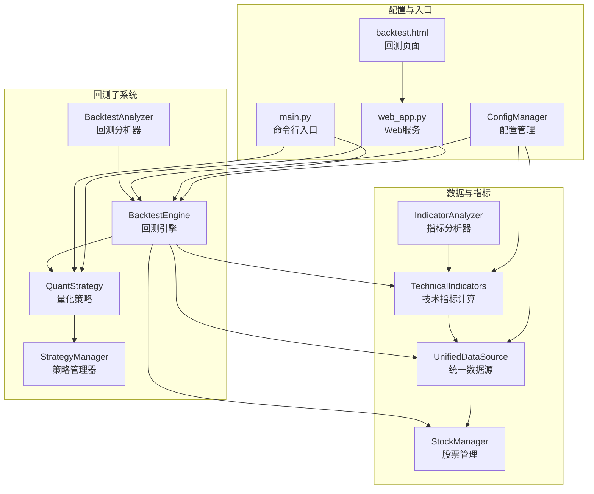
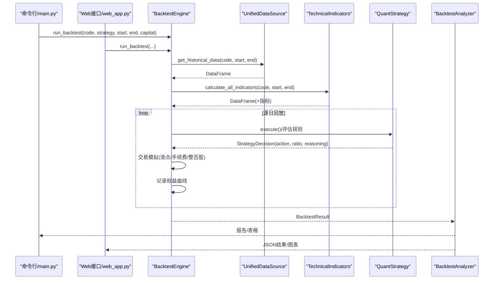
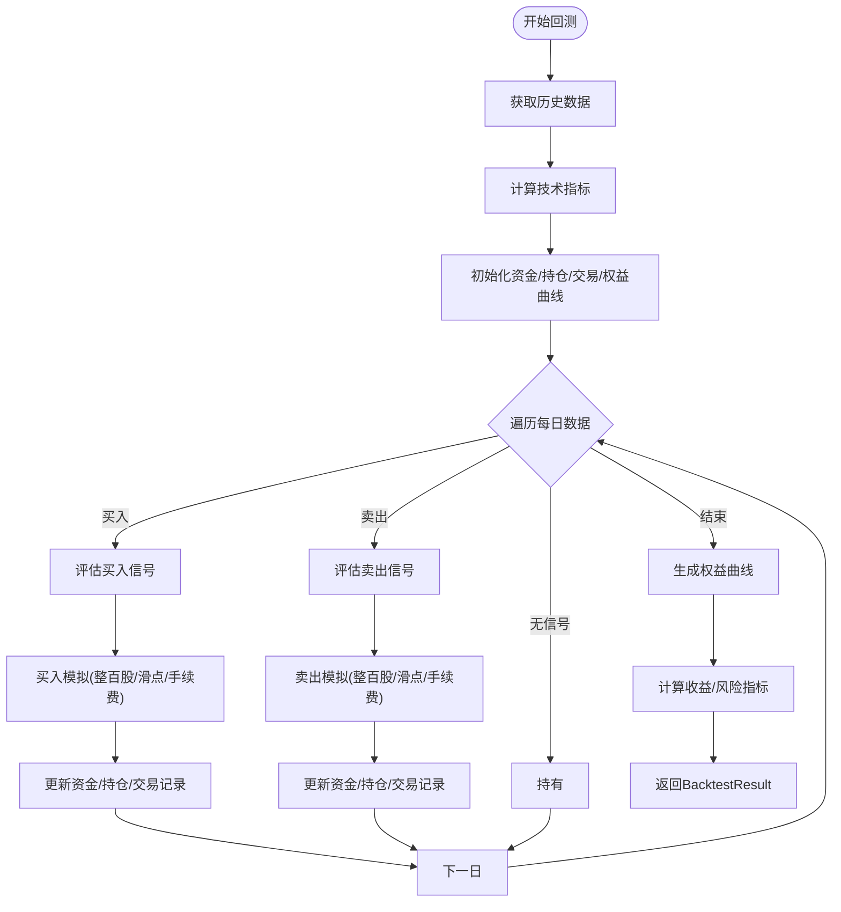
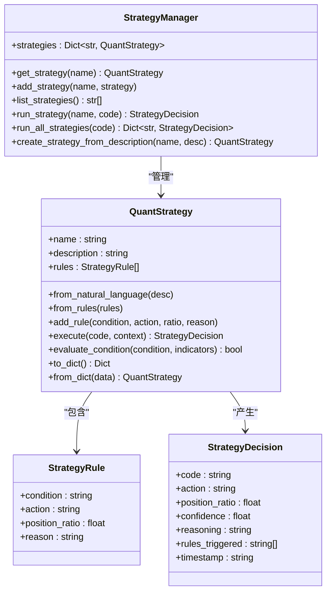
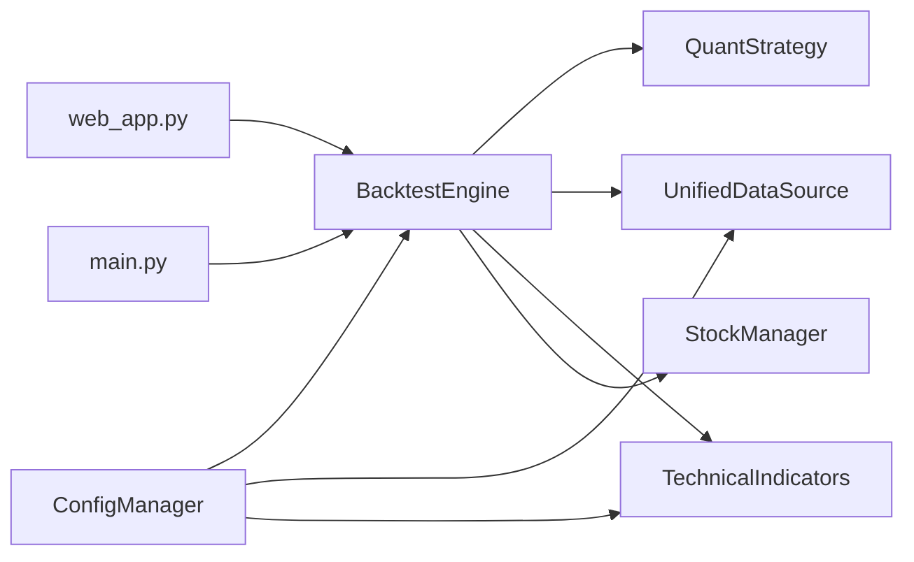
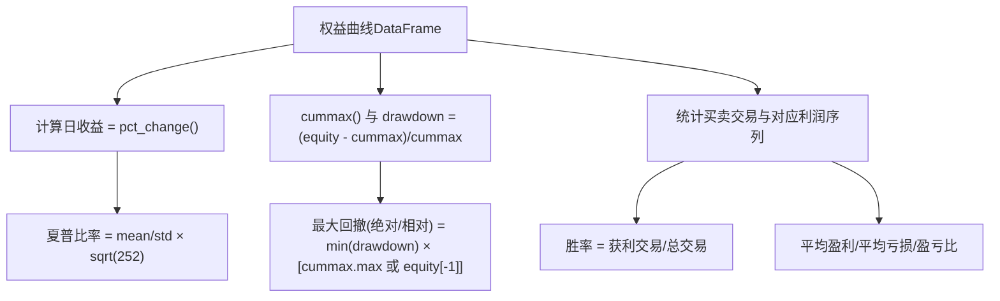

# 回测引擎

<cite>
**本文引用的文件**
- [quant_system/backtest.py](file://quant_system/backtest.py)
- [quant_system/strategy.py](file://quant_system/strategy.py)
- [quant_system/data_source.py](file://quant_system/data_source.py)
- [quant_system/indicators.py](file://quant_system/indicators.py)
- [quant_system/config_manager.py](file://quant_system/config_manager.py)
- [quant_system/stock_manager.py](file://quant_system/stock_manager.py)
- [quant_system/web_app.py](file://quant_system/web_app.py)
- [quant_system/templates/backtest.html](file://quant_system/templates/backtest.html)
- [main.py](file://main.py)
- [config.yaml](file://config.yaml)
- [config/stocks.yaml](file://config/stocks.yaml)
</cite>

## 目录
1. [简介](#简介)
2. [项目结构](#项目结构)
3. [核心组件](#核心组件)
4. [架构总览](#架构总览)
5. [详细组件分析](#详细组件分析)
6. [依赖关系分析](#依赖关系分析)
7. [性能与优化](#性能与优化)
8. [回测参数与配置](#回测参数与配置)
9. [回测指标与计算](#回测指标与计算)
10. [可视化与展示](#可视化与展示)
11. [高级功能](#高级功能)
12. [质量控制与异常处理](#质量控制与异常处理)
13. [调试与故障排查](#调试与故障排查)
14. [结论](#结论)

## 简介
本文件面向vibequation量化交易系统的回测引擎，系统性阐述其设计架构、实现原理与工程实践。内容覆盖历史数据回放、交易模拟、收益与风险指标计算、参数配置、可视化展示、多策略对比、参数扫描与样本外测试等高级能力，并提供质量控制、异常处理与性能优化建议，帮助用户高效构建与验证交易策略。

## 项目结构
回测引擎位于quant_system子系统内，围绕BacktestEngine、策略层、数据源与指标计算模块协同工作，通过命令行与Web界面提供交互入口。

**图表来源**
- [quant_system/backtest.py:66-374](file://quant_system/backtest.py#L66-L374)
- [quant_system/strategy.py:150-316](file://quant_system/strategy.py#L150-L316)
- [quant_system/data_source.py:300-423](file://quant_system/data_source.py#L300-L423)
- [quant_system/indicators.py:21-274](file://quant_system/indicators.py#L21-L274)
- [quant_system/config_manager.py:141-147](file://quant_system/config_manager.py#L141-L147)
- [main.py:14-25](file://main.py#L14-L25)
- [quant_system/web_app.py:214-316](file://quant_system/web_app.py#L214-L316)
- [quant_system/templates/backtest.html:1-200](file://quant_system/templates/backtest.html#L1-L200)

**章节来源**
- [quant_system/backtest.py:1-456](file://quant_system/backtest.py#L1-L456)
- [quant_system/strategy.py:1-556](file://quant_system/strategy.py#L1-L556)
- [quant_system/data_source.py:1-423](file://quant_system/data_source.py#L1-L423)
- [quant_system/indicators.py:1-500](file://quant_system/indicators.py#L1-L500)
- [quant_system/config_manager.py:1-178](file://quant_system/config_manager.py#L1-L178)
- [main.py:1-365](file://main.py#L1-L365)
- [quant_system/web_app.py:1-873](file://quant_system/web_app.py#L1-L873)
- [quant_system/templates/backtest.html:1-200](file://quant_system/templates/backtest.html#L1-L200)

## 核心组件
- 回测引擎BacktestEngine：负责历史数据回放、策略执行、交易模拟、资金与持仓管理、回测结果统计与等。
- 回测分析器BacktestAnalyzer：生成报告、比较多个策略结果。
- 策略层：QuantStrategy与StrategyManager，支持规则驱动策略、自然语言到规则的翻译、内置策略集合。
- 数据源与指标：UnifiedDataSource统一历史与实时数据接口；TechnicalIndicators与IndicatorAnalyzer负责指标计算与分析。
- 配置管理：ConfigManager集中管理回测参数、风控参数、AI模型配置等。
- Web与CLI：web_app.py提供回测API与可视化；main.py提供命令行工具。

**章节来源**
- [quant_system/backtest.py:66-374](file://quant_system/backtest.py#L66-L374)
- [quant_system/strategy.py:150-316](file://quant_system/strategy.py#L150-L316)
- [quant_system/data_source.py:300-423](file://quant_system/data_source.py#L300-L423)
- [quant_system/indicators.py:21-274](file://quant_system/indicators.py#L21-L274)
- [quant_system/config_manager.py:141-147](file://quant_system/config_manager.py#L141-L147)
- [quant_system/web_app.py:214-316](file://quant_system/web_app.py#L214-L316)
- [main.py:14-25](file://main.py#L14-L25)

## 架构总览
回测流程自上而下分为三层：
- 输入层：股票代码、策略、时间窗口、初始资金等参数。
- 执行层：历史数据获取与指标计算、逐日策略评估与交易执行、资金曲线生成。
- 输出层：收益与风险指标、交易明细、可视化图表。

**图表来源**
- [quant_system/backtest.py:75-282](file://quant_system/backtest.py#L75-L282)
- [quant_system/data_source.py:307-335](file://quant_system/data_source.py#L307-L335)
- [quant_system/indicators.py:188-273](file://quant_system/indicators.py#L188-L273)
- [quant_system/strategy.py:229-299](file://quant_system/strategy.py#L229-L299)
- [quant_system/web_app.py:214-266](file://quant_system/web_app.py#L214-L266)

## 详细组件分析

### 回测引擎BacktestEngine
- 资金与交易模拟：支持初始资金、手续费率、滑点设置；买入按“整百股”下单；考虑滑点与手续费后的实际成交金额与持仓变化。
- 策略执行：在引擎内部对规则进行安全评估，聚合多条规则的信号与建议仓位，输出Action与PositionRatio。
- 收益与风险指标：计算总收益、年化收益、最大回撤、夏普比率、胜率、平均盈亏、盈亏比等。
- 多股票回测：批量回测多只股票并汇总结果。

**图表来源**
- [quant_system/backtest.py:75-282](file://quant_system/backtest.py#L75-L282)

**章节来源**
- [quant_system/backtest.py:66-374](file://quant_system/backtest.py#L66-L374)

### 回测分析器BacktestAnalyzer
- 生成人类可读的回测报告，包含收益、风险、交易统计与交易明细。
- 对多个策略回测结果进行横向比较，输出表格。

**章节来源**
- [quant_system/backtest.py:376-451](file://quant_system/backtest.py#L376-L451)

### 策略层QuantStrategy与StrategyManager
- 规则驱动：支持condition/action/position_ratio/reason字段，规则可直接在引擎中安全评估。
- 自然语言到规则：通过AI模型将自然语言策略转换为量化规则，亦可反向翻译。
- 内置策略：RSI、MACD、均线、综合策略等，便于快速对比。

**图表来源**
- [quant_system/strategy.py:35-54](file://quant_system/strategy.py#L35-L54)
- [quant_system/strategy.py:150-316](file://quant_system/strategy.py#L150-L316)
- [quant_system/strategy.py:318-460](file://quant_system/strategy.py#L318-L460)

**章节来源**
- [quant_system/strategy.py:1-556](file://quant_system/strategy.py#L1-L556)

### 数据源与指标TechnicalIndicators
- UnifiedDataSource：统一历史与实时数据接口，标准化列名，支持日线/周线/月线。
- TechnicalIndicators：计算RSI、MACD、均线、布林带、KDJ、波动率等指标，并支持保存/加载。
- IndicatorAnalyzer：加载/计算最新信号，生成综合评分与报告。

**章节来源**
- [quant_system/data_source.py:300-423](file://quant_system/data_source.py#L300-L423)
- [quant_system/indicators.py:21-274](file://quant_system/indicators.py#L21-L274)
- [quant_system/indicators.py:330-495](file://quant_system/indicators.py#L330-L495)

### 配置管理ConfigManager
- 集中管理回测参数（初始资金、手续费率、滑点）、风控参数、AI模型配置、Web服务配置等。
- 提供get_backtest_config()等便捷方法。

**章节来源**
- [quant_system/config_manager.py:141-147](file://quant_system/config_manager.py#L141-L147)
- [config.yaml:63-68](file://config.yaml#L63-L68)

## 依赖关系分析
- 回测引擎依赖策略层、数据源、指标计算与股票管理模块。
- Web与CLI分别通过API与命令行调用回测引擎。
- 配置管理贯穿各模块，确保参数一致性。

**图表来源**
- [quant_system/backtest.py:17-21](file://quant_system/backtest.py#L17-L21)
- [quant_system/web_app.py:214-266](file://quant_system/web_app.py#L214-L266)
- [main.py:14-25](file://main.py#L14-L25)
- [quant_system/config_manager.py:141-147](file://quant_system/config_manager.py#L141-L147)

**章节来源**
- [quant_system/backtest.py:17-21](file://quant_system/backtest.py#L17-L21)
- [quant_system/web_app.py:214-266](file://quant_system/web_app.py#L214-L266)
- [main.py:14-25](file://main.py#L14-L25)
- [quant_system/config_manager.py:141-147](file://quant_system/config_manager.py#L141-L147)

## 性能与优化
- 数据访问优化：统一数据源缓存历史数据文件，避免重复拉取；增量更新与去重合并。
- 指标计算优化：按需计算指标，支持保存/加载，减少重复计算。
- 回测执行优化：规则评估采用安全字典替换与eval，避免复杂表达式开销；整百股下单减少小数运算。
- 并发与限流：Tushare数据源内置简单速率限制，避免API限流。
- Web渲染：Plotly图表按需生成，前端仅传输必要数据。

**章节来源**
- [quant_system/data_source.py:90-136](file://quant_system/data_source.py#L90-L136)
- [quant_system/indicators.py:275-305](file://quant_system/indicators.py#L275-L305)
- [quant_system/backtest.py:139-193](file://quant_system/backtest.py#L139-L193)
- [quant_system/data_source.py:56-62](file://quant_system/data_source.py#L56-L62)

## 回测参数与配置
- 回测参数（来自配置文件与ConfigManager）
  - 初始资金：backtest.initial_capital
  - 手续费率：backtest.commission_rate
  - 滑点：backtest.slippage
- 风控参数（用于实盘或扩展）
  - 最大总仓位、单股最大仓位、止损/止盈比例
- 技术指标参数
  - RSI周期、时间框架、历史回看
  - MA周期、MACD参数、KDJ参数等

**章节来源**
- [config.yaml:63-74](file://config.yaml#L63-L74)
- [quant_system/config_manager.py:141-147](file://quant_system/config_manager.py#L141-L147)
- [quant_system/indicators.py:42-54](file://quant_system/indicators.py#L42-L54)
- [quant_system/indicators.py:231-241](file://quant_system/indicators.py#L231-L241)

## 回测指标与计算
- 收益指标
  - 总收益、总收益百分比、年化收益
- 风险指标
  - 最大回撤（绝对与相对）、最大回撤百分比
- 风险调整收益
  - 夏普比率（日收益均值/标准差×√252）
- 交易统计
  - 总交易次数、胜率、平均盈利、平均亏损、盈亏比
- 交易明细
  - 日期、操作、数量、成交价、金额、手续费、理由

**图表来源**
- [quant_system/backtest.py:212-258](file://quant_system/backtest.py#L212-L258)

**章节来源**
- [quant_system/backtest.py:205-282](file://quant_system/backtest.py#L205-L282)

## 可视化与展示
- Web界面
  - 回测页面backtest.html：输入参数、展示收益/风险/交易统计、交易明细表格、权益曲线图。
  - Web API：/api/backtest/run返回回测结果；/api/backtest/chart返回Plotly图表数据。
- 图表内容
  - 权益曲线与基准（买入持有）对比
  - 支持交互式缩放与标注

**章节来源**
- [quant_system/templates/backtest.html:1-200](file://quant_system/templates/backtest.html#L1-L200)
- [quant_system/web_app.py:268-316](file://quant_system/web_app.py#L268-L316)

## 高级功能
- 多策略对比：BacktestAnalyzer.compare_strategies输出策略对比表。
- 多股票回测：BacktestEngine.run_multi_stock_backtest批量回测并汇总。
- 参数扫描与样本外测试：可在外部脚本中循环遍历参数组合与时间段，结合回测结果进行优化与验证。
- 自然语言策略：StrategyParser支持自然语言到规则的双向翻译，便于快速探索策略思路。

**章节来源**
- [quant_system/backtest.py:427-450](file://quant_system/backtest.py#L427-L450)
- [quant_system/backtest.py:349-373](file://quant_system/backtest.py#L349-L373)
- [quant_system/strategy.py:56-148](file://quant_system/strategy.py#L56-L148)

## 质量控制与异常处理
- 数据质量
  - 数据源缓存与增量更新，避免重复拉取；列名标准化，缺失列补全。
  - 技术指标计算前进行数值类型转换与空值处理。
- 异常处理
  - 回测引擎捕获数据为空、指标计算失败等异常并抛出明确错误。
  - Web接口返回JSON错误码与错误信息，CLI打印日志。
- 日志与监控
  - 使用logging模块记录关键事件与错误，便于追踪问题。

**章节来源**
- [quant_system/data_source.py:90-136](file://quant_system/data_source.py#L90-L136)
- [quant_system/indicators.py:204-217](file://quant_system/indicators.py#L204-L217)
- [quant_system/backtest.py:99-107](file://quant_system/backtest.py#L99-L107)
- [quant_system/web_app.py:263-266](file://quant_system/web_app.py#L263-L266)

## 调试与故障排查
- 常见问题定位
  - 无法获取历史数据：检查Tushare Token、网络连接、日期范围、缓存文件。
  - 指标为空：确认数据类型转换、时间范围、指标计算逻辑。
  - 回测无交易：检查策略规则条件、滑点与手续费导致的资金不足。
- 建议步骤
  - 使用命令行回测单只股票与单个策略，逐步缩小范围。
  - 查看CLI日志与Web错误响应，定位具体异常。
  - 导出回测结果与权益曲线，人工核对关键节点。

**章节来源**
- [main.py:139-174](file://main.py#L139-L174)
- [quant_system/web_app.py:263-266](file://quant_system/web_app.py#L263-L266)

## 结论
vibequation回测引擎以模块化设计为核心，将策略、数据、指标与回测执行解耦，既支持命令行快速验证，也提供Web可视化界面。通过标准化的历史数据与指标、严谨的交易模拟与风险指标计算，能够有效支撑策略开发、参数优化与样本外验证。建议在生产环境中进一步完善参数扫描、并行回测与缓存策略，持续提升回测效率与稳定性。