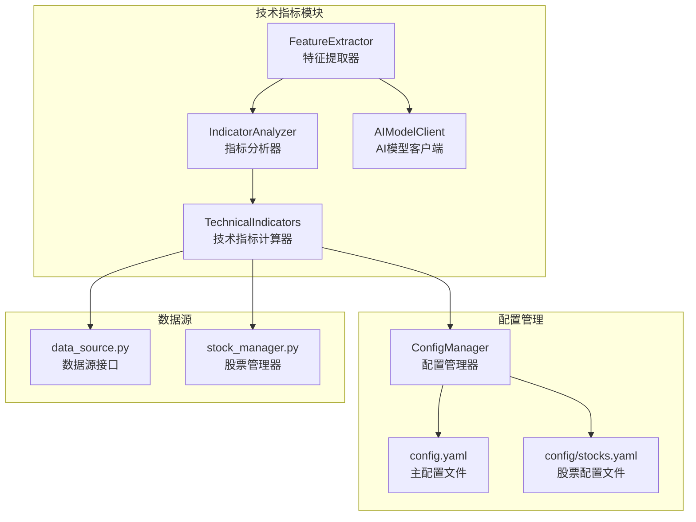
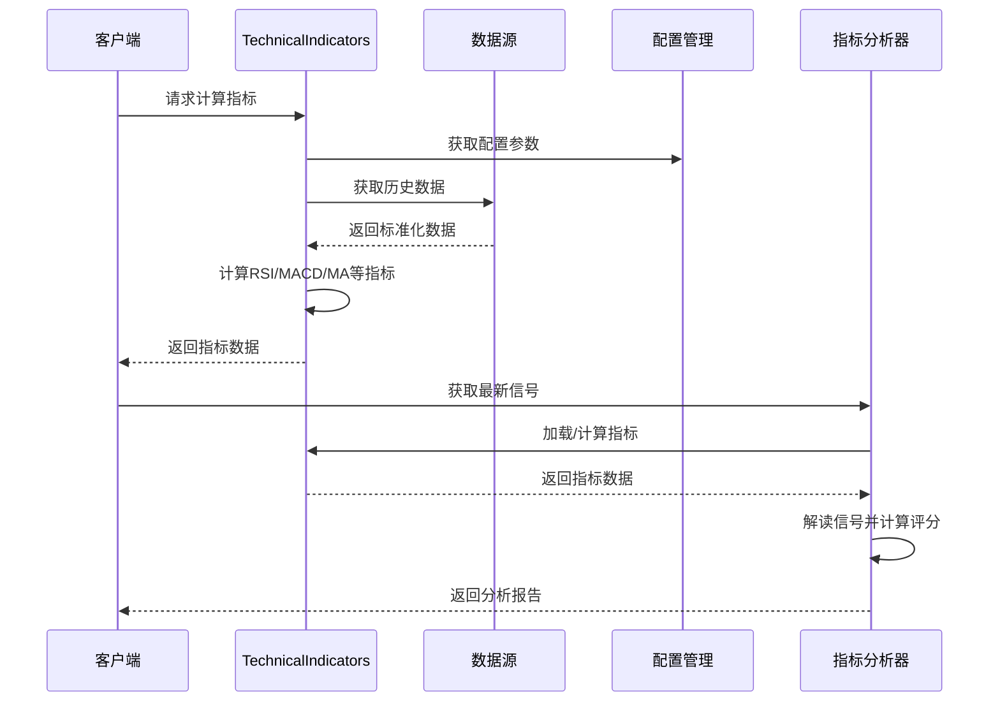
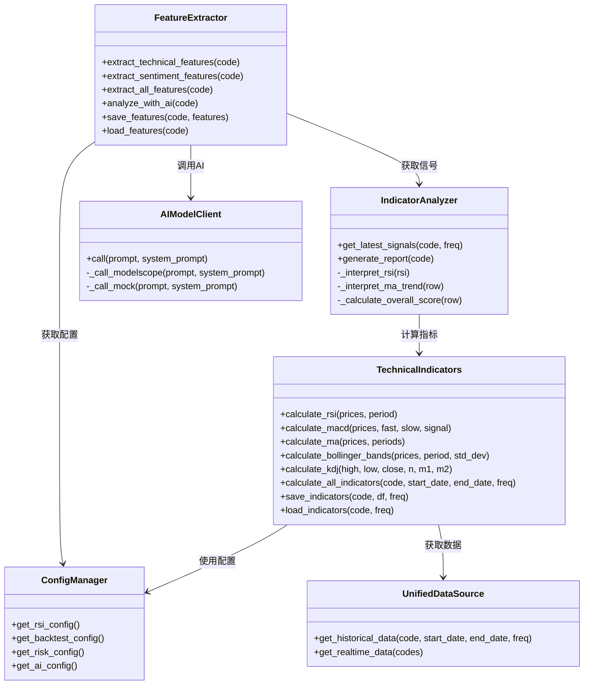

# 技术指标模块

<cite>
**本文档引用的文件**
- [indicators.py](file://quant_system/indicators.py)
- [feature_extractor.py](file://quant_system/feature_extractor.py)
- [config_manager.py](file://quant_system/config_manager.py)
- [data_source.py](file://quant_system/data_source.py)
- [stock_manager.py](file://quant_system/stock_manager.py)
- [config.yaml](file://config.yaml)
- [config/stocks.yaml](file://config/stocks.yaml)
- [strategy.py](file://quant_system/strategy.py)
</cite>

## 目录
1. [简介](#简介)
2. [项目结构](#项目结构)
3. [核心组件](#核心组件)
4. [架构概览](#架构概览)
5. [详细组件分析](#详细组件分析)
6. [依赖关系分析](#依赖关系分析)
7. [性能考虑](#性能考虑)
8. [故障排除指南](#故障排除指南)
9. [结论](#结论)
10. [附录](#附录)

## 简介
技术指标模块是vibequation量化交易系统的核心组成部分，负责计算和分析各种技术指标，为投资决策提供数据支撑。该模块实现了RSI相对强弱指数、MACD指数平滑异同移动平均线、移动平均线、布林带、KDJ随机指标等经典技术分析工具，并提供了指标信号解读、综合评分和报告生成功能。

## 项目结构
技术指标模块位于quant_system目录下，采用面向对象的设计模式，通过配置驱动的方式实现灵活的指标计算和管理。

**图表来源**
- [indicators.py:21-500](file://quant_system/indicators.py#L21-L500)
- [config_manager.py:12-178](file://quant_system/config_manager.py#L12-L178)
- [data_source.py:24-423](file://quant_system/data_source.py#L24-L423)
- [stock_manager.py:62-278](file://quant_system/stock_manager.py#L62-L278)

**章节来源**
- [indicators.py:1-500](file://quant_system/indicators.py#L1-L500)
- [config_manager.py:1-178](file://quant_system/config_manager.py#L1-L178)

## 核心组件
技术指标模块包含三个主要组件：技术指标计算器、指标分析器和特征提取器，它们协同工作提供完整的指标分析功能。

### 技术指标计算器 (TechnicalIndicators)
负责具体的指标计算逻辑，支持多种经典技术指标的计算和批量处理。

### 指标分析器 (IndicatorAnalyzer)
对计算出的指标进行信号解读和综合评分，生成可读的分析报告。

### 特征提取器 (FeatureExtractor)
结合技术指标和情感分析，提取可用于AI决策的特征向量。

**章节来源**
- [indicators.py:21-500](file://quant_system/indicators.py#L21-L500)

## 架构概览
技术指标模块采用分层架构设计，各层职责清晰分离，便于维护和扩展。

**图表来源**
- [indicators.py:188-328](file://quant_system/indicators.py#L188-L328)
- [data_source.py:300-336](file://quant_system/data_source.py#L300-L336)
- [config_manager.py:133-140](file://quant_system/config_manager.py#L133-L140)

## 详细组件分析

### 技术指标计算器 (TechnicalIndicators)

#### RSI相对强弱指数
RSI是衡量超买超卖状态的重要指标，通过计算一定时期内价格上涨幅度的平均值与下跌幅度平均值的比值来判断市场情绪。

**数学原理**：
- 计算价格变化：ΔP = P(t) - P(t-1)
- 分离上涨和下跌：Gain = max(ΔP, 0)，Loss = max(-ΔP, 0)
- 计算平均值：AvgGain = SMA(Gain, n)，AvgLoss = SMA(Loss, n)
- 计算RS：RS = AvgGain / AvgLoss
- 计算RSI：RSI = 100 - (100 / (1 + RS))

**参数设置**：
- 周期长度：支持6、12、24日周期
- 历史回看：252个交易日用于计算百分位
- 时间框架：支持日线、周线、月线

**信号生成规则**：
- 超买：RSI > 80
- 强势：60 < RSI ≤ 80
- 中性：40 < RSI ≤ 60
- 弱势：20 < RSI ≤ 40
- 超卖：RSI ≤ 20

#### MACD指数平滑异同移动平均线
MACD通过计算两条不同周期的指数移动平均线的差值来判断趋势变化和动能强弱。

**数学原理**：
- 快线：EMA(close, fast)
- 慢线：EMA(close, slow)
- MACD线：快线 - 慢线
- 信号线：EMA(MACD, signal)
- 柱状图：MACD - 信号线

**参数设置**：
- 快线周期：12日
- 慢线周期：26日
- 信号线周期：9日

**信号生成规则**：
- 金叉：MACD线上穿信号线，买入信号
- 死叉：MACD线下穿信号线，卖出信号
- 柱状图正负：反映动能强弱

#### 移动平均线
移动平均线通过计算一定时期内的平均价格来识别趋势方向和支撑阻力位。

**参数设置**：
- 支持周期：5、10、20、60、120、250日
- 计算方法：简单移动平均

**趋势解读**：
- 多头排列：短期均线 > 中期均线 > 长期均线
- 空头排列：短期均线 < 中期均线 < 长期均线
- 上升趋势：收盘价 > 中期均线
- 下降趋势：收盘价 < 中期均线

#### 布林带
布林带由中轨（移动平均线）和上下轨（标准差区间）组成，用于衡量价格波动性和突破时机。

**数学原理**：
- 中轨：MA(close, n)
- 上轨：中轨 + k × StdDev
- 下轨：中轨 - k × StdDev

**参数设置**：
- 周期：20日
- 标准差倍数：2.0

**信号生成规则**：
- 价格触及上轨：可能超买
- 价格触及下轨：可能超卖
- 布林带收窄：可能即将突破

#### KDJ随机指标
KDJ是基于最高价、最低价和收盘价计算的随机指标，用于判断超买超卖和背离现象。

**数学原理**：
- RSV = (close - min(low, n)) / (max(high, n) - min(low, n)) × 100
- K = EMA(RSV, m1)
- D = EMA(K, m2)
- J = 3K - 2D

**参数设置**：
- RSV周期：9日
- K平滑周期：3日
- D平滑周期：3日

**信号生成规则**：
- 超买：K、D > 80
- 超卖：K、D < 20
- 金叉死叉：K线上穿/D线下穿形成买卖信号

**章节来源**
- [indicators.py:37-170](file://quant_system/indicators.py#L37-L170)
- [indicators.py:218-273](file://quant_system/indicators.py#L218-L273)

### 指标分析器 (IndicatorAnalyzer)

#### 综合评分系统
指标分析器通过加权计算生成综合评分，为投资决策提供量化依据。

**评分算法**：
- RSI评分：(RSI-50) × 0.5
- MACD评分：直方图值 × 10
- 均线评分：收盘价与20日均线关系
- KDJ评分：J值与50的关系

**信号解读**：
- 评分范围：-100到100
- 看多：评分 > 20
- 看空：评分 < -20
- 观望：-20 ≤ 评分 ≤ 20

**章节来源**
- [indicators.py:330-495](file://quant_system/indicators.py#L330-L495)

### 特征提取器 (FeatureExtractor)

#### 技术特征提取
特征提取器将技术指标转换为AI模型可用的特征向量。

**特征构成**：
- 趋势强度：综合评分的归一化值
- 趋势方向：正负号表示
- RSI水平：RSI(6)的归一化值
- MACD动量：柱状图符号
- 均线对齐：多头/空头排列判断
- 波动性代理：KDJ J值偏离程度
- 布林带位置：相对位置

**章节来源**
- [feature_extractor.py:99-212](file://quant_system/feature_extractor.py#L99-L212)

## 依赖关系分析

**图表来源**
- [indicators.py:21-500](file://quant_system/indicators.py#L21-L500)
- [feature_extractor.py:24-405](file://quant_system/feature_extractor.py#L24-L405)
- [config_manager.py:12-178](file://quant_system/config_manager.py#L12-L178)
- [data_source.py:300-423](file://quant_system/data_source.py#L300-L423)

**章节来源**
- [indicators.py:14-16](file://quant_system/indicators.py#L14-L16)
- [feature_extractor.py:16-20](file://quant_system/feature_extractor.py#L16-L20)

## 性能考虑

### 计算优化策略
1. **向量化计算**：使用pandas和numpy的向量化操作替代循环
2. **滚动窗口优化**：合理设置min_periods参数避免早期NA值
3. **内存管理**：及时释放不需要的大数据集
4. **增量更新**：支持历史数据的增量更新

### 存储优化
1. **CSV格式存储**：使用UTF-8编码减少文件大小
2. **目录结构**：按股票代码和时间频率组织文件
3. **数据类型优化**：确保数值列使用适当的数据类型

### 并发处理
1. **批量计算**：支持多股票同时计算指标
2. **异步更新**：后台更新指标数据
3. **缓存机制**：避免重复计算相同数据

**章节来源**
- [indicators.py:29-35](file://quant_system/indicators.py#L29-L35)
- [indicators.py:275-305](file://quant_system/indicators.py#L275-L305)

## 故障排除指南

### 常见问题及解决方案

#### 数据获取失败
- **症状**：无法获取历史数据
- **原因**：网络连接、API配额限制、股票代码错误
- **解决**：检查Tushare Token配置，确认股票代码格式

#### 指标计算异常
- **症状**：指标值异常或出现NaN
- **原因**：数据缺失、参数设置不当
- **解决**：检查数据完整性，调整计算参数

#### 内存不足
- **症状**：计算过程中内存溢出
- **原因**：数据量过大、长时间运行
- **解决**：分批处理数据，定期清理缓存

**章节来源**
- [indicators.py:207-209](file://quant_system/indicators.py#L207-L209)
- [data_source.py:134](file://quant_system/data_source.py#L134)

## 结论
技术指标模块为vibequation量化交易系统提供了完整的技术分析能力。通过标准化的指标计算、智能的信号解读和灵活的配置管理，该模块能够适应不同的投资策略和市场环境。模块的设计充分考虑了性能优化和可扩展性，为后续的功能增强奠定了坚实基础。

## 附录

### 配置参数说明

#### 技术指标配置
- RSI配置：支持6、12、24日周期，历史回看252日
- 移动平均线：支持5、10、20、60、120、250日周期
- MACD配置：快线12日，慢线26日，信号线9日

#### 数据存储配置
- 指标数据存储：./data/indicators目录
- 特征数据存储：./data/features目录
- 自动创建缺失目录

**章节来源**
- [config.yaml:40-55](file://config.yaml#L40-L55)
- [config_manager.py:133-140](file://config_manager.py#L133-L140)

### 自定义指标开发指南

#### 扩展步骤
1. 在TechnicalIndicators类中添加新的计算方法
2. 在calculate_all_indicators中集成新指标
3. 在IndicatorAnalyzer中添加信号解读逻辑
4. 更新配置文件添加参数设置
5. 编写单元测试验证功能

#### 开发最佳实践
- 使用pandas向量化操作
- 合理处理边界条件
- 提供详细的参数验证
- 实现异常处理机制
- 编写清晰的文档注释

**章节来源**
- [indicators.py:21-500](file://quant_system/indicators.py#L21-L500)