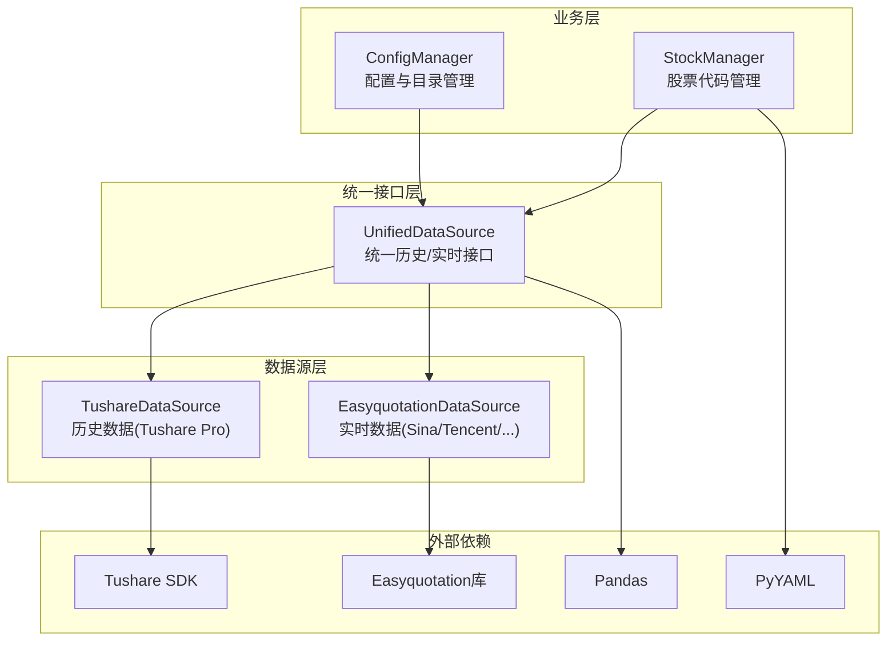
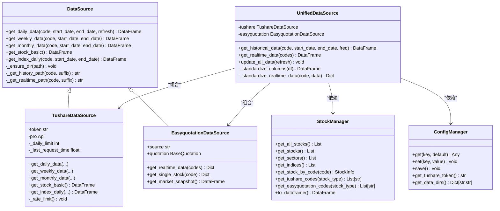
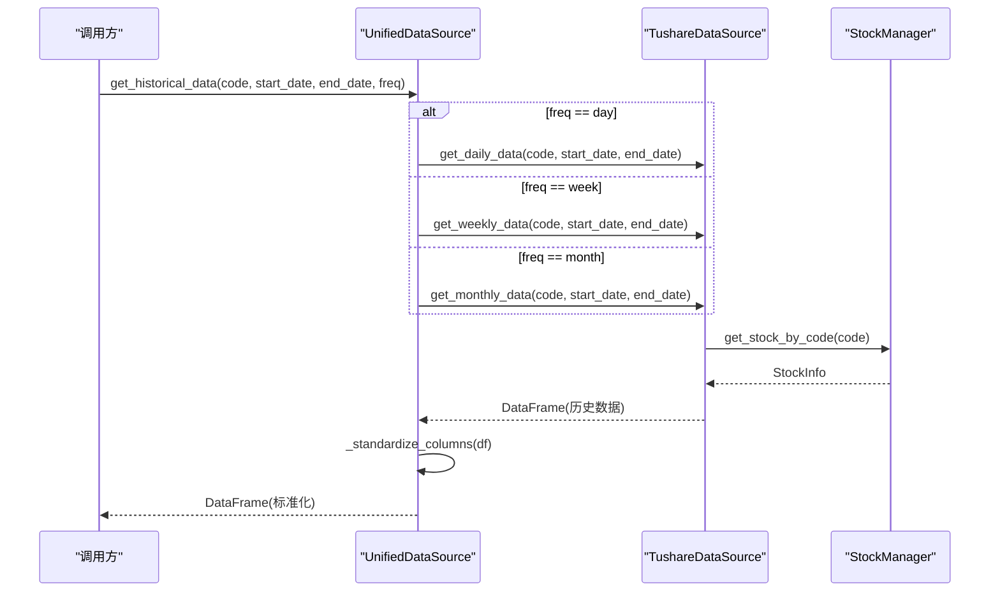
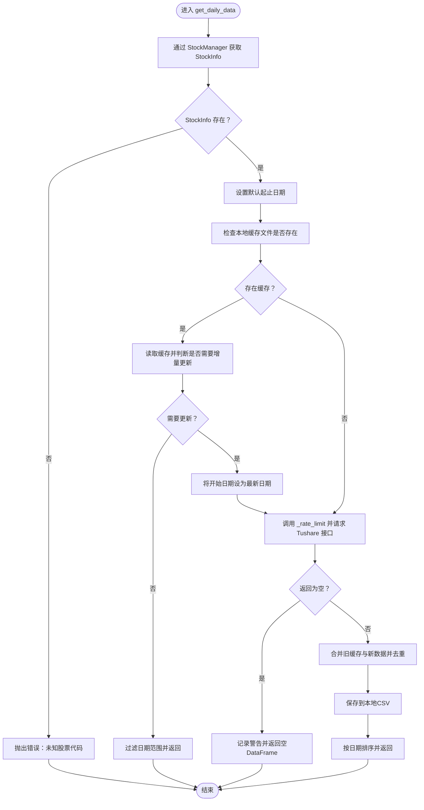
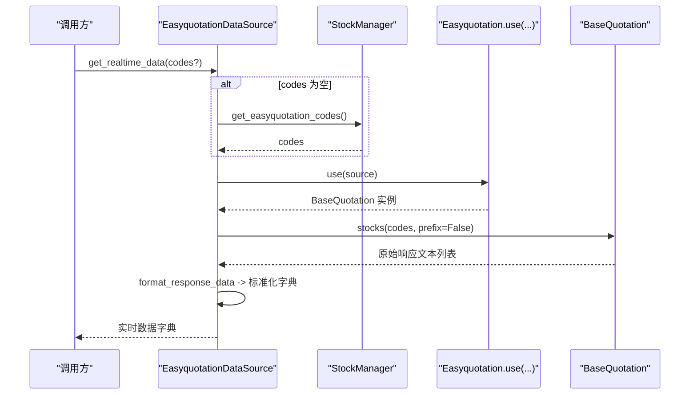
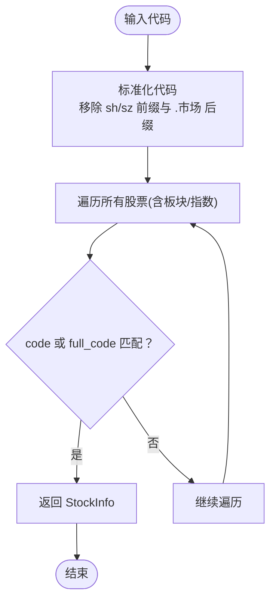
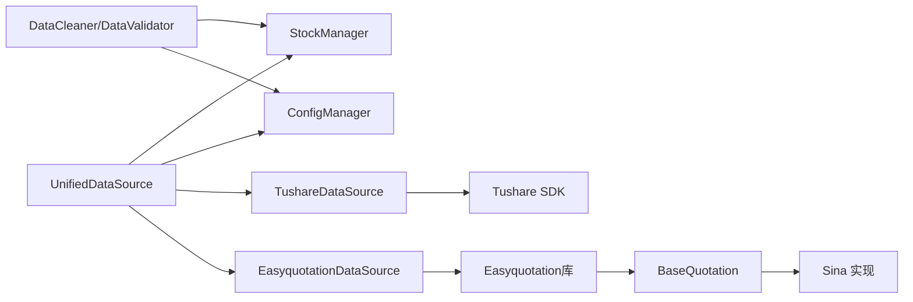

# 数据源管理模块

<cite>
**本文引用的文件**
- [quant_system/data_source.py](file://quant_system/data_source.py)
- [quant_system/stock_manager.py](file://quant_system/stock_manager.py)
- [quant_system/config_manager.py](file://quant_system/config_manager.py)
- [easyquotation/basequotation.py](file://easyquotation/basequotation.py)
- [easyquotation/sina.py](file://easyquotation/sina.py)
- [easyquotation/api.py](file://easyquotation/api.py)
- [easyquotation/helpers.py](file://easyquotation/helpers.py)
- [config/stocks.yaml](file://config/stocks.yaml)
- [config.yaml](file://config.yaml)
- [quant_system/__init__.py](file://quant_system/__init__.py)
- [quant_system/data_cleaner.py](file://quant_system/data_cleaner.py)
</cite>

## 目录
1. [简介](#简介)
2. [项目结构](#项目结构)
3. [核心组件](#核心组件)
4. [架构总览](#架构总览)
5. [详细组件分析](#详细组件分析)
6. [依赖关系分析](#依赖关系分析)
7. [性能考量](#性能考量)
8. [故障排查指南](#故障排查指南)
9. [结论](#结论)
10. [附录](#附录)

## 简介
本文件面向vibequation量化交易系统的数据源管理模块，系统性阐述统一数据源接口的设计理念与实现架构，重点覆盖Tushare与Easyquotation两大数据源的集成方案；解释数据源切换机制、数据质量控制、异常处理策略等关键能力；深入分析StockManager股票代码管理模块的工作原理，包括股票代码的获取、验证、缓存机制；并提供数据采集的频率控制、并发处理、错误重试等技术细节，以及数据源扩展的开发指南与自定义数据源的集成方法。

## 项目结构
数据源管理模块位于quant_system子包内，围绕统一接口设计，向上提供标准数据访问能力，向下对接Tushare（历史数据）与Easyquotation（实时数据）。StockManager负责股票代码与多市场格式转换，ConfigManager提供全局配置与目录管理，Easyquotation库提供实时行情抓取能力。

图表来源
- [quant_system/data_source.py:300-423](file://quant_system/data_source.py#L300-L423)
- [quant_system/stock_manager.py:62-278](file://quant_system/stock_manager.py#L62-L278)
- [quant_system/config_manager.py:12-178](file://quant_system/config_manager.py#L12-L178)
- [easyquotation/basequotation.py:12-122](file://easyquotation/basequotation.py#L12-L122)
- [easyquotation/sina.py:8-79](file://easyquotation/sina.py#L8-L79)

章节来源
- [quant_system/__init__.py:1-24](file://quant_system/__init__.py#L1-L24)
- [config.yaml:1-88](file://config.yaml#L1-L88)
- [config/stocks.yaml:1-71](file://config/stocks.yaml#L1-L71)

## 核心组件
- 统一数据源接口：提供历史与实时数据的统一访问入口，屏蔽底层数据源差异，标准化字段与返回格式。
- Tushare数据源：封装Tushare Pro API，负责日线、周线、月线及指数数据的获取与本地缓存。
- Easyquotation数据源：基于Easyquotation库，提供实时行情获取与市场快照生成。
- 股票代码管理：集中管理股票、板块、指数的代码与多格式转换，支持标准化查询与批量导出。
- 配置管理：集中管理令牌、目录、采集参数、技术指标等配置，并确保数据目录存在。

章节来源
- [quant_system/data_source.py:24-423](file://quant_system/data_source.py#L24-L423)
- [quant_system/stock_manager.py:13-278](file://quant_system/stock_manager.py#L13-L278)
- [quant_system/config_manager.py:12-178](file://quant_system/config_manager.py#L12-L178)

## 架构总览
统一数据源接口通过组合模式聚合Tushare与Easyquotation两类数据源，对外暴露统一的历史与实时数据接口。StockManager提供跨数据源的代码标准化与格式转换，ConfigManager提供令牌与目录等基础设施。Easyquotation库内部采用BaseQuotation抽象与Sina/Tencent等具体实现，支持并发抓取与格式化输出。

图表来源
- [quant_system/data_source.py:24-423](file://quant_system/data_source.py#L24-L423)
- [quant_system/stock_manager.py:62-278](file://quant_system/stock_manager.py#L62-L278)
- [quant_system/config_manager.py:12-178](file://quant_system/config_manager.py#L12-L178)

## 详细组件分析

### 统一数据源接口（UnifiedDataSource）
- 设计目标：对上提供统一的历史与实时数据接口，对下屏蔽Tushare与Easyquotation差异，实现标准化字段与返回格式。
- 历史数据接口：按频率(day/week/month)路由至Tushare数据源，统一列名映射与缺失列补齐。
- 实时数据接口：从Easyquotation获取实时数据，标准化为统一字段并转为DataFrame。
- 批量更新：遍历StockManager中的股票集合，按类型调用Tushare历史数据接口，带延迟避免限流。

图表来源
- [quant_system/data_source.py:307-335](file://quant_system/data_source.py#L307-L335)
- [quant_system/data_source.py:64-136](file://quant_system/data_source.py#L64-L136)
- [quant_system/stock_manager.py:111-128](file://quant_system/stock_manager.py#L111-L128)

章节来源
- [quant_system/data_source.py:300-423](file://quant_system/data_source.py#L300-L423)

### Tushare数据源（TushareDataSource）
- 初始化与限流：读取配置令牌，建立Pro API连接；维护每分钟约500次的简单限流，避免触发平台限流。
- 历史数据获取：
  - 日线：支持增量更新与本地缓存合并，自动去重并保存CSV。
  - 周线/月线：按需获取并排序。
  - 指数日线：针对指数代码进行专门处理。
- 异常处理：捕获网络/解析异常并记录日志，抛出上层处理。

图表来源
- [quant_system/data_source.py:64-136](file://quant_system/data_source.py#L64-L136)
- [quant_system/data_source.py:56-62](file://quant_system/data_source.py#L56-L62)

章节来源
- [quant_system/data_source.py:43-221](file://quant_system/data_source.py#L43-L221)

### Easyquotation数据源（EasyquotationDataSource）
- 初始化：通过use工厂函数选择具体行情源（默认Sina），内部持有BaseQuotation实例。
- 实时数据获取：
  - get_realtime_data：支持传入股票代码列表或自动从StockManager获取。
  - get_single_stock：按StockManager提供的格式获取单只股票实时数据。
  - get_market_snapshot：批量获取并转换为DataFrame。
- 并发与格式化：底层BaseQuotation采用线程池并发抓取，Sina实现正则解析并格式化为统一字典结构。

图表来源
- [quant_system/data_source.py:223-298](file://quant_system/data_source.py#L223-L298)
- [easyquotation/api.py:7-22](file://easyquotation/api.py#L7-L22)
- [easyquotation/basequotation.py:106-122](file://easyquotation/basequotation.py#L106-L122)
- [easyquotation/sina.py:35-79](file://easyquotation/sina.py#L35-L79)

章节来源
- [quant_system/data_source.py:223-298](file://quant_system/data_source.py#L223-L298)
- [easyquotation/basequotation.py:12-122](file://easyquotation/basequotation.py#L12-L122)
- [easyquotation/sina.py:8-79](file://easyquotation/sina.py#L8-L79)
- [easyquotation/api.py:7-22](file://easyquotation/api.py#L7-L22)

### 股票代码管理（StockManager）
- 数据结构：StockInfo数据类封装名称、代码、市场、类型等字段，并提供多格式转换属性（完整代码、Tushare格式、Easyquotation格式）。
- 代码标准化：支持去除市场前缀与后缀，统一为纯数字代码，便于跨数据源匹配。
- 查询与导出：提供按代码/名称查询、按类型分类、批量导出为DataFrame等能力。
- 配置文件：从config/stocks.yaml加载股票、板块、指数配置，支持增删改与保存。

图表来源
- [quant_system/stock_manager.py:111-128](file://quant_system/stock_manager.py#L111-L128)
- [quant_system/stock_manager.py:146-164](file://quant_system/stock_manager.py#L146-L164)

章节来源
- [quant_system/stock_manager.py:13-278](file://quant_system/stock_manager.py#L13-L278)
- [config/stocks.yaml:1-71](file://config/stocks.yaml#L1-L71)

### 配置管理（ConfigManager）
- 单例模式：保证全局唯一配置实例，避免重复加载。
- 键路径访问：支持“a.b.c”形式的嵌套键访问，默认值兜底。
- 目录管理：确保数据目录存在，包括历史、实时、新闻、指标、特征、回测等。
- 令牌与参数：提供Tushare、PushPlus、ModelScope等令牌获取，以及数据采集、技术指标、回测、风控、Web服务等配置项。

章节来源
- [quant_system/config_manager.py:12-178](file://quant_system/config_manager.py#L12-L178)
- [config.yaml:1-88](file://config.yaml#L1-L88)

## 依赖关系分析
- 统一数据源依赖StockManager与ConfigManager，前者提供代码标准化与格式转换，后者提供令牌与目录。
- Tushare数据源依赖Tushare SDK与Pandas，负责历史数据的获取、缓存与标准化。
- Easyquotation数据源依赖Easyquotation库，内部通过BaseQuotation抽象与具体实现（如Sina）协作，支持并发抓取与格式化。
- 数据清洗模块依赖StockManager与ConfigManager，用于验证历史数据完整性与一致性。

图表来源
- [quant_system/data_source.py:300-423](file://quant_system/data_source.py#L300-L423)
- [quant_system/stock_manager.py:62-278](file://quant_system/stock_manager.py#L62-L278)
- [quant_system/config_manager.py:12-178](file://quant_system/config_manager.py#L12-L178)
- [easyquotation/basequotation.py:12-122](file://easyquotation/basequotation.py#L12-L122)
- [easyquotation/sina.py:8-79](file://easyquotation/sina.py#L8-L79)
- [quant_system/data_cleaner.py:392-443](file://quant_system/data_cleaner.py#L392-L443)

章节来源
- [quant_system/data_cleaner.py:392-443](file://quant_system/data_cleaner.py#L392-L443)

## 性能考量
- 速率限制：Tushare数据源内置每分钟约500次的简单限流，避免触发平台限流；批量更新时额外增加固定延迟。
- 并发抓取：Easyquotation底层使用线程池并发请求，提高实时数据获取效率；Sina实现采用正则解析，减少解析开销。
- 缓存策略：历史数据优先读取本地缓存，增量更新时合并旧数据并去重，降低重复请求与IO成本。
- 字段标准化：统一历史与实时数据字段，减少下游处理复杂度，提升整体吞吐。

章节来源
- [quant_system/data_source.py:56-62](file://quant_system/data_source.py#L56-L62)
- [quant_system/data_source.py:414-418](file://quant_system/data_source.py#L414-L418)
- [easyquotation/basequotation.py:113-118](file://easyquotation/basequotation.py#L113-L118)
- [quant_system/data_source.py:93-129](file://quant_system/data_source.py#L93-L129)

## 故障排查指南
- Tushare令牌缺失：初始化Tushare数据源时若未配置令牌会直接抛错，需在配置文件中正确填写。
- 未知股票代码：StockManager无法识别的代码会导致历史数据获取失败，应检查代码标准化与配置文件。
- 网络异常：Tushare与Easyquotation均可能因网络波动导致请求失败，建议在调用处增加重试与降级策略。
- 缓存不一致：历史数据缓存与远端数据不一致时，可使用强制刷新参数重新拉取并覆盖缓存。
- 日志定位：统一使用Python logging模块记录错误与警告，可通过配置文件调整日志级别与输出位置。

章节来源
- [quant_system/data_source.py:48-50](file://quant_system/data_source.py#L48-L50)
- [quant_system/data_source.py:81-82](file://quant_system/data_source.py#L81-L82)
- [quant_system/data_source.py:133-135](file://quant_system/data_source.py#L133-L135)
- [quant_system/data_source.py:255-257](file://quant_system/data_source.py#L255-L257)
- [config.yaml:82-88](file://config.yaml#L82-L88)

## 结论
数据源管理模块通过统一接口实现了Tushare与Easyquotation的无缝集成，配合StockManager的代码标准化与ConfigManager的配置管理，形成了高可用、可扩展的数据采集体系。模块具备完善的缓存与限流策略，支持历史与实时数据的统一访问，并为后续扩展更多数据源提供了清晰的接口与实现范式。

## 附录

### 数据源特点与适用场景
- Tushare（历史数据）：适合获取高质量的历史K线、指数数据与基础信息，稳定性强但有频率限制。
- Easyquotation（实时数据）：适合高频实时行情抓取，支持并发与多源切换，适合短期交易与监控场景。

章节来源
- [quant_system/data_source.py:43-221](file://quant_system/data_source.py#L43-L221)
- [quant_system/data_source.py:223-298](file://quant_system/data_source.py#L223-L298)

### 数据源切换机制
- 统一接口：通过UnifiedDataSource的get_historical_data与get_realtime_data路由到不同数据源。
- 配置驱动：可通过修改配置文件或代码中的数据源选择逻辑实现动态切换。

章节来源
- [quant_system/data_source.py:307-355](file://quant_system/data_source.py#L307-L355)

### 数据质量控制与异常处理
- 数据清洗：DataCleaner/DataValidator提供完整性与一致性校验，支持批量验证历史数据。
- 异常处理：各数据源在获取失败时记录日志并抛出异常，便于上层统一处理。

章节来源
- [quant_system/data_cleaner.py:392-443](file://quant_system/data_cleaner.py#L392-L443)
- [quant_system/data_source.py:133-135](file://quant_system/data_source.py#L133-L135)
- [quant_system/data_source.py:255-257](file://quant_system/data_source.py#L255-L257)

### 数据采集频率控制、并发处理与错误重试
- 频率控制：Tushare数据源内置限流；批量更新时增加固定延迟。
- 并发处理：Easyquotation底层使用线程池并发抓取。
- 错误重试：建议在调用方增加指数退避重试与降级策略，避免瞬时故障影响整体流程。

章节来源
- [quant_system/data_source.py:56-62](file://quant_system/data_source.py#L56-L62)
- [quant_system/data_source.py:414-418](file://quant_system/data_source.py#L414-L418)
- [easyquotation/basequotation.py:113-118](file://easyquotation/basequotation.py#L113-L118)

### 自定义数据源集成指南
- 实现DataSource基类：提供历史与实时数据接口，遵循统一字段命名与返回格式。
- 注册到统一接口：在UnifiedDataSource中新增分支或替换现有分支，确保get_historical_data/get_realtime_data正确路由。
- 配置与目录：通过ConfigManager提供令牌与目录配置，确保数据落盘与日志输出正常。
- 测试与验证：编写单元测试覆盖数据获取、缓存、异常等场景，结合DataCleaner进行质量验证。

章节来源
- [quant_system/data_source.py:24-42](file://quant_system/data_source.py#L24-L42)
- [quant_system/data_source.py:300-355](file://quant_system/data_source.py#L300-L355)
- [quant_system/config_manager.py:101-131](file://quant_system/config_manager.py#L101-L131)