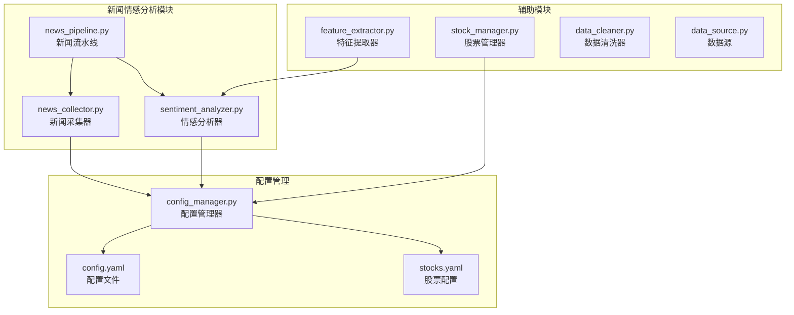
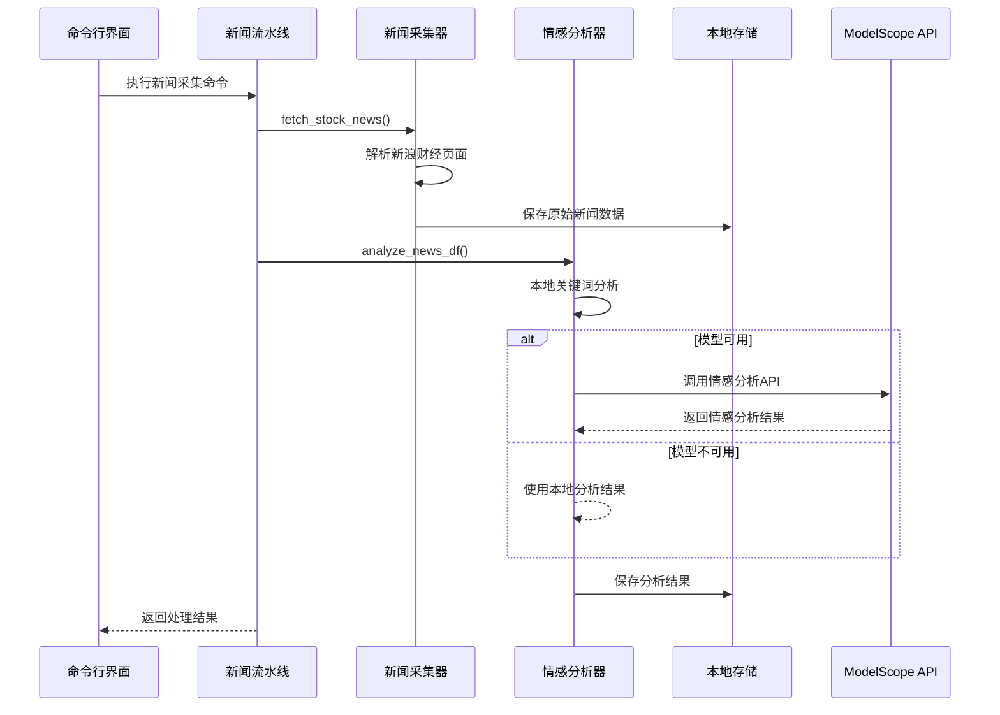
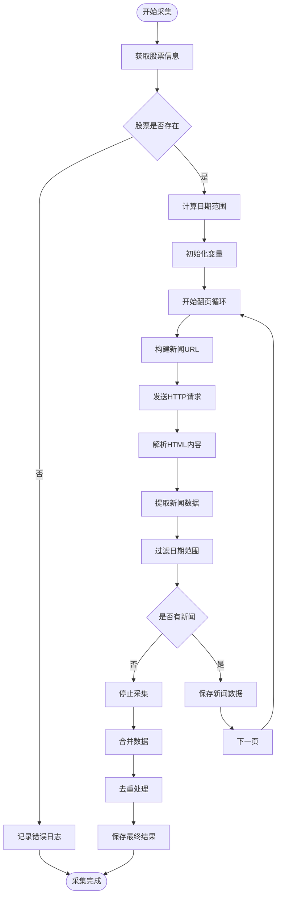
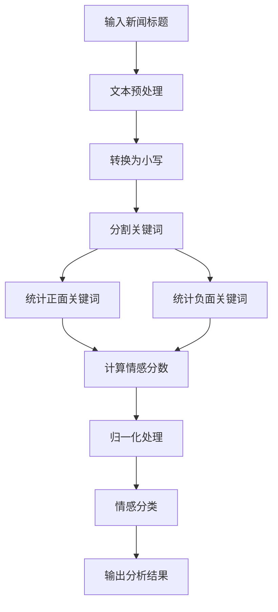
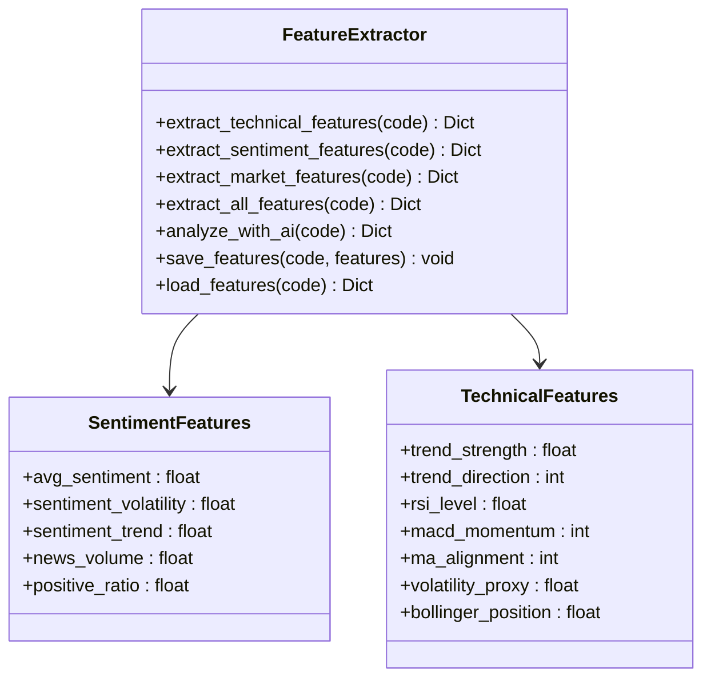
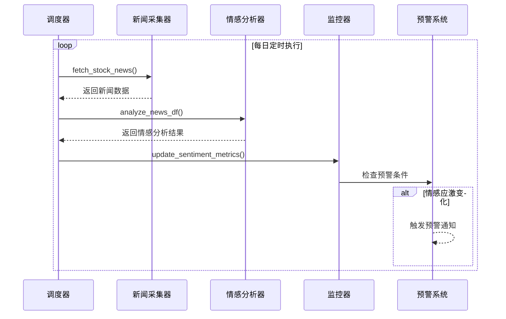
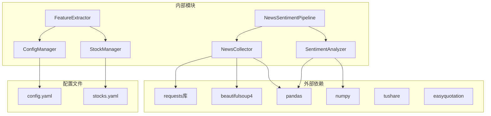

# 新闻情感分析模块

<cite>
**本文档引用的文件**
- [news_collector.py](file://quant_system/news_collector.py)
- [feature_extractor.py](file://quant_system/feature_extractor.py)
- [config_manager.py](file://quant_system/config_manager.py)
- [config.yaml](file://config.yaml)
- [stock_manager.py](file://quant_system/stock_manager.py)
- [main.py](file://main.py)
- [data_cleaner.py](file://quant_system/data_cleaner.py)
- [data_source.py](file://quant_system/data_source.py)
- [stocks.yaml](file://config/stocks.yaml)
</cite>

## 目录
1. [简介](#简介)
2. [项目结构](#项目结构)
3. [核心组件](#核心组件)
4. [架构概览](#架构概览)
5. [详细组件分析](#详细组件分析)
6. [依赖关系分析](#依赖关系分析)
7. [性能考虑](#性能考虑)
8. [故障排除指南](#故障排除指南)
9. [结论](#结论)

## 简介

vibequation量化交易系统的新闻情感分析模块是一个完整的新闻采集、处理和分析系统，专门用于为量化投资决策提供情感数据支持。该模块集成了新闻数据采集、情感分析、特征提取和实时监控等功能，为用户提供全面的新闻情感分析解决方案。

模块的核心功能包括：
- 多源新闻数据采集和去重处理
- 基于关键词和深度学习的情感分析
- 日度情感汇总和趋势分析
- 与技术指标的融合分析
- 实时情感监控和预警机制

## 项目结构

新闻情感分析模块位于quant_system目录下，采用模块化设计，主要包含以下核心文件：

**图表来源**
- [news_collector.py:1-465](file://quant_system/news_collector.py#L1-L465)
- [config_manager.py:1-178](file://quant_system/config_manager.py#L1-L178)
- [feature_extractor.py:1-405](file://quant_system/feature_extractor.py#L1-L405)

**章节来源**
- [news_collector.py:1-465](file://quant_system/news_collector.py#L1-L465)
- [config_manager.py:1-178](file://quant_system/config_manager.py#L1-L178)
- [feature_extractor.py:1-405](file://quant_system/feature_extractor.py#L1-L405)

## 核心组件

### 新闻采集器 (NewsCollector)

新闻采集器负责从新浪财经等新闻源获取股票相关新闻，并进行数据清洗和存储。其主要特性包括：

- **多页翻页抓取**：支持分页获取新闻数据，最多可翻页10次
- **日期范围过滤**：自动过滤指定日期范围内的新闻
- **数据去重**：基于日期和标题进行去重处理
- **本地存储**：将新闻数据保存为CSV格式文件

### 情感分析器 (SentimentAnalyzer)

情感分析器提供两种分析模式：本地关键词分析和ModelScope云端API分析。

**本地分析模式**：
- 基于预定义的正面和负面关键词词典
- 支持中英文关键词识别
- 计算情感分数和概率分布

**云端分析模式**：
- 调用ModelScope情感分析API
- 支持中文情感分类任务
- 自动降级到本地分析

### 新闻情感流水线 (NewsSentimentPipeline)

新闻情感流水线整合了新闻采集和情感分析的完整流程，提供一键式处理能力。

**处理流程**：
1. 采集指定股票的新闻数据
2. 对新闻标题进行情感分析
3. 生成日度情感汇总统计
4. 保存分析结果到本地文件

**章节来源**
- [news_collector.py:24-465](file://quant_system/news_collector.py#L24-L465)
- [feature_extractor.py:99-405](file://quant_system/feature_extractor.py#L99-L405)

## 架构概览

新闻情感分析模块采用分层架构设计，各组件职责明确，耦合度低，便于维护和扩展。

**图表来源**
- [news_collector.py:409-458](file://quant_system/news_collector.py#L409-L458)
- [feature_extractor.py:213-283](file://quant_system/feature_extractor.py#L213-L283)

## 详细组件分析

### 新闻采集与处理流程

新闻采集过程采用稳健的爬虫策略，确保数据质量和完整性：

**图表来源**
- [news_collector.py:43-154](file://quant_system/news_collector.py#L43-L154)

### 情感分析算法实现

情感分析采用混合策略，结合本地规则和云端API分析：

#### 本地关键词分析算法

**图表来源**
- [news_collector.py:269-325](file://quant_system/news_collector.py#L269-L325)

#### 情感分类阈值设定

情感分析采用严格的阈值分类机制：

| 分类 | 情感分数范围 | 描述 |
|------|-------------|------|
| positive | score > 0.2 | 明显积极的新闻 |
| neutral | -0.2 ≤ score ≤ 0.2 | 中性的新闻 |
| negative | score < -0.2 | 明显消极的新闻 |

**章节来源**
- [news_collector.py:205-400](file://quant_system/news_collector.py#L205-L400)

### 特征提取与融合

情感特征与技术指标的融合分析提供了更全面的投资决策支持：

**图表来源**
- [feature_extractor.py:99-212](file://quant_system/feature_extractor.py#L99-L212)

**章节来源**
- [feature_extractor.py:142-170](file://quant_system/feature_extractor.py#L142-L170)

### 实时监控与预警机制

模块提供了完善的实时监控和预警功能：

#### 实时情感监控流程

**图表来源**
- [news_collector.py:409-458](file://quant_system/news_collector.py#L409-L458)

## 依赖关系分析

新闻情感分析模块的依赖关系清晰，各组件间耦合度低，便于独立开发和测试。

**图表来源**
- [news_collector.py:6-18](file://quant_system/news_collector.py#L6-L18)
- [feature_extractor.py:16-19](file://quant_system/feature_extractor.py#L16-L19)
- [config_manager.py:12-27](file://quant_system/config_manager.py#L12-L27)

**章节来源**
- [news_collector.py:1-465](file://quant_system/news_collector.py#L1-L465)
- [feature_extractor.py:1-405](file://quant_system/feature_extractor.py#L1-L405)
- [config_manager.py:1-178](file://quant_system/config_manager.py#L1-L178)

## 性能考虑

### 数据采集性能优化

新闻采集模块采用了多项性能优化措施：

- **并发控制**：合理控制请求频率，避免被目标网站封禁
- **缓存机制**：本地缓存已获取的新闻数据，减少重复抓取
- **增量更新**：仅获取新增的新闻数据，提高效率
- **错误重试**：网络异常时自动重试，保证数据完整性

### 内存使用优化

情感分析过程中采用了内存友好的处理方式：

- **批量处理**：对大量新闻数据进行分批处理
- **流式读取**：避免一次性加载所有数据到内存
- **及时释放**：处理完成后及时释放不再使用的数据

### 计算复杂度分析

情感分析的时间复杂度为O(n*m)，其中n为新闻数量，m为关键词数量。空间复杂度为O(n)。

## 故障排除指南

### 常见问题及解决方案

#### 新闻采集失败

**问题症状**：新闻数据为空或采集中断

**可能原因**：
- 网络连接不稳定
- 目标网站结构调整
- 请求频率过高被限制

**解决方法**：
1. 检查网络连接状态
2. 更新新闻源URL结构
3. 降低请求频率
4. 添加代理IP轮换

#### 情感分析结果异常

**问题症状**：情感分数不合理或分类错误

**可能原因**：
- 关键词词典不完整
- 文本预处理不当
- 模型参数配置错误

**解决方法**：
1. 扩展关键词词典
2. 优化文本预处理规则
3. 调整情感分类阈值
4. 更新模型配置

#### 性能问题

**问题症状**：处理速度慢或内存占用过高

**解决方法**：
1. 增加系统资源
2. 优化数据处理算法
3. 实施数据分片处理
4. 添加缓存机制

**章节来源**
- [news_collector.py:138-143](file://quant_system/news_collector.py#L138-L143)
- [feature_extractor.py:278-283](file://quant_system/feature_extractor.py#L278-L283)

## 结论

vibequation新闻情感分析模块是一个功能完整、架构清晰的量化交易辅助工具。模块的主要优势包括：

**技术优势**：
- 多源数据采集和智能去重
- 混合情感分析算法，兼顾准确性和实时性
- 完善的特征提取和融合分析
- 实时监控和预警机制

**应用价值**：
- 为量化投资决策提供情感维度的数据支持
- 与其他技术指标形成互补分析
- 支持多种投资策略的制定和优化
- 提供可视化的分析报告和监控界面

**扩展潜力**：
- 支持更多新闻源和情感分析模型
- 集成机器学习算法提升分析精度
- 扩展到其他金融市场的应用
- 增强实时预警和自动化交易集成

该模块为量化交易系统提供了重要的情感分析能力，有助于提高投资决策的质量和准确性。