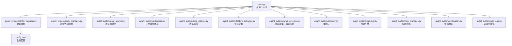
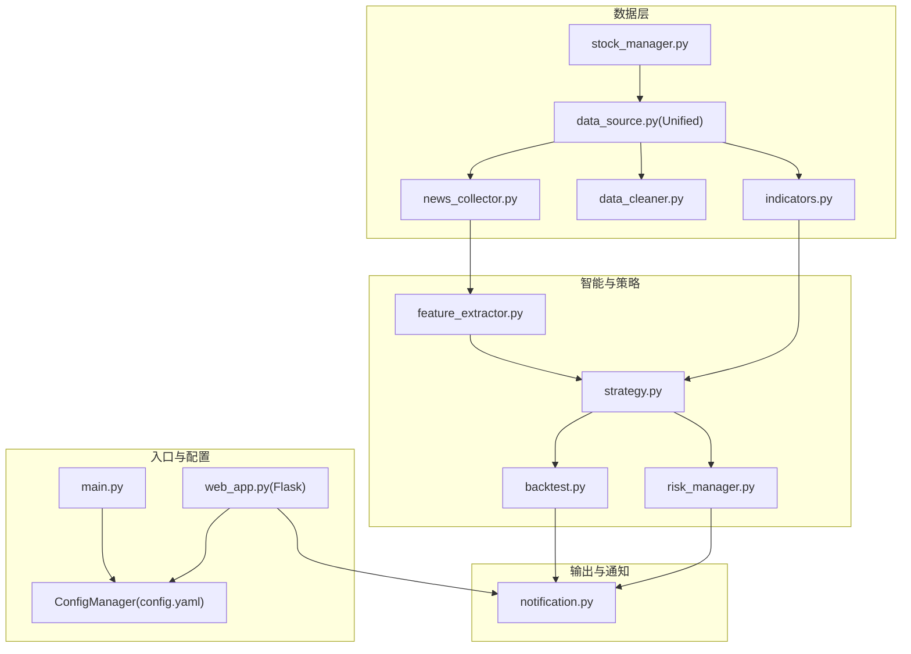
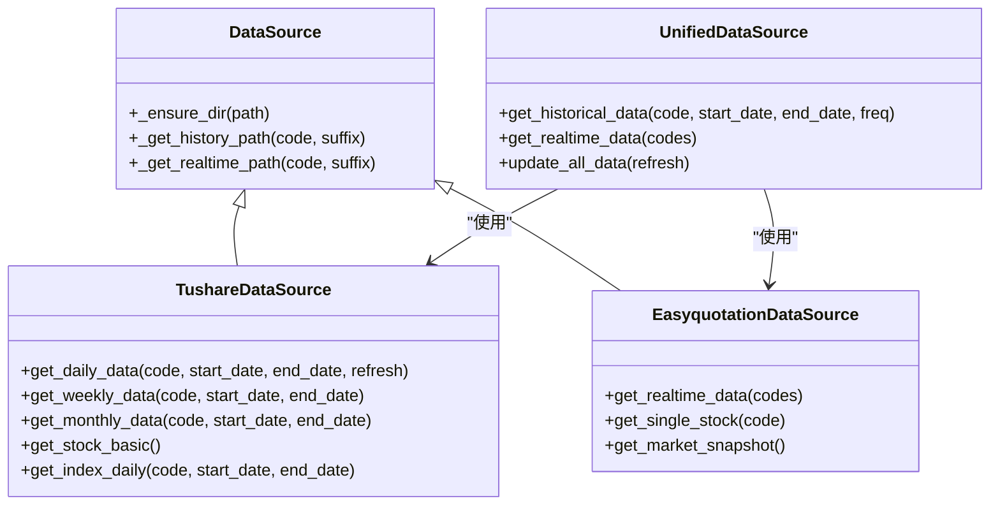
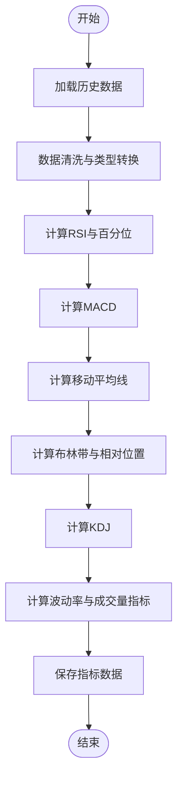
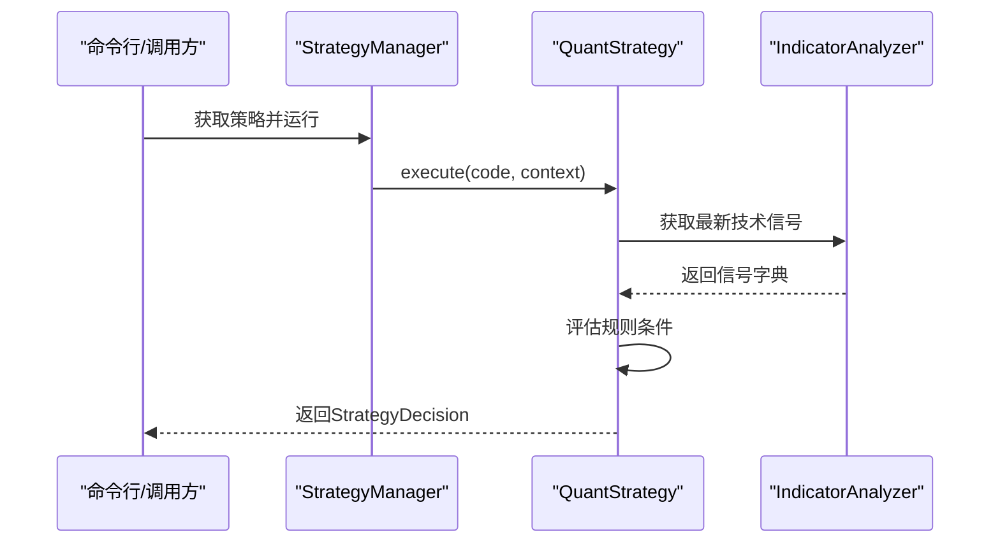
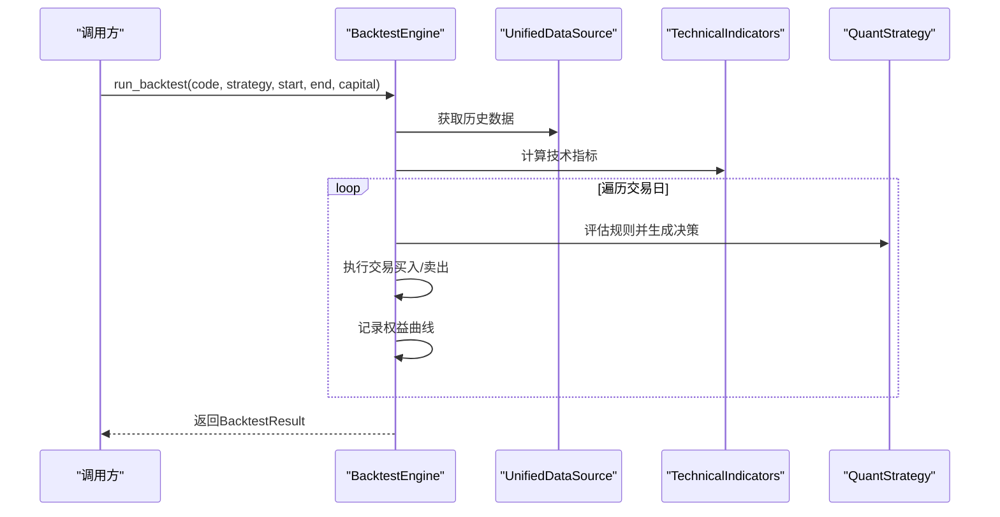
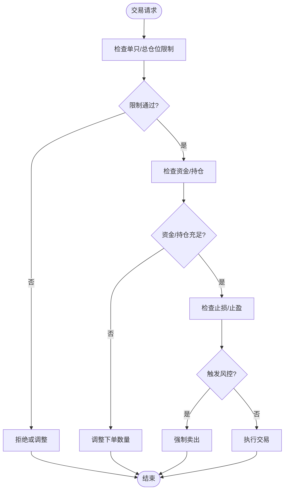
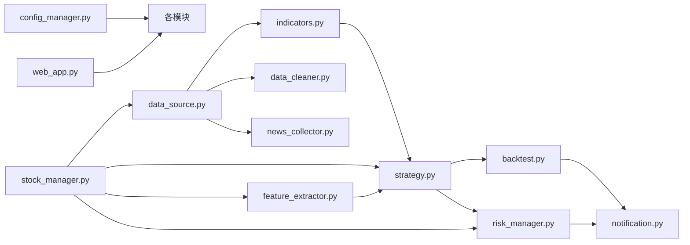

# 核心模块

<cite>
**本文引用的文件**
- [main.py](file://main.py)
- [quant_system/__init__.py](file://quant_system/__init__.py)
- [quant_system/config_manager.py](file://quant_system/config_manager.py)
- [quant_system/data_source.py](file://quant_system/data_source.py)
- [quant_system/indicators.py](file://quant_system/indicators.py)
- [quant_system/strategy.py](file://quant_system/strategy.py)
- [quant_system/backtest.py](file://quant_system/backtest.py)
- [quant_system/risk_manager.py](file://quant_system/risk_manager.py)
- [quant_system/stock_manager.py](file://quant_system/stock_manager.py)
- [quant_system/data_cleaner.py](file://quant_system/data_cleaner.py)
- [quant_system/feature_extractor.py](file://quant_system/feature_extractor.py)
- [quant_system/news_collector.py](file://quant_system/news_collector.py)
- [quant_system/notification.py](file://quant_system/notification.py)
- [quant_system/web_app.py](file://quant_system/web_app.py)
- [config.yaml](file://config.yaml)
</cite>

## 目录
1. [简介](#简介)
2. [项目结构](#项目结构)
3. [核心组件](#核心组件)
4. [架构总览](#架构总览)
5. [详细组件分析](#详细组件分析)
6. [依赖关系分析](#依赖关系分析)
7. [性能考量](#性能考量)
8. [故障排查指南](#故障排查指南)
9. [结论](#结论)
10. [附录](#附录)

## 简介
本文件面向vibequation量化交易系统的核心模块，系统性梳理配置管理、数据源管理、技术指标计算、策略管理、回测引擎、风险控制、数据清洗、特征提取、新闻采集与情感分析、消息通知及Web可视化等模块的职责、实现原理与使用方法，并给出模块间交互关系、扩展点与二次开发建议。

## 项目结构
系统采用模块化分层设计，核心模块位于quant_system包内，入口脚本负责命令行调度与Web服务启动；配置文件集中于config.yaml与各模块内部的配置读取封装。

**图示来源**
- [main.py:1-365](file://main.py#L1-L365)
- [quant_system/config_manager.py:1-178](file://quant_system/config_manager.py#L1-L178)
- [config.yaml:1-88](file://config.yaml#L1-L88)

**章节来源**
- [main.py:1-365](file://main.py#L1-L365)
- [quant_system/__init__.py:1-24](file://quant_system/__init__.py#L1-L24)
- [config.yaml:1-88](file://config.yaml#L1-L88)

## 核心组件
- 配置管理模块：集中读取与导出配置，提供令牌、数据目录、技术指标、回测、风控、AI模型、Web服务等配置项的访问接口。
- 数据源管理模块：统一Tushare与Easyquotation的数据采集，提供历史与实时数据的标准化接口。
- 技术指标模块：计算RSI、MACD、移动平均线、布林带、KDJ、波动率等指标，并支持批量更新与报告生成。
- 策略管理模块：支持自然语言策略解析、量化规则执行、AI综合决策与策略类型分类。
- 回测引擎模块：基于策略规则的历史回测，计算收益、风险与交易统计指标，并生成可视化图表。
- 风险控制模块：仓位限制、止损止盈、资金与持仓管理、组合风险评估与报告生成。
- 数据清洗模块：完整性检查、去重、缺失值填充、异常值检测、OHLC一致性校验与清洗报告。
- 特征提取模块：技术特征、情感特征与市场特征提取，结合AI进行策略类型分类。
- 新闻采集与情感分析模块：采集新浪新闻并进行情感分析，支持本地规则与ModelScope API。
- 消息通知模块：基于PushPlus的微信推送，支持策略信号、回测报告、风险预警等模板。
- Web可视化模块：Flask接口与前端模板，提供K线图、指标图、回测图与仪表盘页面。

**章节来源**
- [quant_system/config_manager.py:1-178](file://quant_system/config_manager.py#L1-L178)
- [quant_system/data_source.py:1-423](file://quant_system/data_source.py#L1-L423)
- [quant_system/indicators.py:1-500](file://quant_system/indicators.py#L1-L500)
- [quant_system/strategy.py:1-553](file://quant_system/strategy.py#L1-L553)
- [quant_system/backtest.py:1-456](file://quant_system/backtest.py#L1-L456)
- [quant_system/risk_manager.py:1-404](file://quant_system/risk_manager.py#L1-L404)
- [quant_system/data_cleaner.py:1-444](file://quant_system/data_cleaner.py#L1-L444)
- [quant_system/feature_extractor.py:1-405](file://quant_system/feature_extractor.py#L1-L405)
- [quant_system/news_collector.py:1-465](file://quant_system/news_collector.py#L1-L465)
- [quant_system/notification.py:1-301](file://quant_system/notification.py#L1-L301)
- [quant_system/web_app.py:1-466](file://quant_system/web_app.py#L1-L466)

## 架构总览
系统通过命令行入口统一调度各模块，Web服务提供REST接口与可视化页面。模块间通过统一配置中心与股票管理器解耦，数据流从数据源到指标、特征、策略、回测与风控闭环。

**图示来源**
- [main.py:1-365](file://main.py#L1-L365)
- [quant_system/web_app.py:1-466](file://quant_system/web_app.py#L1-L466)
- [quant_system/config_manager.py:1-178](file://quant_system/config_manager.py#L1-L178)
- [quant_system/stock_manager.py:1-278](file://quant_system/stock_manager.py#L1-L278)
- [quant_system/data_source.py:1-423](file://quant_system/data_source.py#L1-L423)
- [quant_system/indicators.py:1-500](file://quant_system/indicators.py#L1-L500)
- [quant_system/data_cleaner.py:1-444](file://quant_system/data_cleaner.py#L1-L444)
- [quant_system/news_collector.py:1-465](file://quant_system/news_collector.py#L1-L465)
- [quant_system/feature_extractor.py:1-405](file://quant_system/feature_extractor.py#L1-L405)
- [quant_system/strategy.py:1-553](file://quant_system/strategy.py#L1-L553)
- [quant_system/backtest.py:1-456](file://quant_system/backtest.py#L1-L456)
- [quant_system/risk_manager.py:1-404](file://quant_system/risk_manager.py#L1-L404)
- [quant_system/notification.py:1-301](file://quant_system/notification.py#L1-L301)

## 详细组件分析

### 配置管理模块
- 职责：集中读取与导出配置，确保数据目录存在，提供各类配置项的便捷访问。
- 关键能力：
  - 递归读取嵌套配置键（如“tokens.tushare_token”）
  - 保存配置到文件
  - 提供技术指标、回测、风控、AI模型、Web服务等专用配置读取方法
- 使用示例路径：
  - [获取技术指标配置:133-139](file://quant_system/config_manager.py#L133-L139)
  - [获取回测配置:141-147](file://quant_system/config_manager.py#L141-L147)
  - [获取风控配置:149-156](file://quant_system/config_manager.py#L149-L156)
  - [获取AI模型配置:158-165](file://quant_system/config_manager.py#L158-L165)
  - [获取Web服务配置:167-173](file://quant_system/config_manager.py#L167-L173)
- 扩展点：新增配置项只需在config.yaml中添加键值，并在ConfigManager中增加相应getter方法。

**章节来源**
- [quant_system/config_manager.py:1-178](file://quant_system/config_manager.py#L1-L178)
- [config.yaml:1-88](file://config.yaml#L1-L88)

### 数据源管理模块
- 职责：统一Tushare与Easyquotation的数据采集，提供历史与实时数据的标准化接口。
- 关键能力：
  - TushareDataSource：历史日线/周线/月线、指数数据、基础信息、速率限制
  - EasyquotationDataSource：实时行情、市场快照
  - UnifiedDataSource：统一接口、列标准化、批量更新
- 使用示例路径：
  - [获取历史数据（统一接口）:307-335](file://quant_system/data_source.py#L307-L335)
  - [获取实时数据（统一接口）:337-355](file://quant_system/data_source.py#L337-L355)
  - [更新所有股票历史数据:396-419](file://quant_system/data_source.py#L396-L419)
- 扩展点：新增数据源可在UnifiedDataSource中注册并实现标准化接口。

**图示来源**
- [quant_system/data_source.py:24-423](file://quant_system/data_source.py#L24-L423)

**章节来源**
- [quant_system/data_source.py:1-423](file://quant_system/data_source.py#L1-L423)

### 技术指标计算模块
- 职责：计算RSI、MACD、移动平均线、布林带、KDJ、波动率等指标，支持批量更新与报告生成。
- 关键能力：
  - RSI及其历史百分位
  - MACD、移动平均线、布林带、KDJ、波动率
  - 指标持久化与批量更新
  - 指标分析器：最新信号、综合评分、报告生成
- 使用示例路径：
  - [计算所有指标:188-273](file://quant_system/indicators.py#L188-L273)
  - [保存指标:275-286](file://quant_system/indicators.py#L275-L286)
  - [加载指标:288-304](file://quant_system/indicators.py#L288-L304)
  - [更新所有指标:306-327](file://quant_system/indicators.py#L306-L327)
  - [生成指标报告:445-494](file://quant_system/indicators.py#L445-L494)
- 扩展点：新增指标在calculate_all_indicators中添加计算逻辑，并在标准化列映射中补充列名。

**图示来源**
- [quant_system/indicators.py:188-273](file://quant_system/indicators.py#L188-L273)

**章节来源**
- [quant_system/indicators.py:1-500](file://quant_system/indicators.py#L1-L500)

### 策略管理模块
- 职责：支持自然语言策略解析为量化规则、规则执行、AI综合决策与策略类型分类。
- 关键能力：
  - StrategyParser：自然语言到规则的解析与规则到自然语言的翻译
  - QuantStrategy：规则集合、条件评估、执行与决策结果
  - StrategyManager：内置策略（RSI/MACD/均线/综合），动态添加与运行
  - AIDecisionMaker：基于技术指标与特征的AI决策
- 使用示例路径：
  - [从自然语言创建策略:159-163](file://quant_system/strategy.py#L159-L163)
  - [执行策略:229-299](file://quant_system/strategy.py#L229-L299)
  - [运行内置策略:409-424](file://quant_system/strategy.py#L409-L424)
  - [AI综合决策:468-547](file://quant_system/strategy.py#L468-L547)
- 扩展点：新增策略类型在StrategyManager中注册，或通过自然语言描述动态创建。

**图示来源**
- [quant_system/strategy.py:318-424](file://quant_system/strategy.py#L318-L424)
- [quant_system/strategy.py:229-299](file://quant_system/strategy.py#L229-L299)
- [quant_system/indicators.py:330-388](file://quant_system/indicators.py#L330-L388)

**章节来源**
- [quant_system/strategy.py:1-553](file://quant_system/strategy.py#L1-L553)

### 回测引擎模块
- 职责：基于策略规则的历史回测，计算收益、风险与交易统计指标，并生成可视化图表。
- 关键能力：
  - BacktestEngine：资金管理、滑点与手续费、交易执行、收益与风险指标计算
  - BacktestAnalyzer：回测报告生成、多策略比较
- 使用示例路径：
  - [运行回测:75-282](file://quant_system/backtest.py#L75-L282)
  - [生成回测报告:379-425](file://quant_system/backtest.py#L379-L425)
  - [回测图表:264-311](file://quant_system/web_app.py#L264-L311)
- 扩展点：新增交易成本模型、风控约束或收益指标在BacktestEngine中扩展。

**图示来源**
- [quant_system/backtest.py:66-282](file://quant_system/backtest.py#L66-L282)
- [quant_system/data_source.py:307-335](file://quant_system/data_source.py#L307-L335)
- [quant_system/indicators.py:188-273](file://quant_system/indicators.py#L188-L273)
- [quant_system/strategy.py:284-347](file://quant_system/strategy.py#L284-L347)

**章节来源**
- [quant_system/backtest.py:1-456](file://quant_system/backtest.py#L1-L456)
- [quant_system/web_app.py:264-311](file://quant_system/web_app.py#L264-L311)

### 风险控制模块
- 职责：仓位管理、止损止盈、资金与持仓管理、组合风险评估与报告生成。
- 关键能力：
  - RiskManager：仓位限制、资金检查、止损止盈、组合风险指标
  - RiskReportGenerator：风险报告生成
- 使用示例路径：
  - [检查交易前风险:185-239](file://quant_system/risk_manager.py#L185-L239)
  - [获取组合风险指标:241-283](file://quant_system/risk_manager.py#L241-L283)
  - [生成风险报告:354-398](file://quant_system/risk_manager.py#L354-L398)
- 扩展点：新增风控规则（如流动性、集中度）在RiskManager中扩展。

**图示来源**
- [quant_system/risk_manager.py:89-239](file://quant_system/risk_manager.py#L89-L239)

**章节来源**
- [quant_system/risk_manager.py:1-404](file://quant_system/risk_manager.py#L1-L404)

### 数据清洗模块
- 职责：完整性检查、去重、缺失值填充、异常值检测、OHLC一致性校验与清洗报告。
- 关键能力：
  - DataCleaner：完整性检查、去重、缺失值填充、复权处理、数据对齐、异常值检测
  - DataValidator：全量数据验证
- 使用示例路径：
  - [检查完整性:27-80](file://quant_system/data_cleaner.py#L27-L80)
  - [清洗流程:244-285](file://quant_system/data_cleaner.py#L244-L285)
  - [验证所有数据:396-438](file://quant_system/data_cleaner.py#L396-L438)
- 扩展点：新增清洗规则或检测方法在DataCleaner中扩展。

**章节来源**
- [quant_system/data_cleaner.py:1-444](file://quant_system/data_cleaner.py#L1-L444)

### 特征提取模块
- 职责：提取技术特征、情感特征与市场特征，结合AI进行策略类型分类。
- 关键能力：
  - AIModelClient：ModelScope API调用与降级
  - FeatureExtractor：技术/情感/市场特征提取与AI分析
  - StrategyTypeClassifier：策略类型分类
- 使用示例路径：
  - [AI分析股票特征:213-283](file://quant_system/feature_extractor.py#L213-L283)
  - [策略类型分类:359-399](file://quant_system/feature_extractor.py#L359-L399)
- 扩展点：新增特征维度或分类规则在FeatureExtractor与StrategyTypeClassifier中扩展。

**章节来源**
- [quant_system/feature_extractor.py:1-405](file://quant_system/feature_extractor.py#L1-L405)

### 新闻采集与情感分析模块
- 职责：采集新浪新闻并进行情感分析，支持本地规则与ModelScope API。
- 关键能力：
  - NewsCollector：按日期范围采集新闻、保存与加载
  - SentimentAnalyzer：情感分析（本地规则/ModelScope）
  - NewsSentimentPipeline：采集与分析流水线
- 使用示例路径：
  - [采集新闻:43-154](file://quant_system/news_collector.py#L43-L154)
  - [情感分析:212-351](file://quant_system/news_collector.py#L212-L351)
  - [流水线运行:409-458](file://quant_system/news_collector.py#L409-L458)
- 扩展点：新增情感模型或采集渠道在SentimentAnalyzer与NewsCollector中扩展。

**章节来源**
- [quant_system/news_collector.py:1-465](file://quant_system/news_collector.py#L1-L465)

### 消息通知模块
- 职责：基于PushPlus的微信推送，支持策略信号、回测报告、风险预警等模板。
- 关键能力：
  - PushPlusNotifier：文本/HTML/Markdown/JSON消息发送
  - NotificationManager：交易通知、策略信号、风险预警、每日报告、回测报告、系统通知
- 使用示例路径：
  - [发送策略信号通知:131-171](file://quant_system/notification.py#L131-L171)
  - [发送回测报告:231-274](file://quant_system/notification.py#L231-L274)
- 扩展点：新增通知模板或推送渠道在NotificationManager中扩展。

**章节来源**
- [quant_system/notification.py:1-301](file://quant_system/notification.py#L1-L301)

### Web可视化模块
- 职责：Flask提供REST接口与前端模板，展示K线图、指标图、回测图与仪表盘页面。
- 关键能力：
  - API：股票数据、指标、K线图、策略、回测、风险、新闻、情感、特征、AI决策
  - 页面：仪表盘、股票详情、回测、风控、策略
- 使用示例路径：
  - [启动Web服务:445-461](file://quant_system/web_app.py#L445-L461)
  - [K线图API:107-162](file://quant_system/web_app.py#L107-L162)
  - [回测图表API:264-311](file://quant_system/web_app.py#L264-L311)
- 扩展点：新增页面与API在web_app.py中扩展路由与模板。

**章节来源**
- [quant_system/web_app.py:1-466](file://quant_system/web_app.py#L1-L466)

## 依赖关系分析
- 模块内聚与耦合：
  - 配置管理作为全局单例，被多数模块依赖，降低重复配置读取开销。
  - 股票管理器提供统一的代码标准化与格式转换，降低数据源与策略模块的耦合。
  - 数据源模块通过统一接口屏蔽Tushare/Easyquotation差异，便于扩展新数据源。
  - 指标、特征、策略、回测、风控模块围绕统一数据流协作，形成清晰的处理链路。
- 外部依赖：
  - pandas/numpy用于数值与数据处理
  - tushare/easyquotation用于数据采集
  - flask/plotly用于Web与可视化
  - requests/BeautifulSoup用于新闻采集
  - http.client用于ModelScope API调用

**图示来源**
- [quant_system/config_manager.py:1-178](file://quant_system/config_manager.py#L1-L178)
- [quant_system/stock_manager.py:1-278](file://quant_system/stock_manager.py#L1-L278)
- [quant_system/data_source.py:1-423](file://quant_system/data_source.py#L1-L423)
- [quant_system/indicators.py:1-500](file://quant_system/indicators.py#L1-L500)
- [quant_system/data_cleaner.py:1-444](file://quant_system/data_cleaner.py#L1-L444)
- [quant_system/news_collector.py:1-465](file://quant_system/news_collector.py#L1-L465)
- [quant_system/feature_extractor.py:1-405](file://quant_system/feature_extractor.py#L1-L405)
- [quant_system/strategy.py:1-553](file://quant_system/strategy.py#L1-L553)
- [quant_system/backtest.py:1-456](file://quant_system/backtest.py#L1-L456)
- [quant_system/risk_manager.py:1-404](file://quant_system/risk_manager.py#L1-L404)
- [quant_system/notification.py:1-301](file://quant_system/notification.py#L1-L301)
- [quant_system/web_app.py:1-466](file://quant_system/web_app.py#L1-L466)

**章节来源**
- [main.py:14-24](file://main.py#L14-L24)

## 性能考量
- 数据采集与速率限制：TushareDataSource内置速率限制，避免API限流；建议批量更新时增加延迟。
- 指标计算：指标计算使用向量化操作（pandas/numpy），注意内存占用；可按时间窗口分批计算。
- 回测性能：回测引擎在日粒度循环中评估规则，建议策略规则尽量简洁；可考虑规则预编译与缓存。
- 可视化：Plotly图表在Web端渲染，建议限制返回数据量；分页或采样展示。
- AI调用：ModelScope API可能不稳定，提供降级方案；合理设置超时与重试。

## 故障排查指南
- 配置问题：确认config.yaml中各令牌与目录配置正确；通过ConfigManager的get方法逐项验证。
- 数据采集失败：检查Tushare Token与网络连接；查看TushareDataSource的日志与异常堆栈。
- 指标为空：确认历史数据已成功下载并保存；检查列名标准化与数据类型转换。
- 回测异常：核对策略是否存在、日期范围是否正确、初始资金是否为正数。
- 风控拦截：查看RiskCheckResult的message与建议仓位，调整下单数量或策略参数。
- 通知失败：确认PushPlus Token配置；检查网络与API返回码。
- Web服务：确认Flask端口未被占用；检查模板与静态资源路径。

**章节来源**
- [quant_system/config_manager.py:28-38](file://quant_system/config_manager.py#L28-L38)
- [quant_system/data_source.py:56-62](file://quant_system/data_source.py#L56-L62)
- [quant_system/indicators.py:204-209](file://quant_system/indicators.py#L204-L209)
- [quant_system/backtest.py:99-100](file://quant_system/backtest.py#L99-L100)
- [quant_system/risk_manager.py:113-143](file://quant_system/risk_manager.py#L113-L143)
- [quant_system/notification.py:40-68](file://quant_system/notification.py#L40-L68)
- [quant_system/web_app.py:445-461](file://quant_system/web_app.py#L445-L461)

## 结论
vibequation量化交易系统通过模块化设计实现了从数据采集、指标计算、特征提取、策略执行、回测评估到风险控制与可视化的完整闭环。配置管理与股票管理器提供了统一的基础设施，策略与回测模块支持灵活扩展，Web服务与通知模块增强了可运维性与可观测性。开发者可基于现有扩展点快速定制策略、风控与可视化需求。

## 附录
- 常用命令示例（来自命令行入口）：
  - 更新数据：python main.py update-data [--code CODE] [--refresh]
  - 更新指标：python main.py update-indicators [--code CODE]
  - 采集新闻：python main.py collect-news [--code CODE]
  - 提取特征：python main.py extract-features [--code CODE]
  - 运行策略：python main.py run-strategy -c CODE -s STRATEGY [-n]
  - AI决策：python main.py ai-decision -c CODE [-d DESCRIPTION]
  - 回测：python main.py backtest -c CODE -s STRATEGY --start-date YYYYMMDD --end-date YYYYMMDD [--capital NUM] [-n]
  - 风险报告：python main.py risk-report
  - 验证数据：python main.py validate-data
  - Web服务：python main.py web [--host HOST] [--port PORT] [--debug]
  - 列出股票/策略/指标报告：python main.py list-stocks / list-strategies / indicator-report -c CODE

**章节来源**
- [main.py:261-360](file://main.py#L261-L360)