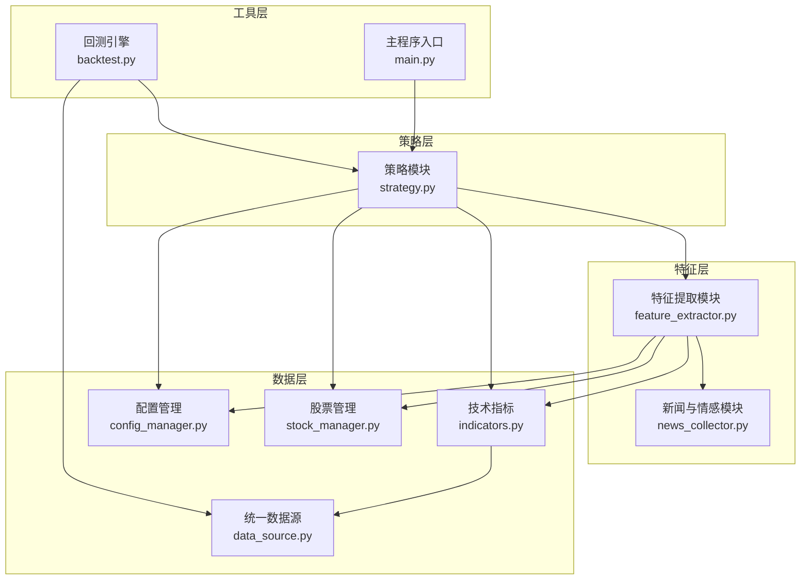
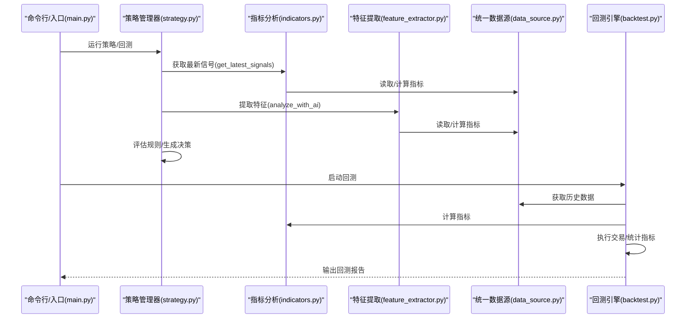
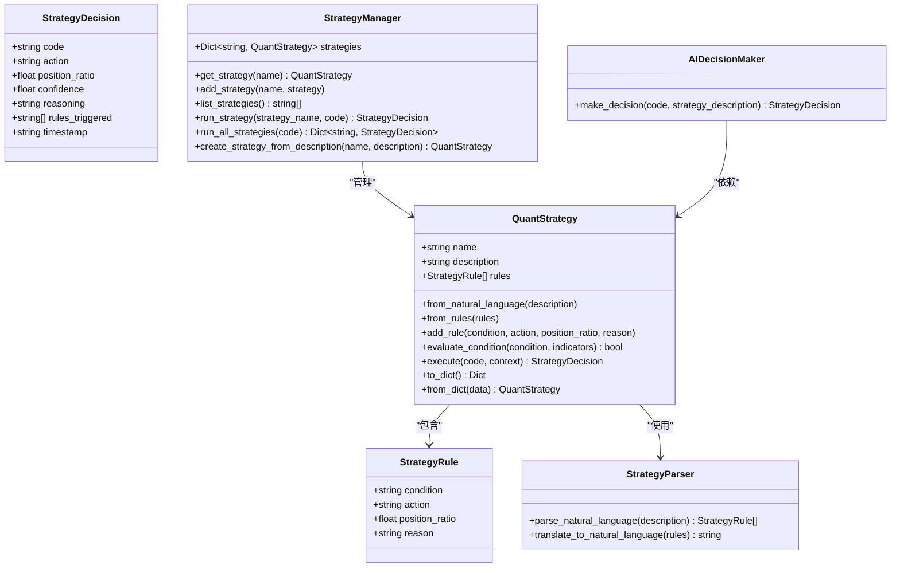
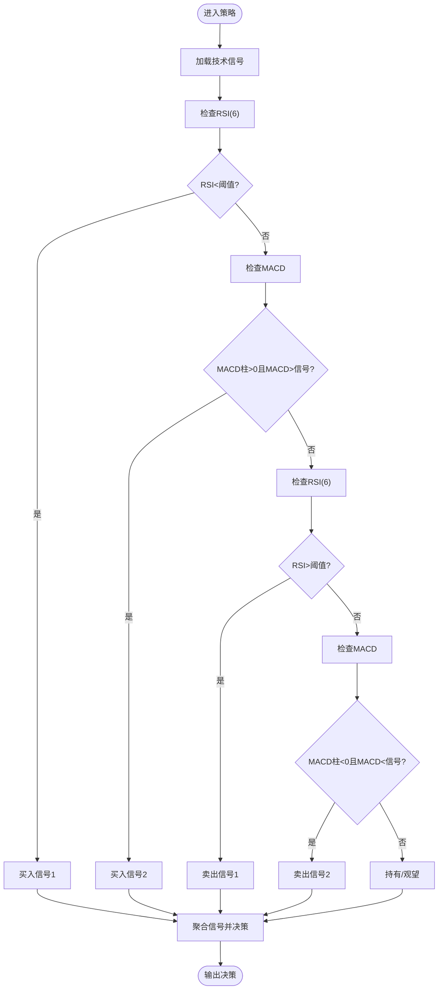
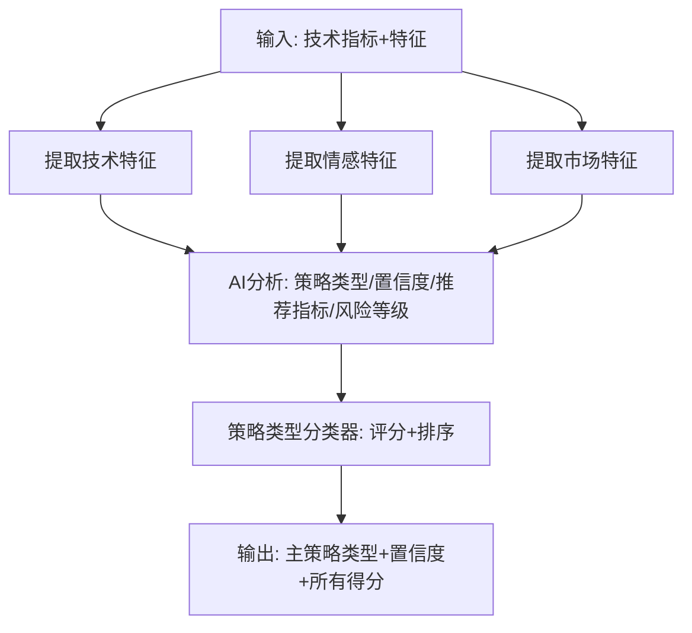
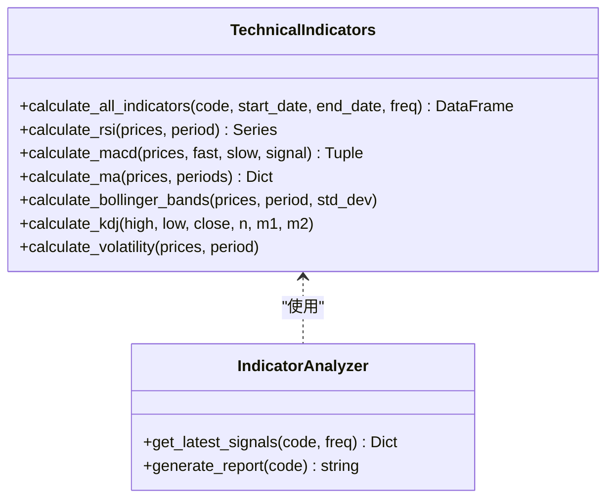
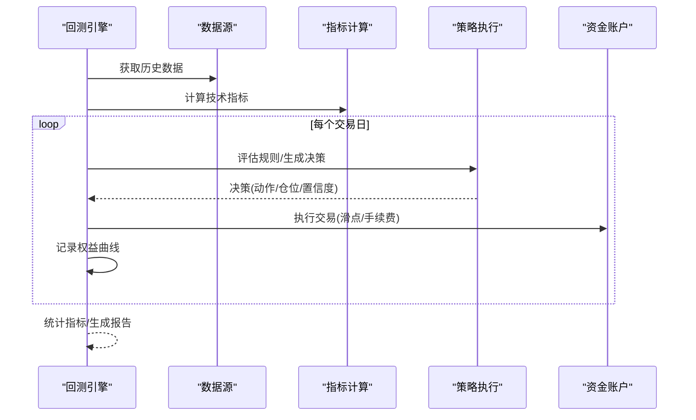
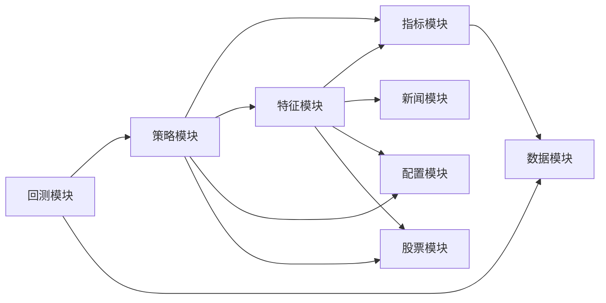

# 策略管理系统

<cite>
**本文引用的文件**
- [quant_system/strategy.py](file://quant_system/strategy.py)
- [quant_system/feature_extractor.py](file://quant_system/feature_extractor.py)
- [quant_system/backtest.py](file://quant_system/backtest.py)
- [quant_system/data_source.py](file://quant_system/data_source.py)
- [quant_system/indicators.py](file://quant_system/indicators.py)
- [quant_system/config_manager.py](file://quant_system/config_manager.py)
- [quant_system/stock_manager.py](file://quant_system/stock_manager.py)
- [quant_system/news_collector.py](file://quant_system/news_collector.py)
- [config.yaml](file://config.yaml)
- [main.py](file://main.py)
</cite>

## 目录
1. [简介](#简介)
2. [项目结构](#项目结构)
3. [核心组件](#核心组件)
4. [架构总览](#架构总览)
5. [详细组件分析](#详细组件分析)
6. [依赖关系分析](#依赖关系分析)
7. [性能考量](#性能考量)
8. [故障排查指南](#故障排查指南)
9. [结论](#结论)
10. [附录](#附录)

## 简介
本文件面向vibequation量化交易系统的“策略管理系统”，系统性阐述策略架构设计理念、策略模板与注册机制、策略执行流程、内置策略实现原理（RSI策略、MACD策略）、FeatureExtractor特征提取模块工作机制（技术指标特征、价格特征、成交量特征、情感特征），并提供自定义策略开发指南、回测兼容性要求、性能优化技巧、策略组合与多策略并行执行方案，以及参数优化、过拟合防范与策略验证等高级主题。

## 项目结构
系统采用模块化分层设计：
- 策略层：策略模板、策略规则、策略执行与决策
- 特征层：特征提取、AI分类、情感分析
- 数据层：统一数据源、历史/实时数据、指标计算
- 工具层：配置管理、股票管理、回测引擎、风险控制、通知

图表来源
- [quant_system/strategy.py:1-556](file://quant_system/strategy.py#L1-L556)
- [quant_system/feature_extractor.py:1-405](file://quant_system/feature_extractor.py#L1-L405)
- [quant_system/backtest.py:1-456](file://quant_system/backtest.py#L1-L456)
- [quant_system/data_source.py:1-423](file://quant_system/data_source.py#L1-L423)
- [quant_system/indicators.py:1-500](file://quant_system/indicators.py#L1-L500)
- [quant_system/config_manager.py:1-178](file://quant_system/config_manager.py#L1-L178)
- [quant_system/stock_manager.py:1-278](file://quant_system/stock_manager.py#L1-L278)
- [quant_system/news_collector.py:1-465](file://quant_system/news_collector.py#L1-L465)
- [main.py:1-365](file://main.py#L1-L365)

章节来源
- [main.py:1-365](file://main.py#L1-L365)
- [quant_system/strategy.py:1-556](file://quant_system/strategy.py#L1-L556)
- [quant_system/feature_extractor.py:1-405](file://quant_system/feature_extractor.py#L1-L405)
- [quant_system/backtest.py:1-456](file://quant_system/backtest.py#L1-L456)
- [quant_system/data_source.py:1-423](file://quant_system/data_source.py#L1-L423)
- [quant_system/indicators.py:1-500](file://quant_system/indicators.py#L1-L500)
- [quant_system/config_manager.py:1-178](file://quant_system/config_manager.py#L1-L178)
- [quant_system/stock_manager.py:1-278](file://quant_system/stock_manager.py#L1-L278)
- [quant_system/news_collector.py:1-465](file://quant_system/news_collector.py#L1-L465)
- [config.yaml:1-88](file://config.yaml#L1-L88)

## 核心组件
- 策略模板与规则：通过策略规则对象封装条件、动作、仓位比例与理由，支持从自然语言解析为量化规则，再由策略执行器评估并生成决策。
- 策略管理器：内置RSI、MACD、均线、综合策略；支持动态添加与批量运行策略。
- 特征提取器：提取技术特征、情感特征、市场特征，并结合AI进行策略类型分类。
- 技术指标：统一计算RSI、MACD、布林带、KDJ、均线等指标，并提供信号解读与综合评分。
- 回测引擎：支持单股票与多股票回测，计算收益、风险、交易统计与绩效指标。
- 数据源与配置：统一历史/实时数据获取、指标缓存、配置集中管理。

章节来源
- [quant_system/strategy.py:150-460](file://quant_system/strategy.py#L150-L460)
- [quant_system/feature_extractor.py:99-320](file://quant_system/feature_extractor.py#L99-L320)
- [quant_system/indicators.py:21-328](file://quant_system/indicators.py#L21-L328)
- [quant_system/backtest.py:66-374](file://quant_system/backtest.py#L66-L374)
- [quant_system/data_source.py:300-423](file://quant_system/data_source.py#L300-L423)
- [quant_system/config_manager.py:12-178](file://quant_system/config_manager.py#L12-L178)

## 架构总览
策略管理系统的执行链路如下：
- 输入：股票代码、策略名称或自然语言描述
- 数据准备：统一数据源获取历史数据，技术指标计算与缓存
- 特征提取：技术特征、情感特征、市场特征
- 策略执行：解析规则、评估条件、聚合信号、生成决策
- 回测验证：按规则执行交易、统计指标、生成报告
- 输出：策略决策、回测报告、可视化与通知

图表来源
- [main.py:100-174](file://main.py#L100-L174)
- [quant_system/strategy.py:229-300](file://quant_system/strategy.py#L229-L300)
- [quant_system/indicators.py:336-444](file://quant_system/indicators.py#L336-L444)
- [quant_system/feature_extractor.py:213-284](file://quant_system/feature_extractor.py#L213-L284)
- [quant_system/data_source.py:307-356](file://quant_system/data_source.py#L307-L356)
- [quant_system/backtest.py:75-282](file://quant_system/backtest.py#L75-L282)

## 详细组件分析

### 策略模板与规则系统
- 策略规则对象：包含条件表达式、动作（买入/卖出/持有/等待）、建议仓位比例、理由。
- 策略执行器：从技术指标字典评估规则条件，聚合多条规则触发信号，计算最终动作与置信度。
- 自然语言解析：通过AI模型将自然语言策略转换为量化规则，再翻译回自然语言便于理解。
- 决策输出：包含代码、动作、仓位、置信度、理由、触发规则列表与时间戳。

图表来源
- [quant_system/strategy.py:27-316](file://quant_system/strategy.py#L27-L316)
- [quant_system/strategy.py:318-460](file://quant_system/strategy.py#L318-L460)
- [quant_system/strategy.py:462-556](file://quant_system/strategy.py#L462-L556)

章节来源
- [quant_system/strategy.py:27-316](file://quant_system/strategy.py#L27-L316)
- [quant_system/strategy.py:318-460](file://quant_system/strategy.py#L318-L460)
- [quant_system/strategy.py:462-556](file://quant_system/strategy.py#L462-L556)

### 内置策略：RSI策略与MACD策略
- RSI策略：当短期RSI低于阈值时买入，高于阈值时卖出，控制仓位比例。
- MACD策略：MACD柱状图与信号线方向决定趋势，金叉做多、死叉做空。
- 组合策略：同时考虑RSI与MACD，形成更强信号；加入KDJ超卖条件增强稳健性。

图表来源
- [quant_system/strategy.py:325-396](file://quant_system/strategy.py#L325-L396)
- [quant_system/indicators.py:336-444](file://quant_system/indicators.py#L336-L444)

章节来源
- [quant_system/strategy.py:325-396](file://quant_system/strategy.py#L325-L396)
- [quant_system/indicators.py:336-444](file://quant_system/indicators.py#L336-L444)

### FeatureExtractor特征提取模块
- 技术特征：趋势强度、趋势方向、RSI水平、MACD动量、均线排列、波动率代理、布林带相对位置。
- 情感特征：平均情感、情感波动、情感趋势、新闻数量、多头比例。
- 市场特征：市场贝塔、行业排名（预留）。
- AI分析：将技术指标与特征输入AI，输出策略类型、置信度、推荐指标、风险等级等。
- 分类器：基于特征打分，选择最优策略类型（趋势跟踪、动量、波段、均值回归）。

图表来源
- [quant_system/feature_extractor.py:115-190](file://quant_system/feature_extractor.py#L115-L190)
- [quant_system/feature_extractor.py:213-284](file://quant_system/feature_extractor.py#L213-L284)
- [quant_system/feature_extractor.py:323-400](file://quant_system/feature_extractor.py#L323-L400)

章节来源
- [quant_system/feature_extractor.py:99-320](file://quant_system/feature_extractor.py#L99-L320)
- [quant_system/feature_extractor.py:323-400](file://quant_system/feature_extractor.py#L323-L400)

### 技术指标计算与信号解读
- 指标计算：RSI、MACD、均线、布林带、KDJ、波动率、成交量均值与比率。
- 信号解读：RSI超买/超卖、MACD趋势、均线排列、布林带位置、综合评分。
- 报告生成：输出标准化技术指标报告，辅助策略制定与决策。

图表来源
- [quant_system/indicators.py:21-328](file://quant_system/indicators.py#L21-L328)
- [quant_system/indicators.py:330-495](file://quant_system/indicators.py#L330-L495)

章节来源
- [quant_system/indicators.py:21-328](file://quant_system/indicators.py#L21-L328)
- [quant_system/indicators.py:330-495](file://quant_system/indicators.py#L330-L495)

### 回测引擎与多策略并行
- 单股票回测：按交易日遍历，依据策略决策执行买卖，考虑滑点与手续费，记录权益曲线与交易明细。
- 多股票回测：对多只股票分别回测，聚合结果比较不同策略表现。
- 指标计算：年化收益、最大回撤、夏普比率、胜率、平均盈亏、盈亏比等。
- 回测兼容性：策略执行与回测执行逻辑一致，保证策略在真实交易与回测中行为一致。

图表来源
- [quant_system/backtest.py:66-282](file://quant_system/backtest.py#L66-L282)
- [quant_system/backtest.py:284-347](file://quant_system/backtest.py#L284-L347)

章节来源
- [quant_system/backtest.py:66-374](file://quant_system/backtest.py#L66-L374)

### 自定义策略开发指南
- 策略接口规范
  - 策略类需提供规则集合，支持从自然语言解析与从规则构建。
  - 条件表达式仅允许安全函数与指标变量，避免任意代码执行。
  - 决策输出需包含动作、建议仓位、置信度、触发规则与理由。
- 回测兼容性
  - 回测引擎内部复用策略评估逻辑，确保策略在回测中行为一致。
  - 回测中严格考虑滑点与手续费，贴近真实交易成本。
- 性能优化
  - 指标与特征缓存：优先读取本地缓存，减少重复计算。
  - 批量处理：多股票回测时并发或批量化处理，提升吞吐。
  - 评估环境隔离：使用安全字典与白名单函数，避免注入风险。
- 策略组合与并行
  - 多策略并行：策略管理器支持批量运行，输出各策略决策。
  - 组合决策：可基于置信度加权或投票机制合成最终信号。

章节来源
- [quant_system/strategy.py:150-316](file://quant_system/strategy.py#L150-L316)
- [quant_system/backtest.py:284-347](file://quant_system/backtest.py#L284-L347)
- [quant_system/feature_extractor.py:285-320](file://quant_system/feature_extractor.py#L285-L320)

### 参数优化、过拟合防范与策略验证
- 参数优化
  - 网格搜索/贝叶斯优化：在回测中对RSI周期、MACD参数、布林带周期等进行寻优。
  - 分层回测：按时间窗口划分样本内外，避免未来函数。
- 过拟合防范
  - 交叉验证：时间序列分割，避免数据泄露。
  - 简化规则：降低规则复杂度，避免过度细分。
  - 风险约束：引入止损止盈、最大回撤限制、最大单票仓位等风控。
- 策略验证
  - 多样本检验：在不同市场阶段与不同股票池上验证策略稳定性。
  - 统计显著性：检验收益、胜率、夏普比率等指标的统计显著性。
  - 敏感性分析：对关键参数进行扰动测试，评估策略鲁棒性。

[本节为通用指导，无需特定文件引用]

## 依赖关系分析
- 模块耦合
  - 策略模块依赖指标分析与特征提取模块，回测模块依赖策略与数据源。
  - 特征提取模块依赖指标与情感分析模块，情感分析模块依赖新闻采集模块。
  - 配置管理贯穿全局，提供统一配置访问与目录管理。
- 外部依赖
  - Tushare API用于历史数据获取，EasyQuotation用于实时数据获取。
  - ModelScope API用于AI推理与情感分析，本地规则作为降级方案。
- 潜在循环依赖
  - 当前模块间为单向依赖，未发现循环导入问题。

图表来源
- [quant_system/strategy.py:1-556](file://quant_system/strategy.py#L1-L556)
- [quant_system/feature_extractor.py:1-405](file://quant_system/feature_extractor.py#L1-L405)
- [quant_system/backtest.py:1-456](file://quant_system/backtest.py#L1-L456)
- [quant_system/data_source.py:1-423](file://quant_system/data_source.py#L1-L423)
- [quant_system/indicators.py:1-500](file://quant_system/indicators.py#L1-L500)
- [quant_system/config_manager.py:1-178](file://quant_system/config_manager.py#L1-L178)
- [quant_system/stock_manager.py:1-278](file://quant_system/stock_manager.py#L1-L278)
- [quant_system/news_collector.py:1-465](file://quant_system/news_collector.py#L1-L465)

章节来源
- [quant_system/strategy.py:1-556](file://quant_system/strategy.py#L1-L556)
- [quant_system/feature_extractor.py:1-405](file://quant_system/feature_extractor.py#L1-L405)
- [quant_system/backtest.py:1-456](file://quant_system/backtest.py#L1-L456)
- [quant_system/data_source.py:1-423](file://quant_system/data_source.py#L1-L423)
- [quant_system/indicators.py:1-500](file://quant_system/indicators.py#L1-L500)
- [quant_system/config_manager.py:1-178](file://quant_system/config_manager.py#L1-L178)
- [quant_system/stock_manager.py:1-278](file://quant_system/stock_manager.py#L1-L278)
- [quant_system/news_collector.py:1-465](file://quant_system/news_collector.py#L1-L465)

## 性能考量
- 数据缓存与增量更新：历史数据与指标按日期切片缓存，支持增量更新，避免重复拉取。
- 指标计算优化：使用向量化计算与滚动窗口，减少Python循环开销。
- 回测性能：回测引擎内部直接评估规则，避免策略对象重复构造，提高吞吐。
- 并发与批处理：多股票回测时可并行处理不同股票，缩短总耗时。
- API限流：Tushare数据源实现速率限制，避免触发平台限流。

[本节为通用指导，无需特定文件引用]

## 故障排查指南
- 配置问题
  - 缺少Token：检查配置文件中的API Token是否正确设置。
  - 目录权限：确认数据目录存在且具备读写权限。
- 数据获取失败
  - Tushare网络异常：检查网络与Token有效性；必要时启用本地缓存。
  - 实时数据源异常：切换至备用数据源或检查网络。
- 指标计算异常
  - 数据类型错误：确保价格与成交量列可转换为数值类型。
  - 空数据：检查历史数据是否成功下载与缓存。
- 策略执行异常
  - 条件表达式错误：确保仅使用受支持的指标与函数。
  - 决策为空：检查指标是否成功加载与信号是否合理。
- 回测异常
  - 资金不足：检查初始资金与滑点/手续费设置。
  - 交易未发生：检查策略规则与信号是否触发。

章节来源
- [quant_system/config_manager.py:28-55](file://quant_system/config_manager.py#L28-L55)
- [quant_system/data_source.py:43-136](file://quant_system/data_source.py#L43-L136)
- [quant_system/indicators.py:188-273](file://quant_system/indicators.py#L188-L273)
- [quant_system/strategy.py:185-228](file://quant_system/strategy.py#L185-L228)
- [quant_system/backtest.py:96-107](file://quant_system/backtest.py#L96-L107)

## 结论
vibequation策略管理系统以模块化为核心，围绕策略模板、特征提取、技术指标与回测引擎构建了完整的量化交易闭环。内置RSI与MACD策略具备明确的信号规则与参数设置，FeatureExtractor模块融合技术与情感特征并通过AI进行策略类型分类，回测引擎提供严谨的交易模拟与指标统计。通过统一配置管理与数据源抽象，系统具备良好的扩展性与可维护性。建议在后续迭代中进一步完善参数优化框架、风控策略与可视化展示，以支撑更复杂的实盘应用。

[本节为总结性内容，无需特定文件引用]

## 附录
- 配置文件要点
  - Token与数据目录：确保API Token与数据目录配置正确。
  - 技术指标周期与回测参数：根据策略需求调整RSI周期、MACD参数与回测费用。
  - AI模型参数：温度、最大token等影响AI输出稳定性与速度。
- 常用命令
  - 更新数据与指标、采集新闻、提取特征、运行策略、回测、Web服务等命令行接口。

章节来源
- [config.yaml:1-88](file://config.yaml#L1-L88)
- [main.py:261-365](file://main.py#L261-L365)