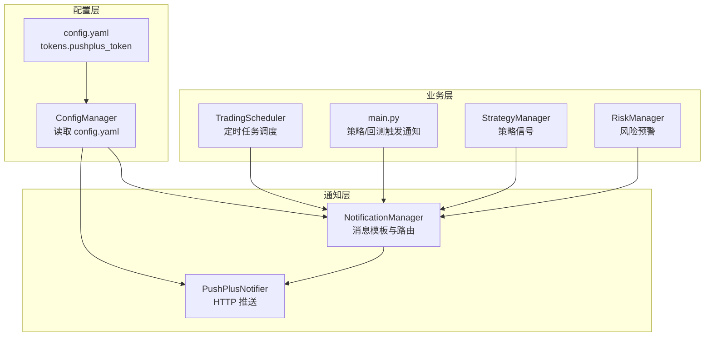
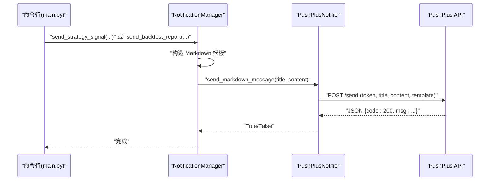
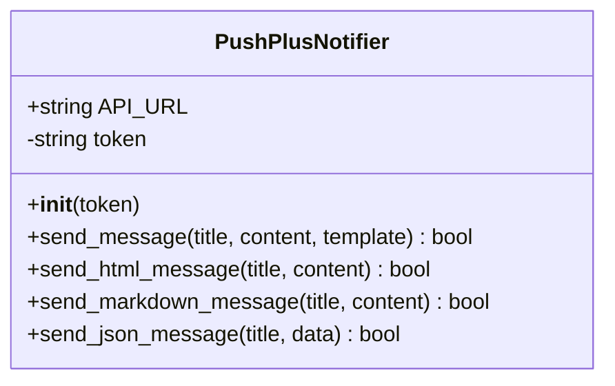
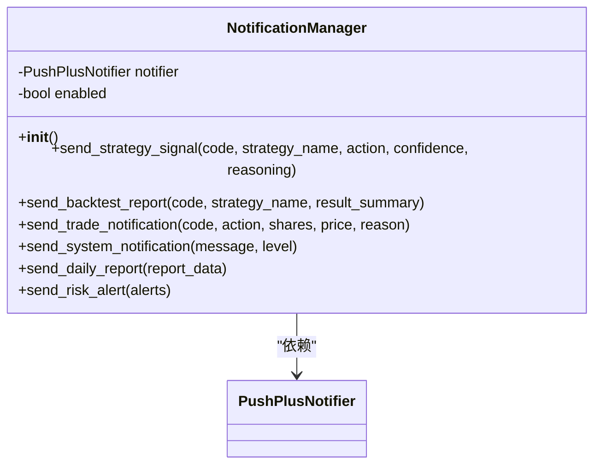
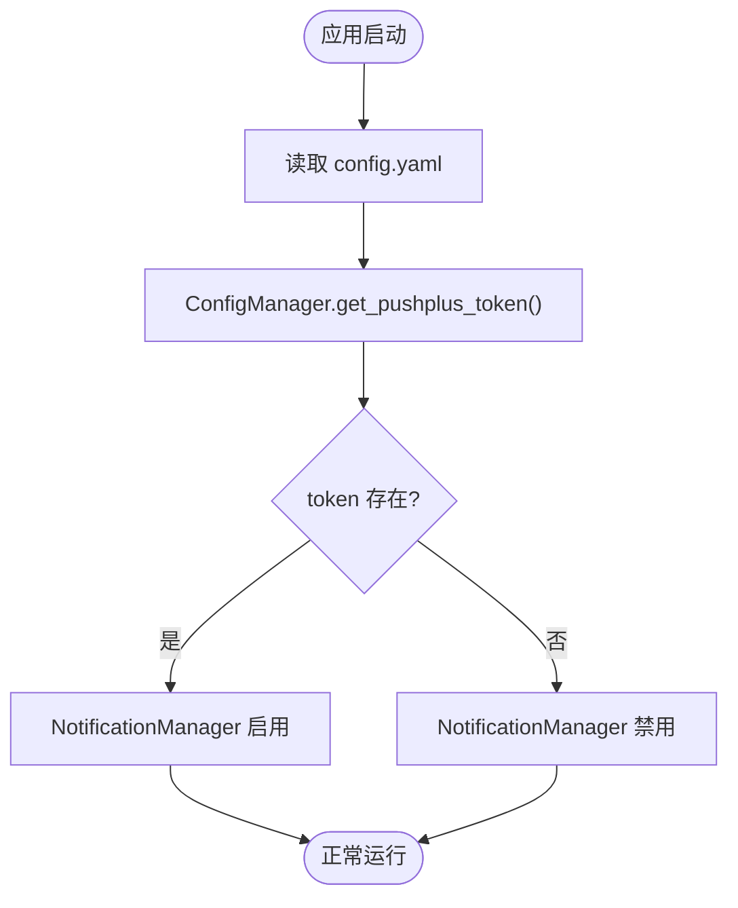
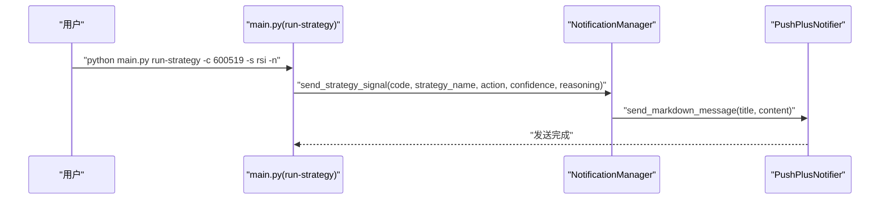
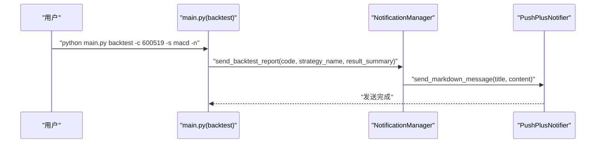
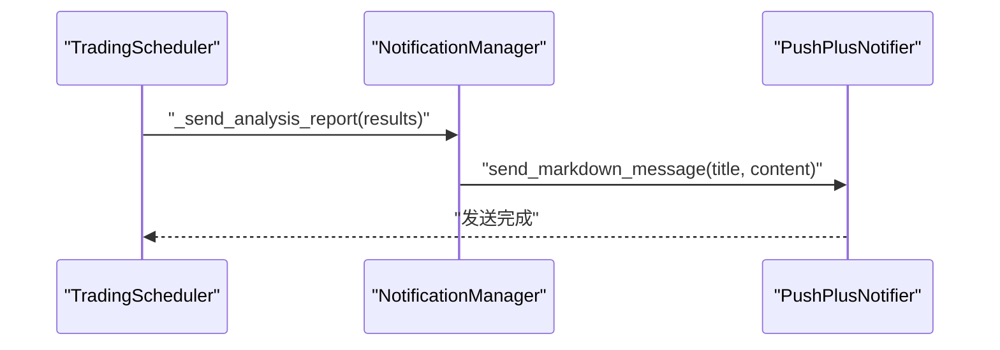
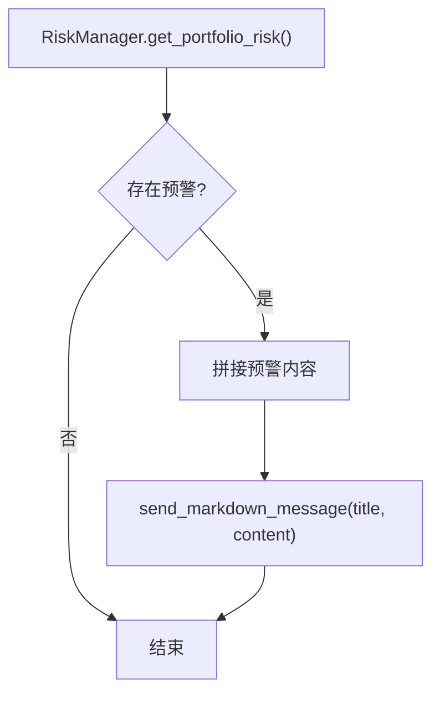
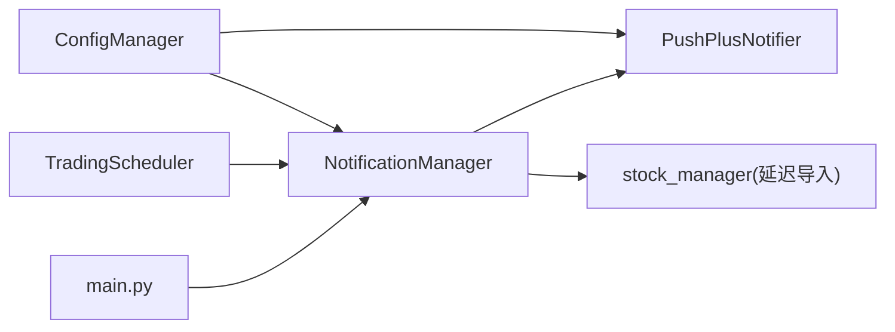

# 通知系统

<cite>
**本文引用的文件**
- [quant_system/notification.py](file://quant_system/notification.py)
- [quant_system/config_manager.py](file://quant_system/config_manager.py)
- [config.yaml](file://config.yaml)
- [main.py](file://main.py)
- [quant_system/scheduler.py](file://quant_system/scheduler.py)
- [quant_system/risk_manager.py](file://quant_system/risk_manager.py)
- [quant_system/strategy.py](file://quant_system/strategy.py)
</cite>

## 目录
1. [简介](#简介)
2. [项目结构](#项目结构)
3. [核心组件](#核心组件)
4. [架构总览](#架构总览)
5. [详细组件分析](#详细组件分析)
6. [依赖分析](#依赖分析)
7. [性能与可靠性](#性能与可靠性)
8. [故障排查指南](#故障排查指南)
9. [结论](#结论)
10. [附录](#附录)

## 简介
本文件为 vibequation 量化交易系统的“通知系统”技术文档，聚焦于通知系统的架构设计、实现原理与扩展方法。当前系统以 PushPlus 作为主要消息推送渠道，支持多种消息模板（纯文本、HTML、JSON、Markdown），并覆盖策略信号、回测报告、交易提醒、系统通知、每日分析报告、风险预警等场景。文档同时提供通知频率控制、防骚扰机制的设计思路，以及扩展开发指南，帮助开发者快速接入新的通知渠道或定制化消息模板。

## 项目结构
通知系统位于量化交易系统的核心模块中，围绕配置中心、通知器、通知管理器与调度器协同工作：
- 配置中心负责读取 tokens、数据目录等全局配置；
- PushPlus 通知器封装第三方 API 调用；
- 通知管理器根据业务场景生成不同模板的消息；
- 调度器在交易时段自动汇总分析结果并通过通知器发送；
- 主程序在策略运行与回测完成后触发相应通知。

图表来源
- [quant_system/config_manager.py:12-178](file://quant_system/config_manager.py#L12-L178)
- [config.yaml:1-88](file://config.yaml#L1-L88)
- [quant_system/notification.py:17-300](file://quant_system/notification.py#L17-L300)
- [quant_system/scheduler.py:34-284](file://quant_system/scheduler.py#L34-L284)
- [main.py:100-174](file://main.py#L100-L174)
- [quant_system/risk_manager.py:47-283](file://quant_system/risk_manager.py#L47-L283)
- [quant_system/strategy.py:318-425](file://quant_system/strategy.py#L318-L425)

章节来源
- [quant_system/config_manager.py:12-178](file://quant_system/config_manager.py#L12-L178)
- [config.yaml:1-88](file://config.yaml#L1-L88)
- [quant_system/notification.py:17-300](file://quant_system/notification.py#L17-L300)
- [quant_system/scheduler.py:34-284](file://quant_system/scheduler.py#L34-L284)
- [main.py:100-174](file://main.py#L100-L174)
- [quant_system/risk_manager.py:47-283](file://quant_system/risk_manager.py#L47-L283)
- [quant_system/strategy.py:318-425](file://quant_system/strategy.py#L318-L425)

## 核心组件
- PushPlusNotifier：封装 PushPlus 第三方推送接口，支持多种模板类型的消息发送。
- NotificationManager：面向业务场景的消息模板与路由，包括策略信号、回测报告、交易提醒、系统通知、每日分析报告、风险预警等。
- ConfigManager：统一读取配置，提供 tokens、数据目录、回测参数等配置项。
- TradingScheduler：定时任务调度器，在交易时段自动汇总分析结果并通过通知器发送。
- 主程序与策略模块：在策略运行与回测完成后触发相应通知。

章节来源
- [quant_system/notification.py:17-300](file://quant_system/notification.py#L17-L300)
- [quant_system/config_manager.py:12-178](file://quant_system/config_manager.py#L12-L178)
- [quant_system/scheduler.py:34-284](file://quant_system/scheduler.py#L34-L284)
- [main.py:100-174](file://main.py#L100-L174)

## 架构总览
通知系统采用“配置驱动 + 模板化消息 + 统一推送”的架构：
- 配置驱动：通过 config.yaml 与 ConfigManager 提供 tokens 与开关；
- 模板化消息：NotificationManager 为不同业务场景提供 Markdown/JSON 等模板；
- 统一推送：PushPlusNotifier 统一封装第三方 API 调用，屏蔽模板差异；
- 触发链路：策略运行、回测完成、定时任务、风险事件均可触发通知。

图表来源
- [main.py:116-173](file://main.py#L116-L173)
- [quant_system/notification.py:84-296](file://quant_system/notification.py#L84-L296)
- [quant_system/notification.py:27-81](file://quant_system/notification.py#L27-L81)

## 详细组件分析

### PushPlusNotifier 组件
- 职责：封装 PushPlus 的 HTTP 推送接口，支持 txt/html/json/markdown 模板。
- 关键点：
  - 从 ConfigManager 读取 pushplus_token；
  - 统一请求参数与超时控制；
  - 对响应码进行判定，记录日志；
  - 提供 send_markdown_message/send_html_message/send_json_message 等便捷方法。

图表来源
- [quant_system/notification.py:17-82](file://quant_system/notification.py#L17-L82)

章节来源
- [quant_system/notification.py:17-82](file://quant_system/notification.py#L17-L82)

### NotificationManager 组件
- 职责：面向业务场景的消息模板与路由，统一启用开关与模板渲染。
- 场景覆盖：
  - 策略信号通知：带置信度、决策理由、emoji 表情；
  - 回测报告：收益、风险、交易统计指标；
  - 交易提醒：买卖动作、数量、金额、原因；
  - 系统通知：info/warning/error 级别，带时间戳；
  - 每日分析报告：汇总买入/卖出/持有建议；
  - 风险预警：批量预警列表。
- 设计要点：
  - enabled 开关：当 pushplus_token 未配置时，所有发送直接返回；
  - Markdown 模板：统一使用 Markdown 渲染，便于微信等客户端展示；
  - 股票名称解析：通过 stock_manager 获取股票名称，增强可读性。

图表来源
- [quant_system/notification.py:84-296](file://quant_system/notification.py#L84-L296)

章节来源
- [quant_system/notification.py:84-296](file://quant_system/notification.py#L84-L296)

### 配置与令牌管理
- ConfigManager 提供 tokens.pushplus_token 读取；
- config.yaml 中包含 tokens.pushplus_token 字段；
- NotificationManager 初始化时根据 token 决定是否启用通知。

图表来源
- [quant_system/config_manager.py:105-107](file://quant_system/config_manager.py#L105-L107)
- [config.yaml:4-7](file://config.yaml#L4-L7)
- [quant_system/notification.py:87-89](file://quant_system/notification.py#L87-L89)

章节来源
- [quant_system/config_manager.py:105-107](file://quant_system/config_manager.py#L105-L107)
- [config.yaml:4-7](file://config.yaml#L4-L7)
- [quant_system/notification.py:87-89](file://quant_system/notification.py#L87-L89)

### 触发链路与业务场景

#### 策略信号通知
- 触发位置：main.py 中 run-strategy 命令，当传入 -n/--notify 时触发；
- 模板字段：股票名称/代码、策略名、建议操作、置信度、时间、决策理由；
- 渲染方式：Markdown。

图表来源
- [main.py:116-120](file://main.py#L116-L120)
- [quant_system/notification.py:131-171](file://quant_system/notification.py#L131-L171)

章节来源
- [main.py:116-120](file://main.py#L116-L120)
- [quant_system/notification.py:131-171](file://quant_system/notification.py#L131-L171)

#### 回测报告通知
- 触发位置：main.py 中 backtest 命令，当传入 -n/--notify 时触发；
- 模板字段：股票名称/代码、策略名、回测区间、收益/风险/交易统计指标、生成时间；
- 渲染方式：Markdown。

图表来源
- [main.py:159-173](file://main.py#L159-L173)
- [quant_system/notification.py:231-274](file://quant_system/notification.py#L231-L274)

章节来源
- [main.py:159-173](file://main.py#L159-L173)
- [quant_system/notification.py:231-274](file://quant_system/notification.py#L231-L274)

#### 定时任务分析报告
- 触发位置：TradingScheduler 在交易时段自动汇总分析结果；
- 模板字段：时间、买入/卖出/持有建议清单、置信度与理由片段；
- 渲染方式：Markdown。

图表来源
- [quant_system/scheduler.py:164-203](file://quant_system/scheduler.py#L164-L203)
- [quant_system/notification.py:293-296](file://quant_system/notification.py#L293-L296)

章节来源
- [quant_system/scheduler.py:164-203](file://quant_system/scheduler.py#L164-L203)
- [quant_system/notification.py:293-296](file://quant_system/notification.py#L293-L296)

#### 风险预警通知
- 触发位置：RiskManager 生成风险报告时，若存在需要关注的预警；
- 模板字段：预警数量、逐条预警（名称/代码/原因）、时间；
- 渲染方式：Markdown。

图表来源
- [quant_system/risk_manager.py:261-282](file://quant_system/risk_manager.py#L261-L282)
- [quant_system/notification.py:173-191](file://quant_system/notification.py#L173-L191)

章节来源
- [quant_system/risk_manager.py:261-282](file://quant_system/risk_manager.py#L261-L282)
- [quant_system/notification.py:173-191](file://quant_system/notification.py#L173-L191)

### 消息模板设计与定制化
- Markdown 模板：统一使用 Markdown 渲染，便于在微信等客户端展示表格、标题、加粗、链接等；
- JSON 模板：send_json_message 适合结构化数据传输；
- HTML 模板：send_html_message 适合复杂排版；
- 定制化建议：
  - 为不同业务场景新增模板时，优先复用现有字段与时间戳；
  - 保持标题与内容的层级清晰，便于移动端阅读；
  - 对敏感字段（如金额）进行本地化格式化。

章节来源
- [quant_system/notification.py:70-81](file://quant_system/notification.py#L70-L81)
- [quant_system/notification.py:114-129](file://quant_system/notification.py#L114-L129)
- [quant_system/notification.py:157-171](file://quant_system/notification.py#L157-L171)
- [quant_system/notification.py:250-274](file://quant_system/notification.py#L250-L274)
- [quant_system/notification.py:293-296](file://quant_system/notification.py#L293-L296)

### 通知频率控制与防骚扰机制
- 当前实现：
  - enabled 开关：未配置 pushplus_token 时不发送任何通知；
  - 仅在明确触发时发送（策略运行、回测完成、定时任务、风险事件）。
- 建议扩展：
  - 引入去重窗口：同一股票/策略在短时间内重复触发时合并或抑制；
  - 引入分级阈值：按置信度/收益幅度决定是否发送；
  - 引入白名单/黑名单：按股票或策略过滤；
  - 引入速率限制：对同一接收端在单位时间内发送次数进行限制。

章节来源
- [quant_system/notification.py:87-89](file://quant_system/notification.py#L87-L89)
- [quant_system/notification.py:104-105](file://quant_system/notification.py#L104-L105)

## 依赖分析
- NotificationManager 依赖 PushPlusNotifier；
- PushPlusNotifier 依赖 ConfigManager 读取 token；
- TradingScheduler 依赖 NotificationManager 发送分析报告；
- main.py 在策略运行与回测时依赖 NotificationManager；
- NotificationManager 依赖 stock_manager 获取股票名称（延迟导入）。

图表来源
- [quant_system/config_manager.py:105-107](file://quant_system/config_manager.py#L105-L107)
- [quant_system/notification.py:12-12](file://quant_system/notification.py#L12-L12)
- [quant_system/notification.py:87-89](file://quant_system/notification.py#L87-L89)
- [quant_system/scheduler.py:26-26](file://quant_system/scheduler.py#L26-L26)
- [main.py:24-24](file://main.py#L24-L24)

章节来源
- [quant_system/config_manager.py:105-107](file://quant_system/config_manager.py#L105-L107)
- [quant_system/notification.py:12-12](file://quant_system/notification.py#L12-L12)
- [quant_system/notification.py:87-89](file://quant_system/notification.py#L87-L89)
- [quant_system/scheduler.py:26-26](file://quant_system/scheduler.py#L26-L26)
- [main.py:24-24](file://main.py#L24-L24)

## 性能与可靠性
- 性能特性：
  - HTTP 请求超时控制：统一设置为 10 秒，避免阻塞；
  - 模板渲染在内存中完成，开销极低；
  - Markdown/JSON/HTML 三类模板按需选择，减少不必要的序列化。
- 可靠性保障：
  - 异常捕获与日志记录：网络异常、API 响应非 200 时记录错误；
  - enabled 开关：未配置 token 时不发送，避免无效调用；
  - 延迟导入：避免循环依赖，提升初始化稳定性。

章节来源
- [quant_system/notification.py:51-68](file://quant_system/notification.py#L51-L68)
- [quant_system/notification.py:87-89](file://quant_system/notification.py#L87-L89)

## 故障排查指南
- 未配置 PushPlus Token
  - 现象：通知不生效，日志出现警告；
  - 处理：在 config.yaml 中填写 tokens.pushplus_token。
- API 调用失败
  - 现象：日志出现错误，返回非 200；
  - 处理：检查 token 有效性、网络连通性、第三方服务状态。
- 模板渲染异常
  - 现象：消息内容格式不正确；
  - 处理：确认字段类型与格式化字符串，必要时改为 JSON 模板。
- 股票名称解析失败
  - 现象：消息中显示代码而非名称；
  - 处理：确认 stock_manager 初始化与股票配置文件。

章节来源
- [quant_system/notification.py:24-25](file://quant_system/notification.py#L24-L25)
- [quant_system/notification.py:66-68](file://quant_system/notification.py#L66-L68)
- [quant_system/notification.py:107-109](file://quant_system/notification.py#L107-L109)

## 结论
通知系统以 PushPlus 为核心，结合配置驱动与模板化消息，实现了策略信号、回测报告、交易提醒、系统通知、每日分析报告与风险预警的全场景覆盖。当前实现简洁可靠，具备良好的扩展性。建议后续引入频率控制、去重与分级阈值等机制，进一步提升用户体验与系统稳定性。

## 附录

### 第三方服务集成指南（以 PushPlus 为例）
- 配置步骤：
  - 在 PushPlus 控制台获取 token；
  - 在 config.yaml 的 tokens.pushplus_token 填写；
  - 启动系统后，enabled 开关自动生效。
- API 调用要点：
  - 使用统一 API URL；
  - 模板类型支持 txt/html/json/markdown；
  - 注意超时与异常处理。

章节来源
- [config.yaml:4-7](file://config.yaml#L4-L7)
- [quant_system/notification.py:20-81](file://quant_system/notification.py#L20-L81)

### 扩展开发指南：自定义通知渠道
- 新增通知器步骤：
  - 新建类继承通用接口（建议参考 PushPlusNotifier 的签名与行为）；
  - 实现 send_message/send_html_message/send_markdown_message/send_json_message；
  - 在 NotificationManager 中注入新通知器并维护 enabled 开关。
- 新增业务模板步骤：
  - 在 NotificationManager 中新增方法，构造标题与 Markdown 内容；
  - 在触发点调用对应方法；
  - 如需结构化数据，优先使用 JSON 模板。
- 注意事项：
  - 保持模板一致性与可读性；
  - 严格处理异常与日志；
  - 遵循频率控制与防骚扰原则。

章节来源
- [quant_system/notification.py:17-82](file://quant_system/notification.py#L17-L82)
- [quant_system/notification.py:84-296](file://quant_system/notification.py#L84-L296)