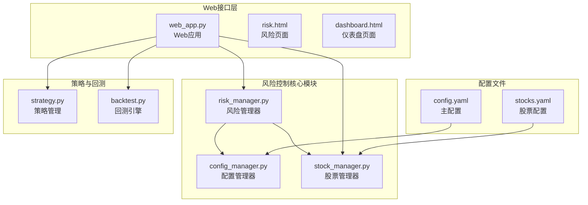
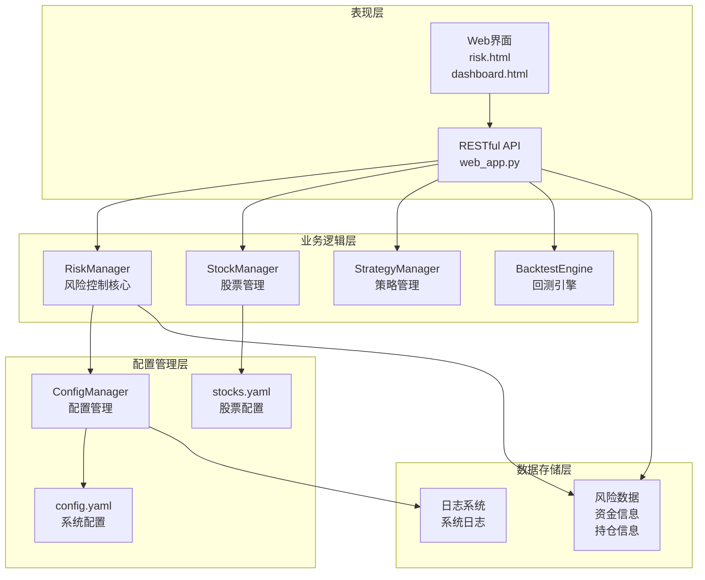
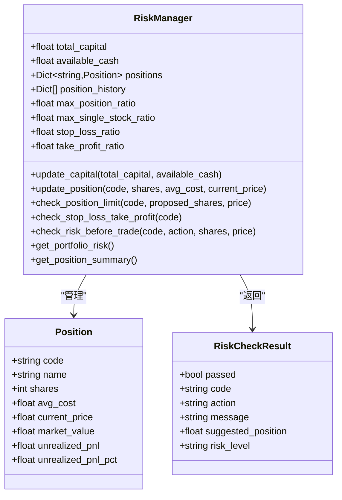
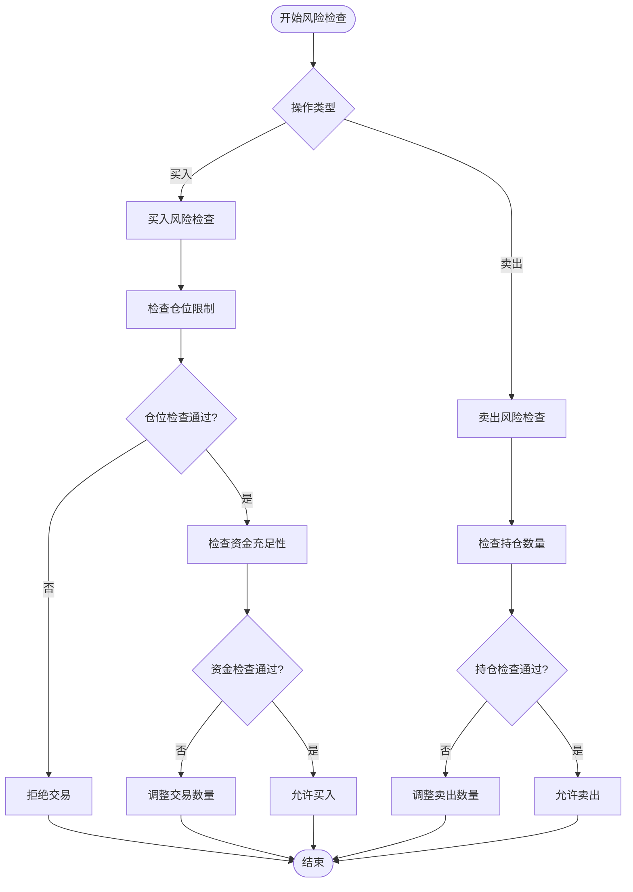
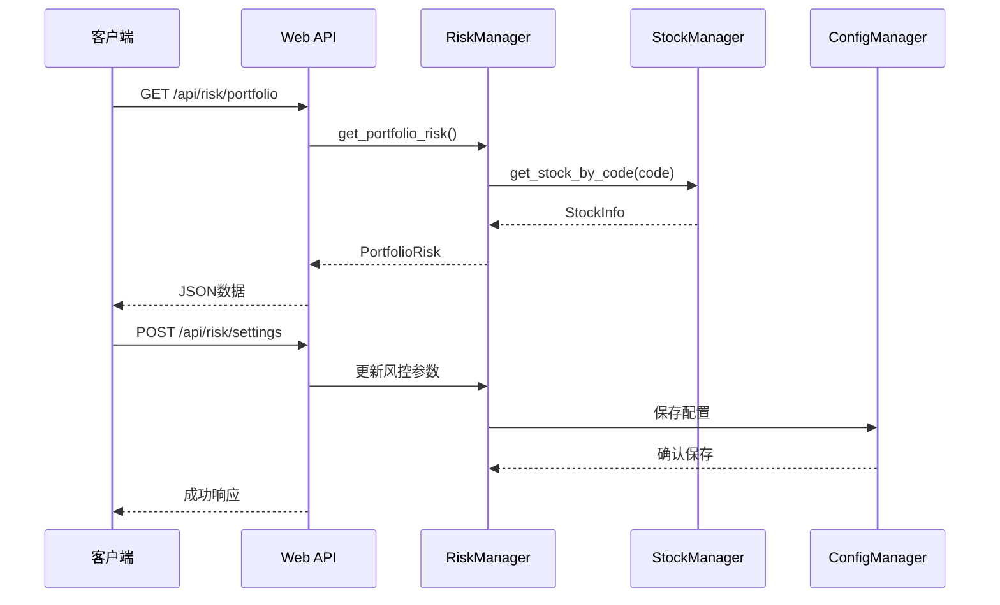
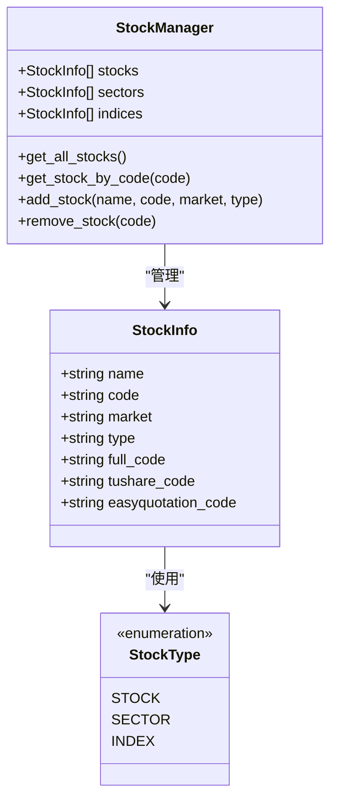
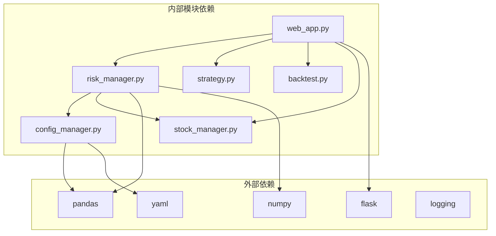
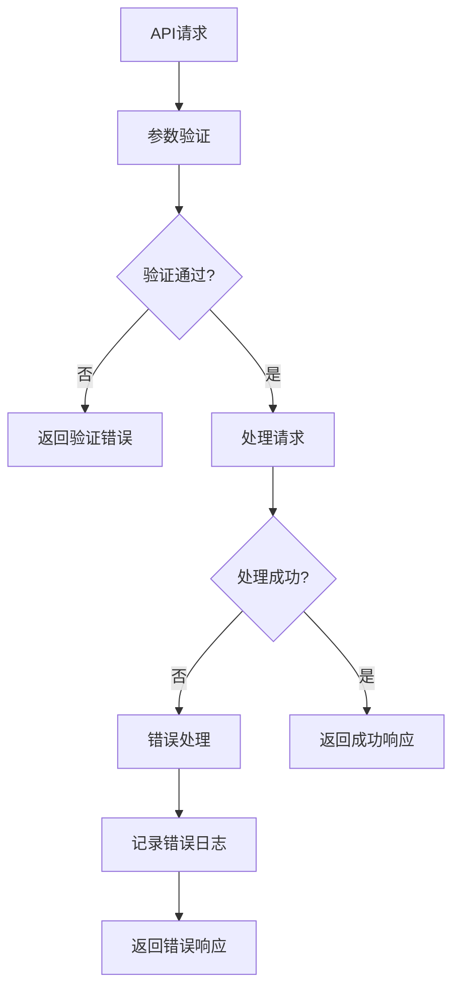

# 风险控制系统

<cite>
**本文档引用的文件**
- [risk_manager.py](file://quant_system/risk_manager.py)
- [config_manager.py](file://quant_system/config_manager.py)
- [config.yaml](file://config.yaml)
- [stocks.yaml](file://config/stocks.yaml)
- [web_app.py](file://quant_system/web_app.py)
- [stock_manager.py](file://quant_system/stock_manager.py)
- [strategy.py](file://quant_system/strategy.py)
- [backtest.py](file://quant_system/backtest.py)
- [risk.html](file://quant_system/templates/risk.html)
- [dashboard.html](file://quant_system/templates/dashboard.html)
</cite>

## 目录
1. [简介](#简介)
2. [项目结构](#项目结构)
3. [核心组件](#核心组件)
4. [架构概览](#架构概览)
5. [详细组件分析](#详细组件分析)
6. [依赖关系分析](#依赖关系分析)
7. [性能考虑](#性能考虑)
8. [故障排除指南](#故障排除指南)
9. [结论](#结论)
10. [附录](#附录)

## 简介

vibequation量化交易系统的风险控制系统是一个完整的风控管理体系，旨在为量化交易提供全面的风险控制保障。该系统实现了从风险识别、风险评估到风险控制和风险监控的全流程管理，涵盖了仓位管理、止损止盈机制、风险分散等多个维度。

系统采用模块化设计，通过配置驱动的方式实现灵活的风险控制策略，支持实时监控和可视化展示，为用户提供直观的风险管理界面。

## 项目结构

风险控制系统位于quant_system目录下，主要包含以下核心文件：



**图表来源**
- [risk_manager.py:1-404](file://quant_system/risk_manager.py#L1-L404)
- [config_manager.py:1-178](file://quant_system/config_manager.py#L1-L178)
- [web_app.py:1-957](file://quant_system/web_app.py#L1-L957)

**章节来源**
- [risk_manager.py:1-404](file://quant_system/risk_manager.py#L1-L404)
- [config_manager.py:1-178](file://quant_system/config_manager.py#L1-L178)
- [config.yaml:1-88](file://config.yaml#L1-L88)
- [stocks.yaml:1-71](file://config/stocks.yaml#L1-L71)

## 核心组件

风险控制系统由以下核心组件构成：

### 1. 风险管理器 (RiskManager)
负责核心风控逻辑的执行，包括：
- 仓位限制检查
- 止损止盈检测
- 风险评估
- 组合风险指标计算

### 2. 配置管理器 (ConfigManager)
统一管理所有配置信息，支持：
- 风控参数配置
- 数据存储路径管理
- API令牌管理
- 技术指标配置

### 3. Web应用接口
提供RESTful API接口，支持：
- 风控数据查询
- 风控设置更新
- 实时风险监控
- 可视化界面展示

### 4. 股票管理器
维护股票代码数据库，支持：
- 股票信息管理
- 代码标准化处理
- 多类型股票支持（个股、板块、指数）

**章节来源**
- [risk_manager.py:47-404](file://quant_system/risk_manager.py#L47-L404)
- [config_manager.py:12-178](file://quant_system/config_manager.py#L12-L178)
- [web_app.py:376-526](file://quant_system/web_app.py#L376-L526)
- [stock_manager.py:62-278](file://quant_system/stock_manager.py#L62-L278)

## 架构概览

系统采用分层架构设计，各层职责明确：



**图表来源**
- [web_app.py:1-957](file://quant_system/web_app.py#L1-L957)
- [risk_manager.py:1-404](file://quant_system/risk_manager.py#L1-L404)
- [config_manager.py:1-178](file://quant_system/config_manager.py#L1-L178)

系统架构特点：
- **模块化设计**：各组件职责清晰，便于维护和扩展
- **配置驱动**：通过配置文件实现灵活的风险控制策略调整
- **实时监控**：提供实时风险数据查询和可视化展示
- **可扩展性**：支持新增风险控制规则和策略

## 详细组件分析

### 风险管理器深度分析

#### 核心数据结构



**图表来源**
- [risk_manager.py:23-143](file://quant_system/risk_manager.py#L23-L143)
- [risk_manager.py:47-283](file://quant_system/risk_manager.py#L47-L283)

#### 仓位管理策略实现

系统实现了多种仓位管理策略：

1. **固定仓位策略**：基于预设的仓位比例进行投资
2. **动态仓位策略**：根据市场波动性和风险评估动态调整仓位
3. **风险比例策略**：根据风险承受能力和市场情况调整仓位大小

#### 风险检查流程



**图表来源**
- [risk_manager.py:185-239](file://quant_system/risk_manager.py#L185-L239)

#### 止损止盈机制

系统提供了多层次的止损止盈保护：

1. **固定比例止损**：当亏损达到预设比例时自动止损
2. **固定比例止盈**：当盈利达到预设比例时自动止盈
3. **移动止损**：根据价格波动动态调整止损位置
4. **跟踪止损**：跟随价格走势调整止损点位

#### 风险监控指标

系统计算多种风险监控指标：

1. **总仓位比例**：总持仓价值占总资产的比例
2. **单股仓位比例**：单只股票持仓占总资产的比例
3. **持仓集中度**：最大单只股票占比
4. **风险等级评估**：基于仓位和集中度的风险等级

**章节来源**
- [risk_manager.py:47-283](file://quant_system/risk_manager.py#L47-L283)

### 配置管理系统

#### 配置文件结构

```mermaid
graph LR
subgraph "主配置文件 config.yaml"
Tokens[Tokens配置]
Storage[数据存储配置]
DataCol[数据采集配置]
TechInd[技术指标配置]
AIMod[AI模型配置]
Backtest[回测配置]
RiskCfg[风控配置]
WebCfg[Web服务配置]
LogCfg[日志配置]
end
subgraph "股票配置 stocks.yaml"
Stocks[个股配置]
Sectors[板块配置]
Indices[指数配置]
end
subgraph "配置管理器"
CM[ConfigManager]
Get[get()方法]
Set[set()方法]
Save[save()方法]
end
Tokens --> CM
Storage --> CM
DataCol --> CM
TechInd --> CM
AIMod --> CM
Backtest --> CM
RiskCfg --> CM
WebCfg --> CM
LogCfg --> CM
Stocks --> CM
Sectors --> CM
Indices --> CM
```

**图表来源**
- [config.yaml:1-88](file://config.yaml#L1-L88)
- [stocks.yaml:1-71](file://config/stocks.yaml#L1-L71)
- [config_manager.py:12-178](file://quant_system/config_manager.py#L12-L178)

#### 风控配置参数

系统支持以下风控配置参数：

| 参数名称 | 默认值 | 描述 | 配置路径 |
|---------|--------|------|----------|
| max_position_ratio | 0.8 | 最大总仓位比例 | risk_management.max_position_ratio |
| max_single_stock_ratio | 0.3 | 单只股票最大仓位 | risk_management.max_single_stock_ratio |
| stop_loss_ratio | 0.05 | 止损比例 | risk_management.stop_loss_ratio |
| take_profit_ratio | 0.1 | 止盈比例 | risk_management.take_profit_ratio |

**章节来源**
- [config_manager.py:149-156](file://quant_system/config_manager.py#L149-L156)
- [config.yaml:69-75](file://config.yaml#L69-L75)

### Web应用接口分析

#### API端点设计

系统提供了完整的RESTful API接口：



**图表来源**
- [web_app.py:376-526](file://quant_system/web_app.py#L376-L526)

#### 关键API端点

1. **风险组合查询**：`/api/risk/portfolio`
2. **持仓信息查询**：`/api/risk/positions`
3. **资金信息管理**：`/api/risk/capital`
4. **风控设置管理**：`/api/risk/settings`
5. **持仓管理**：`/api/risk/position`

**章节来源**
- [web_app.py:376-526](file://quant_system/web_app.py#L376-L526)

### 股票管理器分析

#### 股票类型支持

系统支持三种股票类型：



**图表来源**
- [stock_manager.py:13-60](file://quant_system/stock_manager.py#L13-L60)
- [stock_manager.py:62-278](file://quant_system/stock_manager.py#L62-L278)

#### 代码标准化处理

系统提供多种代码格式转换：

1. **标准代码格式**：纯数字代码（如600519）
2. **完整代码格式**：包含市场前缀（如sh600519）
3. **Tushare代码格式**：符合Tushare API格式（如600519.SH）

**章节来源**
- [stock_manager.py:111-164](file://quant_system/stock_manager.py#L111-L164)

## 依赖关系分析

### 组件间依赖关系



**图表来源**
- [risk_manager.py:1-18](file://quant_system/risk_manager.py#L1-L18)
- [web_app.py:12-26](file://quant_system/web_app.py#L12-L26)
- [config_manager.py:6-9](file://quant_system/config_manager.py#L6-L9)

### 关键依赖分析

1. **数据处理依赖**：pandas和numpy用于数据分析和计算
2. **Web框架依赖**：Flask提供Web服务和API接口
3. **配置管理依赖**：PyYAML用于配置文件的读写
4. **日志系统依赖**：Python内置logging模块

**章节来源**
- [risk_manager.py:1-18](file://quant_system/risk_manager.py#L1-L18)
- [web_app.py:12-26](file://quant_system/web_app.py#L12-L26)
- [config_manager.py:6-9](file://quant_system/config_manager.py#L6-L9)

## 性能考虑

### 计算复杂度分析

1. **风险检查算法**：O(1)时间复杂度，主要为常量时间的数值比较
2. **组合风险计算**：O(n)时间复杂度，n为持仓数量
3. **配置加载**：O(1)时间复杂度，配置文件相对较小
4. **Web请求处理**：O(1)平均时间复杂度，数据库查询为常量时间

### 内存使用优化

1. **数据结构优化**：使用dataclass减少内存开销
2. **延迟加载**：配置文件按需加载
3. **缓存机制**：股票信息缓存避免重复查询
4. **批量操作**：支持批量风险检查和更新

### 并发处理

系统支持多线程并发访问，通过以下机制保证数据一致性：
- 风险管理器的状态同步
- 配置管理器的线程安全
- Web应用的请求隔离

## 故障排除指南

### 常见问题及解决方案

#### 风控配置问题

**问题**：风控参数设置无效
**原因**：配置文件权限问题或格式错误
**解决方案**：
1. 检查config.yaml文件权限
2. 验证YAML格式正确性
3. 重启Web服务使配置生效

#### 资金管理问题

**问题**：资金信息更新失败
**原因**：API参数格式错误或网络问题
**解决方案**：
1. 检查POST请求JSON格式
2. 验证必需参数完整性
3. 查看服务器日志获取详细错误信息

#### 持仓管理问题

**问题**：持仓信息无法保存
**原因**：股票代码不存在或数据验证失败
**解决方案**：
1. 确认股票代码格式正确
2. 检查股票代码是否在配置文件中
3. 验证价格和数量参数范围

### 错误处理机制

系统实现了完善的错误处理机制：



**图表来源**
- [web_app.py:376-526](file://quant_system/web_app.py#L376-L526)

**章节来源**
- [web_app.py:376-526](file://quant_system/web_app.py#L376-L526)

## 结论

vibequation量化交易系统的风险控制系统是一个设计合理、功能完备的风险管理框架。系统通过模块化设计实现了风险识别、风险评估、风险控制和风险监控的完整闭环。

### 主要优势

1. **配置驱动**：通过配置文件实现灵活的风险控制策略调整
2. **实时监控**：提供实时风险数据查询和可视化展示
3. **多策略支持**：支持多种仓位管理和止损止盈策略
4. **可扩展性**：模块化设计便于功能扩展和维护
5. **用户友好**：提供直观的Web界面和API接口

### 改进建议

1. **增强风险指标**：可以增加更多高级风险指标如VaR、最大连续亏损等
2. **机器学习集成**：可以集成机器学习算法进行风险预测
3. **实时预警**：可以增加实时风险预警和通知机制
4. **多账户支持**：可以支持多账户的风险统一管理

该系统为量化交易提供了坚实的风险控制基础，能够有效帮助投资者管理投资风险，提高投资安全性。

## 附录

### 配置参数参考表

| 配置类别 | 参数名称 | 默认值 | 单位 | 描述 |
|---------|----------|--------|------|------|
| 风控配置 | max_position_ratio | 0.8 | 比例 | 最大总仓位比例 |
| 风控配置 | max_single_stock_ratio | 0.3 | 比例 | 单只股票最大仓位 |
| 风控配置 | stop_loss_ratio | 0.05 | 比例 | 止损比例 |
| 风控配置 | take_profit_ratio | 0.1 | 比例 | 止盈比例 |
| 回测配置 | initial_capital | 1000000 | 元 | 初始资金 |
| 回测配置 | commission_rate | 0.0003 | 比例 | 手续费率 |
| 回测配置 | slippage | 0.001 | 比例 | 滑点 |

### API使用示例

#### 获取风险组合信息
```bash
curl http://localhost:8080/api/risk/portfolio
```

#### 更新风控设置
```bash
curl -X POST http://localhost:8080/api/risk/settings \
  -H "Content-Type: application/json" \
  -d '{"max_position_ratio": 0.7, "stop_loss_ratio": 0.03}'
```

#### 添加持仓
```bash
curl -X POST http://localhost:8080/api/risk/position \
  -H "Content-Type: application/json" \
  -d '{"code": "600519", "shares": 100, "avg_cost": 120.5, "current_price": 125.0}'
```