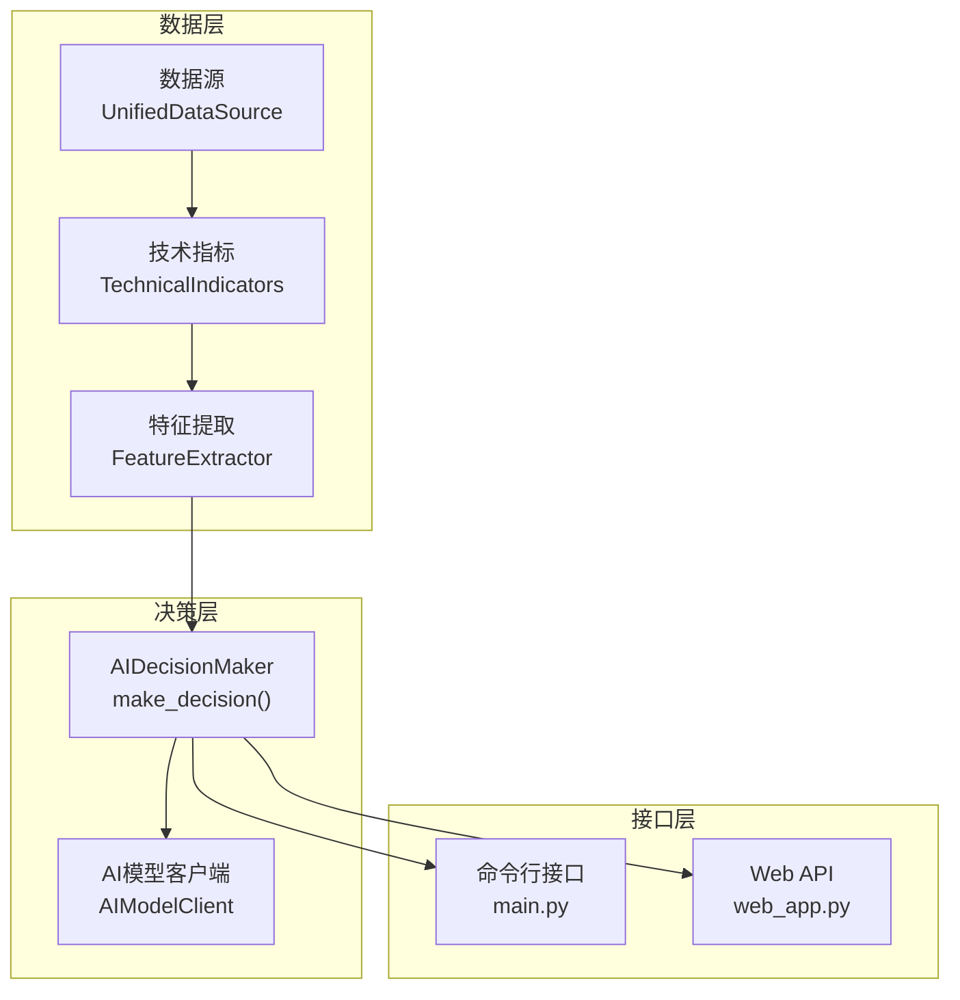
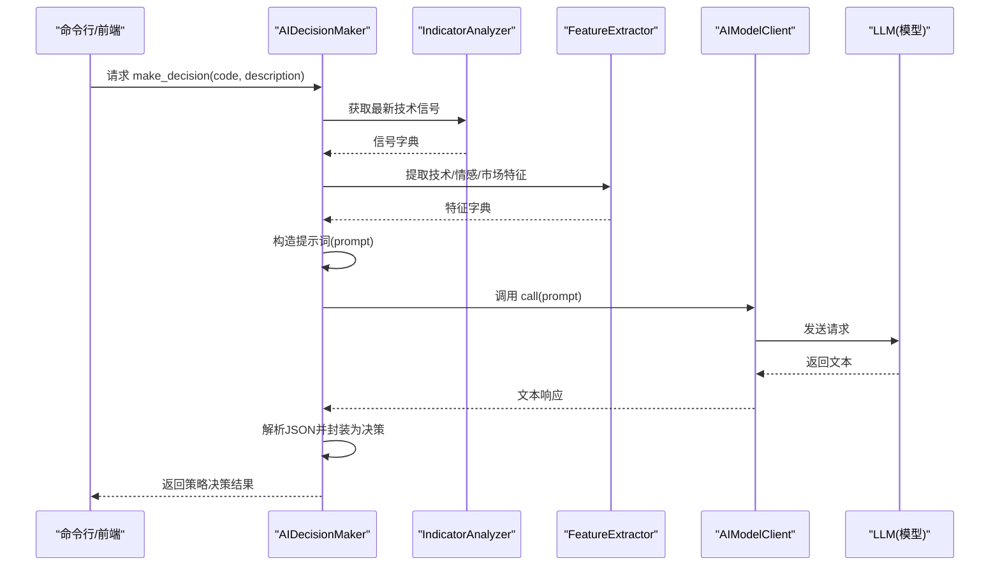
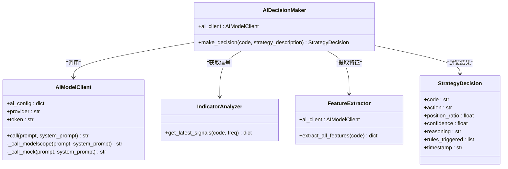
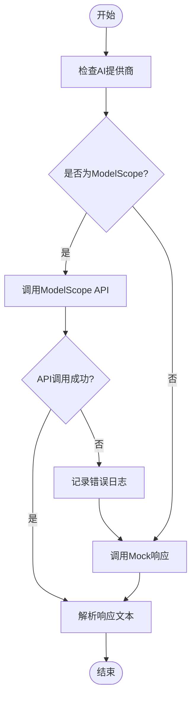
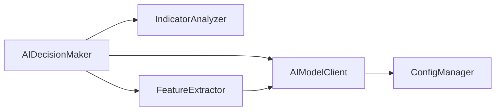

# AI决策系统

<cite>
**本文档引用的文件**
- [main.py](file://main.py)
- [strategy.py](file://quant_system/strategy.py)
- [feature_extractor.py](file://quant_system/feature_extractor.py)
- [indicators.py](file://quant_system/indicators.py)
- [config_manager.py](file://quant_system/config_manager.py)
- [config.yaml](file://config.yaml)
- [Prompt.txt](file://Prompt.txt)
- [web_app.py](file://quant_system/web_app.py)
</cite>

## 目录
1. [简介](#简介)
2. [项目结构](#项目结构)
3. [核心组件](#核心组件)
4. [架构总览](#架构总览)
5. [详细组件分析](#详细组件分析)
6. [依赖关系分析](#依赖关系分析)
7. [性能考虑](#性能考虑)
8. [故障排除指南](#故障排除指南)
9. [结论](#结论)
10. [附录](#附录)

## 简介
本文件面向vibequation量化交易系统的AI决策模块，系统性阐述AIDecisionMaker类的设计理念、实现架构与数据流，解释如何通过AI模型进行智能交易决策；深入分析AI决策的输入数据结构（技术指标、特征分析、可选策略描述）、提示词设计原理、输出结果格式与字段含义；同时给出AI模型客户端（AIModelClient）的集成方式与错误处理机制，并提供最佳实践与调优建议。

## 项目结构
AI决策模块位于策略层，围绕AIDecisionMaker类展开，其上游依赖技术指标与特征提取模块，下游通过Web API对外提供服务。整体数据流自下而上：数据源 → 技术指标 → 特征分析 → AI决策 → 输出结果。

**图表来源**
- [main.py:306-311](file://main.py#L306-L311)
- [web_app.py:515-540](file://quant_system/web_app.py#L515-L540)
- [strategy.py:462-551](file://quant_system/strategy.py#L462-L551)
- [feature_extractor.py:24-97](file://quant_system/feature_extractor.py#L24-L97)
- [indicators.py:330-389](file://quant_system/indicators.py#L330-L389)

**章节来源**
- [main.py:306-311](file://main.py#L306-L311)
- [web_app.py:515-540](file://quant_system/web_app.py#L515-L540)
- [strategy.py:462-551](file://quant_system/strategy.py#L462-L551)
- [feature_extractor.py:24-97](file://quant_system/feature_extractor.py#L24-L97)
- [indicators.py:330-389](file://quant_system/indicators.py#L330-L389)

## 核心组件
- AIDecisionMaker：负责整合技术指标与特征分析，构造提示词，调用AI模型，解析JSON输出并封装为策略决策结果。
- AIModelClient：抽象AI模型客户端，支持ModelScope API与降级Mock实现，具备错误处理与降级能力。
- 技术指标模块：提供最新信号字典，包含RSI、MACD、均线、布林带、KDJ与综合评分等。
- 特征提取模块：提取技术特征、情感特征与市场特征，并可调用AI进行策略类型分析。
- 配置管理：集中管理AI模型提供商、模型参数、Token等配置项。

**章节来源**
- [strategy.py:462-551](file://quant_system/strategy.py#L462-L551)
- [feature_extractor.py:24-97](file://quant_system/feature_extractor.py#L24-L97)
- [indicators.py:330-389](file://quant_system/indicators.py#L330-L389)
- [config_manager.py:158-165](file://quant_system/config_manager.py#L158-L165)

## 架构总览
AI决策模块采用“数据驱动 + LLM推理”的架构：先从数据源与指标模块获取标准化数据，再通过特征提取模块丰富多维特征，最终由AIDecisionMaker拼装提示词并调用AI模型，解析JSON输出形成统一的决策结果对象。

**图表来源**
- [strategy.py:468-550](file://quant_system/strategy.py#L468-L550)
- [indicators.py:336-388](file://quant_system/indicators.py#L336-L388)
- [feature_extractor.py:190-211](file://quant_system/feature_extractor.py#L190-L211)
- [feature_extractor.py:32-86](file://quant_system/feature_extractor.py#L32-L86)

## 详细组件分析

### AIDecisionMaker 类设计与实现
- 设计理念
  - 将“技术指标 + 特征分析 + 可选策略描述”作为输入，统一转化为可执行的交易建议。
  - 通过结构化提示词引导LLM输出标准JSON，便于解析与后续风控/执行环节使用。
  - 对AI调用失败进行降级处理，保证系统鲁棒性。
- 关键方法
  - make_decision(code, strategy_description=None)：主入口，组装输入数据、构造提示词、调用AI、解析结果并封装为StrategyDecision。
- 输入数据结构
  - 技术指标：来自IndicatorAnalyzer.get_latest_signals(code)，包含RSI、MACD、均线趋势、综合评分、KDJ-J等。
  - 特征分析：来自FeatureExtractor.extract_all_features(code)，包含技术特征（趋势强度、RSI水平、布林带位置等）与情感特征（平均情感、情感趋势等）。
  - 可选策略描述：自然语言策略描述，用于指导AI在特定策略框架内做决策。
- 提示词设计原则
  - 明确目标：对指定股票做出交易决策。
  - 结构化格式：使用分节（技术指标、特征分析、策略要求、JSON输出模板）组织提示词，降低歧义。
  - 字段约束：明确action、position_ratio、confidence、reasoning、risk_assessment等字段范围与含义。
- 输出结果格式
  - JSON字段：action（buy/sell/hold）、position_ratio（0.0-1.0）、confidence（0.0-1.0）、reasoning（详细理由）、risk_assessment（风险评估）。
  - 封装为StrategyDecision对象，包含code、action、position_ratio、confidence、reasoning、rules_triggered、timestamp等字段。
- 错误处理
  - 当无法获取指标或AI调用失败时，返回默认Hold决策，置信度为0，并记录错误日志。
  - AI响应非JSON时，尝试提取JSON片段并容错解析，否则返回错误reasoning。

**图表来源**
- [strategy.py:462-551](file://quant_system/strategy.py#L462-L551)
- [feature_extractor.py:24-97](file://quant_system/feature_extractor.py#L24-L97)
- [indicators.py:330-389](file://quant_system/indicators.py#L330-L389)

**章节来源**
- [strategy.py:468-550](file://quant_system/strategy.py#L468-L550)
- [indicators.py:336-388](file://quant_system/indicators.py#L336-L388)
- [feature_extractor.py:190-211](file://quant_system/feature_extractor.py#L190-L211)

### AI模型客户端（AIModelClient）集成与错误处理
- 集成方式
  - 通过ConfigManager读取AI模型配置（provider、model_name、max_tokens、temperature）与Token。
  - 支持ModelScope API直连与Mock降级两种模式，优先使用真实API，失败时回退至Mock响应。
- 错误处理机制
  - API调用异常捕获并记录日志，自动切换到Mock模式，返回预设的JSON样例。
  - Mock模式返回包含策略类型、置信度、理由、推荐指标与风险等级的JSON样例，便于特征分析流程使用。
- 配置要点
  - provider：可选modelscope或本地mock。
  - max_tokens：控制LLM输出长度。
  - temperature：控制随机性，建议在0.3~0.7区间调优。

**图表来源**
- [feature_extractor.py:32-86](file://quant_system/feature_extractor.py#L32-L86)
- [config_manager.py:158-165](file://quant_system/config_manager.py#L158-L165)

**章节来源**
- [feature_extractor.py:32-86](file://quant_system/feature_extractor.py#L32-L86)
- [config_manager.py:158-165](file://quant_system/config_manager.py#L158-L165)

### 输入数据结构与特征分析
- 技术指标（来自IndicatorAnalyzer）
  - RSI(6)/RSI(12)/RSI(24)、MACD柱状图、均线趋势、综合评分、KDJ-J等。
  - 通过_get_latest_signals(code)获取最新信号字典，供提示词与决策使用。
- 特征分析（来自FeatureExtractor）
  - 技术特征：趋势强度、趋势方向、RSI水平、MACD动量、均线排列、波动率代理、布林带相对位置等。
  - 情感特征：平均情感、情感波动、情感趋势、新闻数量、正面比例等。
  - 市场特征：市场贝塔、行业排名等（预留扩展）。
- 提示词中的字段映射
  - 将上述指标与特征按固定格式写入提示词，确保LLM能稳定解析。

**章节来源**
- [indicators.py:336-388](file://quant_system/indicators.py#L336-L388)
- [feature_extractor.py:115-189](file://quant_system/feature_extractor.py#L115-L189)

### 提示词设计与JSON输出规范
- 提示词结构
  - 标题与目标：明确对某股票进行交易决策。
  - 技术指标与特征分析：按固定格式列出关键指标与特征。
  - 可选策略描述：若提供，则在提示词中插入策略要求部分。
  - JSON输出模板：严格限定字段与取值范围，便于解析。
- JSON输出字段
  - action：建议操作（buy/sell/hold）。
  - position_ratio：建议仓位比例（0.0-1.0）。
  - confidence：置信度（0.0-1.0）。
  - reasoning：详细理由。
  - risk_assessment：风险评估。
- 解析与容错
  - 通过定位花括号范围提取JSON片段，避免LLM输出多余内容干扰。
  - 若解析失败，返回错误reasoning并降级为Hold决策。

**章节来源**
- [strategy.py:497-521](file://quant_system/strategy.py#L497-L521)
- [strategy.py:523-550](file://quant_system/strategy.py#L523-L550)

### Web API与命令行集成
- Web API
  - /api/ai/decision：接收code与strategy_description，调用AIDecisionMaker，返回标准化JSON。
- 命令行
  - ai-decision子命令：调用ai_decision_maker.make_decision并打印结果。
- 前端交互
  - 前端页面提供获取AI决策按钮，AJAX调用/api/ai/decision，展示action、position_ratio、confidence与reasoning。

**章节来源**
- [web_app.py:515-540](file://quant_system/web_app.py#L515-L540)
- [main.py:306-311](file://main.py#L306-L311)

## 依赖关系分析
- 组件耦合
  - AIDecisionMaker强依赖IndicatorAnalyzer与FeatureExtractor，弱依赖AIModelClient。
  - AIModelClient依赖ConfigManager读取配置与Token。
- 外部依赖
  - ModelScope API：用于真实LLM推理；失败时回退Mock。
  - Tushare/EasyQuotation：提供历史与实时数据（间接影响指标质量）。
- 潜在循环依赖
  - 无直接循环依赖；各模块职责清晰，通过接口传递数据。

**图表来源**
- [strategy.py:462-551](file://quant_system/strategy.py#L462-L551)
- [feature_extractor.py:24-97](file://quant_system/feature_extractor.py#L24-L97)
- [config_manager.py:158-165](file://quant_system/config_manager.py#L158-L165)

**章节来源**
- [strategy.py:462-551](file://quant_system/strategy.py#L462-L551)
- [feature_extractor.py:24-97](file://quant_system/feature_extractor.py#L24-L97)
- [config_manager.py:158-165](file://quant_system/config_manager.py#L158-L165)

## 性能考虑
- 数据访问优化
  - 技术指标与特征应尽量复用已计算结果，避免重复计算。
  - 对频繁调用的接口（如Web API）可增加缓存层，减少LLM调用次数。
- LLM调用成本控制
  - 控制提示词长度与max_tokens，合理设置temperature以平衡质量与稳定性。
  - 对批量场景（如特征分析）可合并请求或异步处理。
- 错误降级与可观测性
  - AI调用失败快速降级为Mock响应，保证系统可用性。
  - 记录详细的日志与错误码，便于问题追踪与性能监控。

## 故障排除指南
- AI调用失败
  - 现象：返回Hold决策且reasoning包含错误信息。
  - 处理：检查ModelScope Token与网络连接；确认config.yaml中AI配置正确。
- 指标为空
  - 现象：决策reasoning提示无法获取数据。
  - 处理：确认历史数据与技术指标已更新；检查数据源配置与权限。
- JSON解析失败
  - 现象：提示词输出非标准JSON。
  - 处理：调整提示词格式与输出模板；确保LLM遵循JSON结构约束。

**章节来源**
- [strategy.py:540-550](file://quant_system/strategy.py#L540-L550)
- [feature_extractor.py:83-85](file://quant_system/feature_extractor.py#L83-L85)

## 结论
AIDecisionMaker通过结构化提示词与标准化JSON输出，将多维度技术指标与特征分析转化为可执行的交易建议。AIModelClient提供可靠的集成与降级机制，保障系统在不同环境下稳定运行。结合配置管理与Web接口，该模块实现了从数据到决策的闭环，为量化交易提供了智能化支撑。

## 附录

### AI决策提示词设计原理
- 明确目标与上下文：限定股票、时间点与策略背景。
- 结构化输入：分节列出技术指标与特征，避免歧义。
- 严格输出：限定JSON字段与取值范围，便于自动化解析。

**章节来源**
- [strategy.py:497-521](file://quant_system/strategy.py#L497-L521)

### AI决策结果数据格式与字段含义
- action：建议操作（buy/sell/hold）。
- position_ratio：建议仓位比例（0.0-1.0）。
- confidence：置信度（0.0-1.0）。
- reasoning：详细理由。
- risk_assessment：风险评估。

**章节来源**
- [strategy.py:513-520](file://quant_system/strategy.py#L513-L520)

### AI模型客户端集成方式与配置
- 配置项
  - provider：AI服务提供商（modelscope/local）。
  - model_name：模型名称（如qwen-max）。
  - max_tokens：最大输出长度。
  - temperature：随机性参数。
- Token管理：通过ConfigManager.get_modelscope_token()读取。

**章节来源**
- [config.yaml:56-61](file://config.yaml#L56-L61)
- [config_manager.py:109](file://quant_system/config_manager.py#L109)
- [feature_extractor.py:27-31](file://quant_system/feature_extractor.py#L27-L31)

### 最佳实践与调优建议
- 提示词优化
  - 保持提示词简洁、结构化，避免冗余信息。
  - 为不同策略类型定制提示词模板，提升针对性。
- 参数调优
  - temperature：在0.3~0.7之间调整，兼顾稳定性与多样性。
  - max_tokens：根据JSON模板长度适当放宽，避免截断。
- 错误处理
  - 建立完善的日志与告警机制，及时发现并修复问题。
  - 对关键路径增加重试与熔断策略，提升系统韧性。
- 数据质量
  - 确保技术指标与特征数据的完整性与时效性，避免因数据缺失导致决策偏差。

**章节来源**
- [feature_extractor.py:32-86](file://quant_system/feature_extractor.py#L32-L86)
- [config.yaml:56-61](file://config.yaml#L56-L61)