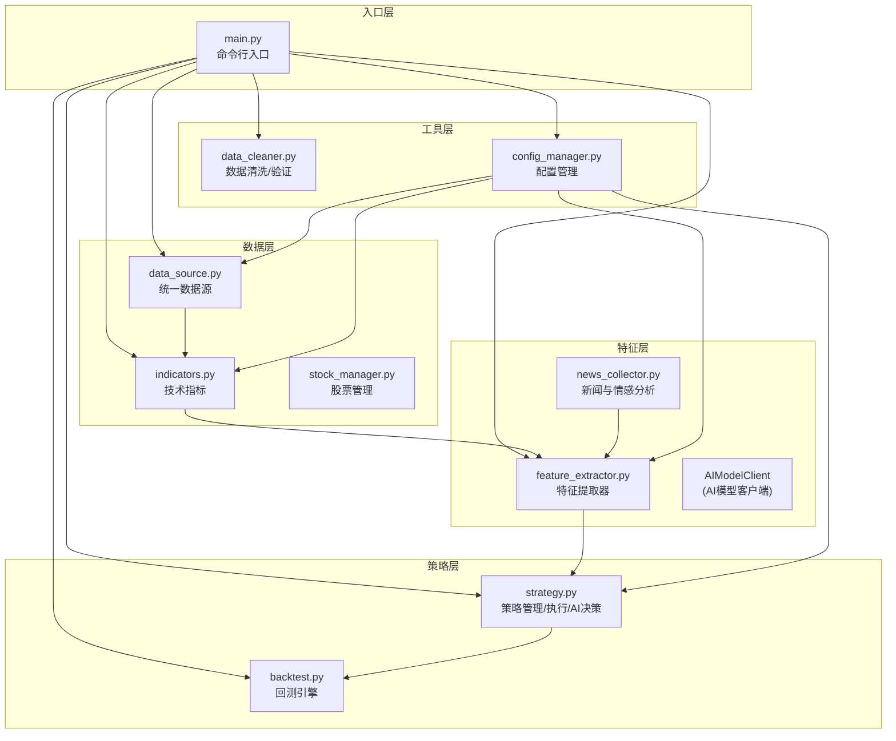
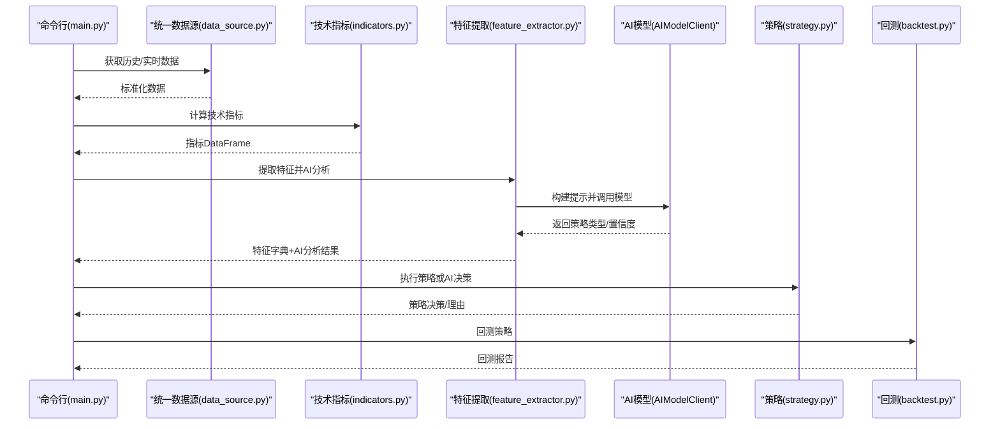
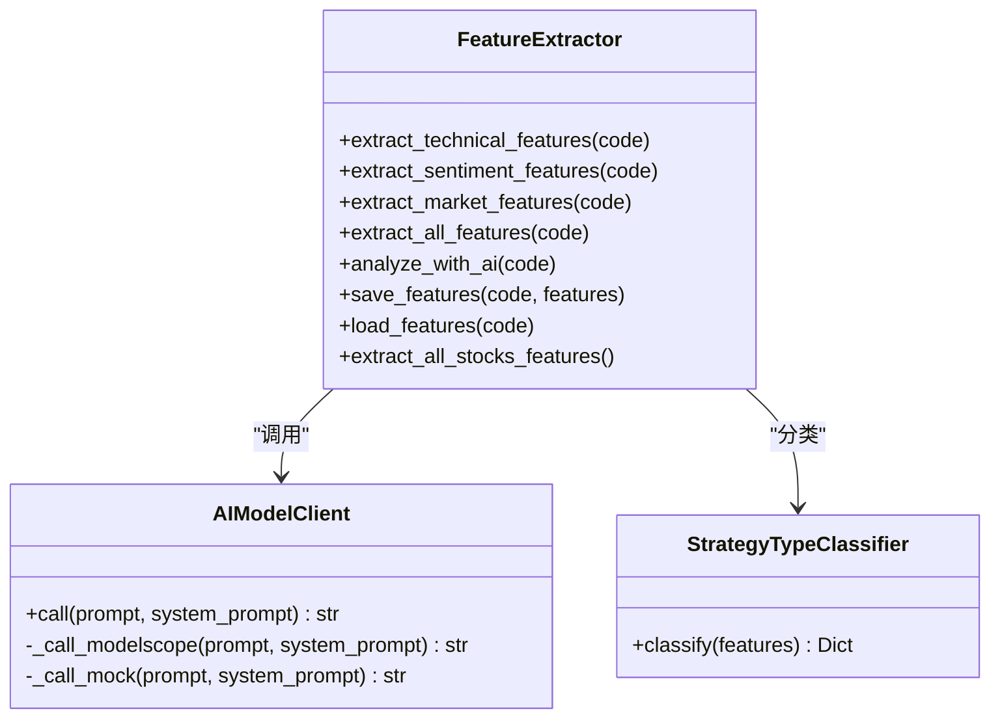
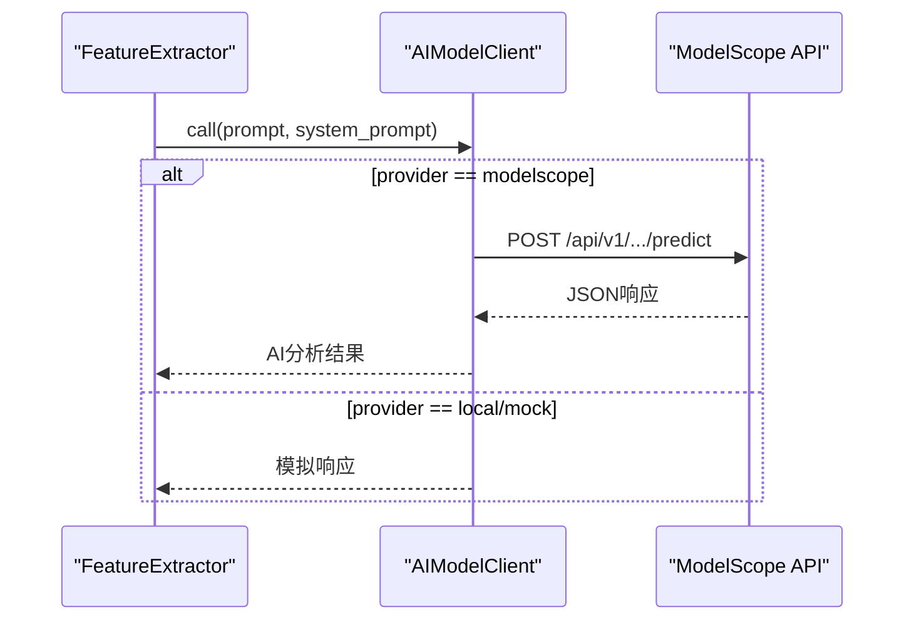
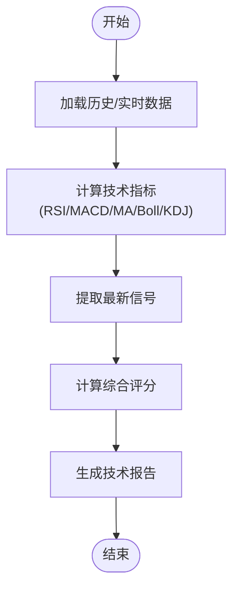
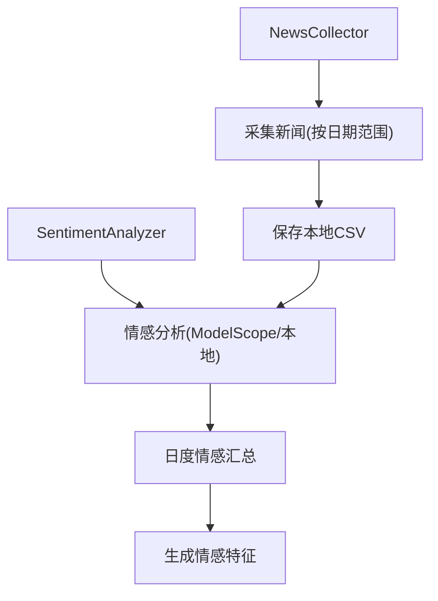
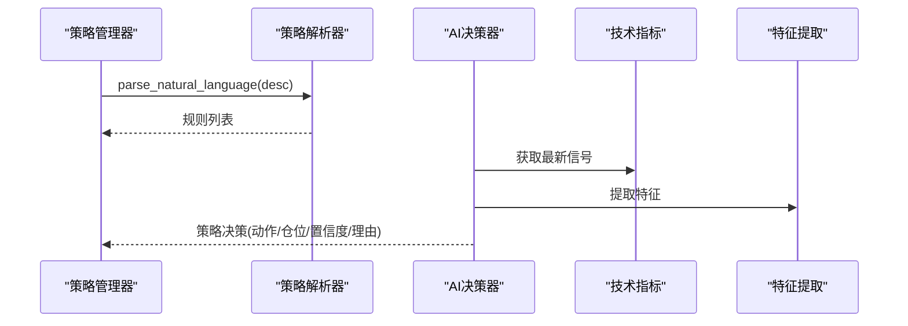
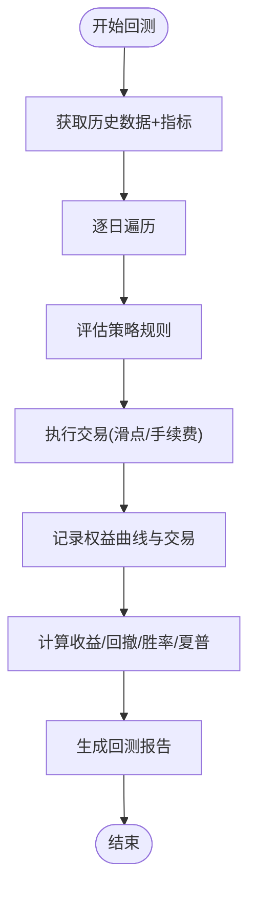
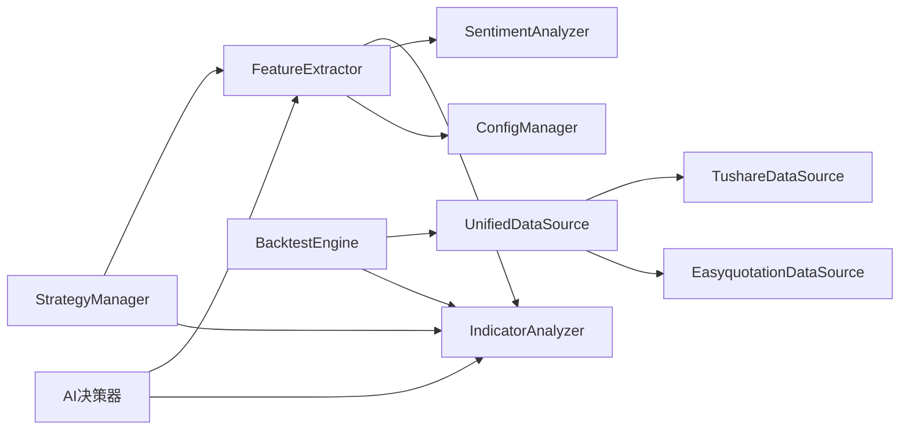

# 特征提取集成

<cite>
**本文引用的文件**
- [feature_extractor.py](file://quant_system/feature_extractor.py)
- [strategy.py](file://quant_system/strategy.py)
- [indicators.py](file://quant_system/indicators.py)
- [news_collector.py](file://quant_system/news_collector.py)
- [data_source.py](file://quant_system/data_source.py)
- [stock_manager.py](file://quant_system/stock_manager.py)
- [config_manager.py](file://quant_system/config_manager.py)
- [main.py](file://main.py)
- [config.yaml](file://config.yaml)
- [config/stocks.yaml](file://config/stocks.yaml)
- [backtest.py](file://quant_system/backtest.py)
- [data_cleaner.py](file://quant_system/data_cleaner.py)
</cite>

## 目录
1. [简介](#简介)
2. [项目结构](#项目结构)
3. [核心组件](#核心组件)
4. [架构总览](#架构总览)
5. [详细组件分析](#详细组件分析)
6. [依赖关系分析](#依赖关系分析)
7. [性能考量](#性能考量)
8. [故障排查指南](#故障排查指南)
9. [结论](#结论)
10. [附录](#附录)

## 简介
本文件面向vibequation量化交易系统，聚焦“特征提取与策略集成”的设计与实现，系统性阐述特征提取器(FeatureExtractor)与策略系统的集成机制，涵盖技术指标、市场情绪、新闻情感等多维度特征的提取与融合；解释策略分类器(strategy_classifier)的工作原理与应用场景；剖析AI模型客户端(AIModelClient)在策略决策中的作用与实现细节；给出从原始数据到最终特征向量的完整流程；总结特征权重分配、特征选择与特征工程的最佳实践，并说明如何利用提取的特征优化策略决策的准确性与稳定性。

## 项目结构
系统采用模块化分层设计：
- 数据层：统一数据源、历史/实时数据、技术指标计算
- 特征层：特征提取器、新闻情感分析、AI模型客户端
- 策略层：策略解析与执行、策略管理、AI决策器
- 工具层：数据清洗、回测引擎、风险控制、通知等
- 入口层：命令行入口与Web服务

图表来源
- [main.py:1-365](file://main.py#L1-L365)
- [data_source.py:1-423](file://quant_system/data_source.py#L1-L423)
- [indicators.py:1-500](file://quant_system/indicators.py#L1-L500)
- [feature_extractor.py:1-405](file://quant_system/feature_extractor.py#L1-L405)
- [news_collector.py:1-465](file://quant_system/news_collector.py#L1-L465)
- [strategy.py:1-556](file://quant_system/strategy.py#L1-L556)
- [backtest.py:1-456](file://quant_system/backtest.py#L1-L456)
- [data_cleaner.py:1-444](file://quant_system/data_cleaner.py#L1-L444)
- [config_manager.py:1-178](file://quant_system/config_manager.py#L1-L178)

章节来源
- [main.py:1-365](file://main.py#L1-L365)
- [config.yaml:1-88](file://config.yaml#L1-L88)
- [config/stocks.yaml:1-71](file://config/stocks.yaml#L1-L71)

## 核心组件
- 特征提取器(FeatureExtractor)：负责从技术指标、新闻情感、市场特征等维度提取特征，并通过AI模型进行综合分析与策略类型判定。
- 策略分类器(StrategyTypeClassifier)：基于提取的特征向量，计算各类策略类型的得分，输出最优策略与置信度。
- AI模型客户端(AIModelClient)：封装ModelScope API调用与降级逻辑，为特征分析与策略决策提供AI能力。
- 技术指标(IndicatorAnalyzer)：提供最新信号与综合评分，作为特征提取的重要输入。
- 新闻情感分析(SentimentAnalyzer)：对新闻标题进行情感打分，形成情感特征。
- 策略管理器(StrategyManager)：内置多策略规则，支持从自然语言描述解析为量化规则，或直接执行既有策略。
- 回测引擎(BacktestEngine)：基于历史数据与策略规则进行回测，评估策略性能。

章节来源
- [feature_extractor.py:99-405](file://quant_system/feature_extractor.py#L99-L405)
- [strategy.py:150-556](file://quant_system/strategy.py#L150-L556)
- [indicators.py:330-500](file://quant_system/indicators.py#L330-L500)
- [news_collector.py:205-465](file://quant_system/news_collector.py#L205-L465)
- [backtest.py:66-456](file://quant_system/backtest.py#L66-L456)

## 架构总览
特征提取与策略集成的关键流程如下：
- 数据采集与准备：统一数据源获取历史/实时数据，技术指标计算模块生成多周期RSI、MACD、布林带、KDJ等指标。
- 特征提取：特征提取器聚合技术指标信号、情感特征与市场特征，构建特征字典。
- AI分析：通过AI模型客户端调用ModelScope或本地模拟，输出策略类型、置信度与推荐指标。
- 策略分类：策略分类器对特征向量进行加权评分，选择最优策略类型。
- 策略执行：策略管理器执行量化规则或AI决策器给出的建议，回测引擎评估策略表现。

图表来源
- [main.py:48-174](file://main.py#L48-L174)
- [data_source.py:300-423](file://quant_system/data_source.py#L300-L423)
- [indicators.py:188-328](file://quant_system/indicators.py#L188-L328)
- [feature_extractor.py:190-284](file://quant_system/feature_extractor.py#L190-L284)
- [strategy.py:229-316](file://quant_system/strategy.py#L229-L316)
- [backtest.py:75-282](file://quant_system/backtest.py#L75-L282)

## 详细组件分析

### 特征提取器与策略分类器
- 特征提取器(FeatureExtractor)
  - 技术特征：趋势强度、趋势方向、RSI水平、MACD动量、均线排列、波动率代理、布林带相对位置。
  - 情感特征：平均情感、情感波动、情感趋势、新闻数量、多头比例。
  - 市场特征：市场贝塔、行业排名（占位）。
  - AI分析：构建提示词，调用AI模型，解析JSON响应，输出策略类型、置信度、推荐指标与风险等级。
  - 存储与加载：特征持久化至本地JSON，便于复用与回测。
- 策略分类器(StrategyTypeClassifier)
  - 基于技术特征计算各策略得分：趋势跟踪、动量、波段、均值回归。
  - 输出最优策略、置信度与各策略得分分布。

图表来源
- [feature_extractor.py:99-405](file://quant_system/feature_extractor.py#L99-L405)

章节来源
- [feature_extractor.py:115-211](file://quant_system/feature_extractor.py#L115-L211)
- [feature_extractor.py:213-284](file://quant_system/feature_extractor.py#L213-L284)
- [feature_extractor.py:323-399](file://quant_system/feature_extractor.py#L323-L399)

### AI模型客户端(AIModelClient)
- 提供统一的AI调用接口，支持ModelScope与本地降级。
- 请求参数包含最大token数、温度等，响应解析兼容多种格式。
- 当API不可用时，返回基于规则的模拟响应，保证系统可用性。

图表来源
- [feature_extractor.py:24-97](file://quant_system/feature_extractor.py#L24-L97)

章节来源
- [feature_extractor.py:24-97](file://quant_system/feature_extractor.py#L24-L97)

### 技术指标与信号
- 技术指标计算：RSI、MACD、移动平均线、布林带、KDJ、波动率、成交量比率等。
- 指标分析：获取最新信号，生成综合评分，解读RSI与均线趋势，输出整体趋势建议。
- 数据来源：统一数据源模块提供历史与实时数据，标准化列名与格式。

图表来源
- [indicators.py:188-328](file://quant_system/indicators.py#L188-L328)
- [indicators.py:336-444](file://quant_system/indicators.py#L336-L444)
- [data_source.py:300-395](file://quant_system/data_source.py#L300-L395)

章节来源
- [indicators.py:21-274](file://quant_system/indicators.py#L21-L274)
- [indicators.py:330-494](file://quant_system/indicators.py#L330-L494)
- [data_source.py:300-395](file://quant_system/data_source.py#L300-L395)

### 新闻情感与市场情绪
- 新闻采集：按日期范围抓取新浪财经个股新闻，去重并保存。
- 情感分析：优先使用ModelScope API，失败时回退到本地关键词规则，输出情感分数与标签。
- 日度汇总：按日期聚合情感均值、波动与新闻数量，形成情感特征。

图表来源
- [news_collector.py:43-154](file://quant_system/news_collector.py#L43-L154)
- [news_collector.py:212-325](file://quant_system/news_collector.py#L212-L325)
- [news_collector.py:372-399](file://quant_system/news_collector.py#L372-L399)

章节来源
- [news_collector.py:24-203](file://quant_system/news_collector.py#L24-L203)
- [news_collector.py:205-400](file://quant_system/news_collector.py#L205-L400)

### 策略系统与AI决策
- 策略解析：将自然语言描述转换为量化规则，支持条件表达式与动作类型。
- 策略执行：评估规则条件，汇总买入/卖出信号，计算建议仓位与置信度。
- AI决策：结合技术指标与特征分析，输出操作建议、置信度与风险评估。

图表来源
- [strategy.py:56-148](file://quant_system/strategy.py#L56-L148)
- [strategy.py:229-299](file://quant_system/strategy.py#L229-L299)
- [strategy.py:462-551](file://quant_system/strategy.py#L462-L551)

章节来源
- [strategy.py:56-148](file://quant_system/strategy.py#L56-L148)
- [strategy.py:150-316](file://quant_system/strategy.py#L150-L316)
- [strategy.py:462-551](file://quant_system/strategy.py#L462-L551)

### 回测与性能评估
- 回测引擎：基于历史数据与策略规则，模拟买卖交易，计算收益、回撤、胜率、夏普比率等指标。
- 分析器：生成回测报告，支持多策略比较。

图表来源
- [backtest.py:75-282](file://quant_system/backtest.py#L75-L282)
- [backtest.py:379-451](file://quant_system/backtest.py#L379-L451)

章节来源
- [backtest.py:66-456](file://quant_system/backtest.py#L66-L456)

## 依赖关系分析
- 组件耦合
  - FeatureExtractor依赖IndicatorAnalyzer与SentimentAnalyzer，间接依赖ConfigManager与StockManager。
  - StrategyManager与AI决策器依赖FeatureExtractor与IndicatorAnalyzer。
  - BacktestEngine依赖UnifiedDataSource与TechnicalIndicators。
- 外部依赖
  - ModelScope API用于AI推理与情感分析。
  - Tushare用于历史数据获取。
  - EasyQuotation用于实时数据获取。
- 配置驱动
  - 所有组件通过ConfigManager集中配置，包括数据目录、AI模型参数、技术指标周期等。

图表来源
- [feature_extractor.py:16-21](file://quant_system/feature_extractor.py#L16-L21)
- [strategy.py:19-22](file://quant_system/strategy.py#L19-L22)
- [backtest.py:17-21](file://quant_system/backtest.py#L17-L21)
- [data_source.py:300-306](file://quant_system/data_source.py#L300-L306)

章节来源
- [config_manager.py:1-178](file://quant_system/config_manager.py#L1-L178)
- [config.yaml:1-88](file://config.yaml#L1-L88)

## 性能考量
- 数据访问
  - Tushare数据源实现速率限制，避免频繁请求导致限流。
  - 统一数据源对历史/实时数据进行标准化，减少下游处理成本。
- 指标计算
  - 使用滚动窗口与向量化计算，提升RSI、MACD、布林带等指标的计算效率。
- 特征提取
  - 本地缓存特征与指标CSV，避免重复计算。
  - AI调用失败时快速降级，保障系统可用性。
- 回测
  - 在回测引擎内部评估规则，减少策略对象的序列化开销。
  - 使用滑点与手续费参数，使回测更贴近真实交易成本。

[本节为通用指导，无需特定文件引用]

## 故障排查指南
- AI模型调用失败
  - 检查ModelScope Token与网络连通性；确认AI配置项正确。
  - 若API失败，系统会自动降级为本地模拟响应，可检查模拟输出字段。
- 数据获取异常
  - Tushare Token缺失会导致数据源初始化失败；检查配置文件。
  - 实时数据源异常时，切换到备用数据源或检查网络。
- 特征提取为空
  - 确认技术指标已计算并保存；检查股票代码与市场前缀匹配。
- 策略执行无信号
  - 检查规则条件是否合理；确认指标字段名称一致。
- 回测结果异常
  - 检查历史数据完整性与一致性；确认交易成本参数设置。

章节来源
- [feature_extractor.py:83-85](file://quant_system/feature_extractor.py#L83-L85)
- [data_source.py:46-55](file://quant_system/data_source.py#L46-L55)
- [data_cleaner.py:287-338](file://quant_system/data_cleaner.py#L287-L338)

## 结论
vibequation通过“特征提取器+策略分类器+AI模型客户端”的组合，实现了从多维度数据到策略决策的闭环。技术指标与新闻情感的融合提升了决策的全面性；策略解析与回测体系保障了策略的可执行性与可验证性。建议在实践中持续优化特征权重、引入更多外部因子（如宏观数据、行业轮动），并通过回测与实盘小规模验证逐步迭代策略。

[本节为总结性内容，无需特定文件引用]

## 附录

### 特征提取完整流程（从原始数据到特征向量）
- 原始数据采集：统一数据源获取历史/实时数据。
- 指标计算：技术指标模块计算RSI、MACD、布林带、KDJ等。
- 特征聚合：特征提取器整合技术信号、情感特征与市场特征。
- AI分析：AI模型客户端调用模型，输出策略类型与置信度。
- 结果持久化：特征与分析结果保存至本地，便于复用与回测。

章节来源
- [main.py:48-98](file://main.py#L48-L98)
- [data_source.py:300-395](file://quant_system/data_source.py#L300-L395)
- [indicators.py:188-328](file://quant_system/indicators.py#L188-L328)
- [feature_extractor.py:190-284](file://quant_system/feature_extractor.py#L190-L284)

### 特征权重分配、特征选择与特征工程最佳实践
- 权重分配
  - 趋势跟踪：趋势强度与波动率代理权重较高；布林带位置辅助择时。
  - 动量策略：RSI偏离中轴程度权重较高；MACD柱状图动量作为辅助。
  - 波段操作：波动率与布林带相对位置权重较高；KDJ/J作为短期信号。
  - 均值回归：趋势强度权重较低；布林带位置与RSI超买超卖权重较高。
- 特征选择
  - 优先选择与目标策略强相关的指标（如RSI用于动量/均值回归，MACD用于趋势/动量）。
  - 控制冗余特征，避免多重共线性影响分类器稳定性。
- 特征工程
  - 归一化/标准化：对连续特征进行归一化，提升模型鲁棒性。
  - 滞后与差分：构造滞后特征与价格变化率，增强时序敏感性。
  - 分箱与分位：将RSI转换为历史百分位，提高跨周期可比性。
  - 情感特征：使用情感均值、趋势与波动，避免单一时间窗口偏差。

[本节为通用指导，无需特定文件引用]