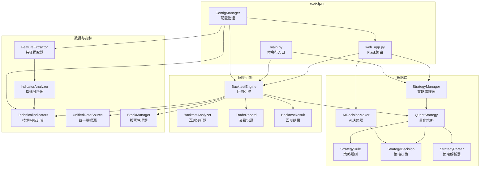
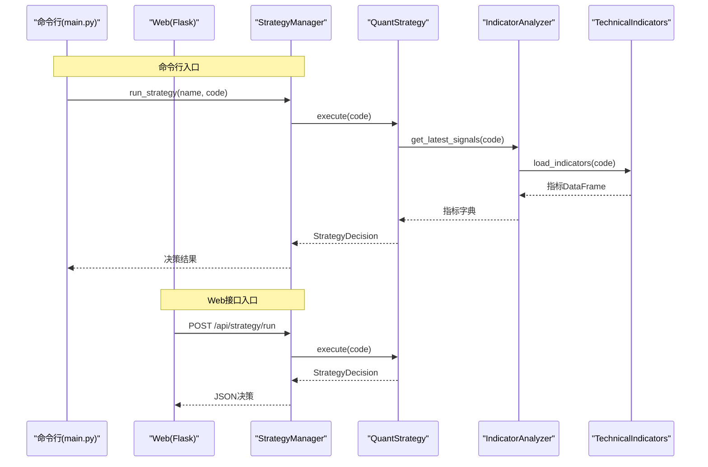
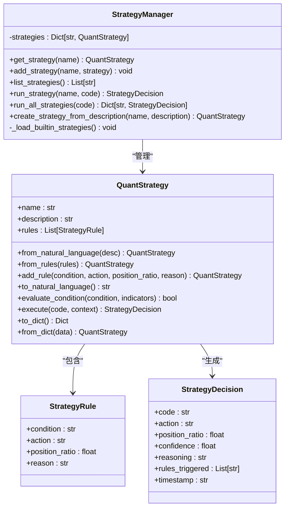
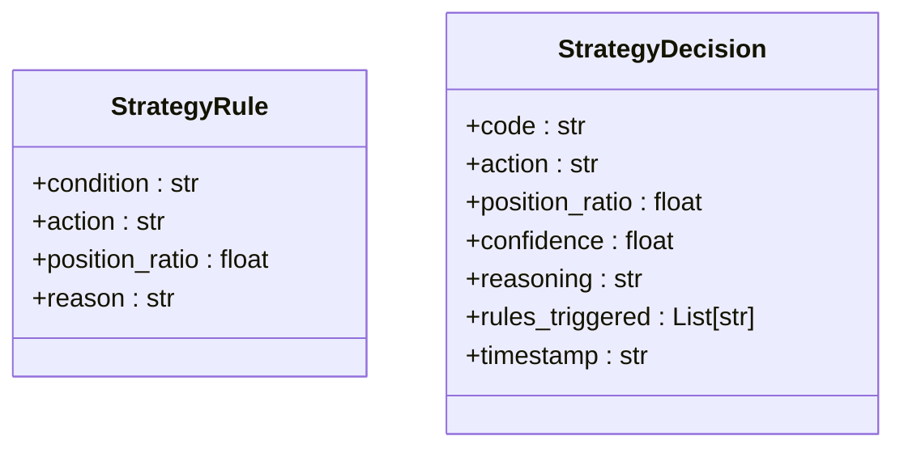
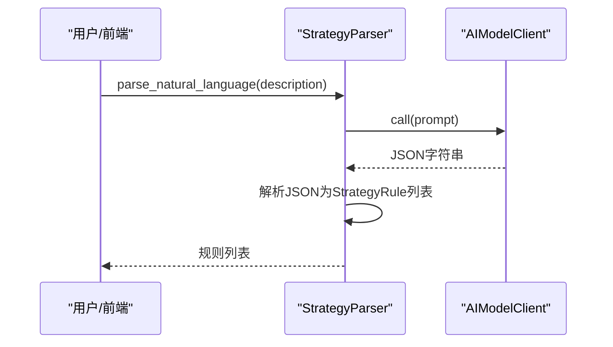
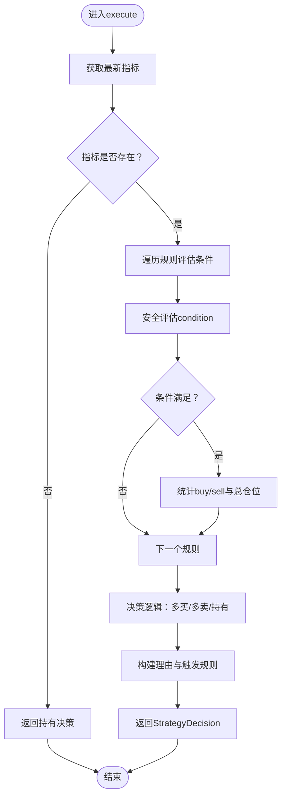
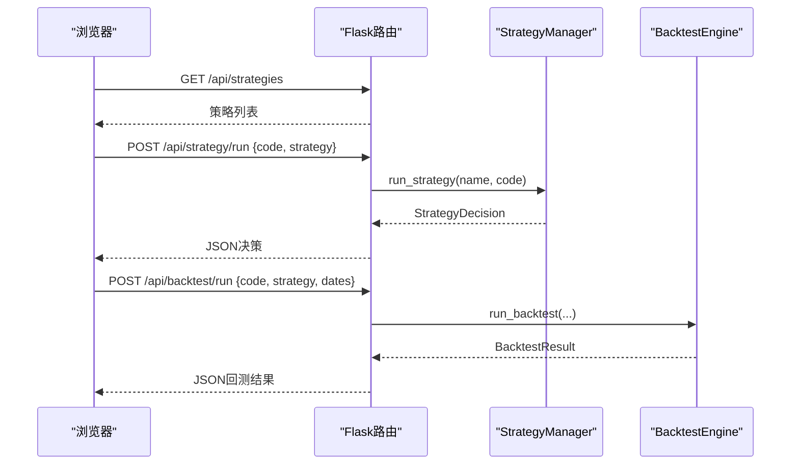
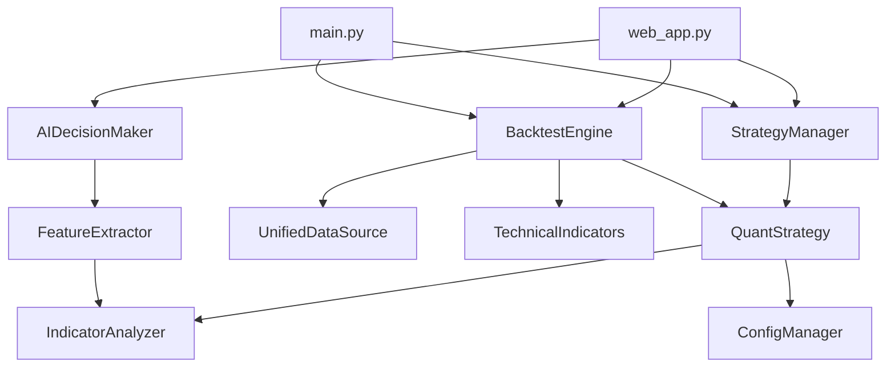

# 策略管理

<cite>
**本文引用的文件**
- [quant_system/strategy.py](file://quant_system/strategy.py)
- [quant_system/backtest.py](file://quant_system/backtest.py)
- [quant_system/web_app.py](file://quant_system/web_app.py)
- [quant_system/config_manager.py](file://quant_system/config_manager.py)
- [quant_system/indicators.py](file://quant_system/indicators.py)
- [quant_system/feature_extractor.py](file://quant_system/feature_extractor.py)
- [quant_system/data_source.py](file://quant_system/data_source.py)
- [quant_system/stock_manager.py](file://quant_system/stock_manager.py)
- [main.py](file://main.py)
- [config.yaml](file://config.yaml)
- [config/stocks.yaml](file://config/stocks.yaml)
- [quant_system/templates/strategy.html](file://quant_system/templates/strategy.html)
</cite>

## 目录
1. [简介](#简介)
2. [项目结构](#项目结构)
3. [核心组件](#核心组件)
4. [架构总览](#架构总览)
5. [详细组件分析](#详细组件分析)
6. [依赖关系分析](#依赖关系分析)
7. [性能考量](#性能考量)
8. [故障排查指南](#故障排查指南)
9. [结论](#结论)
10. [附录](#附录)

## 简介
本文件面向vibequation量化交易系统的“策略管理”模块，系统性阐述策略管理器(StrategyManager)的设计与实现，覆盖策略注册、加载、执行与管理机制；内置策略（RSI策略、MACD策略、均线策略、综合策略）的逻辑与参数；策略规则数据结构(StrategyRule)与决策结果(StrategyDecision)的设计；策略创建、修改、删除的完整流程（含自然语言解析器StrategyParser）；策略执行流程、条件评估机制与多策略并行运行的实现细节。文档同时提供从命令行与Web界面两种入口的使用说明与最佳实践。

## 项目结构
策略管理模块位于quant_system子包内，围绕策略层、回测引擎、Web接口与配置管理协同工作：
- 策略层：策略规则、策略执行、策略管理器、AI决策器
- 回测引擎：历史数据回测、多策略对比与报告
- Web接口：策略查询、运行、回测、图表展示
- 配置管理：全局配置、回测参数、AI模型参数
- 技术指标与特征：指标计算、信号解读、特征提取
- 数据源与股票管理：统一数据接口、股票代码映射

**图表来源**
- [quant_system/strategy.py:318-460](file://quant_system/strategy.py#L318-L460)
- [quant_system/backtest.py:66-374](file://quant_system/backtest.py#L66-L374)
- [quant_system/web_app.py:169-266](file://quant_system/web_app.py#L169-L266)
- [quant_system/config_manager.py:141-147](file://quant_system/config_manager.py#L141-L147)
- [quant_system/indicators.py:21-328](file://quant_system/indicators.py#L21-L328)
- [quant_system/feature_extractor.py:99-321](file://quant_system/feature_extractor.py#L99-L321)
- [quant_system/data_source.py:300-423](file://quant_system/data_source.py#L300-L423)
- [quant_system/stock_manager.py:62-277](file://quant_system/stock_manager.py#L62-L277)
- [main.py:100-174](file://main.py#L100-L174)

**章节来源**
- [quant_system/strategy.py:1-556](file://quant_system/strategy.py#L1-L556)
- [quant_system/backtest.py:1-456](file://quant_system/backtest.py#L1-L456)
- [quant_system/web_app.py:1-598](file://quant_system/web_app.py#L1-L598)
- [quant_system/config_manager.py:1-178](file://quant_system/config_manager.py#L1-L178)
- [quant_system/indicators.py:1-500](file://quant_system/indicators.py#L1-L500)
- [quant_system/feature_extractor.py:1-405](file://quant_system/feature_extractor.py#L1-L405)
- [quant_system/data_source.py:1-423](file://quant_system/data_source.py#L1-L423)
- [quant_system/stock_manager.py:1-278](file://quant_system/stock_manager.py#L1-L278)
- [main.py:1-365](file://main.py#L1-L365)

## 核心组件
- 策略规则(StrategyRule)：包含条件表达式、动作类型、建议仓位比例与规则说明，作为策略的原子单元。
- 策略决策(StrategyDecision)：封装最终决策，包含操作类型、建议仓位、置信度、触发规则列表、决策理由与时间戳。
- 量化策略(QuantStrategy)：策略容器，支持从自然语言创建、从规则创建、添加规则、条件评估与执行。
- 策略解析器(StrategyParser)：将自然语言描述转换为量化规则，或将量化规则翻译为自然语言。
- 策略管理器(StrategyManager)：内置策略加载、策略注册、策略查询、策略执行与批量执行。
- AI决策器(AIDecisionMaker)：结合技术指标与特征，给出AI综合决策。
- 回测引擎(BacktestEngine)：基于历史数据执行策略，计算收益、风险与交易统计。
- Web接口：提供策略查询、运行、回测与图表展示的REST API与前端页面。

**章节来源**
- [quant_system/strategy.py:35-54](file://quant_system/strategy.py#L35-L54)
- [quant_system/strategy.py:150-316](file://quant_system/strategy.py#L150-L316)
- [quant_system/strategy.py:318-460](file://quant_system/strategy.py#L318-L460)
- [quant_system/strategy.py:462-556](file://quant_system/strategy.py#L462-L556)

## 架构总览
策略管理模块采用“策略层-回测层-接口层”的分层设计：
- 策略层负责规则定义、条件评估与决策生成；
- 回测层负责历史数据驱动的策略执行与结果统计；
- 接口层通过Web与命令行提供策略管理与可视化能力。

**图表来源**
- [main.py:100-121](file://main.py#L100-L121)
- [quant_system/web_app.py:187-212](file://quant_system/web_app.py#L187-L212)
- [quant_system/strategy.py:229-299](file://quant_system/strategy.py#L229-L299)
- [quant_system/indicators.py:336-388](file://quant_system/indicators.py#L336-L388)
- [quant_system/indicators.py:188-273](file://quant_system/indicators.py#L188-L273)

## 详细组件分析

### 策略管理器(StrategyManager)
- 职责
  - 内置策略加载：RSI策略、MACD策略、均线策略、综合策略
  - 策略注册：add_strategy(name, strategy)
  - 策略查询：get_strategy(name)、list_strategies()
  - 策略执行：run_strategy(name, code)、run_all_strategies(code)
  - 从自然语言创建策略：create_strategy_from_description(name, description)
- 关键流程
  - 内置策略加载：在构造函数中调用_load_builtin_strategies，按名称注册策略
  - 执行流程：run_strategy -> QuantStrategy.execute -> 条件评估 -> 决策生成
  - 批量执行：遍历所有策略，收集StrategyDecision

**图表来源**
- [quant_system/strategy.py:318-460](file://quant_system/strategy.py#L318-L460)
- [quant_system/strategy.py:150-316](file://quant_system/strategy.py#L150-L316)
- [quant_system/strategy.py:35-54](file://quant_system/strategy.py#L35-L54)
- [quant_system/strategy.py:45-54](file://quant_system/strategy.py#L45-L54)

**章节来源**
- [quant_system/strategy.py:318-460](file://quant_system/strategy.py#L318-L460)

### 内置策略详解
- RSI策略
  - 规则1：rsi_6 < 30，买入，仓位0.5，理由：RSI超卖，买入信号
  - 规则2：rsi_6 > 70，卖出，仓位0.5，理由：RSI超买，卖出信号
- MACD策略
  - 规则1：macd_histogram > 0 且 macd > macd_signal，买入，仓位0.6，理由：MACD金叉，买入信号
  - 规则2：macd_histogram < 0 且 macd < macd_signal，卖出，仓位0.6，理由：MACD死叉，卖出信号
- 均线策略
  - 规则1：overall_score > 20，买入，仓位0.4，理由：综合评分大于20，趋势向上
  - 规则2：overall_score < -20，卖出，仓位0.4，理由：综合评分小于-20，趋势向下
- 综合策略
  - 规则1：rsi_6 < 35 且 macd_histogram > 0，买入，仓位0.5，理由：RSI超卖且MACD向上，强烈买入信号
  - 规则2：rsi_6 > 65 且 macd_histogram < 0，卖出，仓位0.5，理由：RSI超买且MACD向下，强烈卖出信号
  - 规则3：kdj_j < 20 且 rsi_6 < 40，买入，仓位0.3，理由：KDJ和RSI双超卖，买入信号

这些规则均来自策略管理器的内置加载逻辑，条件表达式直接使用指标字典中的键名进行评估。

**章节来源**
- [quant_system/strategy.py:325-396](file://quant_system/strategy.py#L325-L396)

### 策略规则与决策数据结构
- StrategyRule
  - 字段：condition（条件表达式）、action（buy/sell/hold）、position_ratio（0-1）、reason（规则说明）
  - 用途：策略的最小执行单元，支持从自然语言解析或手动构建
- StrategyDecision
  - 字段：code、action、position_ratio、confidence、reasoning、rules_triggered、timestamp
  - 用途：策略执行后的统一输出，便于回测与Web展示

**图表来源**
- [quant_system/strategy.py:35-54](file://quant_system/strategy.py#L35-L54)
- [quant_system/strategy.py:45-54](file://quant_system/strategy.py#L45-L54)

**章节来源**
- [quant_system/strategy.py:35-54](file://quant_system/strategy.py#L35-L54)
- [quant_system/strategy.py:45-54](file://quant_system/strategy.py#L45-L54)

### 策略解析器(StrategyParser)
- 功能
  - 将自然语言策略描述转换为量化规则列表
  - 将量化规则翻译为自然语言描述
- 实现要点
  - 使用AI模型客户端调用外部模型，构造提示词，解析JSON输出
  - 解析失败时回退到默认规则，保证系统可用性
- 应用场景
  - Web界面“使用自然语言创建策略”
  - 策略文档化与可读性增强

**图表来源**
- [quant_system/strategy.py:56-148](file://quant_system/strategy.py#L56-L148)
- [quant_system/feature_extractor.py:24-97](file://quant_system/feature_extractor.py#L24-L97)

**章节来源**
- [quant_system/strategy.py:56-148](file://quant_system/strategy.py#L56-L148)
- [quant_system/feature_extractor.py:24-97](file://quant_system/feature_extractor.py#L24-L97)

### 量化策略(QuantStrategy)执行流程
- 执行步骤
  - 获取最新技术指标：indicator_analyzer.get_latest_signals(code)
  - 遍历规则，逐条评估condition（替换指标键名并eval）
  - 统计触发规则，计算buy_signals、sell_signals与总仓位
  - 决策逻辑：多买>多卖→买入；多卖>多买→卖出；否则持有
  - 构造StrategyDecision，包含置信度、触发规则列表与理由
- 条件评估机制
  - 安全字典：仅暴露允许的指标键与内置函数
  - 字符串替换：将指标名替换为safe_dict["key"]形式
  - 异常捕获：评估失败返回False并记录日志

**图表来源**
- [quant_system/strategy.py:229-299](file://quant_system/strategy.py#L229-L299)
- [quant_system/strategy.py:185-228](file://quant_system/strategy.py#L185-L228)

**章节来源**
- [quant_system/strategy.py:229-299](file://quant_system/strategy.py#L229-L299)
- [quant_system/strategy.py:185-228](file://quant_system/strategy.py#L185-L228)

### 多策略并行运行
- 策略管理器提供run_all_strategies(code)，遍历所有策略并行执行
- 回测引擎提供run_multi_stock_backtest，支持多股票并行回测
- 注意：当前实现为顺序执行，若需并行，可在上层调用处使用并发库

**章节来源**
- [quant_system/strategy.py:426-443](file://quant_system/strategy.py#L426-L443)
- [quant_system/backtest.py:349-373](file://quant_system/backtest.py#L349-L373)

### Web与命令行入口
- Web接口
  - GET /api/strategies：列出策略
  - GET /api/strategy/<name>：获取策略详情
  - POST /api/strategy/run：运行策略并返回决策
  - POST /api/backtest/run：回测并返回结果
  - POST /api/ai/decision：AI综合决策
- 命令行入口
  - run-strategy：运行指定策略
  - backtest：历史回测
  - list-strategies：列出策略

**图表来源**
- [quant_system/web_app.py:169-266](file://quant_system/web_app.py#L169-L266)
- [quant_system/strategy.py:409-424](file://quant_system/strategy.py#L409-L424)
- [quant_system/backtest.py:75-107](file://quant_system/backtest.py#L75-L107)

**章节来源**
- [quant_system/web_app.py:169-266](file://quant_system/web_app.py#L169-L266)
- [main.py:100-174](file://main.py#L100-L174)

## 依赖关系分析
- 策略层依赖
  - 技术指标：indicator_analyzer.get_latest_signals
  - 特征提取：feature_extractor.extract_all_features（AI决策）
  - 配置管理：config.get_backtest_config、config.get_ai_config
- 回测引擎依赖
  - 统一数据源：unified_data.get_historical_data
  - 技术指标：technical_indicators.calculate_all_indicators
  - 策略层：QuantStrategy.execute
- Web接口依赖
  - 策略层：StrategyManager、AIDecisionMaker
  - 回测引擎：BacktestEngine、BacktestAnalyzer
  - 股票管理：stock_manager.get_all_stocks

**图表来源**
- [quant_system/strategy.py:19-22](file://quant_system/strategy.py#L19-L22)
- [quant_system/backtest.py:17-21](file://quant_system/backtest.py#L17-L21)
- [quant_system/web_app.py:17-26](file://quant_system/web_app.py#L17-L26)
- [quant_system/config_manager.py:141-147](file://quant_system/config_manager.py#L141-L147)
- [quant_system/feature_extractor.py:16-19](file://quant_system/feature_extractor.py#L16-L19)

**章节来源**
- [quant_system/strategy.py:19-22](file://quant_system/strategy.py#L19-L22)
- [quant_system/backtest.py:17-21](file://quant_system/backtest.py#L17-L21)
- [quant_system/web_app.py:17-26](file://quant_system/web_app.py#L17-L26)
- [quant_system/config_manager.py:141-147](file://quant_system/config_manager.py#L141-L147)
- [quant_system/feature_extractor.py:16-19](file://quant_system/feature_extractor.py#L16-L19)

## 性能考量
- 条件评估安全性
  - 使用安全字典与字符串替换，避免任意代码执行风险
  - 仅暴露必要指标与内置函数，降低复杂度
- 回测性能优化
  - 回测引擎内部简化评估，避免重复调用策略execute
  - 使用向量化计算与DataFrame操作，减少循环开销
- 并发与扩展
  - 当前为顺序执行，建议在上层调用处引入并发库
  - 对于大量股票/策略组合，建议分批执行与异步队列

[本节为通用指导，无需特定文件来源]

## 故障排查指南
- 策略解析失败
  - 现象：StrategyParser解析自然语言失败，回退默认规则
  - 排查：检查AI模型Token与网络连接；查看日志错误
- 指标为空
  - 现象：QuantStrategy.execute返回持有决策
  - 排查：确认技术指标是否已计算并保存；检查数据源可用性
- 回测异常
  - 现象：回测抛出异常或返回空数据
  - 排查：检查历史数据获取、指标计算与日期范围
- Web接口错误
  - 现象：API返回错误码或空数据
  - 排查：确认策略名称正确、参数齐全、后端日志

**章节来源**
- [quant_system/strategy.py:95-117](file://quant_system/strategy.py#L95-L117)
- [quant_system/strategy.py:240-253](file://quant_system/strategy.py#L240-L253)
- [quant_system/backtest.py:99-107](file://quant_system/backtest.py#L99-L107)
- [quant_system/web_app.py:187-212](file://quant_system/web_app.py#L187-L212)

## 结论
vibequation策略管理模块以清晰的分层设计实现了从规则定义、条件评估到策略执行与回测的完整闭环。内置策略覆盖主流技术面信号，策略解析器支持自然语言到量化规则的转换，Web与命令行双入口提供了便捷的操作体验。通过配置管理与统一数据源，系统具备良好的可扩展性与可维护性。建议后续在大规模并行与模型稳定性方面持续优化。

[本节为总结，无需特定文件来源]

## 附录

### 策略创建、修改与删除流程
- 创建策略
  - 自然语言：StrategyParser.parse_natural_language -> StrategyRule列表 -> QuantStrategy
  - 规则列表：QuantStrategy.from_rules -> StrategyRule列表
- 修改策略
  - 通过QuantStrategy.add_rule动态添加规则
  - 或从字典恢复：QuantStrategy.from_dict
- 删除策略
  - 从策略管理器移除：StrategyManager.strategies.pop(name)

**章节来源**
- [quant_system/strategy.py:159-184](file://quant_system/strategy.py#L159-L184)
- [quant_system/strategy.py:301-316](file://quant_system/strategy.py#L301-L316)
- [quant_system/strategy.py:401-404](file://quant_system/strategy.py#L401-L404)

### 配置与参数
- 回测配置：初始资金、手续费率、滑点
- 技术指标配置：RSI周期、MACD参数、均线周期
- AI模型配置：提供商、模型名、最大token数、温度
- Web服务配置：主机、端口、调试模式

**章节来源**
- [config.yaml:63-68](file://config.yaml#L63-L68)
- [config.yaml:40-55](file://config.yaml#L40-L55)
- [config.yaml:56-62](file://config.yaml#L56-L62)
- [config.yaml:76-81](file://config.yaml#L76-L81)
- [quant_system/config_manager.py:141-147](file://quant_system/config_manager.py#L141-L147)

### Web界面策略页
- 功能概览
  - 策略列表、策略详情、运行策略、AI决策、回测图表
- 交互流程
  - 加载策略与股票列表
  - 选择策略与股票，提交运行请求
  - 展示策略决策与AI决策结果

**章节来源**
- [quant_system/templates/strategy.html:1-274](file://quant_system/templates/strategy.html#L1-L274)
- [quant_system/web_app.py:169-266](file://quant_system/web_app.py#L169-L266)