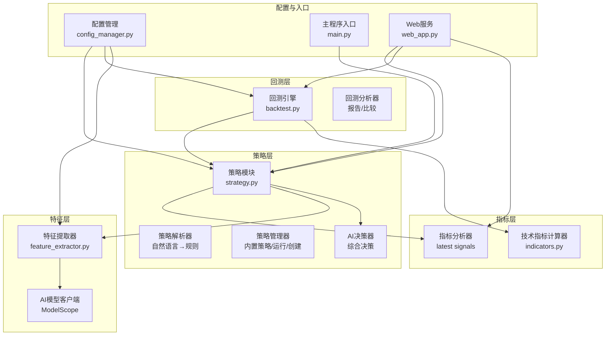
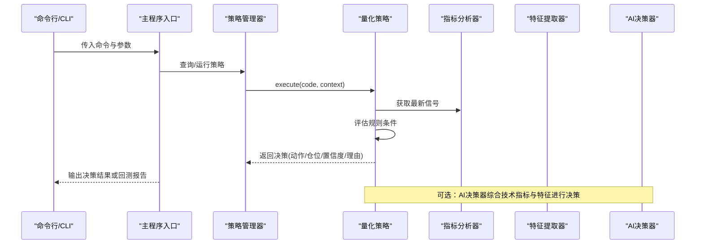
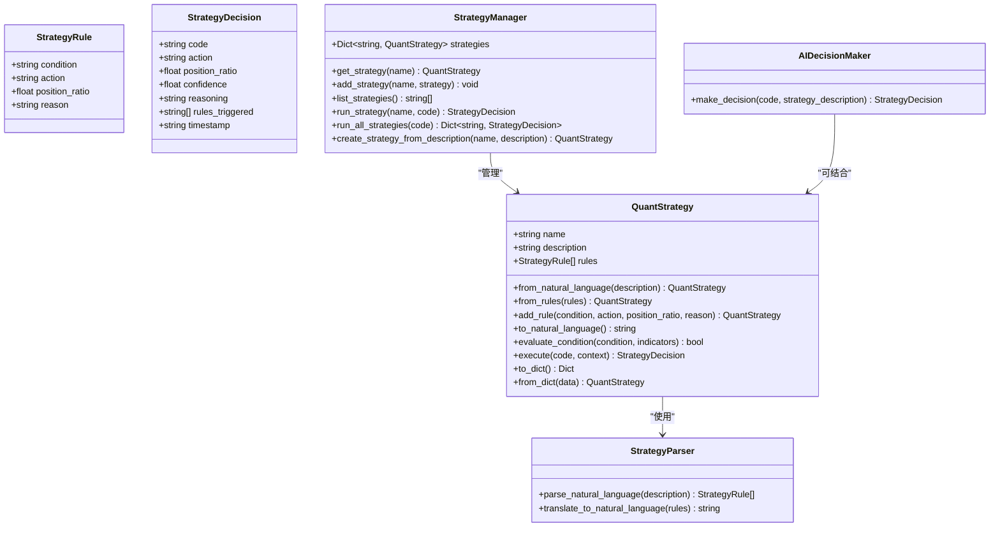
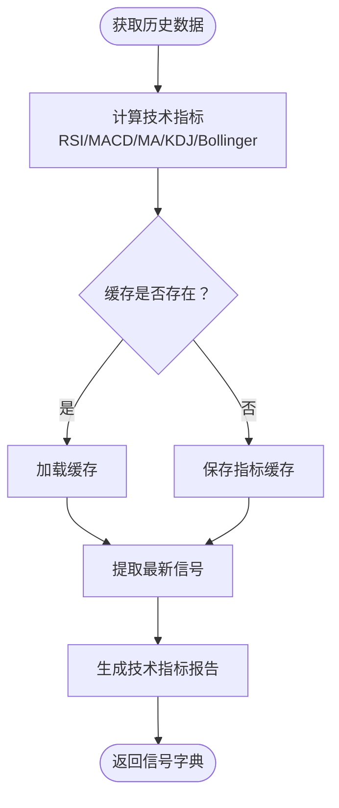
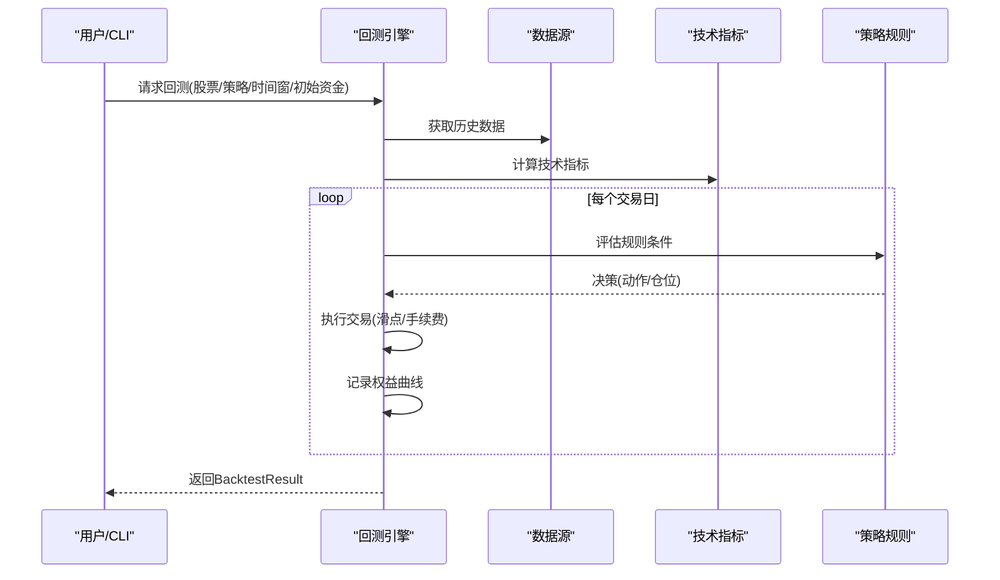
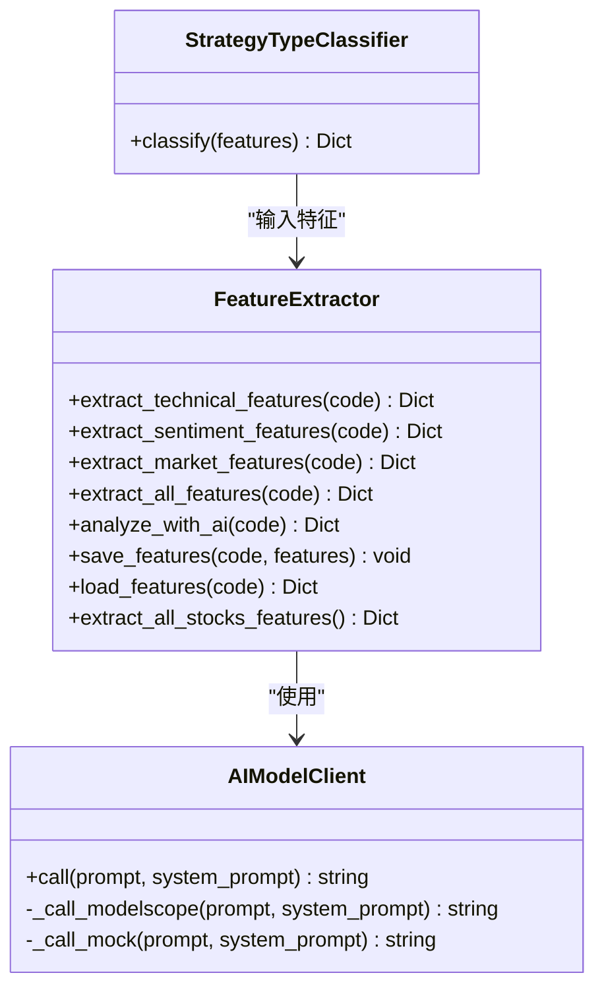
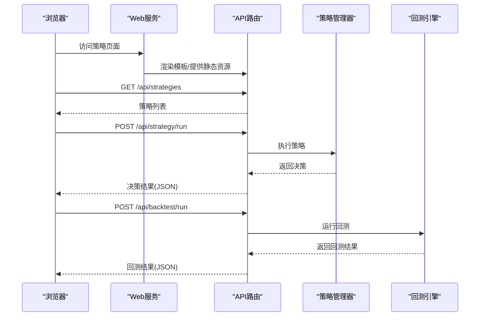
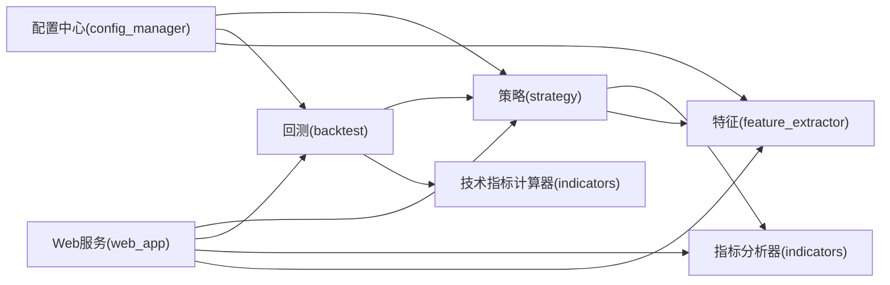

# 策略系统

<cite>
**本文引用的文件**
- [main.py](file://main.py)
- [config.yaml](file://config.yaml)
- [quant_system/strategy.py](file://quant_system/strategy.py)
- [quant_system/backtest.py](file://quant_system/backtest.py)
- [quant_system/indicators.py](file://quant_system/indicators.py)
- [quant_system/config_manager.py](file://quant_system/config_manager.py)
- [quant_system/feature_extractor.py](file://quant_system/feature_extractor.py)
- [quant_system/web_app.py](file://quant_system/web_app.py)
- [quant_system/templates/index.html](file://quant_system/templates/index.html)
- [quant_system/templates/strategy.html](file://quant_system/templates/strategy.html)
- [quant_system/templates/backtest.html](file://quant_system/templates/backtest.html)
</cite>

## 目录
1. [简介](#简介)
2. [项目结构](#项目结构)
3. [核心组件](#核心组件)
4. [架构总览](#架构总览)
5. [详细组件分析](#详细组件分析)
6. [依赖关系分析](#依赖关系分析)
7. [性能考量](#性能考量)
8. [故障排查指南](#故障排查指南)
9. [结论](#结论)
10. [附录](#附录)

## 简介
本文件面向vibequation量化交易系统“策略管理模块”的完整技术文档，聚焦策略架构设计、决策流程与执行机制，解释内置RSI与MACD策略的实现原理、参数配置与适用场景；提供自定义策略开发指南（策略接口规范、信号生成规则、仓位管理逻辑）；详解AI决策系统的集成方式与机器学习模型的应用；覆盖策略参数优化、多策略组合与动态策略切换思路；并给出策略测试、验证与部署的全流程实践建议，确保策略的可靠性与有效性。

## 项目结构
策略系统位于quant_system子包内，围绕策略层、指标层、回测引擎、特征提取与Web界面展开，通过统一配置中心与命令行/Web入口协同工作。

**图表来源**
- [quant_system/strategy.py:1-556](file://quant_system/strategy.py#L1-L556)
- [quant_system/backtest.py:1-456](file://quant_system/backtest.py#L1-L456)
- [quant_system/indicators.py:1-500](file://quant_system/indicators.py#L1-L500)
- [quant_system/config_manager.py:1-178](file://quant_system/config_manager.py#L1-L178)
- [quant_system/feature_extractor.py:1-405](file://quant_system/feature_extractor.py#L1-L405)
- [quant_system/web_app.py:1-466](file://quant_system/web_app.py#L1-L466)
- [main.py:1-365](file://main.py#L1-L365)

**章节来源**
- [main.py:1-365](file://main.py#L1-L365)
- [quant_system/strategy.py:1-556](file://quant_system/strategy.py#L1-L556)
- [quant_system/backtest.py:1-456](file://quant_system/backtest.py#L1-L456)
- [quant_system/indicators.py:1-500](file://quant_system/indicators.py#L1-L500)
- [quant_system/config_manager.py:1-178](file://quant_system/config_manager.py#L1-L178)
- [quant_system/feature_extractor.py:1-405](file://quant_system/feature_extractor.py#L1-L405)
- [quant_system/web_app.py:1-466](file://quant_system/web_app.py#L1-L466)

## 核心组件
- 策略层：提供策略规则定义、条件评估、策略执行与决策输出；内置RSI/MACD/均线/综合策略；支持自然语言到规则的解析与翻译。
- 指标层：计算RSI、MACD、均线、布林带、KDJ等技术指标，并提供最新信号与综合评分。
- 回测层：基于历史数据与策略规则进行回测，计算收益、风险与交易统计指标，并生成可视化图表。
- 特征层：提取技术特征、情感特征与市场特征，结合AI模型进行策略类型分类与推荐。
- 配置层：集中管理各模块配置（技术指标、回测、风控、AI模型、Web服务等）。
- Web层：提供策略管理、回测、风控与特征分析的可视化界面。

**章节来源**
- [quant_system/strategy.py:150-316](file://quant_system/strategy.py#L150-L316)
- [quant_system/indicators.py:21-273](file://quant_system/indicators.py#L21-L273)
- [quant_system/backtest.py:66-282](file://quant_system/backtest.py#L66-L282)
- [quant_system/feature_extractor.py:99-321](file://quant_system/feature_extractor.py#L99-L321)
- [quant_system/config_manager.py:12-177](file://quant_system/config_manager.py#L12-L177)
- [quant_system/web_app.py:29-466](file://quant_system/web_app.py#L29-L466)

## 架构总览
策略系统采用“模块化分层 + 统一配置 + 可视化入口”的架构：
- 策略层负责规则与决策；依赖指标层提供的信号与特征层的AI分析。
- 回测层独立于策略层，通过策略规则直接评估，保证回测性能与一致性。
- Web层提供REST API与前端页面，连接策略、回测、风控与特征分析。
- 配置中心贯穿全系统，提供统一的参数来源与默认值。

**图表来源**
- [main.py:100-174](file://main.py#L100-L174)
- [quant_system/strategy.py:229-299](file://quant_system/strategy.py#L229-L299)
- [quant_system/indicators.py:336-388](file://quant_system/indicators.py#L336-L388)
- [quant_system/feature_extractor.py:213-283](file://quant_system/feature_extractor.py#L213-L283)

## 详细组件分析

### 策略层与策略管理器
- 策略规则与决策数据结构：定义条件、动作（买入/卖出/持有/等待）、仓位比例、置信度与理由。
- 策略解析器：将自然语言策略描述转换为结构化规则，或将规则翻译为自然语言解释。
- 量化策略：支持从规则或自然语言创建；执行时评估规则条件，汇总触发规则，按“买入信号数 > 卖出信号数”决定动作，计算平均仓位与置信度。
- 策略管理器：内置RSI、MACD、均线、综合策略；支持运行单策略、运行全部策略、从描述创建策略。

**图表来源**
- [quant_system/strategy.py:35-316](file://quant_system/strategy.py#L35-L316)
- [quant_system/strategy.py:318-460](file://quant_system/strategy.py#L318-L460)
- [quant_system/strategy.py:462-556](file://quant_system/strategy.py#L462-L556)

**章节来源**
- [quant_system/strategy.py:27-316](file://quant_system/strategy.py#L27-L316)
- [quant_system/strategy.py:318-460](file://quant_system/strategy.py#L318-L460)
- [quant_system/strategy.py:462-556](file://quant_system/strategy.py#L462-L556)

### 技术指标与信号
- 技术指标计算器：计算RSI、MACD、均线、布林带、KDJ、波动率等；支持多周期与多时间框架；可保存/加载指标缓存。
- 指标分析器：提供最新信号字典，包含RSI、MACD、均线趋势、布林带相对位置、KDJ与综合评分；并生成技术指标报告。

**图表来源**
- [quant_system/indicators.py:188-273](file://quant_system/indicators.py#L188-L273)
- [quant_system/indicators.py:336-388](file://quant_system/indicators.py#L336-L388)
- [quant_system/indicators.py:445-494](file://quant_system/indicators.py#L445-L494)

**章节来源**
- [quant_system/indicators.py:21-273](file://quant_system/indicators.py#L21-L273)
- [quant_system/indicators.py:330-494](file://quant_system/indicators.py#L330-L494)

### 回测引擎与分析器
- 回测引擎：基于历史数据与策略规则逐日回测，考虑滑点与手续费，计算收益、风险与交易统计指标，生成权益曲线。
- 回测分析器：生成回测报告与多策略对比表格，便于策略评估与选择。

**图表来源**
- [quant_system/backtest.py:75-282](file://quant_system/backtest.py#L75-L282)
- [quant_system/backtest.py:284-347](file://quant_system/backtest.py#L284-L347)

**章节来源**
- [quant_system/backtest.py:66-282](file://quant_system/backtest.py#L66-L282)
- [quant_system/backtest.py:376-451](file://quant_system/backtest.py#L376-L451)

### 特征提取与AI模型
- 特征提取器：提取技术特征（趋势强度、RSI水平、布林带位置等）、情感特征（平均情感、情感趋势等）与市场特征；支持AI分析与策略类型分类。
- AI模型客户端：封装ModelScope API调用，提供降级mock能力；支持自定义系统提示与参数。

**图表来源**
- [quant_system/feature_extractor.py:24-97](file://quant_system/feature_extractor.py#L24-L97)
- [quant_system/feature_extractor.py:99-321](file://quant_system/feature_extractor.py#L99-L321)
- [quant_system/feature_extractor.py:323-400](file://quant_system/feature_extractor.py#L323-L400)

**章节来源**
- [quant_system/feature_extractor.py:24-97](file://quant_system/feature_extractor.py#L24-L97)
- [quant_system/feature_extractor.py:99-321](file://quant_system/feature_extractor.py#L99-L321)
- [quant_system/feature_extractor.py:323-400](file://quant_system/feature_extractor.py#L323-L400)

### Web可视化与交互
- Web服务：提供股票列表、历史数据、技术指标、策略详情、回测结果与权益曲线的API；配套HTML模板渲染策略管理、回测与风控页面。
- 交互流程：前端通过AJAX调用后端API，后端返回JSON数据并渲染图表或表格。

**图表来源**
- [quant_system/web_app.py:37-466](file://quant_system/web_app.py#L37-L466)
- [quant_system/templates/strategy.html:1-274](file://quant_system/templates/strategy.html#L1-L274)
- [quant_system/templates/backtest.html:1-200](file://quant_system/templates/backtest.html#L1-L200)

**章节来源**
- [quant_system/web_app.py:29-466](file://quant_system/web_app.py#L29-L466)
- [quant_system/templates/index.html:1-92](file://quant_system/templates/index.html#L1-L92)
- [quant_system/templates/strategy.html:1-274](file://quant_system/templates/strategy.html#L1-L274)
- [quant_system/templates/backtest.html:1-200](file://quant_system/templates/backtest.html#L1-L200)

## 依赖关系分析
- 策略层依赖指标分析器与特征提取器；回测引擎依赖策略规则与技术指标；Web层依赖策略、回测、风控与特征模块。
- 配置中心为所有模块提供统一参数来源，避免硬编码；AI模型客户端封装外部API调用，便于替换与降级。

**图表来源**
- [quant_system/config_manager.py:12-177](file://quant_system/config_manager.py#L12-L177)
- [quant_system/strategy.py:19-22](file://quant_system/strategy.py#L19-L22)
- [quant_system/backtest.py:17-21](file://quant_system/backtest.py#L17-L21)
- [quant_system/web_app.py:17-25](file://quant_system/web_app.py#L17-L25)

**章节来源**
- [quant_system/config_manager.py:12-177](file://quant_system/config_manager.py#L12-L177)
- [quant_system/strategy.py:19-22](file://quant_system/strategy.py#L19-L22)
- [quant_system/backtest.py:17-21](file://quant_system/backtest.py#L17-L21)
- [quant_system/web_app.py:17-25](file://quant_system/web_app.py#L17-L25)

## 性能考量
- 回测性能：回测引擎在评估策略时直接在引擎内部评估条件，避免重复调用策略对象，提高回测效率。
- 指标缓存：技术指标计算结果持久化至CSV，减少重复计算；Web端优先加载缓存，必要时再计算并保存。
- AI调用降级：AI模型客户端在API不可用时提供mock响应，保障系统可用性。
- 数据访问：统一的数据目录与配置，避免频繁IO与路径拼接开销。

[本节为通用性能讨论，无需特定文件引用]

## 故障排查指南
- 策略解析失败：检查自然语言描述是否符合JSON格式要求；确认AI模型客户端可用性与Token配置。
- 指标为空：确认历史数据获取成功；检查指标计算流程与缓存路径；必要时重新计算并保存。
- 回测异常：检查策略规则是否可评估；确认日期范围与初始资金参数；核对滑点与手续费配置。
- Web接口报错：检查API路由与参数校验；查看日志定位具体异常；确认静态资源与模板路径。

**章节来源**
- [quant_system/strategy.py:95-117](file://quant_system/strategy.py#L95-L117)
- [quant_system/indicators.py:347-354](file://quant_system/indicators.py#L347-L354)
- [quant_system/backtest.py:99-107](file://quant_system/backtest.py#L99-L107)
- [quant_system/web_app.py:183-208](file://quant_system/web_app.py#L183-L208)

## 结论
vibequation策略系统以模块化分层为核心，策略层提供灵活的规则与自然语言解析能力，指标层与特征层为策略提供高质量输入，回测引擎与Web界面支撑策略验证与可视化。通过统一配置中心与AI模型集成，系统具备良好的扩展性与实用性。建议在生产环境中进一步完善策略参数优化、多策略组合与动态切换机制，并持续优化回测性能与指标缓存策略。

[本节为总结性内容，无需特定文件引用]

## 附录

### 内置策略详解与适用场景
- RSI策略：基于RSI超买超卖阈值判断买卖时机，适用于震荡或弱趋势市场。
- MACD策略：基于MACD柱状图与信号线交叉判断趋势方向，适用于趋势跟踪。
- 均线策略：基于综合评分与均线排列判断趋势强弱，适用于中长期趋势识别。
- 综合策略：多指标联合判断，提升信号稳定性，适用于多种市场环境。

**章节来源**
- [quant_system/strategy.py:325-396](file://quant_system/strategy.py#L325-L396)

### 自定义策略开发指南
- 策略接口规范
  - 规则定义：condition（条件表达式，可使用指标名）、action（buy/sell/hold/wait）、position_ratio（0-1）、reason（理由）。
  - 策略对象：支持从规则列表或自然语言描述创建；提供execute(code, context)执行方法。
- 信号生成规则
  - 条件评估：策略层提供安全的条件评估环境，支持数值与比较运算。
  - 决策逻辑：根据触发规则数量与方向确定动作；平均仓位与置信度按规则比例与数量计算。
- 仓位管理逻辑
  - 买入信号累计正仓位，卖出信号累计负仓位；最终仓位不超过1.0。
  - 置信度与规则触发数量成正比，体现信号强度。

**章节来源**
- [quant_system/strategy.py:35-316](file://quant_system/strategy.py#L35-L316)
- [quant_system/strategy.py:185-228](file://quant_system/strategy.py#L185-L228)
- [quant_system/strategy.py:229-299](file://quant_system/strategy.py#L229-L299)

### AI决策系统集成
- AI模型客户端：封装ModelScope API调用，支持系统提示与参数配置；失败时降级为mock响应。
- 特征分析：提取技术、情感与市场特征，结合AI模型进行策略类型分类与推荐。
- 决策流程：AI决策器综合技术指标与特征，输出动作、仓位、置信度与风险评估。

**章节来源**
- [quant_system/feature_extractor.py:24-97](file://quant_system/feature_extractor.py#L24-L97)
- [quant_system/feature_extractor.py:213-283](file://quant_system/feature_extractor.py#L213-L283)
- [quant_system/strategy.py:462-551](file://quant_system/strategy.py#L462-L551)

### 策略参数优化、组合与动态切换
- 参数优化：通过回测引擎在不同参数空间搜索最优组合；结合多策略对比分析筛选稳健策略。
- 多策略组合：将多个策略的决策进行加权聚合，或基于条件切换；注意控制最大仓位与风险暴露。
- 动态切换：根据市场状态（如趋势强度、波动率）动态选择策略；可结合AI模型的策略类型分类结果。

[本节为方法论与实践建议，无需特定文件引用]

### 策略测试、验证与部署流程
- 测试与验证
  - 历史数据准备：使用统一数据源与指标缓存，确保回测数据一致性。
  - 回测验证：设置合理的时间窗口与初始资金，关注收益、最大回撤、胜率与夏普比率。
  - 特征验证：通过特征提取器与AI模型分析策略适配性，避免过拟合。
- 部署与监控
  - Web服务：通过Flask提供API与可视化界面，便于策略管理与结果展示。
  - 日志与通知：记录关键事件与异常，结合通知模块进行告警。
  - 配置管理：集中管理各模块参数，支持热更新与版本控制。

**章节来源**
- [quant_system/backtest.py:376-451](file://quant_system/backtest.py#L376-L451)
- [quant_system/web_app.py:445-466](file://quant_system/web_app.py#L445-L466)
- [main.py:27-45](file://main.py#L27-L45)