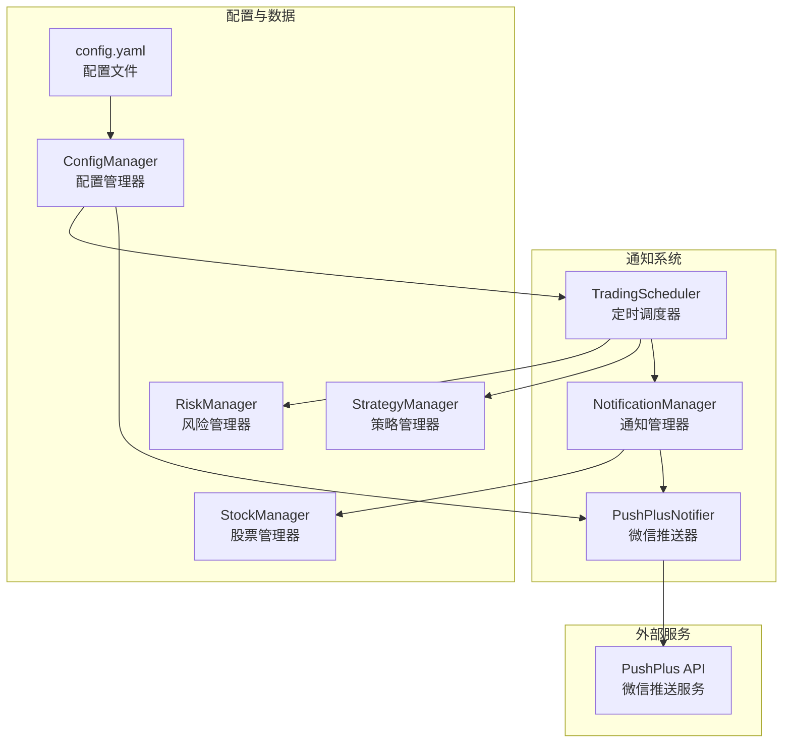
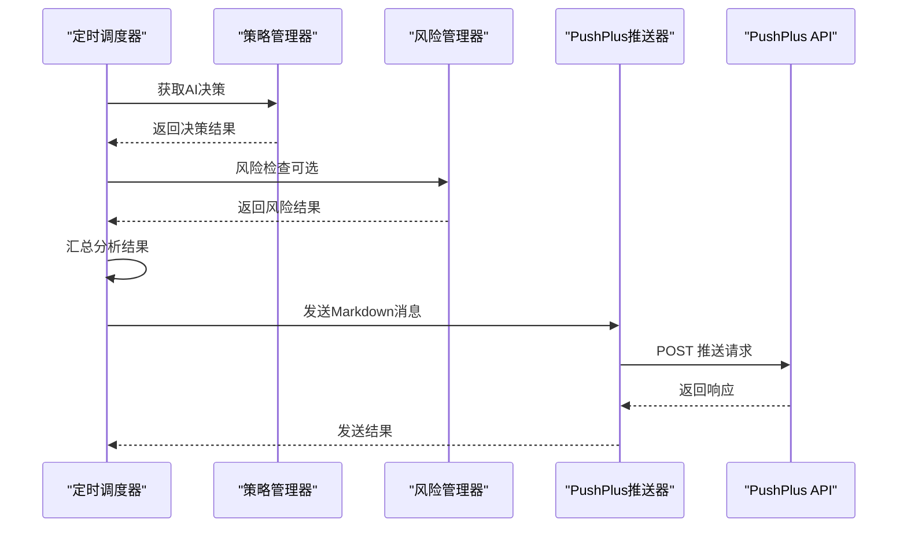
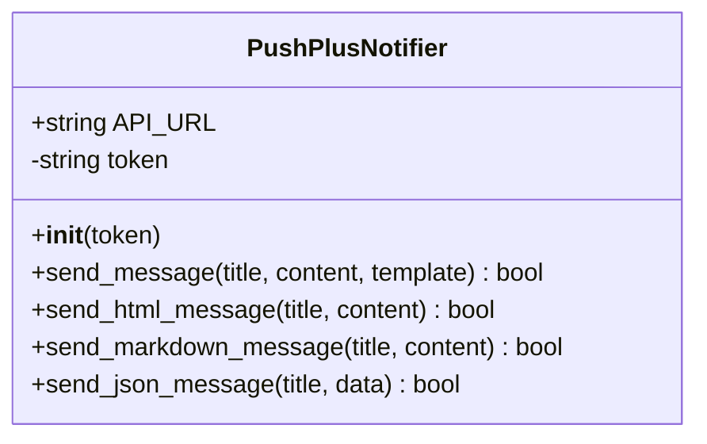
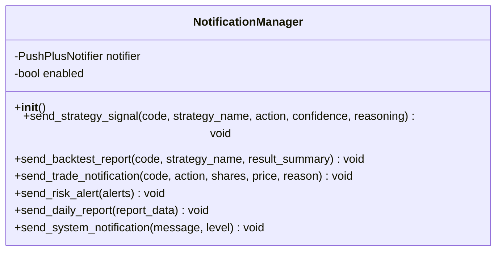
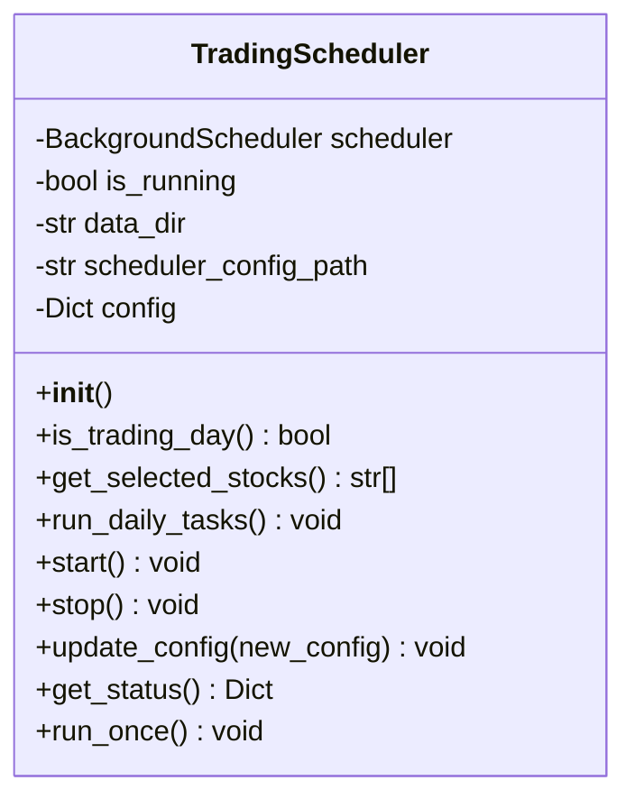
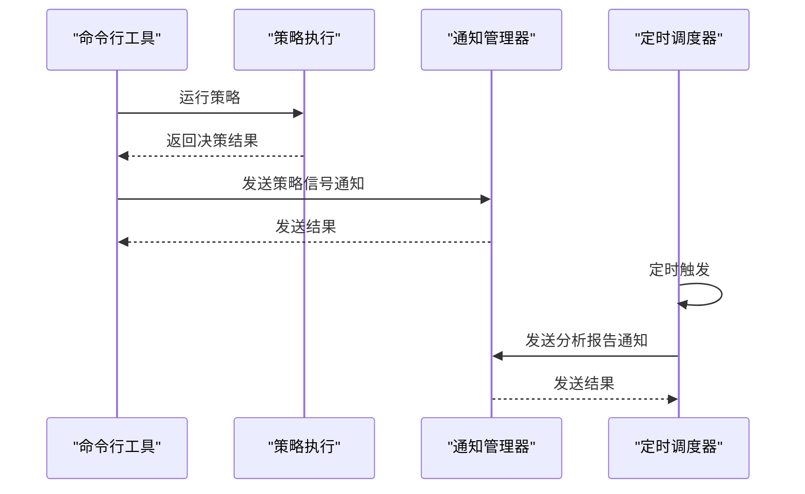
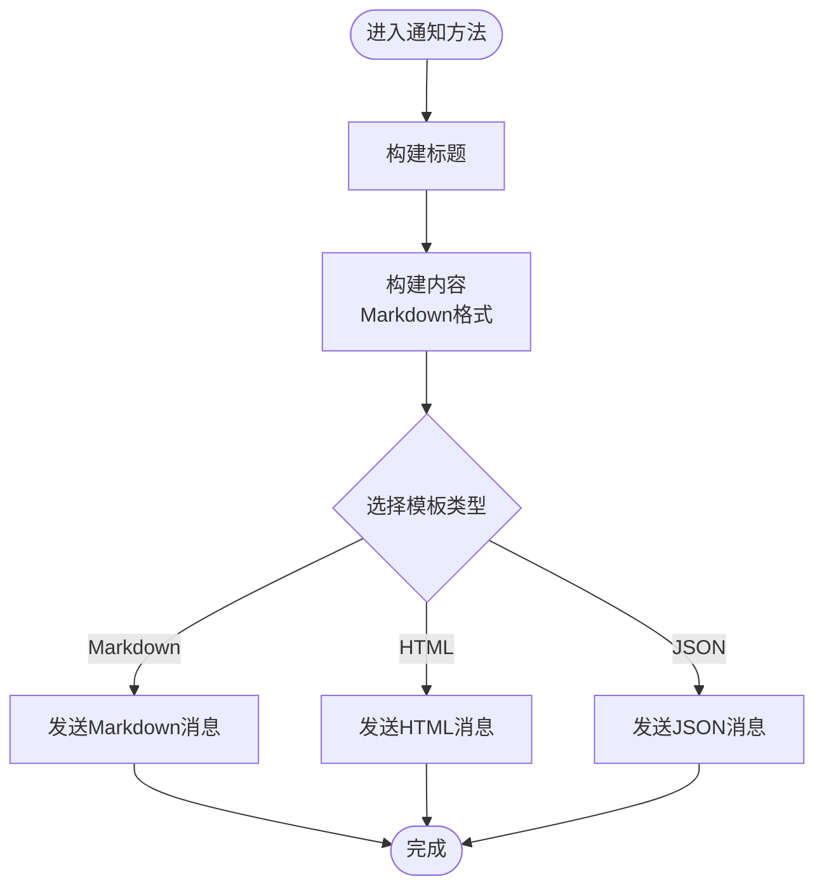
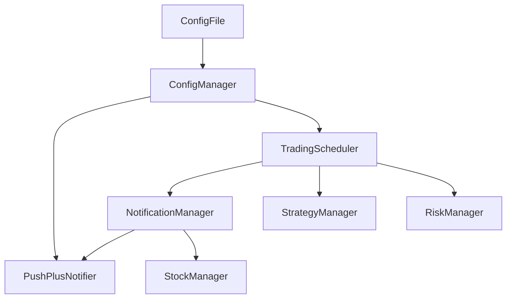

# 通知系统

<cite>
**本文档引用的文件**
- [notification.py](file://quant_system/notification.py)
- [config_manager.py](file://quant_system/config_manager.py)
- [config.yaml](file://config.yaml)
- [main.py](file://main.py)
- [scheduler.py](file://quant_system/scheduler.py)
- [risk_manager.py](file://quant_system/risk_manager.py)
- [strategy.py](file://quant_system/strategy.py)
- [stock_manager.py](file://quant_system/stock_manager.py)
</cite>

## 目录
1. [简介](#简介)
2. [项目结构](#项目结构)
3. [核心组件](#核心组件)
4. [架构概览](#架构概览)
5. [详细组件分析](#详细组件分析)
6. [依赖关系分析](#依赖关系分析)
7. [性能考量](#性能考量)
8. [故障排查指南](#故障排查指南)
9. [结论](#结论)
10. [附录](#附录)

## 简介
本文件全面介绍vibequation量化交易系统的通知模块，涵盖消息推送、邮件通知、微信推送等通知方式，通知触发条件与配置管理机制，通知模板设计与自定义，配置选项（推送渠道、接收人、通知频率），错误处理与重试机制，以及扩展接口与第三方集成指南。通知系统当前主要通过PushPlus实现微信消息推送，并通过调度器在交易时段自动发送分析报告；同时支持策略信号、回测报告、系统通知等场景的通知发送。

## 项目结构
通知系统位于quant_system子模块中，核心文件包括：
- notification.py：通知模块主体，包含PushPlus推送器与通知管理器
- config_manager.py：配置管理器，提供统一配置访问与持久化
- config.yaml：系统配置文件，包含PushPlus Token等关键配置
- scheduler.py：定时任务调度器，负责在交易时段自动执行任务并发送通知
- 其他模块：strategy.py、risk_manager.py、stock_manager.py等为通知提供数据与触发条件

图表来源
- [notification.py:17-82](file://quant_system/notification.py#L17-L82)
- [notification.py:84-296](file://quant_system/notification.py#L84-L296)
- [scheduler.py:34-284](file://quant_system/scheduler.py#L34-L284)
- [config_manager.py:12-177](file://quant_system/config_manager.py#L12-L177)
- [config.yaml:1-88](file://config.yaml#L1-L88)

章节来源
- [notification.py:1-301](file://quant_system/notification.py#L1-L301)
- [config_manager.py:1-178](file://quant_system/config_manager.py#L1-L178)
- [config.yaml:1-88](file://config.yaml#L1-L88)

## 核心组件
- PushPlusNotifier：封装PushPlus微信推送API，支持文本、HTML、Markdown、JSON模板的消息发送，具备基础的错误处理与日志记录。
- NotificationManager：通知管理器，提供策略信号、回测报告、交易通知、风险预警、系统通知等场景的通知发送方法，内部依赖PushPlusNotifier与股票管理器获取股票名称等信息。
- TradingScheduler：定时调度器，按配置在交易日的固定时间自动执行数据更新、新闻采集、技术指标计算、AI分析，并汇总分析结果发送至微信。
- ConfigManager：统一配置管理，提供Token、数据目录、技术指标、回测、风控、AI模型、Web服务、日志等配置项的读取与保存。
- 配置文件config.yaml：定义tokens、数据存储、技术指标、AI模型、回测、风控、Web服务、日志等配置项。

章节来源
- [notification.py:17-82](file://quant_system/notification.py#L17-L82)
- [notification.py:84-296](file://quant_system/notification.py#L84-L296)
- [scheduler.py:34-284](file://quant_system/scheduler.py#L34-L284)
- [config_manager.py:12-177](file://quant_system/config_manager.py#L12-L177)
- [config.yaml:1-88](file://config.yaml#L1-L88)

## 架构概览
通知系统采用“管理器-推送器”分层设计，NotificationManager负责业务场景的通知构建与调度，PushPlusNotifier负责与外部服务交互，ConfigManager提供统一配置访问。定时调度器在交易时段自动触发任务并调用通知管理器发送分析报告。

图表来源
- [scheduler.py:164-204](file://quant_system/scheduler.py#L164-L204)
- [notification.py:27-81](file://quant_system/notification.py#L27-L81)

章节来源
- [scheduler.py:95-204](file://quant_system/scheduler.py#L95-L204)
- [notification.py:27-81](file://quant_system/notification.py#L27-L81)

## 详细组件分析

### PushPlusNotifier组件分析
PushPlusNotifier封装了PushPlus微信推送API，支持多种模板类型的消息发送，并对异常情况进行日志记录与返回值处理。

图表来源
- [notification.py:17-82](file://quant_system/notification.py#L17-L82)

章节来源
- [notification.py:17-82](file://quant_system/notification.py#L17-L82)

### NotificationManager组件分析
NotificationManager提供多种通知场景的方法，包括策略信号、回测报告、交易通知、风险预警、系统通知等。其内部依赖PushPlusNotifier进行实际推送，并通过StockManager获取股票名称等信息。

图表来源
- [notification.py:84-296](file://quant_system/notification.py#L84-L296)

章节来源
- [notification.py:84-296](file://quant_system/notification.py#L84-L296)

### 定时调度器组件分析
TradingScheduler负责在交易日的固定时间自动执行任务，包括数据更新、新闻采集、技术指标计算、AI分析，并汇总分析结果发送通知。支持配置启用/禁用、选择股票范围、任务开关、运行时间等。

图表来源
- [scheduler.py:34-284](file://quant_system/scheduler.py#L34-L284)

章节来源
- [scheduler.py:34-284](file://quant_system/scheduler.py#L34-L284)

### 通知触发流程分析
策略信号通知与回测报告通知在命令行工具中被显式触发，在定时调度器中自动汇总分析结果并发送通知。

图表来源
- [main.py:115-121](file://main.py#L115-L121)
- [main.py:158-174](file://main.py#L158-L174)
- [scheduler.py:164-204](file://quant_system/scheduler.py#L164-L204)

章节来源
- [main.py:115-121](file://main.py#L115-L121)
- [main.py:158-174](file://main.py#L158-L174)
- [scheduler.py:164-204](file://quant_system/scheduler.py#L164-L204)

### 通知模板与自定义
通知模板采用Markdown格式，便于在微信中渲染富文本。各通知方法通过字符串拼接构建标题与内容，支持动态插入股票名称、策略名称、置信度、收益指标等字段。若需自定义模板，可在对应通知方法中调整字符串格式与Markdown结构。

图表来源
- [notification.py:27-81](file://quant_system/notification.py#L27-L81)

章节来源
- [notification.py:27-81](file://quant_system/notification.py#L27-L81)

### 通知触发条件与配置管理
- 策略信号通知：在命令行运行策略时，若启用通知参数，则发送策略信号通知。
- 回测报告通知：在命令行回测时，若启用通知参数，则发送回测报告通知。
- 定时调度通知：在交易日的固定时间，调度器自动汇总分析结果并发送通知。
- 风险预警通知：可通过调用send_risk_alert方法发送风险预警，当前系统未直接暴露该方法的触发入口，但可作为扩展点接入风控模块的预警逻辑。

章节来源
- [main.py:115-121](file://main.py#L115-L121)
- [main.py:158-174](file://main.py#L158-L174)
- [scheduler.py:164-204](file://quant_system/scheduler.py#L164-L204)
- [risk_manager.py:262-272](file://quant_system/risk_manager.py#L262-L272)

## 依赖关系分析
通知系统与其他模块的依赖关系如下：
- NotificationManager依赖PushPlusNotifier与StockManager，用于推送与股票名称获取。
- TradingScheduler依赖NotificationManager、StrategyManager、RiskManager等模块，用于定时任务执行与通知发送。
- ConfigManager与config.yaml提供统一配置访问，包括PushPlus Token、数据目录、技术指标、回测、风控、AI模型、Web服务、日志等。

图表来源
- [notification.py:84-296](file://quant_system/notification.py#L84-L296)
- [scheduler.py:34-284](file://quant_system/scheduler.py#L34-L284)
- [config_manager.py:12-177](file://quant_system/config_manager.py#L12-L177)
- [config.yaml:1-88](file://config.yaml#L1-L88)

章节来源
- [notification.py:84-296](file://quant_system/notification.py#L84-L296)
- [scheduler.py:34-284](file://quant_system/scheduler.py#L34-L284)
- [config_manager.py:12-177](file://quant_system/config_manager.py#L12-L177)
- [config.yaml:1-88](file://config.yaml#L1-L88)

## 性能考量
- 网络请求超时：PushPlusNotifier在发送消息时设置了超时时间，避免阻塞通知流程。
- 异步调度：定时任务使用后台调度器，不影响主线程执行。
- 模板选择：优先使用Markdown模板，减少前端渲染复杂度。
- 配置持久化：调度器配置支持动态更新并持久化，避免频繁重启。

## 故障排查指南
- PushPlus Token未配置：当PushPlus Token为空时，通知管理器会跳过发送并记录警告日志。请在配置文件中正确填写PushPlus Token。
- 网络异常：PushPlusNotifier对网络异常进行捕获并记录错误日志，检查网络连接与API可用性。
- 调度器未运行：确认调度器已启用且配置的时间段内处于交易日，检查调度器状态与下次运行时间。
- 股票名称获取失败：若股票名称获取失败，通知中将使用股票代码替代，不影响通知发送。

章节来源
- [notification.py:22-26](file://quant_system/notification.py#L22-L26)
- [notification.py:66-68](file://quant_system/notification.py#L66-L68)
- [scheduler.py:206-235](file://quant_system/scheduler.py#L206-L235)
- [stock_manager.py:107-128](file://quant_system/stock_manager.py#L107-L128)

## 结论
vibequation通知系统以PushPlus为基础，结合定时调度器实现了策略信号、回测报告、系统通知等场景的通知发送。系统具备清晰的分层架构、完善的配置管理与日志记录，能够满足日常量化交易的通知需求。未来可扩展邮件通知、企业微信等推送渠道，并增加通知频率控制与重试机制以提升可靠性。

## 附录

### 通知系统配置选项
- 推送渠道设置：PushPlus Token（在配置文件中设置）
- 接收人配置：当前系统通过PushPlus Token进行推送，未提供多接收人配置
- 通知频率控制：通过定时调度器配置交易日的固定时间点进行通知

章节来源
- [config.yaml:4-7](file://config.yaml#L4-L7)
- [config_manager.py:101-119](file://quant_system/config_manager.py#L101-L119)
- [scheduler.py:44-77](file://quant_system/scheduler.py#L44-L77)

### 通知模板设计与自定义
- Markdown模板：策略信号、回测报告、系统通知等均采用Markdown模板，便于在微信中渲染
- JSON模板：可用于发送结构化数据
- HTML模板：可用于复杂页面展示

章节来源
- [notification.py:70-81](file://quant_system/notification.py#L70-L81)

### 错误处理与重试机制
- 异常捕获：网络请求异常被捕获并记录日志
- 跳过发送：当配置缺失或无效时，通知管理器会跳过发送并记录警告
- 重试机制：当前未实现自动重试，建议在上层调用处增加重试逻辑

章节来源
- [notification.py:40-68](file://quant_system/notification.py#L40-L68)
- [notification.py:22-26](file://quant_system/notification.py#L22-L26)

### 扩展接口与第三方集成指南
- 新增推送渠道：可参考PushPlusNotifier的实现，新增一个推送器类并实现send_message方法
- 集成邮件通知：可新增EmailNotifier类，实现send_message方法并通过SMTP发送邮件
- 集成企业微信：可新增WeComNotifier类，实现send_message方法并通过企业微信API发送消息
- 通知频率控制：可在调度器中增加通知频率限制与去重逻辑

章节来源
- [notification.py:17-82](file://quant_system/notification.py#L17-L82)
- [scheduler.py:245-254](file://quant_system/scheduler.py#L245-L254)