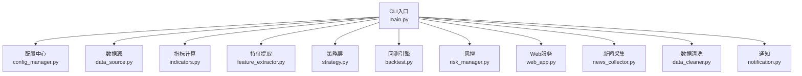
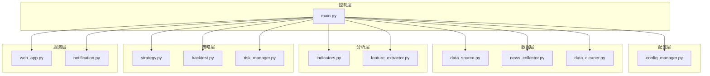
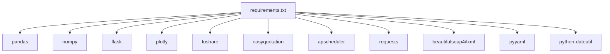

# 性能优化

<cite>
**本文引用的文件**
- [main.py](file://main.py)
- [config.yaml](file://config.yaml)
- [config_manager.py](file://quant_system/config_manager.py)
- [data_source.py](file://quant_system/data_source.py)
- [indicators.py](file://quant_system/indicators.py)
- [feature_extractor.py](file://quant_system/feature_extractor.py)
- [backtest.py](file://quant_system/backtest.py)
- [web_app.py](file://quant_system/web_app.py)
- [news_collector.py](file://quant_system/news_collector.py)
- [data_cleaner.py](file://quant_system/data_cleaner.py)
- [risk_manager.py](file://quant_system/risk_manager.py)
- [notification.py](file://quant_system/notification.py)
- [requirements.txt](file://requirements.txt)
</cite>

## 目录
1. [简介](#简介)
2. [项目结构](#项目结构)
3. [核心组件](#核心组件)
4. [架构总览](#架构总览)
5. [详细组件分析](#详细组件分析)
6. [依赖关系分析](#依赖关系分析)
7. [性能考量](#性能考量)
8. [故障排查指南](#故障排查指南)
9. [结论](#结论)
10. [附录](#附录)

## 简介
本指南面向vibequation量化交易系统，聚焦性能优化实践，覆盖数据层（数据库查询、索引、连接池）、算法层（向量化、并行、缓存）、Web层（静态资源、CDN、压缩）、内存与进程管理、性能测试与成本优化等方面。文档结合代码实现，给出可落地的优化策略与排障建议。

## 项目结构
系统采用模块化分层设计：
- CLI入口负责命令解析与调度
- 配置中心统一管理各模块参数
- 数据层负责历史/实时数据采集与清洗
- 指标层负责技术指标计算与缓存
- 特征层负责AI特征抽取与策略分类
- 策略层负责规则解析与决策
- 回测层负责策略回测与分析
- 风控层负责资金与仓位管理
- Web层提供可视化与API
- 通知层负责消息推送

**图示来源**
- [main.py:261-365](file://main.py#L261-L365)
- [config_manager.py:12-178](file://quant_system/config_manager.py#L12-L178)
- [data_source.py:24-423](file://quant_system/data_source.py#L24-L423)
- [indicators.py:21-500](file://quant_system/indicators.py#L21-L500)
- [feature_extractor.py:99-405](file://quant_system/feature_extractor.py#L99-L405)
- [backtest.py:66-456](file://quant_system/backtest.py#L66-L456)
- [web_app.py:33-873](file://quant_system/web_app.py#L33-L873)
- [news_collector.py:24-465](file://quant_system/news_collector.py#L24-L465)
- [data_cleaner.py:21-444](file://quant_system/data_cleaner.py#L21-L444)
- [risk_manager.py:47-404](file://quant_system/risk_manager.py#L47-L404)
- [notification.py:84-301](file://quant_system/notification.py#L84-L301)

**章节来源**
- [main.py:261-365](file://main.py#L261-L365)
- [config_manager.py:12-178](file://quant_system/config_manager.py#L12-L178)

## 核心组件
- 配置中心：集中管理令牌、目录、技术指标、回测、风控、AI模型、Web、日志等配置，提供统一访问与默认值。
- 数据源：封装Tushare与Easyquotation，统一历史/实时数据接口，并实现基础速率限制与本地缓存。
- 指标计算：基于pandas/numpy实现RSI、MACD、均线、布林带、KDJ、波动率等指标，支持按日/周/月多频段计算与缓存。
- 特征提取：整合技术信号与情感分析，调用AI模型生成策略类型与置信度，本地缓存特征结果。
- 回测引擎：遍历历史数据驱动策略执行，计算收益、最大回撤、夏普比率、胜率等指标。
- Web服务：Flask提供REST API与可视化页面，支持图表渲染与系统状态持久化。
- 新闻采集与情感分析：采集新浪新闻并进行本地或云端情感分析，按日聚合情感指标。
- 数据清洗：完整性检查、去重、缺失值填充、异常值检测、OHLC一致性校验。
- 风控：资金与仓位管理、止损止盈检查、组合风险评估。
- 通知：PushPlus消息推送，支持文本、HTML、Markdown、JSON模板。

**章节来源**
- [config_manager.py:12-178](file://quant_system/config_manager.py#L12-L178)
- [data_source.py:24-423](file://quant_system/data_source.py#L24-L423)
- [indicators.py:21-500](file://quant_system/indicators.py#L21-L500)
- [feature_extractor.py:99-405](file://quant_system/feature_extractor.py#L99-L405)
- [backtest.py:66-456](file://quant_system/backtest.py#L66-L456)
- [web_app.py:33-873](file://quant_system/web_app.py#L33-L873)
- [news_collector.py:24-465](file://quant_system/news_collector.py#L24-L465)
- [data_cleaner.py:21-444](file://quant_system/data_cleaner.py#L21-L444)
- [risk_manager.py:47-404](file://quant_system/risk_manager.py#L47-L404)
- [notification.py:84-301](file://quant_system/notification.py#L84-L301)

## 架构总览
系统整体为“命令行驱动 + 模块化服务 + Web可视化”的架构。CLI负责任务编排，各模块通过配置中心解耦，Web层作为前端入口与后端服务交互。

**图示来源**
- [main.py:14-25](file://main.py#L14-L25)
- [config_manager.py:12-178](file://quant_system/config_manager.py#L12-L178)
- [data_source.py:24-423](file://quant_system/data_source.py#L24-L423)
- [indicators.py:21-500](file://quant_system/indicators.py#L21-L500)
- [feature_extractor.py:99-405](file://quant_system/feature_extractor.py#L99-L405)
- [backtest.py:66-456](file://quant_system/backtest.py#L66-L456)
- [web_app.py:33-873](file://quant_system/web_app.py#L33-L873)
- [news_collector.py:24-465](file://quant_system/news_collector.py#L24-L465)
- [data_cleaner.py:21-444](file://quant_system/data_cleaner.py#L21-L444)
- [risk_manager.py:47-404](file://quant_system/risk_manager.py#L47-L404)
- [notification.py:84-301](file://quant_system/notification.py#L84-L301)

## 详细组件分析

### 数据源与缓存优化（data_source.py）
- 速率限制：Tushare数据源实现简单速率限制，避免频繁请求导致限流。
- 本地缓存：历史数据与实时数据分别按股票代码命名存储，支持增量合并与去重。
- 统一接口：统一历史/实时数据接口，标准化列名，便于后续指标计算与回测。

优化建议
- 增加指数与个股差异化缓存策略，减少重复IO。
- 对高频访问的指标文件（如日线）启用内存缓存或LRU缓存。
- 在批量更新时增加并发控制与队列，避免瞬时峰值。

**章节来源**
- [data_source.py:43-221](file://quant_system/data_source.py#L43-L221)
- [data_source.py:300-423](file://quant_system/data_source.py#L300-L423)

### 技术指标计算与缓存（indicators.py）
- 指标计算：基于pandas/numpy实现滚动窗口与指数加权，支持多周期与多时间框架。
- 缓存策略：按股票+频率命名文件，首次计算后落盘，后续直接加载。
- 多维信号：综合RSI、MACD、均线、布林带、KDJ等形成整体评分。

优化建议
- 使用向量化运算替代逐行循环，充分利用pandas/numpy的C加速。
- 对常用指标（如MA、RSI）建立内存缓存，避免重复计算。
- 对长序列滚动计算使用高效实现（如numba或pandas内置优化）。

**章节来源**
- [indicators.py:21-328](file://quant_system/indicators.py#L21-L328)
- [indicators.py:330-500](file://quant_system/indicators.py#L330-L500)

### 特征提取与AI调用（feature_extractor.py）
- 多源特征：技术特征、情感特征、市场特征三类特征融合。
- AI调用：ModelScope API优先，失败时降级为本地规则；支持超时与降级策略。
- 策略分类：基于特征打分选择最适合的策略类型。

优化建议
- 对AI调用增加连接池与超时重试，避免阻塞主线程。
- 将特征结果缓存至本地，减少重复调用。
- 对情感分析批量化处理，降低HTTP开销。

**章节来源**
- [feature_extractor.py:24-97](file://quant_system/feature_extractor.py#L24-L97)
- [feature_extractor.py:99-212](file://quant_system/feature_extractor.py#L99-L212)
- [feature_extractor.py:213-321](file://quant_system/feature_extractor.py#L213-L321)
- [feature_extractor.py:323-405](file://quant_system/feature_extractor.py#L323-L405)

### 回测引擎（backtest.py）
- 交易模拟：按日遍历，考虑滑点与手续费，支持整手交易。
- 指标驱动：策略由规则条件驱动，支持多规则聚合与置信度计算。
- 统计指标：计算总收益、年化收益、最大回撤、夏普比率、胜率、盈亏比等。

优化建议
- 使用向量化回测（如使用pandas的向量化条件评估），减少循环。
- 对多股票回测引入并行策略，注意共享状态的线程安全。
- 将回测中间态（如权益曲线）分段落盘，支持断点续跑。

**章节来源**
- [backtest.py:66-283](file://quant_system/backtest.py#L66-L283)
- [backtest.py:284-348](file://quant_system/backtest.py#L284-L348)
- [backtest.py:349-374](file://quant_system/backtest.py#L349-L374)

### Web服务与API（web_app.py）
- 路由设计：提供股票数据、指标、图表、策略、回测、风控、新闻、特征等API。
- 图表渲染：使用Plotly生成K线图、权益曲线等，序列化为JSON返回。
- 状态持久化：系统状态与策略持久化至文件，支持重启恢复。

优化建议
- 对热点API增加缓存（如最近N天K线），减少重复计算。
- 启用Gzip压缩与静态资源缓存，提升页面加载速度。
- 使用异步任务处理耗时操作（如回测），避免阻塞请求线程。

**章节来源**
- [web_app.py:41-167](file://quant_system/web_app.py#L41-L167)
- [web_app.py:169-316](file://quant_system/web_app.py#L169-L316)
- [web_app.py:318-427](file://quant_system/web_app.py#L318-L427)
- [web_app.py:429-540](file://quant_system/web_app.py#L429-L540)
- [web_app.py:542-740](file://quant_system/web_app.py#L542-L740)
- [web_app.py:741-800](file://quant_system/web_app.py#L741-L800)

### 新闻采集与情感分析（news_collector.py）
- 新闻采集：按页抓取新浪新闻，过滤日期范围并去重保存。
- 情感分析：支持云端ModelScope与本地关键词规则，按日聚合情感指标。

优化建议
- 对采集过程增加重试与退避策略，避免网络抖动影响。
- 将情感分析结果按日缓存，减少重复调用。
- 批量处理多股票新闻，提高吞吐。

**章节来源**
- [news_collector.py:43-155](file://quant_system/news_collector.py#L43-L155)
- [news_collector.py:168-186](file://quant_system/news_collector.py#L168-L186)
- [news_collector.py:205-400](file://quant_system/news_collector.py#L205-L400)
- [news_collector.py:402-465](file://quant_system/news_collector.py#L402-L465)

### 数据清洗（data_cleaner.py）
- 完整性检查：缺失列、缺失值、重复日期、日期断层。
- 一致性校验：OHLC价格范围一致性、价格跳空、零成交量。
- 处理手段：去重、排序、填充、异常值替换。

优化建议
- 对大规模数据清洗使用分块处理与并行化。
- 将清洗规则参数化，便于调整阈值与策略。

**章节来源**
- [data_cleaner.py:27-81](file://quant_system/data_cleaner.py#L27-L81)
- [data_cleaner.py:244-286](file://quant_system/data_cleaner.py#L244-L286)
- [data_cleaner.py:287-339](file://quant_system/data_cleaner.py#L287-L339)
- [data_cleaner.py:340-388](file://quant_system/data_cleaner.py#L340-L388)
- [data_cleaner.py:396-444](file://quant_system/data_cleaner.py#L396-L444)

### 风控与资金管理（risk_manager.py）
- 仓位限制：单股与总仓位上限，动态计算可下单数量。
- 止损止盈：基于浮动盈亏触发卖出。
- 组合风险：集中度、风险等级评估。

优化建议
- 将风控检查前置到交易执行前，减少无效下单。
- 对风控状态进行持久化，支持重启后恢复。

**章节来源**
- [risk_manager.py:89-144](file://quant_system/risk_manager.py#L89-L144)
- [risk_manager.py:145-184](file://quant_system/risk_manager.py#L145-L184)
- [risk_manager.py:241-293](file://quant_system/risk_manager.py#L241-L293)
- [risk_manager.py:294-349](file://quant_system/risk_manager.py#L294-L349)

### 通知与消息推送（notification.py）
- PushPlus集成：支持文本、HTML、Markdown、JSON模板。
- 场景化推送：交易提醒、策略信号、风险预警、每日报告、回测报告。

优化建议
- 对推送接口增加幂等与重试机制，避免重复推送。
- 将推送内容结构化，便于前端渲染与归档。

**章节来源**
- [notification.py:17-82](file://quant_system/notification.py#L17-L82)
- [notification.py:84-301](file://quant_system/notification.py#L84-L301)

## 依赖关系分析
系统依赖以pandas、numpy为核心，配合Flask、Plotly、Tushare、EasyQuotation、APScheduler等第三方库。依赖版本在requirements.txt中明确。

**图示来源**
- [requirements.txt:1-33](file://requirements.txt#L1-L33)

**章节来源**
- [requirements.txt:1-33](file://requirements.txt#L1-L33)

## 性能考量

### 数据层优化
- 查询优化
  - 指标与特征文件采用按股票+频率命名，查询时直接定位文件，避免全盘扫描。
  - 历史数据按日期排序，回测阶段可利用索引列进行切片。
- 索引设计
  - 建议在历史数据CSV中以“date”为主键索引，回测时使用布尔索引快速筛选区间。
  - 对高频查询字段（如close、volume）建立二级索引，加速统计计算。
- 连接池配置
  - 若接入数据库，建议使用连接池（如SQLAlchemy连接池）并设置最大连接数与超时。
  - 对外部API（Tushare、ModelScope）增加连接池与超时重试，避免阻塞。

### 算法性能优化
- 向量化计算
  - 指标计算尽量使用pandas/numpy的向量化操作，避免逐行循环。
  - 使用rolling、ewm等内置函数，减少自定义循环。
- 并行处理
  - 多股票回测可按股票分片并行执行，注意共享状态同步。
  - 新闻采集与情感分析可批量处理，减少HTTP请求次数。
- 缓存策略
  - 指标与特征结果本地缓存，命中率高的接口可直接返回缓存。
  - 对热点图表数据（如K线、权益曲线）增加内存缓存与ETag。

### Web应用性能调优
- 静态资源优化
  - 启用Gzip压缩与浏览器缓存，合理设置Cache-Control与ETag。
  - 将CSS/JS打包并启用版本号，避免缓存污染。
- CDN配置
  - 将静态资源托管至CDN，降低边缘延迟。
- 压缩传输
  - 对JSON响应启用gzip压缩，减少带宽占用。
- 异步与限流
  - 对耗时API（如回测）采用异步任务，返回任务ID，轮询结果。
  - 对外部API调用增加限流与熔断，避免雪崩效应。

### 内存使用与进程管理
- 内存优化
  - 使用适当的数据类型（如int32/float32）降低内存占用。
  - 对长序列数据分块处理，及时释放中间变量。
- 垃圾回收
  - 避免在热路径上创建大量临时对象，减少GC压力。
- 进程管理
  - Web服务可使用多进程或多线程（取决于Flask配置），注意共享状态。
  - 对CPU密集型任务（如回测）可拆分为独立进程，避免阻塞Web线程。

### 性能测试与基准测试
- 基准测试
  - 对指标计算、特征提取、回测引擎分别制定基准场景，记录吞吐与延迟。
  - 使用cProfile或py-spy对热点函数进行剖析。
- 压力测试
  - 使用Locust或JMeter对Web API进行压力测试，观察QPS与P95/P99延迟。
  - 对外部API调用增加压测脚本，验证限流与降级策略有效性。

### 成本优化
- 云资源优化
  - 将高频数据与缓存迁移至对象存储（如OSS/COS），降低数据库成本。
  - 对冷数据进行分层存储，热数据驻留高速存储。
- 存储优化
  - 启用数据压缩（如Parquet）与列式存储，降低I/O与存储成本。
- 网络优化
  - 使用CDN与边缘节点，减少跨域与跨境流量。
  - 对外部API调用合并请求，减少连接数与带宽消耗。

## 故障排查指南
- 数据采集失败
  - 检查Tushare Token与网络连通性，确认速率限制是否触发。
  - 查看日志中“获取日线数据失败/获取实时数据失败”等错误。
- 指标计算异常
  - 确认历史数据列名标准化与数值类型转换是否正确。
  - 检查缓存文件是否存在与格式是否一致。
- 回测结果异常
  - 核对交易滑点、手续费配置与整手交易规则。
  - 检查回测区间与数据完整性。
- Web接口慢
  - 检查是否有未命中缓存的热点接口，增加缓存或异步化。
  - 关注外部API调用超时与重试策略。
- 风控误判
  - 检查资金与仓位配置，确认止损止盈阈值设置。
  - 核对历史数据与当前价格是否一致。

**章节来源**
- [data_source.py:133-136](file://quant_system/data_source.py#L133-L136)
- [indicators.py:347-354](file://quant_system/indicators.py#L347-L354)
- [backtest.py:194-204](file://quant_system/backtest.py#L194-L204)
- [web_app.py:74-82](file://quant_system/web_app.py#L74-L82)
- [risk_manager.py:106-144](file://quant_system/risk_manager.py#L106-L144)

## 结论
vibequation系统在模块化设计与配置中心基础上，具备良好的扩展性与可维护性。通过引入向量化计算、并行处理、缓存与异步任务，可在保证准确性的同时显著提升性能。结合CDN、压缩与限流策略，可进一步优化Web端体验与成本。建议持续进行基准测试与压力测试，建立性能监控与告警体系，确保系统在高负载下稳定运行。

## 附录
- 配置项参考
  - tokens：Tushare、PushPlus、ModelScope Token
  - data_storage：数据目录与子目录
  - data_collection：历史/实时/新闻采集参数
  - technical_indicators：RSI/MACD/MA等指标配置
  - ai_models：AI模型提供商与参数
  - backtest：初始资金、手续费、滑点
  - risk_management：仓位与风控阈值
  - web：主机、端口、调试开关
  - logging：日志级别与文件路径

**章节来源**
- [config.yaml:1-88](file://config.yaml#L1-L88)
- [config_manager.py:101-174](file://quant_system/config_manager.py#L101-L174)