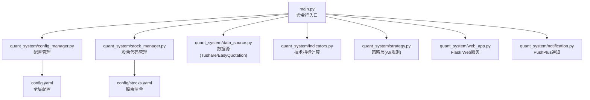
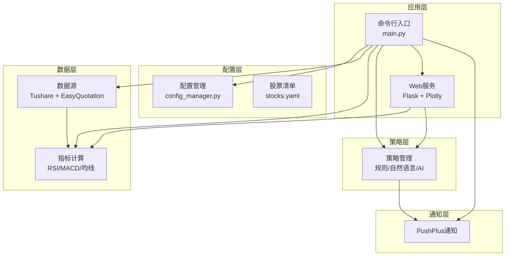
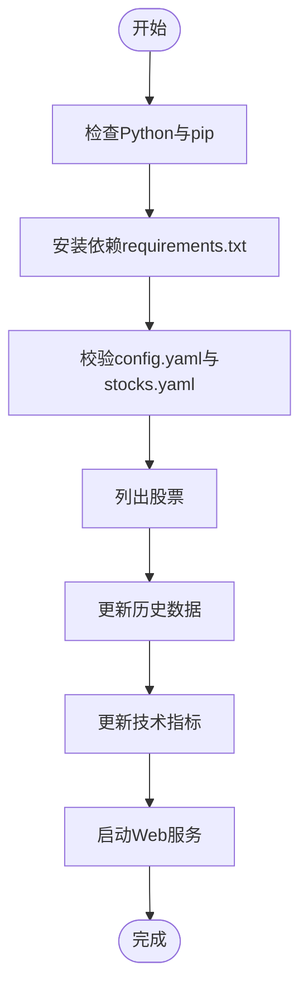
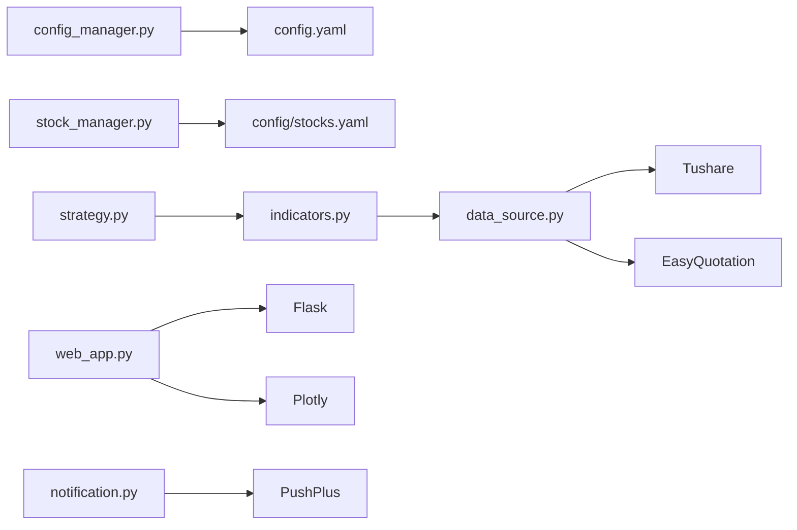

# 环境准备

<cite>
**本文引用的文件**
- [requirements.txt](file://requirements.txt)
- [config.yaml](file://config.yaml)
- [config\stocks.yaml](file://config/stocks.yaml)
- [main.py](file://main.py)
- [quant_system\config_manager.py](file://quant_system/config_manager.py)
- [quant_system\stock_manager.py](file://quant_system/stock_manager.py)
- [quant_system\data_source.py](file://quant_system/data_source.py)
- [quant_system\web_app.py](file://quant_system/web_app.py)
- [quant_system\indicators.py](file://quant_system/indicators.py)
- [quant_system\strategy.py](file://quant_system/strategy.py)
- [quant_system\notification.py](file://quant_system/notification.py)
</cite>

## 目录
1. [简介](#简介)
2. [项目结构](#项目结构)
3. [核心组件](#核心组件)
4. [架构总览](#架构总览)
5. [详细组件分析](#详细组件分析)
6. [依赖关系分析](#依赖关系分析)
7. [性能考虑](#性能考虑)
8. [故障排查指南](#故障排查指南)
9. [结论](#结论)
10. [附录](#附录)

## 简介
本指南面向 v1.0.0 的 vibequation 量化交易系统，提供从零开始的环境准备与验证流程，涵盖 Python 环境要求、虚拟环境搭建、依赖安装、配置文件修改、API 密钥设置、跨平台差异与注意事项，以及环境验证脚本与常见问题解决方案。目标是帮助用户在 Windows、Linux、macOS 上快速、稳定地部署系统。

## 项目结构
项目采用模块化分层设计，核心模块包括配置管理、股票代码管理、数据源、指标计算、策略层、Web 可视化、通知等。下图展示了关键模块与文件的关系：

**图示来源**
- [main.py](file://main.py)
- [quant_system/config_manager.py](file://quant_system/config_manager.py)
- [quant_system/stock_manager.py](file://quant_system/stock_manager.py)
- [quant_system/data_source.py](file://quant_system/data_source.py)
- [quant_system/indicators.py](file://quant_system/indicators.py)
- [quant_system/strategy.py](file://quant_system/strategy.py)
- [quant_system/web_app.py](file://quant_system/web_app.py)
- [quant_system/notification.py](file://quant_system/notification.py)
- [config.yaml](file://config.yaml)
- [config\stocks.yaml](file://config/stocks.yaml)

**章节来源**
- [main.py](file://main.py)
- [quant_system\config_manager.py](file://quant_system/config_manager.py)
- [quant_system\stock_manager.py](file://quant_system/stock_manager.py)
- [quant_system\data_source.py](file://quant_system/data_source.py)
- [quant_system\indicators.py](file://quant_system/indicators.py)
- [quant_system\strategy.py](file://quant_system/strategy.py)
- [quant_system\web_app.py](file://quant_system/web_app.py)
- [quant_system\notification.py](file://quant_system/notification.py)
- [config.yaml](file://config.yaml)
- [config\stocks.yaml](file://config/stocks.yaml)

## 核心组件
- Python 环境：3.8+（推荐 3.10+）
- 依赖管理：pip
- 虚拟环境：venv（推荐）或 conda
- 依赖清单：requirements.txt
- 配置文件：config.yaml、config/stocks.yaml
- Web 服务：Flask + Plotly
- 数据源：Tushare（Pro）+ EasyQuotation
- 可选：PushPlus 微信推送

**章节来源**
- [requirements.txt](file://requirements.txt)
- [config.yaml](file://config.yaml)
- [config\stocks.yaml](file://config/stocks.yaml)

## 架构总览
系统通过命令行入口 main.py 调用各模块，配置管理器集中读取 config.yaml 与 config/stocks.yaml；数据源模块对接 Tushare 与 EasyQuotation；指标模块计算 RSI/MACD/均线等；策略模块结合指标与特征进行决策；Web 层提供可视化与 API；通知模块负责消息推送。

**图示来源**
- [main.py](file://main.py)
- [quant_system\web_app.py](file://quant_system/web_app.py)
- [quant_system\config_manager.py](file://quant_system/config_manager.py)
- [quant_system\stock_manager.py](file://quant_system/stock_manager.py)
- [quant_system\data_source.py](file://quant_system/data_source.py)
- [quant_system\indicators.py](file://quant_system/indicators.py)
- [quant_system\strategy.py](file://quant_system/strategy.py)
- [quant_system\notification.py](file://quant_system/notification.py)
- [config.yaml](file://config.yaml)
- [config\stocks.yaml](file://config/stocks.yaml)

## 详细组件分析

### Python 环境与虚拟环境
- Python 版本：3.8+（建议 3.10+），确保支持 f-string、类型注解与 asyncio
- 推荐使用 venv 创建隔离环境，避免系统级包冲突
- Windows/Linux/macOS 均适用，注意路径分隔符与权限

安装与激活步骤（示例）
- 创建虚拟环境：python -m venv .venv
- 激活虚拟环境：
  - Windows: .venv\Scripts\activate
  - Linux/macOS: source .venv/bin/activate
- 升级 pip：python -m pip install --upgrade pip

**章节来源**
- [main.py](file://main.py)

### 依赖包安装与版本要求
- 数据处理：pandas>=1.5.0、numpy>=1.23.0
- 数据源：tushare>=1.2.89、easyquotation>=0.7.5
- Web 框架：flask>=2.3.0
- 可视化：plotly>=5.15.0
- HTTP 请求：requests>=2.31.0
- HTML 解析：beautifulsoup4>=4.12.0、lxml>=4.9.0
- 配置解析：pyyaml>=6.0
- 工具：python-dateutil>=2.8.0
- 定时任务：apscheduler>=3.10.0、pytz>=2023.0

安装命令
- pip install -r requirements.txt

版本兼容性要点
- pandas 与 numpy 的较新版本通常与 Tushare 更兼容，建议优先满足最低版本
- Flask 与 Plotly 的版本需满足 Web 层渲染与交互需求
- 若网络受限，可使用国内镜像源加速安装

**章节来源**
- [requirements.txt](file://requirements.txt)
- [quant_system\web_app.py](file://quant_system/web_app.py)
- [quant_system\data_source.py](file://quant_system/data_source.py)

### 配置文件与 API 密钥设置
- 全局配置：config.yaml
  - tokens：包含 tushare_token、pushplus_token、modelscope_token
  - data_storage：数据目录结构（history、realtime、news、indicators、features、backtest）
  - data_collection：历史/实时/新闻采集参数
  - technical_indicators：RSI/MACD/MA 等指标配置
  - ai_models：AI 服务提供商与模型参数
  - backtest：初始资金、手续费、滑点
  - risk_management：风控参数
  - web：Web 服务主机、端口、调试开关
  - logging：日志级别、文件路径、轮转大小与备份数
- 股票清单：config/stocks.yaml
  - 支持个股、板块、大盘指数，包含名称、代码、市场与类型

设置步骤
- 在 config.yaml 中填写有效的 API Token
- 在 config/stocks.yaml 中维护需要跟踪的股票/板块/指数
- 如需 AI 模型支持，确保 ai_models.provider 与 modelscope_token 配置一致

**章节来源**
- [config.yaml](file://config.yaml)
- [config\stocks.yaml](file://config/stocks.yaml)
- [quant_system\config_manager.py](file://quant_system/config_manager.py)
- [quant_system\stock_manager.py](file://quant_system/stock_manager.py)

### 跨平台差异与注意事项
- Windows
  - 路径分隔符使用反斜杠，注意在配置文件中使用正斜杠或双反斜杠
  - 防病毒软件可能拦截网络请求，必要时加入白名单
  - 建议使用 PowerShell 并启用执行策略允许脚本运行
- Linux/macOS
  - 注意文件权限与可执行权限
  - 若使用定时任务（如 cron），确保 PATH 与虚拟环境激活脚本正确
- 通用
  - 确保系统时间准确，Tushare 频率限制与时间戳相关
  - 网络代理仅在必要时开启，避免干扰 API 请求

**章节来源**
- [quant_system\data_source.py](file://quant_system/data_source.py)
- [quant_system\web_app.py](file://quant_system/web_app.py)

### 环境验证脚本与流程
建议按以下顺序验证环境与功能：
- Python 与 pip
  - python --version
  - pip --version
- 依赖安装
  - pip list | grep -E "(pandas|numpy|tushare|easyquotation|flask|plotly|requests|pyyaml)"
- 配置文件
  - 检查 config.yaml 与 config/stocks.yaml 是否存在且可读
- 数据源连通性
  - 运行：python main.py list-stocks
  - 运行：python main.py update-data --code 600519
- 指标计算
  - 运行：python main.py update-indicators --code 600519
- Web 服务
  - 运行：python main.py web
  - 浏览器访问 http://127.0.0.1:8080
- 通知（可选）
  - 在 config.yaml 中配置 pushplus_token 后，运行：python main.py run-strategy -c 600519 -s rsi -n

**图示来源**
- [main.py](file://main.py)
- [requirements.txt](file://requirements.txt)
- [config.yaml](file://config.yaml)
- [config\stocks.yaml](file://config/stocks.yaml)

**章节来源**
- [main.py](file://main.py)
- [requirements.txt](file://requirements.txt)
- [config.yaml](file://config.yaml)
- [config\stocks.yaml](file://config/stocks.yaml)

## 依赖关系分析
系统模块间依赖清晰，遵循“配置中心 + 数据源 + 指标 + 策略 + 可视化 + 通知”的链路。

**图示来源**
- [quant_system\config_manager.py](file://quant_system/config_manager.py)
- [quant_system\stock_manager.py](file://quant_system/stock_manager.py)
- [quant_system\data_source.py](file://quant_system/data_source.py)
- [quant_system\indicators.py](file://quant_system/indicators.py)
- [quant_system\strategy.py](file://quant_system/strategy.py)
- [quant_system\web_app.py](file://quant_system/web_app.py)
- [quant_system\notification.py](file://quant_system/notification.py)
- [config.yaml](file://config.yaml)
- [config\stocks.yaml](file://config/stocks.yaml)

**章节来源**
- [quant_system\config_manager.py](file://quant_system/config_manager.py)
- [quant_system\stock_manager.py](file://quant_system/stock_manager.py)
- [quant_system\data_source.py](file://quant_system/data_source.py)
- [quant_system\indicators.py](file://quant_system/indicators.py)
- [quant_system\strategy.py](file://quant_system/strategy.py)
- [quant_system\web_app.py](file://quant_system/web_app.py)
- [quant_system\notification.py](file://quant_system/notification.py)

## 性能考虑
- 数据采集限流：Tushare Pro 默认有调用频率限制，代码中已内置简单限流逻辑，建议在高并发场景下增加重试与退避策略
- 指标计算：批量计算时尽量使用向量化操作（pandas/numpy），避免逐行循环
- Web 渲染：Plotly 图表在大数据量时建议分页或降采样，减少前端渲染压力
- 文件 I/O：定期清理过期缓存文件，避免磁盘占用过高

[本节为通用指导，无需特定文件引用]

## 故障排查指南
- 依赖安装失败
  - 使用国内镜像源：pip install -r requirements.txt -i https://pypi.tuna.tsinghua.edu.cn/simple/
  - 升级 pip：python -m pip install --upgrade pip
- Tushare Token 无效
  - 登录 Tushare Pro 控制台获取有效 token，写入 config.yaml 的 tokens.tushare_token
  - 确认网络可访问 tushare API
- EasyQuotation 无法获取实时数据
  - 检查网络与代理设置
  - 确认股票代码格式与市场前缀匹配
- Web 服务端口占用
  - 修改 config.yaml 中 web.port 或释放占用端口
- PushPlus 通知失败
  - 确认 pushplus_token 配置正确，网络可达
- 日志文件无法写入
  - 检查 logs 目录权限与磁盘空间

**章节来源**
- [config.yaml](file://config.yaml)
- [quant_system\data_source.py](file://quant_system/data_source.py)
- [quant_system\web_app.py](file://quant_system/web_app.py)
- [quant_system\notification.py](file://quant_system/notification.py)

## 结论
按照本指南完成 Python 环境准备、虚拟环境搭建、依赖安装与配置文件修改后，即可顺利运行 vibequation 量化交易系统。建议先以最小化流程（列出股票 → 更新历史数据 → 更新指标 → 启动 Web）验证环境，再逐步扩展到策略运行与通知推送。

[本节为总结性内容，无需特定文件引用]

## 附录

### 常用命令速查
- 创建虚拟环境：python -m venv .venv
- 激活虚拟环境：Windows(.venv\Scripts\activate) / Linux/macOS(source .venv/bin/activate)
- 安装依赖：pip install -r requirements.txt
- 运行系统：python main.py
- 列出股票：python main.py list-stocks
- 更新历史数据：python main.py update-data --code 600519
- 更新指标：python main.py update-indicators --code 600519
- 启动 Web：python main.py web
- 运行策略：python main.py run-strategy -c 600519 -s rsi -n
- 回测：python main.py backtest -c 600519 -s rsi --start-date 20230101 --end-date 20240101 -n

**章节来源**
- [main.py](file://main.py)