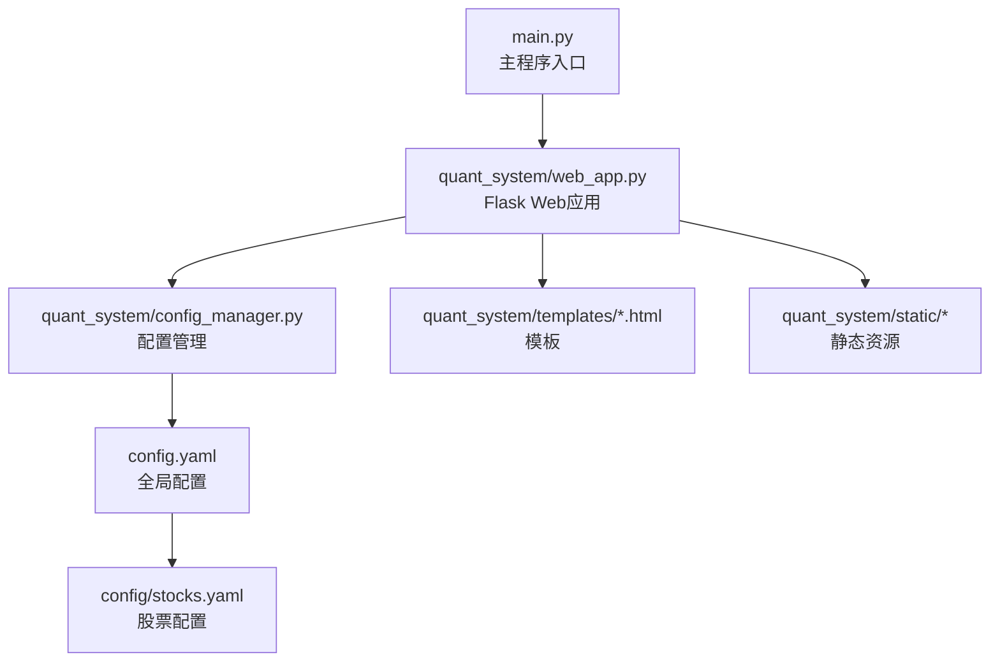
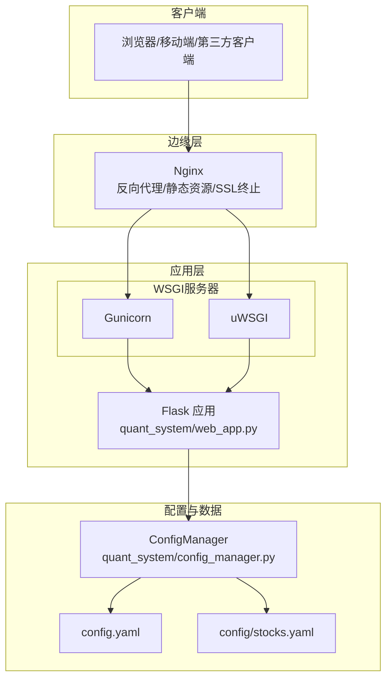
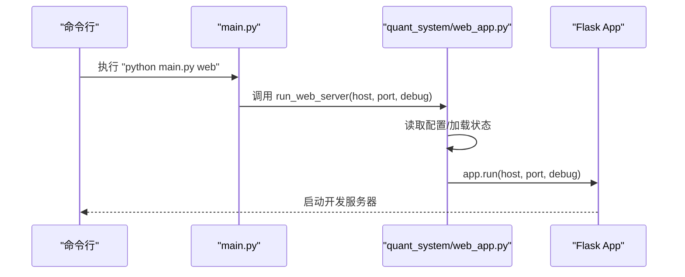
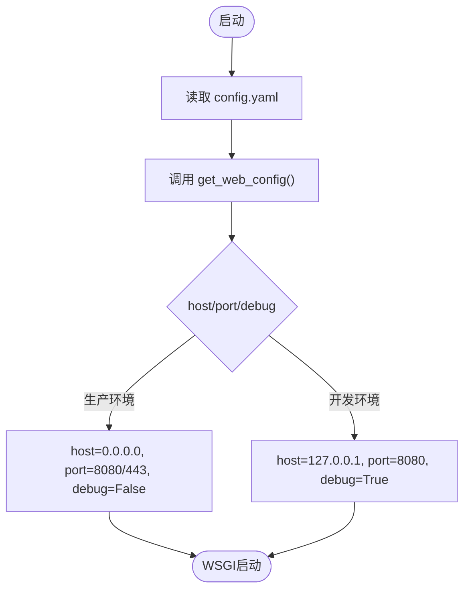
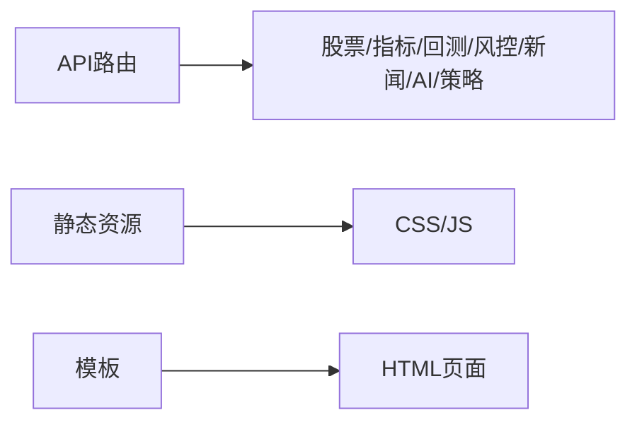
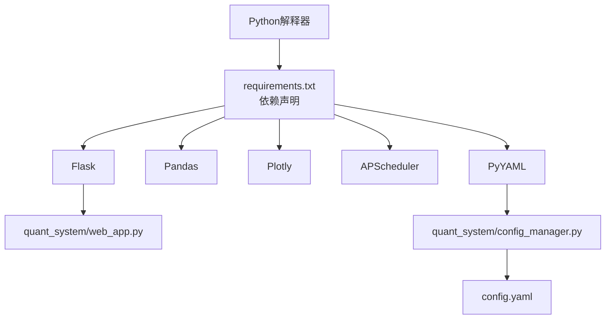

# Web服务器设置

<cite>
**本文引用的文件**
- [main.py](file://main.py)
- [quant_system/web_app.py](file://quant_system/web_app.py)
- [quant_system/config_manager.py](file://quant_system/config_manager.py)
- [config.yaml](file://config.yaml)
- [requirements.txt](file://requirements.txt)
- [quant_system/__init__.py](file://quant_system/__init__.py)
- [config/stocks.yaml](file://config/stocks.yaml)
</cite>

## 目录
1. [简介](#简介)
2. [项目结构](#项目结构)
3. [核心组件](#核心组件)
4. [架构总览](#架构总览)
5. [详细组件分析](#详细组件分析)
6. [依赖分析](#依赖分析)
7. [性能考量](#性能考量)
8. [故障排除指南](#故障排除指南)
9. [结论](#结论)
10. [附录](#附录)

## 简介
本文件面向vibequation项目的Web服务器部署，提供基于Gunicorn与uWSGI两种WSGI服务器的安装、配置与性能调优方案；配套Nginx反向代理的负载均衡、SSL终止与静态资源处理；以及systemd服务文件以实现自动启动、崩溃重启与健康检查；同时包含日志轮转与访问控制建议，以及性能监控与故障排除指南。

## 项目结构
vibequation是一个基于Flask的量化交易系统，Web服务通过Flask应用对外提供REST API与前端页面。项目采用模块化组织，核心入口位于主程序，Web应用位于quant_system子包内，配置集中于config.yaml并通过ConfigManager统一读取。

**图表来源**
- [main.py:217-223](file://main.py#L217-L223)
- [quant_system/web_app.py:34-36](file://quant_system/web_app.py#L34-L36)
- [quant_system/config_manager.py:23-26](file://quant_system/config_manager.py#L23-L26)
- [config.yaml:1-88](file://config.yaml#L1-L88)
- [config/stocks.yaml:1-71](file://config/stocks.yaml#L1-L71)

**章节来源**
- [main.py:217-223](file://main.py#L217-L223)
- [quant_system/web_app.py:34-36](file://quant_system/web_app.py#L34-L36)
- [quant_system/config_manager.py:23-26](file://quant_system/config_manager.py#L23-L26)
- [config.yaml:1-88](file://config.yaml#L1-L88)
- [config/stocks.yaml:1-71](file://config/stocks.yaml#L1-L71)

## 核心组件
- Flask应用与路由：提供REST API与模板渲染，支持股票数据、技术指标、回测、风控、新闻与AI决策等接口。
- 配置管理：集中读取config.yaml，提供Web服务默认参数（host/port/debug）与数据目录、日志等配置。
- 主程序入口：提供“web”命令启动Flask开发服务器，便于本地调试；生产环境应使用WSGI+反向代理。

**章节来源**
- [quant_system/web_app.py:41-824](file://quant_system/web_app.py#L41-L824)
- [quant_system/config_manager.py:167-173](file://quant_system/config_manager.py#L167-L173)
- [main.py:217-223](file://main.py#L217-L223)

## 架构总览
生产环境推荐“Nginx + WSGI服务器（Gunicorn/uWSGI）+ Flask应用”的三层架构。Nginx负责反向代理、静态资源与SSL终止；WSGI服务器承载Flask应用；Flask应用通过ConfigManager读取配置并提供API。

**图表来源**
- [quant_system/web_app.py:34-36](file://quant_system/web_app.py#L34-L36)
- [quant_system/config_manager.py:23-26](file://quant_system/config_manager.py#L23-L26)
- [config.yaml:1-88](file://config.yaml#L1-L88)
- [config/stocks.yaml:1-71](file://config/stocks.yaml#L1-L71)

## 详细组件分析

### Flask应用与WSGI适配
- Flask应用在quant_system/web_app.py中创建，使用template_folder与static_folder分别指向templates与static目录。
- run_web_server函数读取配置并调用app.run启动开发服务器；生产环境应通过WSGI服务器托管。

**图表来源**
- [main.py:217-223](file://main.py#L217-L223)
- [quant_system/web_app.py:1099-1121](file://quant_system/web_app.py#L1099-L1121)

**章节来源**
- [quant_system/web_app.py:34-36](file://quant_system/web_app.py#L34-L36)
- [quant_system/web_app.py:1099-1121](file://quant_system/web_app.py#L1099-L1121)
- [main.py:217-223](file://main.py#L217-L223)

### 配置管理与Web参数
- ConfigManager统一读取config.yaml，提供get_web_config返回host/port/debug等参数。
- Web服务默认host为127.0.0.1，port为8080，debug为False；生产环境建议将host设为0.0.0.0并由Nginx反向代理。

**图表来源**
- [quant_system/config_manager.py:167-173](file://quant_system/config_manager.py#L167-L173)
- [config.yaml:76-81](file://config.yaml#L76-L81)

**章节来源**
- [quant_system/config_manager.py:167-173](file://quant_system/config_manager.py#L167-L173)
- [config.yaml:76-81](file://config.yaml#L76-L81)

### API路由与静态资源
- API路由覆盖股票数据、技术指标、回测、风控、新闻、AI决策、策略管理等。
- 静态资源与模板位于quant_system/static与quant_system/templates，由Flask直接提供。

**图表来源**
- [quant_system/web_app.py:41-824](file://quant_system/web_app.py#L41-L824)
- [quant_system/web_app.py:34-36](file://quant_system/web_app.py#L34-L36)

**章节来源**
- [quant_system/web_app.py:41-824](file://quant_system/web_app.py#L41-L824)
- [quant_system/web_app.py:34-36](file://quant_system/web_app.py#L34-L36)

## 依赖分析
- Python运行时与依赖通过requirements.txt声明，其中包含Flask、Pandas、Plotly、APScheduler等。
- 项目使用PyYAML解析配置文件，ConfigManager负责配置加载与目录初始化。

**图表来源**
- [requirements.txt:1-33](file://requirements.txt#L1-L33)
- [quant_system/config_manager.py:23-26](file://quant_system/config_manager.py#L23-L26)
- [config.yaml:1-88](file://config.yaml#L1-L88)

**章节来源**
- [requirements.txt:1-33](file://requirements.txt#L1-L33)
- [quant_system/config_manager.py:23-26](file://quant_system/config_manager.py#L23-L26)
- [config.yaml:1-88](file://config.yaml#L1-L88)

## 性能考量

### Gunicorn配置与调优
- 绑定地址与端口：WSGI服务器监听127.0.0.1:8000（或容器内部端口），由Nginx反向代理至80/443。
- 进程与线程：根据CPU核数设置worker数量，典型公式为2×核数+1；启用gevent或eventlet可提升异步能力。
- 并发与超时：合理设置worker_class、timeout、keepalive；对长连接与图表生成场景需关注超时。
- 动态扩展：结合Nginx负载均衡与容器编排实现水平扩展。

### uWSGI配置与调优
- 模块与应用：通过module参数指向Flask应用工厂或app对象。
- 进程与线程：设置processes与threads，结合socket与http参数暴露服务。
- 缓存与优化：启用filecloser、reload-mercy等选项提升稳定性；对静态资源交由Nginx处理。

### Nginx反向代理
- 负载均衡：upstream后端可指向多实例WSGI进程组，实现高可用与扩展。
- SSL终止：配置证书与私钥，开启TLS v1.2+；将HTTP重定向至HTTPS。
- 静态资源：静态目录映射至Flask static，设置缓存头与压缩。
- 超时与缓冲：合理设置proxy_connect_timeout、proxy_send_timeout、proxy_read_timeout与client_max_body_size。

### 日志与监控
- 应用日志：Flask应用与WSGI服务器均输出访问与错误日志，建议分离到独立文件。
- Nginx日志：开启access_log与error_log，按天轮转。
- 监控指标：结合系统监控（CPU/内存/IO）与应用指标（QPS/响应时间/P95）进行告警。

## 故障排除指南
- 启动失败
  - 检查端口占用与防火墙策略；确认WSGI服务器绑定地址与Nginx upstream一致。
  - 查看Flask应用日志与WSGI错误日志，定位ImportError或配置加载异常。
- 性能问题
  - 分析慢请求与数据库/网络依赖；调整worker数量与超时参数；对图表生成增加缓存。
- 静态资源404
  - 确认Nginx静态路径映射与Flask static_folder一致；检查权限与缓存头。
- SSL握手失败
  - 校验证书链与加密套件；确保Nginx TLS版本与Ciphers配置兼容客户端。

## 结论
通过Nginx+WSGI（Gunicorn/uWSGI）+Flask的生产化部署，可获得高可用、高性能与易维护的Web服务。结合systemd服务文件、日志轮转与访问控制，可进一步提升系统的稳定性与安全性。建议在上线前完成压测与安全扫描，并建立完善的监控与告警体系。

## 附录

### systemd服务文件（示例）
- 作用：自动启动WSGI进程、崩溃重启、日志输出重定向。
- 建议：将服务命名为vibequation-web，工作目录指向项目根目录，ExecStart使用gunicorn/uwsgi命令，User/Group使用非root用户。

### Nginx配置要点（示例）
- 反向代理：location / 将请求转发至WSGI服务器；静态资源location /static/ 与 /static/css/js/ 直接返回。
- SSL：server_name、ssl_certificate、ssl_certificate_key、ssl_protocols、ssl_ciphers。
- 负载均衡：upstream后端多实例，server权重与健康检查。

### 日志轮转（logrotate示例）
- 轮转周期：daily；保留份数；postrotate重启Nginx与WSGI进程。
- 目标：/var/log/vibequation/*.log。

### 访问控制建议
- IP白名单：仅允许特定网段访问管理接口。
- API限流：基于IP或令牌的速率限制，防止滥用。
- HTTPS：强制全站HTTPS，禁用弱密码套件。