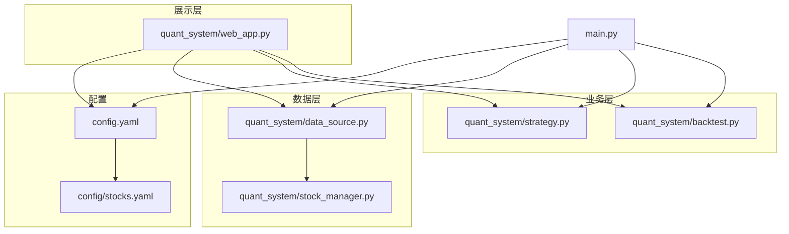
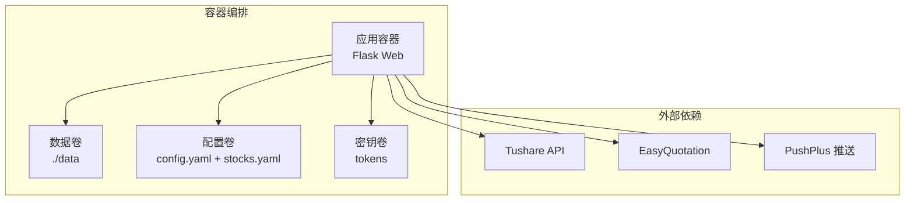
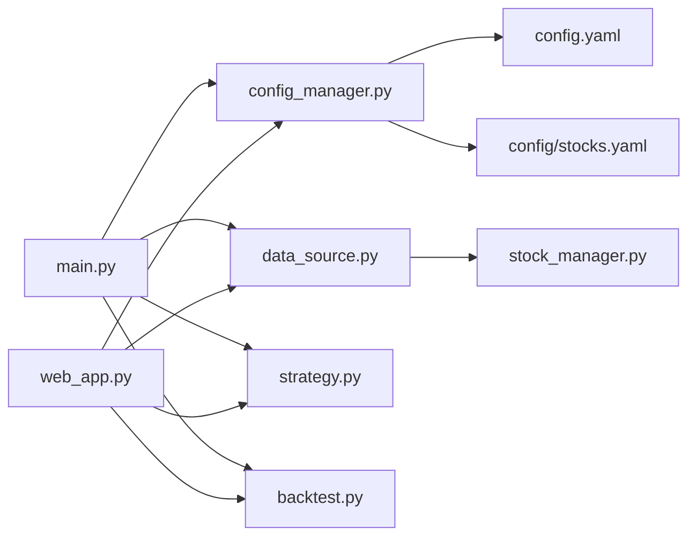

# 容器化部署

<cite>
**本文引用的文件**   
- [main.py](file://main.py)
- [requirements.txt](file://requirements.txt)
- [config.yaml](file://config.yaml)
- [config/stocks.yaml](file://config/stocks.yaml)
- [quant_system/web_app.py](file://quant_system/web_app.py)
- [quant_system/config_manager.py](file://quant_system/config_manager.py)
- [quant_system/data_source.py](file://quant_system/data_source.py)
- [quant_system/stock_manager.py](file://quant_system/stock_manager.py)
- [quant_system/backtest.py](file://quant_system/backtest.py)
- [quant_system/strategy.py](file://quant_system/strategy.py)
</cite>

## 目录
1. [简介](#简介)
2. [项目结构](#项目结构)
3. [核心组件](#核心组件)
4. [架构总览](#架构总览)
5. [详细组件分析](#详细组件分析)
6. [依赖分析](#依赖分析)
7. [性能考虑](#性能考虑)
8. [故障排查指南](#故障排查指南)
9. [结论](#结论)
10. [附录](#附录)

## 简介
本方案面向vibequation量化交易系统，提供从Dockerfile多阶段构建、docker-compose服务编排、Kubernetes资源定义，到容器监控与日志、健康检查以及CI/CD自动化的完整容器化部署蓝图。系统通过统一的配置中心、数据采集与处理、Web可视化界面与回测引擎构成闭环，容器化后可在本地开发测试与生产集群稳定运行。

## 项目结构
vibequation采用“配置驱动 + 模块化功能”的组织方式：
- 配置层：集中于config.yaml与config/stocks.yaml，统一管理API令牌、数据目录、Web服务、技术指标、AI模型、风控等参数
- 数据层：统一数据源适配Tushare与EasyQuotation，提供历史与实时数据
- 业务层：策略、回测、风控、特征提取、新闻采集等模块
- 展示层：基于Flask的Web应用，提供可视化界面与REST API
- 入口：main.py作为CLI入口，支持数据更新、策略运行、回测、Web服务等子命令

**图表来源**
- [main.py:1-365](file://main.py#L1-L365)
- [config.yaml:1-88](file://config.yaml#L1-L88)
- [config/stocks.yaml:1-71](file://config/stocks.yaml#L1-L71)
- [quant_system/web_app.py:1-800](file://quant_system/web_app.py#L1-L800)
- [quant_system/data_source.py:1-423](file://quant_system/data_source.py#L1-L423)
- [quant_system/stock_manager.py:1-200](file://quant_system/stock_manager.py#L1-L200)
- [quant_system/backtest.py:1-200](file://quant_system/backtest.py#L1-L200)
- [quant_system/strategy.py:1-200](file://quant_system/strategy.py#L1-L200)

**章节来源**
- [main.py:1-365](file://main.py#L1-L365)
- [config.yaml:1-88](file://config.yaml#L1-L88)
- [config/stocks.yaml:1-71](file://config/stocks.yaml#L1-L71)

## 核心组件
- 配置管理器：集中读取与校验config.yaml与config/stocks.yaml，确保数据目录存在，提供各模块访问统一配置的接口
- 数据源适配：统一历史与实时数据接口，封装Tushare与EasyQuotation，负责数据缓存与标准化
- Web应用：Flask提供REST API与前端模板渲染，暴露策略、回测、风控、新闻、特征等接口
- CLI入口：main.py提供update-data、update-indicators、collect-news、extract-features、run-strategy、backtest、web等子命令
- 回测引擎：基于历史数据与技术指标执行回测，输出统计指标与权益曲线
- 策略模块：支持自然语言到量化规则的转换与执行

**章节来源**
- [quant_system/config_manager.py:1-178](file://quant_system/config_manager.py#L1-L178)
- [quant_system/data_source.py:1-423](file://quant_system/data_source.py#L1-L423)
- [quant_system/web_app.py:1-800](file://quant_system/web_app.py#L1-L800)
- [main.py:1-365](file://main.py#L1-L365)
- [quant_system/backtest.py:1-200](file://quant_system/backtest.py#L1-L200)
- [quant_system/strategy.py:1-200](file://quant_system/strategy.py#L1-L200)

## 架构总览
容器化后的系统由以下组件构成：
- 应用容器：运行Flask Web服务，监听HTTP端口，提供API与页面
- 数据卷：挂载数据目录，持久化历史/实时/指标/特征/回测等数据
- 网络：容器间通过内部网络通信；对外暴露Web端口
- 配置：通过ConfigMap注入配置文件，Secret注入敏感令牌
- 健康检查：HTTP探针检测Web服务可用性
- 日志：标准输出与文件日志结合，便于容器平台采集

**图表来源**
- [quant_system/web_app.py:1-800](file://quant_system/web_app.py#L1-L800)
- [quant_system/data_source.py:1-423](file://quant_system/data_source.py#L1-L423)
- [quant_system/config_manager.py:1-178](file://quant_system/config_manager.py#L1-L178)
- [config.yaml:1-88](file://config.yaml#L1-L88)
- [config/stocks.yaml:1-71](file://config/stocks.yaml#L1-L71)

## 详细组件分析

### Dockerfile编写指南（多阶段构建与镜像瘦身）
目标：最小化镜像体积、提升构建速度与安全性，同时保证运行时依赖完整。
- 基础镜像选择：使用官方Python运行时镜像作为最终运行镜像，Alpine或Debian slim作为构建阶段基础
- 多阶段构建：
  - 第一阶段：安装构建依赖（编译器、头文件、pip-tools等），安装Python依赖
  - 第二阶段：仅复制必要运行时文件与依赖，剔除构建期工具
- 依赖安装优化：
  - 使用requirements.txt锁定版本，启用pip缓存与离线安装
  - 分离生产与开发依赖，仅在最终镜像包含生产所需包
- 文件与权限：
  - 复制项目源码与配置文件，设置非root用户运行
  - 为数据目录设置写权限，避免容器内权限问题
- 健康检查与入口：
  - 设置HEALTHCHECK探测Web端口
  - CMD或ENTRYPOINT指向main.py的web子命令或直接启动Flask

参考要点（不直接粘贴代码）：
- 使用分层缓存策略，将依赖安装与源码复制分离
- 清理构建缓存与临时文件，减少层数与体积
- 使用只读根文件系统配合必要的可写挂载（日志与数据）

**章节来源**
- [requirements.txt:1-33](file://requirements.txt#L1-L33)
- [config.yaml:1-88](file://config.yaml#L1-L88)
- [config/stocks.yaml:1-71](file://config/stocks.yaml#L1-L71)
- [quant_system/web_app.py:1-800](file://quant_system/web_app.py#L1-L800)
- [main.py:1-365](file://main.py#L1-L365)

### docker-compose.yml配置（服务编排、网络与卷）
- 服务定义：
  - vibequation-web：运行Flask Web服务，映射宿主机端口至容器端口
  - 环境变量：通过环境变量覆盖部分配置（如日志级别、端口），敏感令牌通过Secret注入
- 网络：
  - 自定义桥接网络，便于服务发现与隔离
- 卷挂载：
  - 数据卷：挂载./data至容器内数据目录，实现持久化
  - 配置卷：挂载config.yaml与config/stocks.yaml至容器内配置路径
  - 日志卷：挂载./logs至容器内日志路径
- 健康检查与重启策略：
  - HTTP健康检查探测Web端点
  - 失败自动重启，保障可用性
- 依赖与启动顺序：
  - 通过depends_on与healthcheck组合实现“先就绪再消费”

参考要点（不直接粘贴代码）：
- 使用profiles或条件启动，区分开发与生产
- 将tokens置于环境变量或Secret，避免硬编码
- 为数据与日志分别挂载，便于备份与审计

**章节来源**
- [config.yaml:1-88](file://config.yaml#L1-L88)
- [config/stocks.yaml:1-71](file://config/stocks.yaml#L1-L71)
- [quant_system/web_app.py:1-800](file://quant_system/web_app.py#L1-L800)
- [quant_system/config_manager.py:1-178](file://quant_system/config_manager.py#L1-L178)

### Kubernetes部署配置（Deployment、Service、ConfigMap、Secret）
- Deployment：
  - 定义副本数、滚动更新策略与资源限制
  - 挂载ConfigMap与Secret，暴露容器端口
  - 设置探针：livenessProbe与readinessProbe
- Service：
  - ClusterIP或LoadBalancer，暴露Web端口
  - 通过selector关联Deployment
- ConfigMap：
  - 注入config.yaml与config/stocks.yaml
  - 使用key-value形式，便于按需替换
- Secret：
  - 注入tokens（Tushare、PushPlus、ModelScope）
  - 使用type=Opaque，避免明文泄露
- 存储：
  - PersistentVolumeClaim绑定至数据目录，实现持久化
- 环境变量：
  - 可选地通过envFrom从ConfigMap/Secret注入
- Pod安全：
  - 使用非root用户与只读根文件系统
  - 限制资源请求与限制，防止资源争抢

参考要点（不直接粘贴代码）：
- 使用Helm或Kustomize管理多环境配置
- 为日志与数据分别配置PVC，便于运维
- 通过Ingress暴露Web服务，启用TLS

**章节来源**
- [config.yaml:1-88](file://config.yaml#L1-L88)
- [config/stocks.yaml:1-71](file://config/stocks.yaml#L1-L71)
- [quant_system/config_manager.py:1-178](file://quant_system/config_manager.py#L1-L178)
- [quant_system/web_app.py:1-800](file://quant_system/web_app.py#L1-L800)

### 容器监控、日志收集与健康检查
- 健康检查：
  - HTTP GET / 或 /api/health，响应200视为健康
  - 失败次数阈值与重试间隔合理设置
- 日志：
  - 标准输出记录应用日志，容器平台统一采集
  - 文件日志写入容器内日志目录，结合卷挂载持久化
- 监控：
  - 指标：CPU、内存、磁盘IO、网络带宽
  - 业务指标：Web请求QPS/P95、回测任务耗时、数据采集成功率
  - 告警：阈值告警与异常检测（如回测失败率上升）

**章节来源**
- [quant_system/web_app.py:1-800](file://quant_system/web_app.py#L1-L800)
- [config.yaml:82-88](file://config.yaml#L82-L88)

### CI/CD流水线集成与自动化部署
- 触发条件：
  - Git提交、PR合并、标签推送
- 构建阶段：
  - 多阶段构建Docker镜像，缓存依赖层
  - 扫描镜像漏洞与许可证
- 测试阶段：
  - 单元测试与集成测试（可选）
  - 配置校验（YAML语法与关键字段存在性）
- 部署阶段：
  - docker-compose：本地/测试环境一键部署
  - Kubernetes：Helm/Kustomize发布，支持蓝绿/金丝雀
- 回滚策略：
  - 记录镜像版本与发布时间，支持快速回滚
- 安全与合规：
  - Secret管理、镜像签名、准入控制

**章节来源**
- [requirements.txt:1-33](file://requirements.txt#L1-L33)
- [config.yaml:1-88](file://config.yaml#L1-L88)

## 依赖分析
- 组件耦合：
  - main.py依赖配置管理器与各业务模块
  - Web应用依赖配置、数据源、策略与回测模块
  - 数据源依赖股票代码配置
- 外部依赖：
  - Tushare API（历史数据）、EasyQuotation（实时行情）、PushPlus（消息推送）
- 配置依赖：
  - tokens、数据目录、Web端口、技术指标与风控参数

**图表来源**
- [main.py:1-365](file://main.py#L1-L365)
- [quant_system/web_app.py:1-800](file://quant_system/web_app.py#L1-L800)
- [quant_system/config_manager.py:1-178](file://quant_system/config_manager.py#L1-L178)
- [quant_system/data_source.py:1-423](file://quant_system/data_source.py#L1-L423)
- [quant_system/stock_manager.py:1-200](file://quant_system/stock_manager.py#L1-L200)
- [quant_system/backtest.py:1-200](file://quant_system/backtest.py#L1-L200)
- [quant_system/strategy.py:1-200](file://quant_system/strategy.py#L1-L200)
- [config.yaml:1-88](file://config.yaml#L1-L88)
- [config/stocks.yaml:1-71](file://config/stocks.yaml#L1-L71)

**章节来源**
- [main.py:1-365](file://main.py#L1-L365)
- [quant_system/web_app.py:1-800](file://quant_system/web_app.py#L1-L800)
- [quant_system/config_manager.py:1-178](file://quant_system/config_manager.py#L1-L178)
- [quant_system/data_source.py:1-423](file://quant_system/data_source.py#L1-L423)
- [quant_system/stock_manager.py:1-200](file://quant_system/stock_manager.py#L1-L200)
- [quant_system/backtest.py:1-200](file://quant_system/backtest.py#L1-L200)
- [quant_system/strategy.py:1-200](file://quant_system/strategy.py#L1-L200)
- [config.yaml:1-88](file://config.yaml#L1-L88)
- [config/stocks.yaml:1-71](file://config/stocks.yaml#L1-L71)

## 性能考虑
- 镜像体积：
  - 多阶段构建与精简依赖，避免不必要的运行时组件
- 数据访问：
  - 本地缓存与增量更新，降低API调用频率
  - 合理的并发与限速策略，避免触发第三方API限流
- Web服务：
  - 使用异步或并发处理热点API，减少阻塞
  - 合理设置静态资源缓存与压缩
- 存储：
  - 将日志与数据分离挂载，避免I/O争用
  - 对大数据集采用分页与索引优化

## 故障排查指南
- 配置问题：
  - 检查config.yaml与config/stocks.yaml是否存在与权限
  - 确认tokens是否正确注入至Secret或环境变量
- 数据目录：
  - 确认挂载路径与权限，避免容器内无写权限
  - 检查历史/实时/指标/特征/回测目录是否创建
- Web服务：
  - 查看容器日志与Web应用日志，定位端口占用与启动异常
  - 使用健康检查确认服务可用性
- 外部依赖：
  - Tushare与PushPlus接口连通性与配额
  - 网络策略与防火墙限制

**章节来源**
- [quant_system/config_manager.py:1-178](file://quant_system/config_manager.py#L1-L178)
- [config.yaml:1-88](file://config.yaml#L1-L88)
- [config/stocks.yaml:1-71](file://config/stocks.yaml#L1-L71)
- [quant_system/web_app.py:1-800](file://quant_system/web_app.py#L1-L800)

## 结论
通过多阶段Docker构建、docker-compose与Kubernetes资源编排，vibequation系统可实现从开发到生产的无缝迁移。结合健康检查、日志与监控体系，以及CI/CD自动化流程，能够显著提升交付效率与系统稳定性。建议在生产环境中进一步强化Secret管理、网络策略与资源配额，确保高可用与合规。

## 附录
- 关键配置项说明（节选）：
  - tokens：Tushare、PushPlus、ModelScope的访问令牌
  - data_storage：数据根目录与各子目录路径
  - web：主机、端口与调试开关
  - logging：日志级别、文件路径与轮转参数
- 常用命令（来自CLI入口）：
  - update-data、update-indicators、collect-news、extract-features、run-strategy、backtest、web、list-stocks、list-strategies、indicator-report

**章节来源**
- [config.yaml:1-88](file://config.yaml#L1-L88)
- [main.py:1-365](file://main.py#L1-L365)