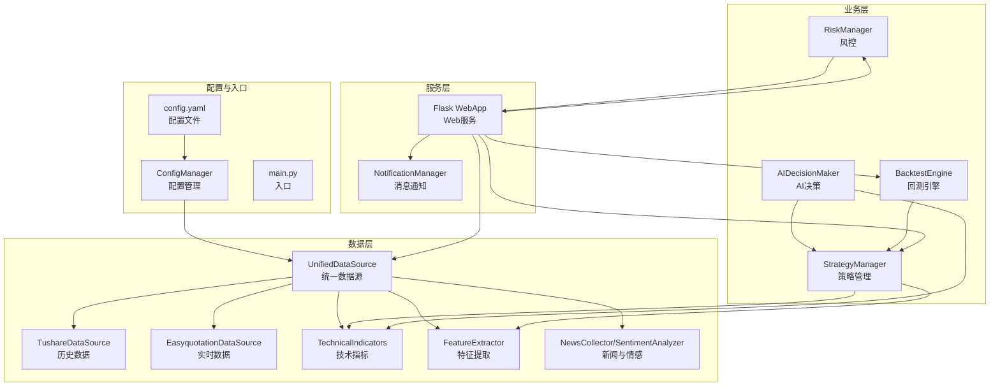
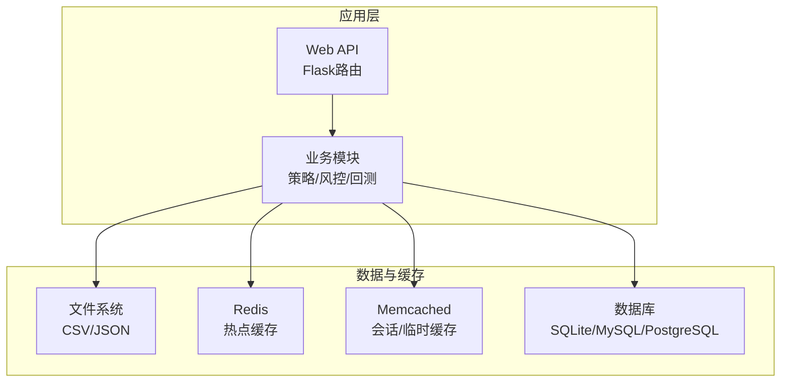
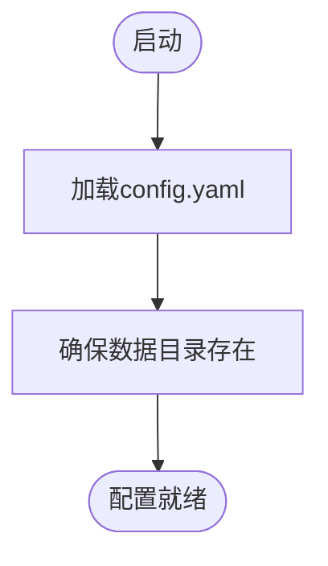
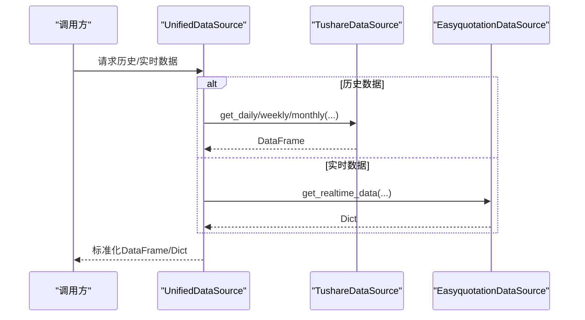
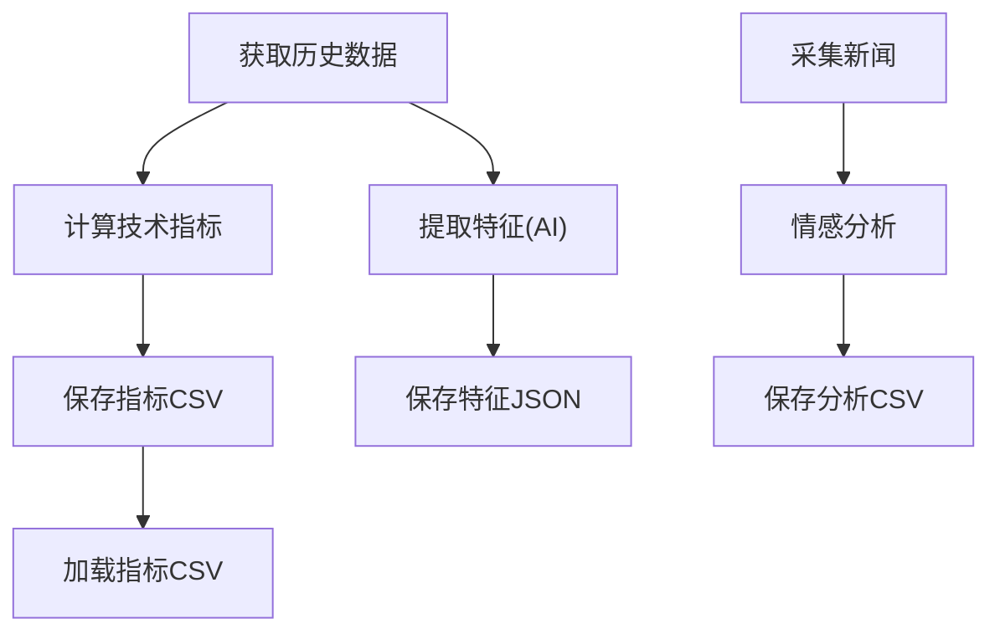
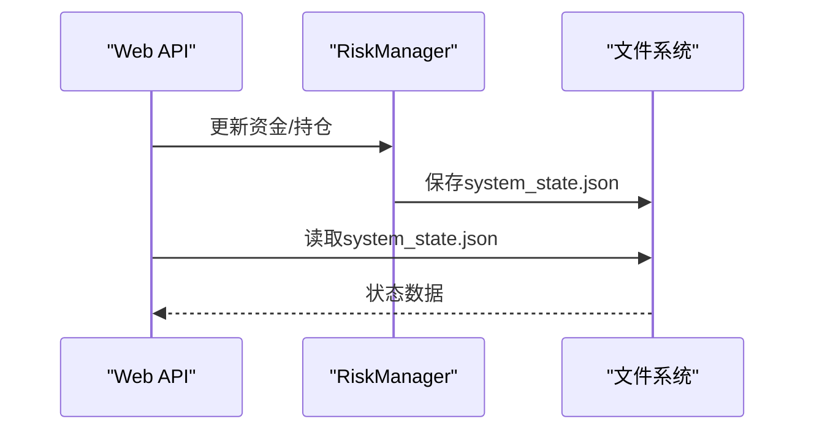
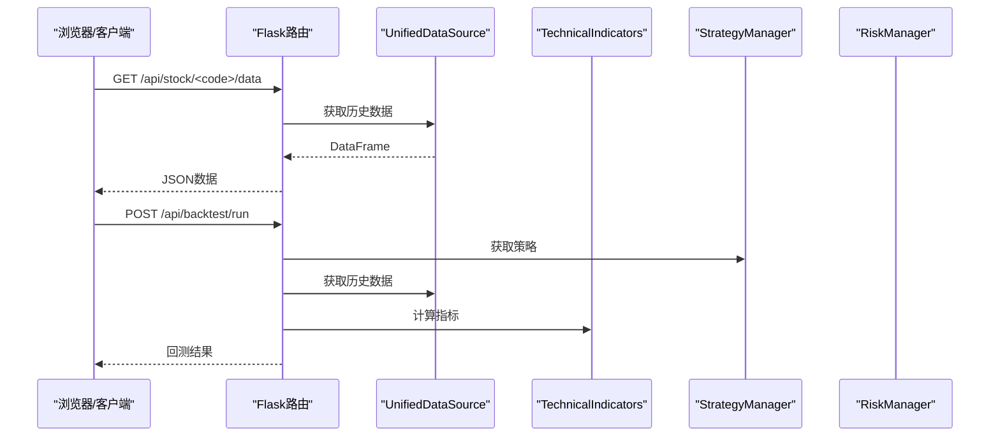
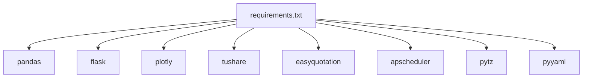

# 数据库和缓存配置

<cite>
**本文档引用的文件**
- [config.yaml](file://config.yaml)
- [quant_system/config_manager.py](file://quant_system/config_manager.py)
- [quant_system/data_source.py](file://quant_system/data_source.py)
- [quant_system/web_app.py](file://quant_system/web_app.py)
- [quant_system/indicators.py](file://quant_system/indicators.py)
- [quant_system/feature_extractor.py](file://quant_system/feature_extractor.py)
- [quant_system/news_collector.py](file://quant_system/news_collector.py)
- [quant_system/risk_manager.py](file://quant_system/risk_manager.py)
- [quant_system/strategy.py](file://quant_system/strategy.py)
- [quant_system/notification.py](file://quant_system/notification.py)
- [requirements.txt](file://requirements.txt)
</cite>

## 目录
1. [简介](#简介)
2. [项目结构](#项目结构)
3. [核心组件](#核心组件)
4. [架构总览](#架构总览)
5. [详细组件分析](#详细组件分析)
6. [依赖分析](#依赖分析)
7. [性能考虑](#性能考虑)
8. [故障排查指南](#故障排查指南)
9. [结论](#结论)
10. [附录](#附录)

## 简介
本指南面向vibequation量化交易系统，聚焦数据库与缓存配置的专业实践。通过对现有代码的深入分析，明确系统当前采用的“文件系统+内存”的数据持久化与缓存模式，并给出针对SQLite、MySQL、PostgreSQL及Redis、Memcached的安装配置建议、连接池与事务优化、缓存策略与失效机制、备份与恢复方案以及性能监控方法。由于当前仓库未包含数据库驱动或缓存客户端依赖，本指南提供通用工程化最佳实践，便于按需扩展接入。

## 项目结构
vibequation采用模块化组织，核心数据流围绕配置中心、数据源、指标计算、回测引擎、风险控制与Web服务展开。数据持久化主要通过CSV/JSON文件实现，系统状态通过JSON文件进行轻量级持久化。

**图表来源**
- [config.yaml:1-88](file://config.yaml#L1-L88)
- [quant_system/config_manager.py:12-178](file://quant_system/config_manager.py#L12-L178)
- [quant_system/data_source.py:24-423](file://quant_system/data_source.py#L24-L423)
- [quant_system/indicators.py:21-500](file://quant_system/indicators.py#L21-L500)
- [quant_system/feature_extractor.py:99-405](file://quant_system/feature_extractor.py#L99-L405)
- [quant_system/news_collector.py:24-465](file://quant_system/news_collector.py#L24-L465)
- [quant_system/risk_manager.py:47-404](file://quant_system/risk_manager.py#L47-L404)
- [quant_system/strategy.py:150-556](file://quant_system/strategy.py#L150-L556)
- [quant_system/web_app.py:1-1126](file://quant_system/web_app.py#L1-L1126)
- [quant_system/notification.py:84-301](file://quant_system/notification.py#L84-L301)

**章节来源**
- [config.yaml:1-88](file://config.yaml#L1-L88)
- [quant_system/config_manager.py:12-178](file://quant_system/config_manager.py#L12-L178)

## 核心组件
- 配置中心：集中管理API令牌、数据目录、回测参数、风控阈值、Web服务与日志等配置项。
- 数据源层：封装Tushare与Easyquotation，提供历史与实时数据获取；统一标准化数据接口。
- 指标与特征：计算技术指标并持久化；结合新闻情感与AI特征提取。
- 风控与策略：基于配置的风控检查与策略执行。
- Web服务：提供可视化界面与REST API，支持回测、图表与风控查询。
- 系统状态：通过JSON文件进行轻量持久化（如资金、持仓、风控设置）。

**章节来源**
- [quant_system/config_manager.py:12-178](file://quant_system/config_manager.py#L12-L178)
- [quant_system/data_source.py:24-423](file://quant_system/data_source.py#L24-L423)
- [quant_system/indicators.py:21-500](file://quant_system/indicators.py#L21-L500)
- [quant_system/feature_extractor.py:99-405](file://quant_system/feature_extractor.py#L99-L405)
- [quant_system/news_collector.py:24-465](file://quant_system/news_collector.py#L24-L465)
- [quant_system/risk_manager.py:47-404](file://quant_system/risk_manager.py#L47-L404)
- [quant_system/strategy.py:150-556](file://quant_system/strategy.py#L150-L556)
- [quant_system/web_app.py:1-1126](file://quant_system/web_app.py#L1-L1126)

## 架构总览
系统当前以文件系统作为“数据库”与“缓存”，通过配置中心统一管理路径与参数。若需引入传统数据库与外部缓存，建议遵循以下扩展原则：
- 数据库：仅在需要强一致、复杂查询与事务时引入；否则维持现有文件系统以降低复杂度。
- 缓存：Redis/Memcached用于热点指标、回测中间结果与会话状态缓存，提升读性能。
- 连接池：数据库与缓存均应启用连接池，设置合理的最大连接数与超时。
- 事务：对写入密集场景使用事务，保证指标与特征的一致性。
- 备份：定期导出CSV/JSON与快照，支持快速恢复。

[此图为概念性架构示意，不直接映射具体源码文件]

## 详细组件分析

### 配置管理与数据目录
- 配置文件集中管理：令牌、数据目录、回测与风控参数、Web服务与日志等。
- 目录自动创建：启动时确保历史、实时、指标、特征、新闻、回测等目录存在。
- 关键配置键：tokens.*、data_storage.*、backtest.*、risk_management.*、web.*、logging.*。

**图表来源**
- [config.yaml:1-88](file://config.yaml#L1-L88)
- [quant_system/config_manager.py:28-55](file://quant_system/config_manager.py#L28-L55)

**章节来源**
- [config.yaml:1-88](file://config.yaml#L1-L88)
- [quant_system/config_manager.py:28-55](file://quant_system/config_manager.py#L28-L55)

### 数据源与文件持久化
- 历史数据：TushareDataSource封装日线/周线/月线获取，支持增量更新与去重合并，本地CSV缓存。
- 实时数据：EasyquotationDataSource封装新浪/腾讯等源，按时间戳落盘。
- 统一接口：UnifiedDataSource标准化返回格式，便于上层使用。

**图表来源**
- [quant_system/data_source.py:300-423](file://quant_system/data_source.py#L300-L423)

**章节来源**
- [quant_system/data_source.py:43-298](file://quant_system/data_source.py#L43-L298)

### 技术指标与特征缓存
- 指标缓存：技术指标计算完成后保存为CSV，按代码+频率命名，支持加载与增量更新。
- 特征缓存：特征提取完成后保存为JSON，便于AI分析复用。
- 新闻情感：新闻采集与情感分析结果分别保存CSV与分析结果CSV。

**图表来源**
- [quant_system/indicators.py:275-328](file://quant_system/indicators.py#L275-L328)
- [quant_system/feature_extractor.py:285-320](file://quant_system/feature_extractor.py#L285-L320)
- [quant_system/news_collector.py:156-202](file://quant_system/news_collector.py#L156-L202)

**章节来源**
- [quant_system/indicators.py:275-328](file://quant_system/indicators.py#L275-L328)
- [quant_system/feature_extractor.py:285-320](file://quant_system/feature_extractor.py#L285-L320)
- [quant_system/news_collector.py:156-202](file://quant_system/news_collector.py#L156-L202)

### 风控与系统状态持久化
- 风控参数：最大总仓位、单股仓位、止损/止盈比例。
- 系统状态：资金、可用现金、持仓信息持久化为JSON文件，支持加载与保存。

**图表来源**
- [quant_system/web_app.py:996-1019](file://quant_system/web_app.py#L996-L1019)
- [quant_system/risk_manager.py:320-349](file://quant_system/risk_manager.py#L320-L349)

**章节来源**
- [quant_system/risk_manager.py:47-349](file://quant_system/risk_manager.py#L47-L349)
- [quant_system/web_app.py:996-1019](file://quant_system/web_app.py#L996-L1019)

### Web服务与API
- 提供股票数据、指标、图表、策略、回测、风控、新闻与情感等API。
- 支持一键更新数据、策略创建/更新/删除、AI决策等。

**图表来源**
- [quant_system/web_app.py:61-373](file://quant_system/web_app.py#L61-L373)
- [quant_system/data_source.py:300-356](file://quant_system/data_source.py#L300-L356)
- [quant_system/indicators.py:188-273](file://quant_system/indicators.py#L188-L273)
- [quant_system/strategy.py:409-424](file://quant_system/strategy.py#L409-L424)

**章节来源**
- [quant_system/web_app.py:61-373](file://quant_system/web_app.py#L61-L373)

## 依赖分析
- Python依赖集中在数据处理、Web框架、可视化、HTTP请求、定时任务与配置解析等模块。
- 当前未发现数据库驱动或缓存客户端依赖，系统通过文件系统实现数据持久化。

**图表来源**
- [requirements.txt:1-33](file://requirements.txt#L1-L33)

**章节来源**
- [requirements.txt:1-33](file://requirements.txt#L1-L33)

## 性能考虑
- 文件系统读写：建议将高频访问的指标与特征文件置于SSD，合理拆分文件大小，避免单文件过大。
- 并发与锁：多进程/多线程写入同一文件时需加锁或采用追加写入+定期合并策略。
- 缓存命中：Redis/Memcached中缓存最近N天的指标与回测中间结果，设置合理TTL。
- 网络限速：Tushare请求需遵守限流，避免触发风控导致失败。
- 内存占用：批量处理时注意分批读取与释放，避免内存峰值过高。
- 日志轮转：按大小轮转，避免日志文件无限增长。

[本节为通用性能建议，不直接分析具体源码文件]

## 故障排查指南
- 配置缺失：检查config.yaml中令牌与数据目录配置，确认目录存在。
- 数据为空：确认历史数据是否已缓存，必要时强制刷新；检查网络与API限流。
- 指标计算失败：检查输入数据类型与缺失值，确认日期排序与去重逻辑。
- Web接口报错：查看日志级别与文件路径，定位具体异常堆栈。
- 消息推送失败：确认PushPlus Token配置，检查网络与API返回码。

**章节来源**
- [config.yaml:1-88](file://config.yaml#L1-L88)
- [quant_system/config_manager.py:28-55](file://quant_system/config_manager.py#L28-L55)
- [quant_system/data_source.py:133-135](file://quant_system/data_source.py#L133-L135)
- [quant_system/web_app.py:79-81](file://quant_system/web_app.py#L79-L81)

## 结论
vibequation当前采用“文件系统+内存”的轻量级数据与缓存方案，具备部署简单、维护成本低的优势。若业务规模扩大、并发与一致性需求提升，可按本指南引入数据库与缓存，遵循连接池、事务与缓存策略设计，确保系统在性能与可靠性之间取得平衡。

[本节为总结性内容，不直接分析具体源码文件]

## 附录

### 数据库与缓存配置建议（通用工程实践）

- SQLite
  - 适用场景：开发测试、小规模生产、无需高并发。
  - 连接池：使用SQLAlchemy连接池或sqlite3内置连接池，设置max_overflow与pool_recycle。
  - 事务：对批量写入使用事务，减少fsync开销；读写分离可选。
  - 性能：启用WAL模式，合理索引；避免大事务与长事务。
  - 备份：定期导出CSV/SQL快照，支持增量备份。

- MySQL
  - 适用场景：中大型生产，需要强一致与复杂查询。
  - 连接池：使用连接池（如SQLAlchemy pool），设置最大连接数、空闲回收。
  - 事务隔离：READ-COMMITTED或REPEATABLE-READ，按业务权衡一致性与并发。
  - 性能：分区表、索引优化、慢查询日志；主从复制与binlog备份。
  - 备份：mysqldump/Percona XtraBackup，定期全备+增量备份。

- PostgreSQL
  - 适用场景：高并发写入、复杂分析、JSON/数组等半结构化数据。
  - 连接池：pgbouncer或应用侧连接池；设置max_connections与statement_timeout。
  - 事务：MVCC天然支持高并发；注意长事务影响。
  - 性能：分区、并行查询、统计信息更新；逻辑复制或物理复制。
  - 备份：pg_dump/物理备份，归档WAL日志。

- Redis
  - 适用场景：指标缓存、会话存储、发布订阅。
  - 持久化：RDB快照+AOF日志，或AOF重写策略。
  - 内存管理：maxmemory+淘汰策略（LRU/LFU），合理过期时间。
  - 集群：主从复制或哨兵，Redis Cluster或Codis；注意数据分片与热点。
  - 性能：pipeline批量命令，避免bigkeys；慢查询日志分析。

- Memcached
  - 适用场景：简单KV缓存、会话共享。
  - 内存管理：jemalloc优化，合理设置内存上限与item大小。
  - 集群：多节点分片，一致性哈希；注意节点故障与数据迁移。

### 数据备份与恢复
- 备份策略：每日全备+每小时增量备份；指标与特征文件定期导出为CSV/Parquet。
- 恢复流程：验证备份完整性，按时间点恢复；先恢复元数据再恢复业务数据。
- 灾难恢复：异地容灾，自动化切换与演练；确保API令牌与密钥安全。

### 缓存策略与失效机制
- 策略设计：多级缓存（本地内存+Redis/Memcached），热点数据优先。
- 失效机制：TTL+版本号，写更新时主动失效；异步预热与懒加载。
- 性能监控：命中率、延迟、内存使用、QPS与错误率；设置告警阈值。

[本节为通用工程实践，不直接分析具体源码文件]